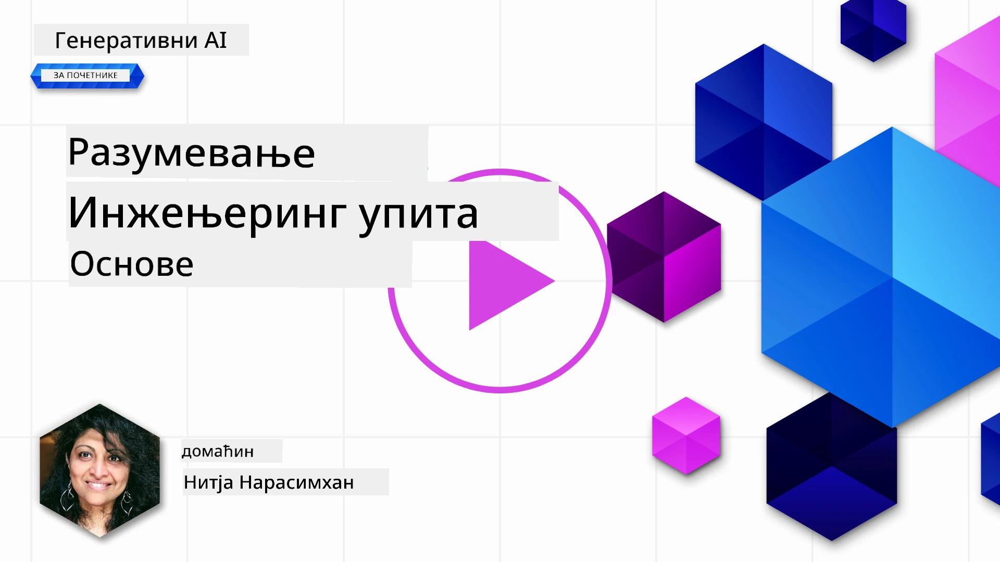
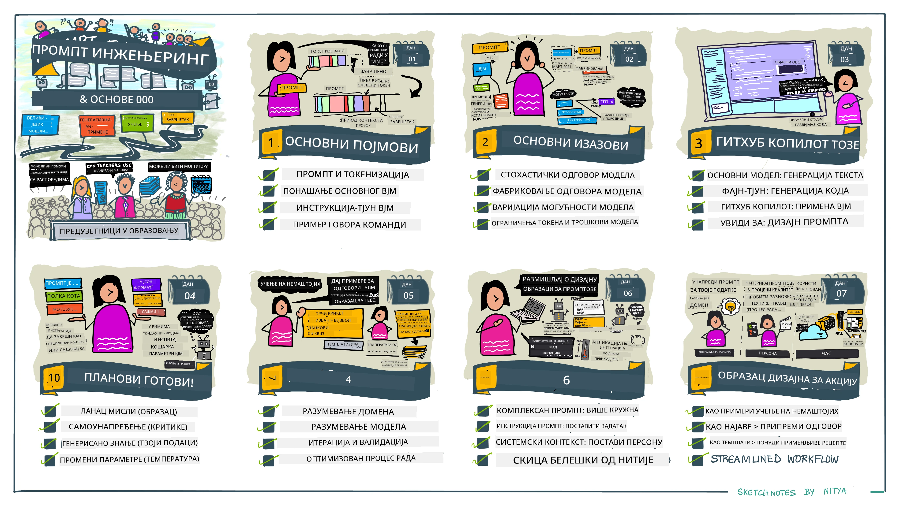
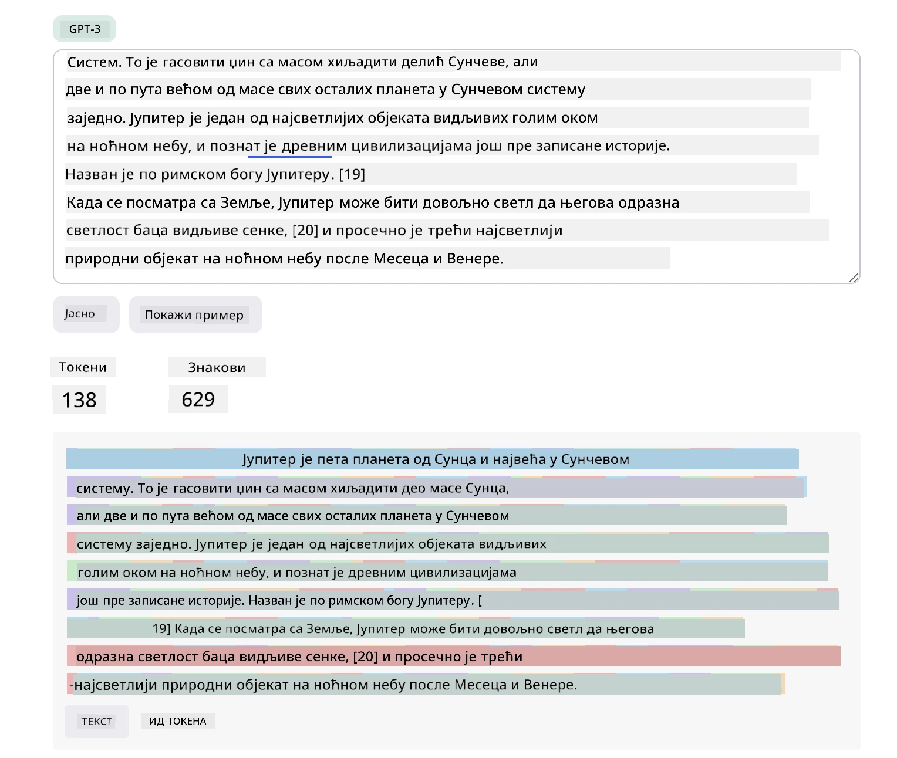
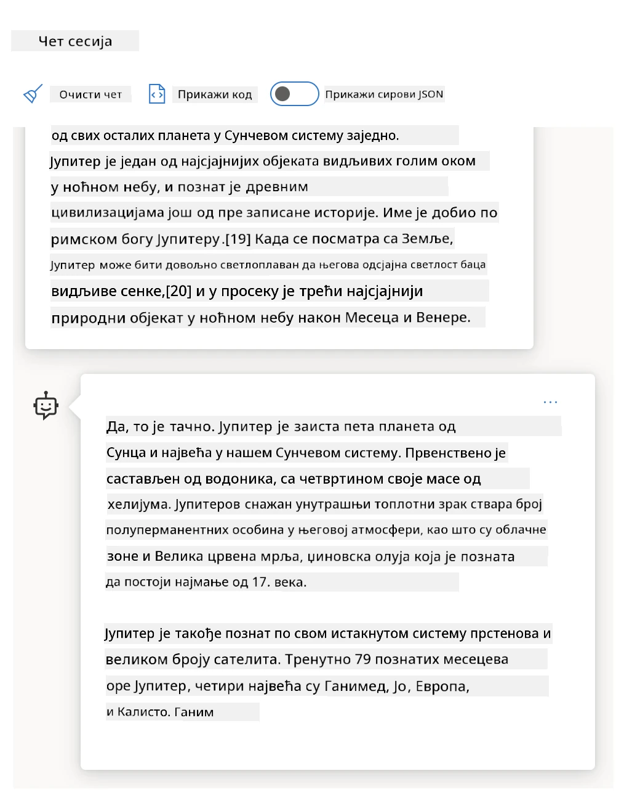
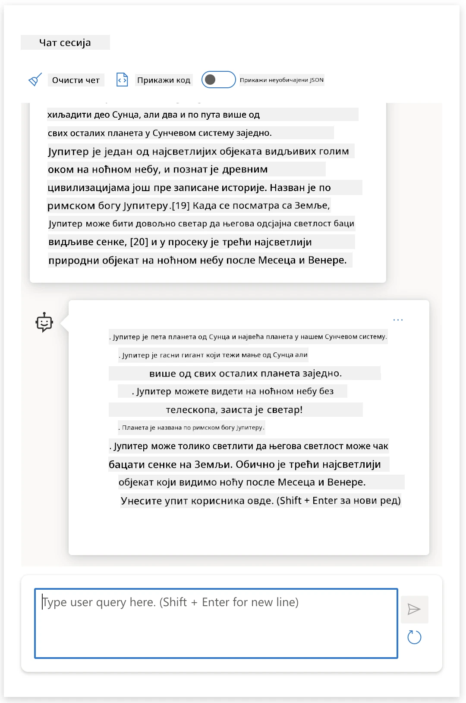
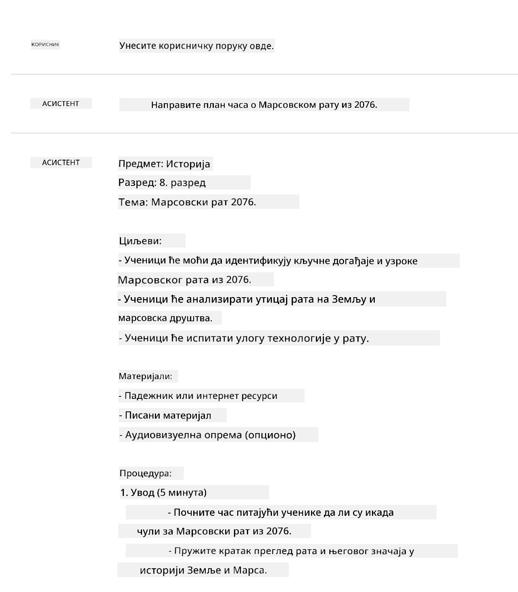
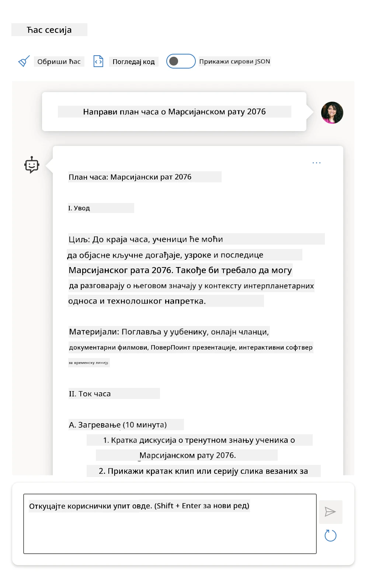
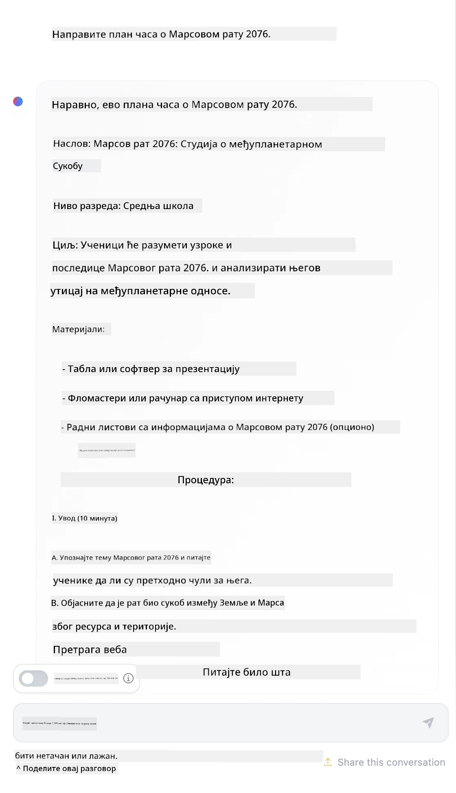

# Основи инжењеринга упита

[](https://youtu.be/GElCu2kUlRs?si=qrXsBvXnCW12epb8)

## Увод
Овај модул покрива основне појмове и технике за креирање ефикасних упита у генеративним моделима вештачке интелигенције. Начин на који написате свој упит за LLM такође је важан. Пажљиво креирани упит може постићи бољи квалитет одговора. Али шта тачно значе термини као што су _упит_ и _инжењеринг упита_? И како да побољшам унос упита који шаљем LLM-у? Ово су питања на која ћемо покушати да одговоримо у овом и наредном поглављу.

_Генеративна вештачка интелигенција_ је способна да креира нови садржај (нпр. текст, слике, аудио, код итд.) као одговор на корисничке захтеве. Ово постиже коришћењем _Великих језичких модела_ као што је OpenAI-ев GPT ("Generative Pre-trained Transformer") серијал који је обучен за коришћење природног језика и кода.

Корисници сада могу да комуницирају са овим моделима користећи познате парадигме попут ћаскања, без потребе за техничким знањем или обуком. Модели су _упитно засновани_ - корисници шаљу текстуални унос (упит) и добијају одговор вештачке интелигенције (комплетирање). Потом могу да "разговарају са АИ" итеративно, у више корака, усавршавајући свој упит док одговор не задовољи њихова очекивања.

"Упити" постају примарни _програмски интерфејс_ за апликације генеративне АИ, говоре моделима шта да раде и утичу на квалитет враћених одговора. "Инжењеринг упита" је брзо растућа област изучавања која је фокусирана на _дизајн и оптимизацију_ упита ради доследног и квалитетног одговора у великом обиму.

## Циљеви учења

У овој лекцији ћемо научити шта је инжењеринг упита, зашто је важан и како можемо креирати ефикасније упите за одређени модел и циљ апликације. Разумећемо основне појмове и добре праксе инжењеринга упита - и научити о интерактивном окружењу Јупитер бележница „sandbox“ где можемо видети примену ових појмова на стварним примерима.

До краја ове лекције моћи ћемо да:

1. Објаснимо шта је инжењеринг упита и зашто је важан.
2. Опишемо компоненте упита и како се користе.
3. Научимо најбоље праксе и технике за инжењеринг упита.
4. Применимо научене технике на стварним примерима, користећи OpenAI крајњу тачку.

## Кључни појмови

Инжењеринг упита: Практична примена дизајнирања и усавршавања уноса да би се усмерили АИ модели ка произвођењу жељених резултата.
Токенизација: Процес претварања текста у мање јединице, зване токени, које модел може разумети и обрадити.
Инструкцијски унапређени LLM: Велики језички модели који су фино подешени са специфичним упутствима ради побољшања тачности и релевантности одговора.

## Sandbox за учење

Инжењеринг упита је тренутно више уметност него наука. Најбољи начин да побољшамо интуицију за то је да _више вежбамо_ и усвојимо приступ проба и грешака који комбинује стручност у домену примене са препорученим техникама и оптимизацијама специфичним за модел.

Јупитер бележница која прати ову лекцију пружа _sandbox_ окружење у којем можете пробати оно што научите - у току учења или као део изазова кода на крају. Да бисте извршили вежбе, потребно вам је:

1. **Azure OpenAI API кључ** - сервисна крајња тачка за распоређени LLM.
2. **Питхон извршно окружење** - у коме се бележница може покренути.
3. **Локалне променљиве окружења** - _завршите кораке [SETUP](./../00-course-setup/02-setup-local.md?WT.mc_id=academic-105485-koreyst) сада да бисте били спремни_.

Бележница долази са _почетним_ вежбама - али се подстиче да додате сопствене _Markdown_ (опис) и _Code_ (захтеви упита) секције како бисте испробали више примера или идеја - и изградили интуицију за дизајн упита.

## Илустровани водич

Желите да добијете ширу слику о темама које ова лекција покрива пре него што кренете? Погледајте илустровани водич који вам даје утисак о главним темама и кључним поукама за разматрање у свакој од њих. План лекције вас води од разумевања основних појмова и изазова ка њиховом превазилажењу применом релевантних техника и најбољих пракси инжењеринга упита. Имајте у виду да одељак „Напредне технике“ у овом водичу односи се на садржај покривен у _следећем_ поглављу овог курикулума.



## Наш стартап

Хајде сада да причамо о томе како се _ова тема_ односи на мисију нашег стартапа да [донесемо иновације у образовање помоћу АИ](https://educationblog.microsoft.com/2023/06/collaborating-to-bring-ai-innovation-to-education?WT.mc_id=academic-105485-koreyst). Желимо да изградимо апликације покретане вештачком интелигенцијом за _персонализовано учење_ - па размислимо како различити корисници наше апликације могу "дизајнирати" упите:

- **Администратори** могу тражити од АИ да _анализира податке о наставном плану да идентификује празнине у покривености_. АИ може сумирати резултате или их визуелизовати помоћу кода.
- **Наставници** могу тражити од АИ да _генерише план часа за одређену публику и тему_. АИ може саставити персонализовани план у одређеном формату.
- **Студенти** могу тражити од АИ да их _подучава у тешкој области_. АИ сада може водити студенте путем лекција, наговештаја и примера прилагођених њиховом нивоу.

Ово је само врх леденог брега. Погледајте [Упите за образовање](https://github.com/microsoft/prompts-for-edu/tree/main?WT.mc_id=academic-105485-koreyst) - библиотеку упита отвореног кода коју уређују стручњаци за образовање - да бисте добили шире разумевање могућности! _Пробајте да покренете неке од тих упита у sandbox-у или користећи OpenAI Playground да видите шта се дешава!_

<!--
LESSON TEMPLATE:
This unit should cover core concept #1.
Reinforce the concept with examples and references.

CONCEPT #1:
Prompt Engineering.
Define it and explain why it is needed.
-->

## Шта је инжењеринг упита?

Почели смо ову лекцију дефинишући **инжењеринг упита** као процес _дизајнирања и оптимизације_ текстуалних уноса (упита) да се обезбеде доследни и квалитетни одговори (комплетирања) за дати циљ апликације и модел. Ово можемо посматрати као двостепени процес:

- _дизајнирање_ почетног упита за одређени модел и циљ
- _усавршавање_ упита итеративно да се побољша квалитет одговора

Ово је неизбежно процес проба и грешака који захтева корисничку интуицију и труд да би се постигли оптимални резултати. Па зашто је важно? Да бисмо одговорили на то питање, прво треба да разумемо три појма:

- _Токенизација_ = како модел "види" упит
- _Основни LLM-ови_ = како основни модел "обрађује" упит
- _Инструкцијски унапређени LLM-ови_ = како модел сада може "видети задатке"

### Токенизација

LLM види упите као _низ токена_ где различити модели (или верзије модела) могу токенизовати исти упит на различите начине. Пошто су LLM обучени на токенима (а не на сировом тексту), начин на који се упити токенизују има директан утицај на квалитет генерисаног одговора.

Да бисте стекли интуицију о томе како токенизација функционише, испробајте алате попут [OpenAI Tokenizer](https://platform.openai.com/tokenizer?WT.mc_id=academic-105485-koreyst) приказаног испод. Копирајте свој упит - и погледајте како се он конвертује у токене, обраћајући пажњу на то како се обрађују размаке и знакови интерпункције. Имајте у виду да овај пример приказује старији LLM (GPT-3) - па ће можда покушај са новијим моделом дати другачији резултат.



### Пojам: Основни модели

Када се упит токенизује, примарна функција ["Основног LLM"](https://blog.gopenai.com/an-introduction-to-base-and-instruction-tuned-large-language-models-8de102c785a6?WT.mc_id=academic-105485-koreyst) (или основног модела) је да предвиди следећи токен у низу. Пошто су LLM обучени на масивним текстуалним скупова података, имају добру свест о статистичким везама између токена и могу са одређеном сигурношћу направити ту претпоставку. Имајте у виду да они не разумеју _значење_ речи у упиту или токену; они само виде образац који могу "допунити" својом следећом предвиђањем. Могу наставити са предвиђањем низа док их корисник не прекине или се не испуни неки унапред дефинисани услов.

Желите да видите како ради допуна текста заснована на упиту? Унесите горе наведени упит у Azure OpenAI Studio [_Chat Playground_](https://oai.azure.com/playground?WT.mc_id=academic-105485-koreyst) са подразумеваним подешавањима. Систем је конфигурисан да третира упите као захтеве за информацијама - па бисте требали добити допуну која задовољава овај контекст.

Али шта ако корисник жели да види нешто конкретно што испуњава неки критеријум или циљ задаћег задатка? Ту у игру ступају _инструкцијски унапређени_ LLM-ови.



### Пojам: Инструкцијски унапређени LLM-ови

[Инструкцијски унапређени LLM](https://blog.gopenai.com/an-introduction-to-base-and-instruction-tuned-large-language-models-8de102c785a6?WT.mc_id=academic-105485-koreyst) почиње са основним моделом и фино подешава га уз помоћ примера или парова улаз/излаз (нпр. више корака у „порукама“) који могу садржати јасна упутства - а одговор АИ покушава да прати то упутство.

Ово користи технике као што је Појачано учење са људском контролом (RLHF) које могу тренирати модел да _прати упутства_ и _учи из повратних информација_ тако да производи одговоре који су боље прилагођени практичним применама и релевантнији корисничким циљевима.

Хајде да пробамо - вратите се горе наведеном упиту, али сада промените _системску поруку_ да обезбедите следеће упутство као контекст:

> _Сажмите садржај који вам се достави за ученика другог разреда. Држите резултат у једном Пасусу са 3-5 наведених тачака._

Видите како је резултат сада подешен да одражава жељени циљ и формат? Наставник сада може директно употребити овај одговор у својим слајдовима за тај час.



## Зашто нам треба инжењеринг упита?

Сада када знамо како LLM обрађују упите, хајде да разговарамо о томе _зашто_ нам треба инжењеринг упита. Одговор лежи у томе што тренутни LLM представљају низ изазова због којих је теже постићи _поуздане и доследне одговоре_ без улагања у конструкцију и оптимизацију упита. На пример:

1. **Одговори модела су стохастични.** _Исти упит_ ће вероватно произвести различите одговоре са различитим моделима или верзијама модела. Чак може производити различите резултате са _истим моделом_ у различито време. _Технике инжењеринга упита нам могу помоћи да минимизирамо ове варијације пружајући боље смернице_.

1. **Модели могу да измишљају одговоре.** Модели су обучени на _великим али ограниченим_ скуповима података, што значи да немају знање о концептима изван тог обима обуке. Као резултат тога, могу произвести одговоре који су нетачни, измишљени или директно супротни познатим чињеницама. _Технике инжењеринга упита помажу корисницима да идентификују и ублаже такве измишљотине, нпр. питајући АИ за изворе или образложења_.

1. **Капацитети модела варирају.** Новији модели или генерације модела имају богатије могућности али и доносе јединствене специфичности и компромисе у трошковима и комплексности. _Инжењеринг упита нам може помоћи да развијемо најбоље праксе и токове рада који апстрахују разлике и прилагођавају се захтевима специфичним за модел на скалабилан и беспрекоран начин_.

Погледајмо то у пракси у OpenAI или Azure OpenAI Playground-у:

- Користите исти упит са различитим распоређеним LLM (нпр. OpenAI, Azure OpenAI, Hugging Face) - да ли сте видели варијације?
- Користите исти упит више пута са _истим_ LLM распоређивањем (нпр. Azure OpenAI playground) - како су се разликовале те варијације?

### Пример измишљотина

У овом курсу користимо термин **„измишљотина“** да опишемо феномен када LLM понекад генеришу фактички нетачне информације услед ограничења у својој обуци или другим ограничењима. Такође сте можда чули да се ово у популарним чланцима или истраживачким радовима назива _„халуцинације“_. Међутим, снажно препоручујемо употребу термина _„измишљотина“_ да случајно не антропоморфизујемо понашање приписујући људску црту машински покренутом исходу. Ово такође подржава [Одговорни АИ упутства](https://www.microsoft.com/ai/responsible-ai?WT.mc_id=academic-105485-koreyst) са аспекта терминологије, уклањајући термине који могу бити увредљиви или неинклузивни у неким контекстима.

Желите да стекнете утисак како измишљотине функционишу? Замислите упит који АИ упућује да генерише садржај о неистинској теми (како би се осигурало да тема није у скупу за обуку). На пример - ја сам покушао овај упит:

> **Упит:** направи план часа о Марсовском рату 2076. године.
Веб претрага ми је показала да постоје фиктивни рачуни (нпр. телевизијске серије или књиге) о марсовским ратовима - али ниједан из 2076. Здрав разум нам такође говори да је 2076. _у будућности_ и стога не може бити повезан са стварним догађајем.

Па шта се дешава када покренемо овај упит код различитих пружалаца LLM услуга?

> **Одговор 1**: OpenAI Playground (GPT-35)



> **Одговор 2**: Azure OpenAI Playground (GPT-35)



> **Одговор 3**: : Hugging Face Chat Playground (LLama-2)



Као што се и очекивало, сваки модел (или верзија модела) производи благо различите одговоре захваљујући стохастичком понашању и варијацијама у капацитету модела. На пример, један модел је усмерен ка публици осмог разреда док други претпоставља средњошколца. Али сва три модела су генерисала одговоре који би могли убедити неискусног корисника да је догађај стварan.

Технике инжењеринга упита попут _метаупитања_ и _конфигурације температуре_ могу у некој мери смањити измишљања модела. Нове _архитектуре_ инжењеринга упита такође беспрекорно уводе нове алате и технике у ток упита како би ублажиле или смањиле неке од ових ефеката.

## Студија случаја: GitHub Copilot

Завршимо овај одељак прегледом како се инжењеринг упита користи у стварним решењима посматрајући једну Студију случаја: [GitHub Copilot](https://github.com/features/copilot?WT.mc_id=academic-105485-koreyst).

GitHub Copilot је ваш "AI Пар програмер" - претвара текстуалне упите у комплетирања кода и интегрисан је у ваше развојно окружење (нпр. Visual Studio Code) ради беспрекорног корисничког искуства. Као што је документовано у низу блогова у наставку, најранија верзија била је заснована на OpenAI Codex моделу - а инжењери су брзо увидели потребу да се модел фино подеси и развију боље технике инжењеринга упита како би се побољшао квалитет кода. У јулу су [премијерно представили побољшани AI модел који иде даље од Codex-а](https://github.blog/2023-07-28-smarter-more-efficient-coding-github-copilot-goes-beyond-codex-with-improved-ai-model/?WT.mc_id=academic-105485-koreyst) за још брже предлоге.

Прочитајте чланке по реду да бисте пратити њихово путовање учења.

- **мај 2023** | [GitHub Copilot боље разуме ваш код](https://github.blog/2023-05-17-how-github-copilot-is-getting-better-at-understanding-your-code/?WT.mc_id=academic-105485-koreyst)
- **мај 2023** | [Изнутра GitHub: рад са LLM-овима иза GitHub Copilot-а](https://github.blog/2023-05-17-inside-github-working-with-the-llms-behind-github-copilot/?WT.mc_id=academic-105485-koreyst).
- **јун 2023** | [Како писати боље упите за GitHub Copilot](https://github.blog/2023-06-20-how-to-write-better-prompts-for-github-copilot/?WT.mc_id=academic-105485-koreyst).
- **јул 2023** | [.. GitHub Copilot иде даље од Codex-а са побољшаним AI моделом](https://github.blog/2023-07-28-smarter-more-efficient-coding-github-copilot-goes-beyond-codex-with-improved-ai-model/?WT.mc_id=academic-105485-koreyst)
- **јул 2023** | [Водич програмера за инжењеринг упита и LLM-ове](https://github.blog/2023-07-17-prompt-engineering-guide-generative-ai-llms/?WT.mc_id=academic-105485-koreyst)
- **сеп 2023** | [Како изградити enterprise LLM апликацију: лекције из GitHub Copilot-а](https://github.blog/2023-09-06-how-to-build-an-enterprise-llm-application-lessons-from-github-copilot/?WT.mc_id=academic-105485-koreyst)

Такође можете прегледати њихов [Инжењерски блог](https://github.blog/category/engineering/?WT.mc_id=academic-105485-koreyst) за више постова попут [овог](https://github.blog/2023-09-27-how-i-used-github-copilot-chat-to-build-a-reactjs-gallery-prototype/?WT.mc_id=academic-105485-koreyst) који показује како се ови модели и технике _примењују_ за вођење реалних примена.

---

<!--
LESSON TEMPLATE:
This unit should cover core concept #2.
Reinforce the concept with examples and references.

CONCEPT #2:
Prompt Design.
Illustrated with examples.
-->

## Конструкција упита

Видели смо зашто је инжењеринг упита важан - сада хајде да разумемо како се упити _конструишу_ како бисмо могли да проценимо различите технике за ефикаснији дизајн упита.

### Основни упит

Почнимо са основним упитом: текстуалним уносом послатим моделу без другог контекста. Ево примера - када пошаљемо прве неколико речи америчке химне OpenAI [Completion API-ју](https://platform.openai.com/docs/api-reference/completions?WT.mc_id=academic-105485-koreyst) он тренутно _комплетира_ одговор следећим линијама, илуструјући основно понашање предвиђања.

| Упит (Унос)         | Комплетирање (Излаз)                                                                                                                         |
| :------------------- | :------------------------------------------------------------------------------------------------------------------------------------------ |
| Oh say can you see   | Изгледа да почињете текст песме "The Star-Spangled Banner," националне химне Сједињених Држава. Пуна слова су ...                           |

### Комплексни упит

Сада додајмо контекст и упутства том основном упиту. [Chat Completion API](https://learn.microsoft.com/azure/ai-services/openai/how-to/chatgpt?WT.mc_id=academic-105485-koreyst) нам омогућава да конструишемо комплексни упит као збир _порука_ са:

- паровима улаз/излаз који одражавају _кориснички_ унос и _асистентов_ одговор.
- системском поруком која поставља контекст за понашање или личност асистента.

Захтев је сада у доњем облику, где _токенизација_ ефикасно хвата релевантне информације из контекста и разговора. Сада променa системског контекста може бити подједнако утицајна на квалитет комплетирања као и уноси корисника.

```python
response = openai.chat.completions.create(
    model="gpt-3.5-turbo",
    messages=[
        {"role": "system", "content": "You are a helpful assistant."},
        {"role": "user", "content": "Who won the world series in 2020?"},
        {"role": "assistant", "content": "The Los Angeles Dodgers won the World Series in 2020."},
        {"role": "user", "content": "Where was it played?"}
    ]
)
```

### Упутство упита

У горњим примерима, кориснички упит је био једноставна текстуална претрага која се може тумачити као захтев за информацијом. Са _инструкцијским_ упитима, можемо користити тај текст да прецизније задамо задатак, пружајући боље смернице АИ-ју. Ево примера:

| Упит (Унос)                                                                                                                                                                                                                          | Комплетирање (Излаз)                                                                                                  | Тип упутства       |
| :---------------------------------------------------------------------------------------------------------------------------------------------------------------------------------------------------------------------------------- | :--------------------------------------------------------------------------------------------------------------------- | :----------------- |
| Опиши Грађански рат                                                                                                                                                                                                                 | _вратио једноставан пасус_                                                                                            | Једноставно        |
| Опиши Грађански рат. Наведи кључне датуме и догађаје и опиши њихов значај                                                                                                                                                            | _вратио пасус након којег следи листа кључних датума догађаја са описима_                                            | Комплексно         |
| Опиши Грађански рат у 1 пасусу. Наведи 3 тачке са кључним датумима и њиховим значајем. Наведи још 3 тачке са кључним историјским личностима и њиховим доприносом. Врати излаз као JSON фајл                             | _враћа детаљније информације у текстуалном пољу, форматиран као JSON који можете копирати у фајл и проверити по потреби_ | Комплексно. Форматирано. |

## Примарни садржај

У горњим примерима, упит је и даље био релативно отворен, омогућавајући LLM-у да сам одреди који део свог претходно тренираног скупа података је релевантан. Са дизајн патерном _примарни садржај_, улазни текст се дели на два дела:

- инструкција (акција)
- релевантни садржај (који утиче на акцију)

Ево примера где је упутство "сумирајте ово у 2 реченице".

| Упит (Унос)                                                                                                                                                                                                                                                                                                                                                                                                                                                                                                                                                                                                                                                                                     | Комплетирање (Излаз)                                                                                                                                                                                                                                                                              |
| :------------------------------------------------------------------------------------------------------------------------------------------------------------------------------------------------------------------------------------------------------------------------------------------------------------------------------------------------------------------------------------------------------------------------------------------------------------------------------------------------------------------------------------------------------------------------------------------------------------------------------------------------------------------------------------------------- | :----------------------------------------------------------------------------------------------------------------------------------------------------------------------------------------------------------------------------------------------------------------------------------------------- |
| Јупитер је пета планета од Сунца и највећа у Сунчевом систему. То је гасовити гигант са масом хиљаду пута мањом од масе Сунца, али два и по пута већом од свих осталих планета у Сунчевом систему заједно. Јупитер је један од најсјајнијих објеката видљивих голим оком на ноћном небу, и познат је древним цивилизацијама још пре записане историје. Назван је по римском богу Јупитеру.[19] Када се гледа са Земље, Јупитер може бити довољно светло да његова рефлектована светлост баца видљиве сенке,[20] и у просеку је трећи најсјајнији природни објекат на ноћном небу после Месеца и Венере. <br/> **Сумирајте ово у 2 кратке реченице** | Јупитер, пета планета од Сунца, највећа је у Сунчевом систему и познат је као један од најсјајнијих објеката на ноћном небу. Назван по римском богу Јупитеру, то је гасовити гигант чија је маса два и по пута већа од свих осталих планета у Сунчевом систему заједно. |

Примарни садржај се може користити на различите начине ради ефикаснијих упутстава:

- **Примери** – уместо да моделу директно кажемо шта треба радити упутством, дајемо му примере шта треба радити и дозволимо му да закључи образац.
- **Наговештаји** – пратимо инструкцију са "наговештајем" који припрема комплетирање и усмерава модел ка релевантнијим одговорима.
- **Шаблони** – то су понављачки 'рецепти' за упите са местима за уметање (променљиве) које се могу прилагодити подацима за одређене случајеве употребе.

Хајде да их испитамо у пракси.

### Коришћење примера

Ово је приступ у којем користите примарни садржај да "нахраните модел" неколико примера траженог излаза за задату инструкцију и дозволите му да закључи образац траженог резултата. У зависности од броја примера који су дати, можемо имати zero-shot, one-shot, few-shot prompting итд.

Упит садржи три компонента:

- Опис задатка
- Неколико примера траженог излаза
- Почетак новог примера (који постаје имплицитни опис задатка)

| Тип учења    | Упит (Унос)                                                                                                                                            | Комплетирање (Излаз)         |
| :------------ | :------------------------------------------------------------------------------------------------------------------------------------------------------ | :---------------------------- |
| Zero-shot     | "Сунце сија". Преведи на шпански                                                                                                                       | "El Sol está brillando".      |
| One-shot      | "Сунце сија" => ""El Sol está brillando". <br> "Хладно и ветровито је" =>                                                                                | "Es un día frío y ventoso".   |
| Few-shot      | Играч је трчао кроз базе => Бејзбол <br/> Играч је избацио ас => Тенис <br/> Играч је погодио шестерку => Крикет <br/> Играч је урадио слем-дунк => | Кошарка                      |
|               |                                                                                                                                                         |                              |

Приметите како смо морали да пружимо експлицитну инструкцију ("Преведи на шпански") у zero-shot prompting-у, али се она закључује у one-shot примеру. Few-shot пример показује како додавање више примера омогућава моделима да праве тачније закључке без додатних упутстава.

### Наговештаји упита

Друга техника коришћења примарног садржаја је да се пруже _наговештаји_ уместо примера. У овом случају, дајемо моделу подстрек тако што га _покрећемо_ исечком који одражава жељени формат одговора. Модел онда "узима сигнал" да настави у том смеру.

| Број наговештаја | Упит (Унос)                                                                                                                                                                                                                                                                                                                                                                                                           | Комплетирање (Излаз)                                                                                                                                                                                                                                                                                   |
| :---------------- | :------------------------------------------------------------------------------------------------------------------------------------------------------------------------------------------------------------------------------------------------------------------------------------------------------------------------------------------------------------------------------------------------------------------ | :---------------------------------------------------------------------------------------------------------------------------------------------------------------------------------------------------------------------------------------------------------------------------------------------------- |
| 0                 | Јупитер је пета планета од Сунца и највећа у Сунчевом систему. То је гасовити гигант са масом хиљаду пута мањом од масе Сунца, али два и по пута већом од свих осталих планета у Сунчевом систему заједно. Јупитер је један од најсјајнијих објеката видљивих голим оком на ноћном небу, и познат је древним цивилизацијама још пре записане историје. <br/>**Сумирај ово**                                         | Јупитер је највећа планета у нашем Сунчевом систему и пета по удаљености од Сунца. Он је гасовити гигант са масом 1/1000 масе Сунца, али тежи више од свих осталих планета заједно. Древне цивилизације дуго знају за Јупитер и лако је видљив на ноћном небу. |
| 1              | Јупитер је пета планета од Сунца и највећа у Сунчевом систему. То је гасовити гигант са масом једна хиљадитина масе Сунца, али два и по пута већом од свих осталих планета у Сунчевом систему заједно. Јупитер је један од најсветлијих објеката видљивих голим оком на ноћном небу и познат је старим цивилизацијама још пре записане историје. <br/>**Сажми ово** <br/> Оно што смо научили је да је Јупитер | пета планета од Сунца и највећа у Сунчевом систему. То је гасовити гигант са масом једна хиљадитина масе Сунца, али два и по пута већом од свих осталих планета заједно. Лако се види голим оком и познат је још из давних времена.                        |
| 2              | Јупитер је пета планета од Сунца и највећа у Сунчевом систему. То је гасовити гигант са масом једна хиљадитина масе Сунца, али два и по пута већом од свих осталих планета у Сунчевом систему заједно. Јупитер је један од најсветлијих објеката видљивих голим оком на ноћном небу и познат је старим цивилизацијама још пре записане историје. <br/>**Сажми ово** <br/> Топ 3 чињенице које смо научили:         | 1. Јупитер је пета планета од Сунца и највећа у Сунчевом систему. <br/> 2. То је гасовити гигант са масом једна хиљадитина масе Сунца...<br/> 3. Јупитер је видљив голим оком још од давнина ...                                                                       |
|                |                                                                                                                                                                                                                                                                                                                                                                                                                                                              |                                                                                                                                                                                                                                                                                                           |

### Prompt шаблони

Prompt шаблон је _унапред дефинисани рецепт за prompt_ који може бити сачуван и поново коришћен по потреби, како би се обезбедила доследност корисничких искустава у великом обиму. У свом најједноставнијем облику, то је колекција примера prompt-а као што је [овај од OpenAI](https://platform.openai.com/examples?WT.mc_id=academic-105485-koreyst) који обезбеђује и интерактивне компоненте prompt-а (поруке корисника и система) и формат захтева покретан кроз API - за подршку поновне употребе.

У сложенијем облику као [следећи пример од LangChain](https://python.langchain.com/docs/concepts/prompt_templates/?WT.mc_id=academic-105485-koreyst) садржи _placeholder_-е који могу бити заменjeni подацима из различитих извора (кориснички унос, системски контекст, спољни извори података итд.) да би се prompt динамички креирао. Ово нам омогућава да направимо библиотеку поновљивих prompt-а која се може користити за доследна корисничка искуства **програмски** и у великом обиму.

Коначно, права вредност шаблона лежи у могућности креирања и објављивања _библиотека prompt-ова_ за вертикалне апликационе домене - где је prompt шаблон сада _оптимизован_ да одражава контекст апликације или примере који чине одговоре релевантнијим и прецизнијим за циљну групу корисника. Репозиторијум [Prompts For Edu](https://github.com/microsoft/prompts-for-edu?WT.mc_id=academic-105485-koreyst) је одличан пример овог приступа, који курира библиотеку prompt-ова за образовни домен са нагласком на кључне циљеве као што су планирање часова, дизајн наставних планова, подучавање студената итд.

## Помоћни садржај

Ако разматрамо конструкцију prompt-а као да садржи инструкцију (задатак) и циљ (примарни садржај), онда је _секундарни садржај_ као додатни контекст који дајемо да **на неки начин утицемо на излаз**. То могу бити параметри подешавања, упутства за форматирање, таксономије тема итд. који могу помоћи моделу да _приближи_ свој одговор жељеним корисничким циљевима или очекивањима.

На пример: Дати каталог курсева са обимним метаподацима (име, опис, ниво, ознаке метаподатака, инструктор итд.) за све расположиве курсеве у наставном плану:

- можемо дефинисати инструкцију "сажми каталог курсева за јесен 2023"
- можемо користити примарни садржај да пружимо неколико примера жељеног излаза
- можемо користити секундарни садржај да идентификујемо топ 5 "ознака" од интереса.

Сада модел може да да сажетак у формату приказаном у примерима - али ако резултат има више ознака, може приоритетизирати 5 ознака идентификованих у секундарном садржају.

---

<!--
LESSON TEMPLATE:
This unit should cover core concept #1.
Reinforce the concept with examples and references.

CONCEPT #3:
Prompt Engineering Techniques.
What are some basic techniques for prompt engineering?
Illustrate it with some exercises.
-->

## Најбоље праксе за Prompting

Сада када знамо како се prompt-ови могу _конструисати_, можемо почети размишљати како их _дизајнирати_ да одражавају најбоље праксе. Можемо то поделити на два дела - имање правог _менталног склопа_ и коришћење правих _техника_.

### Ментални склоп Prompt инжењеринга

Prompt инжењеринг је процес покушаја и грешака, па имајте на уму три широка водиља:

1. **Разумевање домена је важно.** Тачност и релевантност одговора зависи од _домена_ у којем апликација или корисник ради. Примени своју интуицију и стручност у домену да **даље прилагодиш технике**. На пример, дефинишите _персоналитет специфичне за домен_ у системским prompt-овима, или користите _шаблоне специфичне за домен_ у корисничким prompt-овима. Обезбедите секундарни садржај који одражава контекст специфичан за домен, или користите _наводнике и примере специфичне за домен_ да усмерите модел ка познатим образцима коришћења.

2. **Разумевање модела је важно.** Знамо да су модели по природи стохастички. Али имплементације модела могу такође варирати у односу на скуп података коришћен за тренирање (предтренирано знање), могућности које пружају (нпр. преко API-ја или SDK-а) и врсту садржаја за који су оптимизовани (нпр. код, слике, текст). Разумите јачине и ограничења модела који користите и искористите то знање да _приоритетизујете задатке_ или израдите _прилагођене шаблоне_ оптимизоване за могућности модела.

3. **Итерација и валидација је важна.** Модели се брзо развијају, као и технике за prompt инжењеринг. Као стручњак у домену, можда имате други контекст или критеријуме за _ВАШУ_ специфичну апликацију, који не морају важити за широку заједницу. Користите алате и технике prompt инжењеринга да „брзо започнете“ конструкцију prompt-а, затим поново проверавајте и валидајте резултате користећи своју интуицију и стручност. Запишите своја сазнања и направите **базу знања** (нпр. библиотеке prompt-ова) која може послужити као нова основа другима, за брже итерације у будућности.

## Најбоље праксе

Сада погледајмо уобичајене најбоље праксе препоручене од стране [OpenAI](https://help.openai.com/en/articles/6654000-best-practices-for-prompt-engineering-with-openai-api?WT.mc_id=academic-105485-koreyst) и [Azure OpenAI](https://learn.microsoft.com/azure/ai-services/openai/concepts/prompt-engineering#best-practices?WT.mc_id=academic-105485-koreyst) практичара.

| Шта                               | Зашто                                                                                                                                                                                                                                             |
| :-------------------------------- | :------------------------------------------------------------------------------------------------------------------------------------------------------------------------------------------------------------------------------------------------ |
| Процијенити најновије моделе.     | Нове генерације модела вероватно имају побољшане карактеристике и квалитет - али могу имати и веће трошкове. Процијените утицај, па доносите одлуке о миграцији.                                                                                       |
| Одвојити инструкције од контекста | Проверите да ли ваш модел/провајдер дефинише _делимитере_ за јасније разликовање инструкција, примарног и секундарног садржаја. Ово може помоћи моделима да прецизније доделе тежине токенима.                                                         |
| Будите прецизни и јасни           | Дајте више детаља о жељеном контексту, резултату, дужини, формату, стилу итд. Ово ће побољшати квалитет и доследност одговора. Снимите рецепте у поновљиве шаблоне.                                                                           |
| Будите описни, користите примере  | Модели могу боље одговарати на приступ „покажи и реци“. Почните са `zero-shot` приступом где дате само инструкцију (али не и примере), затим пробајте `few-shot` као унапређење, пружајући неколико примера жељеног излаза. Користите аналогије. |
| Користите наводнике за покретање завршетака | Подстакните га ка жељеном резултату тако што ћете му дати неке уводне речи или фразе које може користити као почетак одговора.                                                                                                                     |
| Поново подвуците                  | Понекад ће можда бити потребно да моделу поновите инструкције. Давање инструкција пре и после примарног садржаја, коришћење инструкции и наводника итд. Итеративно проверавајте шта најбоље функционише.                                            |
| Поредак је важан                 | Поредак у којем представљате информације модели може утицати на излаз, чак и у примерима учења, због ефекта свежине (recency bias). Испробајте различите опције да видите шта најбоље функционише.                                                  |
| Дайте моделу „излаз“             | Обезбедите моделу _фалбек_ одговор који може дати ако не може извршити задатак из било ког разлога. Ово може смањити шансе да модели генеришу нетачне или измишљене одговоре.                                                                  |
|                                  |                                                                                                                                                                                                                                                   |

Као што је то са сваком најбољом праксом, имајте на уму да _ваша применљивост може варирати_ у зависности од модела, задатка и домена. Користите ово као почетну тачку и итеративно прилагођавајте шта најбоље функционише за вас. Континуирано преиспитујте свој процес prompt инжењеринга како нови модели и алати постају доступни, уз фокус на скалабилност процеса и квалитет одговора.

<!--
LESSON TEMPLATE:
This unit should provide a code challenge if applicable

CHALLENGE:
Link to a Jupyter Notebook with only the code comments in the instructions (code sections are empty).

SOLUTION:
Link to a copy of that Notebook with the prompts filled in and run, showing what one example could be.
-->

## Задатак

Честитамо! Дошли сте до краја лекције! Време је да неке од тих концепата и техника испробате на правим примерима!

За наш задатак користићемо Jupyter Notebook са вежбама које можете интерактивно урадити. Такође можете проширити Notebook својим Markdown и Code ћелијама да бисте истражили идеје и технике самостално.

### За почетак, форкујте репо, затим

- (Препоручено) Покрените GitHub Codespaces
- (Алтернативно) Клонирајте репо на свој уређај и користите га уз Docker Desktop
- (Алтернативно) Отворите Notebook у вашем омиљеном окружењу за рад са Notebook-има.

### Затим, конфигуришите своје променљиве окружења

- Копирајте фајл `.env.copy` из корена репо-а у `.env` и попуните `AZURE_OPENAI_API_KEY`, `AZURE_OPENAI_ENDPOINT` и `AZURE_OPENAI_DEPLOYMENT` вредности. Вратите се на [Learning Sandbox одељак](../../../04-prompt-engineering-fundamentals) да бисте сазнали како.

### После тога, отворите Jupyter Notebook

- Изаберите runtime језгро. Ако користите опциjе 1 или 2, једноставно изаберите подразумевано Python 3.10.x језгро које пружа дев контејнер.

Спремни сте да покренете вежбе. Имајте на уму да овде нема _правих и погрешних_ одговора - само истраживање опција методом покушаја и грешака и грађење интуиције шта функционише за дати модел и апликациони домен.

_Из тог разлога нема Code Solution сегмената у овој лекцији. Уместо тога, Notebook ће имати Markdown ћелије са насловом "My Solution:" које приказују један пример излаза за референцу._

 <!--
LESSON TEMPLATE:
Wrap the section with a summary and resources for self-guided learning.
-->

## Провера знања

Који од следећих је добар prompt пратећи разумне најбоље праксе?

1. Покажи ми слику црвеног аутомобила
2. Покажи ми слику црвеног аутомобила марке Volvo и модела XC90 паркираног поред литице уз залазак сунца
3. Покажи ми слику црвеног аутомобила марке Volvo и модела XC90

A: 2, то је најбољи prompt јер пружа детаље о "шта" и идје у специфику (не само било који аутомобил већ одређена марка и модел) као и опис целокупне сцене. 3 је следећи најбољи јер такође садржи много описа.

## 🚀 Изазов

Покушајте да искористите технику "cue" са prompt-ом: Заврши реченицу „Покажи ми слику црвеног аутомобила марке Volvo и “. Шта одговара и како бисте га побољшали?

## Одличан рад! Наставите са учењем

Желите ли да сазнате више о различитим концептима Prompt инжењеринга? Идите на [страницу за наставак учења](https://aka.ms/genai-collection?WT.mc_id=academic-105485-koreyst) да пронађете друге сјајне ресурсе на ову тему.

Пређите на Лекцију 5 где ћемо погледати [напредне технике prompting-а](../05-advanced-prompts/README.md?WT.mc_id=academic-105485-koreyst)!

---

<!-- CO-OP TRANSLATOR DISCLAIMER START -->
**Резервисање одговорности**:
Овај документ је преведен коришћењем AI услуге за превођење [Co-op Translator](https://github.com/Azure/co-op-translator). Иако се трудимо да превод буде прецизан, имајте на уму да аутоматски преводи могу садржати грешке или нетачности. Оригинални документ на његовом изворном језику треба сматрати ауторитетним извором. За критичне информације препоручује се професионалан превод од стране човека. Нисмо одговорни за било какве неспоразуме или погрешна тумачења која проистекну из употребе овог превода.
<!-- CO-OP TRANSLATOR DISCLAIMER END -->