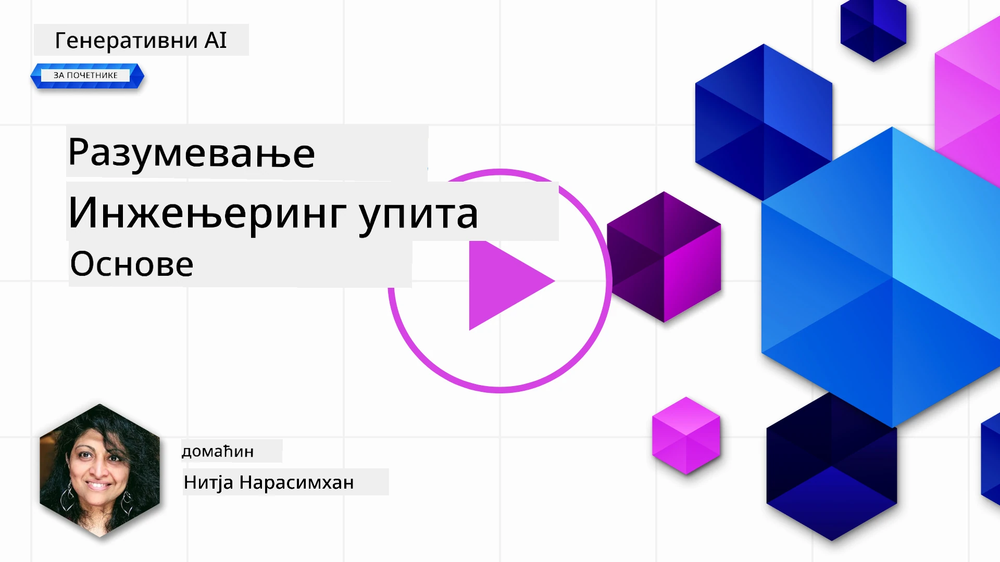
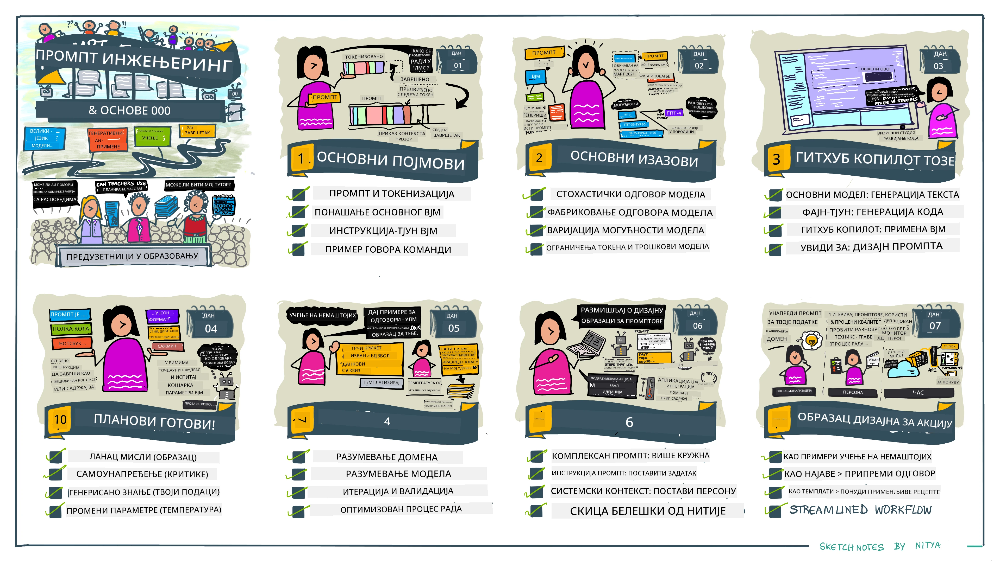
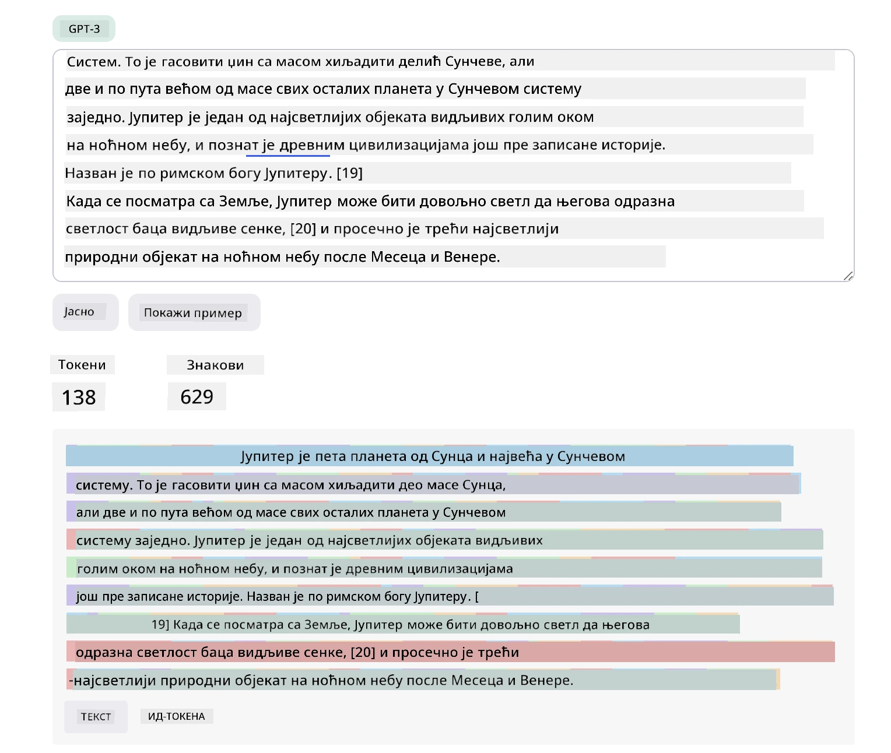
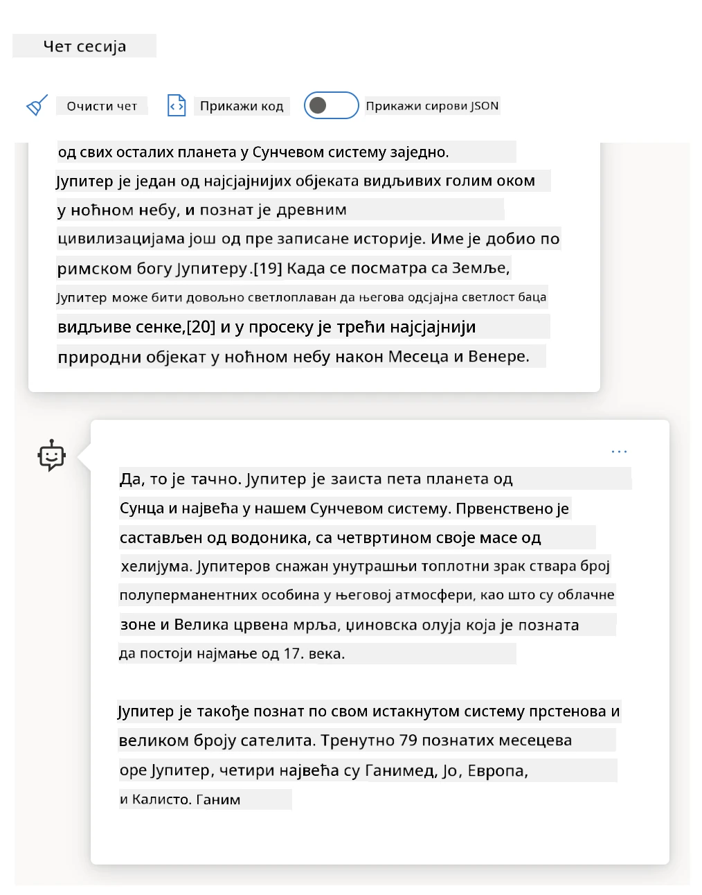
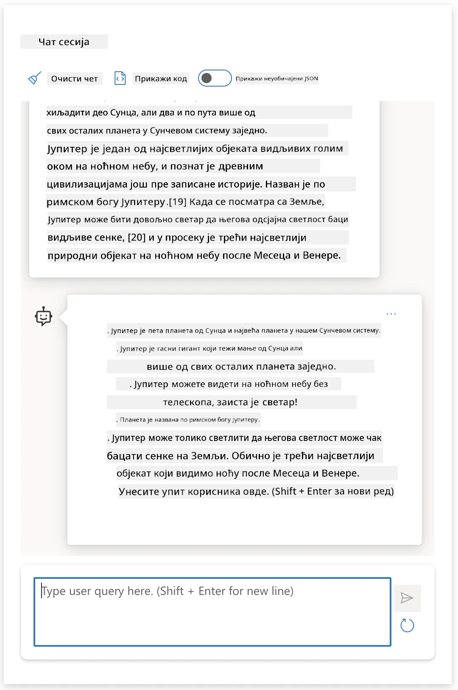
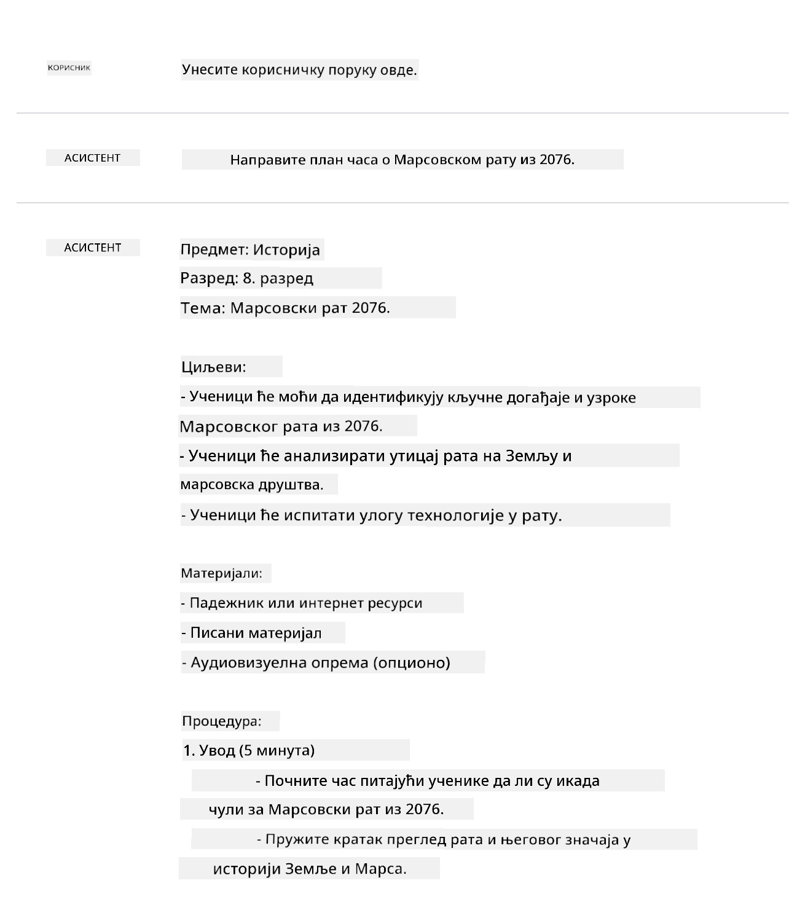
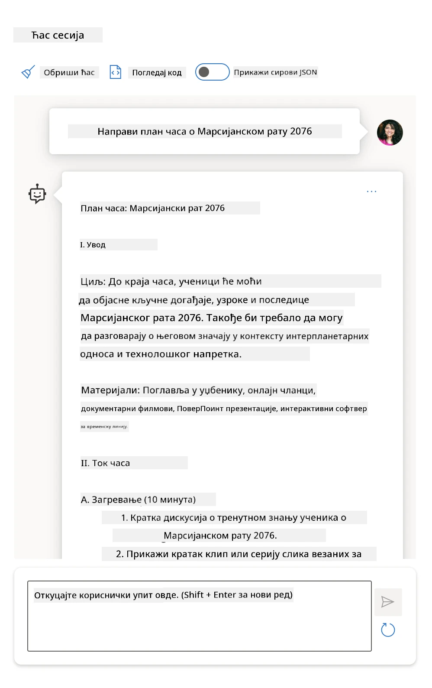
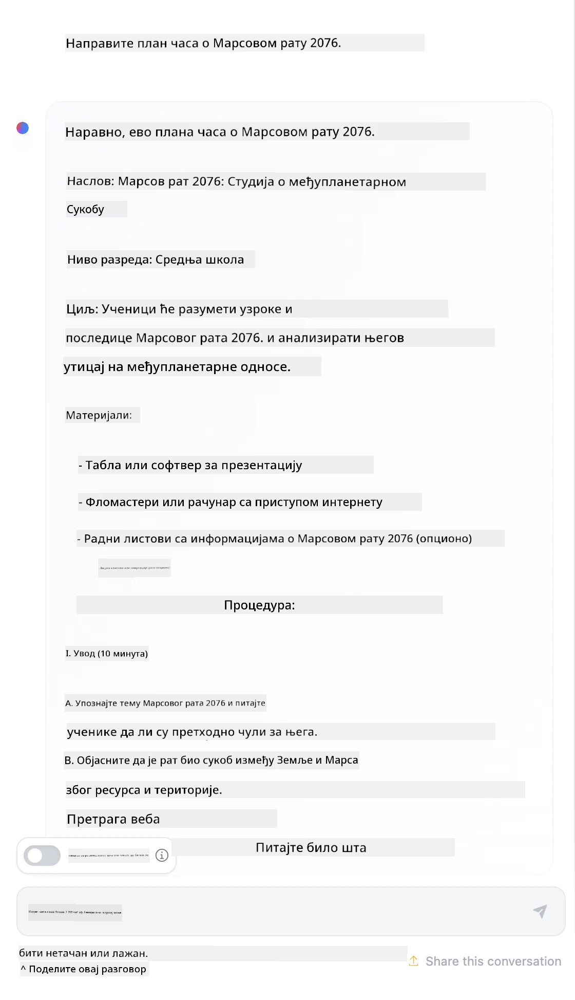

# Основе инжењеринга упита

[](https://youtu.be/GElCu2kUlRs?si=qrXsBvXnCW12epb8)

## Увод
Овај модул обухвата суштинске концепте и технике за креирање ефективних упита у генеративним моделима вештачке интелигенције. Начин на који пишете упит за велики језички модел (LLM) је такође важан. Пажљиво осмишљен упит може постићи бољи квалитет одговора. Али шта тачно значе термини као што су _упит_ и _инжењеринг упита_? И како могу побољшати унос упита који шаљем LLM-у? Ово су питања на која ћемо покушати да одговоримо у овом и следећем поглављу.

_Генеративна вештачка интелигенција_ је способна да креира нови садржај (нпр. текст, слике, аудио, код итд.) као одговор на захтеве корисника. Она то постиже коришћењем _великог језичког модела_ попут OpenAI-јеве серије GPT („Генеративни претходно обучани трансформер”) који су тренирани за природни језик и код.

Корисници сада могу да комуницирају са овим моделима путем познатих парадигми као што је чет, без потребе за техничком експертизом или обуком. Модели су _на бази упита_ - корисници шаљу текстуални унос (упит) и добијају одговор вештачке интелигенције (завршетак). Затим могу "четовати са вештачком интелигенцијом" итеративно, у више корака разговора, усавршавајући свој упит док одговор не испуњава њихова очекивања.

„Упити“ постају примарни _програмски интерфејс_ за апликације генеративне вештачке интелигенције, наводећи моделе шта да раде и утичући на квалитет добијених одговора. „Инжењеринг упита“ је брзо растућа област која се бави _дизајном и оптимизацијом_ упита да би се обезбедили доследни и квалитетни одговори у великом обиму.

## Циљеви учења

У овој лекцији научићемо шта је инжењеринг упита, зашто је важан и како можемо креирати ефективније упите за одређени модел и циљ апликације. Разумећемо основне концепте и најбоље праксе инжењеринга упита - и упознаћемо се са интерактивним окружењем Јупитер бележница („песковник“) у коме можемо видети како се ови концепти примењују на стварне примере.

До краја ове лекције моћи ћемо да:

1. Објаснимо шта је инжењеринг упита и зашто је важно.
2. Опишемо компоненте упита и како се користе.
3. Научимо најбоље праксе и технике инжењеринга упита.
4. Применимо научене технике на стварне примере, користећи OpenAI крајњу тачку (endpoint).

## Кључни термини

Инжењеринг упита: Практика дизајнирања и усавршавања уноса како би се усмерили модели вештачке интелигенције ка жељеним излазима.
Токенизација: Процес конвертовања текста у мање јединице, названи токени, које модел може разумети и обрадити.
Инструкцијски „подешени“ LLM-ови: Велики језички модели који су фино подешени помоћу специфичних упута да побољшају прецизност и релевантност одговора.

## Песковник за учење

Инжењеринг упита је тренутно више уметност него наука. Најбољи начин да побољшамо интуицију за њега је да _више вежбамо_ и прихватимо приступ покушаја и грешака који комбинује стручност у домену примене са препорученим техникама и оптимизацијама специфичним за модел.

Јупитер бележница која иде уз ову лекцију пружа _песковник_ средину у којој можете испробати оно што учите - како идете у корак са лекцијом или као део код изазова на крају. Да бисте извршили вежбе, потребно вам је:

1. **Кључ за Azure OpenAI API** - крајња тачка услуге за распоређени LLM.
2. **Python окружење** - у коме се бележница може извршавати.
3. **Локалне околинске варијабле** - _погледајте кораке из [SETUP](./../00-course-setup/02-setup-local.md?WT.mc_id=academic-105485-koreyst) да бисте се припремили_.

Бележница садржи _почетне_ вежбе - али се подстиче да додате своје _Markdown_ (опис) и _Code_ (захтеве упита) секције да испробате више примера или идеја - и изградите интуицију за дизајн упита.

## Илустровани водич

Желите ли да стекнете јасну слику о темама које ова лекција покрива пре него што почнете? Погледајте овај илустровани водич који вам даје осећај главних тема и кључних закључака за размишљање у свакој од њих. Путоказ лекције води вас од разумевања основних концепата и изазова до њиховог решавања релевантним техникама и најбољим праксама инжењеринга упита. Имајте у виду да се одељак "Напредне технике" у овом водичу односи на садржај покривен у _следећем_ поглављу овог наставног плана.



## Наш стартап

Хајде сада да причамо о томе како се _ова тема_ односи на нашу мисију стартапа да [доновимо иновације вештачке интелигенције у образовање](https://educationblog.microsoft.com/2023/06/collaborating-to-bring-ai-innovation-to-education?WT.mc_id=academic-105485-koreyst). Желимо да изградимо апликације засноване на вештачкој интелигенцији за _персонализовано учење_ - па размислимо о томе како би различити корисници наше апликације могли да „дизајнирају“ упите:

- **Администратори** могу затражити од AI-а да _анализира податке о плану наставе како би идентификовао празнине у покривености_. AI може сажети резултате или их визуелизовати уз помоћ кода.
- **Наставници** могу затражити од AI-а да _генерише план часа за циљну публику и тему_. AI може израдити персонализовани план у одређеном формату.
- **Учиоци** могу затражити од AI-а да их _тутора у тешкој теми_. AI сада може водити ученике кроз лекције, савете и примере прилагођене њиховом нивоу.

Ово је само врх леденог брега. Погледајте [Prompts For Education](https://github.com/microsoft/prompts-for-edu/tree/main?WT.mc_id=academic-105485-koreyst) - библиотеку отворених упита коју су креирали едукатори - да бисте стекли шири увид у могућности! _Испробајте неке од тих упита у песковнику или користећи OpenAI Playground да видите шта ће се десити!_

<!--
ШАБЛОН ЛЕКЦИЈЕ:
Ова јединица треба да покрије основни концепт бр. 1.
Појачајте концепт примерима и референцама.

КОНЦЕПТ #1:
Инжењеринг упита.
Дефинишите га и објасните зашто је потребан.
-->

## Шта је инжењеринг упита?

Почели смо ову лекцију дефинишући **инжењеринг упита** као процес _дизајнирања и оптимизације_ текстуалних уноса (упита) да би се обезбедили доследни и квалитетни одговори (завршетци) за одређени циљ апликације и модел. Можемо ово посматрати као процес у два корака:

- _дизајнирање_ почетног упита за одређени модел и циљ
- _усовршавање_ упита итеративно ради побољшања квалитета одговора

Ово је неопходно процес покушаја и грешака који захтева интуицију корисника и труд да би се постигли оптимални резултати. Па зашто је то важно? Да бисмо одговорили на то питање, прво морамо разумети три концепта:

- _Токенизација_ = како модел „види“ упит
- _Основни LLM-ови_ = како основни модел „обрађује“ упит
- _Инструкцијски „подешени“ LLM-ови_ = како модел сада може видети „задатке“

### Токенизација

Велики језички модел види упите као _секвенцу токена_ где различити модели (или верзије модела) могу токенизовати исти упит на различите начине. Пошто се LLM-ови обучавају на токенима (а не на сировом тексту), начин на који се упити токенизују има директан утицај на квалитет генерисаног одговора.

Да бисте стекли интуицију о томе како ради токенизација, испробајте алате попут [OpenAI Tokenizer](https://platform.openai.com/tokenizer?WT.mc_id=academic-105485-koreyst) приказан испод. Копирајте свој упит - и видите како се он претвара у токене, обраћајући пажњу на то како се руковати знацима размаке и интерпункцијом. Имајте у виду да овај пример приказује старији LLM (GPT-3) - па би проба са новијим моделом могла дати другачији резултат.



### Концепт: Основни модели (Foundation Models)

Када је упит токенизован, главна функција ["Основног LLM-а"](https://blog.gopenai.com/an-introduction-to-base-and-instruction-tuned-large-language-models-8de102c785a6?WT.mc_id=academic-105485-koreyst) (или основног модела) је да предвиди следећи токен у низу. Пошто су LLM-ови обучавани на великим скупова текста, имају добру свест о статистичким везама између токена и могу донекле поуздано предвидети следећи токен. Имајте у виду да они не разумеју _значење_ речи у упиту или токену; они једноставно виде образац који могу „завршити“ својом следећом прогнозом. Могу наставити да предвиђају низ док корисник не прекине или не наступи неки унапред утврђен услов.

Желите да видите како функционише завршетак на бази упита? Унесите горе наведени упит у [Microsoft Foundry playground](https://ai.azure.com?WT.mc_id=academic-105485-koreyst) са подразумеваним подешавањима. Систем је подешен да третира упите као захтеве за информацијом - па бисте требали добити завршетак који задовољава контекст.

Али шта ако корисник жели нешто специфично што испуњава одређени критеријум или циљ задатка? Ту у игру улазе _системи подешени упутствима_.



### Концепт: Инструкцијски подешени LLM-ови

[Инструкцијски подешени LLM](https://blog.gopenai.com/an-introduction-to-base-and-instruction-tuned-large-language-models-8de102c785a6?WT.mc_id=academic-105485-koreyst) почиње са основним моделом и фино га подешава помоћу примера или парова улаз/излаз (нпр. више корака „порука“) који могу садржати јасне инструкције – а одговор вештачке интелигенције настоји да те инструкције следи.

Ово користи технике попут учења појачањем уз људску повратну информацију (RLHF) које могу обучити модел да _прати инструкције_ и _учи из повратних информација_ тако да производи одговоре боље прилагођене практичним применама и релевантније за циљеве корисника.

Хајде да пробамо - вратите се на претходни упит, али сада промените _системску поруку_ да обезбедите следећу инструкцију као контекст:

> _Сажмите садржај који вам је дат за ученике другог разреда. Задржите резултат у једном пасусу са 3-5 тачака._

Видећете како је резултат сада прилагођен жељеном циљу и формату? Наставник може сада директно користити овај одговор у својим слајдовима за тај час.



## Зашто нам треба инжењеринг упита?

Сада када знамо како LLM-ови обрађују упите, хајде да причамо о томе _зашто_ нам треба инжењеринг упита. Одговор лежи у томе што тренутни LLM-ови имају неколико изазова који отежавају постизање _поузданих и доследних одговора_ без уложеног труда у креирање и оптимизацију упита. На пример:

1. **Одговори модела су стохастички.** _Исти упит_ ће вероватно произвести различите одговоре код различитих модела или верзија модела. И може чак произвести различите резултате са _истим моделом_ у различито време. _Технике инжењеринга упита нам могу помоћи да минимизирамо ове варијације обезбеђивањем бољих ограничења_.

1. **Модели могу фабриковати одговоре.** Модели су претходно обучавани на _великим али ограниченим_ скупова података, што значи да немају знање о концептима ван тог домена обуке. Као резултат, могу произвести одговоре који су нетачни, измишљени или директно супротни познатим чињеницама. _Технике инжењеринга упита помажу корисницима да идентификују и смање такве измишљотине нпр. тако што ће тражити од AI-ја да цитира изворе или образложења_.

1. **Капацитети модела ће варирати.** Новији модели или генерације модела имају богатије могућности али такође доносе јединствене карактеристике и компромисе у трошковима и сложености. _Инжењеринг упита нам може помоћи да развијемо најбоље праксе и токове рада који апстрахују разлике и прилагођавају се захтевима специфичним за модел на скалабилан и беспрекорни начин_.

Хајде да видимо ово у пракси у OpenAI или Azure OpenAI Playground:

- Користите исти упит са различитим LLM распоређивањима (нпр. OpenAI, Azure OpenAI, Hugging Face) - да ли сте уочили варијације?
- Користите исти упит више пута са _истим_ LLM распоређивањем (нпр. Azure OpenAI playground) - како су се ове варијације разликовале?

### Пример фабрикација

У овом курсу користимо термин **„фабрикација“** да означимо феномен када LLM-ови понекад генеришу чињенично нетачне информације због ограничења у својој обуци или другим ограничењима. Можда сте ово чули и као _„халуцинације“_ у популарним чланцима или научним радовима. Међутим, снажно препоручујемо употребу термина _„фабрикација“_ како не бисмо ненамерно антропоморфизирали понашање приписујући људску особину машинском резултату. Ово такође подржава [одговорне смернице у вештачкој интелигенцији](https://www.microsoft.com/ai/responsible-ai?WT.mc_id=academic-105485-koreyst) са терминолошке перспективе, уклањајући термине који могу бити увредљиви или искључиви у неким контекстима.

Желите да стекнете осећај како фабрикације функционишу? Замислите упит који инструмира AI да генерише садржај о нестварној теми (да би се осигурало да тема није у скупу података за обуку). На пример - ја сам покушао овај упит:

> **Упит:** генериши план часа о Марсовском рату 2076. године.

Веб претрага ми је показала да постоје фантастичне приче (нпр. телевизијске серије или књиге) о Марсовским ратовима - али ниједна није у 2076. Здрав разум нам говори да је 2076. _у будућности_ и стога не може бити повезана са стварним догађајем.


Шта се дешава када покренемо овај упит са различитим пружаоцима LLM?

> **Одговор 1**: OpenAI Playground (GPT-35)



> **Одговор 2**: Azure OpenAI Playground (GPT-35)



> **Одговор 3**: : Hugging Face Chat Playground (LLama-2)



Као што се очекивало, сваки модел (или верзија модела) производи благо другачије одговоре захваљујући стохастичком понашању и варијацијама у могућностима модела. На пример, један модел циља публику осмог разреда док други претпоставља да је корисник средњошколац. Али сва три модела су генерисала одговоре који могу убедити необавештеног корисника да је догађај био реалан.

Технике инжењеринга упита као што су _метаупит_ и _конфигурација температуре_ могу у некој мери смањити фабрикације модела. Нове _архитектуре_ инжењеринга упита такође беспрекорно укључују нове алате и технике у ток упита, како би ублажиле или смањиле неке од ових ефеката.

## Студија случаја: GitHub Copilot

Завршићемо овај одељак тако што ћемо сазнати како се инжењеринг упита користи у реалним решењима посматрајући једну студију случаја: [GitHub Copilot](https://github.com/features/copilot?WT.mc_id=academic-105485-koreyst).

GitHub Copilot је ваш "AI пар програмер" - претвара текстуалне упите у кодне комплетирања и интегрисан је у ваше развојно окружење (нпр. Visual Studio Code) за беспрекорно корисничко искуство. Као што је документирано у низу блогова испод, најранија верзија била је базирана на OpenAI Codex моделу - са програмерима који су брзо схватили потребу за унапређењем модела и развоја бољих техника инжењеринга упита како би се побољшао квалитет кода. У јулу су [представили унапредени AI модел који иде даље од Codex-а](https://github.blog/2023-07-28-smarter-more-efficient-coding-github-copilot-goes-beyond-codex-with-improved-ai-model/?WT.mc_id=academic-105485-koreyst) за још брже предлоге.

Прочитајте постове по реду, да пратите њихово учење.

- **мај 2023** | [GitHub Copilot постаје бољи у разумевању вашег кода](https://github.blog/2023-05-17-how-github-copilot-is-getting-better-at-understanding-your-code/?WT.mc_id=academic-105485-koreyst)
- **мај 2023** | [Унутар GitHub-а: Рад са LLM-овима иза GitHub Copilot-а](https://github.blog/2023-05-17-inside-github-working-with-the-llms-behind-github-copilot/?WT.mc_id=academic-105485-koreyst).
- **јун 2023** | [Како писати боље упите за GitHub Copilot](https://github.blog/2023-06-20-how-to-write-better-prompts-for-github-copilot/?WT.mc_id=academic-105485-koreyst).
- **јул 2023** | [.. GitHub Copilot иде даље од Codex-а са унапређеним AI моделом](https://github.blog/2023-07-28-smarter-more-efficient-coding-github-copilot-goes-beyond-codex-with-improved-ai-model/?WT.mc_id=academic-105485-koreyst)
- **јул 2023** | [Водич за програмере о инжењерингу упита и LLM-овима](https://github.blog/2023-07-17-prompt-engineering-guide-generative-ai-llms/?WT.mc_id=academic-105485-koreyst)
- **сеп 2023** | [Како изградити ентерпрајз LLM апликацију: лекције из GitHub Copilot-а](https://github.blog/2023-09-06-how-to-build-an-enterprise-llm-application-lessons-from-github-copilot/?WT.mc_id=academic-105485-koreyst)

Такође можете прегледати њихов [Инжењерски блог](https://github.blog/category/engineering/?WT.mc_id=academic-105485-koreyst) за више постова као што је [овај](https://github.blog/2023-09-27-how-i-used-github-copilot-chat-to-build-a-reactjs-gallery-prototype/?WT.mc_id=academic-105485-koreyst) који показује како се ови модели и технике _примењују_ за покретање реалних апликација.

---

<!--
ОБРАЗАЦ ЛЕКЦИЈЕ:
Ова јединица треба да покрије основни концепт #2.
Јачајте концепт примерима и референцама.

КОНЦЕПТ #2:
Дизајн упита.
Илустровано примерима.
-->

## Конструкција упита

Видели смо зашто је инжењеринг упита важан – сада хајде да разумемо како се упити _конструишу_ да бисмо могли да проценимо различите технике за ефикаснији дизајн упита.

### Основни упит

Почнимо са основним упитом: текстуални унос послат модели без додатног контекста. Ево примера – када пошаљемо првих неколико речи америчке националне химне OpenAI [Completion API-ју](https://platform.openai.com/docs/api-reference/completions?WT.mc_id=academic-105485-koreyst) он тренутно _потпуно_ одговара следећим редовима, илуструјући основно предвиђање.

| Упит (Унос)       | Комплетирање (Излаз)                                                                                                                         |
| :---------------- | :------------------------------------------------------------------------------------------------------------------------------------------- |
| Oh say can you see | Звучите као да почињете са текстом песме "The Star-Spangled Banner," националне химне Сједињених Држава. Пун текст гласи ...                |

### Комплексни упит

Сада додајмо контекст и упутства том основном упиту. [Chat Completion API](https://learn.microsoft.com/azure/ai-foundry/openai/how-to/chatgpt?WT.mc_id=academic-105485-koreyst) нам омогућава да конструишемо комплексни упит као скуп _порука_ са:

- парове уноса/излаза који одражавају унос _корисника_ и одговор _асистента_.
- системска порука која поставља контекст понашања или личности асистента.

Захтев је сада у облику испод, где _токенизација_ ефективно хвата релевантне информације из контекста и разговора. Сада, промена системског контекста може утицати на квалитет комплетирања као и сами кориснички уноси.

```python
response = client.responses.create(
    model="gpt-5-mini",
    input=[
        {"role": "system", "content": "You are a helpful assistant."},
        {"role": "user", "content": "Who won the world series in 2020?"},
        {"role": "assistant", "content": "The Los Angeles Dodgers won the World Series in 2020."},
        {"role": "user", "content": "Where was it played?"}
    ]
)
```

### Упутни упит

У горњим примерима, кориснички упит био је једноставан текстуални захтев који се може тумачити као захтев за информацијом. Са _упутним_ упитима, можемо користити тај текст да прецизније одредимо задатак, пружајући боље смернице AI-ју. Ево примера:

| Упит (Унос)                                                                                                                                                                                                                         | Комплетирање (Излаз)                                                                                                       | Тип упутства    |
| :------------------------------------------------------------------------------------------------------------------------------------------------------------------------------------------------------------------------------------- | :-------------------------------------------------------------------------------------------------------------------------- | :-------------- |
| Напишите опис Грађанског рата                                                                                                                                                                                                       | _вратио једноставан пасус_                                                                                                 | Једноставно     |
| Напишите опис Грађанског рата. Наведите кључне датуме и догађаје и опишите њихов значај                                                                                                                                               | _вратио пасус праћен листом кључних датума догађаја са описима_                                                           | Комплексно      |
| Напишите опис Грађанског рата у 1 пасусу. Наведите 3 тачке са кључним датумима и њиховим значајем. Наведите још 3 тачке са значајним историјским личностима и њиховим доприносима. Вратите резултат као JSON фајл                             | _враћа детаљније информације у тексту, форматирано као JSON које можете копирати и сачувати као фајл и по потреби проверити_ | Комплексно. Формат. |

## Примарни садржај

У горе наведеним примерима, упит је и даље био прилично општи, дозвољавајући LLM-у да одлучи који део своје претходно научене базе података је релевантан. Са дизајн шемом _примарног садржаја_, текст уноса дели се на два дела:

- упутство (акција)
- релевантни садржај (који утиче на акцију)

Ево примера где је упутство "сумаришите ово у 2 реченице".

| Упит (Унос)                                                                                                                                                                                                                                                                                                                                                                                                                                                                                                                                                                                                                                                                                     | Комплетирање (Излаз)                                                                                                                                                                                                                                                                             |
| :------------------------------------------------------------------------------------------------------------------------------------------------------------------------------------------------------------------------------------------------------------------------------------------------------------------------------------------------------------------------------------------------------------------------------------------------------------------------------------------------------------------------------------------------------------------------------------------------------------------------------------------------------------ | :---------------------------------------------------------------------------------------------------------------------------------------------------------------------------------------------------------------------------------------------------------------------------------------------- |
| Јупитер је пета планета од Сунца и највећа у Сунчевом систему. То је гасовити гигант са масом хиљадити део масе Сунца, али са два и по пута већом масом од свих осталих планета Сунчевог система заједно. Јупитер је један од најсјајнијих објеката видљивих голим оком на ноћном небу и познат је древним цивилизацијама још пре записане историје. Назван је по римском богу Јупитеру.[19] Када се посматра са Земље, Јупитер може бити довољно светло да његова рефлектована светлост баци видљиве сенке,[20] и у просеку је трећи најсјајнији природни објекат на ноћном небу после Месеца и Венере. <br/> **Сумирајте ово у 2 кратке реченице** | Јупитер, пета планета од Сунца је највећа у Сунчевом систему и познат је као један од најсјајнијих објеката на ноћном небу. Назван по римском богу Јупитеру, то је гасовити гигант чија је маса два и по пута већа од свих осталих планета у Сунчевом систему заједно. |

Сегмент примарног садржаја може се користити на више начина за ефикасније вођење упутстава:

- **Примери** - уместо да моделу директно кажете шта да ради са јасним упутством, дајте му примере шта да ради и дозволите му да закључи образац.
- **Сигнали** - следите упутство са "сигналом" који припрема комплетирање, водећи модел ка релевантнијим одговорима.
- **Шаблони** - ово су поновљиви 'рецепти' за упите са повећивачима (променљивим) које можете прилагодити подацима за специфичне случајеве коришћења.

Хајде да их испробамо у пракси.

### Коришћење примера

Ово је приступ где користите примарни садржај да "нахраните модел" примерима жељеног излаза за дато упутство и пустите га да закључи образац за жељени излаз. На основу броја датих примера, можемо имати zero-shot, one-shot, few-shot итд. упите.

Сада упит садржи три компоненте:

- Опис задатка
- Неколико примера жељеног излаза
- Почетак новог примера (који постаје имплицитни опис задатка)

| Тип учења  | Упит (Унос)                                                                                                  | Комплетирање (Излаз)      |
| :--------- | :---------------------------------------------------------------------------------------------------------- | :------------------------- |
| Zero-shot | "Сунце сија". Преведи на шпански                                                                             | "El Sol está brillando".   |
| One-shot  | "Сунце сија" => "El Sol está brillando". <br> "Хладно је и ветровито" =>                                      | "Es un día frío y ventoso".|
| Few-shot  | Играч је трчао по базама => Бејзбол <br/> Играч је добио ејс => Тенис <br/> Играч је погодио шестицу => Крикет <br/> Играч је извео закуцaвање => | Кошарка                   |
|           |                                                                                                             |                           |

Приметите како смо у zero-shot приступу морали дати експлицитно упутство („Преведи на шпански“), али у one-shot приступу је то закључено. The few-shot пример показује како додавање више примера омогућава моделима прецизније закључке без додатних упутстава.

### Сигнали у упиту

Друга техника коришћења примарног садржаја је да се дају _сигнали_ уместо примера. У овом случају, дајемо моделу благу подршку тако што га _покрећемо_ исечком који одражава жељени формат одговора. Модел затим "узима сигнал" да настави у том правцу.

| Број сигнала | Упит (Унос)                                                                                                                                                                                                                                                                                                                                                                                                                                               | Комплетирање (Излаз)                                                                                                                                                                                                                                                                                       |
| :---------- | :----------------------------------------------------------------------------------------------------------------------------------------------------------------------------------------------------------------------------------------------------------------------------------------------------------------------------------------------------------------------------------------------------------------------------------------------------------- | :-------------------------------------------------------------------------------------------------------------------------------------------------------------------------------------------------------------------------------------------------------------------------------------------------------- |
| 0           | Јупитер је пета планета од Сунца и највећа у Сунчевом систему. То је гасовити гигант са масом хиљадити део масе Сунца, али са два и по пута већом масом од свих осталих планета Сунчевог система заједно. Јупитер је један од најсјајнијих објеката видљивих голим оком на ноћном небу и познат је древним цивилизацијама још пре записане историје. <br/>**Сумирајте ово**                                       | Јупитер је највећа планета у нашем Сунчевом систему и пета је од Сунца. То је гасовити гигант чија је маса 1/1000 дела масе Сунца, али је тежи од свих осталих планета заједно. Древне цивилизације познају Јупитер дуго времена, и лако је видљив на ноћном небу.          |
| 1           | Јупитер је пета планета од Сунца и највећа у Сунчевом систему. То је гасовити гигант са масом хиљадити део масе Сунца, али са два и по пута већом масом од свих осталих планета Сунчевог система заједно. Јупитер је један од најсјајнијих објеката видљивих голим оком на ноћном небу и познат је древним цивилизацијама још пре записане историје. <br/>**Сумирајте ово** <br/> Што смо сазнали је да Јупитер | је пета планета од Сунца и највећа у Сунчевом систему. То је гасовити гигант са масом хиљадити део масе Сунца, али са два и по пута већом масом од свих осталих планета заједно. Лако је видљив голим оком и познат је још из древних времена.                 |

| 2              | Јупитер је пета планета од Сунца и највећа у Сунчевом систему. То је гасовити џин са масом од хиљадитог дела Сунчеве масе, али две и по пута већом од свих осталих планета Сунчевог система заједно. Јупитер је један од најсветлијих објеката видљивих голим оком на ноћном небу и познат је древним цивилизацијама још пре записане историје. <br/>**Сажми ово** <br/> Топ 3 чињенице које смо научили:         | 1. Јупитер је пета планета од Сунца и највећа у Сунчевом систему. <br/> 2. То је гасовити џин са масом од хиљадитог дела Сунчеве масе...<br/> 3. Јупитер је видљив голим оком још од давнина ...                                                                       |
|                |                                                                                                                                                                                                                                                                                                                                                                                                                                                              |                                                                                                                                                                                                                                                                                                           |

### Шаблони Наративних Упита

Шаблон за нартивни упит је _уннапред дефинисани рецепт за упит_ који се може сачувати и поново користити по потреби, како би се постигао конзистентнији кориснички доживљај у великом обиму. У свом најједноставнијем облику, то је једноставно збирка примера нартивних упита попут [овог од OpenAI](https://cookbook.openai.com/examples/gpt4-1_prompting_guide?WT.mc_id=academic-105485-koreyst) која пружа и интерактивне компоненте упита (поруке корисника и система) и формат захтева управљан API-јем - ради подршке поновне употребе.

У свом сложенијем облику, као у [овом примеру из LangChain](https://python.langchain.com/docs/concepts/prompt_templates/?WT.mc_id=academic-105485-koreyst), садржи _замене места_ које се могу заменити подацима из разних извора (кориснички унос, контекст система, спољни извори података итд.) ради динамичког креирања упита. Ово нам омогућава да направимо библиотеку поновљивих упита која се може користити за постизање конзистентног корисничког искуства **програмски** у великом обиму.

Највреднији део шаблона лежи у способности да се креирају и објављују _библиотеке упита_ за вертикалне домене примена - где је шаблон упита сада _оптимизован_ да одражава контекст специфичан за апликацију или примере који чине одговоре релевантнијим и прецизнијим за циљану корисничку публику. Репозиторијум [Prompts For Edu](https://github.com/microsoft/prompts-for-edu?WT.mc_id=academic-105485-koreyst) је сјајан пример овог приступа, са колекцијом упита за домен образовања уз нагласак на кључне циљеве као што су планирање лекција, дизајн наставног плана, поучавање студената итд.

## Пратећи Садржај

Ако размишљамо о конструкцији упита као о наредби (задатку) и циљу (примарном садржају), онда је _секундарни садржај_ као додатни контекст који пружамо да **на неки начин утичемо на излаз**. То могу бити параметри подешавања, упутства за форматирање, таксономије тема итд. који помажу моделу да _прилагоди_ свој одговор како би одговарао жељеним корисничким циљевима или очекивањима.

На пример: Ако имамо каталог курса са обимним метаподацима (име, опис, ниво, ознаке, инструктор итд.) за све доступне курсеве у наставном плану:

- можемо дефинисати упутство „сажми каталог курсева за јесен 2023.“
- можемо користити примарни садржај да пружимо неколико примера жељеног излаза
- можемо користити секундарни садржај да идентификујемо топ 5 „ознака“ од интереса.

Сада модел може пружити сажети приказ у формату који показују неки примери - али ако резултат има више ознака, може приоритет дати 5 ознака идентификованих у секундарном садржају.

---

<!--
ШАБЛОН ЛЕКЦИЈЕ:
Ова јединица треба да покрије основни концепт #1.
Појачати концепт примерима и референцама.

КОНЦЕПТ #3:
Технике за израду упита.
Које су основне технике за израду упита?
Илуструј то вежбама.
-->

## Најбоље Практике за Прављење Упита

Сада када знамо како се упити могу _конструисати_, можемо почети да размишљамо како их _дизајнирати_ тако да одражавају најбоље праксе. Можемо ово видети у два дела - прихватање правог _менталног стања_ и примену правих _техника_.

### Ментално Стање за Прављење Упита

Израђивање упита је процес пробе и грешке, зато имајте у виду три широка водича:

1. **Разумевање Домена је Важно.** Тачност и релевантност одговора зависе од _домена_ у којем та апликација или корисник делују. Примените интуицију и стручност у домену да даље **прилагодите технике**. На пример, дефинишите _личности специфичне за домен_ у вашим системским упитима или користите _шаблоне специфичне за домен_ у корисничким упитима. Пружите секундарни садржај који одражава контексте одређеног домена или користите _најаве и примере специфичне за домен_ да усмерите модел према познатим паттернима коришћења.

2. **Разумевање Модела је Важно.** Знамо да су модели по природи стохастички. Али имплементације модела могу се разликовати у смислу скупова података за обуку (предтренирано знање), могућности које пружају (нпр. преко API-ја или SDK-а) и типа садржаја за који су оптимизовани (нпр. код, слике, текст). Разумите снаге и ограничења модела који користите и примените то знање да бисте _приоритизирали задатке_ или направили _прилагођене шаблоне_ оптимизоване за могућности модела.

3. **Итерација и Валидација су Важни.** Модели се брзо развијају, као и технике за израду упита. Као стручњак за домен, можете имати други контекст или критеријуме за _вашу_ специфичну апликацију, који се можда не примењују за ширу заједницу. Користите алате и технике за израду упита да „брзо започнете“ конструкцију упита, затим итератирајте и валидајте резултате користећи сопствену интуицију и стручност домена. Запишите своја сазнања и креирајте **базу знања** (нпр. библиотеке упита) која може послужити као нова база за друге, ради бржих итерација у будућности.

## Најбоље Практике

Сада погледајмо неке уобичајене најбоље праксе које препоручују [OpenAI](https://help.openai.com/en/articles/6654000-best-practices-for-prompt-engineering-with-openai-api?WT.mc_id=academic-105485-koreyst) и [Azure OpenAI](https://learn.microsoft.com/azure/ai-foundry/openai/concepts/prompt-engineering#best-practices?WT.mc_id=academic-105485-koreyst) стручњаци.

| Шта                              | Зашто                                                                                                                                                                                                                                               |
| :-------------------------------- | :------------------------------------------------------------------------------------------------------------------------------------------------------------------------------------------------------------------------------------------------ |
| Процени најновије моделе.       | Нове генерације модела вероватно имају побољшане могућности и квалитет - али могу донети и веће трошкове. Процени их по утицају па донеси одлуке о миграцији.                                                                                             |
| Раздвоји упутства и контекст    | Проверите да ли ваш модел/провајдер дефинише _делимитере_ да јасније раздвоје упутства, примарни и секундарни садржај. Ово може помоћи моделу да прецизније додели тежине таговима.                                                                     |
| Буди специфичан и јасан          | Дај више детаља о жељеном контексту, резултату, дужини, формату, стилу итд. Ово ће побољшати квалитет и конзистентност одговора. Снимај рецепте у поновљиве шаблоне.                                                                                   |
| Буди описан, користи примере      | Модели могу боље одговорити на приступ „показати и рећи“. Почни са `zero-shot` приступом где дајеш упутство (али без примера), потом покушај `few-shot` као финализацију, дајући неколико примера жељеног излаза. Користи аналогије.                   |
| Користи наговештаје за покретање | Усмери га ка жељеном резултату дајући неке почетне речи или фразе које може користити као полазну тачку за одговор.                                                                                                                                |
| Удвајај                          | Понекад можда треба да се поновиш моделу. Дај упутства пре и после примарног садржаја, користи упутство и наговештај итд. Итерација и валидација да виде шта најбоље функционише.                                                                      |
| Редослед је важан               | Редослед којим представљаш информације моделу може утицати на излаз, чак и у примерима за учење, због пристраности према недавности. Испробај различите опције да видиш шта најбоље функционише.                                                         |
| Дозволи моделу „излаз“           | Дај моделу _резервни_ одговор који може пружити ако из било ког разлога не може да заврши задатак. Ово може смањити шансе за генерисање лажних или измишљених одговора.                                                                              |
|                                   |                                                                                                                                                                                                                                                   |

Као и код сваке најбоље праксе, имај на уму да _твоји резултати могу варирати_ у зависности од модела, задатка и домена. Користи ово као почетну тачку, и итеративно пронађи шта најбоље ради за тебе. Континуирано препроцењуј свој процес изградње упита како постају доступни нови модели и алати, фокусирајући се на скалабилност процеса и квалитет одговора.

<!--
ШАБЛОН ЛЕКЦИЈЕ:
Ова јединица треба да пружи код изазов ако је применљиво

ИЗАЗОВ:
Линк ка Јупитер бележници где су у упутствима само коментари кода (код делови су празни).

РЕШЕЊЕ:
Линк ка копији те бележнице где су упити попуњени и покренути, показујући пример излаза.
-->

## Задатак

Честитам! Страдао си до краја лекције! Време је да неке од тих концепата и техника испробаш са стварним примерима!

За наш задатак користићемо Јупитер бележницу са вежбама које можеш интерактивно извршавати. Такође можеш проширити бележницу својим властитим Markdown и Code ћелијама да истражујеш идеје и технике самостално.

### Да почнемо, форкуј репозиторијум, затем

- (Препоручено) Покрени GitHub Codespaces
- (Алтернативно) Клонирај репо на свој локални уређај и користи га са Docker Desktop
- (Алтернативно) Отвори бележницу у жељеном окружењу за извршавање бележница.

### Следеће, конфигуриши своје променљиве окружења

- Копирај `.env.copy` фајл у корену репа као `.env` и попуни вредности `AZURE_OPENAI_API_KEY`, `AZURE_OPENAI_ENDPOINT` и `AZURE_OPENAI_DEPLOYMENT`. Врати се на [Learning Sandbox секцију](#песковник-за-учење) да научиш како.

### Следеће, отвори Јупитер бележницу

- Изабери runtime kernel. Ако користиш опције 1 или 2, једноставно изабери подразумевани Python 3.10.x kernel који пружа дев контейнер.

Спреман си да покрећеш вежбе. Имај на уму да овде нема _тачних и нетачних_ одговора - само истраживање опција методом пробе и грешке и грађење интуиције шта ради за одређени модел и домен примене.

_Због тога у овој лекцији нема сегмената са решењем кода. Уместо тога, бележница ће имати Markdown ћелије са насловом „Моје решење:“ које показују један пример излаза за референцу._

 <!--
ШАБЛОН ЛЕКЦИЈЕ:
Заврши одељак сажетком и ресурсима за самостално учење.
-->

## Провера знања

Који од следећих упита је добар и прати неке разумне најбоље праксе?

1. Показати ми слику црвеног аута
2. Показати ми слику црвеног аута марке Волво и модела XC90 паркираног поред литице са заласком сунца
3. Показати ми слику црвеног аута марке Волво и модела XC90

Одговор: 2, то је најбољи упит јер пружа детаље о „шта“ и иде у специфичности (не само било који ауто већ конкретна марка и модел) и такође описује околину. 3 је други најбољи јер садржи доста описа.

## 🚀 Изазов

Покушај да искористиш технику „наговештаја“ с упитом: Заврши реченицу „Показати ми слику црвеног аута марке Волво и “. Како модел одговара и како би га побољшао?

## Одличан посао! Настави са учењем

Желиш ли сазнати више о различитим концептима израде упита? Иди на [страницу за наставак учења](https://aka.ms/genai-collection?WT.mc_id=academic-105485-koreyst) да пронађеш друге сјајне ресурсе о овој теми.

Пређи на Лекцију 5 где ћемо погледати [напредне технике прављења упита](../05-advanced-prompts/README.md?WT.mc_id=academic-105485-koreyst)!

---

<!-- CO-OP TRANSLATOR DISCLAIMER START -->
**Изјава о одрицању одговорности**:
Овај документ је преведен коришћењем услуге за аутоматски превод [Co-op Translator](https://github.com/Azure/co-op-translator). Иако тежимо тачности, имајте у виду да аутоматски преводи могу садржати грешке или нетачности. Оригинални документ на његовом изворном језику треба сматрати ауторитативним извором. За критичне информације препоручује се професионални људски превод. Нисмо одговорни за било каква неспоразума или погрешна тумачења која произилазе из коришћења овог превода.
<!-- CO-OP TRANSLATOR DISCLAIMER END -->