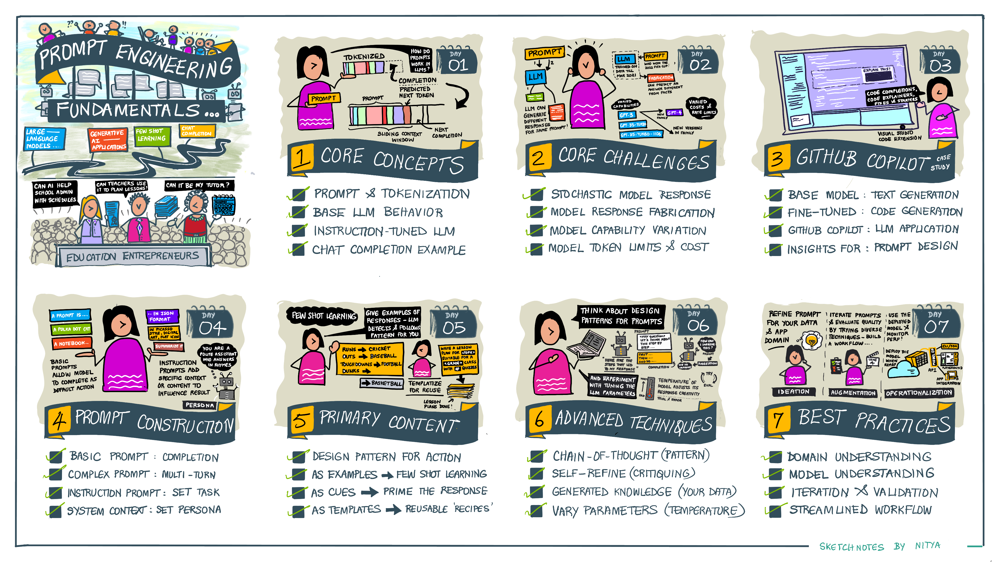
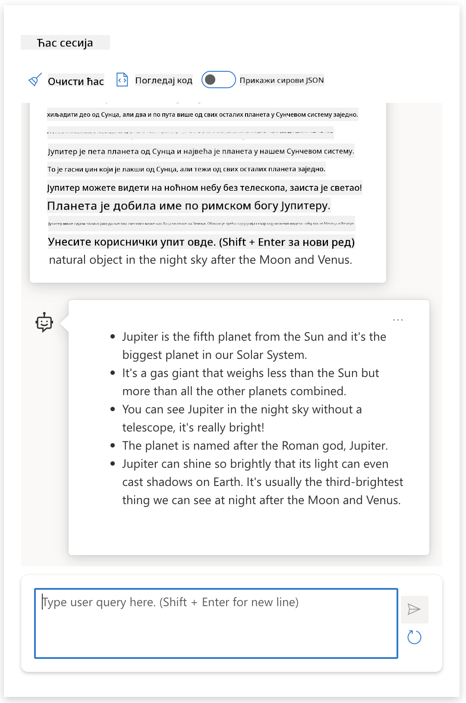

<!--
CO_OP_TRANSLATOR_METADATA:
{
  "original_hash": "8b3cb38518cf4fe7714d2f5e74dfa3eb",
  "translation_date": "2025-10-03T10:26:51+00:00",
  "source_file": "04-prompt-engineering-fundamentals/README.md",
  "language_code": "sr"
}
-->
# Основе инжењеринга упита

[](https://aka.ms/gen-ai-lesson4-gh?WT.mc_id=academic-105485-koreyst)

## Увод
Овај модул покрива основне концепте и технике за креирање ефикасних упита у моделима генеративне вештачке интелигенције. Начин на који пишете свој упит за LLM је такође важан. Пажљиво осмишљен упит може довести до бољег квалитета одговора. Али шта тачно значе термини као што су _упит_ и _инжењеринг упита_? И како могу побољшати _улазни упит_ који шаљем LLM-у? Ово су питања на која ћемо покушати да одговоримо у овом и наредном поглављу.

_Генеративна вештачка интелигенција_ је способна да креира нови садржај (нпр. текст, слике, аудио, код итд.) као одговор на захтеве корисника. Ово постиже коришћењем _модела великог језика_ као што је серија GPT ("Generative Pre-trained Transformer") компаније OpenAI, која је обучена за коришћење природног језика и кода.

Корисници сада могу да комуницирају са овим моделима користећи познате парадигме као што је ћаскање, без потребе за техничком експертизом или обуком. Модели су _засновани на упитима_ - корисници шаљу текстуални улаз (упит) и добијају одговор од вештачке интелигенције (завршетак). Затим могу "ћаскати са вештачком интелигенцијом" итеративно, у разговорима са више корака, усавршавајући свој упит док одговор не испуни њихова очекивања.

"Упити" сада постају примарни _програмски интерфејс_ за апликације генеративне вештачке интелигенције, говорећи моделима шта да раде и утичући на квалитет добијених одговора. "Инжењеринг упита" је брзо растућа област студија која се фокусира на _дизајн и оптимизацију_ упита како би се обезбедили конзистентни и квалитетни одговори у великом обиму.

## Циљеви учења

У овом лекцији ћемо научити шта је инжењеринг упита, зашто је важан и како можемо креирати ефикасније упите за одређени модел и циљ апликације. Разумећемо основне концепте и најбоље праксе за инжењеринг упита - и научити о интерактивном окружењу "sandbox" у Jupyter Notebook-у где можемо применити ове концепте на стварне примере.

На крају ове лекције бићемо у могућности да:

1. Објаснимо шта је инжењеринг упита и зашто је важан.
2. Опишемо компоненте упита и како се користе.
3. Научимо најбоље праксе и технике за инжењеринг упита.
4. Применимо научене технике на стварне примере, користећи OpenAI endpoint.

## Кључни термини

Инжењеринг упита: Практика дизајнирања и усавршавања улазних података како би се модели вештачке интелигенције усмерили ка производњи жељених резултата.
Токенизација: Процес претварања текста у мање јединице, назване токени, које модел може разумети и обрадити.
LLM-ови подешени за инструкције: Модели великог језика (LLM-ови) који су фино подешени са специфичним инструкцијама ради побољшања тачности и релевантности одговора.

## Sandbox за учење

Инжењеринг упита је тренутно више уметност него наука. Најбољи начин да побољшамо интуицију за то је да _више вежбамо_ и усвојимо приступ проба-грешка који комбинује експертизу у домену апликације са препорученим техникама и оптимизацијама специфичним за модел.

Jupyter Notebook који прати ову лекцију пружа _sandbox_ окружење где можете испробати оно што научите - у ходу или као део изазова кодирања на крају. Да бисте извршили вежбе, биће вам потребно:

1. **Azure OpenAI API кључ** - сервисни endpoint за распоређени LLM.
2. **Python Runtime** - у којем се Notebook може извршити.
3. **Локалне променљиве окружења** - _завршите кораке [SETUP](./../00-course-setup/02-setup-local.md?WT.mc_id=academic-105485-koreyst) сада да бисте се припремили_.

Notebook долази са _почетним_ вежбама - али се охрабрујете да додате своје _Markdown_ (опис) и _Code_ (захтеви за упите) секције како бисте испробали више примера или идеја - и изградили своју интуицију за дизајн упита.

## Илустровани водич

Желите да добијете ширу слику о томе шта ова лекција покрива пре него што се удубите? Погледајте овај илустровани водич, који вам даје осећај главних тема које се покривају и кључних закључака о којима треба размишљати у свакој од њих. План лекције вас води од разумевања основних концепата и изазова до њиховог решавања релевантним техникама инжењеринга упита и најбољим праксама. Имајте на уму да се секција "Напредне технике" у овом водичу односи на садржај који се покрива у _следећем_ поглављу овог курикулума.



## Наш стартап

Сада, хајде да разговарамо о томе како _ова тема_ има везе са нашом мисијом стартапа да [донесемо иновације вештачке интелигенције у образовање](https://educationblog.microsoft.com/2023/06/collaborating-to-bring-ai-innovation-to-education?WT.mc_id=academic-105485-koreyst). Желимо да изградимо апликације засноване на вештачкој интелигенцији за _персонализовано учење_ - па хајде да размислимо о томе како различити корисници наше апликације могу "дизајнирати" упите:

- **Администратори** могу тражити од вештачке интелигенције да _анализира податке о наставном плану и програму како би идентификовала празнине у покривености_. Вештачка интелигенција може сумирати резултате или их визуализовати помоћу кода.
- **Едукатори** могу тражити од вештачке интелигенције да _генерише план лекције за циљну публику и тему_. Вештачка интелигенција може креирати персонализовани план у одређеном формату.
- **Студенти** могу тражити од вештачке интелигенције да их _подучава у тешком предмету_. Вештачка интелигенција сада може водити студенте лекцијама, саветима и примерима прилагођеним њиховом нивоу.

То је само врх леденог брега. Погледајте [Упите за образовање](https://github.com/microsoft/prompts-for-edu/tree/main?WT.mc_id=academic-105485-koreyst) - библиотеку упита отвореног кода коју су курирали стручњаци за образовање - да бисте добили шири осећај могућности! _Покушајте да покренете неке од тих упита у sandbox-у или користећи OpenAI Playground да видите шта се дешава!_

<!--
ШАБЛОН ЛЕКЦИЈЕ:
Ова јединица треба да покрије основни концепт #1.
Ојачајте концепт примерима и референцама.

КОНЦЕПТ #1:
Инжењеринг упита.
Дефинишите га и објасните зашто је потребан.
-->

## Шта је инжењеринг упита?

Започели смо ову лекцију дефинисањем **инжењеринга упита** као процеса _дизајнирања и оптимизације_ текстуалних улаза (упита) ради постизања конзистентних и квалитетних одговора (завршетака) за одређени циљ апликације и модел. Ово можемо посматрати као процес у 2 корака:

- _дизајнирање_ почетног упита за одређени модел и циљ
- _усавршавање_ упита итеративно ради побољшања квалитета одговора

Ово је нужно процес проба-грешка који захтева интуицију корисника и напор да се постигну оптимални резултати. Па зашто је то важно? Да бисмо одговорили на то питање, прво морамо разумети три концепта:

- _Токенизација_ = како модел "види" упит
- _Основни LLM-ови_ = како основни модел "обрађује" упит
- _LLM-ови подешени за инструкције_ = како модел сада може видети "задатке"

### Токенизација

LLM види упите као _низ токена_ где различити модели (или верзије модела) могу токенизовати исти упит на различите начине. Пошто су LLM-ови обучени на токенима (а не на сировом тексту), начин на који се упити токенизују има директан утицај на квалитет генерисаног одговора.

Да бисте стекли интуицију о томе како токенизација функционише, испробајте алате као што је [OpenAI Tokenizer](https://platform.openai.com/tokenizer?WT.mc_id=academic-105485-koreyst) приказан испод. Копирајте свој упит - и видите како се он претвара у токене, обраћајући пажњу на то како се обрађују знакови размака и знаци интерпункције. Имајте на уму да овај пример приказује старији LLM (GPT-3) - па би испробавање овога са новијим моделом могло произвести другачији резултат.


### Концепт: Основни модели

Када се упит токенизује, примарна функција ["Основног LLM-а"](https://blog.gopenai.com/an-introduction-to-base-and-instruction-tuned-large-language-models-8de102c785a6?WT.mc_id=academic-105485-koreyst) (или основног модела) је да предвиди токен у том низу. Пошто су LLM-ови обучени на огромним текстуалним скуповима података, они имају добар осећај за статистичке односе између токена и могу направити ту предикцију са одређеним степеном сигурности. Имајте на уму да они не разумеју _значење_ речи у упиту или токену; они само виде образац који могу "завршити" својом следећом предикцијом. Могу наставити да предвиђају низ док их корисник не прекине или док се не испуни неки унапред утврђени услов.

Желите да видите како завршетак заснован на упиту функционише? Унесите горњи упит у Azure OpenAI Studio [_Chat Playground_](https://oai.azure.com/playground?WT.mc_id=academic-105485-koreyst) са подразумеваним подешавањима. Систем је конфигурисан да третира упите као захтеве за информацијама - тако да би требало да видите завршетак који задовољава овај контекст.

Али шта ако корисник жели да види нешто специфично што испуњава неке критеријуме или циљ задатка? Овде _LLM-ови подешени за инструкције_ ступају на сцену.


### Концепт: LLM-ови подешени за инструкције

[LLM подешен за инструкције](https://blog.gopenai.com/an-introduction-to-base-and-instruction-tuned-large-language-models-8de102c785a6?WT.mc_id=academic-105485-koreyst) почиње са основним моделом и фино га подешава примерима или паровима улаз/излаз (нпр. порукама са више корака) који могу садржати јасне инструкције - а одговор вештачке интелигенције покушава да следи те инструкције.

Ово користи технике као што је учење засновано на појачању уз повратне информације од људи (RLHF) које могу обучити модел да _следи инструкције_ и _учи из повратних информација_ тако да производи одговоре који су боље прилагођени практичним апликацијама и релевантнији за циљеве корисника.

Хајде да испробамо - поново посетите горњи упит, али сада промените _системску поруку_ да пружите следећу инструкцију као контекст:

> _Сумирајте садржај који вам је пружен за ученика другог разреда. Задржите резултат на један пасус са 3-5 тачака._

Видите како је резултат сада подешен да одражава жељени циљ и формат? Едукатор сада може директно користити овај одговор у својим слајдовима за ту наставу.



## Зашто нам је потребан инжењеринг упита?

Сада када знамо како LLM-ови обрађују упите, хајде да разговарамо о _зашто_ нам је потребан инжењеринг упита. Одговор лежи у чињеници да тренутни LLM-ови представљају бројне изазове који чине _поуздане и конзистентне завршетке_ теже достижним без улагања напора у конструкцију и оптимизацију упита. На пример:

1. **Одговори модела су стохастички.** _Исти упит_ ће вероватно произвести различите одговоре са различитим моделима или верзијама модела. И може чак произвести различите резултате са _истим моделом_ у различито време. _Технике инжењеринга упита могу нам помоћи да минимизирамо ове варијације пружањем бољих оквира_.

1. **Модели могу фабриковати одговоре.** Модели су унапред обучени са _великим али коначним_ скуповима података, што значи да им недостаје знање о концептима ван тог обима обуке. Као резултат, могу произвести завршетке који су нетачни, измишљени или директно контрадикторни познатим чињеницама. _Технике инжењеринга упита помажу корисницима да идентификују и ублаже такве фабрикације, нпр. тражећи од вештачке интелигенције цитате или образложење_.

1. **Способности модела ће варирати.** Новији модели или генерације модела ће имати богатије способности, али ће такође донети јединствене особености и компромисе у трошковима и сложености
Претрага на вебу показала да постоје фиктивни прикази (нпр. телевизијске серије или књиге) о ратовима на Марсу – али ниједан у 2076. години. Здрав разум нам такође говори да је 2076. _у будућности_ и стога не може бити повезана са стварним догађајем.

Шта се дешава када овај упит покренемо код различитих провајдера LLM-а?

> **Одговор 1**: OpenAI Playground (GPT-35)


> **Одговор 2**: Azure OpenAI Playground (GPT-35)


> **Одговор 3**: Hugging Face Chat Playground (LLama-2)


Као што се очекивало, сваки модел (или верзија модела) производи мало другачије одговоре захваљујући стохастичком понашању и варијацијама у способностима модела. На пример, један модел циља публику осмог разреда, док други претпоставља ученика средње школе. Али сва три модела су генерисала одговоре који би могли убедити необавештеног корисника да је догађај стварно постојао.

Технике дизајна упита као што су _метаупити_ и _конфигурација температуре_ могу донекле смањити фабрикације модела. Нове архитектуре за дизајн упита такође беспрекорно укључују нове алате и технике у ток упита, како би ублажиле или смањиле неке од ових ефеката.

## Студија случаја: GitHub Copilot

Завршићемо овај део тако што ћемо добити увид у то како се дизајн упита користи у решењима из стварног света, кроз студију случаја: [GitHub Copilot](https://github.com/features/copilot?WT.mc_id=academic-105485-koreyst).

GitHub Copilot је ваш "AI пар програмер" – претвара текстуалне упите у предлоге за код и интегрисан је у ваше окружење за развој (нпр. Visual Studio Code) за беспрекорно корисничко искуство. Како је документовано у серији блогова испод, најранија верзија је била заснована на OpenAI Codex моделу – а инжењери су брзо схватили потребу за фино подешавање модела и развој бољих техника дизајна упита, ради побољшања квалитета кода. У јулу су [представили побољшани AI модел који превазилази Codex](https://github.blog/2023-07-28-smarter-more-efficient-coding-github-copilot-goes-beyond-codex-with-improved-ai-model/?WT.mc_id=academic-105485-koreyst) за још брже предлоге.

Прочитајте постове редом, како бисте пратили њихов процес учења.

- **Мај 2023** | [GitHub Copilot постаје бољи у разумевању вашег кода](https://github.blog/2023-05-17-how-github-copilot-is-getting-better-at-understanding-your-code/?WT.mc_id=academic-105485-koreyst)
- **Мај 2023** | [Унутар GitHub-а: Рад са LLM-овима иза GitHub Copilot-а](https://github.blog/2023-05-17-inside-github-working-with-the-llms-behind-github-copilot/?WT.mc_id=academic-105485-koreyst).
- **Јун 2023** | [Како писати боље упите за GitHub Copilot](https://github.blog/2023-06-20-how-to-write-better-prompts-for-github-copilot/?WT.mc_id=academic-105485-koreyst).
- **Јул 2023** | [GitHub Copilot превазилази Codex са побољшаним AI моделом](https://github.blog/2023-07-28-smarter-more-efficient-coding-github-copilot-goes-beyond-codex-with-improved-ai-model/?WT.mc_id=academic-105485-koreyst)
- **Јул 2023** | [Водич за програмере: Дизајн упита и LLM-ови](https://github.blog/2023-07-17-prompt-engineering-guide-generative-ai-llms/?WT.mc_id=academic-105485-koreyst)
- **Септембар 2023** | [Како изградити LLM апликацију за предузећа: Лекције из GitHub Copilot-а](https://github.blog/2023-09-06-how-to-build-an-enterprise-llm-application-lessons-from-github-copilot/?WT.mc_id=academic-105485-koreyst)

Можете такође прегледати њихов [инжењерски блог](https://github.blog/category/engineering/?WT.mc_id=academic-105485-koreyst) за више постова попут [овог](https://github.blog/2023-09-27-how-i-used-github-copilot-chat-to-build-a-reactjs-gallery-prototype/?WT.mc_id=academic-105485-koreyst) који показује како се ови модели и технике _примењују_ за покретање апликација у стварном свету.

---

## Конструкција упита

Видели смо зашто је дизајн упита важан – сада ћемо разумети како се упити _конструишу_ како бисмо могли да проценимо различите технике за ефикаснији дизајн упита.

### Основни упит

Почнимо са основним упитом: текстуални унос који се шаље моделу без додатног контекста. Ево примера – када пошаљемо прве речи америчке националне химне OpenAI [Completion API](https://platform.openai.com/docs/api-reference/completions?WT.mc_id=academic-105485-koreyst), он тренутно _довршава_ одговор са следећим редовима, илуструјући основно предиктивно понашање.

| Упит (Унос)       | Довршење (Излаз)                                                                                                                        |
| :---------------- | :------------------------------------------------------------------------------------------------------------------------------------- |
| Oh say can you see | Изгледа да започињете текст химне "The Star-Spangled Banner", националне химне Сједињених Америчких Држава. Комплетан текст је ... |

### Комплексни упит

Сада додајмо контекст и инструкције том основном упиту. [Chat Completion API](https://learn.microsoft.com/azure/ai-services/openai/how-to/chatgpt?WT.mc_id=academic-105485-koreyst) нам омогућава да конструишемо комплексни упит као колекцију _порука_ са:

- Паровима унос/излаз који одражавају _кориснички_ унос и _асистентов_ одговор.
- Системском поруком која поставља контекст за понашање или личност асистента.

Захтев сада има форму испод, где _токенизација_ ефикасно хвата релевантне информације из контекста и разговора. Сада, промена системског контекста може имати једнако велики утицај на квалитет довршења као и кориснички уноси.

```python
response = openai.chat.completions.create(
    model="gpt-3.5-turbo",
    messages=[
        {"role": "system", "content": "You are a helpful assistant."},
        {"role": "user", "content": "Who won the world series in 2020?"},
        {"role": "assistant", "content": "The Los Angeles Dodgers won the World Series in 2020."},
        {"role": "user", "content": "Where was it played?"}
    ]
)
```


### Инструктивни упит

У горњим примерима, кориснички упит је био једноставан текстуални захтев који се може интерпретирати као захтев за информацијама. Са _инструктивним_ упитима, можемо користити тај текст да прецизније наведемо задатак, пружајући боље смернице AI-у. Ево примера:

| Упит (Унос)                                                                                                                                                                                                                         | Довршење (Излаз)                                                                                                        | Тип инструкције     |
| :------------------------------------------------------------------------------------------------------------------------------------------------------------------------------------------- | :--------------------------------------------------------------------------------------------------------------------- | :------------------ |
| Напиши опис Грађанског рата                                                                                                                                                                   | _враћен је једноставан пасус_                                                                                           | Једноставан         |
| Напиши опис Грађанског рата. Наведи кључне датуме и догађаје и опиши њихов значај                                                                                                             | _враћен је пасус праћен списком кључних датума догађаја са описима_                                                      | Комплексни          |
| Напиши опис Грађанског рата у 1 пасусу. Наведи 3 тачке са кључним датумима и њиховим значајем. Наведи још 3 тачке са кључним историјским личностима и њиховим доприносима. Врати излаз као JSON датотеку | _враћени су детаљи у текстуалном оквиру, форматирани као JSON који можете копирати и налепити у датотеку и валидирати по потреби_ | Комплексни. Форматирани. |

## Примарни садржај

У горњим примерима, упит је и даље био прилично отворен, омогућавајући LLM-у да одлучи који део његовог предтренинг скупа података је релевантан. Са дизајнерским шаблоном _примарног садржаја_, текстуални унос је подељен на два дела:

- инструкцију (акцију)
- релевантан садржај (који утиче на акцију)

Ево примера где је инструкција "сажми ово у 2 реченице".

| Упит (Унос)                                                                                                                                                                                                                                                                                                                                                                                                                                                                                                                                                                                                                                                                                      | Довршење (Излаз)                                                                                                                                                                                                                                                                             |
| :-------------------------------------------------------------------------------------------------------------------------------------------------------------------------------------------------------------------------------------------------------------------------------------------------------------------------------------------------------------------------------------------------------------------------------------------------------------------------------------------------------------------------------------------------------------------------------------------------------------------------------------------------------------------------------------------------- | :---------------------------------------------------------------------------------------------------------------------------------------------------------------------------------------------------------------------------------------------------------------------------------------------- |
| Јупитер је пета планета од Сунца и највећа у Сунчевом систему. То је гасовити гигант са масом хиљадити део масе Сунца, али два и по пута већом од масе свих осталих планета у Сунчевом систему заједно. Јупитер је један од најсјајнијих објеката видљивих голим оком на ноћном небу и познат је древним цивилизацијама још пре забележене историје. Име је добио по римском богу Јупитеру. Када се посматра са Земље, Јупитер може бити довољно светао да његова рефлектована светлост баца видљиве сенке, и у просеку је трећи најсјајнији природни објекат на ноћном небу после Месеца и Венере. <br/> **Сажми ово у 2 кратке реченице** | Јупитер, пета планета од Сунца, је највећа у Сунчевом систему и познат је као један од најсјајнијих објеката на ноћном небу. Име је добио по римском богу Јупитеру, а то је гасовити гигант чија је маса два и по пута већа од масе свих осталих планета у Сунчевом систему заједно. |

Сегмент примарног садржаја може се користити на различите начине за ефикасније инструкције:

- **Примери** – уместо да моделу кажете шта да ради експлицитном инструкцијом, дајте му примере шта да ради и дозволите му да закључи образац.
- **Смернице** – пратите инструкцију са "смерницом" која припрема довршење, водећи модел ка релевантнијим одговорима.
- **Шаблони** – ово су поновљиви 'рецепти' за упите са променљивим местима (варијаблама) које се могу прилагодити подацима за специфичне случајеве употребе.

Хајде да истражимо ове технике у пракси.

### Коришћење примера

Ово је приступ где користите примарни садржај да "нахраните модел" неким примерима жељеног излаза за дати упит и дозволите му да закључи образац за жељени излаз. У зависности од броја пружених примера, можемо имати упите без примера, са једним примером, са неколико примера итд.

Упит сада садржи три компоненте:

- Опис задатка
- Неколико примера жељеног излаза
- Почетак новог примера (који постаје имплицитни опис задатка)

| Тип учења | Упит (Унос)                                                                                                                                        | Довршење (Излаз)         |
| :-------- | :------------------------------------------------------------------------------------------------------------------------------------------------ | :----------------------- |
| Без примера | "Сунце сија". Преведи на шпански                                                                                                                  | "El Sol está brillando". |
| Један пример | "Сунце сија" => ""El Sol está brillando". <br> "Хладно је и ветровито" =>                                                                        | "Es un día frío y ventoso". |
| Неколико примера | Играч је трчао базе => Бејзбол <br/> Играч је ударио ас => Тенис <br/> Играч је ударио шестицу => Крикет <br/> Играч је направио закуцавање => | Кошарка                  |
|           |                                                                                                                                                     |                          |

Приметите како смо морали да пружимо експлицитну инструкцију ("Преведи на шпански") у упиту без примера, али она се закључује у примеру са једним примером. Пример са неколико примера показује како додавање више примера омогућава моделима да праве прецизније закључке без додатних инструкција.

### Смернице за упите

Још једна техника за коришћење примарног садржаја је пружање _смерница_ уместо примера. У овом случају, дајемо моделу подстицај у правом смеру тако што га _започињемо_ са исечком који одражава жељени формат одговора. Модел затим "узима смерницу" и наставља у том стилу.

| Број смерница | Упит (Унос)                                                                                                                                                                                                                                                                                                                                                                                                                                               | Довршење (Излаз)                                                                                                                                                                                                                                                                                       |
| :------------ | :----------------------------------------------------------------------------------------------------------------------------------------------------------------------------------------------------------------------------------------------------------------------------------------------------------------------------------------------------------------------------------------------------------------------------------------------------------- | :---------------------------------------------------------------------------------------------------------------------------------------------------------------------------------------------------------------------------------------------------------------------------------------------------- |
| 0             | Јупитер је пета планета од Сунца и највећа у Сунчевом систему. То је гасовити гигант са масом хиљадити део масе Сунца, али два и по пута већом од масе свих осталих планета у Сунчевом систему заједно. Јупитер је један од најсјајнијих објеката видљивих голим оком на ноћном небу и познат је древним цивилизацијама још пре забележене историје. <br/>**Сажми ово**                                       | Јупитер је највећа планета у нашем Сунчевом систему и пета од Сунца. То је гасовити гигант са масом 1/1000 од Сунчеве, али је тежи од свих осталих планета заједно. Древне цивилизације су одавно знале за Јупитер, и он је лако видљив на ноћном небу. |
| 1              | Јупитер је пета планета од Сунца и највећа у Сунчевом систему. То је гасовити гигант са масом која је хиљадити део масе Сунца, али два и по пута већа од масе свих осталих планета у Сунчевом систему заједно. Јупитер је један од најсјајнијих објеката видљивих голим оком на ноћном небу и познат је древним цивилизацијама још пре записане историје. <br/>**Сажми ово** <br/> Оно што смо научили је да је Јупитер | пета планета од Сунца и највећа у Сунчевом систему. То је гасовити гигант са масом која је хиљадити део масе Сунца, али два и по пута већа од масе свих осталих планета заједно. Лако је видљив голим оком и познат је још од древних времена.                        |
| 2              | Јупитер је пета планета од Сунца и највећа у Сунчевом систему. То је гасовити гигант са масом која је хиљадити део масе Сунца, али два и по пута већа од масе свих осталих планета у Сунчевом систему заједно. Јупитер је један од најсјајнијих објеката видљивих голим оком на ноћном небу и познат је древним цивилизацијама још пре записане историје. <br/>**Сажми ово** <br/> Топ 3 чињенице које смо научили:         | 1. Јупитер је пета планета од Сунца и највећа у Сунчевом систему. <br/> 2. То је гасовити гигант са масом која је хиљадити део масе Сунца...<br/> 3. Јупитер је видљив голим оком још од древних времена ...                                                                       |
|                |                                                                                                                                                                                                                                                                                                                                                                                                                                                              |                                                                                                                                                                                                                                                                                                           |

### Шаблони за упите

Шаблон за упите је _унапред дефинисан рецепт за упит_ који се може чувати и поново користити по потреби, ради постизања конзистентнијег корисничког искуства у великом обиму. У најједноставнијем облику, то је само збирка примера упита као [овај из OpenAI](https://platform.openai.com/examples?WT.mc_id=academic-105485-koreyst) који пружа интерактивне компоненте упита (поруке корисника и система) и формат захтева заснован на API-ју - за подршку поновној употреби.

У сложенијем облику, као [овај пример из LangChain](https://python.langchain.com/docs/concepts/prompt_templates/?WT.mc_id=academic-105485-koreyst), садржи _заменљиве делове_ који се могу заменити подацима из различитих извора (унос корисника, контекст система, спољни извори података итд.) ради динамичког генерисања упита. Ово нам омогућава да креирамо библиотеку поновно употребљивих упита који се могу користити за постизање конзистентног корисничког искуства **програмски** у великом обиму.

На крају, права вредност шаблона лежи у могућности креирања и објављивања _библиотека упита_ за вертикалне апликационе домене - где је шаблон упита сада _оптимизован_ да одражава контекст специфичан за апликацију или примере који чине одговоре релевантнијим и тачнијим за циљну публику корисника. Репозиторијум [Prompts For Edu](https://github.com/microsoft/prompts-for-edu?WT.mc_id=academic-105485-koreyst) је одличан пример овог приступа, који курира библиотеку упита за образовни домен са нагласком на кључне циљеве као што су планирање лекција, дизајн наставног програма, подучавање ученика итд.

## Подршка за садржај

Ако размишљамо о конструкцији упита као о задатку (инструкцији) и циљу (примарни садржај), онда је _секундарни садржај_ додатни контекст који пружамо да **утиче на излаз на неки начин**. То могу бити параметри за подешавање, упутства за форматирање, таксономије тема итд. који могу помоћи моделу да _прилагоди_ свој одговор како би одговарао жељеним циљевима или очекивањима корисника.

На пример: Узимајући каталог курсева са обимним метаподацима (име, опис, ниво, мета ознаке, инструктор итд.) о свим доступним курсевима у наставном програму:

- можемо дефинисати инструкцију да "сажмемо каталог курсева за јесен 2023."
- можемо користити примарни садржај да пружимо неколико примера жељеног излаза
- можемо користити секундарни садржај да идентификујемо топ 5 "ознака" од интереса.

Сада модел може пружити сажетак у формату приказаном кроз неколико примера - али ако резултат има више ознака, може приоритетно обрадити 5 ознака идентификованих у секундарном садржају.

---

<!--
Шаблон лекције:
Овај део треба да покрије основни концепт #1.
Ојачајте концепт примерима и референцама.

КОНЦЕПТ #3:
Технике инжењеринга упита.
Које су основне технике за инжењеринг упита?
Илуструјте их кроз вежбе.
-->

## Најбоље праксе за упите

Сада када знамо како упити могу бити _конструисани_, можемо почети да размишљамо о томе како да их _дизајнирамо_ тако да одражавају најбоље праксе. Можемо размишљати о овоме у два дела - имајући прави _начин размишљања_ и примењујући праве _технике_.

### Начин размишљања за инжењеринг упита

Инжењеринг упита је процес проба и грешака, па имајте на уму три широка водича:

1. **Разумевање домена је важно.** Тачност и релевантност одговора зависе од _домена_ у којем та апликација или корисник делује. Примените своју интуицију и експертизу у домену да **даље прилагодите технике**. На пример, дефинишите _личности специфичне за домен_ у системским упитима или користите _шаблоне специфичне за домен_ у корисничким упитима. Пружите секундарни садржај који одражава контексте специфичне за домен или користите _наговештаје и примере специфичне за домен_ да водите модел ка познатим обрасцима употребе.

2. **Разумевање модела је важно.** Знамо да су модели стохастички по природи. Али имплементације модела могу такође варирати у погледу скупа података за обуку који користе (унапред обучено знање), способности које пружају (нпр. преко API-ја или SDK-а) и типа садржаја за који су оптимизовани (нпр. код, слике, текст). Разумите предности и ограничења модела који користите и користите то знање да _приоритетно обрадите задатке_ или изградите _прилагођене шаблоне_ који су оптимизовани за способности модела.

3. **Итерација и валидација су важне.** Модели се брзо развијају, као и технике за инжењеринг упита. Као експерт у домену, можда имате друге контексте или критеријуме специфичне за _вашу_ апликацију, који можда не важе за ширу заједницу. Користите алате и технике за инжењеринг упита да "покренете" конструкцију упита, а затим итеративно проверавајте резултате користећи своју интуицију и експертизу у домену. Забележите своје увиде и креирајте **базу знања** (нпр. библиотеке упита) која може бити коришћена као нова основа за друге, ради бржих итерација у будућности.

## Најбоље праксе

Сада да погледамо уобичајене најбоље праксе које препоручују [OpenAI](https://help.openai.com/en/articles/6654000-best-practices-for-prompt-engineering-with-openai-api?WT.mc_id=academic-105485-koreyst) и [Azure OpenAI](https://learn.microsoft.com/azure/ai-services/openai/concepts/prompt-engineering#best-practices?WT.mc_id=academic-105485-koreyst) практичари.

| Шта                              | Зашто                                                                                                                                                                                                                                               |
| :-------------------------------- | :------------------------------------------------------------------------------------------------------------------------------------------------------------------------------------------------------------------------------------------------ |
| Евалуирајте најновије моделе.       | Нове генерације модела вероватно имају побољшане функције и квалитет - али могу такође имати веће трошкове. Евалуирајте их ради утицаја, а затим донесите одлуке о миграцији.                                                                                |
| Одвојите инструкције и контекст   | Проверите да ли ваш модел/провајдер дефинише _разграничења_ за јасније разликовање инструкција, примарног и секундарног садржаја. Ово може помоћи моделима да тачније додељују тежине токенима.                                                         |
| Будите специфични и јасни             | Дајте више детаља о жељеном контексту, исходу, дужини, формату, стилу итд. Ово ће побољшати и квалитет и конзистентност одговора. Забележите рецепте у поновно употребљивим шаблонима.                                                          |
| Будите описни, користите примере      | Модели могу боље реаговати на приступ "покажи и реци". Почните са `zero-shot` приступом где му дајете инструкцију (али без примера), а затим пробајте `few-shot` као усавршавање, пружајући неколико примера жељеног излаза. Користите аналогије. |
| Користите наговештаје за покретање одговора | Наведите га ка жељеном исходу дајући му неке почетне речи или фразе које може користити као полазну тачку за одговор.                                                                                                               |
| Поновите                       | Понекад је потребно поновити инструкције моделу. Дајте инструкције пре и после примарног садржаја, користите инструкцију и наговештај итд. Итеративно проверавајте шта функционише.                                                         |
| Редослед је важан                     | Редослед у којем представљате информације моделу може утицати на излаз, чак и у примерима учења, захваљујући пристрасности према новијим информацијама. Пробајте различите опције да видите шта најбоље функционише.                                                               |
| Дајте моделу "излаз"           | Дајте моделу _резервни_ одговор који може пружити ако не може да заврши задатак из било ког разлога. Ово може смањити шансе да модели генеришу лажне или измишљене одговоре.                                                         |
|                                   |                                                                                                                                                                                                                                                   |

Као и код сваке најбоље праксе, запамтите да _ваше искуство може варирати_ у зависности од модела, задатка и домена. Користите ово као полазну тачку и итеративно истражујте шта најбоље функционише за вас. Константно преиспитујте свој процес инжењеринга упита како нови модели и алати постају доступни, са фокусом на скалабилност процеса и квалитет одговора.

<!--
Шаблон лекције:
Овај део треба да пружи изазов са кодом ако је применљиво

ИЗАЗОВ:
Линк ка Jupyter Notebook-у са само коментарима у инструкцијама (секције кода су празне).

РЕШЕЊЕ:
Линк ка копији тог Notebook-а са попуњеним упитима и покренутим, показујући један пример.
-->

## Задатак

Честитамо! Стигли сте до краја лекције! Време је да примените неке од тих концепата и техника на тест кроз стварне примере!

За наш задатак, користићемо Jupyter Notebook са вежбама које можете интерактивно завршити. Такође можете проширити Notebook са сопственим Markdown и Code ћелијама да истражите идеје и технике на свој начин.

### Да започнете, форкујте репозиторијум, затим

- (Препоручено) Покрените GitHub Codespaces
- (Алтернативно) Клонирајте репозиторијум на свој локални уређај и користите га са Docker Desktop-ом
- (Алтернативно) Отворите Notebook са својим омиљеним окружењем за Notebook.

### Затим, конфигуришите своје променљиве окружења

- Копирајте `.env.copy` датотеку у корену репозиторијума у `.env` и попуните вредности `AZURE_OPENAI_API_KEY`, `AZURE_OPENAI_ENDPOINT` и `AZURE_OPENAI_DEPLOYMENT`. Вратите се на [секцију Learning Sandbox](../../../04-prompt-engineering-fundamentals/04-prompt-engineering-fundamentals) да научите како.

### Затим, отворите Jupyter Notebook

- Изаберите језгро окружења. Ако користите опције 1 или 2, једноставно изаберите подразумевано Python 3.10.x језгро које пружа dev container.

Све је спремно за покретање вежби. Имајте на уму да овде нема _тачних и погрешних_ одговора - само истраживање опција кроз пробу и грешку и изградња интуиције за оно што функционише за дати модел и апликациони домен.

_Из тог разлога, у овој лекцији нема сегмената са решењима кода. Уместо тога, Notebook ће имати Markdown ћелије под називом "Моје решење:" које показују један пример излаза за референцу._

 <!--
Шаблон лекције:
Завршите секцију са резимеом и ресурсима за самостално учење.
-->

## Провера знања

Који од следећих је добар упит који следи неке разумне најбоље праксе?

1. Покажи ми слику црвеног аутомобила
2. Покажи ми слику црвеног аутомобила марке Volvo и модела XC90 паркираног поред литице са заласком сунца
3. Покажи ми слику црвеног аутомобила марке Volvo и модела XC90

О: 2, то је најбољи упит јер пружа детаље о "чему" и иде у специфичности (не било који аутомобил, већ одређена марка и модел) и такође описује целокупно окружење. 3 је следећи најбољи јер такође садржи доста описа.

## 🚀 Изазов

Покушајте да искористите технику "наговештаја" са упитом: Заврши реченицу "Покажи ми слику црвеног аутомобила марке Volvo и ". Шта одговара, и како бисте то побољшали?

## Одличан рад! Наставите са учењем

Желите да научите више о различитим концептима инжењеринга упита? Идите на [страницу за наставак учења](https://aka.ms/genai-collection?WT.mc_id=academic-105485-koreyst) да пронађете друге одличне ресурсе на ову тему.

Прелазите на лекцију 5 где ћемо пог

---

**Одрицање од одговорности**:  
Овај документ је преведен помоћу услуге за превођење уз помоћ вештачке интелигенције [Co-op Translator](https://github.com/Azure/co-op-translator). Иако се трудимо да обезбедимо тачност, молимо вас да имате у виду да аутоматски преводи могу садржати грешке или нетачности. Оригинални документ на његовом изворном језику треба сматрати меродавним извором. За критичне информације препоручује се професионални превод од стране људског преводиоца. Не преузимамо одговорност за било каква погрешна тумачења или неспоразуме који могу настати услед коришћења овог превода.