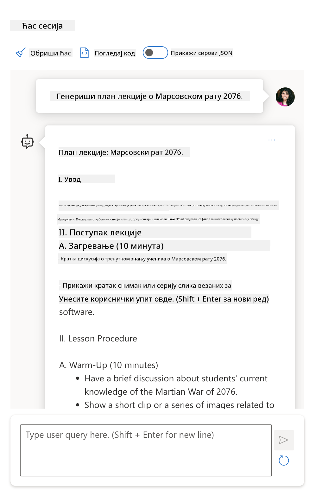

<!--
CO_OP_TRANSLATOR_METADATA:
{
  "original_hash": "a45c318dc6ebc2604f35b8b829f93af2",
  "translation_date": "2025-07-09T11:08:10+00:00",
  "source_file": "04-prompt-engineering-fundamentals/README.md",
  "language_code": "sr"
}
-->
# Основе инжењеринга упита

[](https://aka.ms/gen-ai-lesson4-gh?WT.mc_id=academic-105485-koreyst)

## Увод  
Овај модул обухвата основне појмове и технике за креирање ефикасних упита у генеративним AI моделима. Начин на који формулишете упит за LLM такође је важан. Добро осмишљен упит може довести до квалитетнијег одговора. Али шта тачно значе појмови као што су _упит_ и _инжењеринг упита_? И како да побољшам улазни _упит_ који шаљем LLM-у? На та питања ћемо покушати да одговоримо у овом и наредном поглављу.

_Генеративни AI_ је способан да креира нови садржај (нпр. текст, слике, аудио, код итд.) као одговор на корисничке захтеве. То постиже коришћењем _великих језичких модела_ као што је серија GPT компаније OpenAI („Generative Pre-trained Transformer“) који су обучени за рад са природним језиком и кодом.

Корисници сада могу да комуницирају са овим моделима користећи познате парадигме као што је ћаскање, без потребе за техничким знањем или обуком. Модели су _упитно базирани_ – корисници шаљу текстуални улаз (упит) и добијају AI одговор (комплетирање). Затим могу да „разговарају са AI“ итеративно, у вишекратним разменама, усавршавајући свој упит док одговор не испуни њихова очекивања.

„Упити“ постају главни _програмски интерфејс_ за генеративне AI апликације, говорећи моделима шта да раде и утичући на квалитет добијених одговора. „Инжењеринг упита“ је брзо растућа област која се бави _дизајном и оптимизацијом_ упита како би се обезбедили доследни и квалитетни одговори у великом обиму.

## Циљеви учења

У овој лекцији ћемо научити шта је инжењеринг упита, зашто је важан и како да креирамо ефикасније упите за одређени модел и циљ апликације. Разумеваћемо основне појмове и најбоље праксе у инжењерингу упита – и упознаћемо се са интерактивним окружењем Jupyter Notebooks „песковника“ где можемо видети примену ових појмова на стварним примерима.

До краја ове лекције моћи ћемо да:

1. Објаснимо шта је инжењеринг упита и зашто је важан.
2. Опишемо компоненте упита и како се користе.
3. Научимо најбоље праксе и технике инжењеринга упита.
4. Применимо научене технике на стварним примерима, користећи OpenAI крајњу тачку.

## Кључни појмови

Инжењеринг упита: Практична примена дизајна и усавршавања улаза како би се AI модели усмерили ка производњи жељених резултата.  
Токенизација: Процес претварања текста у мање јединице, зване токени, које модел може да разуме и обради.  
LLM модели подешени инструкцијама: Велики језички модели (LLM) који су додатно обучени са специфичним упутствима како би се побољшала тачност и релевантност одговора.

## Песковник за учење

Инжењеринг упита је тренутно више уметност него наука. Најбољи начин да побољшамо интуицију за њега је да _више вежбамо_ и усвојимо приступ покушаја и грешака који комбинује стручност у домену примене са препорученим техникама и оптимизацијама специфичним за модел.

Jupyter Notebook који прати ову лекцију пружа _песковник_ у коме можете испробати оно што научите – током рада или као део изазова са кодом на крају. За извршавање вежби биће вам потребно:

1. **Azure OpenAI API кључ** – сервисна крајња тачка за распоређени LLM.  
2. **Python окружење** – у коме се Notebook може покренути.  
3. **Локалне променљиве окружења** – _завршите кораке из [SETUP](./../00-course-setup/SETUP.md?WT.mc_id=academic-105485-koreyst) сада да бисте се припремили_.

Notebook садржи _почетне_ вежбе – али се подстиче да додате своје _Markdown_ (описне) и _Code_ (захтеве упита) секције како бисте испробали више примера или идеја – и изградили интуицију за дизајн упита.

## Илустровани водич

Желите да добијете општи преглед о чему ова лекција говори пре него што почнете? Погледајте овај илустровани водич који вам даје осећај главних тема и кључних поука о којима треба размишљати у свакој од њих. План лекције води вас од разумевања основних појмова и изазова до њиховог решавања релевантним техникама и најбољим праксама инжењеринга упита. Имајте у виду да се одељак „Напредне технике“ у овом водичу односи на садржај који ће бити обрађен у _следећем_ поглављу овог курса.


## Наш стартап

Хајде сада да причамо о томе како се _ова тема_ односи на мисију нашег стартапа да [донисмо AI иновације у образовање](https://educationblog.microsoft.com/2023/06/collaborating-to-bring-ai-innovation-to-education?WT.mc_id=academic-105485-koreyst). Желимо да изградимо AI-погонске апликације за _персонализовано учење_ – па размислимо како би различити корисници наше апликације могли „да дизајнирају“ упите:

- **Администратори** могу тражити од AI да _анализира податке о наставном плану како би идентификовао празнине у покривености_. AI може да сумира резултате или их визуелизује уз помоћ кода.  
- **Наставници** могу тражити од AI да _генерише план часа за одређену публику и тему_. AI може да направи персонализовани план у одређеном формату.  
- **Студенти** могу тражити од AI да их _помогне у учењу тешке теме_. AI сада може да води студенте кроз лекције, савете и примере прилагођене њиховом нивоу.

Ово је само врх леденог брега. Погледајте [Prompts For Education](https://github.com/microsoft/prompts-for-edu/tree/main?WT.mc_id=academic-105485-koreyst) – библиотеку отворених упита коју су креирали стручњаци за образовање – да бисте добили шири увид у могућности! _Пробајте да покренете неке од тих упита у песковнику или користећи OpenAI Playground да видите шта ће се десити!_

<!--  
LESSON TEMPLATE:  
This unit should cover core concept #1.  
Reinforce the concept with examples and references.  

CONCEPT #1:  
Prompt Engineering.  
Define it and explain why it is needed.  
-->

## Шта је инжењеринг упита?

Почели смо ову лекцију дефинишући **инжењеринг упита** као процес _дизајнирања и оптимизације_ текстуалних улаза (упита) како би се обезбедили доследни и квалитетни одговори (комплетирања) за одређени циљ апликације и модел. Можемо то посматрати као двостепени процес:

- _дизајнирање_ почетног упита за одређени модел и циљ  
- _усавршавање_ упита итеративно ради побољшања квалитета одговора

Ово је неизбежно процес покушаја и грешака који захтева корисничку интуицију и труд да би се постигли оптимални резултати. Зашто је то важно? Да бисмо одговорили на то питање, прво морамо разумети три појма:

- _Токенизација_ = како модел „види“ упит  
- _Основни LLM модели_ = како основни модел „обрађује“ упит  
- _LLM модели подешени инструкцијама_ = како модел сада може да „разуме задатке“

### Токенизација

LLM види упите као _низ токена_ где различити модели (или верзије модела) могу токенизовати исти упит на различите начине. Пошто су LLM обучени на токенима (а не на сировом тексту), начин на који се упити токенизују директно утиче на квалитет генерисаног одговора.

Да бисте стекли интуицију о томе како токенизација функционише, испробајте алате као што је [OpenAI Tokenizer](https://platform.openai.com/tokenizer?WT.mc_id=academic-105485-koreyst) приказан испод. Копирајте свој упит и погледајте како се он претвара у токене, обраћајући пажњу на то како се третирају празнине и интерпункцијски знакови. Имајте у виду да овај пример користи старији LLM (GPT-3) – па покушај са новијим моделом може дати другачији резултат.


### Пojам: Основни модели

Када је упит токенизован, примарна функција ["Основног LLM"](https://blog.gopenai.com/an-introduction-to-base-and-instruction-tuned-large-language-models-8de102c785a6?WT.mc_id=academic-105485-koreyst) (или основног модела) је да предвиди следећи токен у низу. Пошто су LLM обучени на огромним скупова текстова, имају добру представу о статистичким везама између токена и могу да направе ту предикцију са одређеним степеном сигурности. Имајте у виду да они не разумеју _значење_ речи у упиту или токену; они само виде образац који могу „допунити“ својом следећом предикцијом. Могу наставити да предвиђају низ док их корисник не заустави или док не буде испуњен неки унапред дефинисани услов.

Желите да видите како функционише комплетирање на основу упита? Унесите горе наведени упит у Azure OpenAI Studio [_Chat Playground_](https://oai.azure.com/playground?WT.mc_id=academic-105485-koreyst) са подразумеваним подешавањима. Систем је конфигурисан да третира упите као захтеве за информацијама – па ћете добити одговор који одговара том контексту.

Али шта ако корисник жели нешто конкретно што испуњава неки критеријум или циљ задатка? Ту у игру ступају _LLM модели подешени инструкцијама_.


### Пojам: LLM модели подешени инструкцијама

[LLM модели подешени инструкцијама](https://blog.gopenai.com/an-introduction-to-base-and-instruction-tuned-large-language-models-8de102c785a6?WT.mc_id=academic-105485-koreyst) почињу од основног модела и додатно се обучавају на примерима или паровима улаз/излаз (нпр. вишекратне „поруке“) које могу садржати јасна упутства – а одговор AI покушава да прати та упутства.

Ово користи технике као што је учење појачањем са људским повратним информацијама (RLHF) које могу да обуче модел да _прати упутства_ и _учи из повратних информација_ тако да производи одговоре који су боље прилагођени практичним применама и релевантнији циљевима корисника.

Хајде да пробамо – вратите се на горњи упит, али сада промените _системску поруку_ да садржи следеће упутство као контекст:

> _Сажмите садржај који вам је дат за ученика другог разреда. Резултат држите у једном пасусу са 3-5 тачака у облику списка._

Видите како је резултат сада прилагођен жељеном циљу и формату? Наставник може директно да користи овај одговор у својим презентацијама за тај час.


## Зашто нам треба инжењеринг упита?

Сада када знамо како LLM модели обрађују упите, хајде да причамо о томе _зашто_ нам треба инжењеринг упита. Одговор лежи у чињеници да тренутни LLM модели имају низ изазова који отежавају постизање _поузданих и доследних одговора_ без уложеног труда у конструкцију и оптимизацију упита. На пример:

1. **Одговори модела су стохастички.** _Исти упит_ ће вероватно произвести различите одговоре код различитих модела или верзија модела. Чак може дати различите резултате и са _истим моделом_ у различито време. _Технике инжењеринга упита могу нам помоћи да минимизирамо ове варијације пружајући боље смернице_.

1. **Модели могу измишљати одговоре.** Модели су претходно обучени на _великим али ограниченим_ скупова података, што значи да немају знање о појмовима ван тог опсега обуке. Као резултат, могу произвести одговоре који су нетачни, измишљени или директно супротни познатим чињеницама. _Технике инжењеринга упита помажу корисницима да идентификују и смање такве измишљотине, нпр. тражећи од AI да наведе изворе или образложења_.

1. **Капацитети модела варирају.** Новији модели или генерације модела имају богатије могућности али и јединствене карактеристике и компромисе у трошковима и сложености. _Инжењеринг упита нам може помоћи да развијемо најбоље праксе и радне токове који апстрахују разлике и прилагођавају се захтевима специфичним за модел на скалабилан и беспрекорни начин_.

Погледајте ово у пракси у OpenAI или Azure OpenAI Playground:

- Користите исти упит са различитим LLM распоређивањима (нпр. OpenAI, Azure OpenAI, Hugging Face) – да ли сте приметили варијације?  
- Користите исти упит више пута са _истим_ LLM распоређивањем (нпр. Azure OpenAI playground) – како су се те варијације разликовале?

### Пример измишљотина

У овом курсу користимо термин **„измишљотина“** да означимо феномен када LLM модели понекад генеришу чињенично нетачне информације због ограничења
# План часа: Марсовски рат 2076.

## Циљеви часа
- Разумети узроке и последице Марсовског рата 2076.
- Анализирати главне догађаје и кључне личности у рату.
- Развити критичко мишљење о последицама рата на човечанство и Марс.

## Увод (10 минута)
- Кратак преглед историјског контекста пре 2076. године.
- Објаснити зашто је дошло до конфликта између Земље и Марса.
- Поставити питања ученицима: Шта мислите да је узроковало рат? Како би се ви осећали у таквој ситуацији?

## Главни део (30 минута)
- Презентација главних догађаја рата:
  - Почетак сукоба и прве битке.
  - Технолошки напредак и употреба нових оружја.
  - Кључне личности и њихове улоге.
- Групна дискусија: Како су различите стране виделе рат? Које су биле њихове мотивације?
- Анализа последица рата на политичком, друштвеном и економском плану.

## Закључак (10 минута)
- Резиме најважнијих поена.
- Питања за размишљање: Шта смо научили из Марсовског рата? Како можемо спречити сличне конфликте у будућности?
- Додатни материјали и препоруке за читање.

## Задатак за домаћи
- Написати кратак есеј о томе како је Марсовски рат утицао на односе између Земље и Марса.
- Припремити презентацију о једном од кључних догађаја из рата.
Веб претрага ми је показала да постоје фиктивни прикази (нпр. телевизијске серије или књиге) о Марсовским ратовима – али ниједан из 2076. Здрав разум нам такође говори да је 2076. _у будућности_ и стога не може бити повезан са стварним догађајем.

Па шта се дешава када покренемо овај упит код различитих провајдера LLM?

> **Response 1**: OpenAI Playground (GPT-35)


> **Response 2**: Azure OpenAI Playground (GPT-35)



> **Response 3**: : Hugging Face Chat Playground (LLama-2)


Као што се и очекивало, сваки модел (или верзија модела) даје мало другачије одговоре захваљујући стохастичком понашању и варијацијама у могућностима модела. На пример, један модел је усмерен ка публици осмог разреда, док други претпоставља да је корисник средњошколац. Али сва три модела су генерисала одговоре који би могли убедити неискусног корисника да је догађај стваран.

Технике инжењеринга упита као што су _метаупити_ и _конфигурација температуре_ могу у некој мери смањити измишљотине модела. Нове _архитектуре_ инжењеринга упита такође беспрекорно укључују нове алате и технике у ток упита, како би ублажиле или смањиле неке од ових ефеката.

## Студија случаја: GitHub Copilot

Завршићемо овај одељак добијањем увида у то како се инжењеринг упита користи у стварним решењима, посматрајући једну студију случаја: [GitHub Copilot](https://github.com/features/copilot?WT.mc_id=academic-105485-koreyst).

GitHub Copilot је ваш „AI пар програмер“ – претвара текстуалне упите у комплетирање кода и интегрисан је у ваше развојно окружење (нпр. Visual Studio Code) за беспрекорно корисничко искуство. Као што је документовано у серији блогова испод, најранија верзија била је заснована на OpenAI Codex моделу – а инжењери су брзо схватили потребу за фино подешавање модела и развој бољих техника инжењеринга упита како би побољшали квалитет кода. У јулу су [представили унапређени AI модел који иде даље од Codex-а](https://github.blog/2023-07-28-smarter-more-efficient-coding-github-copilot-goes-beyond-codex-with-improved-ai-model/?WT.mc_id=academic-105485-koreyst) за још брже предлоге.

Прочитајте постове по реду да пратите њихово учење.

- **мај 2023** | [GitHub Copilot све боље разуме ваш код](https://github.blog/2023-05-17-how-github-copilot-is-getting-better-at-understanding-your-code/?WT.mc_id=academic-105485-koreyst)
- **мај 2023** | [Изнутра GitHub: Рад са LLM-овима иза GitHub Copilot-а](https://github.blog/2023-05-17-inside-github-working-with-the-llms-behind-github-copilot/?WT.mc_id=academic-105485-koreyst)
- **јун 2023** | [Како написати боље упите за GitHub Copilot](https://github.blog/2023-06-20-how-to-write-better-prompts-for-github-copilot/?WT.mc_id=academic-105485-koreyst)
- **јул 2023** | [GitHub Copilot иде даље од Codex-а са унапређеним AI моделом](https://github.blog/2023-07-28-smarter-more-efficient-coding-github-copilot-goes-beyond-codex-with-improved-ai-model/?WT.mc_id=academic-105485-koreyst)
- **јул 2023** | [Водич за програмере о инжењерингу упита и LLM-овима](https://github.blog/2023-07-17-prompt-engineering-guide-generative-ai-llms/?WT.mc_id=academic-105485-koreyst)
- **сеп 2023** | [Како изградити ентерпрајз LLM апликацију: лекције из GitHub Copilot-а](https://github.blog/2023-09-06-how-to-build-an-enterprise-llm-application-lessons-from-github-copilot/?WT.mc_id=academic-105485-koreyst)

Такође можете прегледати њихов [инжењерски блог](https://github.blog/category/engineering/?WT.mc_id=academic-105485-koreyst) за више постова као што је [овај](https://github.blog/2023-09-27-how-i-used-github-copilot-chat-to-build-a-reactjs-gallery-prototype/?WT.mc_id=academic-105485-koreyst) који показује како се ови модели и технике _примењују_ за покретање стварних апликација.

---

<!--
LESSON TEMPLATE:
This unit should cover core concept #2.
Reinforce the concept with examples and references.

CONCEPT #2:
Prompt Design.
Illustrated with examples.
-->

## Конструкција упита

Видели смо зашто је инжењеринг упита важан – сада хајде да разумемо како се упити _конструишу_ како бисмо могли да проценимо различите технике за ефикаснији дизајн упита.

### Основни упит

Почнимо са основним упитом: текстуални унос послат моделу без другог контекста. Ево примера – када пошаљемо прве речи америчке националне химне OpenAI [Completion API-ју](https://platform.openai.com/docs/api-reference/completions?WT.mc_id=academic-105485-koreyst), он одмах _завршава_ одговор са следећим редовима, илуструјући основно понашање предвиђања.

| Prompt (Input)     | Completion (Output)                                                                                                                        |
| :----------------- | :----------------------------------------------------------------------------------------------------------------------------------------- |
| Oh say can you see | Изгледа да почињете са текстом „The Star-Spangled Banner“, националне химне Сједињених Држава. Цео текст гласи ... |

### Комплексни упит

Сада додајмо контекст и упутства том основном упиту. [Chat Completion API](https://learn.microsoft.com/azure/ai-services/openai/how-to/chatgpt?WT.mc_id=academic-105485-koreyst) нам омогућава да конструишемо комплексни упит као скуп _порука_ са:

- паровима уноса/излаза који одражавају унос _корисника_ и одговор _асистента_
- системском поруком која поставља контекст понашања или личности асистента

Захтев је сада у облику испод, где _токенизација_ ефикасно хвата релевантне информације из контекста и разговора. Промена системског контекста може бити подједнако утицајна на квалитет комплетирања као и уноси корисника.

```python
response = openai.chat.completions.create(
    model="gpt-3.5-turbo",
    messages=[
        {"role": "system", "content": "You are a helpful assistant."},
        {"role": "user", "content": "Who won the world series in 2020?"},
        {"role": "assistant", "content": "The Los Angeles Dodgers won the World Series in 2020."},
        {"role": "user", "content": "Where was it played?"}
    ]
)
```

### Упит са упутствима

У горе наведеним примерима, кориснички упит је био једноставан текстуални захтев који се може тумачити као захтев за информацијом. Са _упитима са упутствима_, можемо користити тај текст да детаљније одредимо задатак, пружајући боље смернице AI-ју. Ево примера:

| Prompt (Input)                                                                                                                                                                                                                         | Completion (Output)                                                                                                        | Instruction Type    |
| :------------------------------------------------------------------------------------------------------------------------------------------------------------------------------------------------------------------------------------- | :------------------------------------------------------------------------------------------------------------------------- | :------------------ |
| Напиши опис Грађанског рата                                                                                                                                                                                                           | _вратио једноставан пасус_                                                                                                | Једноставан         |
| Напиши опис Грађанског рата. Наведи кључне датуме и догађаје и опиши њихов значај                                                                                                                                                       | _вратио пасус праћен списком кључних датума догађаја са описима_                                                         | Комплексан          |
| Напиши опис Грађанског рата у 1 пасусу. Наведи 3 тачке са кључним датумима и њиховим значајем. Наведи још 3 тачке са кључним историјским личностима и њиховим доприносима. Врати резултат као JSON фајл | _враћа детаљније информације у текстуалном пољу, форматиране као JSON који можете копирати и сачувати у фајл и по потреби верификовати_ | Комплексан. Форматиран. |

## Примарни садржај

У горе наведеним примерима, упит је и даље био прилично отворен, дозвољавајући LLM-у да одлучи који део свог претходно обученог скупа података је релевантан. Са дизајн патерном _примарни садржај_, улазни текст се дели на два дела:

- упутство (акција)
- релевантан садржај (који утиче на акцију)

Ево примера где је упутство „сажми ово у 2 реченице“.

| Prompt (Input)                                                                                                                                                                                                                                                                                                                                                                                                                                                                                                                                                                                                                                                                                      | Completion (Output)                                                                                                                                                                                                                                                                             |
| :-------------------------------------------------------------------------------------------------------------------------------------------------------------------------------------------------------------------------------------------------------------------------------------------------------------------------------------------------------------------------------------------------------------------------------------------------------------------------------------------------------------------------------------------------------------------------------------------------------------------------------------------------------------------------------------------------- | :---------------------------------------------------------------------------------------------------------------------------------------------------------------------------------------------------------------------------------------------------------------------------------------------- |
| Јупитер је пета планета од Сунца и највећа у Сунчевом систему. То је гасовити гигант чија је маса хиљадити део масе Сунца, али два и по пута већа од масе свих осталих планета у Сунчевом систему заједно. Јупитер је један од најсјајнијих објеката видљивих голим оком на ноћном небу и познат је древним цивилизацијама још пре записане историје. Назван је по римском богу Јупитеру.[19] Када се посматра са Земље, Јупитер може бити довољно сјајан да његова одсјајна светлост баца видљиве сенке,[20] и у просеку је трећи најсјајнији природни објекат на ноћном небу после Месеца и Венере. <br/> **Сажми ово у 2 кратке реченице** | Јупитер, пета планета од Сунца, највећа је у Сунчевом систему и познат је као један од најсјајнијих објеката на ноћном небу. Назван по римском богу Јупитеру, то је гасовити гигант чија је маса два и по пута већа од масе свих осталих планета у Сунчевом систему заједно. |

Сегмент примарног садржаја може се користити на различите начине за ефикасније вођење упутстава:

- **Примери** – уместо да моделу директно кажемо шта да ради, дајемо му примере шта да ради и дозволимо му да закључи образац.
- **Наговештаји** – пратимо упутство „наговештајем“ који припрема одговор, усмеравајући модел ка релевантнијим одговорима.
- **Шаблони** – ово су поновљиви „рецепти“ за упите са плейсхолдерима (променљивим) које можемо прилагодити подацима за конкретне случајеве употребе.

Хајде да их испробамо у пракси.

### Коришћење примера

Ово је приступ где користите примарни садржај да „нахраните модел“ неким примерима жељеног излаза за дато упутство и дозволите му да закључи образац жељеног излаза. У зависности од броја примера, можемо имати zero-shot, one-shot, few-shot упите итд.

Упит сада садржи три компонента:

- опис задатка
- неколико примера жељеног излаза
- почетак новог примера (који постаје имплицитни опис задатка)

| Learning Type | Prompt (Input)                                                                                                                                        | Completion (Output)         |
| :------------ | :---------------------------------------------------------------------------------------------------------------------------------------------------- | :-------------------------- |
| Zero-shot     | „The Sun is Shining“. Преведи на шпански                                                                                                            | „El Sol está brillando“.    |
| One-shot      | „The Sun is Shining“ => „El Sol está brillando“. <br> „It's a Cold and Windy Day“ =>                                                                 | „Es un día frío y ventoso“. |
| Few-shot      | The player ran the bases => Baseball <br/> The player hit an ace => Tennis <br/> The player hit a six => Cricket <br/> The player made a slam-dunk => | Basketball                  |
|               |                                                                                                                                                       |                             |

Приметите како смо у zero-shot упиту морали дати експлицитно упутство („Преведи на шпански“), али оно се подразумева у one-shot примеру. Few-shot пример показује како додавање више примера омогућава моделима да прецизније закључују без додатних упутстава.

### Наговештаји у упиту

Још једна техника коришћења примарног садржаја је да се пруже _наговештаји_ уместо примера. У овом случају, дајемо моделу подстрек тако што га _покрећемо_ исечком који одражава жељени формат одговора. Модел онда „узима наговештај“ и наставља у том стилу.

| Number of Cues | Prompt (Input)                                                                                                                                                                                                                                                                                                                                                                                                                                               | Completion (Output)                                                                                                                                                                                                                                                                                       |
| :------------- | :----------------------------------------------------------------------------------------------------------------------------------------------------------------------------------------------------------------------------------------------------------------------------------------------------------------------------------------------------------------------------------------------------------------------------------------------------------- | :-------------------------------------------------------------------------------------------------------------------------------------------------------------------------------------------------------------------------------------------------------------------------------------------------------- |
| 0              | Јупитер је пета планета од Сунца и највећа у Сунчевом систему. То је гасовити гигант чија је маса хиљадити део масе Сунца, али два и по пута већа од масе свих осталих планета у Сунчевом систему заједно. Јупитер је један од најсјајнијих објеката видљивих голим оком на ноћном небу, и познат је древним цивилизацијама још пре записане историје.

**Сажми ово**                                       | Јупитер је највећа планета у нашем Сунчевом систему и пета по реду од Сунца. То је гасовити гигант чија је маса 1/1000 масе Сунца, али је тежи од свих осталих планета заједно. Древне цивилизације су дуго познавале Јупитер, и он је лако видљив на ноћном небу. |
| 1              | Јупитер је пета планета од Сунца и највећа у Сунчевом систему. То је гасовити гигант чија је маса једна хиљадита масе Сунца, али је два и по пута тежи од свих осталих планета у Сунчевом систему заједно. Јупитер је један од најсјајнијих објеката видљивих голим оком на ноћном небу и познат је древним цивилизацијама још пре записане историје. <br/>**Сажми ово** <br/> Оно што смо научили је да је Јупитер | пета планета од Сунца и највећа у Сунчевом систему. То је гасовити гигант чија је маса једна хиљадита масе Сунца, али два и по пута већа од свих осталих планета заједно. Лако је видљив голим оком и познат је још из давнина.                        |
| 2              | Јупитер је пета планета од Сунца и највећа у Сунчевом систему. То је гасовити гигант чија је маса једна хиљадита масе Сунца, али два и по пута тежи од свих осталих планета у Сунчевом систему заједно. Јупитер је један од најсјајнијих објеката видљивих голим оком на ноћном небу и познат је древним цивилизацијама још пре записане историје. <br/>**Сажми ово** <br/> Топ 3 чињенице које смо научили:         | 1. Јупитер је пета планета од Сунца и највећа у Сунчевом систему. <br/> 2. То је гасовити гигант чија је маса једна хиљадита масе Сунца...<br/> 3. Јупитер је видљив голим оком још из давнина ...                                                                       |
|                |                                                                                                                                                                                                                                                                                                                                                                                                                                                              |                                                                                                                                                                                                                                                                                                           |

### Шаблони за упите

Шаблон упита је _унапред дефинисани рецепт за упит_ који се може сачувати и поново користити по потреби, како би се обезбедило доследније корисничко искуство у великом обиму. У најједноставнијем облику, то је једноставно збирка примера упита као што је [овај од OpenAI](https://platform.openai.com/examples?WT.mc_id=academic-105485-koreyst) који пружа и интерактивне компоненте упита (поруке корисника и система) и формат захтева покретан преко API-ја - за подршку поновне употребе.

У сложенијем облику, као [овај пример од LangChain](https://python.langchain.com/docs/concepts/prompt_templates/?WT.mc_id=academic-105485-koreyst), садржи _плејсхолдере_ који се могу заменити подацима из различитих извора (кориснички унос, контекст система, спољни извори података итд.) како би се динамички генерисао упит. Ово нам омогућава да креирамо библиотеку поновно употребљивих упита која се може користити за доследно корисничко искуство **програмски** у великом обиму.

Коначно, права вредност шаблона лежи у могућности креирања и објављивања _библиотека упита_ за вертикалне апликационе домене - где је шаблон упита сада _оптимизован_ да одражава контекст специфичан за апликацију или примере који чине одговоре релевантнијим и прецизнијим за циљну корисничку публику. Репозиторијум [Prompts For Edu](https://github.com/microsoft/prompts-for-edu?WT.mc_id=academic-105485-koreyst) је одличан пример овог приступа, који курира библиотеку упита за образовни домен са нагласком на кључне циљеве као што су планирање часова, дизајн наставног плана, подучавање ученика итд.

## Помоћни садржај

Ако разматрамо конструкцију упита као састављену од инструкције (задатка) и циља (примарног садржаја), онда је _секундарни садржај_ као додатни контекст који пружамо да **на неки начин утиче на излаз**. То могу бити параметри подешавања, упутства за форматирање, таксономије тема итд. који помажу моделу да _прилагоди_ свој одговор тако да одговара жељеним корисничким циљевима или очекивањима.

На пример: Ако имамо каталог курсева са обимним метаподацима (назив, опис, ниво, ознаке метаподатака, предавач итд.) за све доступне курсеве у наставном плану:

- можемо дефинисати инструкцију да "сажмемо каталог курсева за јесен 2023"
- можемо користити примарни садржај да пружимо неколико примера жељеног излаза
- можемо користити секундарни садржај да идентификујемо топ 5 "ознака" од интереса.

Сада модел може дати сажетак у формату приказаном у примерима - али ако резултат има више ознака, може приоритет дати 5 ознака идентификованих у секундарном садржају.

---

<!--
ШАБЛОН ЗА ЧАС:
Ова јединица треба да покрије основни концепт #1.
Ојачати концепт примерима и референцама.

КОНЦЕПТ #3:
Технике за инжењеринг упита.
Које су неке основне технике за инжењеринг упита?
Илуструјте их вежбама.
-->

## Најбоље праксе за упите

Сада када знамо како се упити могу _конструисати_, можемо почети да размишљамо како их _дизајнирати_ да одражавају најбоље праксе. Можемо ово посматрати у два дела - имање правог _начина размишљања_ и примену правих _техника_.

### Начин размишљања у инжењерингу упита

Инжењеринг упита је процес покушаја и грешке, па имајте на уму три широка водича:

1. **Разумевање домена је важно.** Тачност и релевантност одговора зависи од _домена_ у којем апликација или корисник делује. Примените своју интуицију и стручност у домену да **даље прилагодите технике**. На пример, дефинишите _персоналитете специфичне за домен_ у системским упитима, или користите _шаблоне специфичне за домен_ у корисничким упитима. Пружите секундарни садржај који одражава контексте специфичне за домен, или користите _наводе и примере специфичне за домен_ да усмерите модел ка познатим обрасцима коришћења.

2. **Разумевање модела је важно.** Знамо да су модели по природи стохастички. Али имплементације модела могу варирати у погледу скупова података за обуку (предтренирано знање), могућности које пружају (нпр. преко API-ја или SDK-а) и типа садржаја за који су оптимизовани (нпр. код, слике, текст). Разумите снаге и ограничења модела који користите и искористите то знање да _приоритетизујете задатке_ или креирате _прилагођене шаблоне_ оптимизоване за могућности модела.

3. **Итерација и валидација су важни.** Модели се брзо развијају, као и технике за инжењеринг упита. Као стручњак у домену, можда имате други контекст или критеријуме за _вашу_ специфичну апликацију, који не морају важити за ширу заједницу. Користите алате и технике инжењеринга упита да "брзо покренете" конструкцију упита, затим итеративно проверавајте и валидајте резултате користећи своју интуицију и стручност. Записујте своја сазнања и креирајте **базу знања** (нпр. библиотеке упита) која може послужити као нова основа за друге, за брже итерације у будућности.

## Најбоље праксе

Погледајмо сада уобичајене најбоље праксе које препоручују [OpenAI](https://help.openai.com/en/articles/6654000-best-practices-for-prompt-engineering-with-openai-api?WT.mc_id=academic-105485-koreyst) и [Azure OpenAI](https://learn.microsoft.com/azure/ai-services/openai/concepts/prompt-engineering#best-practices?WT.mc_id=academic-105485-koreyst) стручњаци.

| Шта                              | Зашто                                                                                                                                                                                                                                               |
| :-------------------------------- | :------------------------------------------------------------------------------------------------------------------------------------------------------------------------------------------------------------------------------------------------ |
| Процените најновије моделе.       | Нове генерације модела вероватно имају побољшане функције и квалитет - али могу имати и веће трошкове. Процените их по утицају, па донесите одлуке о миграцији.                                                                                         |
| Раздвојите инструкције и контекст | Проверите да ли ваш модел/провајдер дефинише _делимитере_ за јасније разликовање инструкција, примарног и секундарног садржаја. Ово може помоћи моделима да прецизније додељују тежине токенима.                                                         |
| Будите прецизни и јасни           | Дајте више детаља о жељеном контексту, исходу, дужини, формату, стилу итд. Ово ће побољшати и квалитет и доследност одговора. Сачувајте рецепте у поновно употребљивим шаблонима.                                                                  |
| Будите описни, користите примере  | Модели боље реагују на приступ „покажи и реци“. Почните са `zero-shot` приступом где дате само инструкцију (без примера), па онда пробајте `few-shot` као унапређење, пружајући неколико примера жељеног излаза. Користите аналогије.                  |
| Користите наводе за покретање завршетака | Усмерите модел ка жељеном исходу тако што ћете му дати неке уводне речи или фразе које може користити као полазну тачку за одговор.                                                                                                               |
| Понављајте ако треба             | Понекад је потребно да се моделу понови оно што сте рекли. Дајте инструкције пре и после примарног садржаја, користите инструкцију и навод, итд. Итеративно проверавајте шта најбоље функционише.                                                         |
| Редослед је важан               | Редослед у којем представљате информације моделу може утицати на излаз, чак и у примерима за учење, због ефекта свежине. Испробајте различите опције да видите шта најбоље функционише.                                                               |
| Дајте моделу „излаз“            | Омогућите моделу _резервни_ одговор који може дати ако из неког разлога не може да заврши задатак. Ово смањује шансе да модел генерише нетачне или измишљене одговоре.                                                                             |
|                                   |                                                                                                                                                                                                                                                   |

Као и код сваке најбоље праксе, имајте на уму да _ваши резултати могу варирати_ у зависности од модела, задатка и домена. Користите ово као полазну тачку и итеративно тражите шта вам највише одговара. Континуирано преиспитујте свој процес инжењеринга упита како нови модели и алати постају доступни, са фокусом на скалабилност процеса и квалитет одговора.

<!--
ШАБЛОН ЗА ЧАС:
Ова јединица треба да пружи изазов са кодом ако је применљиво

ИЗАЗОВ:
Линк ка Jupyter Notebook-у са само коментарима у упутствима (код је празан).

РЕШЕЊЕ:
Линк ка копији тог Notebook-а са попуњеним упитима и покренутим примером.
-->

## Задатак

Честитамо! Дошли сте до краја часа! Време је да неке од тих концепата и техника испробате у пракси са стварним примерима!

За наш задатак користићемо Jupyter Notebook са вежбама које можете интерактивно решавати. Такође можете проширити Notebook својим Markdown и Code ћелијама да бисте сами истраживали идеје и технике.

### Да бисте почели, форкујте репозиторијум, затим

- (Препоручено) Покрените GitHub Codespaces
- (Алтернативно) Клонирајте репозиторијум на свој локални уређај и користите га са Docker Desktop-ом
- (Алтернативно) Отворите Notebook у свом омиљеном окружењу за покретање Notebook-а.

### Затим, конфигуришите своје променљиве окружења

- Копирајте фајл `.env.copy` из корена репозиторијума у `.env` и попуните вредности `AZURE_OPENAI_API_KEY`, `AZURE_OPENAI_ENDPOINT` и `AZURE_OPENAI_DEPLOYMENT`. Вратите се на [Learning Sandbox одељак](../../../04-prompt-engineering-fundamentals/04-prompt-engineering-fundamentals) да научите како.

### Затим, отворите Jupyter Notebook

- Изаберите runtime kernel. Ако користите опције 1 или 2, једноставно изаберите подразумевани Python 3.10.x kernel који пружа дев контејнер.

Спремни сте да покренете вежбе. Имајте на уму да овде нема _правих и погрешних_ одговора – само истраживање опција методом покушаја и грешке и развијање интуиције шта функционише за одређени модел и домен апликације.

_Због тога у овом часу нема сегмената са решењима кода. Уместо тога, Notebook ће имати Markdown ћелије са насловом "Моје решење:" које показују један пример излаза за референцу._

 <!--
ШАБЛОН ЗА ЧАС:
Завршите одељак са резимеом и ресурсима за самостално учење.
-->

## Провера знања

Који од следећих упита је добар и прати разумне најбоље праксе?

1. Прикажи ми слику црвеног аутомобила  
2. Прикажи ми слику црвеног аутомобила марке Volvo и модела XC90 паркираног поред литице са заласком сунца  
3. Прикажи ми слику црвеног аутомобила марке Volvo и модела XC90

Одговор: 2, јер је најбољи упит јер пружа детаље о „шта“ и улази у специфичности (не само било који аутомобил, већ одређена марка и модел) и описује целокупни амбијент. 3 је следећи најбољи јер такође садржи доста описа.

## 🚀 Изазов

Покушајте да искористите технику „навод“ са упитом: Допуни реченицу „Прикажи ми слику црвеног аутомобила марке Volvo и “. Како модел одговара и како бисте то побољшали?

## Одличан посао! Настав

**Одрицање од одговорности**:  
Овај документ је преведен коришћењем AI преводилачке услуге [Co-op Translator](https://github.com/Azure/co-op-translator). Иако се трудимо да превод буде тачан, молимо вас да имате у виду да аутоматизовани преводи могу садржати грешке или нетачности. Оригинални документ на његовом изворном језику треба сматрати ауторитетним извором. За критичне информације препоручује се професионални људски превод. Нисмо одговорни за било каква неспоразума или погрешна тумачења која произилазе из коришћења овог превода.