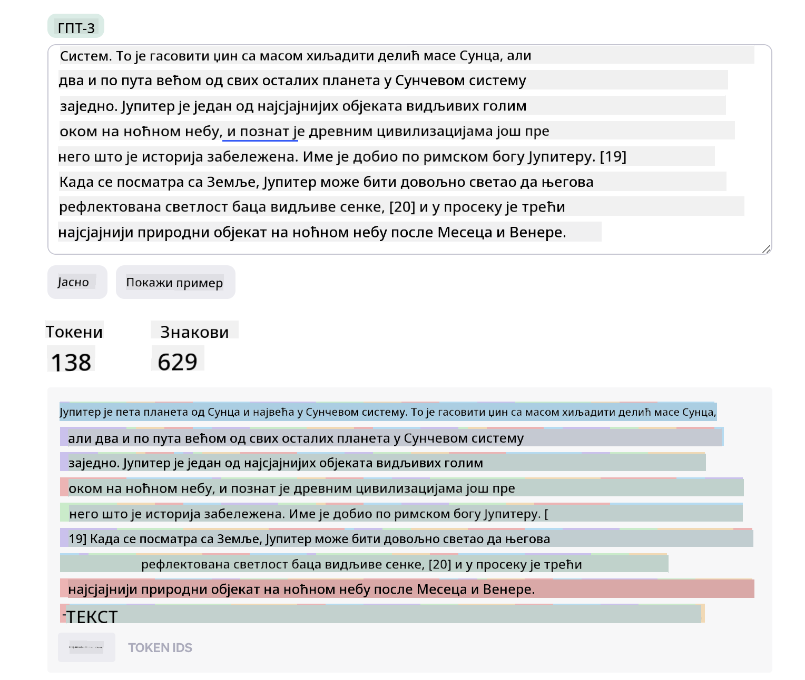
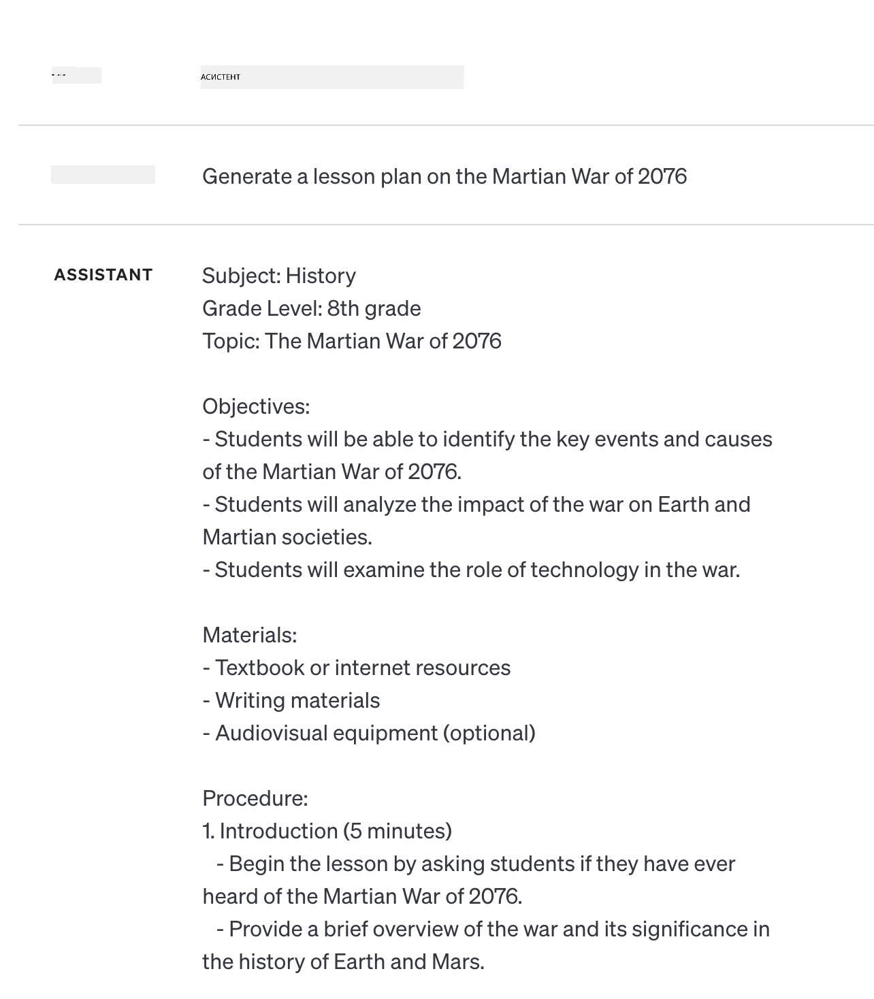
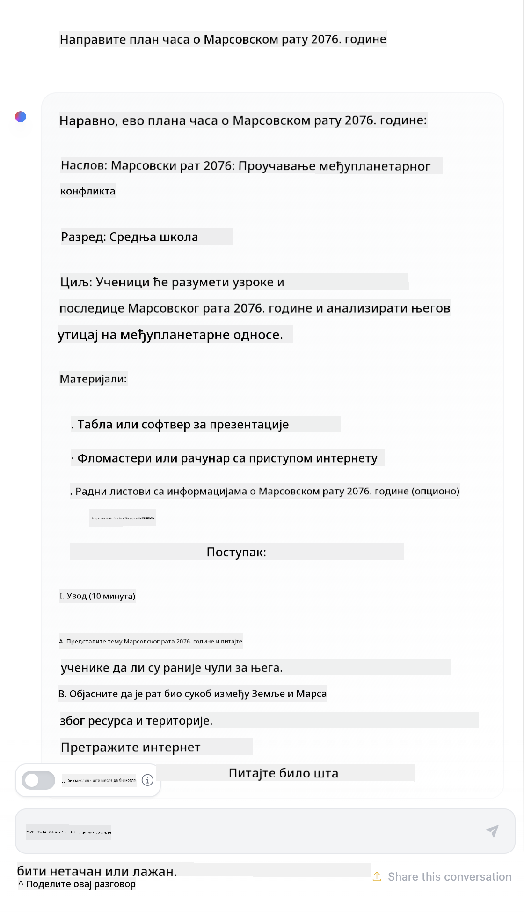

<!--
CO_OP_TRANSLATOR_METADATA:
{
  "original_hash": "dcbaaae026cb50fee071e690685b5843",
  "translation_date": "2025-08-26T19:33:54+00:00",
  "source_file": "04-prompt-engineering-fundamentals/README.md",
  "language_code": "sr"
}
-->
# Основе инжењеринга промптова

[](https://aka.ms/gen-ai-lesson4-gh?WT.mc_id=academic-105485-koreyst)

## Увод
Овај модул покрива кључне концепте и технике за креирање ефикасних промптова у генеративним AI моделима. Начин на који напишете свој промпт за LLM је такође важан. Пажљиво осмишљен промпт може довести до квалитетнијег одговора. Али шта заправо значе термини као што су _промпт_ и _инжењеринг промптова_? И како да побољшам _улазни промпт_ који шаљем LLM-у? Ово су питања на која ћемо покушати да одговоримо у овом и наредном поглављу.

_Генеративна AI_ је способна да ствара нови садржај (нпр. текст, слике, аудио, код итд.) као одговор на захтеве корисника. То постиже коришћењем _великих језичких модела_ као што је OpenAI-јев GPT ("Generative Pre-trained Transformer") серијал, који су тренирани за рад са природним језиком и кодом.

Корисници сада могу да комуницирају са овим моделима користећи познате парадигме као што је чет, без потребе за техничким знањем или обуком. Модели су _засновани на промптовима_ – корисници шаљу текстуални улаз (промпт) и добијају AI одговор (комплитион). Затим могу "разговарати са AI-јем" у више корака, усавршавајући свој промпт док одговор не испуни њихова очекивања.

"Промптови" сада постају примарни _програмерски интерфејс_ за генеративне AI апликације, говорећи моделима шта да раде и утичући на квалитет добијених одговора. "Инжењеринг промптова" је брзорастућа област која се бави _дизајном и оптимизацијом_ промптова како би се обезбедили доследни и квалитетни одговори у великом обиму.

## Циљеви учења

У овој лекцији ћемо научити шта је инжењеринг промптова, зашто је важан и како можемо да креирамо ефикасније промптове за дати модел и циљ апликације. Разумећемо основне концепте и најбоље праксе за инжењеринг промптова – и упознати се са интерактивним Jupyter Notebooks "sandbox" окружењем где можемо видети примену ових концепата на стварним примерима.

На крају ове лекције бићемо у стању да:

1. Објаснимо шта је инжењеринг промптова и зашто је важан.
2. Описати компоненте промпта и како се користе.
3. Научимо најбоље праксе и технике за инжењеринг промптова.
4. Применимо научене технике на стварним примерима, користећи OpenAI endpoint.

## Кључни појмови

Инжењеринг промптова: Практиковање дизајнирања и усавршавања улаза како би се AI модели усмерили ка жељеним излазима.
Токенизација: Процес претварања текста у мање јединице, зване токени, које модел може да разуме и обради.
LLM-ови подешени инструкцијама: Велики језички модели (LLM) који су додатно тренирани са специфичним инструкцијама ради побољшања тачности и релевантности одговора.

## Окружење за учење

Инжењеринг промптова је тренутно више уметност него наука. Најбољи начин да побољшамо интуицију за ову област је да _што више вежбамо_ и усвојимо приступ покушаја и грешке који комбинује стручност из домена са препорученим техникама и оптимизацијама специфичним за модел.

Jupyter Notebook који прати ову лекцију пружа _sandbox_ окружење у коме можете испробати оно што учите – у ходу или као део изазова са кодом на крају. Да бисте извршили вежбе, потребно је:

1. **Azure OpenAI API кључ** – сервисни endpoint за деплојовани LLM.
2. **Python окружење** – у коме се Notebook може покренути.
3. **Локалне променљиве окружења** – _завршите кораке из [SETUP](./../00-course-setup/02-setup-local.md?WT.mc_id=academic-105485-koreyst) да бисте били спремни_.

Notebook долази са _почетним_ вежбама – али се охрабрујете да додате своје _Markdown_ (опис) и _Code_ (захтеви за промпт) секције како бисте испробали више примера или идеја – и изградили своју интуицију за дизајн промптова.

## Илустровани водич

Желите да стекнете општу слику о томе шта ова лекција покрива пре него што зароните у детаље? Погледајте овај илустровани водич који вам даје преглед главних тема и кључних поука о којима треба да размишљате у свакој од њих. Путоказ лекције вас води од разумевања основних концепата и изазова до њиховог решавања релевантним техникама и најбољим праксама инжењеринга промптова. Имајте у виду да се одељак "Напредне технике" у овом водичу односи на садржај који ће бити обрађен у _наредном_ поглављу овог курса.


## Наш стартап

Хајде сада да причамо о томе како се _ова тема_ односи на нашу стартап мисију да [донесемо AI иновације у образовање](https://educationblog.microsoft.com/2023/06/collaborating-to-bring-ai-innovation-to-education?WT.mc_id=academic-105485-koreyst). Желимо да градимо AI апликације за _персонализовано учење_ – па размислимо како различити корисници наше апликације могу "дизајнирати" промптове:

- **Администратори** могу тражити од AI-ја да _анализира податке о наставном плану и програму како би идентификовао празнине у покривености_. AI може сумирати резултате или их визуализовати помоћу кода.
- **Наставници** могу тражити од AI-ја да _генерише план лекције за одређену публику и тему_. AI може направити персонализовани план у задатом формату.
- **Ученици** могу тражити од AI-ја да их _подучава у тешком предмету_. AI сада може водити ученике кроз лекције, савете и примере прилагођене њиховом нивоу.

Ово је само врх леденог брега. Погледајте [Prompts For Education](https://github.com/microsoft/prompts-for-edu/tree/main?WT.mc_id=academic-105485-koreyst) – библиотеку промптова отвореног кода коју су креирали стручњаци за образовање – да стекнете ширу слику могућности! _Пробајте да покренете неке од тих промптова у sandbox-у или користећи OpenAI Playground да видите шта ће се десити!_

<!--
LESSON TEMPLATE:
This unit should cover core concept #1.
Reinforce the concept with examples and references.

CONCEPT #1:
Prompt Engineering.
Define it and explain why it is needed.
-->

## Шта је инжењеринг промптова?

Почели смо ову лекцију дефинисањем **инжењеринга промптова** као процеса _дизајнирања и оптимизације_ текстуалних улаза (промптова) како би се добили доследни и квалитетни одговори (completions) за дати циљ апликације и модел. Ово можемо посматрати као процес у 2 корака:

- _дизајнирање_ почетног промпта за дати модел и циљ
- _усавршавање_ промпта кроз више итерација ради побољшања квалитета одговора

Ово је нужно процес покушаја и грешке који захтева интуицију и труд корисника да би се добили оптимални резултати. Зашто је то важно? Да бисмо одговорили на то питање, прво морамо разумети три концепта:

- _Токенизација_ = како модел "види" промпт
- _Основни LLM-ови_ = како foundation модел "обрађује" промпт
- _LLM-ови подешени инструкцијама_ = како модел сада може да види "задатке"

### Токенизација

LLM види промптове као _низ токена_ где различити модели (или верзије модела) могу токенизовати исти промпт на различите начине. Пошто се LLM-ови тренирају на токенима (а не на сировом тексту), начин на који се промптови токенизују директно утиче на квалитет генерисаног одговора.

Да бисте стекли интуицију о томе како ради токенизација, пробајте алате као што је [OpenAI Tokenizer](https://platform.openai.com/tokenizer?WT.mc_id=academic-105485-koreyst) приказан испод. Копирајте свој промпт – и видите како се претвара у токене, обратите пажњу на то како се обрађују празнине и интерпункцијски знаци. Имајте у виду да овај пример приказује старији LLM (GPT-3) – па покушај са новијим моделом може дати другачији резултат.



### Концепт: Foundation модели

Када се промпт токенизује, примарна функција ["основног LLM-а"](https://blog.gopenai.com/an-introduction-to-base-and-instruction-tuned-large-language-models-8de102c785a6?WT.mc_id=academic-105485-koreyst) (или foundation модела) је да предвиди следећи токен у том низу. Пошто су LLM-ови тренирани на огромним скуповима текстуалних података, имају добру представу о статистичким односима између токена и могу да направе ту прогнозу са одређеним степеном сигурности. Имајте у виду да они не разумеју _значење_ речи у промпту или токену; они само виде шаблон који могу да "допуне" својом следећом прогнозом. Могу наставити да предвиђају низ док их не заустави корисник или неки унапред дефинисан услов.

Желите да видите како ради комплетирање на основу промпта? Унесите горњи промпт у Azure OpenAI Studio [_Chat Playground_](https://oai.azure.com/playground?WT.mc_id=academic-105485-koreyst) са подразумеваним подешавањима. Систем је подешен да третира промптове као захтеве за информацијама – па би требало да видите комплетирање које одговара овом контексту.

Али шта ако корисник жели да види нешто конкретно што испуњава одређене критеријуме или циљ задатка? Ту на сцену ступају LLM-ови подешени инструкцијама.


### Концепт: LLM-ови подешени инструкцијама

[LLM подешен инструкцијама](https://blog.gopenai.com/an-introduction-to-base-and-instruction-tuned-large-language-models-8de102c785a6?WT.mc_id=academic-105485-koreyst) почиње од foundation модела и додатно се тренира примерима или паровима улаз/излаз (нпр. вишеструке "поруке") који могу садржати јасне инструкције – а одговор AI-ја покушава да прати ту инструкцију.

Ово користи технике као што је појачано учење са повратном информацијом од људи (RLHF) које могу тренирати модел да _прати инструкције_ и _учи из повратне информације_ тако да производи одговоре који су боље прилагођени практичним апликацијама и релевантнији циљевима корисника.

Хајде да пробамо – вратите се на горњи промпт, али сада промените _system message_ да дате следећу инструкцију као контекст:

> _Сажми садржај који ти је дат за ученика другог разреда. Задржи резултат у једном пасусу са 3-5 ставки у виду булета._

Видите ли како је резултат сада прилагођен жељеном циљу и формату? Наставник сада може директно да користи овај одговор у својим слајдовима за тај час.


## Зашто нам је потребан инжењеринг промптова?

Сада када знамо како LLM-ови обрађују промптове, хајде да причамо о _зашто_ нам је потребан инжењеринг промптова. Одговор лежи у чињеници да тренутни LLM-ови имају низ изазова који чине _поуздано и доследно комплетирање_ тежим за постизање без улагања труда у конструкцију и оптимизацију промпта. На пример:

1. **Одговори модела су стохастички.** _Исти промпт_ ће вероватно дати различите одговоре са различитим моделима или верзијама модела. А може дати и различите резултате са _истим моделом_ у различито време. _Технике инжењеринга промптова могу нам помоћи да минимизирамо ове варијације давањем бољих смерница._

1. **Модели могу измишљати одговоре.** Модели су тренирани на _великим али коначним_ скуповима података, што значи да им недостају знања о појмовима ван тог опсега. Као резултат, могу дати комплетирања која су нетачна, измишљена или директно супротна познатим чињеницама. _Технике инжењеринга промптова помажу корисницима да препознају и ублаже такве измишљотине, нпр. тражењем од AI-ја да наведе изворе или образложење._

1. **Могућности модела ће се разликовати.** Новији модели или генерације модела имаће богатије могућности, али и доносе јединствене специфичности и компромисе у погледу цене и сложености. _Инжењеринг промптова нам може помоћи да развијемо најбоље праксе и радне токове који апстрахују разлике и прилагођавају се захтевима специфичним за модел на скалабилан и једноставан начин._

Хајде да ово видимо у пракси у OpenAI или Azure OpenAI Playground-у:

- Користите исти промпт са различитим LLM деплојментима (нпр. OpenAI, Azure OpenAI, Hugging Face) – да ли сте приметили разлике?
- Користите исти промпт више пута са _истим_ LLM деплојментом (нпр. Azure OpenAI playground) – како су се ове варијације разликовале?

### Пример измишљотина

У овом курсу користимо појам **"из
# План часа: Марсовски рат 2076. године

## Циљеви учења

- Разумети узроке и последице Марсовског рата 2076. године.
- Анализирати главне актере и њихове мотиве.
- Истражити утицај рата на друштво, технологију и међупланетарне односе.

## Увод (10 минута)

- Кратко представљање историјског контекста Марса пре 2076. године.
- Дискусија о првим људским колонијама и њиховим изазовима.

## Главни део (30 минута)

### Узроци рата

- Сукоби око ресурса: вода, енергија, територија.
- Политичке тензије између Земље и марсовских колонија.
- Технолошки напредак и борба за контролу над новим иновацијама.

### Ток рата

- Главне битке и стратешки потези.
- Улога аутономних система и вештачке интелигенције.
- Утицај рата на цивилно становништво.

### Последице

- Промене у управљању Марсом.
- Нови закони и споразуми између планета.
- Развој нових технологија као резултат рата.

## Активности (15 минута)

- Рад у групама: Анализирајте један догађај из рата и представите га осталима.
- Дебата: Да ли је рат био неизбежан? Како би се могао избећи?

## Закључак (5 минута)

- Рефлексија: Како је Марсовски рат обликовао будућност међупланетарних односа?
- Кратко питање за размишљање: Које лекције можемо применити на данашње конфликте?

## Домаћи задатак

- Напишите кратак есеј о једном хероју или хероини Марсовског рата 2076. године и њиховом утицају на исход рата.
Веб претрага ми је показала да постоје измишљени прикази (нпр. телевизијске серије или књиге) о ратовима на Марсу – али ниједан у 2076. години. Здрав разум нам такође говори да је 2076. _у будућности_ и самим тим не може бити повезана са стварним догађајем.

Шта се дешава када овај упит покренемо код различитих LLM провајдера?

> **Одговор 1**: OpenAI Playground (GPT-35)



> **Одговор 2**: Azure OpenAI Playground (GPT-35)


> **Одговор 3**: Hugging Face Chat Playground (LLama-2)



Као што се и очекивало, сваки модел (или верзија модела) даје мало другачије одговоре захваљујући стохастичком понашању и разликама у могућностима модела. На пример, један модел се обраћа публици од осмог разреда, док други претпоставља средњошколца. Али сва три модела су дала одговоре који би могли да убеде неискусног корисника да је догађај стварно постојао.

Технике инжењеринга упита као што су _метапромптинг_ и _конфигурисање температуре_ могу донекле смањити измишљање од стране модела. Нове _архитектуре_ инжењеринга упита такође укључују нове алате и технике у сам ток упита, како би се ублажили или смањили неки од ових ефеката.

## Студија случаја: GitHub Copilot

Хајде да ову секцију завршимо тако што ћемо видети како се инжењеринг упита користи у стварним решењима, кроз једну студију случаја: [GitHub Copilot](https://github.com/features/copilot?WT.mc_id=academic-105485-koreyst).

GitHub Copilot је ваш "AI пар програмер" – претвара текстуалне упите у предлоге кода и интегрисан је у ваше развојно окружење (нпр. Visual Studio Code) ради што бољег корисничког искуства. Како је описано у серији блогова испод, најранија верзија је била заснована на OpenAI Codex моделу – а инжењери су брзо схватили потребу да се модел додатно подеси и развију боље технике инжењеринга упита, ради побољшања квалитета кода. У јулу су [представили унапређени AI модел који превазилази Codex](https://github.blog/2023-07-28-smarter-more-efficient-coding-github-copilot-goes-beyond-codex-with-improved-ai-model/?WT.mc_id=academic-105485-koreyst) за још брже предлоге.

Прочитајте постове редом, како бисте пратили њихов пут учења.

- **Мај 2023** | [GitHub Copilot све боље разуме ваш код](https://github.blog/2023-05-17-how-github-copilot-is-getting-better-at-understanding-your-code/?WT.mc_id=academic-105485-koreyst)
- **Мај 2023** | [Унутар GitHub-а: Рад са LLM-овима иза GitHub Copilot-а](https://github.blog/2023-05-17-inside-github-working-with-the-llms-behind-github-copilot/?WT.mc_id=academic-105485-koreyst).
- **Јун 2023** | [Како написати боље упите за GitHub Copilot](https://github.blog/2023-06-20-how-to-write-better-prompts-for-github-copilot/?WT.mc_id=academic-105485-koreyst).
- **Јул 2023** | [.. GitHub Copilot превазилази Codex са унапређеним AI моделом](https://github.blog/2023-07-28-smarter-more-efficient-coding-github-copilot-goes-beyond-codex-with-improved-ai-model/?WT.mc_id=academic-105485-koreyst)
- **Јул 2023** | [Водич за програмере: Инжењеринг упита и LLM-ови](https://github.blog/2023-07-17-prompt-engineering-guide-generative-ai-llms/?WT.mc_id=academic-105485-koreyst)
- **Септембар 2023** | [Како направити LLM апликацију за предузећа: лекције из GitHub Copilot-а](https://github.blog/2023-09-06-how-to-build-an-enterprise-llm-application-lessons-from-github-copilot/?WT.mc_id=academic-105485-koreyst)

Можете такође прегледати њихов [инжењерски блог](https://github.blog/category/engineering/?WT.mc_id=academic-105485-koreyst) за још постова попут [овог](https://github.blog/2023-09-27-how-i-used-github-copilot-chat-to-build-a-reactjs-gallery-prototype/?WT.mc_id=academic-105485-koreyst) који показује како се ови модели и технике _примењују_ у развоју стварних апликација.

---

## Конструкција упита

Видели смо зашто је инжењеринг упита важан – сада да разумемо како се упити _конструишу_ како бисмо могли да проценимо различите технике за ефикаснији дизајн упита.

### Основни упит

Почнимо од основног упита: текстуални унос који се шаље моделу без додатног контекста. Ево примера – када пошаљемо прве речи америчке химне OpenAI-јевом [Completion API-ју](https://platform.openai.com/docs/api-reference/completions?WT.mc_id=academic-105485-koreyst), он одмах _допуњава_ одговор следећим стиховима, што илуструје основно понашање предвиђања.

| Упит (Input)         | Допуна (Output)                                                                                                                                      |
| :------------------- | :--------------------------------------------------------------------------------------------------------------------------------------------------- |
| Oh say can you see   | Изгледа да почињете текст химне "The Star-Spangled Banner", националне химне Сједињених Држава. Пуни текст гласи ...                                 |

### Комплексни упит

Сада додајмо контекст и инструкције том основном упиту. [Chat Completion API](https://learn.microsoft.com/azure/ai-services/openai/how-to/chatgpt?WT.mc_id=academic-105485-koreyst) нам омогућава да направимо комплексни упит као скуп _порука_ са:

- Паровима унос/одговор који одражавају _кориснички_ унос и _асистентов_ одговор.
- Системском поруком која поставља контекст за понашање или личност асистента.

Захтев сада изгледа овако, где _токенизација_ ефикасно хвата релевантне информације из контекста и разговора. Промена системског контекста може имати једнако велики утицај на квалитет одговора као и сами кориснички уноси.

```python
response = openai.chat.completions.create(
    model="gpt-3.5-turbo",
    messages=[
        {"role": "system", "content": "You are a helpful assistant."},
        {"role": "user", "content": "Who won the world series in 2020?"},
        {"role": "assistant", "content": "The Los Angeles Dodgers won the World Series in 2020."},
        {"role": "user", "content": "Where was it played?"}
    ]
)
```

### Инструкцијски упит

У горњим примерима, кориснички упит је био једноставан текстуални захтев који се може тумачити као молба за информацијом. Са _инструкцијским_ упитима, можемо тај текст искористити да детаљније наведемо задатак, дајући вештачкој интелигенцији боље смернице. Ево примера:

| Упит (Input)                                                                                                                                                                                                                         | Допуна (Output)                                                                                                        | Тип инструкције     |
| :----------------------------------------------------------------------------------------------------------------------------------------------------------------------------------------------------------------------------------- | :--------------------------------------------------------------------------------------------------------------------- | :------------------ |
| Напиши опис Грађанског рата                                                                                                                                                                   | _враћа једноставан пасус_                                                                                              | Једноставан         |
| Напиши опис Грађанског рата. Наведи кључне датуме и догађаје и опиши њихов значај                                                                                                             | _враћа пасус, а затим листу кључних датума са описима_                                                                  | Комплексни           |
| Напиши опис Грађанског рата у једном пасусу. Наведи 3 тачке са кључним датумима и њиховим значајем. Наведи још 3 тачке са кључним историјским личностима и њиховим доприносом. Врати резултат као JSON фајл | _враћа детаљније податке у текст боксу, форматиране као JSON који можете копирати у фајл и по потреби проверити_        | Комплексни. Форматиран. |

## Примарни садржај

У горњим примерима, упит је и даље био прилично отворен, дозвољавајући LLM-у да сам одлучи који део његовог претходно обученог скупа података је релевантан. Са _примарним садржајем_ као дизајн шаблоном, улазни текст се дели на два дела:

- инструкцију (акцију)
- релевантан садржај (који утиче на акцију)

Ево примера где је инструкција "сажми ово у 2 реченице".

| Упит (Input)                                                                                                                                                                                                                                                                                                                                                                                                                                                                                                                                                                                                                                                                                      | Допуна (Output)                                                                                                                                                                                                                                                                             |
| :-------------------------------------------------------------------------------------------------------------------------------------------------------------------------------------------------------------------------------------------------------------------------------------------------------------------------------------------------------------------------------------------------------------------------------------------------------------------------------------------------------------------------------------------------------------------------------------------------------------------------------------------------------------------------------------------------- | :---------------------------------------------------------------------------------------------------------------------------------------------------------------------------------------------------------------------------------------------------------------------------------------------- |
| Jupiter је пета планета од Сунца и највећа у Сунчевом систему. То је гасни џин са масом која је хиљадити део масе Сунца, али два и по пута већа од свих осталих планета у Сунчевом систему заједно. Jupiter је један од најсјајнијих објеката видљивих голим оком на ноћном небу, и познат је древним цивилизацијама још пре писане историје. Име је добио по римском богу Јупитеру.[19] Када се посматра са Земље, Jupiter може бити довољно светао да његова одсјајна светлост баца видљиве сенке,[20] и у просеку је трећи најсјајнији природни објекат на ноћном небу после Месеца и Венере. <br/> **Сажми ово у 2 кратке реченице** | Jupiter, пета планета од Сунца, највећа је у Сунчевом систему и позната је као један од најсјајнијих објеката на ноћном небу. Име је добио по римском богу Јупитеру, а то је гасни џин чија је маса два и по пута већа од свих осталих планета у Сунчевом систему заједно. |

Сегмент примарног садржаја може се користити на различите начине за ефикасније инструкције:

- **Примери** – уместо да моделу експлицитно кажете шта да ради, дајте му примере жељеног излаза и дозволите му да сам закључи образац.
- **Смернице (cues)** – након инструкције додајте "смерницу" која усмерава допуну, водећи модел ка релевантнијим одговорима.
- **Шаблони** – ово су поновљиви 'рецепти' за упите са променљивама (placeholder-има) које се могу прилагодити подацима за конкретне случајеве.

Хајде да ово видимо на делу.

### Коришћење примера

Ово је приступ где користите примарни садржај да "нахраните модел" примерима жељеног излаза за дати задатак, и дозволите му да сам закључи образац за жељени излаз. У зависности од броја примера, имамо zero-shot, one-shot, few-shot упите итд.

Упит сада има три компоненте:

- Опис задатка
- Неколико примера жељеног излаза
- Почетак новог примера (који постаје имплицитни опис задатка)

| Тип учења   | Упит (Input)                                                                                                   | Допуна (Output)             |
| :---------- | :------------------------------------------------------------------------------------------------------------- | :-------------------------- |
| Zero-shot   | "The Sun is Shining". Translate to Spanish                                                                     | "El Sol está brillando".    |
| One-shot    | "The Sun is Shining" => ""El Sol está brillando". <br> "It's a Cold and Windy Day" =>                          | "Es un día frío y ventoso". |
| Few-shot    | The player ran the bases => Baseball <br/> The player hit an ace => Tennis <br/> The player hit a six => Cricket <br/> The player made a slam-dunk => | Basketball                  |
|             |                                                                                                                |                             |

Приметите како смо морали да дамо експлицитну инструкцију ("Translate to Spanish") у zero-shot примеру, али се она подразумева у one-shot примеру. Few-shot пример показује како додавање више примера омогућава моделу да тачније закључи без додатних инструкција.

### Смернице у упиту (Prompt Cues)

Још једна техника за коришћење примарног садржаја је да дате _смернице_ уместо примера. У овом случају, моделу дајете мали подстицај у правом смеру тако што _започнете_ одговор фрагментом који одражава жељени формат одговора. Модел онда "узима смерницу" и наставља у том стилу.

| Број смерница | Упит (Input)                                                                                                                                                                                                                                                                                                                                                                                                                                               | Допуна (Output)                                                                                                                                                                                                                                                                                       |
| :------------ | :----------------------------------------------------------------------------------------------------------------------------------------------------------------------------------------------------------------------------------------------------------------------------------------------------------------------------------------------------------------------------------------------------------------------------------------------------------- | :-------------------------------------------------------------------------------------------------------------------------------------------------------------------------------------------------------------------------------------------------------------------------------------------------------- |
| 0             | Jupiter је пета планета од Сунца и највећа у Сунчевом систему. То је гасни џин са масом која је хиљадити део масе Сунца, али два и по пута већа од свих осталих планета у Сунчевом систему заједно. Jupiter је један од најсјајнијих објеката видљивих голим оком на ноћном небу, и познат је древним цивилизацијама још пре писане историје.

**Сажми ово**                                       | Јупитер је највећа планета у нашем Сунчевом систему и пета по реду од Сунца. То је гасни џин са масом која је 1/1000 масе Сунца, али је тежи од свих осталих планета заједно. Јупитер је познат древним цивилизацијама већ дуго, и лако се види на ноћном небу. |
| 1              | Јупитер је пета планета од Сунца и највећа у Сунчевом систему. То је гасни џин са масом која је хиљадити део масе Сунца, али је два и по пута тежи од свих осталих планета у Сунчевом систему заједно. Јупитер је један од најсјајнијих објеката који се могу видети голим оком на ноћном небу, и познат је древним цивилизацијама још пре писане историје. <br/>**Сажми ово** <br/> Оно што смо научили је да је Јупитер | пета планета од Сунца и највећа у Сунчевом систему. То је гасни џин са масом која је хиљадити део масе Сунца, али два и по пута тежи од свих осталих планета заједно. Лако се види голим оком и познат је још од давнина.                        |
| 2              | Јупитер је пета планета од Сунца и највећа у Сунчевом систему. То је гасни џин са масом која је хиљадити део масе Сунца, али је два и по пута тежи од свих осталих планета у Сунчевом систему заједно. Јупитер је један од најсјајнијих објеката који се могу видети голим оком на ноћном небу, и познат је древним цивилизацијама још пре писане историје. <br/>**Сажми ово** <br/> Топ 3 чињенице које смо научили:         | 1. Јупитер је пета планета од Сунца и највећа у Сунчевом систему. <br/> 2. То је гасни џин са масом која је хиљадити део масе Сунца...<br/> 3. Јупитер је видљив голим оком још од давнина ...                                                                       |
|                |                                                                                                                                                                                                                                                                                                                                                                                                                                                              |                                                                                                                                                                                                                                                                                                           |

### Шаблони за упите

Шаблон за упит је _унапред дефинисан рецепт за упит_ који се може сачувати и поново користити по потреби, како би се обезбедило доследно корисничко искуство у великом обиму. У најједноставнијем облику, то је збирка примера упита као [овај од OpenAI](https://platform.openai.com/examples?WT.mc_id=academic-105485-koreyst) који садржи интерактивне компоненте упита (корисничке и системске поруке) и формат захтева преко API-ја - за лакшу поновну употребу.

У сложенијем облику као [овај пример од LangChain](https://python.langchain.com/docs/concepts/prompt_templates/?WT.mc_id=academic-105485-koreyst) садржи _место за уметање_ које се може заменити подацима из различитих извора (кориснички унос, системски контекст, спољни извори података итд.) да би се упит генерисао динамички. Ово нам омогућава да направимо библиотеку поново употребљивих упита који се могу користити за доследно корисничко искуство **програмски** у великом обиму.

Прави значај шаблона је у могућности да се креирају и објављују _библиотеке упита_ за одређене области примене - где је шаблон за упит сада _оптимизован_ да одражава специфичан контекст или примере који чине одговоре релевантнијим и тачнијим за циљану групу корисника. Репозиторијум [Prompts For Edu](https://github.com/microsoft/prompts-for-edu?WT.mc_id=academic-105485-koreyst) је одличан пример овог приступа, са библиотеком упита за образовање са нагласком на кључне циљеве као што су планирање наставе, дизајн курикулума, подучавање ученика итд.

## Пратећи садржај

Ако на конструкцију упита гледамо као на инструкцију (задатак) и циљ (главни садржај), онда је _секундарни садржај_ додатни контекст који дајемо да **утичемо на излаз на неки начин**. То могу бити параметри за подешавање, инструкције за форматирање, таксономије тема итд. који могу помоћи моделу да _прилагоди_ свој одговор жељеним циљевима или очекивањима корисника.

На пример: Дата је листа курсева са обимним метаподацима (назив, опис, ниво, ознаке, предавач итд.) за све доступне курсеве у курикулуму:

- можемо дефинисати инструкцију "сажми листу курсева за јесен 2023"
- можемо користити главни садржај да дамо неколико примера жељеног излаза
- можемо користити секундарни садржај да издвојимо топ 5 "ознака" од интереса.

Сада модел може да да сажетак у формату који је приказан у примерима - али ако резултат има више ознака, може да да приоритет 5 идентификованих ознака из секундарног садржаја.

---

<!--
Шаблон лекције:
Овај део треба да покрије основни концепт #1.
Потврди концепт примерима и референцама.

КОНЦЕПТ #3:
Технике инжењеринга упита.
Које су основне технике за инжењеринг упита?
Илуструј то кроз неке вежбе.
-->

## Најбоље праксе за упите

Сада када знамо како се упити могу _конструисати_, можемо почети да размишљамо о томе како да их _дизајнирамо_ у складу са најбољим праксама. Ово можемо посматрати у два дела - имати прави _начин размишљања_ и применити праве _технике_.

### Начин размишљања за инжењеринг упита

Инжењеринг упита је процес покушаја и грешке, па имајте на уму три широка водиља:

1. **Разумевање домена је важно.** Тачност и релевантност одговора зависи од _домена_ у коме апликација или корисник ради. Примените своју интуицију и стручност из домена да **додатно прилагодите технике**. На пример, дефинишите _личности специфичне за домен_ у системским упитима, или користите _шаблоне специфичне за домен_ у корисничким упитима. Додајте секундарни садржај који одражава контекст домена, или користите _сигнале и примере специфичне за домен_ да усмерите модел ка познатим обрасцима употребе.

2. **Разумевање модела је важно.** Знамо да су модели по природи стохастички. Али имплементације модела се могу разликовати по томе који скуп података користе за обуку (унапред научено знање), које могућности пружају (нпр. преко API-ја или SDK-а) и за коју врсту садржаја су оптимизовани (нпр. код, слике, текст). Разумите предности и ограничења модела који користите, и користите то знање да _дајете приоритет задацима_ или градите _прилагођене шаблоне_ оптимизоване за могућности модела.

3. **Итерација и валидација су важне.** Модели се брзо развијају, као и технике за инжењеринг упита. Као стручњак за домен, можда имате додатни контекст или критеријуме _ваше_ апликације, који не морају да важе за ширу заједницу. Користите алате и технике инжењеринга упита да "покренете" конструкцију упита, затим итеративно проверавајте резултате користећи своју интуицију и стручност. Запишите своја запажања и направите **базу знања** (нпр. библиотеке упита) коју други могу користити као нову основу за брже итерације у будућности.

## Најбоље праксе

Погледајмо сада уобичајене најбоље праксе које препоручују [OpenAI](https://help.openai.com/en/articles/6654000-best-practices-for-prompt-engineering-with-openai-api?WT.mc_id=academic-105485-koreyst) и [Azure OpenAI](https://learn.microsoft.com/azure/ai-services/openai/concepts/prompt-engineering#best-practices?WT.mc_id=academic-105485-koreyst) стручњаци.

| Шта                              | Зашто                                                                                                                                                                                                                                               |
| :-------------------------------- | :------------------------------------------------------------------------------------------------------------------------------------------------------------------------------------------------------------------------------------------------ |
| Оцењуј најновије моделе.       | Нове генерације модела вероватно имају боље могућности и квалитет - али могу бити и скупље. Процените њихов утицај, па донесите одлуку о миграцији.                                                                                |
| Одвој инструкције и контекст   | Проверите да ли ваш модел/провајдер дефинише _разграничиваче_ да јасније раздвоји инструкције, главни и секундарни садржај. Ово може помоћи моделу да тачније додели тежину токенима.                                                         |
| Будите прецизни и јасни             | Дајте више детаља о жељеном контексту, исходу, дужини, формату, стилу итд. Ово ће побољшати и квалитет и доследност одговора. Сачувајте рецепте у шаблонима за поновну употребу.                                                          |
| Будите описни, користите примере      | Модели често боље реагују на приступ "покажи и објасни". Почните са `zero-shot` приступом где дајете инструкцију (без примера), па пробајте `few-shot` као унапређење, дајући неколико примера жељеног излаза. Користите аналогије. |
| Користите сигнале за покретање одговора | Усмерите модел ка жељеном исходу дајући му неке почетне речи или фразе које може да користи као полазну тачку за одговор.                                                                                                               |
| Поновите инструкцију                       | Понекад је потребно да се моделу понови инструкција. Дајте инструкцију пре и после главног садржаја, користите инструкцију и сигнал итд. Итерирајте и проверавајте шта ради најбоље.                                                         |
| Редослед је битан                     | Редослед којим представљате информације моделу може утицати на излаз, чак и у примерима за учење, због пристрасности ка новијем. Пробајте различите опције да видите шта ради најбоље.                                                               |
| Дајте моделу "излаз"           | Дајте моделу _резервни_ одговор који може да понуди ако не може да заврши задатак из било ког разлога. Ово може смањити шансе да модел генерише нетачне или измишљене одговоре.                                                         |
|                                   |                                                                                                                                                                                                                                                   |

Као и код сваке најбоље праксе, имајте на уму да _ваши резултати могу варирати_ у зависности од модела, задатка и домена. Користите ове савете као полазну основу, и итерирајте да пронађете шта најбоље ради за вас. Стално преиспитујте свој процес инжењеринга упита како се појављују нови модели и алати, са фокусом на скалабилност процеса и квалитет одговора.

<!--
Шаблон лекције:
Овај део треба да садржи изазов са кодом ако је применљиво

ИЗАЗОВ:
Линк ка Jupyter Notebook-у са само коментарима у инструкцијама (секције са кодом су празне).

РЕШЕЊЕ:
Линк ка копији тог Notebook-а са попуњеним и покренутим упитима, да се види један пример.
-->

## Задатак

Честитамо! Стигли сте до краја лекције! Време је да неке од ових концепата и техника испробате на стварним примерима!

За овај задатак користићемо Jupyter Notebook са вежбама које можете интерактивно решавати. Можете и да проширите Notebook својим Markdown и Code ћелијама да истражите идеје и технике самостално.

### За почетак, форкујте репозиторијум, затим

- (Препоручено) Покрените GitHub Codespaces
- (Алтернативно) Клонирајте репо на свој уређај и користите га са Docker Desktop
- (Алтернативно) Отворите Notebook у свом омиљеном окружењу за Notebook.

### Затим, подесите своје променљиве окружења

- Копирајте `.env.copy` фајл из корена репоа у `.env` и попуните `AZURE_OPENAI_API_KEY`, `AZURE_OPENAI_ENDPOINT` и `AZURE_OPENAI_DEPLOYMENT` вредности. Вратите се на [Learning Sandbox секцију](../../../04-prompt-engineering-fundamentals/04-prompt-engineering-fundamentals) да научите како.

### Затим, отворите Jupyter Notebook

- Изаберите kernel за рад. Ако користите опције 1 или 2, једноставно изаберите подразумевани Python 3.10.x kernel који обезбеђује dev container.

Све је спремно за рад на вежбама. Имајте на уму да овде нема _тачних и нетачних_ одговора - само истражујете опције методом покушаја и грешке и градите интуицију за оно што ради за дати модел и домен примене.

_Због тога у овој лекцији нема сегмената са решењем кода. Уместо тога, Notebook ће имати Markdown ћелије са насловом "Моје решење:" које показују један пример излаза за референцу._

 <!--
Шаблон лекције:
Заврши део са сажетком и ресурсима за самостално учење.
-->

## Провера знања

Који од следећих упита је добар и прати неке разумне најбоље праксе?

1. Покажи ми слику црвеног аутомобила
2. Покажи ми слику црвеног аутомобила марке Volvo и модела XC90 паркираног поред литице са заласком сунца
3. Покажи ми слику црвеног аутомобила марке Volvo и модела XC90

Одговор: 2, то је најбољи упит јер даје детаље о "шта" и иде у специфике (не било који аутомобил већ одређена марка и модел) и описује целокупно окружење. 3 је следећи најбољи јер такође садржи доста описа.

## 🚀 Изазов

Пробај да искористиш технику "сигнала" са упитом: Доврши реченицу "Покажи ми слику црвеног аутомобила марке Volvo и ". Шта модел одговара, и како би то побољшао?

## Одличан рад! Настави са учењем

Желиш да сазнаш више о различитим концептима инжењеринга упита? Погледај [страницу за наставак учења](https://aka.ms/genai-collection?WT.mc_id=academic-105485-koreyst) и пронађи друге корисне ресурсе на ову тему.

Пређи на лекцију 5 где ћемо погледати [напредне технике за упите](../05-advanced-prompts/README.md?WT.mc

---

**Одрицање од одговорности**:  
Овај документ је преведен коришћењем AI услуге за превођење [Co-op Translator](https://github.com/Azure/co-op-translator). Иако настојимо да обезбедимо тачност, имајте у виду да аутоматски преводи могу садржати грешке или нетачности. Оригинални документ на изворном језику треба сматрати меродавним извором. За критичне информације препоручује се професионални људски превод. Не сносимо одговорност за било каква неспоразума или погрешна тумачења настала употребом овог превода.