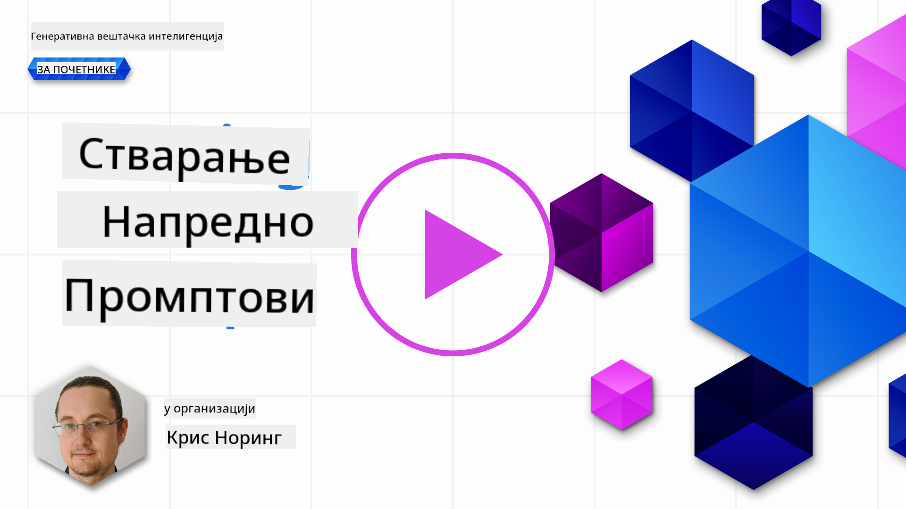

<!--
CO_OP_TRANSLATOR_METADATA:
{
  "original_hash": "b2651fb16bcfbc62b8e518751ed90fdb",
  "translation_date": "2025-10-18T01:15:35+00:00",
  "source_file": "05-advanced-prompts/README.md",
  "language_code": "sr"
}
-->
# Креирање напредних упутстава

[](https://youtu.be/BAjzkaCdRok?si=NmUIyRf7-cDgbjtt)

Хајде да резимирамо шта смо научили у претходном поглављу:

> Инжењеринг упутстава је процес којим **усмеравамо модел ка релевантнијим одговорима** пружањем кориснијих инструкција или контекста.

Постоје два корака у писању упутстава: конструисање упутства, пружањем релевантног контекста, и _оптимизација_, односно постепено побољшавање упутства.

До сада смо стекли основно разумевање како се пишу упутства, али морамо ићи дубље. У овом поглављу ћете прећи са испробавања различитих упутстава на разумевање зашто је једно упутство боље од другог. Научићете како да конструишете упутства пратећи неке основне технике које се могу применити на било који LLM.

## Увод

У овом поглављу ћемо обрадити следеће теме:

- Проширите своје знање о инжењерингу упутстава применом различитих техника на ваша упутства.
- Конфигуришите своја упутства како бисте добили различите излазе.

## Циљеви учења

Након завршетка ове лекције, бићете у могућности да:

- Примените технике инжењеринга упутстава које побољшавају резултате ваших упутстава.
- Извршите упутства која су или разноврсна или детерминистичка.

## Инжењеринг упутстава

Инжењеринг упутстава је процес креирања упутстава која ће произвести жељени резултат. Инжењеринг упутстава није само писање текста упутства. То није инжењерска дисциплина, већ скуп техника које можете применити да бисте добили жељени резултат.

### Пример упутства

Узмимо једно основно упутство као што је ово:

> Генериши 10 питања о географији.

У овом упутству, заправо примењујете скуп различитих техника за креирање упутстава.

Хајде да то разложимо.

- **Контекст**, наводите да треба да буде о "географији".
- **Ограничење излаза**, желите највише 10 питања.

### Ограничења једноставних упутстава

Можда ћете добити или не добити жељени резултат. Добићете генерисана питања, али географија је велика тема и можда нећете добити оно што желите из следећих разлога:

- **Широка тема**, не знате да ли ће бити о земљама, главним градовима, рекама и тако даље.
- **Формат**, шта ако желите да питања буду форматирана на одређени начин?

Као што видите, постоји много тога што треба узети у обзир приликом креирања упутстава.

До сада смо видели једноставан пример упутства, али генеративна вештачка интелигенција је способна за много више како би помогла људима у различитим улогама и индустријама. Хајде да истражимо неке основне технике.

### Технике за креирање упутстава

Прво, морамо разумети да је креирање упутстава _емергентна_ особина LLM-а, што значи да то није функција уграђена у модел, већ нешто што откривамо док користимо модел.

Постоје неке основне технике које можемо користити за креирање упутстава за LLM. Хајде да их истражимо.

- **Zero-shot упутства**, ово је најосновнији облик упутстава. То је једно упутство које захтева одговор од LLM-а искључиво на основу његових података за обуку.
- **Few-shot упутства**, ова врста упутстава води LLM пружањем једног или више примера на које се може ослонити како би генерисао свој одговор.
- **Ланац размишљања (Chain-of-thought)**, ова врста упутстава говори LLM-у како да разложи проблем на кораке.
- **Генерисано знање**, за побољшање одговора на упутство, можете пружити генерисане чињенице или знање као додатак вашем упутству.
- **Од најмањег ка највећем (Least to most)**, као и ланац размишљања, ова техника се односи на разлагање проблема на низ корака и затим тражење да се ти кораци изврше редом.
- **Самоусавршавање (Self-refine)**, ова техника се односи на критику излаза LLM-а и затим тражење да га побољша.
- **Мајеутичка упутства (Maieutic prompting)**. Овде желите да осигурате да је одговор LLM-а тачан и тражите од њега да објасни различите делове одговора. Ово је облик самоусавршавања.

### Zero-shot упутства

Овај стил упутстава је веома једноставан, састоји се од једног упутства. Ова техника је вероватно оно што користите када тек почињете да учите о LLM-овима. Ево примера:

- Упутство: "Шта је алгебра?"
- Одговор: "Алгебра је грана математике која проучава математичке симболе и правила за њихову манипулацију."

### Few-shot упутства

Овај стил упутстава помаже моделу пружањем неколико примера заједно са захтевом. Састоји се од једног упутства са додатним подацима специфичним за задатак. Ево примера:

- Упутство: "Напиши песму у стилу Шекспира. Ево неколико примера Шекспирових сонета:
  Сонет 18: 'Да ли да те упоредим са летњим даном? Ти си лепши и умеренији...'
  Сонет 116: 'Нећу признати препреке у браку истинских умова. Љубав није љубав која се мења кад промена наиђе...'
  Сонет 132: 'Твоје очи волим, и оне, као да ме жале, Знајући да твоје срце ме мучи презиром,...'
  Сада напиши сонет о лепоти месеца."
- Одговор: "На небу месец нежно сија, У сребрној светлости која баца своју благу милост,..."

Примери пружају LLM-у контекст, формат или стил жељеног излаза. Они помажу моделу да разуме специфичан задатак и генерише тачније и релевантније одговоре.

### Ланац размишљања

Ланац размишљања је веома занимљива техника јер се односи на вођење LLM-а кроз низ корака. Идеја је да се LLM инструише на такав начин да разуме како нешто да уради. Размотримо следећи пример, са и без ланца размишљања:

    - Упутство: "Алиса има 5 јабука, баца 3 јабуке, даје 2 Бобу, а Боб јој враћа једну, колико јабука има Алиса?"
    - Одговор: 5

LLM одговара са 5, што је нетачно. Тачан одговор је 1 јабука, с обзиром на израчунавање (5 - 3 - 2 + 1 = 1).

Како можемо научити LLM да ово уради исправно?

Хајде да пробамо ланац размишљања. Примена ланца размишљања значи:

1. Дати LLM-у сличан пример.
2. Показати израчунавање и како га исправно израчунати.
3. Пружити оригинално упутство.

Ево како:

- Упутство: "Лиса има 7 јабука, баца 1 јабуку, даје 4 јабуке Барту, а Барт јој враћа једну:
  7 - 1 = 6
  6 - 4 = 2
  2 + 1 = 3  
  Алиса има 5 јабука, баца 3 јабуке, даје 2 Бобу, а Боб јој враћа једну, колико јабука има Алиса?"
  Одговор: 1

Приметите како пишемо знатно дужа упутства са другим примером, израчунавањем и затим оригиналним упутством, и долазимо до тачног одговора 1.

Као што видите, ланац размишљања је веома моћна техника.

### Генерисано знање

Често када желите да конструишете упутство, желите то да урадите користећи податке ваше компаније. Желите да део упутства буде из компаније, а други део да буде стварно упутство које вас занима.

На пример, овако може изгледати ваше упутство ако сте у осигурању:

```text
{{company}}: {{company_name}}
{{products}}:
{{products_list}}
Please suggest an insurance given the following budget and requirements:
Budget: {{budget}}
Requirements: {{requirements}}
```

Горе видите како је упутство конструисано коришћењем шаблона. У шаблону постоји неколико променљивих, означених са `{{variable}}`, које ће бити замењене стварним вредностима из API-ја компаније.

Ево примера како би упутство могло изгледати када се променљиве замене садржајем из ваше компаније:

```text
Insurance company: ACME Insurance
Insurance products (cost per month):
- Car, cheap, 500 USD
- Car, expensive, 1100 USD
- Home, cheap, 600 USD
- Home, expensive, 1200 USD
- Life, cheap, 100 USD

Please suggest an insurance given the following budget and requirements:
Budget: $1000
Requirements: Car, Home, and Life insurance
```

Покретање овог упутства кроз LLM ће произвести одговор попут овог:

```output
Given the budget and requirements, we suggest the following insurance package from ACME Insurance:
- Car, cheap, 500 USD
- Home, cheap, 600 USD
- Life, cheap, 100 USD
Total cost: $1,200 USD
```

Као што видите, такође предлаже животно осигурање, што не би требало. Овај резултат је индикација да треба да оптимизујемо упутство тако што ћемо га променити да буде јасније шта је дозвољено. Након неколико _покушаја и грешака_, долазимо до следећег упутства:

```text
Insurance company: ACME Insurance
Insurance products (cost per month):
- type: Car, cheap, cost: 500 USD
- type: Car, expensive, cost: 1100 USD
- type: Home, cheap, cost: 600 USD
- type: Home, expensive, cost: 1200 USD
- type: Life, cheap, cost: 100 USD

Please suggest an insurance given the following budget and requirements:
Budget: $1000 restrict choice to types: Car, Home
```

Приметите како додавање _врсте_ и _трошкова_, као и коришћење кључне речи _ограничити_, помаже LLM-у да разуме шта желимо.

Сада добијамо следећи одговор:

```output
Given the budget and requirements, we suggest the Car, Cheap insurance product which costs 500 USD per month.
```

Суштина овог примера је да покаже да, иако користимо основну технику као што је _генерисано знање_, и даље морамо оптимизовати упутство у већини случајева како бисмо добили жељени резултат.

### Од најмањег ка највећем

Идеја са упутствима од најмањег ка највећем је да се већи проблем разложи на подпроблеме. На тај начин, помажете LLM-у како да "освоји" већи проблем. Добар пример може бити за науку о подацима где можете замолити LLM да подели проблем на следећи начин:

> Упутство: Како извршити науку о подацима у 5 корака?

Ваш AI асистент одговара:

1. Прикупите податке  
2. Очистите податке  
3. Анализирајте податке  
4. Прикажите податке  
5. Представите податке  

### Самоусавршавање, критика резултата

Са генеративним AI и LLM-овима, не можете увек веровати излазу. Морате га проверити. На крају крајева, LLM вам само представља оно што је највероватније следеће за рећи, а не оно што је тачно. Због тога је добра идеја замолити LLM да сам себе критикује, што нас доводи до технике самоусавршавања.

Како то функционише:

1. Почетно упутство којим се од LLM-а тражи да реши проблем  
2. LLM одговара  
3. Ви критикујете одговор и тражите од AI-а да га побољша  
4. LLM поново одговара, овог пута узимајући у обзир критику и предлаже решења која је смислио  

Овај процес можете понављати онолико пута колико желите.

Ево примера коришћења ове технике:

> Упутство: "Креирај Python Web API са рутама за производе и купце"

AI одговор:

```python
import flask
app = Flask(__name__)

@app.route('/products')
def products():
    return 'Products'

@app.route('/customers')
def customers():
    return 'Customers'
```

> Упутство: предложи 3 побољшања за горњи код

AI одговор:

```text
Sure, here are three suggestions to improve the code:

Import the correct module: The first line should import Flask instead of flask. The correct import statement should be from flask import Flask.

Add a main function: Add a if __name__ == '__main__': block to the end of the file to run the application when the file is executed.

Use f-strings: Use f-strings to format the return statements in the route functions. For example, return 'Products' can be changed to return f'This is the {request.path} page'.
```

```python
from flask import Flask, request

app = Flask(__name__)

@app.route('/products')
def products():
    return f'This is the {request.path} page'

@app.route('/customers')
def customers():
    return f'This is the {request.path} page'

if __name__ == '__main__':
    app.run()
```

Као што видите, горњи AI одговор побољшава први предложени код захваљујући критици првог одговора.

### Мајеутичка упутства

Мајеутичка упутства су техника слична самоусавршавању, али се више односи на тражење од LLM-а да објасни себе. Циљ је смањити недоследности у излазу LLM-а како би се осигурало да дође до тачног одговора. Радни ток који треба пратити је:

1. Замолите LLM да одговори на питање  
2. За сваки део одговора, замолите LLM да га детаљније објасни.  
3. Ако постоје недоследности, одбаците делове који су недоследни.  

Понављајте кораке 2 и 3 док не прођете кроз све делове и не будете задовољни одговором.

Ево примера упутства:

> Упутство: Како могу направити план за управљање кризом у случају пандемије у 5 корака?  
> LLM одговор:

```text
1. Identify the risks
1. Identify the stakeholders
1. Identify the resources
1. Identify the actions
1. Identify the communication channels
```

Идентификовао је 5 корака, али можемо ли утврдити да ли је ово тачно? Хајде да замолимо LLM да објасни сваки корак:

> Упутство: Објасни први корак детаљније, који су ризици у детаље са пандемијом?

```text
The risks are the following:

- Loss of life
- Loss of business
- Loss of reputation
- Loss of customers
- Loss of employees
```

У овом тренутку, желимо да се уверимо да је LLM у праву, па га замолимо да објасни први ризик детаљније и надамо се да је доследан са горњим одговором:

> Упутство: У пандемији, који је највећи ризик и зашто?

```text
The biggest risk is loss of life because it's the most important thing to protect.
```

> Која су два највећа ризика у пандемији?

```text
The two biggest risks are loss of life and loss of business.
```

У овом тренутку, LLM је доследан и помиње "живот" и "пословање" као два највећа ризика. Сада можемо прећи на следећи корак и осећати се прилично сигурно. Међутим, не бисмо требали слепо веровати LLM-у, увек треба проверити излаз.

## Варирање излаза

LLM-ови су по природи недетерминистички, што значи да ћете добити различите резултате сваки пут када покренете исто упутство. Пробајте следеће упутство, на пример:

> "Генериши код за Python Web API"

```python
# Import necessary modules
import flask
from flask import request, jsonify

# Create a Flask app
app = flask.Flask(__name__)

# Create a route for the API
@app.route('/api', methods=['GET'])
def api():
    # Get the data from the request
    data = request.args

    # Process the data
    result = process_data(data)

    # Return the result as JSON
    return jsonify(result)

# Function to process the data
def process_data(data):
    # Do something with the data
    result = data + 1

    # Return the result
    return result

# Run the app
if __name__ == '__main__':
    app.run()

```

Поновно покретање истог упутства генерише мало другачији одговор:

```python
#import necessary packages
import flask
from flask import request, jsonify

#create the Flask application
app = flask.Flask(__name__)
app.config["DEBUG"] = True

#create a list of books
books = [
    {'id': 0,
     'title': 'A Fire Upon the Deep',
     'author': 'Vernor Vinge',
     'first_sentence': 'The coldsleep itself was dreamless.',
     'year_published': '1992'},
    {'id': 1,
     'title': 'The Ones Who Walk Away From Omelas',
     'author': 'Ursula K. Le Guin',
     'first_sentence': 'With a clamor of bells that set the swallows soaring, the Festival of Summer came to the city Omelas, bright-towered by the sea.',
     'published': '1973'},
    {'id': 2,
     'title': 'Dhalgren',
     'author': 'Samuel R. Delany',
     'first_sentence': 'to wound the autumnal city.',
     'published': '1975'}
]

#create an endpoint for the API
@app.route('/', methods=['GET'])
def home():
    return '''<h1>Books API</h1>
<p>A prototype API for retrieving books.</p>'''

#create an endpoint to return all books
@app.route('/api/v1/resources/books/all', methods=['GET'])
def api_all():
    return jsonify(books)

#create an endpoint to return a single book
@app.route('/api/v1/resources/books', methods=['GET'])
def api_id():
    #check if an ID was provided as part of the URL
    #if ID is provided, assign it to a variable
    #if no ID is provided, display an error
    if 'id' in request.args:
        id = int(request.args['id'])
    else:
        return "Error: No id field provided. Please specify an id."

    #create an empty list for our results
    results = []

    #loop through the data and match results that fit the requested ID
    #IDs are unique, but other fields might return many results
    for book in books:
        if book['id'] == id:
            results.append(book)

    #use the jsonify function from Flask to convert our list of
    #Python dictionaries to the JSON format
    return jsonify(results)

app.run()
```

> Да ли је варирајући излаз проблем?

Зависи од тога шта покушавате да урадите. Ако желите специфичан одговор, онда је то проблем. Ако вам одговара варирајући излаз, као што је "Генериши било која 3 питања о географији", онда то није проблем.

### Коришћење температуре за варирање излаза

У реду, одлучили смо да желимо да ограничимо излаз како би био предвидљивији, односно детерминистичкији. Како то можемо урадити?

Температура је вредност између 0 и 1, где је 0 најдетерминистичкија, а 1 највише варијабилна. Подразумевана
Као што можете видети, резултати не могу бити разноврснији.

> Имајте на уму да постоје још параметри које можете променити да бисте варирали излаз, као што су top-k, top-p, казна за понављање, казна за дужину и казна за разноврсност, али они су ван оквира овог курикулума.

## Добре праксе

Постоји много пракси које можете применити да бисте добили оно што желите. Свој стил ћете пронаћи како будете све више користили подстицање.

Поред техника које смо обрадили, постоје неке добре праксе које треба узети у обзир приликом подстицања LLM-а.

Ево неких добрих пракси које треба узети у обзир:

- **Прецизирајте контекст**. Контекст је важан, што више можете прецизирати, као што су област, тема итд., то боље.
- Ограничите излаз. Ако желите одређени број ставки или одређену дужину, наведите то.
- **Прецизирајте и шта и како**. Запамтите да наведете и шта желите и како то желите, на пример "Креирај Python Web API са рутама за производе и купце, подели га у 3 фајла".
- **Користите шаблоне**. Често ћете желети да обогатите своје подстицаје подацима из ваше компаније. Користите шаблоне за то. Шаблони могу садржати променљиве које замењујете стварним подацима.
- **Правилно пишите**. LLM-ови могу да вам пруже тачан одговор, али ако правилно пишете, добићете бољи одговор.

## Задатак

Ево кода у Python-у који показује како направити једноставан API користећи Flask:

```python
from flask import Flask, request

app = Flask(__name__)

@app.route('/')
def hello():
    name = request.args.get('name', 'World')
    return f'Hello, {name}!'

if __name__ == '__main__':
    app.run()
```

Користите AI асистента као што су GitHub Copilot или ChatGPT и примените технику "само-усавршавања" да побољшате код.

## Решење

Молимо вас да покушате да решите задатак додавањем одговарајућих подстицаја у код.

> [!TIP]
> Формулишите подстицај да затражите побољшање, добра је идеја да ограничите број побољшања. Такође можете затражити побољшање на одређени начин, на пример архитектура, перформансе, безбедност итд.

[Решење](../../../05-advanced-prompts/python/aoai-solution.py)

## Провера знања

Зашто бих користио подстицање ланца мисли? Покажите ми 1 тачан одговор и 2 нетачна одговора.

1. Да научим LLM како да реши проблем.
1. Б, Да научим LLM да пронађе грешке у коду.
1. Ц, Да упутим LLM да смисли различита решења.

О: 1, јер подстицање ланца мисли подразумева показивање LLM-у како да реши проблем пружањем серије корака, сличних проблема и начина на који су они решени.

## 🚀 Изазов

Управо сте користили технику само-усавршавања у задатку. Узмите било који програм који сте направили и размислите о побољшањима која бисте желели да примените на њега. Сада користите технику само-усавршавања да примените предложене промене. Шта мислите о резултату, да ли је бољи или лошији?

## Одличан рад! Наставите са учењем

Након завршетка ове лекције, погледајте нашу [колекцију за учење о генеративној вештачкој интелигенцији](https://aka.ms/genai-collection?WT.mc_id=academic-105485-koreyst) да наставите са унапређењем знања о генеративној вештачкој интелигенцији!

Прелазимо на Лекцију 6 где ћемо применити наше знање о инжењерингу подстицаја кроз [прављење апликација за генерисање текста](../06-text-generation-apps/README.md?WT.mc_id=academic-105485-koreyst)

---

**Одрицање од одговорности**:  
Овај документ је преведен помоћу услуге за превођење вештачке интелигенције [Co-op Translator](https://github.com/Azure/co-op-translator). Иако настојимо да обезбедимо тачност, молимо вас да имате у виду да аутоматски преводи могу садржати грешке или нетачности. Оригинални документ на његовом изворном језику треба сматрати меродавним извором. За критичне информације препоручује се професионални превод од стране људи. Не преузимамо одговорност за било каква погрешна тумачења или неспоразуме који могу настати услед коришћења овог превода.