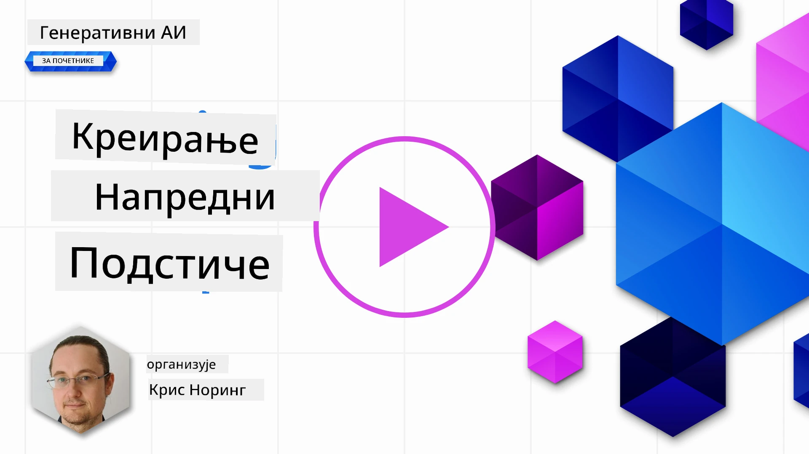

# Креирање напредних упита

[](https://youtu.be/BAjzkaCdRok?si=NmUIyRf7-cDgbjtt)

Хајде да сажмемо неке поуке из претходног поглавља:

> Инжењеринг упита је процес којим **усмеравамо модел ка релевантнијим одговорима** пружајући кориснија упутства или контекст.

Постоје и два корака у писању упита: конструкција упита, пружајући релевантан контекст, и _оптимизација_, како постепено унапредити упит.

У овом тренутку имамо основно разумевање како писати упите, али треба да идемо дубље. У овом поглављу, кренућете од проба разних упита до разумевања зашто је један упит бољи од другог. Научићете како да конструишете упите пратећи једноставне технике које се могу применити на било који LLM.

## Увод

У овом поглављу обрадићемо следеће теме:

- Проширите своје знање о инжењерингу упита примењујући различите технике на ваше упите.
- Конфигурисање упита да би се варирала резултат.

## Циљеви учења

Након завршетка ове лекције, моћи ћете да:

- Примените технике инжењеринга упита које побољшавају резултат ваших упита.
- Изводите упите који су или варијабилни или детерминистички.

## Инжењеринг упита

Инжењеринг упита је процес креирања упита који ће произвести желјени резултат. Постоји више од писања обичног текстуалног упита. Инжењеринг упита није инжењерска дисциплина, већ скуп техника које можете применити да бисте добили жељени резултат.

### Пример упита

Узмимо основни упит као овај:

> Генериши 10 питања о географији.

У овом упиту заправо примењујете скуп различитих техника упита.

Хајде да разложимо то.

- **Контекст**, наводите да треба да буде о "географији".
- **Ограничење резултата**, желите највише 10 питања.

### Ограничења једноставног писања упита

Можда ћете добити или не жељени резултат. Питања ће бити генерисана, али географија је обимна тема и можда нећете добити оно што желите из следећих разлога:

- **Обимна тема**, не знате да ли ће се тицати држава, престоница, река и слично.
- **Формат**, шта ако желите да питања буду форматирана на одређени начин?

Као што видите, много је тога на шта треба обратити пажњу приликом креирања упита.

До сада смо видели једноставан пример упита, али генеративна вештачка интелигенција је много способнија да помогне људима у разним улогама и индустријама. Погледајмо неке основне технике.

### Технике писања упита

Прво, треба разумети да је писање упита _егзистенцијална_ карактеристика LLM што значи да то није функција уграђена у модел већ нешто што откривамо како користимо модел.

Постоје неке основне технике које можемо користити за писање упита LLM. Погледајмо их.

- **Зеро-шот упит**, најосновнији облик упита. То је један упит који тражи одговор од LLM заснован искључиво на његовим подацима за тренирање.
- **Фју-шот упит**, ова врста упита усмерава LLM пружајући један или више примера на које може да се ослони да генерише одговор.
- **Чејн-оф-тот (ланац размишљања)**, овакав упит говори LLM како да рашчланити проблем на кораке.
- **Генерисано знање**, да бисте побољшали одговор на упит, можете пружити додатне генерисане чињенице или знање поред вашег упита.
- **Лист-то-мост (од најмањег ка највећем)**, као и чејн-оф-тот, ова техника је о рашчлањивању проблема у низ корака и онда тражи да ти кораци буду извршени редом.
- **Селф-рефајн**, ова техника је о критиковању излаза LLM и затим тражењу побољшања.
- **Мајеутски упит**. Оно што желите овде је да осигурате тачан одговор LLM и тражите да објасни различите делове одговора. Ово је облик селф-рефајна.

### Зеро-шот упит

Овај стил писања упита је врло једноставан, састоји се од једног упита. Вероватно је ово техника коју користите док учите о LLM. Ево примера:

- Упит: "Шта је алгебра?"
- Одговор: "Алгебра је грана математике која проучава математичке симболе и правила за њихову манипулацију."

### Фју-шот упит

Овај стил упита помаже моделу пружајући неколико примера заједно са захтевом. Састоји се од једног упита са додатним подацима специфичним за задатак. Ево примера:

- Упит: "Напиши песму у стилу Шекспира. Ево неколико примера Шекспирових сонета:
  Сонет 18: 'Да ли да те упореде са летњим даном? Ти си лепши и умеренији...'
  Сонет 116: 'Нека ми не буде препрека савез истинских ума. Љубав није љубав Која се мења када нађе промену...'
  Сонет 132: 'Твојим очима волим, и они, са жаљењем према мени, Знају да ми срце мучиш презиром,...'
  Сада напиши сонет о лепоти Месеца."
- Одговор: "На небу, Месец тихо сјаји, У сјају сребрном што благост шаље,..."

Примери дају LLM контекст, формат или стил жељеног излаза. Помажу моделу да разуме специфичан задатак и генерише прецизније и релевантније одговоре.

### Чејн-оф-тот (ланац размишљања)

Чејн-оф-тот је врло занимљива техника јер води LLM кроз низ корака. Идеја је да се LLM упути тако да разуме како да нешто уради. Размотримо следећи пример, са и без чејн-оф-тот:

    - Упит: "Алиса има 5 јабука, баци 3, даје 2 Бобу и Боб јој враћа једну, колико јабука има Аlica?"
    - Одговор: 5

LLM одговара 5, што је нетачно. Тачан одговор је 1 јабука, с обзиром на рачуницу (5 -3 -2 + 1 = 1).

Како онда научити LLM да ово уради правилно?

Покушајмо са чејн-оф-тот. Примена чејн-оф-тот значи:

1. Дајте LLM сличан пример.
1. Прикажите рачуницу и како правилно израчунати.
1. Поставите оригинални упит.

Ево како:

- Упит: "Лиза има 7 јабука, баци 1 јабуку, даје 4 јабуке Барту и Барт јој враћа једну:
  7 -1 = 6
  6 -4 = 2
  2 +1 = 3  
  Алиса има 5 јабука, баци 3 јабуке, даје 2 Бобу и Боб јој враћа једну, колико јабука има Аlica?"
  Одговор: 1

Примећујете да пишемо знатно дужи упит са још једним примером, рачуницом и затим оригиналним упитом и долазимо до исправног одговора 1.

Као што видите, чејн-оф-тот је врло моћна техника.

### Генерисано знање

Често када желите да конструишете упит, желите да користите податке своје компаније. Желите да део упита буде из компаније, а други део да буде стварни упит који вас интересује.

На пример, овако може изгледати ваш упит ако радите у осигурању:

```text
{{company}}: {{company_name}}
{{products}}:
{{products_list}}
Please suggest an insurance given the following budget and requirements:
Budget: {{budget}}
Requirements: {{requirements}}
```

Горе видите како је упит конструисан коришћењем шаблона. У шаблону има више променљивих, означених са `{{variable}}`, које ће бити замењене стварним вредностима из API-ја компаније.

Ево примера како би упит могао изгледати када се променљиве замене садржајем из ваше компаније:

```text
Insurance company: ACME Insurance
Insurance products (cost per month):
- Car, cheap, 500 USD
- Car, expensive, 1100 USD
- Home, cheap, 600 USD
- Home, expensive, 1200 USD
- Life, cheap, 100 USD

Please suggest an insurance given the following budget and requirements:
Budget: $1000
Requirements: Car, Home, and Life insurance
```

Покретањем овог упита кроз LLM добићете одговор попут овог:

```output
Given the budget and requirements, we suggest the following insurance package from ACME Insurance:
- Car, cheap, 500 USD
- Home, cheap, 600 USD
- Life, cheap, 100 USD
Total cost: $1,200 USD
```

Као што видите, предлаже и Life осигурање, што не би требало. Овај резултат указује да треба да оптимизујемо упит тако што ћемо га јасније ограничити шта је дозвољено. После неколико _покушаја и грешака_, долазимо до следећег упита:

```text
Insurance company: ACME Insurance
Insurance products (cost per month):
- type: Car, cheap, cost: 500 USD
- type: Car, expensive, cost: 1100 USD
- type: Home, cheap, cost: 600 USD
- type: Home, expensive, cost: 1200 USD
- type: Life, cheap, cost: 100 USD

Please suggest an insurance given the following budget and requirements:
Budget: $1000 restrict choice to types: Car, Home
```

Примећујете како додавање _type_ и _cost_ и коришћење кључне речи _restrict_ помаже LLM да разуме шта желимо.

Сада добијамо следећи одговор:

```output
Given the budget and requirements, we suggest the Car, Cheap insurance product which costs 500 USD per month.
```

Поента овог примера је показати да иако користимо основну технику као што је _генерисано знање_, и даље морамо оптимизовати упит у већини случајева да бисмо добили жељени резултат.

### Лист-то-мост (од најмањег ка највећем)

Идеја са лист-то-мост упитом је да разложите већи проблем на подпроблеме. На тај начин помажете LLM како да "освоји" већи проблем. Добар пример може бити за науку о подацима где можете тражити од LLM да подели проблем овако:

> Упит: Како извршити науку о подацима у 5 корака?

Ваш AI асистент одговара:

1. Прикупљање података
1. Чишћење података
1. Анализа података
1. Приказ података
1. Презентација података

### Селф-рефајн, критиковање резултата

Са генеративним AI и LLM, не треба се безрезервно ослањати на резултат. Треба га проверити. Коначно, LLM вам само представља следећу највероватнију ствар коју ће рећи, а не шта је тачно. Зато је добра идеја тражити од LLM да критички процени свој одговор, што нас води до технике селф-рефајна.

Како функционише:

1. Почетни упит са захтевом да LLM реши проблем
1. LLM одговара
1. Ви критикујете одговор и тражите од АИ да унапреди
1. LLM поново одговара, овај пут узимајући у обзир критику и предлаже решења

Овај процес можете поновити колико год желите.

Ево примера коришћењем ове технике:

> Упит: "Креирај Python Web API са рутирама products и customers"

AI одговор:

```python
import flask
app = Flask(__name__)

@app.route('/products')
def products():
    return 'Products'

@app.route('/customers')
def customers():
    return 'Customers'
```

> Упит: предложи 3 побољшања горњег кода

AI одговор:

```text
Sure, here are three suggestions to improve the code:

Import the correct module: The first line should import Flask instead of flask. The correct import statement should be from flask import Flask.

Add a main function: Add a if __name__ == '__main__': block to the end of the file to run the application when the file is executed.

Use f-strings: Use f-strings to format the return statements in the route functions. For example, return 'Products' can be changed to return f'This is the {request.path} page'.
```

```python
from flask import Flask, request

app = Flask(__name__)

@app.route('/products')
def products():
    return f'This is the {request.path} page'

@app.route('/customers')
def customers():
    return f'This is the {request.path} page'

if __name__ == '__main__':
    app.run()
```

Као што видите, горњи AI одговор унапређује први предложени код захваљујући критиковању првог одговора.

### Мајеутски упит

Мајеутски упит је техника слична селф-рефајну али се више односи на то да се тражи од LLM да се објасни. Циљ је смањити недоследности у одговору LLM тако да се осигура да дође до тачног одговора. Радни ток који треба пратити:

1. Тражите од LLM да одговори на питање
1. За сваки део одговора, тражите да LLM објасни детаљније.
1. Ако има недоследности, одбаците делове који су недоследни.

Поновите 2 и 3 док не прођете кроз све делове и не будете задовољни одговором.

Ево примера упита:

> упит: Како могу да креирам план за кризу за ублажавање пандемије у 5 корака?
> Одговор LLM:

```text
1. Identify the risks
1. Identify the stakeholders
1. Identify the resources
1. Identify the actions
1. Identify the communication channels
```

Идентификовано је 5 корака, али можемо ли утврдити да ли је то тачно? Хајде да затражимо од LLM да објасни сваки корак:

> упит: Објасни први корак детаљније, који су ризици детаљно у пандемији?

```text
The risks are the following:

- Loss of life
- Loss of business
- Loss of reputation
- Loss of customers
- Loss of employees
```

У овом тренутку желимо да будемо сигурни да је LLM тачан, па га тражимо да објасни први ризик детаљније и надамо се да је у складу са одговором горе:

> упит: Који је највећи ризик у пандемији и зашто?

```text
The biggest risk is loss of life because it's the most important thing to protect.
```

> Која су два највећа ризика у пандемији?

```text
The two biggest risks are loss of life and loss of business.
```

У овом тренутку, LLM је доследан и спомиње "живот" и "пословање" као два највећа ризика. Сада можемо наставити на следећи корак и бити прилично сигурни. Међутим, не треба слепо веровати LLM, увек треба проверити одговор.

## Варирајте свој излаз

LLM по природи нису детерминистички, што значи да ћете добити различите резултате сваки пут када поновите исти упит. Испробајте следећи упит:

> "Генериши код за Python Web API"

```python
# Увези потребне модуле
import flask
from flask import request, jsonify

# Креирај Flask апликацију
app = flask.Flask(__name__)

# Креирај руту за API
@app.route('/api', methods=['GET'])
def api():
    # Преузми податке из захтева
    data = request.args

    # Обради податке
    result = process_data(data)

    # Врати резултат као JSON
    return jsonify(result)

# Функција за обраду података
def process_data(data):
    # Уради нешто са подацима
    result = data + 1

    # Врати резултат
    return result

# Покрени апликацију
if __name__ == '__main__':
    app.run()

```

Поновним покретањем истог упита добијамо мало другачији одговор:

```python
#увези неопходне пакете
import flask
from flask import request, jsonify

#креирај Flask апликацију
app = flask.Flask(__name__)
app.config["DEBUG"] = True

#креирај листу књига
books = [
    {'id': 0,
     'title': 'A Fire Upon the Deep',
     'author': 'Vernor Vinge',
     'first_sentence': 'The coldsleep itself was dreamless.',
     'year_published': '1992'},
    {'id': 1,
     'title': 'The Ones Who Walk Away From Omelas',
     'author': 'Ursula K. Le Guin',
     'first_sentence': 'With a clamor of bells that set the swallows soaring, the Festival of Summer came to the city Omelas, bright-towered by the sea.',
     'published': '1973'},
    {'id': 2,
     'title': 'Dhalgren',
     'author': 'Samuel R. Delany',
     'first_sentence': 'to wound the autumnal city.',
     'published': '1975'}
]

#креирај крајњу тачку за API
@app.route('/', methods=['GET'])
def home():
    return '''<h1>Books API</h1>
<p>A prototype API for retrieving books.</p>'''

#креирај крајњу тачку за враћање свих књига
@app.route('/api/v1/resources/books/all', methods=['GET'])
def api_all():
    return jsonify(books)

#креирај крајњу тачку за враћање једне књиге
@app.route('/api/v1/resources/books', methods=['GET'])
def api_id():
    #провери да ли је ИД прослеђен као део URL-а
    #ако је ИД прослеђен, додели га променљивој
    #ако ИД није прослеђен, прикажи грешку
    if 'id' in request.args:
        id = int(request.args['id'])
    else:
        return "Error: No id field provided. Please specify an id."

    #креирај празну листу за наше резултате
    results = []

    #пролазак кроз податке и упоређивање резултата који одговарају траженом ИД-у
    #ИД-ови су јединствени, али остала поља могу вратити више резултата
    for book in books:
        if book['id'] == id:
            results.append(book)

    #користи jsonify функцију из Flask-а да претвориш нашу листу
    #Python речника у JSON формат
    return jsonify(results)

app.run()
```

> Да ли је варијабилни излаз проблем?

Зависи шта покушавате да урадите. Ако желите специфичан одговор, онда јесте. Ако вам је прихватљиво различит излаз као "Генериши било која 3 питања о географији", онда није проблем.

### Коришћење температуре за варирање излаза

У реду, одлучили смо да желимо да ограничимо резултат да буде предвидљивији, односно детерминистички. Како то радимо?

Температура је вредност између 0 и 1, где је 0 најдетерминистичкија, а 1 највише варира. Подразумевана вредност је 0.7. Погледајмо шта се дешава са два покуса истог упита са температуром подешеном на 0.1:

> "Генериши код за Python Web API"

```python
#увези неопходне библиотеке
import flask
from flask import request, jsonify

#направи инстанцу Flask класе
app = flask.Flask(__name__)

#направи крајњу тачку за API
@app.route('/api/v1/endpoint', methods=['GET'])
def api_endpoint():
    #добиј податке из захтева
    data = request.get_json()

    #обради податке
    result = process_data(data)

    #врати резултат
    return jsonify(result)

#функција за обраду података
def process_data(data):
    #обради податке
    result = {'result': 'success'}

    #врати резултат
    return result

#покрени Flask апликацију
if __name__ == '__main__':
    app.run()

```

Поновним покретањем добијамо следећи резултат:

```python
#увези неопходне библиотеке
import flask
from flask import request, jsonify

#креирај Flask апликацију
app = flask.Flask(__name__)

#креирај руту за API
@app.route('/api', methods=['GET'])
def api_call():
    #преузми податке из захтева
    data = request.get_json()

    #обради податке
    result = process_data(data)

    #врати резултат
    return jsonify(result)

#дефиниши функцију process_data
def process_data(data):
    #уради нешто са подацима
    result = data + 1

    #врати резултат
    return result

#покрени апликацију
if __name__ == '__main__':
    app.run()

```

Мала је разлика између ова два излаза. Хајде да урадимо супротно, подесимо температуру на 0.9:

```python
# Увези неопходне библиотеке
import flask
from flask import request, jsonify

# Направи Flask апликацију
app = flask.Flask(__name__)

# Креирај руту за API
@app.route('/api', methods=['GET'])
def api_call():
    # Узми податке из захтева
    data = request.args

    # Обради податке
    result = process_data(data)

    # Врати резултат
    return jsonify(result)

# Функција за обраду података
def process_data(data):
    # Уради нешто са подацима
    result = data + 1

    # Врати резултат
    return result

# Покрени апликацију
if __name__ == '__main__':
    app.run()

```

и други покушај са температуром 0.9:

```python
import flask
from flask import request, jsonify

# креирајте Flask апликацију
app = flask.Flask(__name__)
app.config['DEBUG'] = True

# креирајте неке тест податке
books = [
    {'id': 0, 'title': 'A Fire Upon The Deep', 'author': 'Vernor Vinge', 'first_sentence': 'The coldsleep itself was dreamless.', 'year_published': '1992'},
    {'id': 1, 'title': 'The Ones Who Walk Away From Omelas', 'author': 'Ursula K. Le Guin', 'first_sentence': 'With a clamor of bells that set the swallows soaring, the Festival of Summer came to the city Omelas, bright-towered by the sea.', 'published': '1973'},
    {'id': 2, 'title': 'Dhalgren', 'author': 'Samuel R. Delany', 'first_sentence': 'to wound the autumnal city.', 'published': '1975'}
]

# креирајте ендпоинт
@app.route('/', methods=['GET'])
def home():
    return '''<h1>Welcome to our book API!</h1>'''

@app.route('/api/v1/resources/books

```

Као што видите, резултати не могу бити разноликији.
> Имајте у виду да постоји још параметара које можете мењати да бисте разноврсније добили резултат, као што су top-k, top-p, казна за понављање, казна за дужину и казна за разноликост, али ови параметри нису обухваћени овим курикулумом.

## Добре праксе

Постоји много пракси које можете применити да бисте постигли оно што желите. Пронаћи ћете свој стил како будете све више користили подстицај (prompting).

Осим техника које смо покрили, постоје и неке добре праксе које треба размотрити када се користи LLM.

Ево неких добрих пракси које треба узети у обзир:

- **Наведите контекст**. Контекст је битан, што више можете прецизирати као домен, тему итд., то боље.
- Ограничите излаз. Ако желите одређен број ставки или одређену дужину, наведите то.
- **Наведите и шта и како**. Запамтите да наведете и шта желите и како желите, на пример „Направи Python Web API са рутирама products и customers, подели га у 3 фајла“.
- **Користите шаблоне**. Често ћете пожелети да обогатите своје подстицаје подацима из ваше компаније. Користите шаблоне за то. Шаблони могу имати променљиве које замените стварним подацима.
- **Правописно пиши правилно**. LLM-ови вам могу дати исправан одговор, али ако правописно пишете исправно, добићете бољи одговор.

## Задатак

Ево кода у Python-у који показује како направити једноставан API користећи Flask:

```python
from flask import Flask, request

app = Flask(__name__)

@app.route('/')
def hello():
    name = request.args.get('name', 'World')
    return f'Hello, {name}!'

if __name__ == '__main__':
    app.run()
```

Користите AI асистента као што су GitHub Copilot или ChatGPT и примените технику „самопобољшавања“ да унапредите код.

## Решење

Покушајте да решите задатак додавањем одговарајућих подстицаја коду.

> [!TIP]
> Формулишите подстицај тако да затражите побољшање, добро је ограничити колико побољшања желите. Можете тражити и да се побољшање направи на одређени начин, на пример архитектура, перформансе, безбедност итд.

[Решење](../../../05-advanced-prompts/python/aoai-solution.py)

## Провера знања

Зашто бих користио подстицање у ланцу мишљења? Прикажите 1 тачан одговор и 2 нетачна одговора.

1. Да научим LLM како да решава проблем.
1. Б, Да научим LLM да пронађе грешке у коду.
1. Ц, Да наредим LLM-у да смисли различита решења.

А: 1, јер је подстицање у ланцу мишљења о показивању LLM-у како да реши проблем пружањем низа корака и сличних проблема и како су они решени.

## 🚀 Изазов

Управо сте користили технику самопобољшавања у задатку. Узмите било који програм који сте направили и размислите о побољшањима која бисте желели да примените. Сада користите технику самопобољшавања да примените предложене промене. Каквим сте резултатом били задовољни, бољим или горим?

## Одличан посао! Наставите са учењем

Након завршетка ове лекције, погледајте нашу [колекцију за учење о генеративној вештачкој интелигенцији](https://aka.ms/genai-collection?WT.mc_id=academic-105485-koreyst) да бисте наставили да унапређујете своје знање о генеративној AI!

Прелазите на Лекцију 6 где ћемо применити наше знање из области Prompt Engineering-а правећи [апликације за генерисање текста](../06-text-generation-apps/README.md?WT.mc_id=academic-105485-koreyst)

---

<!-- CO-OP TRANSLATOR DISCLAIMER START -->
**Изјава о одрицању одговорности**:
Овај документ је преведен коришћењем услуге за аутоматски превод [Co-op Translator](https://github.com/Azure/co-op-translator). Иако тежимо тачности, имајте у виду да аутоматски преводи могу садржати грешке или нетачности. Оригинални документ на његовом изворном језику треба сматрати ауторитативним извором. За критичне информације препоручује се професионални људски превод. Нисмо одговорни за било каква неспоразума или погрешна тумачења која произилазе из коришћења овог превода.
<!-- CO-OP TRANSLATOR DISCLAIMER END -->