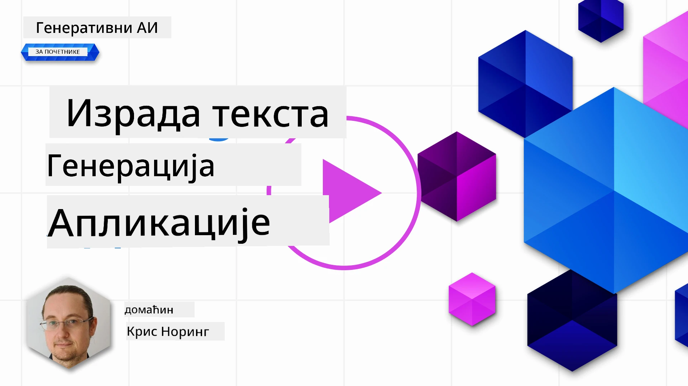

# Изградња апликација за генерисање текста

[](https://youtu.be/0Y5Luf5sRQA?si=t_xVg0clnAI4oUFZ)

> _(Кликните на слику изнад да бисте погледали видео о овом часу)_

До сада сте кроз овај курикулум видели да постоје кључни концепти као што су упити (промпти) па чак и цела дисциплина зване "промпт инжењеринг". Многи алати са којима можете да комуницирате, као што су ChatGPT, Office 365, Microsoft Power Platform и други, омогућавају вам коришћење упита да бисте постигли нешто.

Да бисте такво искуство додали апликацији, потребно је да разумете концепте као што су упити, завршетци и да изаберете библиотеку за рад. Управо то ћете научити у овом поглављу.

## Увод

У овом поглављу ћете:

- Сазнати о библиотеци openai и њеним основним концептима.
- Изградити апликацију за генерисање текста користећи openai.
- Разумети како да користите концепте као што су упит (prompt), температура и токени за изградњу апликације за генерисање текста.

## Циљеви учења

На крају овог часа бићете у стању да:

- Објасните шта је апликација за генерисање текста.
- Изградите апликацију за генерисање текста користећи openai.
- Конфигуришете своју апликацију да користи више или мање токена и промените температуру ради различитих резултата.

## Шта је апликација за генерисање текста?

Обично, када изградите апликацију, она има неки вид интерфејса као следећи:

- Апликација заснована на командама. Конзолне апликације су типичне апликације где уносите команду и она извршава задатак. На пример, `git` је апликација заснована на командама.
- Кориснички интерфејс (UI). Неке апликације имају графички кориснички интерфејс (GUI) где кликате на дугмад, уносите текст, изаберете опције и друго.

### Конзолне и UI апликације имају ограничења

Упоредите то са апликацијом заснованом на команду коју куцате:

- **Ограничено је**. Не можете унети било коју команду, него само оне које апликација подржава.
- **Везано за језик**. Неке апликације подржавају више језика, али по подразумеваној вредности апликација је направљена за одређени језик, чак и ако можете додати подршку за више језика.

### Предности апликација за генерисање текста

Како се онда апликација за генерисање текста разликује?

У апликацији за генерисање текста имате већу флексибилност, нисте ограничени на скуп команди или одређени улазни језик. Уместо тога, можете користити природни језик за интеракцију са апликацијом. Још једна предност је што већ интерагујете са извором података који је обучен на огромном корпусу информација, док би традиционална апликација могла бити ограничена на оно што има у бази података.

### Шта могу да направим са апликацијом за генерисање текста?

Можете направити много тога. На пример:

- **Чатбот**. Чатбот који одговара на питања о темама, као што су ваша компанија и њени производи, могао би бити добар избор.
- **Помоћник**. Велики језички модели (LLMs) су одлични у ствари као што су резимирање текста, извлачење увида из текста, производња текста као што су биографије и више.
- **Асистент за кодирање**. У зависности од језичког модела који користите, можете изградити асистента за кодирање који вам помаже да пишете код. На пример, можете користити производе попут GitHub Copilot као и ChatGPT да вам помогну у писању кода.

## Како могу почети?

Па, морате пронаћи начин да се интегришете са LLM-ом што обично обухвата два приступа:

- Користите API. Овде конструишете веб захтеве са својим упитом и добијате генерисани текст назад.
- Користите библиотеку. Библиотеке помажу да се API позиви обухвате и лакше користе.

## Библиотеке/SDK-ови

Постоји неколико познатих библиотека за рад са LLM моделима као што су:

- **openai**, ова библиотека олакшава повезивање на ваш модел и слање упита.

Затим постоје библиотеке које раде на вишем нивоу као што су:

- **Langchain**. Langchain је добро познат и подржава Python.
- **Semantic Kernel**. Semantic Kernel је Microsoft-ова библиотека која подржава језике C#, Python, и Java.

## Прва апликација коришћењем openai

Хајде да видимо како можемо изградити нашу прву апликацију, које библиотеке су нам потребне, колико је потребно и тако даље.

### Инсталирајте openai

Постоји много библиотека за интеракцију са OpenAI или Azure OpenAI. Могуће је користити бројне програмске језике као што су C#, Python, JavaScript, Java и други. Ми смо изабрали да користимо `openai` Python библиотеку, па ћемо користити `pip` за инсталацију.

```bash
pip install openai
```

### Креирање ресурса

Потребно је да извршите следеће кораке:

- Направите налог на Azure [https://azure.microsoft.com/free/](https://azure.microsoft.com/free/?WT.mc_id=academic-105485-koreyst).
- Добијте приступ Azure OpenAI. Идите на [https://learn.microsoft.com/azure/ai-services/openai/overview#how-do-i-get-access-to-azure-openai](https://learn.microsoft.com/azure/ai-services/openai/overview#how-do-i-get-access-to-azure-openai?WT.mc_id=academic-105485-koreyst) и затражите приступ.

  > [!NOTE]
  > У време писања, морате да затражите приступ Azure OpenAI.

- Инсталирајте Python <https://www.python.org/>
- Креирајте Azure OpenAI Service ресурс. Погледајте овај водич како да [креирате ресурс](https://learn.microsoft.com/azure/ai-services/openai/how-to/create-resource?pivots=web-portal?WT.mc_id=academic-105485-koreyst).

### Пронађите API кључ и endpoint

У овом тренутку, морате вашој `openai` библиотеци рећи који API кључ да користи. Да бисте пронашли свој API кључ, идите у одељак "Keys and Endpoint" на вашем Azure OpenAI ресурсу и копирајте вредност "Key 1".


Сада када имате ову информацију копирану, хајде да упутимо библиотеке да је користе.

> [!NOTE]
> Вредно је раздвојити ваш API кључ од кода. То можете урадити коришћењем променљивих окружења.
>
> - Поставите променљиву окружења `OPENAI_API_KEY` на свој API кључ.
>   `export OPENAI_API_KEY='sk-...'`

### Подешавање конфигурације за Azure

Ако користите Azure OpenAI (сада део Microsoft Foundry), ево како подешавате конфигурацију. Ми користимо стандардни `OpenAI` клијент усмерен ка Azure OpenAI `/openai/v1/` endpoint-у, који ради са Responses API и не треба му `api_version`:

```python
import os
from openai import OpenAI

client = OpenAI(
    api_key=os.environ["AZURE_OPENAI_API_KEY"],
    base_url=f"{os.environ['AZURE_OPENAI_ENDPOINT'].rstrip('/')}/openai/v1/",
)
```

Изнад подешавамо следеће:

- `api_key`, ово је ваш API кључ који сте нашли у Azure порталу или Microsoft Foundry порталу.
- `base_url`, ово је ваш Foundry ресурсни endpoint са додатком `/openai/v1/`. Стабилан v1 endpoint ради на OpenAI и Azure OpenAI без управљања `api_version`.

> [!NOTE] > `os.environ` чита променљиве окружења. Можете га користити за читање променљивих окружења као што су `AZURE_OPENAI_API_KEY` и `AZURE_OPENAI_ENDPOINT`. Поставите ове променљиве у вашем терминалу или користећи библиотеку као што је `dotenv`.

## Генерисање текста

Начин за генерисање текста је коришћење Responses API преко `responses.create` метода. Ево примера:

```python
prompt = "Complete the following: Once upon a time there was a"

response = client.responses.create(
    model="gpt-4o-mini",  # ово је име ваше моделе за распоређивање
    input=prompt,
    store=False,
)
print(response.output_text)
```

У горњем коду креирамо одговор и прослеђујемо модел који желимо да користимо и упит. Затим штампамо генерисани текст преко `response.output_text`.

### Вишесмерне конверзације

Responses API је добро погодан за једносмерно генерисање текста али и вишесмерне чатботове - пружате листу порука у `input` за изградњу конверзације:

```python
from openai import OpenAI

client = OpenAI(api_key="sk-...")

response = client.responses.create(model="gpt-4o-mini", input="Hello world", store=False)
print(response.output_text)
```

Више о овој функционалности у наредном поглављу.

## Вежба - ваша прва апликација за генерисање текста

Сада када смо научили како да подесимо и конфигуришемо openai, време је да направите своју прву апликацију за генерисање текста. Да бисте изградили апликацију, пратите ове кораке:

1. Креирајте виртуелно окружење и инсталирајте openai:

   ```bash
   python -m venv venv
   source venv/bin/activate
   pip install openai
   ```

   > [!NOTE]
   > Ако користите Windows, уместо `source venv/bin/activate` укуцајте `venv\Scripts\activate`.

   > [!NOTE]
   > Пронађите ваш Azure OpenAI кључ тако што ћете отићи на [https://portal.azure.com/](https://portal.azure.com/?WT.mc_id=academic-105485-koreyst) и претражити `Open AI`, изаберите `Open AI ресурс` и онда изаберите `Кључеви и Endpoint` и копирајте вредност `Key 1`.

1. Креирајте фајл _app.py_ и убаците у њега следећи код:

   ```python
   import os
   from openai import OpenAI

   client = OpenAI(
       api_key="<replace this value with your Azure OpenAI key>",
       base_url="<endpoint found in Azure Portal>/openai/v1/",
   )
   deployment_name = "<deployment name>"

   # додајте свој код за довршавање
   prompt = "Complete the following: Once upon a time there was a"

   # направите захтев користећи Responses API
   response = client.responses.create(model=deployment_name, input=prompt, store=False)

   # испишите одговор
   print(response.output_text)
   ```

   > [!NOTE]
   > Ако користите обични OpenAI (не Azure), користите `client = OpenAI(api_key="<замените ову вредност својим OpenAI кључем>")` (без `base_url`) и проследите име модела као `gpt-4o-mini` уместо имена деплоја.

   Требало би да видите излаз сличан следећем:

   ```output
    very unhappy _____.

   Once upon a time there was a very unhappy mermaid.
   ```

## Различите врсте упита за различите задатке

Сада сте видели како се генерише текст помоћу упита. Чак имате програм који ради и који можете модификовати и мењати да генеришете различите врсте текста.

Упити се могу користити за разне задатке. На пример:

- **Генерисање врсте текста**. На пример, можете генерисати песму, питања за квиз и сл.
- **Претраживање информација**. Можете користити упите да тражите информације као у примеру 'Шта значи CORS у веб развоју?'.
- **Генерисање кода**. Можете користити упите да генеришете код, на пример развој регуларног израза за валидацију е-пошта или зашто не генерисати цели програм, као веб апликацију?

## Практичнији случај: генератор рецепата

Замислите да имате састојке код куће и желите да скувате нешто. За то вам треба рецепт. Начин да пронађете рецепте је да користите претраживач или да користите LLM.

Можете написати упит овако:

> "Прикажи ми 5 рецепата за јело са следећим састојцима: пилеће месо, кромпир и шаргарепа. За сваки рецепт наведи све састојке."

На основу овог упита, добићете одговор сличан овом:

```output
1. Roasted Chicken and Vegetables:
Ingredients:
- 4 chicken thighs
- 2 potatoes, cut into cubes
- 2 carrots, cut into cubes
- 2 tablespoons olive oil
- 2 cloves garlic, minced
- 1 teaspoon dried thyme
- 1 teaspoon dried oregano
- Salt and pepper, to taste

2. Chicken and Potato Stew:
Ingredients:
- 2 tablespoons olive oil
- 1 onion, diced
- 2 cloves garlic, minced
- 2 chicken breasts, cut into cubes
- 2 potatoes, cut into cubes
- 2 carrots, cut into cubes
- 1 teaspoon dried oregano
- 1 teaspoon dried thyme
- 1 cup chicken broth
- Salt and pepper, to taste

3. Chicken and Potato Bake:
Ingredients:
- 2 tablespoons olive oil
- 2 chicken breasts, cut into cubes
- 2 potatoes, cut into cubes
- 2 carrots, cut into cubes
- 1 onion, diced
- 2 cloves garlic, minced
- 1 teaspoon dried oregano
- 1 teaspoon dried thyme
- 1 cup chicken broth
- Salt and pepper, to taste

4. Chicken and Potato Soup:
Ingredients:
- 2 tablespoons olive oil
- 1 onion, diced
- 2 cloves garlic, minced
- 2 chicken breasts, cut into cubes
- 2 potatoes, cut into cubes
- 2 carrots, cut into cubes
- 1 teaspoon dried oregano
- 1 teaspoon dried thyme
- 4 cups chicken broth
- Salt and pepper, to taste

5. Chicken and Potato Hash:
Ingredients:
- 2 tablespoons olive oil
- 2 chicken breasts, cut into cubes
- 2 potatoes, cut into cubes
- 2 carrots, cut into cubes
- 1 onion, diced
- 2 cloves garlic, minced
- 1 teaspoon dried oregano
```

Овај резултат је сјајан, знам шта да скувам. У овом тренутку, корисна побољшања би била:

- Филтрирати састојке које не волим или на које сам алергичан.
- Направити списак за куповину у случају да немам све састојке код куће.

За горе наведене случајеве, додајмо додатни упит:

> "Молим уклони рецепте са белим луком јер сам алергичан и замени га нечим другим. Такође, направи списак за куповину за рецепте, узимајући у обзир да већ имам пилеће месо, кромпир и шаргарепу код куће."

Сада имате нови резултат, а то је:

```output
1. Roasted Chicken and Vegetables:
Ingredients:
- 4 chicken thighs
- 2 potatoes, cut into cubes
- 2 carrots, cut into cubes
- 2 tablespoons olive oil
- 1 teaspoon dried thyme
- 1 teaspoon dried oregano
- Salt and pepper, to taste

2. Chicken and Potato Stew:
Ingredients:
- 2 tablespoons olive oil
- 1 onion, diced
- 2 chicken breasts, cut into cubes
- 2 potatoes, cut into cubes
- 2 carrots, cut into cubes
- 1 teaspoon dried oregano
- 1 teaspoon dried thyme
- 1 cup chicken broth
- Salt and pepper, to taste

3. Chicken and Potato Bake:
Ingredients:
- 2 tablespoons olive oil
- 2 chicken breasts, cut into cubes
- 2 potatoes, cut into cubes
- 2 carrots, cut into cubes
- 1 onion, diced
- 1 teaspoon dried oregano
- 1 teaspoon dried thyme
- 1 cup chicken broth
- Salt and pepper, to taste

4. Chicken and Potato Soup:
Ingredients:
- 2 tablespoons olive oil
- 1 onion, diced
- 2 chicken breasts, cut into cubes
- 2 potatoes, cut into cubes
- 2 carrots, cut into cubes
- 1 teaspoon dried oregano
- 1 teaspoon dried thyme
- 4 cups chicken broth
- Salt and pepper, to taste

5. Chicken and Potato Hash:
Ingredients:
- 2 tablespoons olive oil
- 2 chicken breasts, cut into cubes
- 2 potatoes, cut into cubes
- 2 carrots, cut into cubes
- 1 onion, diced
- 1 teaspoon dried oregano

Shopping List:
- Olive oil
- Onion
- Thyme
- Oregano
- Salt
- Pepper
```

То су ваших пет рецепата, без помињања белог лука, и такође имате списак за куповину узимајући у обзир шта већ имате код куће.

## Вежба - направите генератор рецепата

Сада када смо превежали сценарио, хајде да напишемо код који одговара приказаном сценарију. Да бисте то урадили, следите ове кораке:

1. Користите постојећи фајл _app.py_ као почетну тачку
1. Пронађите променљиву `prompt` и промените њен код у следеће:

   ```python
   prompt = "Show me 5 recipes for a dish with the following ingredients: chicken, potatoes, and carrots. Per recipe, list all the ingredients used"
   ```

   Ако сада покренете код, требало би да видите излаз сличан овоме:

   ```output
   -Chicken Stew with Potatoes and Carrots: 3 tablespoons oil, 1 onion, chopped, 2 cloves garlic, minced, 1 carrot, peeled and chopped, 1 potato, peeled and chopped, 1 bay leaf, 1 thyme sprig, 1/2 teaspoon salt, 1/4 teaspoon black pepper, 1 1/2 cups chicken broth, 1/2 cup dry white wine, 2 tablespoons chopped fresh parsley, 2 tablespoons unsalted butter, 1 1/2 pounds boneless, skinless chicken thighs, cut into 1-inch pieces
   -Oven-Roasted Chicken with Potatoes and Carrots: 3 tablespoons extra-virgin olive oil, 1 tablespoon Dijon mustard, 1 tablespoon chopped fresh rosemary, 1 tablespoon chopped fresh thyme, 4 cloves garlic, minced, 1 1/2 pounds small red potatoes, quartered, 1 1/2 pounds carrots, quartered lengthwise, 1/2 teaspoon salt, 1/4 teaspoon black pepper, 1 (4-pound) whole chicken
   -Chicken, Potato, and Carrot Casserole: cooking spray, 1 large onion, chopped, 2 cloves garlic, minced, 1 carrot, peeled and shredded, 1 potato, peeled and shredded, 1/2 teaspoon dried thyme leaves, 1/4 teaspoon salt, 1/4 teaspoon black pepper, 2 cups fat-free, low-sodium chicken broth, 1 cup frozen peas, 1/4 cup all-purpose flour, 1 cup 2% reduced-fat milk, 1/4 cup grated Parmesan cheese

   -One Pot Chicken and Potato Dinner: 2 tablespoons olive oil, 1 pound boneless, skinless chicken thighs, cut into 1-inch pieces, 1 large onion, chopped, 3 cloves garlic, minced, 1 carrot, peeled and chopped, 1 potato, peeled and chopped, 1 bay leaf, 1 thyme sprig, 1/2 teaspoon salt, 1/4 teaspoon black pepper, 2 cups chicken broth, 1/2 cup dry white wine

   -Chicken, Potato, and Carrot Curry: 1 tablespoon vegetable oil, 1 large onion, chopped, 2 cloves garlic, minced, 1 carrot, peeled and chopped, 1 potato, peeled and chopped, 1 teaspoon ground coriander, 1 teaspoon ground cumin, 1/2 teaspoon ground turmeric, 1/2 teaspoon ground ginger, 1/4 teaspoon cayenne pepper, 2 cups chicken broth, 1/2 cup dry white wine, 1 (15-ounce) can chickpeas, drained and rinsed, 1/2 cup raisins, 1/2 cup chopped fresh cilantro
   ```

   > НАПОМЕНА, ваш LLM није детерминистички, па ћете можда добити различите резултате сваки пут када покренете програм.

   Сјајно, хајде да видимо како можемо побољшати ствари. Да бисмо побољшали ствари, желимо да код буде флексибилан, тако да састојци и број рецепата могу бити прилагођени и промењени.

1. Поменути код измените на следећи начин:

   ```python
   no_recipes = input("No of recipes (for example, 5): ")

   ingredients = input("List of ingredients (for example, chicken, potatoes, and carrots): ")

   # интерполирати број рецепата у упит и састојке
   prompt = f"Show me {no_recipes} recipes for a dish with the following ingredients: {ingredients}. Per recipe, list all the ingredients used"
   ```

   Изглед тестног покретања кода може бити овако:

   ```output
   No of recipes (for example, 5): 3
   List of ingredients (for example, chicken, potatoes, and carrots): milk,strawberries

   -Strawberry milk shake: milk, strawberries, sugar, vanilla extract, ice cubes
   -Strawberry shortcake: milk, flour, baking powder, sugar, salt, unsalted butter, strawberries, whipped cream
   -Strawberry milk: milk, strawberries, sugar, vanilla extract
   ```

### Побољшања додавањем филтера и списа за куповину

Сада имамо функционишућу апликацију која може да генерише рецепте, и она је флексибилна јер се ослања на уносе корисника, како у вези броја рецепата тако и састојака који се користе.

Да бисмо је додатно унапредили, желимо да додамо следеће:

- **Филтрирање састојака**. Желимо да можемо филтрирати састојке које не волимо или на које смо алергични. За ову промену можемо изменити постојећи упит и додати услов филтра на крају као што следи:

  ```python
  filter = input("Filter (for example, vegetarian, vegan, or gluten-free): ")

  prompt = f"Show me {no_recipes} recipes for a dish with the following ingredients: {ingredients}. Per recipe, list all the ingredients used, no {filter}"
  ```

  Горe додајемо `{filter}` на крај упита и такође бележимо вредност филтра од корисника.

  Пример улаза приликом покретања програма сада може изгледати овако:

  ```output
  No of recipes (for example, 5): 3
  List of ingredients (for example, chicken, potatoes, and carrots): onion,milk
  Filter (for example, vegetarian, vegan, or gluten-free): no milk

  1. French Onion Soup

  Ingredients:

  -1 large onion, sliced
  -3 cups beef broth
  -1 cup milk
  -6 slices french bread
  -1/4 cup shredded Parmesan cheese
  -1 tablespoon butter
  -1 teaspoon dried thyme
  -1/4 teaspoon salt
  -1/4 teaspoon black pepper

  Instructions:

  1. In a large pot, sauté onions in butter until golden brown.
  2. Add beef broth, milk, thyme, salt, and pepper. Bring to a boil.
  3. Reduce heat and simmer for 10 minutes.
  4. Place french bread slices on soup bowls.
  5. Ladle soup over bread.
  6. Sprinkle with Parmesan cheese.

  2. Onion and Potato Soup

  Ingredients:

  -1 large onion, chopped
  -2 cups potatoes, diced
  -3 cups vegetable broth
  -1 cup milk
  -1/4 teaspoon black pepper

  Instructions:

  1. In a large pot, sauté onions in butter until golden brown.
  2. Add potatoes, vegetable broth, milk, and pepper. Bring to a boil.
  3. Reduce heat and simmer for 10 minutes.
  4. Serve hot.

  3. Creamy Onion Soup

  Ingredients:

  -1 large onion, chopped
  -3 cups vegetable broth
  -1 cup milk
  -1/4 teaspoon black pepper
  -1/4 cup all-purpose flour
  -1/2 cup shredded Parmesan cheese

  Instructions:

  1. In a large pot, sauté onions in butter until golden brown.
  2. Add vegetable broth, milk, and pepper. Bring to a boil.
  3. Reduce heat and simmer for 10 minutes.
  4. In a small bowl, whisk together flour and Parmesan cheese until smooth.
  5. Add to soup and simmer for an additional 5 minutes, or until soup has thickened.
  ```

  Као што видите, рецепти који садрже млеко су филтрирани. Али, ако сте нетолерантни на лактозу, можда ћете желети да филтрирате и рецепте који садрже сир, па је важно да будете прецизни.


- **Направите списак за куповину**. Желимо да направимо списак за куповину, узимајући у обзир шта већ имамо код куће.

  За ову функционалност, могли бисмо да покушамо све да решимо у једном упиту или да га поделимо на два упита. Покушајмо овај други приступ. Овде предлажемо додавање додатног упита, али да би то функционисало, морамо додати резултат из првог упита као контекст другом упиту.

  Пронађите део кода који исписује резултат из првог упита и додајте следећи код испод:

  ```python
  old_prompt_result = response.output_text
  prompt = "Produce a shopping list for the generated recipes and please don't include ingredients that I already have."

  new_prompt = f"{old_prompt_result} {prompt}"
  response = client.responses.create(model=deployment_name, input=new_prompt, max_output_tokens=1200, store=False)

  # испиши одговор
  print("Shopping list:")
  print(response.output_text)
  ```

  Обратите пажњу на следеће:

  1. Конструишемо нови упит додавањем резултата из првог упита новом упиту:

     ```python
     new_prompt = f"{old_prompt_result} {prompt}"
     ```

  1. Правимо нови захтев, али такође узимајући у обзир број токена које смо тражили у првом упиту, па овог пута кажемо да је `max_output_tokens` 1200.

     ```python
     response = client.responses.create(model=deployment_name, input=new_prompt, max_output_tokens=1200, store=False)
     ```

     Ако покренемо овај код, добијамо следећи излаз:

     ```output
     No of recipes (for example, 5): 2
     List of ingredients (for example, chicken, potatoes, and carrots): apple,flour
     Filter (for example, vegetarian, vegan, or gluten-free): sugar


     -Apple and flour pancakes: 1 cup flour, 1/2 tsp baking powder, 1/2 tsp baking soda, 1/4 tsp salt, 1 tbsp sugar, 1 egg, 1 cup buttermilk or sour milk, 1/4 cup melted butter, 1 Granny Smith apple, peeled and grated
     -Apple fritters: 1-1/2 cups flour, 1 tsp baking powder, 1/4 tsp salt, 1/4 tsp baking soda, 1/4 tsp nutmeg, 1/4 tsp cinnamon, 1/4 tsp allspice, 1/4 cup sugar, 1/4 cup vegetable shortening, 1/4 cup milk, 1 egg, 2 cups shredded, peeled apples
     Shopping list:
     -Flour, baking powder, baking soda, salt, sugar, egg, buttermilk, butter, apple, nutmeg, cinnamon, allspice
     ```

## Унапредите своје окружење

Оно што имамо до сада је код који ради, али постоје неке измене које бисмо требали урадити да бисмо додатно побољшали ствари. Неке ствари које бисмо требали урадити су:

- **Раздвојте тајне од кода**, као што је API кључ. Тајне не припадају коду и треба их чувати на сигурном месту. Да бисмо раздвојили тајне од кода, можемо користити променљиве окружења и библиотеке као што је `python-dotenv` да их учитамо из датотеке. Ево како би то изгледало у коду:

  1. Креирајте `.env` датотеку са следећим садржајем:

     ```bash
     OPENAI_API_KEY=sk-...
     ```

     > Напомена, за Azure OpenAI у Microsoft Foundry, потребно је уместо тога подесити следеће променљиве окружења:

     ```bash
     AZURE_OPENAI_API_KEY=<replace>
     AZURE_OPENAI_ENDPOINT=<replace>
     AZURE_OPENAI_API_VERSION=2024-10-21
     ```

     У коду бисте учитали променљиве окружења овако:

     ```python
     import os
     from dotenv import load_dotenv
     from openai import OpenAI

     load_dotenv()

     client = OpenAI(api_key=os.environ["OPENAI_API_KEY"])
     ```

- **Реч о дужини токена**. Требало би да размотримо колико нам је токена потребно да генеришемо текст који желимо. Токени коштају новац, па где је могуће, требало би да будемо штедљиви са бројем токена које користимо. На пример, можемо ли формулисати упит тако да користимо мање токена?

  Да бисте променили број коришћених токена, можете користити параметар `max_output_tokens`. На пример, ако желите да користите 100 токена, урадили бисте овако:

  ```python
  response = client.responses.create(model=deployment, input=prompt, max_output_tokens=100, store=False)
  ```

- **Експериментисање са температуром**. Температура је нешто што до сада нисмо споменули, али је важан контекст за то како наш програм функционише. Што је вредност температуре виша, излаз је случајнији. Супротно томе, што је температура нижа, излаз је предвидљивији. Размислите да ли желите варијацију у излазу или не.

  Да бисте променили температуру, можете користити параметар `temperature`. На пример, ако желите да користите температуру од 0.5, урадили бисте овако:

  ```python
  response = client.responses.create(model=deployment, input=prompt, temperature=0.5, store=False)
  ```

  > Напомена, што је ближе 1.0, излаз је разноврснији.

## Задатак

За овај задатак можете изабрати шта ћете направити.

Ево неколико предлога:

- Побољшајте апликацију за генерисање рецепата. Играте се са вредностима температуре и упитима да видите шта све можете да направите.
- Направите „учног другара“. Ова апликација треба да може да одговара на питања о одређеној теми, на пример Python, можете имати упите попут „Шта је одређена тема у Python-у?“, или упит „покажи ми код за одређену тему“ итд.
- Историјски бот, оживите историју, упутите бота да глуми одређену историјску личност и питајте га питања о њеном животу и времену.

## Решење

### Учни другар

Испод је почетни упит, погледајте како можете да га користите и подесите по жељи.

```text
- "You're an expert on the Python language

    Suggest a beginner lesson for Python in the following format:

    Format:
    - concepts:
    - brief explanation of the lesson:
    - exercise in code with solutions"
```

### Историјски бот

Ево неколико упита које бисте могли користити:

```text
- "You are Abe Lincoln, tell me about yourself in 3 sentences, and respond using grammar and words like Abe would have used"
- "You are Abe Lincoln, respond using grammar and words like Abe would have used:

   Tell me about your greatest accomplishments, in 300 words"
```

## Провера знања

Шта ради концепт температуре?

1. Контролише колико је излаз случајан.
1. Контролише колико је одговор велики.
1. Контролише колико токена се користи.

## 🚀 Изазов

Док радите задатак, покушајте да мењате температуру, поставите је на 0, 0.5 и 1. Запамтите да је 0 најмање варијабилно, а 1 највише. Која вредност најбоље функционише за вашу апликацију?

## Одличан посао! Наставите са учењем

Након завршетка ове лекције, погледајте нашу [Генеративну AI колекцију](https://aka.ms/genai-collection?WT.mc_id=academic-105485-koreyst) да наставите да унапређујете своје знање о генеративном AI-у!

Идите на Лекцију 7 где ћемо видети како да [направимо чат апликације](../07-building-chat-applications/README.md?WT.mc_id=academic-105485-koreyst)!

---

<!-- CO-OP TRANSLATOR DISCLAIMER START -->
**Изјава о одрицању одговорности**:
Овај документ је преведен коришћењем услуге за аутоматски превод [Co-op Translator](https://github.com/Azure/co-op-translator). Иако тежимо тачности, имајте у виду да аутоматски преводи могу садржати грешке или нетачности. Оригинални документ на његовом изворном језику треба сматрати ауторитативним извором. За критичне информације препоручује се професионални људски превод. Нисмо одговорни за било каква неспоразума или погрешна тумачења која произилазе из коришћења овог превода.
<!-- CO-OP TRANSLATOR DISCLAIMER END -->