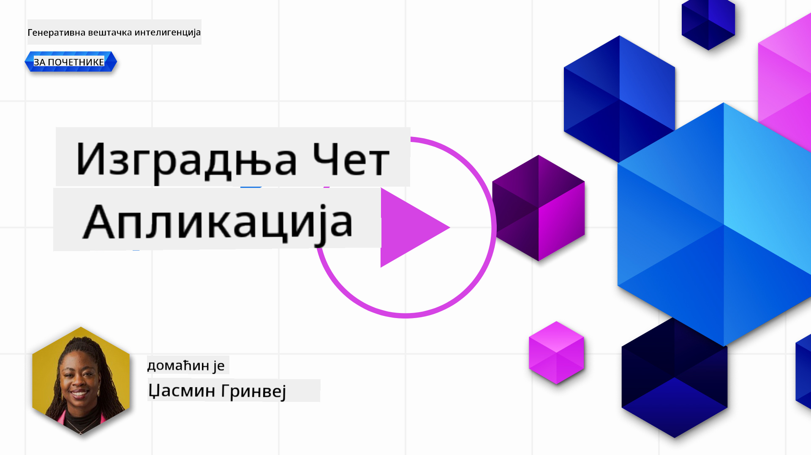
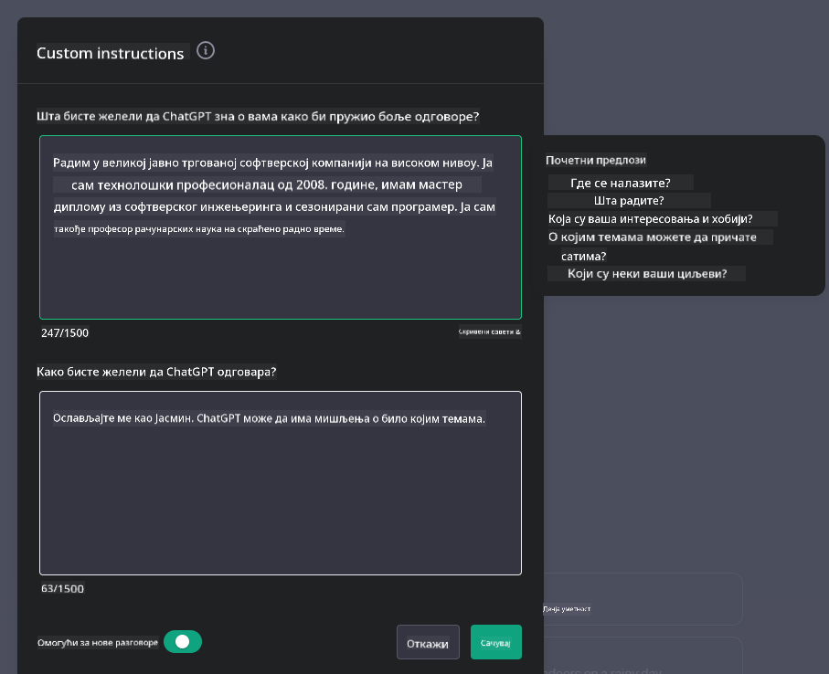
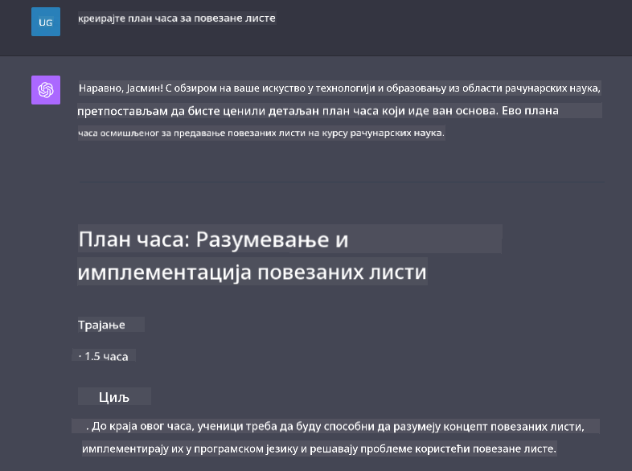

<!--
CO_OP_TRANSLATOR_METADATA:
{
  "original_hash": "ea4bbe640847aafbbba14dae4625e9af",
  "translation_date": "2025-05-19T18:13:19+00:00",
  "source_file": "07-building-chat-applications/README.md",
  "language_code": "sr"
}
-->
# Izgradnja chat aplikacija pokretanih generativnom veštačkom inteligencijom

[](https://aka.ms/gen-ai-lessons7-gh?WT.mc_id=academic-105485-koreyst)

> _(Kliknite na sliku iznad da pogledate video lekciju)_

Sada kada smo videli kako možemo napraviti aplikacije za generisanje teksta, pogledajmo chat aplikacije.

Chat aplikacije su postale deo našeg svakodnevnog života, nudeći više od obične neformalne komunikacije. One su integralni delovi korisničke podrške, tehničke podrške, pa čak i sofisticiranih savetodavnih sistema. Verovatno ste nedavno dobili neku pomoć od chat aplikacije. Kako integrišemo naprednije tehnologije poput generativne veštačke inteligencije u ove platforme, kompleksnost raste, kao i izazovi.

Neka pitanja na koja treba da odgovorimo su:

- **Izgradnja aplikacije**. Kako efikasno izgraditi i besprekorno integrisati ove AI-pokretane aplikacije za specifične slučajeve upotrebe?
- **Praćenje**. Kada se implementiraju, kako možemo pratiti i osigurati da aplikacije funkcionišu na najvišem nivou kvaliteta, kako u smislu funkcionalnosti tako i u skladu sa [šest principa odgovorne AI](https://www.microsoft.com/ai/responsible-ai?WT.mc_id=academic-105485-koreyst)?

Kako se dalje krećemo u doba definisano automatizacijom i besprekornim interakcijama između ljudi i mašina, razumevanje kako generativna AI transformiše opseg, dubinu i prilagodljivost chat aplikacija postaje ključno. Ova lekcija će istražiti aspekte arhitekture koji podržavaju ove složene sisteme, uroniti u metodologije za njihovo fino podešavanje za zadatke specifične za domenu i proceniti metrike i razmatranja relevantna za osiguranje odgovorne primene AI.

## Uvod

Ova lekcija pokriva:

- Tehnike za efikasnu izgradnju i integraciju chat aplikacija.
- Kako primeniti prilagođavanje i fino podešavanje na aplikacije.
- Strategije i razmatranja za efikasno praćenje chat aplikacija.

## Ciljevi učenja

Na kraju ove lekcije, bićete u mogućnosti da:

- Opisujete razmatranja za izgradnju i integraciju chat aplikacija u postojeće sisteme.
- Prilagodite chat aplikacije za specifične slučajeve upotrebe.
- Identifikujete ključne metrike i razmatranja za efikasno praćenje i održavanje kvaliteta AI-pokretanih chat aplikacija.
- Osigurate da chat aplikacije koriste AI odgovorno.

## Integracija generativne AI u chat aplikacije

Poboljšanje chat aplikacija putem generativne AI nije samo usmereno na njihovo činjenje pametnijima; radi se o optimizaciji njihove arhitekture, performansi i korisničkog interfejsa kako bi se pružilo kvalitetno korisničko iskustvo. Ovo uključuje istraživanje arhitektonskih osnova, API integracija i razmatranja korisničkog interfejsa. Ovaj deo ima za cilj da vam ponudi sveobuhvatnu mapu puta za navigaciju ovim složenim okruženjima, bilo da ih povezujete u postojeće sisteme ili ih gradite kao samostalne platforme.

Na kraju ovog dela, bićete opremljeni ekspertizom potrebnom za efikasnu izgradnju i inkorporaciju chat aplikacija.

### Chatbot ili chat aplikacija?

Pre nego što se upustimo u izgradnju chat aplikacija, hajde da uporedimo 'chatbotove' sa 'AI-pokretanim chat aplikacijama', koje služe različitim ulogama i funkcionalnostima. Glavna svrha chatbota je automatizacija specifičnih zadataka u razgovoru, kao što je odgovaranje na često postavljana pitanja ili praćenje paketa. Obično ga upravlja logika zasnovana na pravilima ili složeni AI algoritmi. Nasuprot tome, AI-pokretana chat aplikacija je mnogo šire okruženje dizajnirano da olakša različite oblike digitalne komunikacije, kao što su tekstualni, glasovni i video razgovori među ljudskim korisnicima. Njena definisajuća karakteristika je integracija generativnog AI modela koji simulira nijansirane, ljudske razgovore, generišući odgovore na osnovu širokog spektra ulaza i kontekstualnih znakova. Generativna AI pokretana chat aplikacija može se uključiti u diskusije otvorenog domena, prilagoditi se evoluirajućim kontekstima razgovora, pa čak i proizvesti kreativne ili složene dijaloge.

Tabela ispod prikazuje ključne razlike i sličnosti kako bismo bolje razumeli njihove jedinstvene uloge u digitalnoj komunikaciji.

| Chatbot                               | Generativna AI-Pokretana Chat Aplikacija |
| ------------------------------------- | -------------------------------------- |
| Fokusiran na zadatke i zasnovan na pravilima | Svestan konteksta                       |
| Često integrisan u veće sisteme       | Može hostovati jedan ili više chatbotova |
| Ograničen na programirane funkcije    | Uključuje generativne AI modele        |
| Specijalizovane i strukturirane interakcije | Sposoban za diskusije otvorenog domena |

### Korišćenje unapred izgrađenih funkcionalnosti sa SDK-ovima i API-ima

Kada gradite chat aplikaciju, dobar prvi korak je proceniti šta je već dostupno. Korišćenje SDK-ova i API-ja za izgradnju chat aplikacija je korisna strategija iz više razloga. Integrisanjem dobro dokumentovanih SDK-ova i API-ja, strateški pozicionirate svoju aplikaciju za dugoročni uspeh, rešavajući probleme skalabilnosti i održavanja.

- **Ubrzava proces razvoja i smanjuje troškove**: Oslanjanje na unapred izgrađene funkcionalnosti umesto skupog procesa njihove izgradnje omogućava vam da se fokusirate na druge aspekte vaše aplikacije koje smatrate važnijim, kao što je poslovna logika.
- **Bolje performanse**: Kada gradite funkcionalnost od nule, na kraju ćete se zapitati "Kako to skalira? Da li je ova aplikacija sposobna da podnese iznenadni priliv korisnika?" Dobro održavani SDK-ovi i API-ji često imaju ugrađena rešenja za ove probleme.
- **Lakše održavanje**: Ažuriranja i poboljšanja su lakša za upravljanje jer većina API-ja i SDK-ova jednostavno zahteva ažuriranje biblioteke kada se izda nova verzija.
- **Pristup vrhunskoj tehnologiji**: Korišćenje modela koji su fino podešeni i obučeni na opsežnim skupovima podataka pruža vašoj aplikaciji sposobnosti prirodnog jezika.

Pristup funkcionalnosti SDK-a ili API-ja obično podrazumeva dobijanje dozvole za korišćenje pruženih usluga, što se često postiže korišćenjem jedinstvenog ključa ili tokena za autentifikaciju. Koristićemo OpenAI Python biblioteku da istražimo kako ovo izgleda. Takođe, možete to isprobati sami u sledećem [notebooku za OpenAI](../../../07-building-chat-applications/python/oai-assignment.ipynb) ili [notebooku za Azure OpenAI Services](../../../07-building-chat-applications/python/aoai-assignment.ipynb) za ovu lekciju.

```python
import os
from openai import OpenAI

API_KEY = os.getenv("OPENAI_API_KEY","")

client = OpenAI(
    api_key=API_KEY
    )

chat_completion = client.chat.completions.create(model="gpt-3.5-turbo", messages=[{"role": "user", "content": "Suggest two titles for an instructional lesson on chat applications for generative AI."}])
```

Gornji primer koristi GPT-3.5 Turbo model za kompletiranje upita, ali primetite da je API ključ postavljen pre toga. Dobijate grešku ako niste postavili ključ.

## Korisničko iskustvo (UX)

Opšti UX principi važe za chat aplikacije, ali evo nekih dodatnih razmatranja koja postaju posebno važna zbog komponenti mašinskog učenja.

- **Mehanizam za rešavanje dvosmislenosti**: Generativni AI modeli povremeno generišu dvosmislene odgovore. Funkcija koja omogućava korisnicima da traže pojašnjenje može biti korisna ako naiđu na ovaj problem.
- **Zadržavanje konteksta**: Napredni generativni AI modeli imaju sposobnost da pamte kontekst unutar razgovora, što može biti neophodan alat za korisničko iskustvo. Davanje korisnicima mogućnosti da kontrolišu i upravljaju kontekstom poboljšava korisničko iskustvo, ali uvodi rizik od zadržavanja osetljivih korisničkih informacija. Razmatranja o tome koliko dugo se ove informacije čuvaju, kao što je uvođenje politike zadržavanja, mogu balansirati potrebu za kontekstom protiv privatnosti.
- **Personalizacija**: Sa sposobnošću učenja i prilagođavanja, AI modeli nude individualizovano iskustvo za korisnika. Prilagođavanje korisničkog iskustva putem funkcija kao što su korisnički profili ne samo da čini da se korisnik oseća shvaćenim, već takođe pomaže u njihovoj potrazi za pronalaženjem specifičnih odgovora, stvarajući efikasniju i zadovoljavajuću interakciju.

Jedan takav primer personalizacije su postavke "Custom instructions" u OpenAI-jevom ChatGPT-u. Omogućava vam da pružite informacije o sebi koje mogu biti važan kontekst za vaše upite. Evo primera prilagođenog uputstva.



Ovaj "profil" podstiče ChatGPT da kreira plan lekcije o povezanima listama. Primetite da ChatGPT uzima u obzir da korisnik može želeti detaljniji plan lekcije na osnovu njenog iskustva.



### Microsoftov okvir za sistemske poruke za velike jezičke modele

[Microsoft je pružio smernice](https://learn.microsoft.com/azure/ai-services/openai/concepts/system-message#define-the-models-output-format?WT.mc_id=academic-105485-koreyst) za pisanje efektivnih sistemskih poruka pri generisanju odgovora iz LLM-ova podeljene u 4 oblasti:

1. Definisanje za koga je model, kao i njegovih sposobnosti i ograničenja.
2. Definisanje formata izlaza modela.
3. Pružanje specifičnih primera koji demonstriraju nameravano ponašanje modela.
4. Pružanje dodatnih sigurnosnih ograda ponašanja.

### Pristupačnost

Bilo da korisnik ima vizuelne, slušne, motoričke ili kognitivne smetnje, dobro dizajnirana chat aplikacija treba da bude upotrebljiva za sve. Sledeća lista razlaže specifične funkcije usmerene na poboljšanje pristupačnosti za različite korisničke smetnje.

- **Funkcije za vizuelne smetnje**: Tematski prikaz visokog kontrasta i prilagodljivi tekst, kompatibilnost sa čitačima ekrana.
- **Funkcije za slušne smetnje**: Funkcije za pretvaranje teksta u govor i govora u tekst, vizuelni signali za audio obaveštenja.
- **Funkcije za motoričke smetnje**: Podrška za navigaciju putem tastature, glasovne komande.
- **Funkcije za kognitivne smetnje**: Opcije za pojednostavljeni jezik.

## Prilagođavanje i fino podešavanje za jezičke modele specifične za domenu

Zamislite chat aplikaciju koja razume žargon vaše kompanije i predviđa specifične upite koje njena korisnička baza obično ima. Postoji nekoliko pristupa vrednih pomena:

- **Korišćenje DSL modela**. DSL označava jezik specifičan za domenu. Možete koristiti takozvani DSL model obučen na specifičnom domenu da razume njegove pojmove i scenarije.
- **Primena finog podešavanja**. Fino podešavanje je proces daljeg treniranja vašeg modela sa specifičnim podacima.

## Prilagođavanje: Korišćenje DSL-a

Korišćenje modela jezika specifičnog za domenu (DSL modeli) može poboljšati angažman korisnika pružajući specijalizovane, kontekstualno relevantne interakcije. To je model koji je obučen ili fino podešen da razume i generiše tekst vezan za određeno polje, industriju ili temu. Opcije za korišćenje DSL modela mogu varirati od treniranja jednog od nule do korišćenja već postojećih putem SDK-ova i API-ja. Druga opcija je fino podešavanje, što uključuje uzimanje postojećeg unapred obučenog modela i prilagođavanje za specifični domen.

## Prilagođavanje: Primena finog podešavanja

Fino podešavanje se često razmatra kada unapred obučeni model nije dovoljan u specijalizovanom domenu ili specifičnom zadatku.

Na primer, medicinski upiti su složeni i zahtevaju mnogo konteksta. Kada medicinski profesionalac dijagnostikuje pacijenta, to se zasniva na različitim faktorima kao što su stil života ili postojeći uslovi, i može se čak osloniti na nedavne medicinske časopise kako bi potvrdio svoju dijagnozu. U takvim nijansiranim scenarijima, AI chat aplikacija opšte namene ne može biti pouzdan izvor.

### Scenario: medicinska aplikacija

Razmotrite chat aplikaciju dizajniranu da pomaže medicinskim stručnjacima pružajući brze reference na smernice za lečenje, interakcije lekova ili nedavna istraživanja.

Model opšte namene može biti adekvatan za odgovaranje na osnovna medicinska pitanja ili pružanje opštih saveta, ali može imati problema sa sledećim:

- **Veoma specifični ili složeni slučajevi**. Na primer, neurolog može pitati aplikaciju: "Koje su trenutne najbolje prakse za upravljanje epilepsijom otpornom na lekove kod pedijatrijskih pacijenata?"
- **Nedostatak nedavnih dostignuća**. Model opšte namene mogao bi imati problema da pruži trenutni odgovor koji uključuje najnovija dostignuća u neurologiji i farmakologiji.

U takvim slučajevima, fino podešavanje modela sa specijalizovanim medicinskim skupom podataka može značajno poboljšati njegovu sposobnost da se nosi sa ovim složenim medicinskim upitima preciznije i pouzdanije. Ovo zahteva pristup velikom i relevantnom skupu podataka koji predstavlja izazove i pitanja specifična za domen koja treba rešiti.

## Razmatranja za visokokvalitetno AI-pokretano chat iskustvo

Ovaj deo opisuje kriterijume za "visokokvalitetne" chat aplikacije, koje uključuju hvatanje merljivih metrika i pridržavanje okvira koji odgovorno koristi AI tehnologiju.

### Ključne metrike

Da bi se održale visokokvalitetne performanse aplikacije, ključno je pratiti ključne metrike i razmatranja. Ova merenja ne samo da osiguravaju funkcionalnost aplikacije već i procenjuju kvalitet AI modela i korisničkog iskustva. Ispod je lista koja pokriva osnovne, AI i korisničke iskustvene metrike koje treba razmotriti.

| Metrika                        | Definicija                                                                                                             | Razmatranja za razvojnog programera chata                                         |
| ----------------------------- | ---------------------------------------------------------------------------------------------------------------------- | ------------------------------------------------------------------------- |
| **Dostupnost**                | Meri vreme kada je aplikacija operativna i dostupna korisnicima.                                                        | Kako ćete minimizirati vreme nedostupnosti?                                           |
| **Vreme odziva**              | Vreme koje je potrebno aplikaciji da odgovori na korisnički upit.                                                       | Kako možete optimizovati obradu upita kako biste poboljšali vreme odziva?           |
| **Preciznost**                | Odnos tačnih pozitivnih predikcija prema ukupnom broju pozitivnih predikcija                                            | Kako ćete validirati preciznost vašeg modela?                        |
| **Osetljivost (Recall)**      | Odnos tačnih pozitivnih predikcija prema stvarnom broju pozitivnih slučajeva                                           | Kako ćete meriti i poboljšavati osetljivost?                                  |
| **F1 Skor**                   | Harmonična sredina preciznosti i osetljivosti koja balansira kompromis između oba.                                     | Koji je vaš ciljani F1 Skor? Kako ćete balansirati preciznost i osetljivost?  |
| **Perpleksnost**              | Meri koliko se verovatnosna distribucija koju predviđa model poklapa sa stvarnom distribucijom podataka.              | Kako ćete minimizirati perpleksnost?                                         |
| **Metrike zadovoljstva korisnika** | Meri percepciju korisnika o aplikaciji. Često se prikupljaju putem anketa.                                         | Koliko često ćete prikupljati povratne informacije od korisnika? Kako ćete se pril

**Одричање одговорности**:  
Овај документ је преведен користећи AI услугу превођења [Co-op Translator](https://github.com/Azure/co-op-translator). Иако се трудимо да будемо прецизни, молимо вас да будете свесни да аутоматски преводи могу садржати грешке или нетачности. Оригинални документ на његовом изворном језику треба сматрати ауторитативним извором. За критичне информације, препоручује се професионални људски превод. Не преузимамо одговорност за било каква неспоразума или погрешна тумачења која произилазе из употребе овог превода.