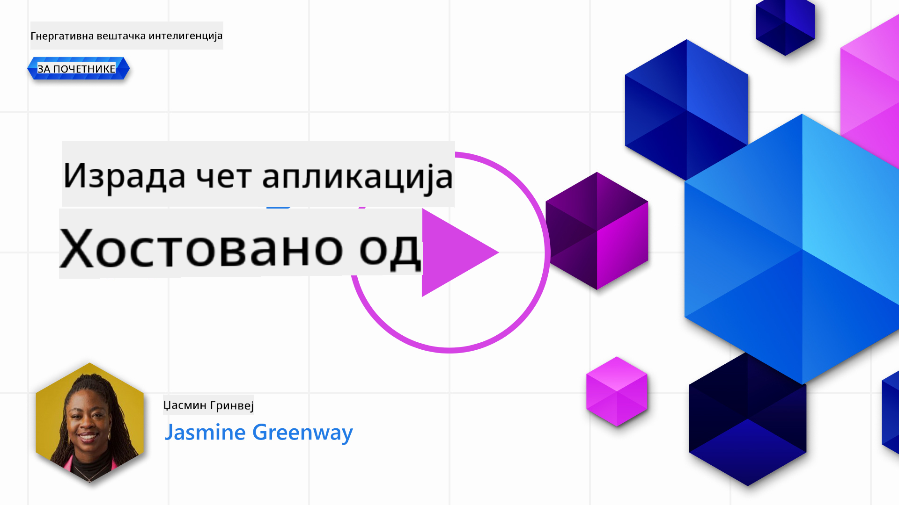
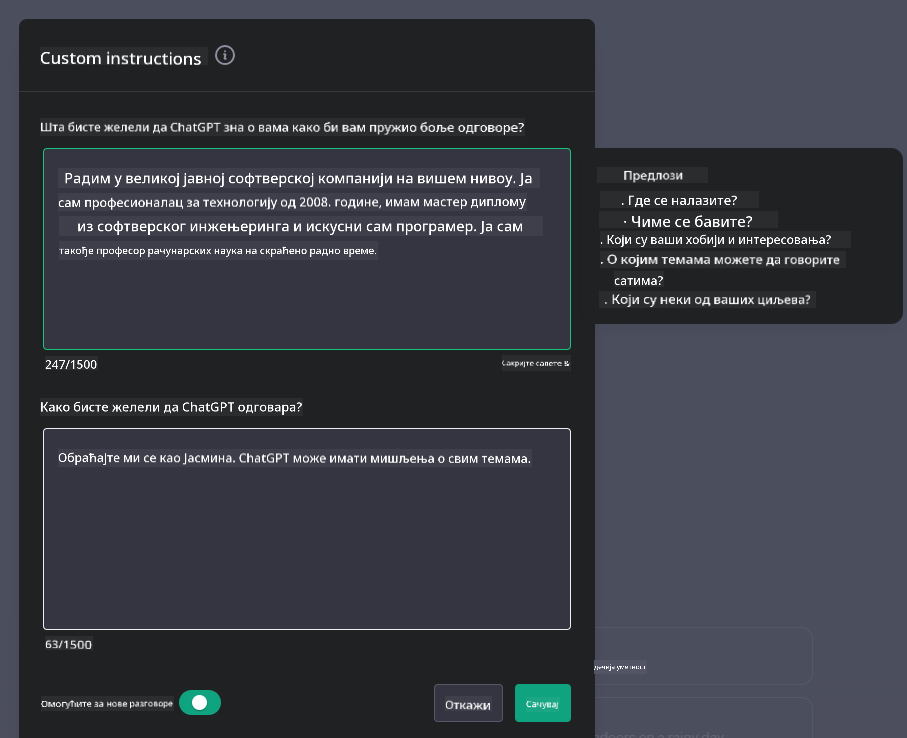
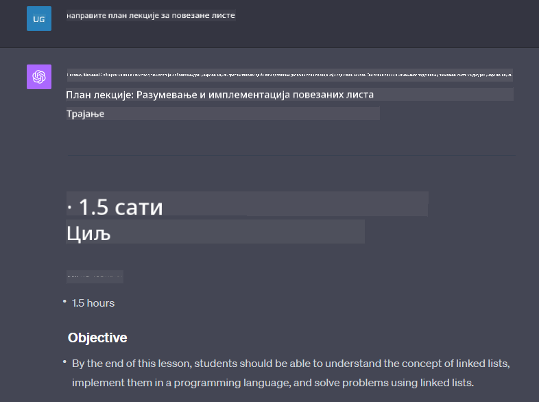

<!--
CO_OP_TRANSLATOR_METADATA:
{
  "original_hash": "ea4bbe640847aafbbba14dae4625e9af",
  "translation_date": "2025-07-09T12:41:02+00:00",
  "source_file": "07-building-chat-applications/README.md",
  "language_code": "sr"
}
-->
# Израда ћаскања покретаног генеративном вештачком интелигенцијом

[](https://aka.ms/gen-ai-lessons7-gh?WT.mc_id=academic-105485-koreyst)

> _(Кликните на слику изнад да бисте погледали видео о овој лекцији)_

Сада када смо видели како можемо правити апликације за генерисање текста, хајде да се позабавимо апликацијама за ћаскање.

Апликације за ћаскање постале су саставни део наших свакодневних живота, нудећи више од обичног начина за неформални разговор. Оне су кључни део корисничке подршке, техничке помоћи, па чак и сложених саветодавних система. Вероватно сте недавно добили помоћ од неке апликације за ћаскање. Како у ове платформе интегришемо напредније технологије као што је генеративна вештачка интелигенција, расте и сложеност, као и изазови.

Нека од питања на која треба да добијемо одговор су:

- **Израда апликације**. Како ефикасно изградити и беспрекорно интегрисати ове апликације покретане вештачком интелигенцијом за специфичне случајеве употребе?
- **Надгледање**. Када се апликације покрену, како можемо пратити и осигурати да раде на највишем нивоу квалитета, како у погледу функционалности, тако и у складу са [шест принципа одговорне вештачке интелигенције](https://www.microsoft.com/ai/responsible-ai?WT.mc_id=academic-105485-koreyst)?

Како улазимо у доба дефинисано аутоматизацијом и беспрекорном интеракцијом између људи и машина, постаје кључно разумети како генеративна вештачка интелигенција мења обим, дубину и прилагодљивост апликација за ћаскање. Ова лекција ће испитати аспекте архитектуре који подржавају ове сложене системе, ући у методологије за њихово фино подешавање за доменски специфичне задатке и проценити метрике и разматрања важна за одговорно коришћење вештачке интелигенције.

## Увод

Ова лекција обухвата:

- Технике за ефикасну израду и интеграцију апликација за ћаскање.
- Како применити прилагођавање и фино подешавање апликација.
- Стратегије и разматрања за ефикасно праћење апликација за ћаскање.

## Циљеви учења

До краја ове лекције моћи ћете да:

- Опишете разматрања приликом израде и интеграције апликација за ћаскање у постојеће системе.
- Прилагодите апликације за ћаскање за специфичне случајеве употребе.
- Идентификујете кључне метрике и разматрања за ефикасно праћење и одржавање квалитета апликација за ћаскање покретаних вештачком интелигенцијом.
- Осигурате да апликације за ћаскање одговорно користе вештачку интелигенцију.

## Интеграција генеративне вештачке интелигенције у апликације за ћаскање

Подизање апликација за ћаскање уз помоћ генеративне вештачке интелигенције није само у томе да их учинимо паметнијим; ради се о оптимизацији њихове архитектуре, перформанси и корисничког интерфејса како би се пружило квалитетно корисничко искуство. Ово укључује испитивање архитектонских основа, интеграција API-ја и разматрања корисничког интерфејса. Овај одељак има за циљ да вам пружи свеобухватан водич за сналажење у овим сложеним областима, било да их повезујете са постојећим системима или градите као самосталне платформе.

До краја овог одељка бићете опремљени знањем потребним за ефикасну изградњу и интеграцију апликација за ћаскање.

### Чатбот или апликација за ћаскање?

Пре него што се упустимо у израду апликација за ћаскање, упоредимо „чатботове“ и „апликације за ћаскање покретане вештачком интелигенцијом“, које имају различите улоге и функционалности. Главна сврха чатбота је аутоматизација одређених разговорних задатака, као што су одговарање на често постављана питања или праћење пакета. Обично се управља правилима или сложеним AI алгоритмима. Насупрот томе, апликација за ћаскање покретана генеративном вештачком интелигенцијом је много шире окружење дизајнирано за различите облике дигиталне комуникације, као што су текстуални, гласовни и видео разговори између људи. Њена карактеристика је интеграција генеративног AI модела који симулира нијансиране, људске разговоре, генеришући одговоре на основу широког спектра улаза и контекстуалних сигнала. Апликација за ћаскање покретана генеративном AI може водити разговоре отвореног домена, прилагођавати се развоју контекста и чак производити креативан или сложен дијалог.

Табела испод приказује кључне разлике и сличности како бисмо боље разумели њихове јединствене улоге у дигиталној комуникацији.

| Чатбот                                | Апликација за ћаскање покретана генеративном AI-јем |
| ------------------------------------- | --------------------------------------------------- |
| Фокусирана на задатке и заснована на правилима | Свесна контекста                                  |
| Често интегрисана у веће системе      | Може угостити један или више чатботова              |
| Ограничена на програмиране функције   | Укључује генеративне AI моделе                      |
| Специјализоване и структуриране интеракције | Способна за разговоре отвореног домена             |

### Коришћење унапред изграђених функционалности уз SDK и API-је

Када правите апликацију за ћаскање, добар први корак је да процените шта је већ доступно. Коришћење SDK-ова и API-ја за израду апликација за ћаскање је корисна стратегија из више разлога. Интеграцијом добро документованих SDK-ова и API-ја, стратешки позиционирате своју апликацију за дугорочни успех, решавајући питања скалабилности и одржавања.

- **Убрзава процес развоја и смањује трошкове**: Ослањање на унапред изграђене функционалности уместо скупог процеса израде омогућава вам да се фокусирате на друге аспекте апликације који су вам важнији, као што је пословна логика.
- **Боље перформансе**: Када градите функционалност од нуле, на крају ћете се запитати „Како се ово скалира? Да ли апликација може да поднесе нагли прилив корисника?“ Добро одржавани SDK и API често имају уграђена решења за ове изазове.
- **Лакше одржавање**: Ажурирања и побољшања је лакше управљати јер већина API-ја и SDK-ова захтева само ажурирање библиотеке када изађе нова верзија.
- **Приступ најсавременијој технологији**: Коришћење модела који су фино подешени и обучени на обимним скупова података пружа вашој апликацији могућности природног језика.

Приступ функционалности SDK-а или API-ја обично подразумева добијање дозволе за коришћење услуга, што се често остварује коришћењем јединственог кључа или аутентификационог токена. У овом примеру користићемо OpenAI Python библиотеку да видимо како то изгледа. Такође можете пробати сами у следећем [notebook-у за OpenAI](python/oai-assignment.ipynb) или [notebook-у за Azure OpenAI Services](python/aoai-assignment.ipynb) за ову лекцију.

```python
import os
from openai import OpenAI

API_KEY = os.getenv("OPENAI_API_KEY","")

client = OpenAI(
    api_key=API_KEY
    )

chat_completion = client.chat.completions.create(model="gpt-3.5-turbo", messages=[{"role": "user", "content": "Suggest two titles for an instructional lesson on chat applications for generative AI."}])
```

Горњи пример користи GPT-3.5 Turbo модел за довршавање упита, али приметите да је API кључ подешен пре тога. Добићете грешку ако не поставите кључ.

## Корисничко искуство (UX)

Општи принципи UX-а важе и за апликације за ћаскање, али ево неких додатних разматрања која постају посебно важна због компоненти машинског учења.

- **Механизам за решавање нејасноћа**: Генеративни AI модели понекад генеришу неодређене одговоре. Функција која омогућава корисницима да затраже појашњење може бити корисна ако наиђу на овај проблем.
- **Чување контекста**: Напредни генеративни AI модели имају способност да памте контекст у разговору, што може бити неопходан ресурс за корисничко искуство. Омогућавање корисницима да контролишу и управљају контекстом побољшава искуство, али уводи ризик задржавања осетљивих података. Разматрања о томе колико дуго се ови подаци чувају, као што је увођење политике задржавања, могу уравнотежити потребу за контекстом и приватност.
- **Персонализација**: Са способношћу учења и прилагођавања, AI модели нуде индивидуализовано искуство за корисника. Прилагођавање корисничког искуства кроз функције као што су кориснички профили не само да кориснику пружа осећај разумевања, већ и помаже у бржем проналажењу конкретних одговора, стварајући ефикаснију и задовољавајућу интеракцију.

Један пример персонализације су „Прилагођена упутства“ у OpenAI ChatGPT-у. Омогућавају вам да пружите информације о себи које могу бити важан контекст за ваше упите. Ево примера прилагођеног упутства.



Овај „профил“ подстиче ChatGPT да направи план лекције о повезаним листама. Примећујете да ChatGPT узима у обзир да корисник можда жели детаљнији план лекције на основу свог искуства.



### Microsoft-ов системски оквир за велике језичке моделе

[Microsoft је пружио смернице](https://learn.microsoft.com/azure/ai-services/openai/concepts/system-message#define-the-models-output-format?WT.mc_id=academic-105485-koreyst) за писање ефикасних системских порука приликом генерисања одговора од LLM-ова, подељене у 4 области:

1. Дефинисање за кога је модел намењен, као и његових могућности и ограничења.
2. Дефинисање формата излаза модела.
3. Пружање конкретних примера који показују намеравано понашање модела.
4. Пружање додатних понашајних ограничења.

### Приступачност

Без обзира да ли корисник има оштећење вида, слуха, моторике или когнитивне способности, добро дизајнирана апликација за ћаскање треба да буде доступна свима. Следећа листа разлаже специфичне функције усмерене на побољшање приступачности за различите врсте оштећења.

- **Функције за оштећење вида**: Теме са високим контрастом и могућност повећања текста, компатибилност са читачима екрана.
- **Функције за оштећење слуха**: Функције претварања текста у говор и говора у текст, визуелни сигнали за аудио обавештења.
- **Функције за моторичка оштећења**: Подршка за навигацију тастатуром, гласовне команде.
- **Функције за когнитивна оштећења**: Опције поједностављеног језика.

## Прилагођавање и фино подешавање доменски специфичних језичких модела

Замислите апликацију за ћаскање која разуме жаргон ваше компаније и предвиђа специфична питања која корисници најчешће постављају. Постоје два приступа која вреди поменути:

- **Коришћење DSL модела**. DSL означава доменски специфичан језик. Можете користити такозвани DSL модел обучен на одређеном домену да разуме његове концепте и сценарије.
- **Примена фино подешавање**. Фино подешавање је процес даљег обучавања вашег модела са специфичним подацима.

## Прилагођавање: Коришћење DSL-а

Коришћење доменски специфичних језичких модела (DSL модела) може побољшати ангажовање корисника пружајући специјализоване, контекстуално релевантне интеракције. То је модел који је обучен или фино подешен да разуме и генерише текст везан за одређену област, индустрију или тему. Опције за коришћење DSL модела могу варирати од обуке од нуле до коришћења постојећих преко SDK-ова и API-ја. Друга опција је фино подешавање, што подразумева узимање постојећег претходно обученог модела и прилагођавање за одређени домен.

## Прилагођавање: Примена фино подешавања

Фино подешавање се често разматра када претходно обучени модел није довољно добар у специјализованом домену или за специфичан задатак.

На пример, медицинска питања су сложена и захтевају много контекста. Када медицински стручњак поставља дијагнозу, он се ослања на разне факторе као што су начин живота или претходна стања, а може се ослонити и на најновије медицинске часописе да потврди дијагнозу. У таквим нијансираним ситуацијама, општа AI апликација за ћаскање не може бити поуздан извор.

### Сценарио: медицинска апликација

Размотрите апликацију за ћаскање дизајнирану да помогне медицинским стручњацима пружајући брзе референце за смернице лечења, интеракције лекова или најновија истраживања.

Општи модел може бити довољан за одговарање на основна медицинска питања или пружање општих савета, али може имати потешкоћа са:

- **Веома специфичним или сложеним случајевима**. На пример, неуролог може питати апликацију: „Које су тренутне најбоље праксе за управљање
| **Откривање аномалија**         | Алати и технике за идентификовање необичних образаца који се не уклапају у очекивано понашање.                        | Како ћете реаговати на аномалије?                                        |

### Имплементација одговорних пракси вештачке интелигенције у апликацијама за ћаскање

Microsoft-ов приступ одговорној вештачкој интелигенцији дефинисао је шест принципа који треба да воде развој и коришћење AI. Испод су наведени принципи, њихова дефиниција и ствари које програмер апликација за ћаскање треба да узме у обзир и зашто је важно да их озбиљно схвати.

| Принципи               | Microsoft-ова дефиниција                                | Разматрања за програмера апликације за ћаскање                                      | Зашто је важно                                                                     |
| ---------------------- | ----------------------------------------------------- | ---------------------------------------------------------------------- | -------------------------------------------------------------------------------------- |
| Праведност             | AI системи треба да поступају праведно према свима.            | Осигурати да апликација за ћаскање не дискриминише на основу корисничких података.  | Да се изгради поверење и инклузивност међу корисницима; избегавају се правне последице.                |
| Поузданост и безбедност | AI системи треба да раде поуздано и безбедно.        | Спровести тестирање и механизме заштите како би се смањиле грешке и ризици.         | Обезбеђује задовољство корисника и спречава потенцијалну штету.                                 |
| Приватност и безбедност   | AI системи треба да буду безбедни и да поштују приватност.      | Увести јаку енкрипцију и мере заштите података.              | Да се заштите осетљиви кориснички подаци и испоштују закони о приватности.                         |
| Инклузивност          | AI системи треба да оснажују све и укључују људе. | Дизајнирати кориснички интерфејс који је приступачан и једноставан за коришћење различитим корисницима. | Обезбеђује да шири круг људи може ефикасно користити апликацију.                   |
| Транспарентност           | AI системи треба да буду разумљиви.                  | Обезбедити јасну документацију и образложење AI одговора.            | Корисници ће више веровати систему ако разумеју како се доносе одлуке. |
| Одговорност         | Људи треба да буду одговорни за AI системе.          | Успоставити јасан процес ревизије и унапређења AI одлука.     | Омогућава континуирано унапређење и корективне мере у случају грешака.               |

## Задатак

Погледајте [assignment](../../../07-building-chat-applications/python) који ће вас провести кроз низ вежби од покретања првих упита за ћаскање, преко класификације и резимирања текста и још много тога. Имајте у виду да су задаци доступни на различитим програмским језицима!

## Одличан посао! Наставите путовање

Након завршетка ове лекције, погледајте нашу [Generative AI Learning collection](https://aka.ms/genai-collection?WT.mc_id=academic-105485-koreyst) да бисте наставили да унапређујете своје знање о генеративној вештачкој интелигенцији!

Прелазите на Лекцију 8 да бисте видели како можете почети са [израдом апликација за претрагу](../08-building-search-applications/README.md?WT.mc_id=academic-105485-koreyst)!

**Одрицање од одговорности**:  
Овај документ је преведен коришћењем AI услуге за превођење [Co-op Translator](https://github.com/Azure/co-op-translator). Иако тежимо прецизности, молимо вас да имате у виду да аутоматски преводи могу садржати грешке или нетачности. Оригинални документ на његовом изворном језику треба сматрати ауторитетним извором. За критичне информације препоручује се професионални људски превод. Нисмо одговорни за било каква неспоразума или погрешна тумачења која произилазе из коришћења овог превода.