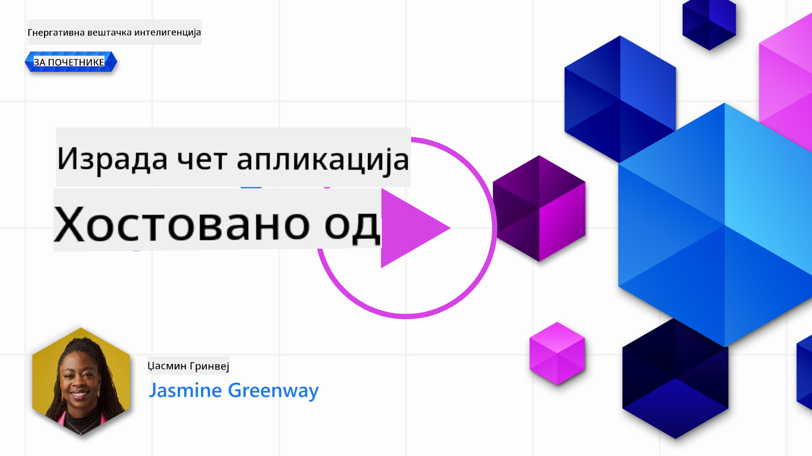
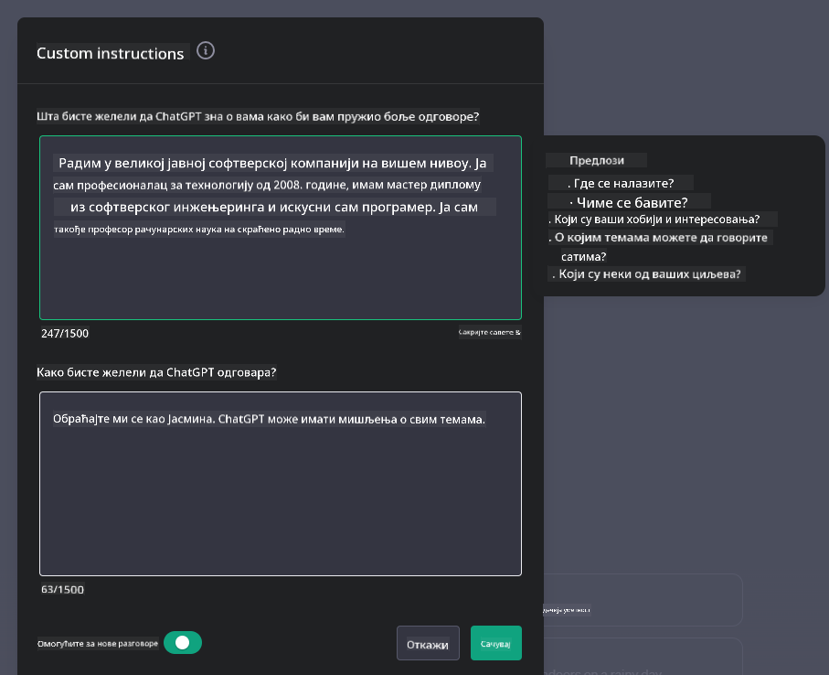
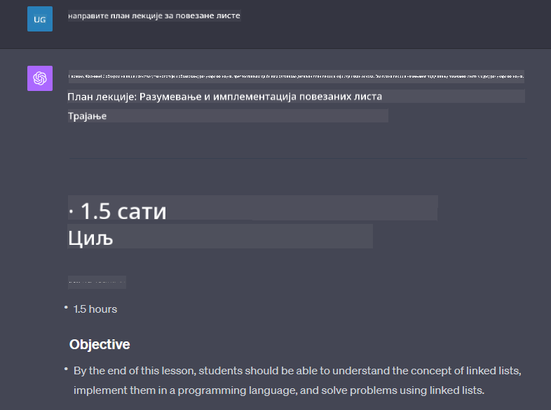

<!--
CO_OP_TRANSLATOR_METADATA:
{
  "original_hash": "ea4bbe640847aafbbba14dae4625e9af",
  "translation_date": "2025-06-25T16:00:32+00:00",
  "source_file": "07-building-chat-applications/README.md",
  "language_code": "sr"
}
-->
# Изградња чет апликација са генеративном вештачком интелигенцијом

[](https://aka.ms/gen-ai-lessons7-gh?WT.mc_id=academic-105485-koreyst)

> _(Кликните на слику изнад да бисте погледали видео овог часа)_

Сада када смо видели како можемо изградити апликације за генерисање текста, погледајмо чет апликације.

Чет апликације су постале интегрисане у наше свакодневне животе, нудећи више од само средства за неформалну комуникацију. Оне су саставни део корисничке службе, техничке подршке и чак софистицираних саветодавних система. Вероватно сте добили неку помоћ од чет апликације не тако давно. Како интегришемо напредније технологије попут генеративне вештачке интелигенције у ове платформе, сложеност се повећава, а тако и изазови.

Нека питања на која треба одговорити су:

- **Изградња апликације**. Како ефикасно изградити и беспрекорно интегрисати ове апликације покретане вештачком интелигенцијом за специфичне случајеве употребе?
- **Мониторинг**. Када се примене, како можемо пратити и осигурати да апликације раде на највишем нивоу квалитета, како у смислу функционалности, тако и у складу са [шест принципа одговорне вештачке интелигенције](https://www.microsoft.com/ai/responsible-ai?WT.mc_id=academic-105485-koreyst)?

Како се крећемо даље у ери дефинисаној аутоматизацијом и беспрекорним интеракцијама човек-машина, разумевање како генеративна вештачка интелигенција трансформише обим, дубину и прилагодљивост чет апликација постаје суштинско. Овај час ће истражити аспекте архитектуре који подржавају ове сложене системе, продубити методологије за њихово фино подешавање за доменске задатке и проценити метрике и разматрања релевантне за осигурање одговорног примене вештачке интелигенције.

## Увод

Овај час покрива:

- Технике за ефикасну изградњу и интеграцију чет апликација.
- Како применити прилагођавање и фино подешавање апликација.
- Стратегије и разматрања за ефективно праћење чет апликација.

## Циљеви учења

До краја овог часа, моћи ћете да:

- Описујете разматрања за изградњу и интеграцију чет апликација у постојеће системе.
- Прилагодите чет апликације за специфичне случајеве употребе.
- Идентификујете кључне метрике и разматрања за ефективно праћење и одржавање квалитета чет апликација покретаних вештачком интелигенцијом.
- Осигурате да чет апликације одговорно користе вештачку интелигенцију.

## Интеграција генеративне вештачке интелигенције у чет апликације

Подизање чет апликација кроз генеративну вештачку интелигенцију није само усмерено на то да их учинимо паметнијим; ради се о оптимизацији њихове архитектуре, перформанси и корисничког интерфејса за пружање квалитетног корисничког искуства. Ово укључује истраживање архитектонских основа, интеграција API-ја и разматрања корисничког интерфејса. Овај одељак има за циљ да вам понуди свеобухватан путоказ за навигацију овим сложеним пејзажима, било да их укључујете у постојеће системе или их градите као самосталне платформе.

До краја овог одељка, бићете опремљени стручним знањем потребним за ефикасну конструкцију и укључивање чет апликација.

### Четбот или чет апликација?

Пре него што се упустимо у изградњу чет апликација, упоредимо 'четботове' и 'чет апликације покретане вештачком интелигенцијом,' који служе различитим улогама и функционалностима. Главна сврха четбота је аутоматизација специфичних задатака у разговору, као што је одговарање на често постављана питања или праћење пакета. Обично га управља логика заснована на правилима или сложени алгоритми вештачке интелигенције. Насупрот томе, чет апликација покретана вештачком интелигенцијом је много шири простор дизајниран да олакша различите облике дигиталне комуникације, као што су текст, глас и видео четови међу људским корисницима. Њена карактеристика је интеграција генеративног модела вештачке интелигенције који симулира нијансиране, људске разговоре, генеришући одговоре на основу широког спектра уноса и контекстуалних знакова. Чет апликација покретана генеративном вештачком интелигенцијом може учествовати у дискусијама отвореног домена, прилагодити се развијајућим контекстима разговора и чак производити креативан или сложен дијалог.

Табела испод описује кључне разлике и сличности како бисмо разумели њихове јединствене улоге у дигиталној комуникацији.

| Четбот                               | Чет апликација покретана генеративном вештачком интелигенцијом |
| ------------------------------------- | -------------------------------------- |
| Усмерен на задатке и заснован на правилима | Свесна контекста                          |
| Често интегрисан у веће системе  | Може хостовати један или више четботова      |
| Ограничен на програмиране функције       | Инкорпорише генеративне AI моделе      |
| Специјализоване и структуриране интеракције | Способан за дискусије отвореног домена     |

### Коришћење унапред изграђених функционалности са SDK-овима и API-јима

Када градите чет апликацију, одличан први корак је процена онога што је већ доступно. Коришћење SDK-ова и API-ја за изградњу чет апликација је предност из више разлога. Интеграцијом добро документованих SDK-ова и API-ја, стратешки позиционирате своју апликацију за дугорочан успех, адресирајући питања скалабилности и одржавања.

- **Убрзава процес развоја и смањује трошкове**: Ослањање на унапред изграђене функционалности уместо на скуп процес изградње истих омогућава вам да се фокусирате на друге аспекте ваше апликације који су вам можда важнији, као што је пословна логика.
- **Боље перформансе**: Када градите функционалност од нуле, на крају ћете се запитати "Како се скалира? Да ли је ова апликација способна да обради изненадни прилив корисника?" Добро одржавани SDK и API-ји често имају уграђена решења за ова питања.
- **Лакше одржавање**: Ажурирања и побољшања су лакша за управљање јер већина API-ја и SDK-ова једноставно захтева ажурирање библиотеке када се изда нова верзија.
- **Приступ најсавременијој технологији**: Коришћење модела који су фино подешени и обучени на обимним скуповима података пружа вашој апликацији могућности природног језика.

Приступ функционалностима SDK-а или API-ја обично укључује добијање дозволе за коришћење пружених услуга, што се често остварује коришћењем јединственог кључа или токена за аутентификацију. Користићемо OpenAI Python библиотеку да истражимо како ово изгледа. Такође можете испробати сами у следећем [бележнику за OpenAI](../../../07-building-chat-applications/python/oai-assignment.ipynb) или [бележнику за Azure OpenAI услуге](../../../07-building-chat-applications/python/aoai-assignment.ipynb) за овај час.

```python
import os
from openai import OpenAI

API_KEY = os.getenv("OPENAI_API_KEY","")

client = OpenAI(
    api_key=API_KEY
    )

chat_completion = client.chat.completions.create(model="gpt-3.5-turbo", messages=[{"role": "user", "content": "Suggest two titles for an instructional lesson on chat applications for generative AI."}])
```

Горњи пример користи GPT-3.5 Turbo модел за завршетак упита, али приметите да је API кључ постављен пре тога. Добићете грешку ако нисте поставили кључ.

## Корисничко искуство (UX)

Општи принципи корисничког искуства примењују се на чет апликације, али ево неких додатних разматрања која постају посебно важна због компоненти машинског учења које су укључене.

- **Механизам за решавање двосмислености**: Генеративни AI модели понекад генеришу двосмислене одговоре. Функција која омогућава корисницима да траже појашњење може бити корисна ако наиђу на овај проблем.
- **Задржавање контекста**: Напредни генеративни AI модели имају способност да запамте контекст унутар разговора, што може бити неопходан ресурс за корисничко искуство. Омогућавање корисницима да контролишу и управљају контекстом побољшава корисничко искуство, али уводи ризик задржавања осетљивих информација корисника. Разматрања о томе колико дуго се ове информације чувају, као што је увођење политике задржавања, могу уравнотежити потребу за контекстом против приватности.
- **Персонализација**: Са способношћу да уче и прилагођавају се, AI модели нуде индивидуализовано искуство за корисника. Прилагођавање корисничког искуства кроз функције као што су кориснички профили не само да чини да се корисник осећа разуменим, већ такође помаже у њиховој потрази за проналажењем специфичних одговора, стварајући ефикаснију и задовољавајућу интеракцију.

Један такав пример персонализације је подешавање "Прилагођене инструкције" у OpenAI-јевом ChatGPT-у. Омогућава вам да пружите информације о себи које могу бити важан контекст за ваше упите. Ево примера прилагођене инструкције.



Овај "профил" наводи ChatGPT да креира план лекције о повезаним листама. Приметите да ChatGPT узима у обзир да корисник можда жели детаљнији план лекције на основу њеног искуства.



### Microsoft-ов оквир системских порука за моделе великог језика

[Microsoft је пружио смернице](https://learn.microsoft.com/azure/ai-services/openai/concepts/system-message#define-the-models-output-format?WT.mc_id=academic-105485-koreyst) за писање ефективних системских порука при генерисању одговора из LLM-ова, подељене у 4 области:

1. Дефинисање за кога је модел, као и његове способности и ограничења.
2. Дефинисање формата излаза модела.
3. Пружање специфичних примера који демонстрирају намерно понашање модела.
4. Пружање додатних заштитних мера понашања.

### Приступачност

Било да корисник има визуелна, слушна, моторна или когнитивна оштећења, добро дизајнирана чет апликација треба да буде употребљива за све. Следећа листа разлаже специфичне функције усмерене на побољшање приступачности за различита корисничка оштећења.

- **Функције за визуелна оштећења**: Теми са високим контрастом и текст који се може повећавати, компатибилност са читачем екрана.
- **Функције за слушна оштећења**: Функције претварања текста у говор и говора у текст, визуелни знаци за аудио обавештења.
- **Функције за моторна оштећења**: Подршка за навигацију тастатуром, гласовне команде.
- **Функције за когнитивна оштећења**: Поједностављене опције језика.

## Прилагођавање и фино подешавање за доменске језичке моделе

Замислите чет апликацију која разуме жаргон ваше компаније и предвиђа специфичне упите које њена корисничка база често има. Постоје неколико приступа који вреди поменути:

- **Коришћење DSL модела**. DSL означава језик специфичан за домен. Можете искористити такозвани DSL модел обучен на специфичном домену да разуме његове концепте и сценарије.
- **Примена фино подешавање**. Фино подешавање је процес даљег обучавања вашег модела са специфичним подацима.

## Прилагођавање: Коришћење DSL-а

Коришћење модела језика специфичних за домен (DSL модели) може побољшати ангажовање корисника пружањем специјализованих, контекстуално релевантних интеракција. То је модел који је обучен или фино подешен да разуме и генерише текст везан за одређено поље, индустрију или предмет. Опције за коришћење DSL модела могу варирати од обучавања једног од нуле, до коришћења већ постојећих кроз SDK-ове и API-је. Још једна опција је фино подешавање, које укључује узимање постојећег претходно обученог модела и његово прилагођавање за одређени домен.

## Прилагођавање: Примена фино подешавање

Фино подешавање се често разматра када претходно обучен модел не испуњава захтеве у специјализованом домену или специфичном задатку.

На пример, медицински упити су сложени и захтевају много контекста. Када медицински професионалац дијагностикује пацијента, то се заснива на разним факторима као што су животни стил или претходна стања, и може чак да се ослони на недавне медицинске часописе да би верификовао своју дијагнозу. У таквим нијансираним сценаријима, опште наменски AI чет апликација не може бити поуздан извор.

### Сценарио: медицинска апликација

Размотрите чет апликацију дизајнирану да помаже медицинским практичарима пружањем брзих референци на смернице за лечење, интеракције лекова или недавна истраживања.

Опште наменски модел може бити адекватан за одговарање на основна медицинска питања или пружање општих савета, али може имати потешкоће са следећим:

- **Веома специфични или сложени случајеви**. На пример, неуролог може питати апликацију, "Које су тренутно најбоље праксе за управљање лековима резистентне епилепси

**Одрицање од одговорности**:  
Овај документ је преведен коришћењем услуге за превођење помоћу вештачке интелигенције [Co-op Translator](https://github.com/Azure/co-op-translator). Иако се трудимо да обезбедимо тачност, молимо вас да будете свесни да аутоматизовани преводи могу садржати грешке или нетачности. Оригинални документ на његовом изворном језику треба сматрати меродавним извором. За критичне информације, препоручује се професионални људски превод. Не сносимо одговорност за било каква неспоразумевања или погрешна тумачења која могу произаћи из коришћења овог превода.