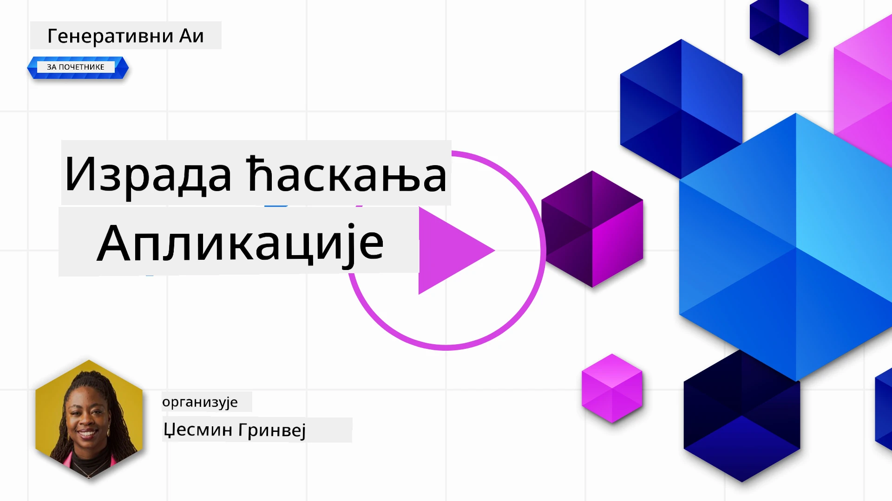
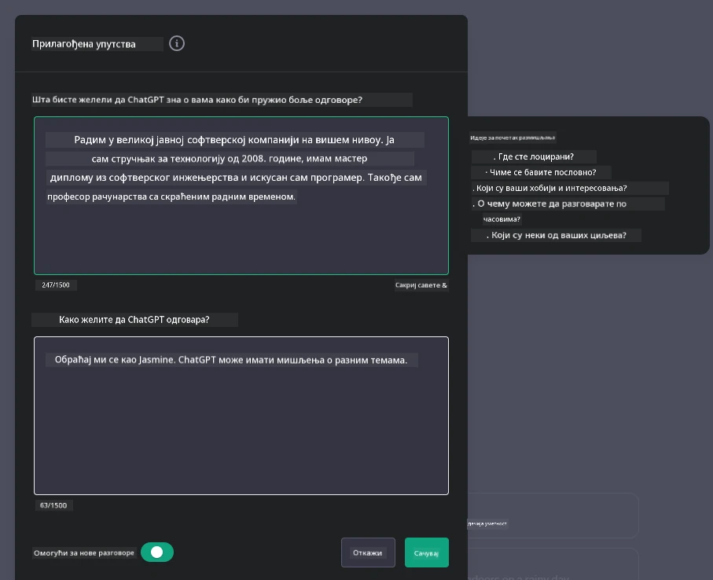
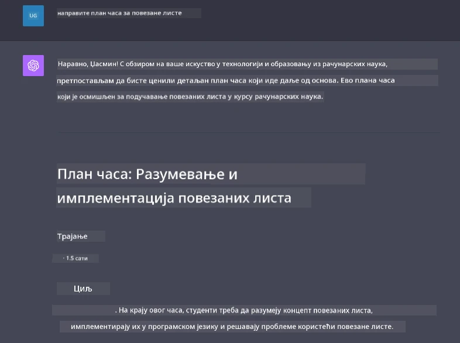

# Израда ћаскања покретаног генеративном вештачком интелигенцијом

[](https://youtu.be/R9V0ZY1BEQo?si=IHuU-fS9YWT8s4sA)

> _(Кликните на горњу слику да бисте погледали видео овог часа)_

Сада када смо видели како можемо градити апликације за генерисање текста, погледајмо апликације за ћаскање.

Апликације за ћаскање постале су интегрисане у наше свакодневне животе, нудећи више од само начина за неформалне разговоре. One су саставни део корисничке подршке, техничке подршке и чак софистицираних саветодавних система. Вероватно сте недавно добили помоћ од неке апликације за ћаскање. Како интегришемо напредније технологије као што је генеративна вештачка интелигенција у ове платформе, сложеност се повећава, као и изазови.

Нека питања на која треба да добијемо одговоре су:

- **Изградња апликације**. Како ефикасно изградити и беспрекорно интегрисати ове апликације покретане AI-јем за специфичне случајеве употребе?
- **Праћење**. Једном кад су распоређене, како можемо пратити и осигурати да апликације раде на највишем нивоу квалитета, како у функционалности, тако и у складу са [шест принципа одговорне вештачке интелигенције](https://www.microsoft.com/ai/responsible-ai?WT.mc_id=academic-105485-koreyst)?

Док се крећемо даље у доба дефинисано аутоматизацијом и беспрекорним интеракцијама човек-машина, разумевање како генеративна AI трансформише обим, дубину и прилагодљивост апликација за ћаскање постаје кључно. Овај час ће испитати аспекте архитектуре који подржавају ове сложене системе, продубити методологије за њихово фино подешавање за задатке одређене области и оцењивати метрике и разматрања важна за одговорно коришћење AI технологије.

## Увод

Овај час обухвата:

- Технике за ефикасно прављење и интеграцију апликација за ћаскање.
- Како применити прилагођавање и фино подешавање апликација.
- Стратегије и разматрања за ефикасно праћење апликација за ћаскање.

## Циљеви учења

До краја овог часа, моћи ћете да:

- Опишете разматрања приликом прављења и интеграције апликација за ћаскање у постојеће системе.
- Прилагодите апликације за ћаскање за специфичне случајеве употребе.
- Идентификујете кључне метрике и разматрања за ефикасно праћење и одржавање квалитета AI-покретаних апликација за ћаскање.
- Осигурате да апликације за ћаскање одговорно користе вештачку интелигенцију.

## Интеграција генеративне вештачке интелигенције у апликације за ћаскање

Подизање апликација за ћаскање кроз генеративну AI није само у томе да их учинимо паметнијим; ради се о оптимизацији њихове архитектуре, перформанси и корисничког интерфејса како би се пружило квалитетно корисничко искуство. Ово укључује истраживање архитектонских темеља, интеграција API-ја и аспеката корисничког интерфејса. Овај део има за циљ да вам понуди свеобухватну мапу пута за сналажење у овим сложеним областима, било да их прикључујете на постојеће системе или градите као самосталне платформе.

До краја овог дела, бићете опремљени експертизом потребном за ефикасну изградњу и интеграцију апликација за ћаскање.

### Чатбот или апликација за ћаскање?

Пре него што се упустимо у прављење апликација за ћаскање, упоредимо 'чатботове' и 'апликације за ћаскање покретане AI-јем,' које служе различитим улогама и функцијама. Главна сврха чатбота је аутоматизација специфичних разговoраних задатака, као што је одговарање на често постављана питања или праћење пошиљке. Обично се руководи логиком заснованом на правилима или сложеним AI алгоритмима. Насупрот томе, апликација за ћаскање покретана генеративном AI је много шире окружење дизајнирано да омогући разне облике дигиталне комуникације, као што су текстуални, гласовни и видео ћаскања између људских корисника. Њена дефинишућа карактеристика је интеграција генеративног AI модела који симулира нијансиране, човеку сличне разговоре, генеришући одговоре на основу широког спектра улаза и контекстуалних сигнала. Апликација за ћаскање покретана генеративним AI може водити дискусије отвореног домена, прилагодити се развоју конверзацијских контекста и чак произвести креативан или сложен дијалог.

Табела испод истиче кључне разлике и сличности како бисмо разумели њихове јединствене улоге у дигиталној комуникацији.

| Чатбот                               | Апликација за ћаскање покретана генеративном AI-јем |
| ------------------------------------- | -------------------------------------- |
| Задаци фокусирани и засновани на правилима           | Свесна контекста                          |
| Често интегрисана у веће системе  | Може угостити један или више чатботова      |
| Ограничена на програмиране функције       | Укључује генеративне AI моделе      |
| Специјализоване и структуиране интеракције | Способна за дискусије отвореног домена     |

### Коришћење унапред изграђених функционалности уз SDK-ове и API-је

Када правите апликацију за ћаскање, добар први корак је да процените шта је већ доступно. Коришћење SDK-ова и API-ја за израду апликација за ћаскање је повољна стратегија из више разлога. Интегришући добро документоване SDK-ове и API-је, стратешки припремате своју апликацију за дугорочни успех, решавајући питања скалабилности и одржавања.

- **Убрзава процес развоја и смањује трошкове**: Ослањање на унапред изграђене функционалности уместо драгоценог процеса прављења истих омогућава вам да се фокусирате на друге аспекте апликације који су вам можда битнији, као што је бизнис логика.
- **Боље перформансе**: Када правите функционалност од нуле, на крају ћете се запитати "Како се ово скалира? Да ли ова апликација може да поднесе нагли пораст корисника?" Добро одржавани SDK-ови и API-ји често имају уграђена решења за ова питања.
- **Лакше одржавање**: Ажурирања и побољшања су лакша за управљање јер већина API-ја и SDK-ова једноставно захтева ажурирање библиотеке када се објави новија верзија.
- **Приступ најсавременијој технологији**: Коришћење модела који су фино подешени и обучени на опсежним скупова података пружа вашој апликацији могућности природног језика.

Приступ функционалности SDK-а или API-ја обично подразумева добијање дозволе за коришћење пружених услуга, што је често путем јединственог кључа или аутентификационог токена. Користићемо OpenAI Python библиотеку да истражимо како то изгледа. Такође можете пробати сами у следећем [Notebook-у за OpenAI](./python/oai-assignment.ipynb?WT.mc_id=academic-105485-koreyst) или [Notebook-у за Azure OpenAI Services](./python/aoai-assignment.ipynb?WT.mc_id=academic-105485-koreys) за овај час.

```python
import os
from openai import OpenAI

API_KEY = os.getenv("OPENAI_API_KEY","")

client = OpenAI(
    api_key=API_KEY
    )

chat_completion = client.chat.completions.create(model="gpt-3.5-turbo", messages=[{"role": "user", "content": "Suggest two titles for an instructional lesson on chat applications for generative AI."}])
```

Горњи пример користи GPT-3.5 Turbo модел за завршетак упита, али приметите да је API кључ постављен пре тога. Добићете грешку ако не поставите кључ.

## Корисничко искуство (UX)

Општи UX принципи важe за апликације за ћаскање, али ево неких додатних разматрања која постају посебно важна због компоненти машинског учења.

- **Механизам за решавање нејасноћа**: Генеративни AI модели понекад генеришу неодређене одговоре. Карактеристика која омогућава корисницима да затраже појашњење може бити корисна ако наиђу на овај проблем.
- **Чување контекста**: Напредни генеративни AI модели имају способност да памте контекст током разговора, што може бити неопходно за корисничко искуство. Давањем корисницима могућности да контролишу и управљају контекстом побољшава корисничко искуство, али уводи ризик чувања осетљивих корисничких података. Разматрања како дуго се ова информација чува, као што је увођење политике задржавања, могу уравнотежити потребу за контекстом и приватношћу.
- **Персонализација**: Са способношћу учења и прилагођавања, AI модели нуде индивидуализовано искуство за корисника. Прилагођавање корисничког искуства кроз функције као што су кориснички профили не само да кориснику пружа осећај да је разумљен, већ помаже и у бржем проналажењу специфичних одговора, стварајући ефикаснију и задовољавајућу интеракцију.

Један такав пример персонализације су „Прилагођена упутства“ у OpenAI-јевом ChatGPT-у. Она вам омогућава да пружите информације о себи које могу бити важан контекст за ваше упите. Ево примера прилагођеног упутства.



Овај „профил“ подстиче ChatGPT да креира план часа о ланцима. Приметите да ChatGPT узима у обзир да корисник можда жели детаљнији план часа на основу свог искуства.



### Microsoft-ов системски оквир порука за велике језичке моделе

[Microsoft је пружио смернице](https://learn.microsoft.com/azure/ai-services/openai/concepts/system-message#define-the-models-output-format?WT.mc_id=academic-105485-koreyst) за писање ефикасних системских порука приликом генерисања одговора из LLM-ова подељених у 4 области:

1. Дефинисање за кога је модел, као и његових могућности и ограничења.
2. Дефинисање формата излаза модела.
3. Пружање специфичних примера који демонстрирају намеравано понашање модела.
4. Пружање додатних понашајних ограничења.

### Приступачност

Без обзира да ли корисник има визуелне, слухове, моторне или когнитивне сметње, добро дизајнирана апликација за ћаскање треба да буде употребљива за све. Следећа листа раздваја специфичне функције усмерене на побољшање приступачности за различите врсте корисничких сметњи.

- **Функције за визуелне сметње**: Теме са високим контрастом и могућност промене величине текста, компатибилност са читачима екрана.
- **Функције за слух**: Функције претварања текста у говор и говора у текст, визуелни сигнали за аудио обавештења.
- **Функције за моторне сметње**: Подршка за навигацију тастатуром, гласовне команде.
- **Функције за когнитивне сметње**: Опције поједностављеног језика.

## Прилагођавање и фино подешавање језичких модела специфичних за домен

Замислите апликацију за ћаскање која разуме жаргон ваше компаније и предвиђа специфична питања која корисници најчешће имају. Постоје два приступа која вреди поменути:

- **Коришћење DSL модела**. DSL означава доменски специфичан језик. Можете користити тзв. DSL модел трениран у одређеном домену да разуме његове концепте и сценарије.
- **Примена фино подешавања**. Фино подешавање је процес додатне обуке вашег модела са специфичним подацима.

## Прилагођавање: Коришћење DSL-а

Коришћење доменски специфичних језичких модела (DSL модела) може повећати ангажовање корисника пружајући специјализоване, контекстуално релевантне интеракције. То је модел који је обучен или фино подешен да разуме и генерише текст везан за одређену област, индустрију или тему. Опције за коришћење DSL модела могу варирати од обуке од нуле до коришћења постојећих преко SDK-ова и API-ја. Друга опција је фино подешавање, што подразумева преузимање постојећег претходно обученог модела и његова адаптација за специфичан домен.

## Прилагођавање: Примена фино подешавања

Фино подешавање се често разматра када претходно обучени модел не задовољава потребе специјализованог домена или специфичног задатка.

На пример, медицинска питања су комплексна и захтевају пуно контекста. Када медицински стручњак постави дијагнозу, то се заснива на више фактора као што су начин живота или претходна здравствена стања, и можда ће се ослањати и на актуелне медицинске часописе да потврди своју дијагнозу. У тако сложеним сценаријима, општа AI апликација за ћаскање не може бити поуздан извор.

### Сценарио: медицинска апликација

Размотрите апликацију за ћаскање дизајнирану да помаже медицинским стручњацима пружајући брзе референце о смерницама лечења, интеракцијама лекова или најновијим научним открићима.

Општи модел може бити довољан за одговарање на основна медицинска питања или пружање општих савета, али би могао имати проблема са следећим:

- **Веома специфични или сложени случајеви**. На пример, неуролог може питати апликацију: "Које су тренутне најбоље праксе за управљање резистентном епилепсијом код педијатријских пацијената?"
- **Недостатак најновијих напредака**. Општи модел може имати проблема да пружи актуелан одговор који укључује најсвежија достигнућа у неурологији и фармакологији.

У оваквим случајевима, фино подешавање модела уз специјализован скуп медицинских података може значајно побољшати његову способност да прецизније и поузданије рукује овим сложеним медицинским упитима. За то је потребан приступ великом и релевантном скупу података који представља изазове и питања специфична за тај домен.

## Разматрања за квалитетно искуство ћаскања покретаног AI-јем

Овај одељак наводи критеријуме за „висококвалитетне“ апликације за ћаскање, који укључују праћење корисних метрика и придржавање оквира који одговорно користи AI технологију.

### Кључне метрике

Да би апликација одржала високе перформансе, неопходно је пратити кључне метрике и разматрања. Ове мере не само да осигуравају функционалност апликације већ и процењују квалитет AI модела и корисничког искуства. Испод је листа која покрива основне метрике, AI и метрике корисничког искуства које треба узети у обзир.

| Метрика                      | Дефиниција                                                                                                             | Разматрања за програмера апликације за ћаскање                                        |
| ----------------------------- | ---------------------------------------------------------------------------------------------------------------------- | ------------------------------------------------------------------------------------- |
| **Време рада (Uptime)**                    | Мери време током ког је апликација оперативна и доступна корисницима.                                              | Како ћете минимизирати време када апликација није доступна?                   |
| **Време одговора**             | Време које апликација троши да одговори на кориснички упит.                                                          | Како можете оптимизовати обраду упита да убрзате време одговора?                   |
| **Прецизност**                 | Однос између тачно позитивних предвиђања и укупног броја позитивних предвиђања                                     | Како ћете верификовати прецизност вашег модела?                        |
| **Покривеност (Recall / Осетљивост)**      | Однос броја тачно позитивних предвиђања и стварног броја позитивних случајева                                                | Како ћете мерити и побољшати покривеност?                                  |
| **F1 резултат**                  | Хармонична средина прецизности и покривености, која балансира трговину између обе метрике.                                  | Који је ваш циљани F1 резултат? Како ћете уравнотежити прецизност и покривеност?  |
| **Перплексија**                | Мери колико добро вероватноћа коју модел прогнозира одговара стварној дистрибуцији података. | Како ћете минимизирати перплексију?                                         |
| **Метрике задовољства корисника** | Мери перцепцију корисника о апликацији. Често се прикупља кроз анкете.                                     | Колико често ћете прикупљати повратне информације од корисника? Како ћете се прилагодити на основу тога? |
| **Стопа грешака**                | Стопа којом модел греши у разумевању или излазу.                                                 | Које стратегије имате за смањење стопе грешака?               |
| **Циклуси поновног тренирања**         | Учесталост са којом се модел ажурира да укључи нове податке и увиде.                                    | Колико често ћете поново тренирати модел? Шта покреће циклус поновног тренирања?   |
| **Откривање аномалија**         | Алати и технике за идентификовање необичних образаца који се не уклапају у очекивано понашање.                        | Како ћете реаговати на аномалије?                                        |

### Имплементација одговорних AI пракси у чет апликацијама

Приступ Microsoft-а одговорном AI препознаје шест принципа који треба да воде развој и коришћење AI. Испод су принципи, њихове дефиниције и ствари које програмер чет апликација треба да узме у обзир и зашто их треба озбиљно схватити.

| Принципи               | Дефиниција Microsoft-а                                | Разматрања за програмера чет апликација                              | Зашто је важно                                                                |
| ---------------------- | ----------------------------------------------------- | -------------------------------------------------------------------- | --------------------------------------------------------------------------- |
| Праведност             | AI системи требају све људе третирати праведно.      | Осигурати да чет апликација не дискриминише на основу корисничких података.  | За изградњу поверења и инклузивности међу корисницима; избегава правне последице.                |
| Поузданост и безбедност | AI системи требају радити поуздано и безбедно.       | Имплементирати тестирање и механизме отказа да би се смањиле грешке и ризици.        | Осигурава задовољство корисника и спречава потенцијалну штету.                                 |
| Приватност и безбедност | AI системи требају бити сигурни и поштовати приватност.      | Имплементирати јаку енкрипцију и мере заштите података.              | Заштита осетљивих корисничких података и усаглашеност са законима о приватности.                         |
| Инклузивност           | AI системи требају оснажити све и укључити људе.     | Дизајнирати кориснички интерфејс који је приступачан и једноставан за коришћење разноликим публицима. | Осигурава да широј групи људи буде омогућено ефикасно коришћење апликације.                   |
| Транспарентност        | AI системи требају бити разумљиви.                    | Обезбедити јасну документацију и образложења за AI одговоре.          | Корисници су склонији да верују систему ако разумеју како се доносе одлуке. |
| Одговорност            | Људи требају бити одговорни за AI системе.            | Успоставити јасан процес ревизије и унапређења AI одлука.             | Омогућава континуирано унапређење и корективне мере у случају грешака.               |

## Задатак

Погледајте [assignment](../../../07-building-chat-applications/python). Прошао ће вас кроз серију вежби од покретања првих чет упита, класификовања и сумирања текста и још много тога. Обратите пажњу да су задаци доступни на различитим програмским језицима!

## Одличан посао! Наставите путовање

Након што завршите ову лекцију, погледајте нашу [Generative AI Learning collection](https://aka.ms/genai-collection?WT.mc_id=academic-105485-koreyst) да бисте наставили да унапређујете своје знање о генеративном AI!

Пребаците се на Лекцију 8 да видите како можете почети [правити претраживачке апликације](../08-building-search-applications/README.md?WT.mc_id=academic-105485-koreyst)!

---

<!-- CO-OP TRANSLATOR DISCLAIMER START -->
**Изјава о одрицању одговорности**:
Овај документ је преведен коришћењем услуге за аутоматски превод [Co-op Translator](https://github.com/Azure/co-op-translator). Иако тежимо тачности, имајте у виду да аутоматски преводи могу садржати грешке или нетачности. Оригинални документ на његовом изворном језику треба сматрати ауторитативним извором. За критичне информације препоручује се професионални људски превод. Нисмо одговорни за било каква неспоразума или погрешна тумачења која произилазе из коришћења овог превода.
<!-- CO-OP TRANSLATOR DISCLAIMER END -->