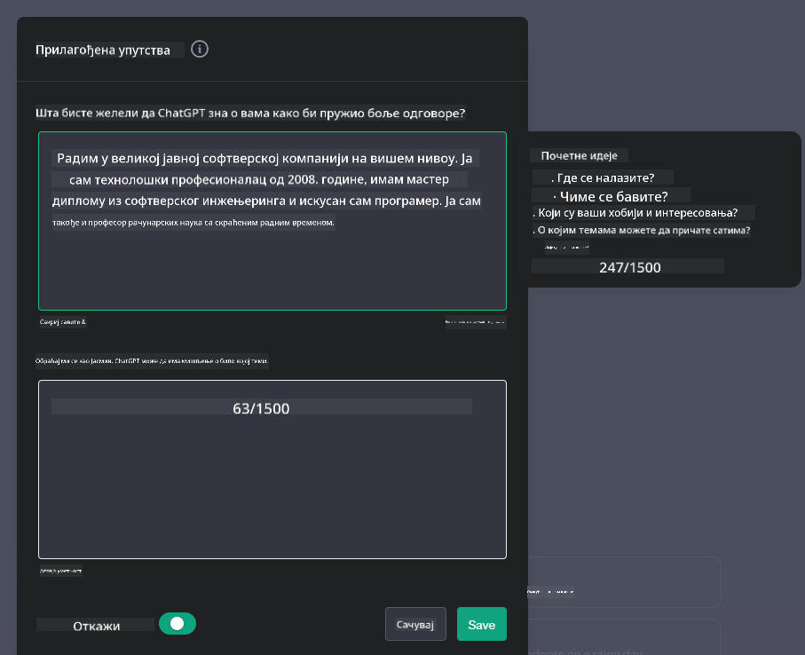
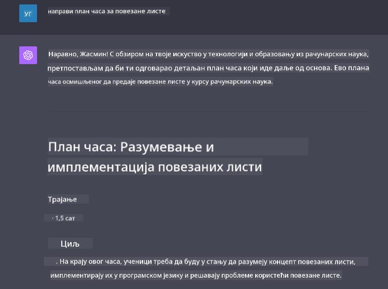

<!--
CO_OP_TRANSLATOR_METADATA:
{
  "original_hash": "a5308963a56cfbad2d73b0fa99fe84b3",
  "translation_date": "2025-10-18T01:23:47+00:00",
  "source_file": "07-building-chat-applications/README.md",
  "language_code": "sr"
}
-->
# Изградња апликација за ћаскање заснованих на генеративној вештачкој интелигенцији

[](https://youtu.be/R9V0ZY1BEQo?si=IHuU-fS9YWT8s4sA)

> _(Кликните на слику изнад да бисте погледали видео лекције)_

Сада када смо видели како можемо да изградимо апликације за генерисање текста, погледајмо апликације за ћаскање.

Апликације за ћаскање постале су интегрисани део наших свакодневних живота, нудећи више од обичног начина за неформалну комуникацију. Оне су суштински део корисничке подршке, техничке помоћи, па чак и софистицираних саветодавних система. Вероватно сте недавно добили помоћ од неке апликације за ћаскање. Како интегришемо напредне технологије попут генеративне вештачке интелигенције у ове платформе, сложеност расте, а са њом и изазови.

Нека од питања на која треба да одговоримо су:

- **Изградња апликације**. Како ефикасно изградити и беспрекорно интегрисати ове апликације засноване на вештачкој интелигенцији за одређене намене?
- **Праћење**. Када се апликације имплементирају, како можемо да пратимо и осигурамо да раде на највишем нивоу квалитета, како у смислу функционалности, тако и у складу са [шест принципа одговорне вештачке интелигенције](https://www.microsoft.com/ai/responsible-ai?WT.mc_id=academic-105485-koreyst)?

Како се све више крећемо ка ери коју дефинише аутоматизација и беспрекорна интеракција између људи и машина, разумевање како генеративна вештачка интелигенција трансформише обим, дубину и прилагодљивост апликација за ћаскање постаје суштински важно. Ова лекција ће истражити аспекте архитектуре који подржавају ове сложене системе, размотрити методологије за њихово прилагођавање специфичним задацима и проценити метрике и разматрања релевантна за осигурање одговорне примене вештачке интелигенције.

## Увод

Ова лекција обухвата:

- Технике за ефикасну изградњу и интеграцију апликација за ћаскање.
- Како применити прилагођавање и фино подешавање апликација.
- Стратегије и разматрања за ефикасно праћење апликација за ћаскање.

## Циљеви учења

На крају ове лекције, моћи ћете да:

- Описујете разматрања за изградњу и интеграцију апликација за ћаскање у постојеће системе.
- Прилагодите апликације за ћаскање специфичним наменама.
- Идентификујете кључне метрике и разматрања за ефикасно праћење и одржавање квалитета апликација за ћаскање заснованих на вештачкој интелигенцији.
- Осигурате да апликације за ћаскање одговорно користе вештачку интелигенцију.

## Интеграција генеративне вештачке интелигенције у апликације за ћаскање

Унапређење апликација за ћаскање кроз генеративну вештачку интелигенцију није само усмерено на њихово интелигентније функционисање; ради се о оптимизацији њихове архитектуре, перформанси и корисничког интерфејса како би се пружило квалитетно корисничко искуство. Ово укључује истраживање архитектонских основа, интеграцију API-ја и разматрања корисничког интерфејса. Овај одељак има за циљ да вам понуди свеобухватан план за сналажење у овим сложеним областима, било да их интегришете у постојеће системе или их градите као самосталне платформе.

На крају овог одељка, бићете опремљени знањем потребним за ефикасну изградњу и интеграцију апликација за ћаскање.

### Четбот или апликација за ћаскање?

Пре него што се упустимо у изградњу апликација за ћаскање, упоредимо „четботове“ са „апликацијама за ћаскање заснованим на вештачкој интелигенцији“, које имају различите улоге и функционалности. Главна сврха четбота је аутоматизација одређених задатака у комуникацији, као што је одговарање на често постављана питања или праћење пакета. Обично се заснива на логичким правилима или сложеним алгоритмима вештачке интелигенције. Насупрот томе, апликација за ћаскање заснована на вештачкој интелигенцији је много шира платформа дизајнирана да омогући различите облике дигиталне комуникације, као што су текстуални, гласовни и видео разговори међу људским корисницима. Њена карактеристика је интеграција генеративног модела вештачке интелигенције који симулира нијансиране, људске разговоре, генеришући одговоре на основу широког спектра уноса и контекстуалних знакова. Апликација за ћаскање заснована на генеративној вештачкој интелигенцији може учествовати у дискусијама отвореног типа, прилагођавати се развоју контекста разговора, па чак и производити креативне или сложене дијалоге.

Табела испод приказује кључне разлике и сличности како бисмо боље разумели њихове јединствене улоге у дигиталној комуникацији.

| Четбот                              | Апликација за ћаскање заснована на генеративној вештачкој интелигенцији |
| ----------------------------------- | -------------------------------------- |
| Фокусирана на задатке и заснована на правилима | Свесна контекста                          |
| Често интегрисана у веће системе    | Може да хостује један или више четботова |
| Ограничена на програмиране функције | Интегрише моделе генеративне вештачке интелигенције |
| Специјализоване и структуриране интеракције | Способна за дискусије отвореног типа     |

### Коришћење унапред припремљених функционалности са SDK-овима и API-јима

Када градите апликацију за ћаскање, добар први корак је процена онога што је већ доступно. Коришћење SDK-ова и API-ја за изградњу апликација за ћаскање је корисна стратегија из више разлога. Интеграцијом добро документованих SDK-ова и API-ја, стратешки позиционирате своју апликацију за дугорочни успех, решавајући проблеме скалабилности и одржавања.

- **Убрзава процес развоја и смањује трошкове**: Ослањање на унапред припремљене функционалности уместо на скуп процес њиховог самосталног развоја омогућава вам да се фокусирате на друге аспекте ваше апликације који су можда важнији, као што је пословна логика.
- **Боље перформансе**: Када градите функционалност од нуле, на крају ћете се запитати „Како ће се скалирати? Да ли је ова апликација способна да обради изненадни прилив корисника?“ Добро одржавани SDK-ови и API-ји често имају уграђена решења за ове проблеме.
- **Лакше одржавање**: Ажурирања и побољшања су лакша за управљање јер већина API-ја и SDK-ова захтева само ажурирање библиотеке када се објави нова верзија.
- **Приступ најсавременијој технологији**: Коришћење модела који су фино подешени и обучени на обимним скуповима података пружа вашој апликацији могућности обраде природног језика.

Приступ функционалностима SDK-а или API-ја обично подразумева добијање дозволе за коришћење пружених услуга, што се често ради путем јединственог кључа или токена за аутентификацију. Користићемо OpenAI Python Library да истражимо како то изгледа. Можете и сами испробати у следећем [ноутбуку за OpenAI](./python/oai-assignment.ipynb?WT.mc_id=academic-105485-koreyst) или [ноутбуку за Azure OpenAI Services](./python/aoai-assignment.ipynb?WT.mc_id=academic-105485-koreys) за ову лекцију.

```python
import os
from openai import OpenAI

API_KEY = os.getenv("OPENAI_API_KEY","")

client = OpenAI(
    api_key=API_KEY
    )

chat_completion = client.chat.completions.create(model="gpt-3.5-turbo", messages=[{"role": "user", "content": "Suggest two titles for an instructional lesson on chat applications for generative AI."}])
```

Горњи пример користи GPT-3.5 Turbo модел за комплетирање упита, али приметите да је API кључ постављен пре него што се то уради. Добићете грешку ако не поставите кључ.

## Корисничко искуство (UX)

Општи принципи UX-а примењују се на апликације за ћаскање, али овде су нека додатна разматрања која постају посебно важна због компоненти машинског учења.

- **Механизам за решавање нејасноћа**: Модели генеративне вештачке интелигенције понекад генеришу нејасне одговоре. Функција која омогућава корисницима да затраже појашњење може бити корисна ако наиђу на овај проблем.
- **Задржавање контекста**: Напредни модели генеративне вештачке интелигенције имају способност да памте контекст унутар разговора, што може бити неопходна предност за корисничко искуство. Омогућавање корисницима да контролишу и управљају контекстом побољшава корисничко искуство, али уводи ризик од задржавања осетљивих информација о кориснику. Разматрања о томе колико дуго се ове информације чувају, као што је увођење политике задржавања, могу уравнотежити потребу за контекстом са приватношћу.
- **Персонализација**: Са способношћу учења и прилагођавања, AI модели нуде индивидуализовано искуство за корисника. Прилагођавање корисничког искуства кроз функције као што су кориснички профили не само да чини да се корисник осећа разумеваним, већ му и помаже у потрази за специфичним одговорима, стварајући ефикаснију и задовољавајућу интеракцију.

Један такав пример персонализације је подешавање „Прилагођена упутства“ у OpenAI-овом ChatGPT-у. Омогућава вам да пружите информације о себи које могу бити важан контекст за ваше упите. Ево примера прилагођеног упутства.



Овај „профил“ подстиче ChatGPT да креира план лекције о повезаним листама. Приметите да ChatGPT узима у обзир да корисник можда жели детаљнији план лекције на основу њеног искуства.



### Microsoft-ов оквир за системске поруке за моделе великог језика

[Microsoft је пружио смернице](https://learn.microsoft.com/azure/ai-services/openai/concepts/system-message#define-the-models-output-format?WT.mc_id=academic-105485-koreyst) за писање ефикасних системских порука приликом генерисања одговора од LLM-ова, подељене у 4 области:

1. Дефинисање за кога је модел намењен, као и његових могућности и ограничења.
2. Дефинисање формата излаза модела.
3. Пружање конкретних примера који демонстрирају жељено понашање модела.
4. Пружање додатних смерница за понашање.

### Приступачност

Без обзира на то да ли корисник има оштећење вида, слуха, моторике или когнитивних способности, добро дизајнирана апликација за ћаскање треба да буде употребљива за све. Следећа листа разлаже специфичне функције усмерене на побољшање приступачности за различите корисничке потребе.

- **Функције за оштећење вида**: Темe са високим контрастом и текст који се може повећати, компатибилност са читачима екрана.
- **Функције за оштећење слуха**: Функције претварања текста у говор и говора у текст, визуелни знаци за аудио обавештења.
- **Функције за оштећење моторике**: Подршка за навигацију помоћу тастатуре, гласовне команде.
- **Функције за когнитивно оштећење**: Опције за поједностављен језик.

## Прилагођавање и фино подешавање за језичке моделе специфичне за домен

Замислите апликацију за ћаскање која разуме жаргон ваше компаније и предвиђа специфичне упите које њена корисничка база обично има. Постоји неколико приступа који вреде помена:

- **Коришћење DSL модела**. DSL означава језик специфичан за домен. Можете користити такозвани DSL модел обучен за одређени домен да би разумео његове концепте и сценарије.
- **Примена фино подешавање**. Фино подешавање је процес даљег обучавања вашег модела са специфичним подацима.

## Прилагођавање: Коришћење DSL-а

Коришћење модела језика специфичних за домен (DSL модели) може побољшати ангажовање корисника пружањем специјализованих, контекстуално релевантних интеракција. То је модел који је обучен или фино подешен да разуме и генерише текст који се односи на одређено поље, индустрију или тему. Опције за коришћење DSL модела могу варирати од обуке једног од нуле, до коришћења већ постојећих модела преко SDK-ова и API-ја. Друга опција је фино подешавање, које подразумева узимање постојећег унапред обученог модела и његово прилагођавање за одређени домен.

## Прилагођавање: Примена фино подешавања

Фино подешавање се често разматра када унапред обучени модел не испуњава очекивања у специјализованом домену или специфичном задатку.

На пример, медицински упити су сложени и захтевају много контекста. Када медицински професионалац дијагностикује пацијента, то се заснива на различитим факторима као што су начин живота или постојећи здравствени проблеми, а може се ослонити и на недавне медицинске часописе како би потврдио своју дијагнозу. У таквим нијанси
| **Откривање аномалија**       | Алати и технике за идентификацију необичних образаца који се не уклапају у очекивано понашање.                        | Како ћете реаговати на аномалије?                                        |

### Примена одговорних пракси вештачке интелигенције у апликацијама за чет

Приступ компаније Microsoft одговорној вештачкој интелигенцији идентификовао је шест принципа који треба да воде развој и употребу вештачке интелигенције. Испод су наведени принципи, њихова дефиниција, као и ствари које би програмери чет апликација требало да узму у обзир и разлози зашто их треба озбиљно схватити.

| Принципи               | Дефиниција компаније Microsoft                        | Разматрања за програмера чет апликације                                | Зашто је важно                                                                      |
| ---------------------- | ----------------------------------------------------- | ---------------------------------------------------------------------- | ----------------------------------------------------------------------------------- |
| Праведност             | Системи вештачке интелигенције треба да третирају све људе праведно. | Осигурајте да апликација за чет не дискриминише на основу корисничких података. | Да би се изградило поверење и инклузивност међу корисницима; избегава правне последице. |
| Поузданост и безбедност| Системи вештачке интелигенције треба да раде поуздано и безбедно. | Примените тестирање и сигурносне механизме како бисте минимизирали грешке и ризике. | Осигурава задовољство корисника и спречава потенцијалну штету.                      |
| Приватност и сигурност | Системи вештачке интелигенције треба да буду сигурни и да поштују приватност. | Примените јаку енкрипцију и мере заштите података.                     | Да би се заштитили осетљиви кориснички подаци и испоштовали закони о приватности.    |
| Инклузивност           | Системи вештачке интелигенције треба да оснажују све и укључују људе. | Дизајнирајте кориснички интерфејс који је приступачан и једноставан за употребу за различите публике. | Осигурава да шири спектар људи може ефикасно користити апликацију.                  |
| Транспарентност        | Системи вештачке интелигенције треба да буду разумљиви. | Обезбедите јасну документацију и објашњења за одговоре вештачке интелигенције. | Корисници ће вероватније веровати систему ако могу да разумеју како се доносе одлуке. |
| Одговорност            | Људи треба да буду одговорни за системе вештачке интелигенције. | Успоставите јасан процес за ревизију и побољшање одлука вештачке интелигенције. | Омогућава континуирано унапређење и корективне мере у случају грешака.              |

## Задатак

Погледајте [задатак](../../../07-building-chat-applications/python). Проћи ћете кроз серију вежби од покретања ваших првих чет упита, до класификације и сумирања текста и још много тога. Обратите пажњу да су задаци доступни на различитим програмским језицима!

## Одличан рад! Наставите путовање

Након завршетка ове лекције, погледајте нашу [колекцију за учење о генеративној вештачкој интелигенцији](https://aka.ms/genai-collection?WT.mc_id=academic-105485-koreyst) како бисте наставили да унапређујете своје знање о генеративној вештачкој интелигенцији!

Прелазите на Лекцију 8 да видите како можете започети [изградњу апликација за претрагу](../08-building-search-applications/README.md?WT.mc_id=academic-105485-koreyst)!

---

**Одрицање од одговорности**:  
Овај документ је преведен коришћењем услуге за превођење помоћу вештачке интелигенције [Co-op Translator](https://github.com/Azure/co-op-translator). Иако настојимо да обезбедимо тачност, молимо вас да имате у виду да аутоматски преводи могу садржати грешке или нетачности. Оригинални документ на његовом изворном језику треба сматрати ауторитативним извором. За критичне информације препоручује се професионални превод од стране људи. Не преузимамо одговорност за било каква погрешна тумачења или неспоразуме који могу настати услед коришћења овог превода.