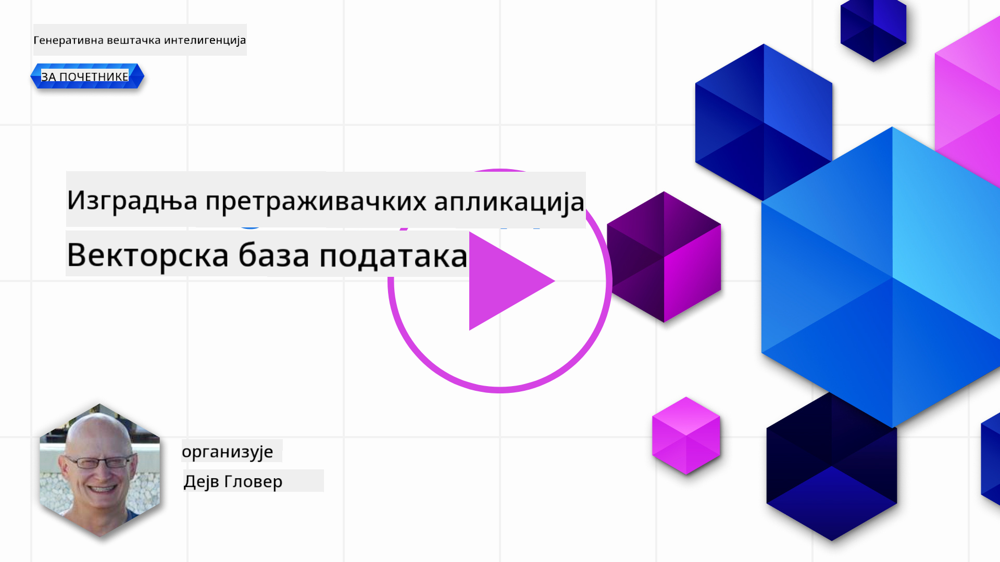
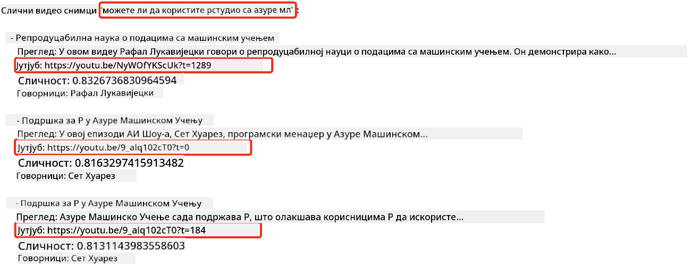

<!--
CO_OP_TRANSLATOR_METADATA:
{
  "original_hash": "d46aad0917a1a342d613e2c13d457da5",
  "translation_date": "2025-05-19T18:44:05+00:00",
  "source_file": "08-building-search-applications/README.md",
  "language_code": "sr"
}
-->
# Izgradnja aplikacija za pretragu

[](https://aka.ms/gen-ai-lesson8-gh?WT.mc_id=academic-105485-koreyst)

> > _Kliknite na sliku iznad da pogledate video ovog lekcije_

LLM-ovi su više od samo chatbota i generisanja teksta. Takođe je moguće izgraditi aplikacije za pretragu koristeći Ugrađivanja. Ugrađivanja su numerički prikazi podataka poznati i kao vektori, i mogu se koristiti za semantičku pretragu podataka.

U ovoj lekciji, izgradićete aplikaciju za pretragu za našu edukativnu startup organizaciju. Naša organizacija je neprofitna organizacija koja pruža besplatno obrazovanje studentima u zemljama u razvoju. Naša organizacija ima veliki broj YouTube videa koje studenti mogu koristiti za učenje o AI. Naša organizacija želi da izgradi aplikaciju za pretragu koja omogućava studentima da pretražuju YouTube video tako što će uneti pitanje.

Na primer, student može uneti 'Šta su Jupyter Notebooks?' ili 'Šta je Azure ML' i aplikacija za pretragu će vratiti listu YouTube videa koji su relevantni za pitanje, i još bolje, aplikacija za pretragu će vratiti link do mesta u videu gde se nalazi odgovor na pitanje.

## Uvod

U ovoj lekciji, pokrićemo:

- Semantička vs pretraga po ključnim rečima.
- Šta su tekstualna ugrađivanja.
- Kreiranje indeksa tekstualnih ugrađivanja.
- Pretraga indeksa tekstualnih ugrađivanja.

## Ciljevi učenja

Nakon završetka ove lekcije, bićete u mogućnosti da:

- Razlikujete semantičku pretragu od pretrage po ključnim rečima.
- Objasnite šta su tekstualna ugrađivanja.
- Kreirate aplikaciju koristeći ugrađivanja za pretragu podataka.

## Zašto izgraditi aplikaciju za pretragu?

Kreiranje aplikacije za pretragu će vam pomoći da razumete kako koristiti ugrađivanja za pretragu podataka. Takođe ćete naučiti kako izgraditi aplikaciju za pretragu koju studenti mogu koristiti za brzo pronalaženje informacija.

Lekcija uključuje Indeks Ugrađivanja YouTube transkripata za Microsoft [AI Show](https://www.youtube.com/playlist?list=PLlrxD0HtieHi0mwteKBOfEeOYf0LJU4O1) YouTube kanal. AI Show je YouTube kanal koji vas uči o AI i mašinskom učenju. Indeks Ugrađivanja sadrži Ugrađivanja za svaki od YouTube transkripata do oktobra 2023. Koristićete Indeks Ugrađivanja da izgradite aplikaciju za pretragu za našu organizaciju. Aplikacija za pretragu vraća link do mesta u videu gde se nalazi odgovor na pitanje. Ovo je odličan način za studente da brzo pronađu informacije koje im trebaju.

Sledeći je primer semantičkog upita za pitanje 'da li možete koristiti rstudio sa azure ml?'. Pogledajte YouTube url, videćete da url sadrži vremenski pečat koji vas vodi do mesta u videu gde se nalazi odgovor na pitanje.



## Šta je semantička pretraga?

Sada se možda pitate, šta je semantička pretraga? Semantička pretraga je tehnika pretrage koja koristi semantiku, ili značenje, reči u upitu da vrati relevantne rezultate.

Evo primera semantičke pretrage. Recimo da želite da kupite auto, mogli biste pretražiti 'moj san auto', semantička pretraga razume da ne govorite o snu o autu, već da želite da kupite svoj auto iz snova. Semantička pretraga razume vašu nameru i vraća relevantne rezultate. Alternativa je pretraga po ključnim rečima koja bi doslovno pretraživala snove o autima i često vraćala nerelevantne rezultate.

## Šta su tekstualna ugrađivanja?

[Textualna ugrađivanja](https://en.wikipedia.org/wiki/Word_embedding?WT.mc_id=academic-105485-koreyst) su tehnika prikaza teksta koja se koristi u [obradi prirodnog jezika](https://en.wikipedia.org/wiki/Natural_language_processing?WT.mc_id=academic-105485-koreyst). Tekstualna ugrađivanja su semantički numerički prikazi teksta. Ugrađivanja se koriste za prikaz podataka na način koji je lak za mašinu da razume. Postoji mnogo modela za kreiranje tekstualnih ugrađivanja, u ovoj lekciji, fokusiraćemo se na generisanje ugrađivanja koristeći OpenAI Model Ugrađivanja.

Evo primera, zamislite da je sledeći tekst u transkriptu iz jedne od epizoda na AI Show YouTube kanalu:

```text
Today we are going to learn about Azure Machine Learning.
```

Proslijedili bismo tekst OpenAI Embedding API-ju i on bi vratio sledeće ugrađivanje koje se sastoji od 1536 brojeva, odnosno vektor. Svaki broj u vektoru predstavlja različit aspekt teksta. Radi sažetosti, evo prvih 10 brojeva u vektoru.

```python
[-0.006655829958617687, 0.0026128944009542465, 0.008792596869170666, -0.02446001023054123, -0.008540431968867779, 0.022071078419685364, -0.010703742504119873, 0.003311325330287218, -0.011632772162556648, -0.02187200076878071, ...]
```

## Kako se kreira indeks ugrađivanja?

Indeks ugrađivanja za ovu lekciju je kreiran pomoću serije Python skripti. Naći ćete skripte zajedno sa uputstvima u [README](./scripts/README.md?WT.mc_id=academic-105485-koreyst) u folderu 'scripts' za ovu lekciju. Ne morate pokretati ove skripte da biste završili ovu lekciju jer je Indeks Ugrađivanja obezbeđen za vas.

Skripte obavljaju sledeće operacije:

1. Transkript za svaki YouTube video u [AI Show](https://www.youtube.com/playlist?list=PLlrxD0HtieHi0mwteKBOfEeOYf0LJU4O1) playlisti se preuzima.
2. Koristeći [OpenAI Functions](https://learn.microsoft.com/azure/ai-services/openai/how-to/function-calling?WT.mc_id=academic-105485-koreyst), pokušava se izvući ime govornika iz prvih 3 minuta YouTube transkripta. Ime govornika za svaki video se čuva u Indeksu Ugrađivanja pod nazivom `embedding_index_3m.json`.
3. Tekst transkripta se zatim deli na **3-minutne tekstualne segmente**. Segment uključuje oko 20 reči koje se preklapaju iz sledećeg segmenta kako bi se osiguralo da Ugrađivanje za segment nije prekinuto i da se obezbedi bolji kontekst pretrage.
4. Svaki tekstualni segment se zatim šalje OpenAI Chat API-ju da sažme tekst u 60 reči. Sažetak se takođe čuva u Indeksu Ugrađivanja `embedding_index_3m.json`.
5. Konačno, tekst segmenta se šalje OpenAI Embedding API-ju. Embedding API vraća vektor od 1536 brojeva koji predstavljaju semantičko značenje segmenta. Segment zajedno sa OpenAI Embedding vektorom se čuva u Indeksu Ugrađivanja `embedding_index_3m.json`.

### Vektorske baze podataka

Radi jednostavnosti lekcije, Indeks Ugrađivanja je čuvan u JSON datoteci pod nazivom `embedding_index_3m.json` i učitan u Pandas DataFrame. Međutim, u produkciji, Indeks Ugrađivanja bi bio čuvan u vektorskoj bazi podataka kao što su [Azure Cognitive Search](https://learn.microsoft.com/training/modules/improve-search-results-vector-search?WT.mc_id=academic-105485-koreyst), [Redis](https://cookbook.openai.com/examples/vector_databases/redis/readme?WT.mc_id=academic-105485-koreyst), [Pinecone](https://cookbook.openai.com/examples/vector_databases/pinecone/readme?WT.mc_id=academic-105485-koreyst), [Weaviate](https://cookbook.openai.com/examples/vector_databases/weaviate/readme?WT.mc_id=academic-105485-koreyst), da navedemo samo neke.

## Razumevanje kosinusne sličnosti

Naučili smo o tekstualnim ugrađivanjima, sledeći korak je da naučimo kako koristiti tekstualna ugrađivanja za pretragu podataka i posebno pronaći najviše slična ugrađivanja za dati upit koristeći kosinusnu sličnost.

### Šta je kosinusna sličnost?

Kosinusna sličnost je mera sličnosti između dva vektora, često ćete čuti da se to naziva `nearest neighbor search`. Da biste obavili pretragu kosinusne sličnosti, potrebno je da _vektorizujete_ tekst upita koristeći OpenAI Embedding API. Zatim izračunajte _kosinusnu sličnost_ između vektora upita i svakog vektora u Indeksu Ugrađivanja. Zapamtite, Indeks Ugrađivanja ima vektor za svaki tekstualni segment YouTube transkripta. Na kraju, sortirajte rezultate po kosinusnoj sličnosti i tekstualni segmenti sa najvišom kosinusnom sličnosti su najviše slični upitu.

Iz matematičke perspektive, kosinusna sličnost meri kosinus ugla između dva vektora projektovana u višedimenzionalnom prostoru. Ova mera je korisna, jer ako su dva dokumenta daleko po Euklidskoj distanci zbog veličine, i dalje mogu imati manji ugao između njih i stoga veću kosinusnu sličnost. Za više informacija o jednačinama kosinusne sličnosti, pogledajte [Kosinusna sličnost](https://en.wikipedia.org/wiki/Cosine_similarity?WT.mc_id=academic-105485-koreyst).

## Izgradnja vaše prve aplikacije za pretragu

Sledeće, naučićemo kako izgraditi aplikaciju za pretragu koristeći Ugrađivanja. Aplikacija za pretragu će omogućiti studentima da pretražuju video tako što će uneti pitanje. Aplikacija za pretragu će vratiti listu videa koji su relevantni za pitanje. Aplikacija za pretragu će takođe vratiti link do mesta u videu gde se nalazi odgovor na pitanje.

Ovo rešenje je izgrađeno i testirano na Windows 11, macOS, i Ubuntu 22.04 koristeći Python 3.10 ili noviji. Python možete preuzeti sa [python.org](https://www.python.org/downloads/?WT.mc_id=academic-105485-koreyst).

## Zadatak - izgradnja aplikacije za pretragu, da omogućite studentima

Predstavili smo našu startup organizaciju na početku ove lekcije. Sada je vreme da omogućite studentima da izgrade aplikaciju za pretragu za njihove zadatke.

U ovom zadatku, kreiraćete Azure OpenAI Services koje će se koristiti za izgradnju aplikacije za pretragu. Kreiraćete sledeće Azure OpenAI Services. Trebaće vam Azure pretplata da završite ovaj zadatak.

### Pokrenite Azure Cloud Shell

1. Prijavite se na [Azure portal](https://portal.azure.com/?WT.mc_id=academic-105485-koreyst).
2. Izaberite ikonu Cloud Shell u gornjem desnom uglu Azure portala.
3. Izaberite **Bash** za tip okruženja.

#### Kreirajte grupu resursa

> Za ove instrukcije, koristimo grupu resursa pod nazivom "semantic-video-search" u Istočnom SAD-u.
> Možete promeniti ime grupe resursa, ali kada menjate lokaciju za resurse,
> proverite [tabelu dostupnosti modela](https://aka.ms/oai/models?WT.mc_id=academic-105485-koreyst).

```shell
az group create --name semantic-video-search --location eastus
```

#### Kreirajte resurs Azure OpenAI Service

Iz Azure Cloud Shell-a, pokrenite sledeću komandu da kreirate resurs Azure OpenAI Service.

```shell
az cognitiveservices account create --name semantic-video-openai --resource-group semantic-video-search \
    --location eastus --kind OpenAI --sku s0
```

#### Preuzmite krajnju tačku i ključeve za korišćenje u ovoj aplikaciji

Iz Azure Cloud Shell-a, pokrenite sledeće komande da preuzmete krajnju tačku i ključeve za resurs Azure OpenAI Service.

```shell
az cognitiveservices account show --name semantic-video-openai \
   --resource-group  semantic-video-search | jq -r .properties.endpoint
az cognitiveservices account keys list --name semantic-video-openai \
   --resource-group semantic-video-search | jq -r .key1
```

#### Implementirajte OpenAI Embedding model

Iz Azure Cloud Shell-a, pokrenite sledeću komandu da implementirate OpenAI Embedding model.

```shell
az cognitiveservices account deployment create \
    --name semantic-video-openai \
    --resource-group  semantic-video-search \
    --deployment-name text-embedding-ada-002 \
    --model-name text-embedding-ada-002 \
    --model-version "2"  \
    --model-format OpenAI \
    --sku-capacity 100 --sku-name "Standard"
```

## Rešenje

Otvorite [rešenje notebook](../../../08-building-search-applications/python/aoai-solution.ipynb) u GitHub Codespaces i pratite uputstva u Jupyter Notebook-u.

Kada pokrenete notebook, bićete upitani da unesete upit. Polje za unos će izgledati ovako:


## Odličan rad! Nastavite sa učenjem

Nakon završetka ove lekcije, pogledajte našu [Generativnu AI kolekciju za učenje](https://aka.ms/genai-collection?WT.mc_id=academic-105485-koreyst) da nastavite sa unapređivanjem svog znanja o Generativnoj AI!

Pređite na Lekciju 9 gde ćemo pogledati kako [izgraditi aplikacije za generisanje slika](../09-building-image-applications/README.md?WT.mc_id=academic-105485-koreyst)!

**Одричање од одговорности**:  
Овај документ је преведен коришћењем услуге AI превођења [Co-op Translator](https://github.com/Azure/co-op-translator). Иако се трудимо да обезбедимо тачност, молимо вас да будете свесни да аутоматски преводи могу садржати грешке или нетачности. Оригинални документ на његовом изворном језику треба сматрати ауторитативним извором. За критичне информације, препоручује се професионални људски превод. Нисмо одговорни за било каква погрешна разумевања или интерпретације које произилазе из употребе овог превода.