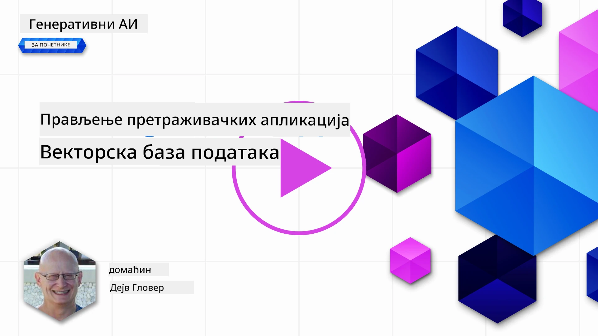
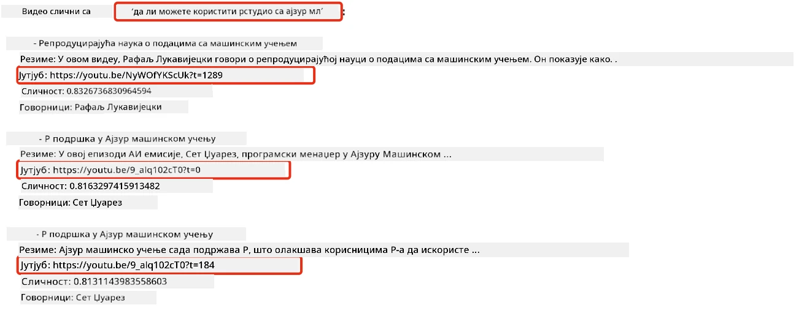
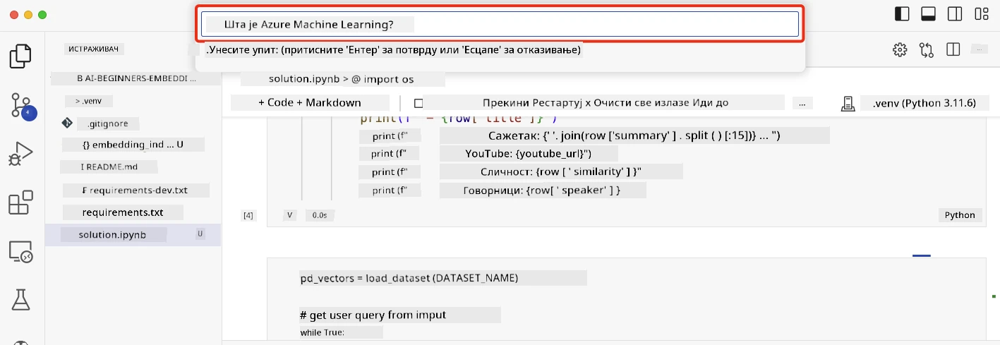

# Израда претраживачких апликација

[](https://youtu.be/W0-nzXjOjr0?si=GcsqiTTvd7RKbo7V)

> > _Кликните на слику горе да бисте погледали видео овог часа_

Велика језичка модела нису само четботови и генерисање текста. Такође је могуће изградити претраживачке апликације користећи енбеддинге. Енбеддинзи су нумерички прикази података који се називају и векторима и могу се користити за семантичку претрагу података.

У овом часу ћете направити претраживачку апликацију за наш едукативни стартап. Наш стартап је непрофитна организација која пружа бесплатно образовање студентима у земљама у развоју. Наш стартап има велики број YouTube видео записа које студенти могу да користе за учење о вештачкој интелигенцији. Наш стартап жели да направи претраживачку апликацију која омогућава студентима да претражују YouTube видео запис куцањем питања.

На пример, студент може унети „Шта су Јупитер бележнице?“ или „Шта је Azure ML“ и претраживачка апликација ће вратити списак YouTube видео записа релевантних за питање, а још боље, претраживачка апликација ће вратити везу до места у видеу где се налази одговор на питање.

## Увод

У овом часу ћемо покрити:

- Семантичку у односу на претрагу кључних речи.
- Шта су Текстуални енбеддинзи.
- Креирање индекса Текстуалних енбеддинга.
- Претрага индекса Текстуалних енбеддинга.

## Циљеви учења

Након завршетка овог часа моћи ћете да:

- Разјасните разлику између семантичке и претраге по кључним речима.
- Објасните шта су Текстуални енбеддинзи.
- Креирате апликацију користећи Энбеддинге за претрагу података.

## Зашто направити претраживачку апликацију?

Креирање претраживачке апликације ће вам помоћи да разумете како да користите енбеддинге за претрагу података. Такође ћете научити како да направите претраживачку апликацију коју студенти могу користити за брзо проналажење информација.

Час укључује Енбеддинг индекс YouTube транскрипата са Microsoft [AI Show](https://www.youtube.com/playlist?list=PLlrxD0HtieHi0mwteKBOfEeOYf0LJU4O1) YouTube канала. AI Show је YouTube канал који вас учи о вештачкој интелигенцији и машинском учењу. Енбеддинг индекс садржи енбеддинге за сваки YouTube транскрипт до октобра 2023. Користићете Енбеддинг индекс да направите претраживачку апликацију за наш стартап. Претраживачка апликација враћа везу до места у видеу где се налази одговор на питање. Ово је одличан начин да студенти брзо пронађу потребне информације.

Следећи пример је семантички упит за питање „можете ли користити rstudio са azure ml?“. Погледајте YouTube URL, видећете да URL садржи ознаку времена која вас води до места у видеу где је одговор на питање.



## Шта је семантичка претрага?

Сада се можда питате, шта је семантичка претрага? Семантичка претрага је техника претраживања која користи семантику, односно значење речи у упиту, да врати релевантне резултате.

Ево примера семантичке претраге. Рецимо да тражите да купите ауто, можда ћете претражити „мој аутомобил из снова“, и семантичка претрага разуме да не `санјате` о аутомобилу, већ да тражите свој `идеални` ауто. Семантичка претрага разуме вашу намеру и враћа релевантне резултате. Алтернатива је `претрага по кључним речима` која би буквално претраживала снове о аутомобилима и често враћа нерелевантне резултате.

## Шта су Текстуални енбеддинзи?

[Текстуални енбеддинзи](https://en.wikipedia.org/wiki/Word_embedding?WT.mc_id=academic-105485-koreyst) су техника представљања текста која се користи у [природном језичком процесирању](https://en.wikipedia.org/wiki/Natural_language_processing?WT.mc_id=academic-105485-koreyst). Текстуални енбеддинзи су семантички нумерички прикази текста. Енбеддинзи се користе за представљање података на начин лак за разумевање од стране машине. Постоје многи модели за израду текстуалних енбеддинга, а у овом часу ћемо се фокусирати на генерисање енбеддинга коришћењем OpenAI модела за енбеддинг.

Ево примера, замислите да је следећи текст из транскрипта једне од епизода на AI Show YouTube каналу:

```text
Today we are going to learn about Azure Machine Learning.
```

Текст бисмо послали на OpenAI Embedding API и он би вратио слиједећи енбеддинг који се састоји од 1536 бројева, односно вектора. Сваки број у вектору представља различит аспект текста. Због краткости, ево првих 10 бројева у вектору.

```python
[-0.006655829958617687, 0.0026128944009542465, 0.008792596869170666, -0.02446001023054123, -0.008540431968867779, 0.022071078419685364, -0.010703742504119873, 0.003311325330287218, -0.011632772162556648, -0.02187200076878071, ...]
```

## Како је направљен индекс енбеддинга?

Индекс енбеддинга за овај час је направљен серијом Python скрипти. Скрипте и упутства ћете пронаћи у [README](./scripts/README.md?WT.mc_id=academic-105485-koreyst) у фасцикли 'scripts' за овај час. Не морате покретати ове скрипте да бисте завршили час јер је индекс енбеддинга обезбеђен.

Скрипте извршавају следеће операције:

1. Транскрипт за сваки YouTube видео са [AI Show](https://www.youtube.com/playlist?list=PLlrxD0HtieHi0mwteKBOfEeOYf0LJU4O1) плейлисте се преузима.
2. Користећи [OpenAI Функције](https://learn.microsoft.com/azure/ai-foundry/openai/how-to/function-calling?WT.mc_id=academic-105485-koreyst), покушава се издвојити име говорника из прва 3 минута YouTube транскрипта. Име говорника за сваки видео се чува у индексу енбеддинга под именом `embedding_index_3m.json`.
3. Текст транскрипта се дели на **текстуалне сегменте од 3 минута**. Сегмент садржи око 20 речи преклапања са следећим сегментом да би се обезбедило да енбеддинг сегмента није прекинут и да се обезбеди бољи контекст претраге.
4. Сваки текстуални сегмент се затим шаље OpenAI Chat API-ју да сажме текст у 60 речи. Сажетак се такође чува у индексу енбеддинга `embedding_index_3m.json`.
5. На крају, текст сегмента се шаље OpenAI Embedding API-ју. API враћа вектор од 1536 бројева који представља семантичко значење сегмента. Сегмент и OpenAI енбеддинг вектор се чувају у индексу енбеддинга `embedding_index_3m.json`.

### Векторске базе података

Због једноставности часа, индекс енбеддинга је сачуван у JSON фајлу под именом `embedding_index_3m.json` и учитан у Pandas DataFrame. Међутим, у продукцији, индекс енбеддинга би био сачуван у векторској бази података као што је [Azure Cognitive Search](https://learn.microsoft.com/training/modules/improve-search-results-vector-search?WT.mc_id=academic-105485-koreyst), [Redis](https://cookbook.openai.com/examples/vector_databases/redis/readme?WT.mc_id=academic-105485-koreyst), [Pinecone](https://cookbook.openai.com/examples/vector_databases/pinecone/readme?WT.mc_id=academic-105485-koreyst), [Weaviate](https://cookbook.openai.com/examples/vector_databases/weaviate/readme?WT.mc_id=academic-105485-koreyst), између осталих.

## Разумевање косинусне сличности

Учили смо о текстуалним енбеддинзима, следећи корак је да научимо како да користимо текстуалне енбеддинге за претрагу података и конкретно како да пронађемо најсличније енбеддинге датој претрази коришћењем косинусне сличности.

### Шта је косинусна сличност?

Косинусна сличност је мера сличности између два вектора, често се назива и `претрага најближег суседа`. Да бисте извршили претрагу по косинусној сличности, потребно је да _векторизујете_ текст _упита_ користећи OpenAI Embedding API. Затим израчунате _косинусну сличност_ између вектор упита и сваког вектора у индексу енбеддинга. Подсетимо, индекс енбеддинга има вектор за сваки текст сегмент YouTube транскрипта. На крају, сортирате резултате по косинусној сличности и текстуални сегменти са највишом косинусном сличношћу су најсличнији упиту.

Из математичке перспективе, косинусна сличност мери косинус угла између два вектора пројектована у мултидимензионални простор. Ова мера је корисна јер, ако су два документа далеко један од другог по Евклидовој удаљености због величине, и даље могу имати мањи угао између себе и тиме вишу косинусну сличност. За више информација о једначинама косинусне сличности, видети [Косинусна сличност](https://en.wikipedia.org/wiki/Cosine_similarity?WT.mc_id=academic-105485-koreyst).

## Креирање ваше прве претраживачке апликације

Следеће ћемо научити како да направимо претраживачку апликацију користећи енбеддинге. Претраживачка апликација ће студентима омогућити да претражују видео запис куцањем питања. Апликација ће вратити списак видео записа релевантних питању. Апликација ће такође вратити везу до места у видеу где је одговор на питање.

Ово решење је изграђено и тестиранo на Windows 11, macOS и Ubuntu 22.04 користећи Python 3.10 или новији. Python можете преузети са [python.org](https://www.python.org/downloads/?WT.mc_id=academic-105485-koreyst).

## Задатак - израда претраживачке апликације за студенте

Увели смо наш стартап на почетку овог часа. Сада је време да омогућимо студентима да направе претраживачку апликацију за своје оцењивање.

У овом задатку креираћете Azure OpenAI услуге које ће се користити за израду претраживачке апликације. Креираћете следеће Azure OpenAI услуге. Биће вам потребна Azure претплата за завршетак овог задатка.

### Покрени Azure Cloud Shell

1. Пријавите се на [Azure портал](https://portal.azure.com/?WT.mc_id=academic-105485-koreyst).
2. Изаберите иконицу Cloud Shell у горњем десном углу Azure портала.
3. Изаберите **Bash** као тип окружења.

#### Креирајте групу ресурса

> За ове инструкције користимо групу ресурса под именом "semantic-video-search" на Исток САД.
> Можете променити име групе ресурса, али при промени локације ресурса,
> проверите [табелу доступности модела](https://aka.ms/oai/models?WT.mc_id=academic-105485-koreyst).

```shell
az group create --name semantic-video-search --location eastus
```

#### Креирање ресурса Azure OpenAI услуге

Из Azure Cloud Shell-а покрените следећу команду да бисте креирали ресурс Azure OpenAI услуге.

```shell
az cognitiveservices account create --name semantic-video-openai --resource-group semantic-video-search \
    --location eastus --kind OpenAI --sku s0
```

#### Добити крајњу тачку и кључеве за коришћење у овој апликацији

Из Azure Cloud Shell-а покрените следеће команде да бисте добили крајњу тачку и кључеве за ресурс Azure OpenAI услуге.

```shell
az cognitiveservices account show --name semantic-video-openai \
   --resource-group  semantic-video-search | jq -r .properties.endpoint
az cognitiveservices account keys list --name semantic-video-openai \
   --resource-group semantic-video-search | jq -r .key1
```

#### Деплојирање OpenAI модела за енбеддинг

Из Azure Cloud Shell-а покрените следећу команду да бисте деплојирали OpenAI модел за енбеддинг.

```shell
az cognitiveservices account deployment create \
    --name semantic-video-openai \
    --resource-group  semantic-video-search \
    --deployment-name text-embedding-ada-002 \
    --model-name text-embedding-ada-002 \
    --model-version "2"  \
    --model-format OpenAI \
    --sku-capacity 100 --sku-name "Standard"
```

## Решење

Отворите [solution notebook](./python/aoai-solution.ipynb?WT.mc_id=academic-105485-koreyst) у GitHub Codespaces и пратите упутства у Jupyter бележници.

Када покренете бележницу, од вас ће се тражити да унесете упит. Пољe за унос ће изгледати овако:



## Одличан посао! Наставите са учењем

Након завршетка овог часа, погледајте нашу [колекцију за учење генеративне вештачке интелигенције](https://aka.ms/genai-collection?WT.mc_id=academic-105485-koreyst) да наставите да унапређујете своје знање из генеративне вештачке интелигенције!

Пређите на Час 9 где ћемо погледати како да [направите апликације за генерисање слика](../09-building-image-applications/README.md?WT.mc_id=academic-105485-koreyst)!

---

<!-- CO-OP TRANSLATOR DISCLAIMER START -->
**Изјава о одрицању одговорности**:
Овај документ је преведен коришћењем услуге за аутоматски превод [Co-op Translator](https://github.com/Azure/co-op-translator). Иако тежимо тачности, имајте у виду да аутоматски преводи могу садржати грешке или нетачности. Оригинални документ на његовом изворном језику треба сматрати ауторитативним извором. За критичне информације препоручује се професионални људски превод. Нисмо одговорни за било каква неспоразума или погрешна тумачења која произилазе из коришћења овог превода.
<!-- CO-OP TRANSLATOR DISCLAIMER END -->