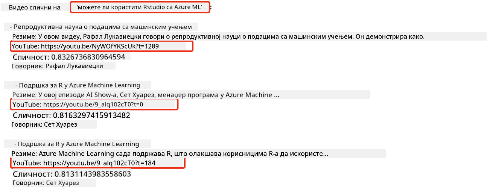
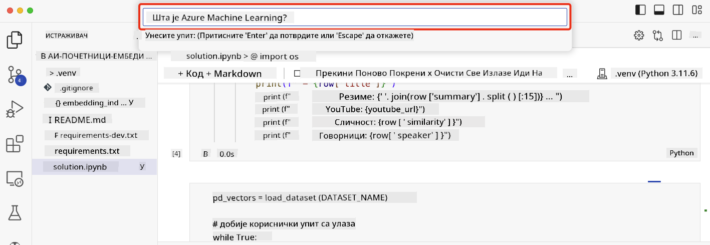

<!--
CO_OP_TRANSLATOR_METADATA:
{
  "original_hash": "d46aad0917a1a342d613e2c13d457da5",
  "translation_date": "2025-06-25T16:44:17+00:00",
  "source_file": "08-building-search-applications/README.md",
  "language_code": "sr"
}
-->
# Изградња апликација за претрагу

[](https://aka.ms/gen-ai-lesson8-gh?WT.mc_id=academic-105485-koreyst)

> > _Кликните на слику изнад да бисте погледали видео овог часа_

Велики језички модели (LLM) нису само за чет-ботове и генерисање текста. Такође је могуће изградити апликације за претрагу користећи уграђене представе. Уграђене представе су нумеричке репрезентације података познате и као вектори и могу се користити за семантичку претрагу података.

У овом часу, изградићете апликацију за претрагу за нашу образовну стартап компанију. Наша стартап компанија је непрофитна организација која пружа бесплатно образовање ученицима у земљама у развоју. Имамо велики број YouTube видео снимака које ученици могу користити да науче о вештачкој интелигенцији. Наша стартап компанија жели да изгради апликацију за претрагу која омогућава ученицима да претражују YouTube видео тако што ће уписати питање.

На пример, ученик може уписати 'Шта су Jupyter бележнице?' или 'Шта је Azure ML' и апликација за претрагу ће вратити листу YouTube видео снимака који су релевантни за питање, а још боље, апликација ће вратити линк до места у видеу где се налази одговор на питање.

## Увод

У овом часу ћемо покрити:

- Семантичка vs Кључна претрага.
- Шта су текстуалне уграђене представе.
- Креирање индекса текстуалних уграђених представа.
- Претраживање индекса текстуалних уграђених представа.

## Циљеви учења

Након завршетка овог часа, моћи ћете:

- Разликовати семантичку и кључну претрагу.
- Објаснити шта су текстуалне уграђене представе.
- Креирати апликацију користећи уграђене представе за претрагу података.

## Зашто изградити апликацију за претрагу?

Креирање апликације за претрагу ће вам помоћи да разумете како да користите уграђене представе за претрагу података. Такође ћете научити како да изградите апликацију за претрагу коју ученици могу користити да брзо пронађу информације.

Лекција укључује индекс уграђених представа транскрипата YouTube канала Microsoft [AI Show](https://www.youtube.com/playlist?list=PLlrxD0HtieHi0mwteKBOfEeOYf0LJU4O1). AI Show је YouTube канал који вас учи о вештачкој интелигенцији и машинском учењу. Индекс уграђених представа садржи уграђене представе за сваки од транскрипата YouTube видеа до октобра 2023. Користићете индекс уграђених представа да изградите апликацију за претрагу за наш стартап. Апликација за претрагу враћа линк до места у видеу где се налази одговор на питање. Ово је одличан начин да ученици брзо пронађу информације које им требају.

Следећи је пример семантичке претраге за питање 'можете ли користити rstudio са azure ml?'. Погледајте YouTube URL, видећете да URL садржи временску ознаку која вас води до места у видеу где се налази одговор на питање.



## Шта је семантичка претрага?

Сада се можда питате, шта је семантичка претрага? Семантичка претрага је техника претраге која користи семантику, или значење, речи у упиту да врати релевантне резултате.

Ево примера семантичке претраге. Рецимо да желите да купите ауто, могли бисте да претражите 'мој аутомобил из снова', семантичка претрага разуме да не говорите о аутомобилу, већ да желите да купите свој аутомобил из снова. Семантичка претрага разуме вашу намеру и враћа релевантне резултате. Алтернатива је кључна претрага која би буквално претраживала снове о аутомобилима и често враћала нерелевантне резултате.

## Шта су текстуалне уграђене представе?

[Текстуалне уграђене представе](https://en.wikipedia.org/wiki/Word_embedding?WT.mc_id=academic-105485-koreyst) су техника репрезентације текста која се користи у [обради природног језика](https://en.wikipedia.org/wiki/Natural_language_processing?WT.mc_id=academic-105485-koreyst). Текстуалне уграђене представе су семантичке нумеричке репрезентације текста. Уграђене представе се користе да представе податке на начин који је лак за разумевање машини. Постоји много модела за изградњу текстуалних уграђених представа, у овом часу ћемо се фокусирати на генерисање уграђених представа користећи OpenAI Embedding Model.

Ево примера, замислите да је следећи текст у транскрипту једне од епизода на AI Show YouTube каналу:

```text
Today we are going to learn about Azure Machine Learning.
```

Прошли бисмо текст кроз OpenAI Embedding API и он би вратио следећу уграђену представу која се састоји од 1536 бројева, познатих и као вектор. Сваки број у вектору представља различит аспект текста. Ради краћег приказа, ево првих 10 бројева у вектору.

```python
[-0.006655829958617687, 0.0026128944009542465, 0.008792596869170666, -0.02446001023054123, -0.008540431968867779, 0.022071078419685364, -0.010703742504119873, 0.003311325330287218, -0.011632772162556648, -0.02187200076878071, ...]
```

## Како је креиран индекс уграђених представа?

Индекс уграђених представа за овај час је креиран серијом Python скрипти. Наћи ћете скрипте заједно са упутствима у [README](./scripts/README.md?WT.mc_id=academic-105485-koreyst) у 'scripts' фолдеру за овај час. Не морате да покрећете ове скрипте да бисте завршили овај час, јер је индекс уграђених представа већ обезбеђен за вас.

Скрипте извршавају следеће операције:

1. Транскрипт за сваки YouTube видео у [AI Show](https://www.youtube.com/playlist?list=PLlrxD0HtieHi0mwteKBOfEeOYf0LJU4O1) плејлисти се преузима.
2. Користећи [OpenAI функције](https://learn.microsoft.com/azure/ai-services/openai/how-to/function-calling?WT.mc_id=academic-105485-koreyst), покушава се извлачење имена говорника из прве 3 минуте транскрипта YouTube видеа. Име говорника за сваки видео се чува у индексу уграђених представа под именом `embedding_index_3m.json`.
3. Текст транскрипта се затим дели на **текстуалне сегменте од 3 минута**. Сегмент укључује око 20 речи које се преклапају са следећим сегментом како би се осигурало да уграђена представа сегмента није прекинута и да би се обезбедила боља контекстуална претрага.
4. Сваки текстуални сегмент се затим шаље на OpenAI Chat API да сажме текст у 60 речи. Сажетак се такође чува у индексу уграђених представа `embedding_index_3m.json`.
5. На крају, текст сегмента се шаље на OpenAI Embedding API. Embedding API враћа вектор од 1536 бројева који представљају семантичко значење сегмента. Сегмент заједно са OpenAI уграђеним вектором се чува у индексу уграђених представа `embedding_index_3m.json`.

### Векторске базе података

Због једноставности часа, индекс уграђених представа се чува у JSON фајлу под именом `embedding_index_3m.json` и учитава се у Pandas DataFrame. Међутим, у продукцији, индекс уграђених представа би се чувао у векторској бази података као што су [Azure Cognitive Search](https://learn.microsoft.com/training/modules/improve-search-results-vector-search?WT.mc_id=academic-105485-koreyst), [Redis](https://cookbook.openai.com/examples/vector_databases/redis/readme?WT.mc_id=academic-105485-koreyst), [Pinecone](https://cookbook.openai.com/examples/vector_databases/pinecone/readme?WT.mc_id=academic-105485-koreyst), [Weaviate](https://cookbook.openai.com/examples/vector_databases/weaviate/readme?WT.mc_id=academic-105485-koreyst), да наведемо само неке.

## Разумевање косинусне сличности

Научили смо о текстуалним уграђеним представама, следећи корак је да научимо како да користимо текстуалне уграђене представе за претрагу података и посебно да пронађемо најсличније уграђене представе за дати упит користећи косинусну сличност.

### Шта је косинусна сличност?

Косинусна сличност је мера сличности између два вектора, такође ћете чути да се ово назива и `nearest neighbor search`. Да бисте извршили претрагу користећи косинусну сличност, потребно је да _векторизујете_ текст _упита_ користећи OpenAI Embedding API. Затим израчунајте _косинусну сличност_ између вектора упита и сваког вектора у индексу уграђених представа. Запамтите, индекс уграђених представа има вектор за сваки текстуални сегмент транскрипта YouTube видеа. На крају, сортирајте резултате по косинусној сличности и текстуални сегменти са највишом косинусном сличношћу су најсличнији упиту.

Из математичке перспективе, косинусна сличност мери косинус угла између два вектора пројектована у вишедимензионалном простору. Ова мера је корисна, јер ако су два документа удаљена један од другог по Евклидовој удаљености због величине, могла би имати мањи угао између њих и стога већу косинусну сличност. За више информација о једначинама косинусне сличности, погледајте [Косинусна сличност](https://en.wikipedia.org/wiki/Cosine_similarity?WT.mc_id=academic-105485-koreyst).

## Изградња ваше прве апликације за претрагу

Следеће, научићемо како да изградимо апликацију за претрагу користећи уграђене представе. Апликација за претрагу ће омогућити ученицима да претраже видео тако што ће уписати питање. Апликација за претрагу ће вратити листу видео снимака који су релевантни за питање. Апликација за претрагу ће такође вратити линк до места у видеу где се налази одговор на питање.

Ово решење је изграђено и тестирано на Windows 11, macOS и Ubuntu 22.04 користећи Python 3.10 или новији. Можете преузети Python са [python.org](https://www.python.org/downloads/?WT.mc_id=academic-105485-koreyst).

## Задатак - изградња апликације за претрагу, да омогућимо ученицима

Представили смо наш стартап на почетку овог часа. Сада је време да омогућимо ученицима да изграде апликацију за претрагу за своје процене.

У овом задатку, креираћете Azure OpenAI услуге које ће се користити за изградњу апликације за претрагу. Креираћете следеће Azure OpenAI услуге. Биће вам потребна Azure претплата да завршите овај задатак.

### Покрените Azure Cloud Shell

1. Пријавите се на [Azure портал](https://portal.azure.com/?WT.mc_id=academic-105485-koreyst).
2. Изаберите икону Cloud Shell у горњем десном углу Azure портала.
3. Изаберите **Bash** за тип окружења.

#### Креирајте ресурсну групу

> За ова упутства, користимо ресурсну групу под именом "semantic-video-search" у истоку САД.
> Можете променити име ресурсне групе, али када мењате локацију за ресурсе,
> проверите [табелу доступности модела](https://aka.ms/oai/models?WT.mc_id=academic-105485-koreyst).

```shell
az group create --name semantic-video-search --location eastus
```

#### Креирајте ресурс Azure OpenAI услуге

Из Azure Cloud Shell-а, покрените следећу команду да креирате ресурс Azure OpenAI услуге.

```shell
az cognitiveservices account create --name semantic-video-openai --resource-group semantic-video-search \
    --location eastus --kind OpenAI --sku s0
```

#### Добијте крајњу тачку и кључеве за коришћење у овој апликацији

Из Azure Cloud Shell-а, покрените следеће команде да добијете крајњу тачку и кључеве за ресурс Azure OpenAI услуге.

```shell
az cognitiveservices account show --name semantic-video-openai \
   --resource-group  semantic-video-search | jq -r .properties.endpoint
az cognitiveservices account keys list --name semantic-video-openai \
   --resource-group semantic-video-search | jq -r .key1
```

#### Деплојујте OpenAI модел уграђених представа

Из Azure Cloud Shell-а, покрените следећу команду да деплојујете OpenAI модел уграђених представа.

```shell
az cognitiveservices account deployment create \
    --name semantic-video-openai \
    --resource-group  semantic-video-search \
    --deployment-name text-embedding-ada-002 \
    --model-name text-embedding-ada-002 \
    --model-version "2"  \
    --model-format OpenAI \
    --sku-capacity 100 --sku-name "Standard"
```

## Решение

Отворите [решение у нотебуку](../../../08-building-search-applications/python/aoai-solution.ipynb) у GitHub Codespaces и пратите упутства у Jupyter нотебуку.

Када покренете нотебук, биће вам затражено да унесете упит. Улазно поље ће изгледати овако:



## Одличан рад! Наставите са учењем

Након завршетка овог часа, погледајте нашу [колекцију учења о Генеративној вештачкој интелигенцији](https://aka.ms/genai-collection?WT.mc_id=academic-105485-koreyst) да наставите са унапређивањем вашег знања о Генеративној вештачкој интелигенцији!

Идите на Лекцију 9 где ћемо погледати како да [изградимо апликације за генерисање слика](../09-building-image-applications/README.md?WT.mc_id=academic-105485-koreyst)!

**Одрицање од одговорности**:  
Овај документ је преведен коришћењем AI услуге за превођење [Co-op Translator](https://github.com/Azure/co-op-translator). Иако се трудимо да обезбедимо тачност, молимо вас да будете свесни да аутоматизовани преводи могу садржати грешке или нетачности. Оригинални документ на његовом изворном језику треба сматрати меродавним извором. За критичне информације, препоручује се професионални људски превод. Нисмо одговорни за било каква неразумевања или погрешна тумачења настала коришћењем овог превода.