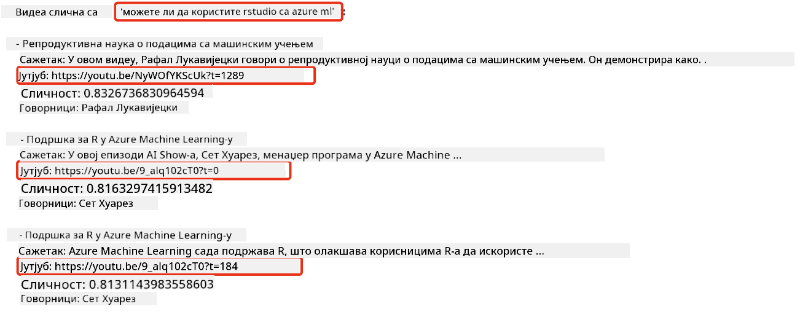
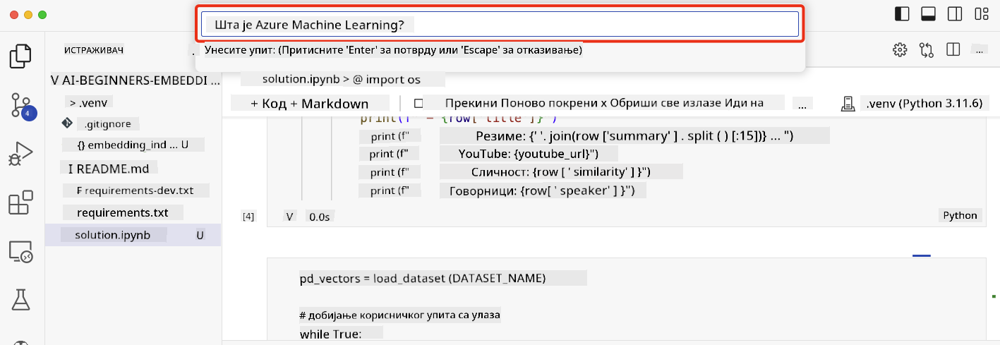

<!--
CO_OP_TRANSLATOR_METADATA:
{
  "original_hash": "d46aad0917a1a342d613e2c13d457da5",
  "translation_date": "2025-07-09T13:03:05+00:00",
  "source_file": "08-building-search-applications/README.md",
  "language_code": "sr"
}
-->
# Прављење претраживачких апликација

[](https://aka.ms/gen-ai-lesson8-gh?WT.mc_id=academic-105485-koreyst)

> > _Кликните на слику изнад да бисте погледали видео о овој лекцији_

Велики језички модели нису само за ћаскање и генерисање текста. Могуће је направити и претраживачке апликације користећи Ембеддинге. Ембеддинзи су нумерички прикази података, познати и као вектори, и могу се користити за семантичко претраживање података.

У овој лекцији направићете претраживачку апликацију за наш едукативни стартап. Наш стартап је непрофитна организација која пружа бесплатну едукацију студентима у земљама у развоју. Наш стартап има велики број YouTube видео снимака које студенти могу користити за учење о вештачкој интелигенцији. Стартап жели да направи претраживачку апликацију која омогућава студентима да претражују YouTube видео снимке тако што ће унети питање.

На пример, студент може унети „Шта су Јупитер нотебоокови?“ или „Шта је Azure ML“, а претраживачка апликација ће вратити листу YouTube видео снимака релевантних за питање, а још боље, апликација ће вратити и линк до места у видеу где се налази одговор на питање.

## Увод

У овој лекцији ћемо обрадити:

- Семантичко у односу на кључне речи претраживање.
- Шта су текстуални ембеддинзи.
- Креирање индекса текстуалних ембеддинга.
- Претраживање индекса текстуалних ембеддинга.

## Циљеви учења

Након завршетка ове лекције, моћи ћете да:

- Разликујете семантичко и претраживање по кључним речима.
- Објасните шта су текстуални ембеддинзи.
- Направите апликацију која користи ембеддинге за претраживање података.

## Зашто правити претраживачку апликацију?

Прављење претраживачке апликације помоћи ће вам да разумете како да користите ембеддинге за претраживање података. Такође ћете научити како да направите апликацију коју студенти могу користити да брзо пронађу информације.

Лекција укључује индекс ембеддинга YouTube транскрипата за Microsoft [AI Show](https://www.youtube.com/playlist?list=PLlrxD0HtieHi0mwteKBOfEeOYf0LJU4O1) YouTube канал. AI Show је YouTube канал који вас учи о вештачкој интелигенцији и машинском учењу. Индекс ембеддинга садржи ембеддинге за сваки од YouTube транскрипата до октобра 2023. Користићете овај индекс да направите претраживачку апликацију за наш стартап. Апликација враћа линк до места у видеу где се налази одговор на питање. Ово је одличан начин да студенти брзо пронађу потребне информације.

Следећи пример показује семантички упит за питање „можете ли користити rstudio са azure ml?“. Погледајте YouTube URL, видећете да URL садржи временски жиг који вас води до места у видеу где се налази одговор на питање.



## Шта је семантичко претраживање?

Можда се питате, шта је семантичко претраживање? Семантичко претраживање је техника претраживања која користи семантику, односно значење речи у упиту, да би вратила релевантне резултате.

Ево примера семантичког претраживања. Рецимо да тражите да купите ауто, можда ћете претраживати „мој аутомобил из снова“, семантичко претраживање разуме да не сањате о аутомобилу, већ да тражите свој „идеалан“ ауто. Семантичко претраживање разуме вашу намеру и враћа релевантне резултате. Алтернатива је претраживање по кључним речима које би буквално тражило снове о аутомобилима и често враћало нерелевантне резултате.

## Шта су текстуални ембеддинзи?

[Текстуални ембеддинзи](https://en.wikipedia.org/wiki/Word_embedding?WT.mc_id=academic-105485-koreyst) су техника представљања текста која се користи у [обради природног језика](https://en.wikipedia.org/wiki/Natural_language_processing?WT.mc_id=academic-105485-koreyst). Текстуални ембеддинзи су семантички нумерички прикази текста. Ембеддинзи се користе да представе податке на начин који је лак за разумевање машинама. Постоји много модела за прављење текстуалних ембеддинга, а у овој лекцији ћемо се фокусирати на генерисање ембеддинга коришћењем OpenAI Embedding модела.

Ево примера, замислите да је следећи текст из транскрипта једне епизоде на AI Show YouTube каналу:

```text
Today we are going to learn about Azure Machine Learning.
```

Текст бисмо проследили OpenAI Embedding API-ју који би вратио ембеддинг састављен од 1536 бројева, односно вектор. Сваки број у вектору представља различит аспект текста. За краткоћу, ево првих 10 бројева у вектору.

```python
[-0.006655829958617687, 0.0026128944009542465, 0.008792596869170666, -0.02446001023054123, -0.008540431968867779, 0.022071078419685364, -0.010703742504119873, 0.003311325330287218, -0.011632772162556648, -0.02187200076878071, ...]
```

## Како се креира индекс ембеддинга?

Индекс ембеддинга за ову лекцију направљен је серијом Python скрипти. Скрипте и упутства налазе се у [README](./scripts/README.md?WT.mc_id=academic-105485-koreyst) фајлу у фасцикли 'scripts' за ову лекцију. Не морате да покрећете ове скрипте да бисте завршили лекцију јер је индекс ембеддинга већ обезбеђен.

Скрипте извршавају следеће операције:

1. Преузима се транскрипт за сваки YouTube видео у [AI Show](https://www.youtube.com/playlist?list=PLlrxD0HtieHi0mwteKBOfEeOYf0LJU4O1) плејлисти.
2. Коришћењем [OpenAI функција](https://learn.microsoft.com/azure/ai-services/openai/how-to/function-calling?WT.mc_id=academic-105485-koreyst) покушава се издвојити име говорника из прва 3 минута транскрипта. Име говорника за сваки видео се чува у индексу ембеддинга под именом `embedding_index_3m.json`.
3. Текст транскрипта се дели на сегменте од **3 минута**. Сегмент укључује око 20 речи преклапања са следећим сегментом како би се обезбедило да ембеддинг сегмента није прекинут и да се обезбеди бољи контекст за претрагу.
4. Сваки сегмент текста се прослеђује OpenAI Chat API-ју да се сажме у 60 речи. Сажетак се такође чува у индексу ембеддинга `embedding_index_3m.json`.
5. На крају, текст сегмента се шаље OpenAI Embedding API-ју. Embedding API враћа вектор од 1536 бројева који представља семантичко значење сегмента. Сегмент заједно са OpenAI Embedding вектором се чува у индексу ембеддинга `embedding_index_3m.json`.

### Векторске базе података

Због једноставности лекције, индекс ембеддинга је сачуван у JSON фајлу под именом `embedding_index_3m.json` и учитан у Pandas DataFrame. Међутим, у продукцији би индекс ембеддинга био сачуван у векторској бази података као што су [Azure Cognitive Search](https://learn.microsoft.com/training/modules/improve-search-results-vector-search?WT.mc_id=academic-105485-koreyst), [Redis](https://cookbook.openai.com/examples/vector_databases/redis/readme?WT.mc_id=academic-105485-koreyst), [Pinecone](https://cookbook.openai.com/examples/vector_databases/pinecone/readme?WT.mc_id=academic-105485-koreyst), [Weaviate](https://cookbook.openai.com/examples/vector_databases/weaviate/readme?WT.mc_id=academic-105485-koreyst), да набројимо само неке.

## Разумевање косинусне сличности

Након што смо научили о текстуалним ембеддинзима, следећи корак је да научимо како да користимо текстуалне ембеддинге за претраживање података и посебно како да пронађемо најсличније ембеддинге датој претрази користећи косинусну сличност.

### Шта је косинусна сличност?

Косинусна сличност је мера сличности између два вектора, често се назива и `претрага најближег суседа`. Да бисте извршили претрагу по косинусној сличности, потребно је да _векторизујете_ текст упита користећи OpenAI Embedding API. Затим израчунате _косинусну сличност_ између вектора упита и сваког вектора у индексу ембеддинга. Запамтите, индекс ембеддинга садржи вектор за сваки сегмент текста из YouTube транскрипта. На крају, сортирате резултате по косинусној сличности, а сегменти текста са највишом косинусном сличношћу су најсличнији упиту.

Из математичке перспективе, косинусна сличност мери косинус угла између два вектора пројектована у вишедимензионалном простору. Ова мера је корисна јер, ако су два документа удаљена по Евклидовој удаљености због величине, могу и даље имати мањи угао између себе и самим тим већу косинусну сличност. За више информација о формулама косинусне сличности, погледајте [Cosine similarity](https://en.wikipedia.org/wiki/Cosine_similarity?WT.mc_id=academic-105485-koreyst).

## Прављење ваше прве претраживачке апликације

Следеће ћемо научити како да направимо претраживачку апликацију користећи ембеддинге. Апликација ће омогућити студентима да претражују видео тако што ће унети питање. Апликација ће вратити листу видео снимака релевантних за питање. Такође ће вратити линк до места у видеу где се налази одговор на питање.

Ово решење је направљено и тестирано на Windows 11, macOS и Ubuntu 22.04 користећи Python 3.10 или новији. Python можете преузети са [python.org](https://www.python.org/downloads/?WT.mc_id=academic-105485-koreyst).

## Задатак - прављење претраживачке апликације за студенте

На почетку лекције представили смо наш стартап. Сада је време да омогућите студентима да направе претраживачку апликацију за своје задатке.

У овом задатку креираћете Azure OpenAI услуге које ће се користити за прављење претраживачке апликације. Креираћете следеће Azure OpenAI услуге. За овај задатак потребна вам је Azure претплата.

### Покретање Azure Cloud Shell-а

1. Пријавите се на [Azure портал](https://portal.azure.com/?WT.mc_id=academic-105485-koreyst).
2. Изаберите икону Cloud Shell у горњем десном углу Azure портала.
3. Изаберите **Bash** као тип окружења.

#### Креирање групе ресурса

> За ове инструкције користимо групу ресурса под именом "semantic-video-search" у East US.
> Можете променити име групе ресурса, али када мењате локацију ресурса,
> проверите [табелу доступности модела](https://aka.ms/oai/models?WT.mc_id=academic-105485-koreyst).

```shell
az group create --name semantic-video-search --location eastus
```

#### Креирање Azure OpenAI Service ресурса

У Azure Cloud Shell-у покрените следећу команду да бисте креирали Azure OpenAI Service ресурс.

```shell
az cognitiveservices account create --name semantic-video-openai --resource-group semantic-video-search \
    --location eastus --kind OpenAI --sku s0
```

#### Добијање endpoint-а и кључева за коришћење у овој апликацији

У Azure Cloud Shell-у покрените следеће команде да бисте добили endpoint и кључеве за Azure OpenAI Service ресурс.

```shell
az cognitiveservices account show --name semantic-video-openai \
   --resource-group  semantic-video-search | jq -r .properties.endpoint
az cognitiveservices account keys list --name semantic-video-openai \
   --resource-group semantic-video-search | jq -r .key1
```

#### Деплој OpenAI Embedding модела

У Azure Cloud Shell-у покрените следећу команду да бисте деплојовали OpenAI Embedding модел.

```shell
az cognitiveservices account deployment create \
    --name semantic-video-openai \
    --resource-group  semantic-video-search \
    --deployment-name text-embedding-ada-002 \
    --model-name text-embedding-ada-002 \
    --model-version "2"  \
    --model-format OpenAI \
    --sku-capacity 100 --sku-name "Standard"
```

## Решење

Отворите [solution notebook](../../../08-building-search-applications/python/aoai-solution.ipynb) у GitHub Codespaces и пратите упутства у Jupyter Notebook-у.

Када покренете notebook, бићете упитани да унесете упит. Поље за унос ће изгледати овако:



## Одличан посао! Наставите са учењем

Након завршетка ове лекције, погледајте нашу [Generative AI Learning колекцију](https://aka.ms/genai-collection?WT.mc_id=academic-105485-koreyst) да бисте наставили да унапређујете своје знање о генеративној вештачкој интелигенцији!

Прелазимо на Лекцију 9 где ћемо погледати како да [правимо апликације за генерисање слика](../09-building-image-applications/README.md?WT.mc_id=academic-105485-koreyst)!

**Одрицање од одговорности**:  
Овај документ је преведен коришћењем AI услуге за превођење [Co-op Translator](https://github.com/Azure/co-op-translator). Иако се трудимо да превод буде тачан, молимо вас да имате у виду да аутоматски преводи могу садржати грешке или нетачности. Оригинални документ на његовом изворном језику треба сматрати ауторитетним извором. За критичне информације препоручује се професионални људски превод. Нисмо одговорни за било каква неспоразума или погрешна тумачења која произилазе из коришћења овог превода.