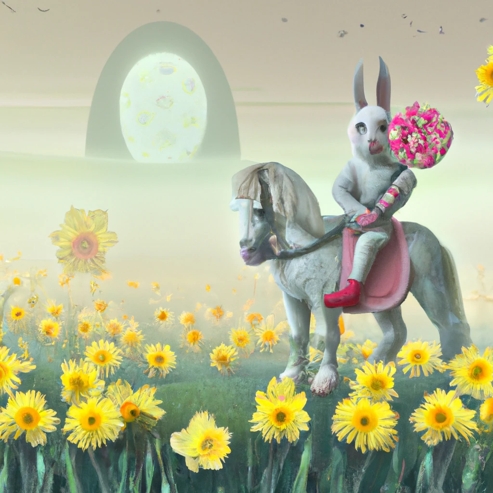

# Прављење апликација за генерисање слика

[](https://youtu.be/B5VP0_J7cs8?si=5P3L5o7F_uS_QcG9)

Постоји више од само генерисања текста код LLM-ова. Такође је могуће генерисати слике из текстуалних описа. Имање слика као модалитета може бити изузетно корисно у бројним областима као што су Медицинска технологија, архитектура, туризам, развој игара и још много тога. У овом поглављу ћемо погледати два најпопуларнија модела за генерисање слика, DALL-E и Midjourney.

## Увод

У овој лекцији ћемо покрити:

- Генерисање слика и зашто је корисно.
- DALL-E и Midjourney, шта су и како раде.
- Како бисте изградили апликацију за генерисање слика.

## Циљеви учења

Након завршетка ове лекције, моћи ћете да:

- Направите апликацију за генерисање слика.
- Дефинишете границе за вашу апликацију кроз мета промпте.
- Радите са DALL-E и Midjourney.

## Зашто креирати апликацију за генерисање слика?

Апликације за генерисање слика су одличан начин да истражите могућности генеративне вештачке интелигенције. Могу се користити, на пример, за:

- **Уређивање и синтеза слика**. Можете генерисати слике за разне случајеве употребе, као што су уређивање слика и синтеза слика.

- **Примену у различитим индустријама**. Такође се могу користити за генерисање слика у различитим индустријама као што су Медицинска технологија, Туризам, развој игара и други.

## Сценарио: Edu4All

Као део ове лекције, наставићемо да радимо са нашим стартапом, Edu4All. Студенти ће креирати слике за своје процене, а које ће слике стварно направити зависи од студената, али могу бити илустрације за њихову бајку, или креирање новог лика за своју причу или помоћ при визуелизацији њихових идеја и концепата.

Ево шта би студенти Edu4All могли да генеришу, на пример ако раде на часу о споменицима:


користећи промпт као што је

> "Пас поред Ајфелове куле у рано јутарње сунце"

## Шта су DALL-E и Midjourney?

[DALL-E](https://openai.com/dall-e-2?WT.mc_id=academic-105485-koreyst) и [Midjourney](https://www.midjourney.com/?WT.mc_id=academic-105485-koreyst) су два од најпопуларнијих модела за генерисање слика, омогућавају коришћење промптова за генерисање слика.

### DALL-E

Почнимо са DALL-E, који је генеративни модел вештачке интелигенције који генерише слике из текстуалних описа.

> [DALL-E је комбинација два модела, CLIP и diffused attention](https://towardsdatascience.com/openais-dall-e-and-clip-101-a-brief-introduction-3a4367280d4e?WT.mc_id=academic-105485-koreyst).

- **CLIP** је модел који генерише угнежђене представе (ембединг), што су нумерички прикази података, из слика и текста.

- **Diffused attention** је модел који генерише слике из ембединга. DALL-E је обучен на скупу података слика и текста и може да се користи за генерисање слика из текстуалних описа. На пример, DALL-E може генерисати слике мачке са шеширом или пса са моехавк фризуром.

### Midjourney

Midjourney функционише слично као DALL-E, генерише слике из текстуалних промптова. Midjourney се такође може користити за генерисање слика коришћењем промптова као што су „мачка са шеширом“ или „пас са моехавком“.


_Извор слике Википедија, слика генерисана помоћу Midjourney_

## Како раде DALL-E и Midjourney

Прво, [DALL-E](https://arxiv.org/pdf/2102.12092.pdf?WT.mc_id=academic-105485-koreyst). DALL-E је генеративни ИИ модел заснован на трансформер архитектури са _ауторегресивним трансформером_.

_Ауторегресивни трансформер_ дефинише како модел генерише слике из текстуалних описа, он генерише по један пиксел у минуту, а затим користи генерисане пикселе за генерацију следећег пиксела. Пролази кроз више слојева у неуронској мрежи док слика не буде комплетна.

Са овим процесом, DALL-E контролише атрибуте, предмете, карактеристике и још много тога на слици коју генерише. Међутим, DALL-E 2 и 3 имају већу контролу над генерисаном сликом.

## Како направити вашу прву апликацију за генерисање слика

Шта је потребно да се направи апликација за генерисање слика? Потребне су вам следеће библиотеке:

- **python-dotenv**, топло се препоручује коришћење ове библиотеке да бисте чували ваше тајне у _.env_ фајлу изван кода.
- **openai**, ова библиотека се користи за интеракцију са OpenAI API-јем.
- **pillow**, за рад са сликама у Python-у.
- **requests**, за помоћ при слању HTTP захтева.

## Креирање и деплој Azure OpenAI модела

Ако то већ нисте учинили, пратите упутства са странице [Microsoft Learn](https://learn.microsoft.com/azure/ai-foundry/openai/how-to/create-resource?pivots=web-portal&WT.mc_id=academic-105485-koreyst)
да креирате Azure OpenAI ресурсе и модел. Изаберите **gpt-image-1** као модел (тренутни генерацијски Azure OpenAI модел за слике; DALL-E 3 је наслеђени модел и више није доступан за нове примене).

## Креирање апликације

1. Креирајте фајл _.env_ са следећим садржајем:

   ```text
   AZURE_OPENAI_ENDPOINT=<your endpoint>
   AZURE_OPENAI_API_KEY=<your key>
   AZURE_OPENAI_DEPLOYMENT="gpt-image-1"
   ```

   Пронађите ове податке у Azure OpenAI Foundry порталу за ваш ресурс у „Deployments“ одељку.

1. Прикупите горе наведене библиотеке у фајл зван _requirements.txt_ овако:

   ```text
   python-dotenv
   openai
   pillow
   requests
   ```

1. Затим, направите виртуелно окружење и инсталирајте библиотеке:

   ```bash
   python3 -m venv venv
   source venv/bin/activate
   pip install -r requirements.txt
   ```

   За Windows користите следеће команде за креирање и активирање виртуелног окружења:

   ```bash
   python3 -m venv venv
   venv\Scripts\activate.bat
   ```

1. Додајте следећи код у фајл зван _app.py_:

    ```python
    import openai
    import os
    import requests
    from PIL import Image
    import dotenv
    from openai import OpenAI, AzureOpenAI
    
    # import dotenv
    dotenv.load_dotenv()
    
    # конфигуриши Azure OpenAI сервис клијент
    client = AzureOpenAI(
      azure_endpoint = os.environ["AZURE_OPENAI_ENDPOINT"],
      api_key=os.environ['AZURE_OPENAI_API_KEY'],
      api_version = "2024-10-21"
      )
    try:
        # Креирај слику користећи API за генерисање слика
        generation_response = client.images.generate(
                                prompt='Bunny on horse, holding a lollipop, on a foggy meadow where it grows daffodils',
                                size='1024x1024', n=1,
                                model=os.environ['AZURE_OPENAI_DEPLOYMENT']
                              )

        # Постави директоријум за сачувану слику
        image_dir = os.path.join(os.curdir, 'images')

        # Уколико директоријум не постоји, креирај га
        if not os.path.isdir(image_dir):
            os.mkdir(image_dir)

        # Иницијализуј путању слике (наговестити да формат треба бити png)
        image_path = os.path.join(image_dir, 'generated-image.png')

        # Преузми генерисану слику
        image_url = generation_response.data[0].url  # извези URL слике из одговора
        generated_image = requests.get(image_url).content  # преузми слику
        with open(image_path, "wb") as image_file:
            image_file.write(generated_image)

        # Прикажи слику у подразумеваном приказивачу слика
        image = Image.open(image_path)
        image.show()

    # ухвати изузетке
    except openai.BadRequestError as err:
        print(err)
   ```

Објаснимо овај код:

- Прво, увозимо потребне библиотеке, укључујући библиотеку OpenAI, dotenv, requests и Pillow.

  ```python
  import openai
  import os
  import requests
  from PIL import Image
  import dotenv
  ```

- Затим учитавамо променљиве окружења из _.env_ фајла.

  ```python
  # увези dotenv
  dotenv.load_dotenv()
  ```

- Након тога, конфигуришемо Azure OpenAI сервис клијент

  ```python
  # Узмите крајњу тачку и кључ из променљивих окружења
  client = AzureOpenAI(
      azure_endpoint = os.environ["AZURE_OPENAI_ENDPOINT"],
      api_key=os.environ['AZURE_OPENAI_API_KEY'],
      api_version = "2024-10-21"
      )
  ```

- Затим генеришемо слику:

  ```python
  # Креирајте слику користећи API за генерисање слика
  generation_response = client.images.generate(
                        prompt='Bunny on horse, holding a lollipop, on a foggy meadow where it grows daffodils',
                        size='1024x1024', n=1,
                        model=os.environ['AZURE_OPENAI_DEPLOYMENT']
                      )
  ```

  Горњи код враћа JSON објекат који садржи URL генерисане слике. Можемо користити тај URL да преузмемо слику и сачувамо је у фајл.

- На крају, отварамо слику и приказујемо је у стандардном прегледачу слика:

  ```python
  image = Image.open(image_path)
  image.show()
  ```

### Детаљније о генерисању слике

Погледајмо код за генерисање слике детаљније:

   ```python
     generation_response = client.images.generate(
                               prompt='Bunny on horse, holding a lollipop, on a foggy meadow where it grows daffodils',
                               size='1024x1024', n=1,
                               model=os.environ['AZURE_OPENAI_DEPLOYMENT']
                           )
   ```

- **prompt** је текстуални промпт који се користи за генерисање слике. У овом случају користимо промпт "Зец на коњу, држи лизалицу, на магловитој ливади где расту нарциси".
- **size** је величина генерисане слике. У овом случају генеришемо слику величине 1024x1024 пиксела.
- **n** је број слика које ће бити генерисане. У овом случају генеришемо две слике.
- **temperature** је параметар који контролише случајност у излазу генеративног ИИ модела. Температура је вредност између 0 и 1 где 0 значи да је излаз детерминистички, а 1 да је излаз случајан. Подразумевана вредност је 0.7.

Постоје још ствари које можете радити са сликама, а које ћемо покрити у следећем одељку.

## Додатне могућности генерисања слика

До сада сте видели како смо успели да генеришемо слику користећи неколико редова кода у Python-у. Међутим, постоји још много тога што можете урадити са сликама.

Такође можете следеће:

- **Извршити измене**. Пружањем постојеће слике уз маску и промпт, можете изменити слику. На пример, можете додати нешто на део слике. Замислите нашу слику зеца, можете додати шешир зецу. Како бисте то урадили, потребно је да обезбедите слику, маску (која идентификује део површине који се мења) и текстуални промпт који објашњава шта треба урадити.
> Белешка: ово није подржано у DALL-E 3.
 
Ево примера коришћења GPT Image:

   ```python
   response = client.images.edit(
       model="gpt-image-1",
       image=open("sunlit_lounge.png", "rb"),
       mask=open("mask.png", "rb"),
       prompt="A sunlit indoor lounge area with a pool containing a flamingo"
   )
   image_url = response.data[0].url
   ```

  Основна слика би садржала само лоунџ са базеном, али коначна слика би имала фламинга:

<div style="display: flex; justify-content: space-between; align-items: center; margin: 20px 0;">
  
  
  
</div>


- **Креирати варијације**. Идеја је да узмете постојећу слику и затражите да се креирају варијације. За креирање варијације пружате слику и текстуални промпт и користите код овако:

  ```python
  response = client.images.create_variation(
    image=open("bunny-lollipop.png", "rb"),
    n=1,
    size="1024x1024"
  )
  image_url = response.data[0].url
  ```

  > Бележка, ово је подржано само у OpenAI-јевом DALL-E 2 моделу, не у gpt-image-1

## Температура

Температура је параметар који контролише случајност у излазу генеративног ИИ модела. Температура је вредност између 0 и 1 где 0 значи да је излаз детерминистички, а 1 да је излаз случајан. Подразумевана вредност је 0.7.

Погледајмо пример како температура функционише тако што ћемо покренути овај промпт два пута:

> Промпт: "Зец на коњу, држи лизалицу, на магловитој ливади где расту нарциси"


Сада покренимо исти промпт да покажемо да нећемо добити исту слику два пута:


Као што можете видети, слике су сличне, али нису идентичне. Погледајмо шта се дешава ако променимо вредност температуре на 0.1:

```python
 generation_response = client.images.generate(
        prompt='Bunny on horse, holding a lollipop, on a foggy meadow where it grows daffodils',    # Унесите овде текст свог упита
        size='1024x1024',
        n=2
    )
```

### Промена температуре

Покушајмо да направимо одговор мање насумичним. Можемо приметити из две генерисане слике да на првој слици има зец, а на другој коњ, па се слике значајно разликују.

Стога променимо код и подесимо температуру на 0, овако:

```python
generation_response = client.images.generate(
        prompt='Bunny on horse, holding a lollipop, on a foggy meadow where it grows daffodils',    # Унесите текст вашег упита овде
        size='1024x1024',
        n=2,
        temperature=0
    )
```

Сада када покренете овај код, добијате ове две слике:

- 
- 

Овде јасно видите како слике више личе једна на другу.

## Како дефинисати границе за вашу апликацију уз помоћ метапромптова

Са нашим демо можемо већ генерисати слике за наше клијенте. Међутим, потребно је да дефинишемо неке границе за нашу апликацију.

На пример, не желимо да генеришемо слике које нису примерене за радно место, или које нису погодне за децу.

Ово можемо урадити помоћу _метапромптова_. Метапромптови су текстуални промптови који се користе за контролу излаза генеративног ИИ модела. На пример, можемо користити метапромптове да контролишемо излаз и осигурамо да генерисане слике буду примерене за радно место или погодне за децу.

### Како то ради?

Сада, како функционишу метапромптови?

Метапромптови су текстуални промптови који се користе за контролу излаза генеративног ИИ модела, позиционирани су пре основног текстуалног промпта и користе се да контролишу излаз модела тако што се уграђују у апликације. Тако се обухвата улазни промпт и мета промпт у једном текстуалном промпту.

Један пример метапромпта био би следећи:

```text
You are an assistant designer that creates images for children.

The image needs to be safe for work and appropriate for children.

The image needs to be in color.

The image needs to be in landscape orientation.

The image needs to be in a 16:9 aspect ratio.

Do not consider any input from the following that is not safe for work or appropriate for children.

(Input)

```

Сада погледајмо како можемо користити метапромптове у нашем демо-упутству.

```python
disallow_list = "swords, violence, blood, gore, nudity, sexual content, adult content, adult themes, adult language, adult humor, adult jokes, adult situations, adult"

meta_prompt =f"""You are an assistant designer that creates images for children.

The image needs to be safe for work and appropriate for children.

The image needs to be in color.

The image needs to be in landscape orientation.

The image needs to be in a 16:9 aspect ratio.

Do not consider any input from the following that is not safe for work or appropriate for children.
{disallow_list}
"""

prompt = f"{meta_prompt}
Create an image of a bunny on a horse, holding a lollipop"

# TODO додај захтев за генерисање слике
```

Из горе наведеног промпта видите како све генерисане слике узимају у обзир метапромпт.

## Задатак - омогућимо студентима

Представили смо Edu4All на почетку ове лекције. Сада је време да омогућимо студентима да генеришу слике за своје процене.


Ученици ће направити слике за своје оцене које садрже споменике, а који тачно споменици су на ученицима. Од ученика се тражи да употребе своју креативност у овом задатку како би поставили те споменике у различите контексте.

## Решење

Ево једног могућег решења:

```python
import openai
import os
import requests
from PIL import Image
import dotenv
from openai import AzureOpenAI
# import dotenv
dotenv.load_dotenv()

# Добијте крајњу тачку и кључ из променљивих окружења
client = AzureOpenAI(
  azure_endpoint = os.environ["AZURE_OPENAI_ENDPOINT"],
  api_key=os.environ['AZURE_OPENAI_API_KEY'],
  api_version = "2024-10-21"
  )


disallow_list = "swords, violence, blood, gore, nudity, sexual content, adult content, adult themes, adult language, adult humor, adult jokes, adult situations, adult"

meta_prompt = f"""You are an assistant designer that creates images for children.

The image needs to be safe for work and appropriate for children.

The image needs to be in color.

The image needs to be in landscape orientation.

The image needs to be in a 16:9 aspect ratio.

Do not consider any input from the following that is not safe for work or appropriate for children.
{disallow_list}
"""

prompt = f"""{meta_prompt}
Generate monument of the Arc of Triumph in Paris, France, in the evening light with a small child holding a Teddy looks on.
"""

try:
    # Направите слику користећи API за генерисање слике
    generation_response = client.images.generate(
        prompt=prompt,    # Унесите текст упита овде
        size='1024x1024',
        n=1,
    )
    # Поставите директоријум за сачувану слику
    image_dir = os.path.join(os.curdir, 'images')

    # Ако директоријум не постоји, направите га
    if not os.path.isdir(image_dir):
        os.mkdir(image_dir)

    # Иницијализујте путању слике (наведите да тип фајла треба да буде png)
    image_path = os.path.join(image_dir, 'generated-image.png')

    # Преузмите генерисану слику
    image_url = generation_response.data[0].url  # извucи URL слике из одговора
    generated_image = requests.get(image_url).content  # преузми слику
    with open(image_path, "wb") as image_file:
        image_file.write(generated_image)

    # Прикажи слику у подразумеваном прегледачу слика
    image = Image.open(image_path)
    image.show()

# ухвати изузетке
except openai.BadRequestError as err:
    print(err)
```

## Одличан рад! Наставите са учењем

Након што завршите ову лекцију, погледајте нашу [Generative AI Learning collection](https://aka.ms/genai-collection?WT.mc_id=academic-105485-koreyst) да наставите да унапређујете своје знање о генеративној вештачкој интелигенцији!

Идите на Лекцију 10 где ћемо погледати како да [правите AI апликације са малим кодом](../10-building-low-code-ai-applications/README.md?WT.mc_id=academic-105485-koreyst)

---

<!-- CO-OP TRANSLATOR DISCLAIMER START -->
**Изјава о одрицању одговорности**:
Овај документ је преведен коришћењем услуге за аутоматски превод [Co-op Translator](https://github.com/Azure/co-op-translator). Иако тежимо тачности, имајте у виду да аутоматски преводи могу садржати грешке или нетачности. Оригинални документ на његовом изворном језику треба сматрати ауторитативним извором. За критичне информације препоручује се професионални људски превод. Нисмо одговорни за било каква неспоразума или погрешна тумачења која произилазе из коришћења овог превода.
<!-- CO-OP TRANSLATOR DISCLAIMER END -->