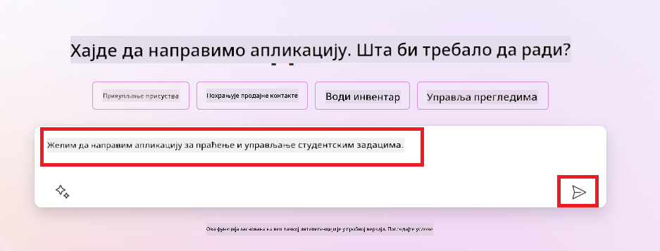
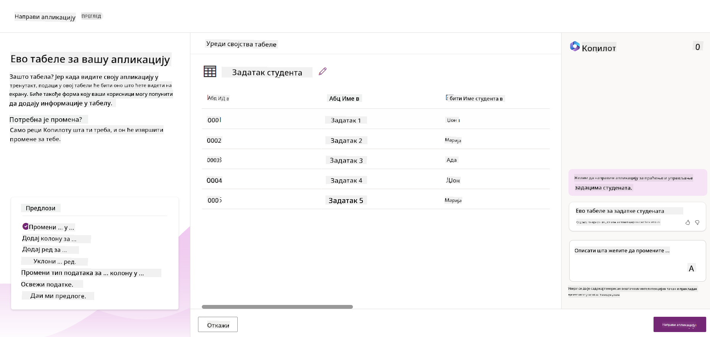
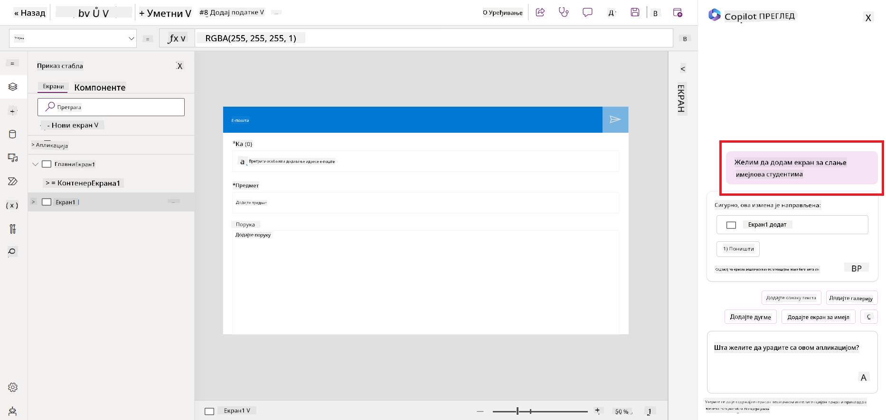
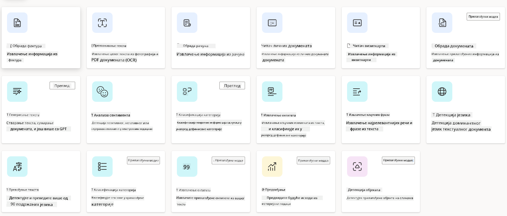
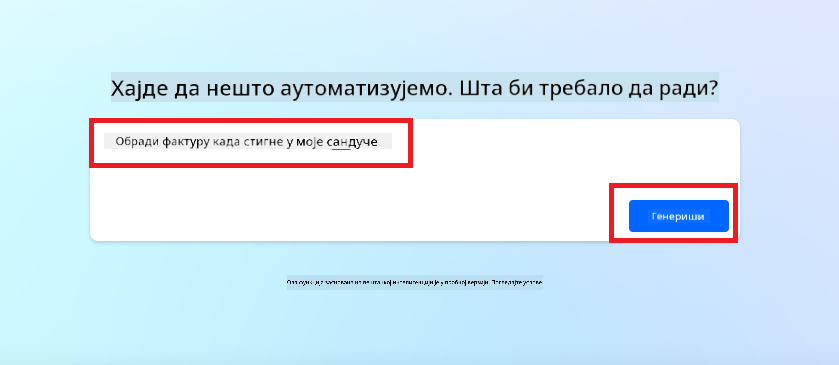
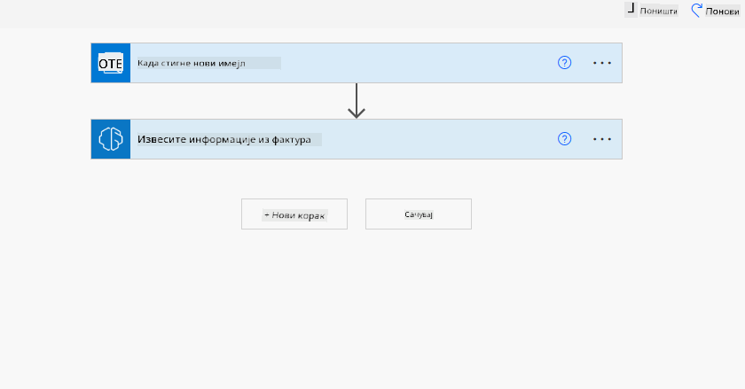
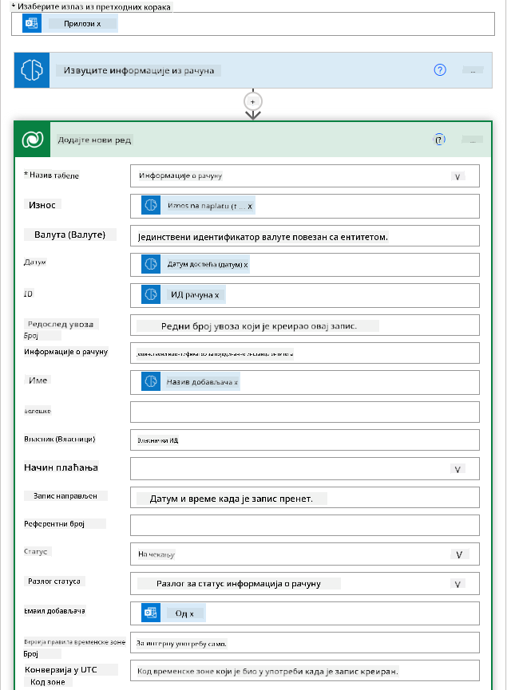
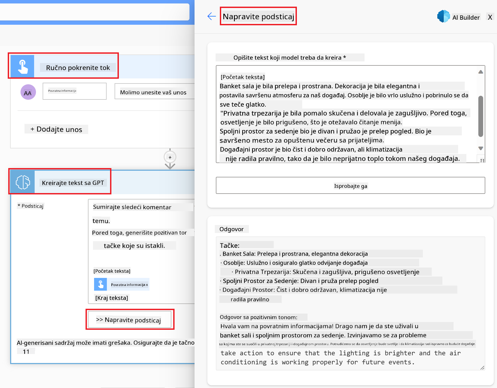

<!--
CO_OP_TRANSLATOR_METADATA:
{
  "original_hash": "f5ff3b6204a695a117d6f452403c95f7",
  "translation_date": "2025-05-19T21:11:02+00:00",
  "source_file": "10-building-low-code-ai-applications/README.md",
  "language_code": "sr"
}
-->
# Izgradnja aplikacija sa malo koda i veštačkom inteligencijom

> _(Kliknite na sliku iznad da biste pogledali video ovog časa)_

## Uvod

Sada kada smo naučili kako da gradimo aplikacije za generisanje slika, hajde da pričamo o aplikacijama sa malo koda. Generativna veštačka inteligencija može se koristiti u različitim oblastima, uključujući malo koda, ali šta je to malo koda i kako možemo dodati AI u njega?

Izgradnja aplikacija i rešenja postala je lakša za tradicionalne programere i ne-programere kroz korišćenje platformi za razvoj sa malo koda. Ove platforme omogućavaju izgradnju aplikacija i rešenja uz malo ili nimalo koda. Ovo se postiže obezbeđivanjem vizuelnog okruženja za razvoj koje omogućava povlačenje i ispuštanje komponenti za izgradnju aplikacija i rešenja. To omogućava bržu izgradnju aplikacija i rešenja sa manje resursa. U ovoj lekciji, dublje ćemo istražiti kako koristiti malo koda i kako unaprediti razvoj sa malo koda koristeći veštačku inteligenciju pomoću Power Platforme.

Power Platform pruža organizacijama mogućnost da osnaže svoje timove da sami grade rešenja kroz intuitivno okruženje sa malo ili nimalo koda. Ovo okruženje pomaže u pojednostavljenju procesa izgradnje rešenja. Sa Power Platformom, rešenja se mogu izgraditi za dane ili nedelje umesto meseci ili godina. Power Platform se sastoji od pet ključnih proizvoda: Power Apps, Power Automate, Power BI, Power Pages i Copilot Studio.

Ova lekcija pokriva:

- Uvod u generativnu veštačku inteligenciju u Power Platformi
- Uvod u Copilot i kako ga koristiti
- Korišćenje generativne veštačke inteligencije za izgradnju aplikacija i tokova u Power Platformi
- Razumevanje AI modela u Power Platformi sa AI Builderom

## Ciljevi učenja

Do kraja ove lekcije, bićete u mogućnosti da:

- Razumete kako Copilot funkcioniše u Power Platformi.

- Izgradite aplikaciju za praćenje studentskih zadataka za naš startap u obrazovanju.

- Izgradite tok za obradu faktura koji koristi veštačku inteligenciju za ekstrakciju informacija iz faktura.

- Primenite najbolje prakse prilikom korišćenja modela za kreiranje teksta sa GPT veštačkom inteligencijom.

Alati i tehnologije koje ćete koristiti u ovoj lekciji su:

- **Power Apps**, za aplikaciju za praćenje studentskih zadataka, koja pruža okruženje za razvoj sa malo koda za izgradnju aplikacija za praćenje, upravljanje i interakciju sa podacima.

- **Dataverse**, za skladištenje podataka za aplikaciju za praćenje studentskih zadataka gde će Dataverse pružiti platformu za skladištenje podataka sa malo koda.

- **Power Automate**, za tok obrade faktura gde ćete imati okruženje za razvoj sa malo koda za izgradnju tokova rada za automatizaciju procesa obrade faktura.

- **AI Builder**, za AI model obrade faktura gde ćete koristiti unapred izgrađene AI modele za obradu faktura za naš startap.

## Generativna veštačka inteligencija u Power Platformi

Unapređivanje razvoja i primene sa malo koda generativnom veštačkom inteligencijom je ključna oblast fokusa za Power Platformu. Cilj je omogućiti svima da izgrade aplikacije, sajtove, kontrolne table i automatizuju procese sa veštačkom inteligencijom, _bez potrebe za stručnim znanjem iz oblasti nauke o podacima_. Ovaj cilj se postiže integrisanjem generativne veštačke inteligencije u iskustvo razvoja sa malo koda u Power Platformi u obliku Copilota i AI Buildera.

### Kako ovo funkcioniše?

Copilot je AI asistent koji vam omogućava da gradite Power Platform rešenja opisujući vaše zahteve kroz seriju konverzacijskih koraka koristeći prirodni jezik. Na primer, možete uputiti vašem AI asistentu da navede koje polja će vaša aplikacija koristiti i ona će kreirati i aplikaciju i osnovni model podataka ili možete odrediti kako postaviti tok u Power Automate.

Možete koristiti funkcionalnosti vođene Copilotom kao funkciju na ekranima vaše aplikacije da omogućite korisnicima otkrivanje uvida kroz konverzacijske interakcije.

AI Builder je mogućnost veštačke inteligencije sa malo koda dostupna u Power Platformi koja vam omogućava da koristite AI modele da pomognete u automatizaciji procesa i predviđanju ishoda. Sa AI Builderom možete dovesti veštačku inteligenciju u vaše aplikacije i tokove koji se povezuju sa vašim podacima u Dataverse-u ili u različitim izvorima podataka u oblaku, kao što su SharePoint, OneDrive ili Azure.

Copilot je dostupan u svim Power Platform proizvodima: Power Apps, Power Automate, Power BI, Power Pages i Power Virtual Agents. AI Builder je dostupan u Power Apps i Power Automate. U ovoj lekciji, fokusiraćemo se na to kako koristiti Copilot i AI Builder u Power Apps i Power Automate za izgradnju rešenja za naš startap u obrazovanju.

### Copilot u Power Apps

Kao deo Power Platforme, Power Apps pruža okruženje za razvoj sa malo koda za izgradnju aplikacija za praćenje, upravljanje i interakciju sa podacima. To je skup usluga za razvoj aplikacija sa skalabilnom platformom za podatke i mogućnošću povezivanja sa uslugama u oblaku i podacima na lokaciji. Power Apps omogućava izgradnju aplikacija koje rade na pregledačima, tabletima i telefonima, i mogu se deliti sa saradnicima. Power Apps olakšava korisnicima razvoj aplikacija jednostavnim interfejsom, tako da svaki poslovni korisnik ili profesionalni programer može izgraditi prilagođene aplikacije. Iskustvo razvoja aplikacija je takođe unapređeno sa generativnom veštačkom inteligencijom kroz Copilot.

Funkcija AI asistenta Copilot u Power Apps omogućava vam da opišete kakvu aplikaciju trebate i koje informacije želite da vaša aplikacija prati, prikuplja ili prikazuje. Copilot zatim generiše responzivnu Canvas aplikaciju na osnovu vašeg opisa. Možete zatim prilagoditi aplikaciju da zadovolji vaše potrebe. AI Copilot takođe generiše i predlaže Dataverse tabelu sa poljima koja su vam potrebna za skladištenje podataka koje želite da pratite i nekim uzorcima podataka. U ovoj lekciji ćemo pogledati šta je Dataverse i kako ga možete koristiti u Power Apps kasnije. Možete zatim prilagoditi tabelu da zadovolji vaše potrebe koristeći funkciju AI Copilot asistenta kroz konverzacijske korake. Ova funkcija je lako dostupna sa početnog ekrana Power Apps.

### Copilot u Power Automate

Kao deo Power Platforme, Power Automate omogućava korisnicima da kreiraju automatizovane tokove između aplikacija i usluga. Pomaže u automatizaciji ponavljajućih poslovnih procesa kao što su komunikacija, prikupljanje podataka i odobravanje odluka. Njegov jednostavan interfejs omogućava korisnicima sa svakim nivoom tehničke kompetencije (od početnika do iskusnih programera) da automatizuju radne zadatke. Iskustvo razvoja tokova rada je takođe unapređeno sa generativnom veštačkom inteligencijom kroz Copilot.

Funkcija AI asistenta Copilot u Power Automate omogućava vam da opišete kakav tok vam je potreban i koje akcije želite da vaš tok izvrši. Copilot zatim generiše tok na osnovu vašeg opisa. Možete zatim prilagoditi tok da zadovolji vaše potrebe. AI Copilot takođe generiše i predlaže akcije koje su vam potrebne za izvršavanje zadatka koji želite da automatizujete. Pogledaćemo šta su tokovi i kako ih možete koristiti u Power Automate kasnije u ovoj lekciji. Možete zatim prilagoditi akcije da zadovolje vaše potrebe koristeći funkciju AI Copilot asistenta kroz konverzacijske korake. Ova funkcija je lako dostupna sa početnog ekrana Power Automate.

## Zadaci: Upravljanje studentskim zadacima i fakturama za naš startap, koristeći Copilot

Naš startap pruža online kurseve studentima. Startap je brzo rastao i sada se bori da održi korak sa potražnjom za svojim kursevima. Startap vas je angažovao kao Power Platform programera da im pomognete da izgrade rešenje sa malo koda kako bi upravljali studentskim zadacima i fakturama. Njihovo rešenje treba da im omogući praćenje i upravljanje studentskim zadacima kroz aplikaciju i automatizaciju procesa obrade faktura kroz tok rada. Zatraženo je da koristite generativnu veštačku inteligenciju za razvoj rešenja.

Kada počinjete sa korišćenjem Copilota, možete koristiti [Power Platform Copilot Prompt Library](https://github.com/pnp/powerplatform-prompts?WT.mc_id=academic-109639-somelezediko) da započnete sa promptovima. Ova biblioteka sadrži listu promptova koje možete koristiti za izgradnju aplikacija i tokova sa Copilotom. Takođe možete koristiti promptove iz biblioteke da biste dobili ideju kako opisati vaše zahteve Copilotu.

### Izgradnja aplikacije za praćenje studentskih zadataka za naš startap

Edukatori u našem startapu su se mučili da prate studentske zadatke. Koristili su tabelu za praćenje zadataka, ali to je postalo teško za upravljanje kako se broj studenata povećao. Zamolili su vas da izgradite aplikaciju koja će im pomoći da prate i upravljaju studentskim zadacima. Aplikacija treba da im omogući dodavanje novih zadataka, pregled zadataka, ažuriranje zadataka i brisanje zadataka. Aplikacija takođe treba da omogući edukatorima i studentima pregled zadataka koji su ocenjeni i onih koji nisu.

Izgradićete aplikaciju koristeći Copilot u Power Apps prateći korake ispod:

1. Idite na početni ekran [Power Apps](https://make.powerapps.com?WT.mc_id=academic-105485-koreyst).

1. Koristite tekstualno polje na početnom ekranu da opišete aplikaciju koju želite da izgradite. Na primer, **_Želim da izgradim aplikaciju za praćenje i upravljanje studentskim zadacima_**. Kliknite na dugme **Pošalji** da pošaljete prompt AI Copilotu.

1. AI Copilot će predložiti Dataverse tabelu sa poljima koja su vam potrebna za skladištenje podataka koje želite da pratite i nekim uzorcima podataka. Možete zatim prilagoditi tabelu da zadovolji vaše potrebe koristeći funkciju AI Copilot asistenta kroz konverzacijske korake.

   > **Važno**: Dataverse je osnovna platforma za podatke za Power Platform. To je platforma za skladištenje podataka sa malo koda za skladištenje podataka aplikacije. To je potpuno upravljana usluga koja bezbedno skladišti podatke u Microsoft Cloud-u i provisionirana je unutar vašeg Power Platform okruženja. Dolazi sa ugrađenim mogućnostima upravljanja podacima, kao što su klasifikacija podataka, poreklo podataka, fino-granularna kontrola pristupa i više. Možete saznati više o Dataverse [ovde](https://docs.microsoft.com/powerapps/maker/data-platform/data-platform-intro?WT.mc_id=academic-109639-somelezediko).

   

1. Edukatori žele da šalju mejlove studentima koji su predali svoje zadatke kako bi ih obavestili o napretku njihovih zadataka. Možete koristiti Copilot da dodate novo polje u tabelu za skladištenje studentskog mejla. Na primer, možete koristiti sledeći prompt da dodate novo polje u tabelu: **_Želim da dodam kolonu za skladištenje studentskog mejla_**. Kliknite na dugme **Pošalji** da pošaljete prompt AI Copilotu.

1. AI Copilot će generisati novo polje i možete zatim prilagoditi polje da zadovolji vaše potrebe.

1. Kada završite sa tabelom, kliknite na dugme **Kreiraj aplikaciju** da kreirate aplikaciju.

1. AI Copilot će generisati responzivnu Canvas aplikaciju na osnovu vašeg opisa. Možete zatim prilagoditi aplikaciju da zadovolji vaše potrebe.

1. Da bi edukatori mogli da šalju mejlove studentima, možete koristiti Copilot da dodate novi ekran u aplikaciju. Na primer, možete koristiti sledeći prompt da dodate novi ekran u aplikaciju: **_Želim da dodam ekran za slanje mejlova studentima_**. Kliknite na dugme **Pošalji** da pošaljete prompt AI Copilotu.

1. AI Copilot će generisati novi ekran i možete zatim prilagoditi ekran da zadovolji vaše potrebe.

1. Kada završite sa aplikacijom, kliknite na dugme **Sačuvaj** da sačuvate aplikaciju.

1. Da biste podelili aplikaciju sa edukatorima, kliknite na dugme **Podeli** i zatim ponovo kliknite na dugme **Podeli**. Možete zatim podeliti aplikaciju sa edukatorima unosom njihovih mejl adresa.

> **Vaš domaći zadatak**: Aplikacija koju ste upravo izgradili je dobar početak, ali može biti poboljšana. Sa funkcijom mejla, edukatori mogu samo ručno slati mejlove studentima tako što moraju unositi njihove mejl adrese. Možete li koristiti Copilot da izgradite automatizaciju koja će omogućiti edukatorima da automatski šalju mejlove studentima kada predaju svoje zadatke? Vaš nagoveštaj je da sa pravim promptom možete koristiti Copilot u Power Automate da izgradite ovo.

### Izgradnja tabele za informacije o fakturama za naš startap

Finansijski tim našeg startapa se mučio da prati fakture. Koristili su tabelu za praćenje faktura, ali to je postalo teško za upravljanje kako se broj faktura povećao. Zamolili su vas da izgradite tabelu koja će im pomoći da skladište, prate i upravljaju informacijama o fakturama koje primaju. Tabela treba da se koristi za izgradnju automatizacije koja će ekstraktovati sve informacije o fakturama i skladištiti ih u tabeli. Tabela takođe treba da omogući finansijskom timu da vidi fakture koje su plaćene i one koje nisu.

Power Platform ima osnovnu platformu za podatke pod nazivom Dataverse koja vam omogućava da skladištite podatke za vaše aplikacije i rešenja. Dataverse pruža platformu za skladištenje podataka sa malo koda. To je potpuno upravljana usluga koja bezbedno skladišti podatke u Microsoft Cloud-u i provisionirana je unutar vašeg Power Platform okruženja. Dolazi sa ugrađenim mogućnostima upravljanja podacima, kao što su klasifikacija podataka, poreklo podataka, fino-granularna kontrola pristupa i više. Možete saznati više [o Dataverse ovde](https://docs.microsoft.com/powerapps/maker/data-platform/data-platform-intro?WT.mc_id=academic-109639-somelezediko).

Zašto treba da koristimo Dataverse za naš startap? Standardne i prilagođene tabele unutar Dataverse pružaju sigurnu i opciju skladištenja podataka u oblaku. Tabele vam omogućavaju da skladištite različite tipove podataka, slično kao što biste koristili više radnih listova u jednom Excel radnom listu. Možete koristiti tabele za skladištenje podataka koji su specifični za vaše organizacione ili poslovne potrebe. Neke od prednosti koje naš startap može dobiti korišćenjem Dataverse uključuju, ali nisu ograničene na:

- **Jednostavno za upravljanje**: I metapodaci i podaci se skladište u oblaku, tako da ne morate brinuti o detaljima kako su skladišteni ili upravljani. Možete se fokusirati na izgradnju vaših aplikacija i rešenja.

- **Sigurno**: Dataverse pruža sigurnu i opciju skladištenja podataka u oblaku. Možete kontrolisati ko ima pristup podacima u vašim tabelama i kako mogu pristupiti njima koristeći sigurnost
a text. - **Analiza Sentimenata**: Ovaj model detektuje pozitivan, negativan, neutralan ili mešovit sentiment u tekstu. - **Čitač Vizitkartica**: Ovaj model izvlači informacije sa vizitkartica. - **Prepoznavanje Teksta**: Ovaj model izvlači tekst iz slika. - **Detekcija Objekata**: Ovaj model detektuje i izvlači objekte iz slika. - **Obrada Dokumenata**: Ovaj model izvlači informacije iz obrazaca. - **Obrada Faktura**: Ovaj model izvlači informacije iz faktura. Sa prilagođenim AI modelima možete doneti svoj model u AI Builder kako bi funkcionisao kao bilo koji prilagođeni model AI Builder-a, omogućavajući vam da trenirate model koristeći sopstvene podatke. Možete koristiti ove modele za automatizaciju procesa i predviđanje ishoda u Power Apps i Power Automate. Kada koristite sopstveni model, postoje ograničenja koja se primenjuju. Pročitajte više o ovim [ograničenjima](https://learn.microsoft.com/ai-builder/byo-model#limitations?WT.mc_id=academic-105485-koreyst).  ## Zadatak #2 - Napravite Tok Obrade Faktura za Naš Startap Finansijski tim se muči sa obradom faktura. Koristili su tabelu za praćenje faktura, ali to je postalo teško za upravljanje kako se broj faktura povećao. Zamolili su vas da napravite tok rada koji će im pomoći da obrade fakture koristeći AI. Tok rada treba da im omogući da izvuku informacije iz faktura i sačuvaju ih u Dataverse tabeli. Tok rada treba takođe da im omogući da pošalju e-mail finansijskom timu sa izvučenim informacijama. Sada kada znate šta je AI Builder i zašto biste ga trebali koristiti, pogledajmo kako možete koristiti AI Model za obradu faktura u AI Builder-u, koji smo ranije pokrili, da napravite tok rada koji će pomoći finansijskom timu da obradi fakture. Da biste napravili tok rada koji će pomoći finansijskom timu da obradi fakture koristeći AI Model za obradu faktura u AI Builder-u, pratite sledeće korake: 1. Idite na početnu stranicu [Power Automate](https://make.powerautomate.com?WT.mc_id=academic-105485-koreyst). 2. Koristite tekstualno polje na početnoj stranici da opišete tok rada koji želite da napravite. Na primer, **_Obradi fakturu kada stigne u moj inbox_**. Kliknite na dugme **Pošalji** da pošaljete upit AI Kopilotu.  3. AI Kopilot će predložiti akcije koje treba da izvršite da biste automatizovali zadatak koji želite. Možete kliknuti na dugme **Dalje** da prođete kroz sledeće korake. 4. U sledećem koraku, Power Automate će vas pozvati da postavite potrebne veze za tok. Kada završite, kliknite na dugme **Kreiraj tok** da kreirate tok. 5. AI Kopilot će generisati tok i možete ga prilagoditi da zadovolji vaše potrebe. 6. Ažurirajte okidač toka i postavite **Folder** na folder gde će fakture biti sačuvane. Na primer, možete postaviti folder na **Inbox**. Kliknite na **Prikaži napredne opcije** i postavite **Samo sa prilozima** na **Da**. Ovo će osigurati da tok radi samo kada se primi e-mail sa prilogom u folderu. 7. Uklonite sledeće akcije iz toka: **HTML u tekst**, **Compose**, **Compose 2**, **Compose 3** i **Compose 4** jer ih nećete koristiti. 8. Uklonite akciju **Uslov** iz toka jer je nećete koristiti. Trebalo bi da izgleda kao na sledećem screenshotu:  9. Kliknite na dugme **Dodaj akciju** i potražite **Dataverse**. Izaberite akciju **Dodaj novi red**. 10. Na akciji **Izvuci informacije iz faktura**, ažurirajte **Fajl fakture** da pokazuje na **Sadržaj priloga** iz e-maila. Ovo će osigurati da tok izvlači informacije iz priloga fakture. 11. Izaberite **Tabelu** koju ste ranije kreirali. Na primer, možete izabrati tabelu **Informacije o fakturi**. Izaberite dinamički sadržaj iz prethodne akcije da popunite sledeća polja: - ID - Iznos - Datum - Ime - Status - Postavite **Status** na **Na čekanju**. - E-mail dobavljača - Koristite **Od** dinamički sadržaj iz okidača **Kada stigne novi e-mail**.  12. Kada završite sa tokom, kliknite na dugme **Sačuvaj** da sačuvate tok. Možete zatim testirati tok tako što ćete poslati e-mail sa fakturom u folder koji ste naveli u okidaču. > **Vaš domaći zadatak**: Tok koji ste upravo napravili je dobar početak, sada treba da razmislite o tome kako možete napraviti automatizaciju koja će omogućiti našem finansijskom timu da pošalje e-mail dobavljaču da ih obavesti o trenutnom statusu njihove fakture. Vaš nagoveštaj: tok mora da se pokrene kada se status fakture promeni.

## Koristite AI Model za Generisanje Teksta u Power Automate

Model za Kreiranje Teksta sa GPT u AI Builder-u omogućava vam da generišete tekst na osnovu upita i pokreće ga Microsoft Azure OpenAI Service. Sa ovom sposobnošću, možete uključiti GPT (Generativni Pre-Trenirani Transformator) tehnologiju u vaše aplikacije i tokove da biste izgradili razne automatizovane tokove i aplikacije sa uvidom.

GPT modeli prolaze kroz opsežnu obuku na velikim količinama podataka, omogućavajući im da proizvode tekst koji blisko podseća na ljudski jezik kada im se da upit. Kada se integrišu sa automatizacijom tokova, AI modeli poput GPT-a mogu se iskoristiti za pojednostavljenje i automatizaciju širokog spektra zadataka.

Na primer, možete izgraditi tokove da automatski generišete tekst za razne slučajeve upotrebe, kao što su: nacrti e-mailova, opisi proizvoda i još mnogo toga. Takođe možete koristiti model za generisanje teksta za razne aplikacije, kao što su chatbotovi i aplikacije za korisničku podršku koje omogućavaju agentima korisničke podrške da efikasno i efektivno odgovaraju na upite kupaca.

Da biste naučili kako koristiti ovaj AI Model u Power Automate, prođite kroz modul [Dodajte inteligenciju sa AI Builder-om i GPT](https://learn.microsoft.com/training/modules/ai-builder-text-generation/?WT.mc_id=academic-109639-somelezediko).

## Odlično urađeno! Nastavite sa učenjem

Nakon završetka ove lekcije, pogledajte našu [Generativnu AI kolekciju za učenje](https://aka.ms/genai-collection?WT.mc_id=academic-105485-koreyst) da nastavite sa unapređivanjem svog znanja o Generativnoj AI!

Pređite na Lekciju 11 gde ćemo pogledati kako [integrisati Generativnu AI sa Pozivanjem Funkcija](../11-integrating-with-function-calling/README.md?WT.mc_id=academic-105485-koreyst)!

**Одрицање од одговорности**:  
Овај документ је преведен коришћењем AI услуге за превођење [Co-op Translator](https://github.com/Azure/co-op-translator). Иако се трудимо да обезбедимо тачност, молимо вас да будете свесни да аутоматски преводи могу садржати грешке или нетачности. Оригинални документ на његовом изворном језику треба сматрати ауторитативним извором. За критичне информације, препоручује се професионални људски превод. Нисмо одговорни за било каква неразумевања или погрешна тумачења која проистичу из коришћења овог превода.