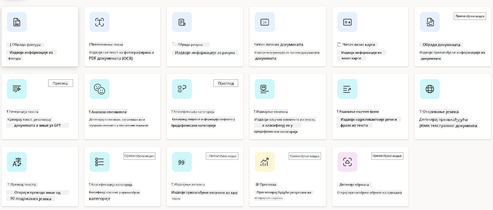
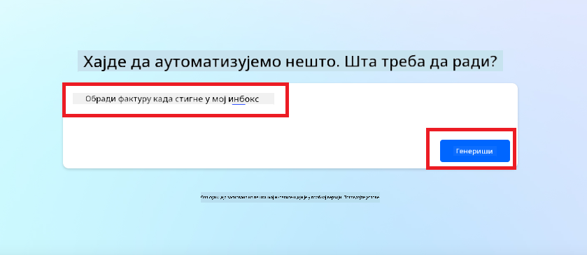
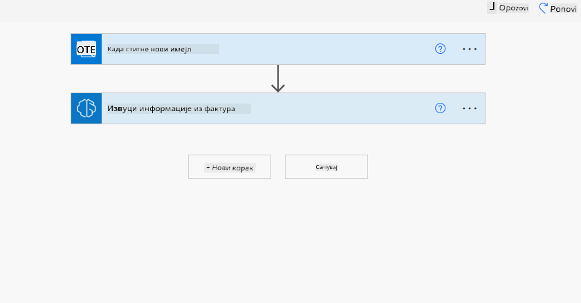
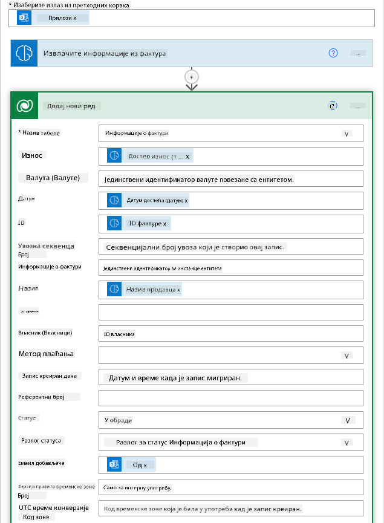
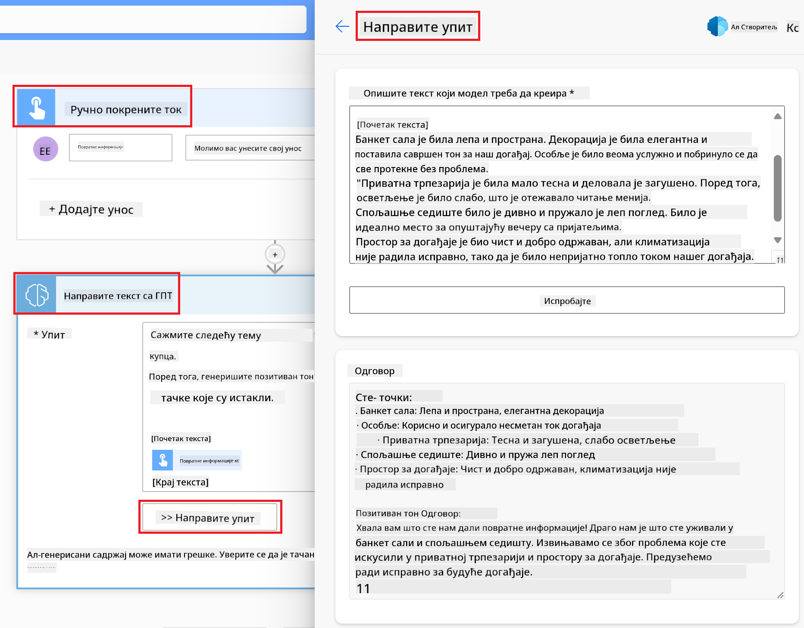

<!--
CO_OP_TRANSLATOR_METADATA:
{
  "original_hash": "f5ff3b6204a695a117d6f452403c95f7",
  "translation_date": "2025-06-25T19:29:58+00:00",
  "source_file": "10-building-low-code-ai-applications/README.md",
  "language_code": "sr"
}
-->
# Изградња AI апликација са малим кодом

## Увод

Сада када смо научили како да изградимо апликације за генерисање слика, хајде да причамо о малом коду. Генеративни AI може се користити за различите области, укључујући и мали код, али шта је мали код и како можемо додати AI у њега?

Изградња апликација и решења постала је лакша за традиционалне програмере и оне који то нису, кроз употребу платформи за развој са малим кодом. Платформе за развој са малим кодом омогућавају вам да изградите апликације и решења уз мало или нимало кода. То се постиже пружањем визуелног окружења за развој које омогућава да превлачите и испуштате компоненте како бисте изградили апликације и решења. Ово вам омогућава да изградите апликације и решења брже и са мање ресурса. У овој лекцији, детаљно ћемо истражити како да користите мали код и како да побољшате развој са малим кодом уз AI користећи Power Platform.

Power Platform пружа организацијама могућност да оснаже своје тимове да сами изграде своја решења кроз интуитивно окружење са малим кодом или без кода. Ово окружење помаже у поједностављењу процеса изградње решења. Са Power Platform-ом, решења могу бити изграђена у данима или недељама уместо месецима или годинама. Power Platform се састоји од пет кључних производа: Power Apps, Power Automate, Power BI, Power Pages и Copilot Studio.

Ова лекција обухвата:

- Увод у Генеративни AI у Power Platform-у
- Увод у Copilot и како га користити
- Коришћење Генеративног AI за изградњу апликација и токова у Power Platform-у
- Разумевање AI модела у Power Platform-у са AI Builder-ом

## Циљеви учења

До краја ове лекције, моћи ћете:

- Разумети како Copilot функционише у Power Platform-у.

- Изградити апликацију за праћење задатака студената за наш образовни стартуп.

- Изградити ток обраде фактура који користи AI за извлачење информација из фактура.

- Применити најбоље праксе приликом коришћења модела GPT AI за креирање текста.

Алатке и технологије које ћете користити у овој лекцији су:

- **Power Apps**, за апликацију за праћење задатака студената, која пружа окружење за развој са малим кодом за изградњу апликација за праћење, управљање и интеракцију са подацима.

- **Dataverse**, за чување података за апликацију за праћење задатака студената где Dataverse пружа платформу за податке са малим кодом за чување података апликације.

- **Power Automate**, за ток обраде фактура где ћете имати окружење за развој са малим кодом за изградњу токова рада за аутоматизацију процеса обраде фактура.

- **AI Builder**, за AI модел обраде фактура где ћете користити унапред изграђене AI моделе за обраду фактура за наш стартуп.

## Генеративни AI у Power Platform-у

Побољшање развоја и апликација са малим кодом уз генеративни AI је кључна област фокуса за Power Platform. Циљ је омогућити свима да изграде апликације са AI, сајтове, контролне табле и аутоматизују процесе са AI, _без потребе за било каквим експертизом из области науке о подацима_. Овај циљ се постиже интеграцијом генеративног AI у искуство развоја са малим кодом у Power Platform-у у облику Copilot-а и AI Builder-а.

### Како то функционише?

Copilot је AI асистент који вам омогућава да изградите решења Power Platform-а описујући ваше захтеве у серији корака кроз природни језик. На пример, можете упутити свог AI асистента да наведе које ће поља ваша апликација користити и он ће креирати и апликацију и основни модел података или можете специфицирати како да поставите ток у Power Automate-у.

Можете користити функционалности покретане Copilot-ом као функцију на екранима ваше апликације да омогућите корисницима да открију увиде кроз разговорне интеракције.

AI Builder је могућност AI-а са малим кодом доступна у Power Platform-у која вам омогућава да користите AI моделе да вам помогну да аутоматизујете процесе и предвиђате исходе. Са AI Builder-ом можете довести AI у ваше апликације и токове који се повезују са вашим подацима у Dataverse-у или у различитим облачним изворима података, као што су SharePoint, OneDrive или Azure.

Copilot је доступан у свим производима Power Platform-а: Power Apps, Power Automate, Power BI, Power Pages и Power Virtual Agents. AI Builder је доступан у Power Apps-у и Power Automate-у. У овој лекцији, фокусираћемо се на то како да користимо Copilot и AI Builder у Power Apps-у и Power Automate-у да изградимо решење за наш образовни стартуп.

### Copilot у Power Apps-у

Као део Power Platform-а, Power Apps пружа окружење за развој са малим кодом за изградњу апликација за праћење, управљање и интеракцију са подацима. То је пакет услуга за развој апликација са скалабилном платформом за податке и могућношћу повезивања са облачним услугама и локалним подацима. Power Apps омогућава да изградите апликације које раде на претраживачима, таблетима и телефонима, и могу се делити са сарадницима. Power Apps олакшава корисницима развој апликација са једноставним интерфејсом, тако да сваки пословни корисник или професионални програмер може изградити прилагођене апликације. Искуство развоја апликација је такође побољшано уз Генеративни AI кроз Copilot.

Copilot AI асистент функција у Power Apps-у омогућава вам да опишете какву апликацију вам је потребно и које информације желите да ваша апликација прати, прикупља или приказује. Copilot затим генерише одзивну Canvas апликацију на основу вашег описа. Можете затим прилагодити апликацију да задовољи ваше потребе. AI Copilot такође генерише и предлаже Dataverse табелу са пољима која су вам потребна за чување података које желите да пратите и неким примерима података. Погледаћемо шта је Dataverse и како га можете користити у Power Apps-у у овој лекцији касније. Можете затим прилагодити табелу да задовољи ваше потребе користећи AI Copilot асистент функцију кроз разговорне кораке. Ова функција је лако доступна са почетног екрана Power Apps-а.

### Copilot у Power Automate-у

Као део Power Platform-а, Power Automate омогућава корисницима да креирају аутоматизоване токове између апликација и услуга. Помаже у аутоматизацији репетитивних пословних процеса као што су комуникација, прикупљање података и одобравање одлука. Његов једноставан интерфејс омогућава корисницима са сваким нивоом техничке компетенције (од почетника до искусних програмера) да аутоматизују радне задатке. Искуство развоја токова рада је такође побољшано уз Генеративни AI кроз Copilot.

Copilot AI асистент функција у Power Automate-у омогућава вам да опишете какав ток вам је потребан и које акције желите да ваш ток изврши. Copilot затим генерише ток на основу вашег описа. Можете затим прилагодити ток да задовољи ваше потребе. AI Copilot такође генерише и предлаже акције које су вам потребне да извршите задатак који желите да аутоматизујете. Погледаћемо шта су токови и како их можете користити у Power Automate-у у овој лекцији касније. Можете затим прилагодити акције да задовољи ваше потребе користећи AI Copilot асистент функцију кроз разговорне кораке. Ова функција је лако доступна са почетног екрана Power Automate-а.

## Задатак: Управљање задацима студената и фактурама за наш стартуп, користећи Copilot

Наш стартуп пружа онлајн курсеве студентима. Стартуп је брзо растао и сада се бори да одржи корак са потражњом за својим курсевима. Стартуп је ангажовао вас као Power Platform програмера да им помогнете да изградите решење са малим кодом које ће им помоћи да управљају задацима студената и фактурама. Њихово решење би требало да им помогне да прате и управљају задацима студената кроз апликацију и аутоматизују процес обраде фактура кроз ток рада. Замолили су вас да користите Генеративни AI за развој решења.

Када започињете са коришћењем Copilot-а, можете користити [Power Platform Copilot Prompt Library](https://github.com/pnp/powerplatform-prompts?WT.mc_id=academic-109639-somelezediko) да започнете са упутствима. Ова библиотека садржи списак упутстава која можете користити да изградите апликације и токове са Copilot-ом. Такође можете користити упутства у библиотеци да добијете идеју о томе како да опишете своје захтеве Copilot-у.

### Изградите апликацију за праћење задатака студената за наш стартуп

Едукатори у нашем стартупу су се борили да прате задатке студената. Користили су табелу за праћење задатака, али то је постало тешко управљати како је број студената повећан. Замолили су вас да изградите апликацију која ће им помоћи да прате и управљају задацима студената. Апликација треба да им омогући да додају нове задатке, прегледају задатке, ажурирају задатке и бришу задатке. Апликација такође треба да омогући едукаторима и студентима да прегледају задатке који су оцењени и оне који нису оцењени.

Изградићете апликацију користећи Copilot у Power Apps-у пратећи кораке испод:

1. Идите на [Power Apps](https://make.powerapps.com?WT.mc_id=academic-105485-koreyst) почетни екран.

1. Користите текстуално поље на почетном екрану да опишете апликацију коју желите да изградите. На пример, **_Желим да изградим апликацију за праћење и управљање задацима студената_**. Кликните на дугме **Пошаљи** да пошаљете упутство AI Copilot-у.

1. AI Copilot ће предложити Dataverse табелу са пољима која су вам потребна за чување података које желите да пратите и неким примерима података. Можете затим прилагодити табелу да задовољи ваше потребе користећи AI Copilot асистент функцију кроз разговорне кораке.

1. Едукатори желе да шаљу е-пошту студентима који су предали своје задатке како би их обавестили о напретку њихових задатака. Можете користити Copilot да додате ново поље у табелу за чување е-поште студента. На пример, можете користити следеће упутство да додате ново поље у табелу: **_Желим да додам колону за чување е-поште студента_**. Кликните на дугме **Пошаљи** да пошаљете упутство AI Copilot-у.

1. AI Copilot ће генерисати ново поље и можете затим прилагодити поље да задовољи ваше потребе.

1. Када завршите са табелом, кликните на дугме **Креирај апликацију** да креирате апликацију.

1. AI Copilot ће генерисати одзивну Canvas апликацију на основу вашег описа. Можете затим прилагодити апликацију да задовољи ваше потребе.

1. Да би едукатори слали е-пошту студентима, можете користити Copilot да додате нови екран у апликацију. На пример, можете користити следеће упутство да додате нови екран у апликацију: **_Желим да додам екран за слање е-поште студентима_**. Кликните на дугме **Пошаљи** да пошаљете упутство AI Copilot-у.

1. AI Copilot ће генерисати нови екран и можете затим прилагодити екран да задовољи ваше потребе.

1. Када завршите са апликацијом, кликните на дугме **Сачувај** да сачувате апликацију.

1. Да бисте поделили апликацију са едукаторима, кликните на дугме **Подели** и затим поново кликните на дугме **Подели**. Можете затим поделити апликацију са едукаторима уношењем њихових е-адреса.

> **Ваш домаћи задатак**: Апликација коју сте управо изградили је добар почетак, али може бити побољшана. Са функцијом е-поште, едукатори могу слати е-пошту студентима само ручно тако што морају да унесу њихове е-адресе. Можете ли користити Copilot да изградите аутоматизацију која ће омогућити едукаторима да шаљу е-пошту студентима аутоматски када предају своје задатке? Ваш савет је да са правим упутством можете користити Copilot у Power Automate-у да изградите ово.

### Изградите табелу информација о фактурама за наш стартуп

Финансијски тим нашег стартупа се борио да прати фактуре. Користили су табелу за праћење фактура, али то је постало тешко управљати како је број фактура повећан. Замолили су вас да изградите табелу која ће им помоћи да чувају, прате и управљају информацијама о фактурама које примају. Табела треба да се користи за изградњу аутоматизације која ће извући све информације о фактурама и чувати их у табели. Табела такође треба да омогући финансијском тиму да прегледа фактуре које су плаћене и оне које нису плаћене.

Power Platform има основну платформу за податке под називом Dataverse која вам омогућава да чувате податке за ваше апликације и решења. Dataverse пружа платформу за податке са малим кодом за чување података апликације. То је у потпуности управљена услуга која сигурно чува податке у Microsoft Cloud-у и обезбеђена је у вашем Power Platform окружењу. Долази са уграђеним могућностима управљања подацима, као што су класификација података, порекло података, фино управљање приступом и још много тога. Можете сазнати више [о Dataverse-у овде](https://docs.microsoft.com/powerapps/maker/data-platform/data-platform-intro?WT.mc_id=academic-109639-somelezediko).

Зашто треба да користимо Dataverse за наш стартуп? Стандардне и прилагођене табеле унутар Dataverse-а пружају сигурну и облачну опцију за
текст. - **Анализа сентимента**: Овај модел детектује позитиван, негативан, неутралан или мешовит сентимент у тексту. - **Читач визиткарти**: Овај модел извлачи информације са визиткарти. - **Препознавање текста**: Овај модел извлачи текст из слика. - **Детекција објеката**: Овај модел детектује и извлачи објекте из слика. - **Обрада докумената**: Овај модел извлачи информације из образаца. - **Обрада фактура**: Овај модел извлачи информације из фактура. Са прилагођеним AI моделима можете донети свој модел у AI Builder тако да може функционисати као било који прилагођени AI Builder модел, омогућавајући вам да обучите модел користећи своје податке. Можете користити ове моделе за аутоматизацију процеса и предвиђање исхода у Power Apps и Power Automate. Када користите свој модел, постоје ограничења која важе. Прочитајте више о овим [ограничењима](https://learn.microsoft.com/ai-builder/byo-model#limitations?WT.mc_id=academic-105485-koreyst).  ## Задатак #2 - Изградња тока обраде фактура за нашу стартап компанију Финансијски тим има проблема са обрадом фактура. Користили су табелу за праћење фактура, али ово је постало тешко управљати како се број фактура повећао. Замолили су вас да изградите ток рада који ће им помоћи у обради фактура користећи AI. Ток рада би требао омогућити извлачење информација из фактура и њихово складиштење у Dataverse табели. Ток рада би такође требао омогућити слање имејла финансијском тиму са извученим информацијама. Сада када знате шта је AI Builder и зашто га треба користити, погледајмо како можете користити AI модел за обраду фактура у AI Builder-у, који смо раније покрили, да изградите ток рада који ће помоћи финансијском тиму у обради фактура. Да бисте изградили ток рада који ће помоћи финансијском тиму у обради фактура користећи AI модел за обраду фактура у AI Builder-у, следите следеће кораке: 1. Идите на почетну страницу [Power Automate](https://make.powerautomate.com?WT.mc_id=academic-105485-koreyst). 2. Користите текстуално поље на почетној страници да опишете ток рада који желите да изградите. На пример, **_Обради фактуру када стигне у мој поштански сандучић_**. Кликните на дугме **Пошаљи** да пошаљете упит AI Copilot-у.  3. AI Copilot ће предложити акције које треба да извршите да бисте аутоматизовали задатак који желите. Можете кликнути на дугме **Следеће** да прођете кроз следеће кораке. 4. У следећем кораку, Power Automate ће вас упутити да подесите везе потребне за ток. Када завршите, кликните на дугме **Креирај ток** да креирате ток. 5. AI Copilot ће генерисати ток и онда можете прилагодити ток да задовољи ваше потребе. 6. Ажурирајте окидач тока и подесите **Фолдер** на фасциклу где ће се чувати фактуре. На пример, можете поставити фолдер на **Инбокс**. Кликните на **Прикажи напредне опције** и поставите **Само са прилозима** на **Да**. Ово ће осигурати да се ток покреће само када се у фасцикли прими имејл са прилогом. 7. Уклоните следеће акције из тока: **HTML у текст**, **Compose**, **Compose 2**, **Compose 3** и **Compose 4** јер их нећете користити. 8. Уклоните акцију **Услов** из тока јер је нећете користити. Требало би да изгледа као на следећем снимку екрана:  9. Кликните на дугме **Додај акцију** и потражите **Dataverse**. Изаберите акцију **Додај нови ред**. 10. На акцији **Извлачење информација из фактура**, ажурирајте **Фајл фактуре** да показује на **Садржај прилога** из имејла. Ово ће осигурати да ток извлачи информације из прилога фактуре. 11. Изаберите **Табелу** коју сте раније креирали. На пример, можете изабрати табелу **Информације о фактури**. Изаберите динамички садржај из претходне акције да попуните следећа поља: - ID - Износ - Датум - Име - Статус - Поставите **Статус** на **На чекању**. - Имејл добављача - Користите **Од** динамички садржај из окидача **Када стигне нови имејл**.  12. Када завршите са током, кликните на дугме **Сачувај** да сачувате ток. Можете онда тестирати ток слањем имејла са фактуром у фасциклу коју сте навели у окидачу. > **Ваш домаћи задатак**: Ток који сте управо изградили је добар почетак, сада треба да размислите како можете изградити аутоматизацију која ће омогућити нашем финансијском тиму да пошаље имејл добављачу да их обавести о тренутном статусу њихове фактуре. Ваш наговештај: ток мора да се покрене када се статус фактуре промени.

## Користите AI модел за генерисање текста у Power Automate

Креирање текста са GPT AI моделом у AI Builder-у омогућава вам да генеришете текст на основу упита и покреће га Microsoft Azure OpenAI услуга. Са овом могућношћу, можете укључити GPT (Генеративни пре-тренирани трансформатор) технологију у своје апликације и токове да изградите различите аутоматизоване токове и проницљиве апликације.

GPT модели пролазе кроз опсежну обуку на огромним количинама података, омогућавајући им да произведу текст који блиско подсећа на људски језик када им се пружи упит. Када се интегришу са аутоматизацијом токова рада, AI модели као што је GPT могу се искористити за поједностављење и аутоматизацију широког спектра задатака.

На пример, можете изградити токове за аутоматско генерисање текста за различите случајеве употребе, као што су: нацрти имејлова, описи производа и још много тога. Можете такође користити модел за генерисање текста за различите апликације, као што су четботови и апликације за корисничку подршку које омогућавају агентима за корисничку подршку да ефикасно и ефективно одговарају на упите клијената.

Да бисте научили како да користите овај AI модел у Power Automate, прођите кроз модул [Додајте интелигенцију са AI Builder и GPT](https://learn.microsoft.com/training/modules/ai-builder-text-generation/?WT.mc_id=academic-109639-somelezediko).

## Одличан рад! Наставите са учењем

Након завршетка овог часа, погледајте нашу [Колекцију за учење генеративног AI](https://aka.ms/genai-collection?WT.mc_id=academic-105485-koreyst) да наставите да унапређујете своје знање о генеративном AI!

Прелазите на Лекцију 11 где ћемо погледати како да [интегришемо генеративни AI са позивањем функција](../11-integrating-with-function-calling/README.md?WT.mc_id=academic-105485-koreyst)!

**Одричање од одговорности**:  
Овај документ је преведен коришћењем AI услуге за превођење [Co-op Translator](https://github.com/Azure/co-op-translator). Иако се трудимо да обезбедимо тачност, молимо вас да будете свесни да аутоматски преводи могу садржати грешке или нетачности. Оригинални документ на његовом изворном језику треба сматрати ауторитативним извором. За критичне информације, препоручује се професионални људски превод. Не сносимо одговорност за било каква погрешна тумачења или неспоразуме који произилазе из коришћења овог превода.