# Прављење апликација са ниским кодом и вештачком интелигенцијом

[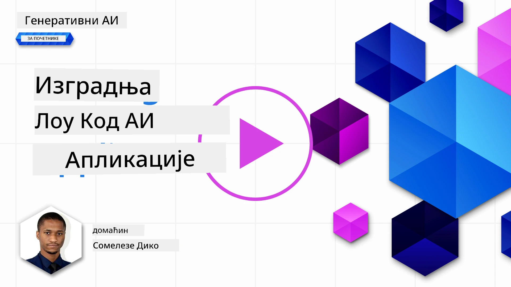](https://youtu.be/1vzq3Nd8GBA?si=h6LHWJXdmqf6mhDg)

> _(Кликните на горњу слику да бисте погледали видео о овом часу)_

## Увод

Сада када смо научили како да правимо апликације за генерисање слика, хајде да причамо о ниском коду. Генеративна вештачка интелигенција може се користити у разним областима укључујући ниски код, али шта је ниски код и како можемо додати вештачку интелигенцију у њега?

Прављење апликација и решења постало је једноставније за традиционалне програмере и оне који нису програмери кроз употребу платформи за развој са ниским кодом. Платформе за развој ниског кода омогућавају вам да правите апликације и решења са мало или нимало кодирања. Ово се постиже пружањем визуелног окружења за развој које вам омогућава да превлачите и одлажете компоненте како бисте правили апликације и решења. Ово омогућава бржу израду апликација и решења уз мање ресурсе. У овом часу дубоко ћемо ући у то како користити ниски код и како побољшати развој ниског кода уз помоћ вештачке интелигенције користећи Power Platform.

Power Platform пружа организацијама могућност да оснаже своје тимове да праве сопствена решења кроз интуитивно окружење за ниски или без кода. Ово окружење помаже поједностављењу процеса изградње решења. Уз Power Platform, решења се могу израдити у року од дана или недеља уместо месеци или година. Power Platform се састоји од пет кључних производа: Power Apps, Power Automate, Power BI, Power Pages и Copilot Studio.

Овај час обухвата:

- Увод у генеративну вештачку интелигенцију у Power Platform
- Увод у Copilot и како га користити
- Коришћење генеративне вештачке интелигенције за прављење апликација и протока у Power Platform
- Разумевање AI модела у Power Platform уз AI Builder
- Прављење интелигентних агената уз Microsoft Copilot Studio

## Циљеви учења

До краја овог часа моћи ћете да:

- Разумете како Copilot ради у Power Platform.

- Направите апликацију за праћење студентских задатака за наш образовни стартап.

- Направите проток за обраду фактура који користи AI да извуче информације из фактура.

- Примените најбоље праксе при коришћењу Create Text са GPT AI моделом.

- Разумете шта је Microsoft Copilot Studio и како правити интелигентне агенте уз њега.

Алати и технологије које ћете користити у овом часу су:

- **Power Apps**, за апликацију праћења студентских задатака, која пружа окружење за развој са ниским кодом за прављење апликација за праћење, управљање и интеракцију са подацима.

- **Dataverse**, за чување података апликације за праћење студентских задатака где Dataverse пружа платформу са ниским кодом за чување података апликације.

- **Power Automate**, за проток обраде фактура где ћете имати окружење за развој са ниским кодом за прављење радних токова који аутоматизују процес обраде фактура.

- **AI Builder**, за AI модел обраде фактура где ћете користити већ уграђене AI моделе за обраду фактура за наш стартап.

## Генеративна вештачка интелигенција у Power Platform

Побољшање развоја и примене ниског кода уз генеративну вештачку интелигенцију је кључно подручје за Power Platform. Циљ је омогућити свакоме да прави апликације, сајтове, табле и аутоматизује процесе уз помоћ AI, _без потребе за експертизом у науци о подацима_. Овај циљ се постиже интегрисањем генеративне AI у искуство развоја са ниским кодом у Power Platform у облику Copilot-а и AI Builder-а.

### Како ово функционише?

Copilot је AI асистент који вам омогућава да правите решења у Power Platform описујући своје захтеве у низу разговорних корака користећи природни језик. На пример, можете упутити вашег AI асистента да наведе која поља ваша апликација треба да користи и он ће направити и апликацију и основни модел података или можете одредити како да подесите проток у Power Automate.

Можете користити функционалности вођене Copilot-ом као функцију у вашим апликацијама да би корисници открили увид кроз разговорне интеракције.

AI Builder је могућност ниског кода за вештачку интелигенцију доступна у Power Platform која вам омогућава да користите AI моделе да бисте аутоматизовали процесе и предвидели исходе. Са AI Builder-ом можете донети AI у ваше апликације и протоке који се повезују са вашим подацима у Dataverse или у различитим облачним изворима података као што су SharePoint, OneDrive или Azure.

Copilot је доступан у свим производима Power Platform-а: Power Apps, Power Automate, Power BI, Power Pages и Copilot Studio (раније Power Virtual Agents). AI Builder је доступан у Power Apps и Power Automate. У овом часу фокусираћемо се на коришћење Copilot-а и AI Builder-а у Power Apps и Power Automate за прављење решења за наш образовни стартап.

### Copilot у Power Apps

Као део Power Platform-а, Power Apps пружа окружење за развој са ниским кодом за прављење апликација за праћење, управљање и интеракцију са подацима. То је скуп услуга за развој апликација са скалабилном платформом података и могућношћу повезивања са облачним сервисима и локалним подацима. Power Apps вам омогућава да правите апликације које раде у прегледачима, на таблетима и телефонима, и које се могу делити са сарадницима. Power Apps олакшава корисницима улазак у развој апликација једноставним интерфејсом, тако да сваки пословни корисник или професионални програмер може направити прилагођене апликације. Искуство развоја апликација је такође побољшано генеративном вештачком интелигенцијом кроз Copilot.

Функција AI асистента Copilot у Power Apps омогућава вам да опишете какву апликацију вам треба и које информације желите да ваша апликација прати, сакупља или приказује. Copilot затим генерише реагујућу Canvas апликацију на основу вашег описа. Затим можете прилагодити апликацију својим потребама. AI Copilot такође генерише и предлаже Dataverse табелу са пољима која су вам потребна за чување података које желите да пратите и неке примерке података. У овом часу ћемо касније погледати шта је Dataverse и како га можете користити у Power Apps. Затим можете прилагодити табелу својим потребама користећи AI Copilot асистента кроз разговорне кораке. Ова функција је лако доступна са почетног екрана Power Apps.

### Copilot у Power Automate

Као део Power Platform-а, Power Automate омогућава корисницима да креирају аутоматизоване радне токове између апликација и сервиса. Помоћ је у аутоматизацији понављајућих пословних процеса као што су комуникација, прикупљање података и одобрења одлука. Једноставан интерфејс омогућава корисницима свих техничких нивоа (од почетника до искусних програмера) да аутоматизују пословне задатке. Искуство развоја радних токова је такође побољшано генеративним AI-јем кроз Copilot.

Функција AI асистента Copilot у Power Automate омогућава вам да опишете какв проток вам треба и које акције желите да ваш проток изврши. Copilot затим генерише проток на основу вашег описа. Затим можете прилагодити проток својим потребама. AI Copilot такође генерише и предлаже акције које су потребне за извршење задатка који желите да аутоматизујете. У овом часу ћемо касније научити шта су протици и како их користити у Power Automate. Затим можете прилагодити акције својим потребама користећи AI Copilot асистент кроз разговорне кораке. Ова функција је лако доступна са почетног екрана Power Automate.

## Прављење интелигентних агената уз Microsoft Copilot Studio

[Microsoft Copilot Studio](https://learn.microsoft.com/microsoft-copilot-studio/fundamentals-what-is-copilot-studio?WT.mc_id=academic-105485-koreyst) (раније Power Virtual Agents) је нискодни члан Power Platform-а за прављење **AI агената** — разговорних копилота који могу одговарати на питања, предузимати радње и аутоматизовати задатке у име ваших корисника. Као и остатак Power Platform-а, ове агенте правите у визуелном, прилагођеном природном језику окружењу: описујете шта желите да агент ради, а Copilot Studio помаже у изради његових упутстава, знања и радњи.

За наш образовни стартап, могли бисте направити агента који одговара на студентска питања о курсевима, проверава рокове задатака и чак шаље е-поруке предавачима — све то без писања кода.

Ево неких од најновијих могућности које чине Copilot Studio моћним:

- **Генеративни одговори из вашег знања**. Уместо ручног креирања сваког дијалога, можете повезати **изворе знања** — јавне сајтове, SharePoint, OneDrive, Dataverse, отпремљене датотеке или корпоративне податке преко конектора — и агент генерише одговоре базиране на њима.

- **Генеративна оркестрација**. Уместо ослањања на круте тригер фразе, агент користи AI да разуме захтев и динамички одлучи која знања, теме и радње комбиновати да би га испунио, укључујући повезивање неколико корака.

- **Акције и конектори**. Агенти могу *радити* ствари, а не само ћаскати. Можете дати агенту акције подржане са преко 1.500 уграђених Power Platform конектора, Power Automate протока, прилагођених REST API-ja, упита, или сервера **Model Context Protocol (MCP)**.

- **Аутономни агенти**. Агенти нису ограничени само на одговоре у прозору за ћаскање. Можете направити **аутономне агенте** који се покрећу догађајима — као што су нови имејл, нови запис у Dataverse или отпремање датотеке — а затим делују у позадини да заврше задатак.

- **Оркестрација више агената**. Агенти могу позивати друге агенте. Copilot Studio агент може препустити задатак или бити проширен од стране других агената, укључујући агенте објављене у Microsoft 365 Copilot и агенте направљене у Microsoft Foundry.

- **Избор модела**. Поред уграђених модела, можете довести моделе из каталога модела Microsoft Foundry да прилагодите како ваш агент разуме и одговара.

- **Објављивање било где**. Када се направи, агент може бити објављен на више канала — Microsoft Teams, Microsoft 365 Copilot, вебсајт или прилагођена апликација и више — са безбедношћу, аутентификацијом и аналитиком управљаним кроз администраторски интерфејс Power Platform-а.

Можете почети са прављењем свог првог агента на [copilotstudio.microsoft.com](https://copilotstudio.microsoft.com?WT.mc_id=academic-105485-koreyst) и сазнати више у [документацији Microsoft Copilot Studio](https://learn.microsoft.com/microsoft-copilot-studio/?WT.mc_id=academic-105485-koreyst).

## Задатак: Управљање студентским задацима и фактурама за наш стартап, користећи Copilot

Наш стартап пружа онлајн курсеве студентима. Стартап је брзо порастао и сада има потешкоћа да испрати захтеве за курсеве. Стартап вас је ангажовао као Power Platform програмера да им помогнете да направе нискодно решење за управљање студентским задацима и фактурама. Њихово решење треба да омогући праћење и управљање студентским задацима преко апликације и аутоматизацију процеса обраде фактура преко радног тока. Замолили су вас да користите генеративну AI за развој решења.

Када почињете са коришћењем Copilot-а, можете користити [Power Platform Copilot Prompt Library](https://github.com/pnp/powerplatform-prompts?WT.mc_id=academic-109639-somelezediko) да започнете са упитима. Ова библиотека садржи листу упита које можете користити за прављење апликација и протока са Copilot-ом. Такође можете користити упите из библиотеке да бисте стекли идеју како да опишете ваше захтеве Copilot-у.

### Направите апликацију за праћење студентских задатака за наш стартап

Предавачи у нашем стартапу имају потешкоћа да прате студентске задатке. Користили су табелу за праћење задатака, али је то постало тешко управљати како се број студената повећава. Затражили су од вас да направите апликацију која ће им помоћи да прате и управљају студентским задацима. Апликација треба да омогући додавање нових задатака, преглед задатака, ажурирање и брисање задатака. Апликација треба такође омогућити предавачима и студентима преглед задатака који су оцењени и оних који нису оцењени.

Направићете апликацију користећи Copilot у Power Apps пратећи следеће кораке:

1. Отидите на почетни екран [Power Apps](https://make.powerapps.com?WT.mc_id=academic-105485-koreyst).

1. Користите поље за текст на почетном екрану да опишете апликацију коју желите да направите. На пример, **_Желим да направим апликацију за праћење и управљање студентским задацима_**. Кликните на дугме **Пошаљи** да пошаљете упит AI Copilot-у.

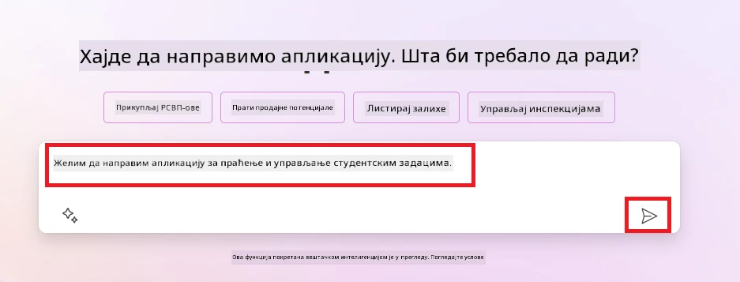

1. AI Copilot ће предложити Dataverse табелу са пољима која су вам потребна за чување података које желите да пратите и неки пример података. Затим можете прилагодити табелу својим потребама користећи AI Copilot асистента кроз разговорне кораке.

   > **Важна напомена**: Dataverse је основна платформа података за Power Platform. То је платформа података са ниским кодом за чување података апликације. Је потпуно управљана услуга која безбедно чува податке у Microsoft облаку и је обезбеђена у вашем Power Platform окружењу. Долази са уграђеним могућностима управљања подацима, као што су класификација података, праћење порекла података, фина контрола приступа и још много тога. Више о Dataverse можете сазнати [овде](https://learn.microsoft.com/power-apps/maker/data-platform/data-platform-intro?WT.mc_id=academic-109639-somelezediko).

   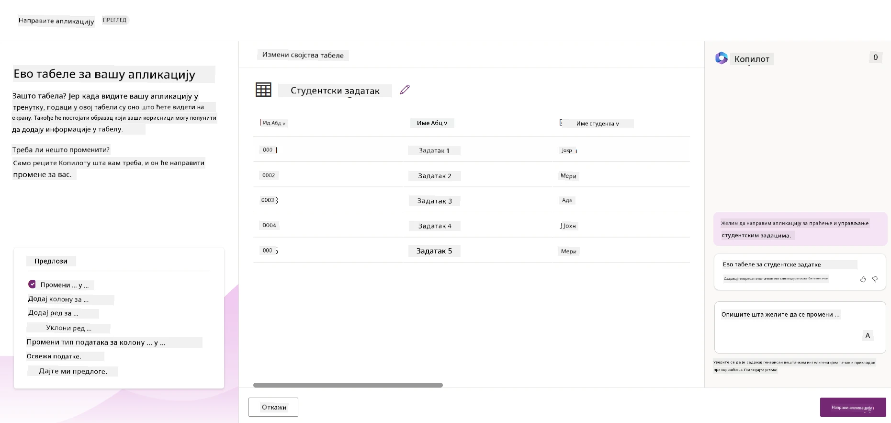

1. Предавачи желе да шаљу имејлове студентима који су предали своје задатке како би их обавештавали о напретку њихових задатака. Можете користити Copilot да додате ново поље у табелу за чување студентског имејла. На пример, можете користити следећи упит да додате ново поље у табелу: **_Желим да додам колону за чување студентског имејла_**. Кликните на дугме **Пошаљи** да пошаљете упит AI Copilot-у.

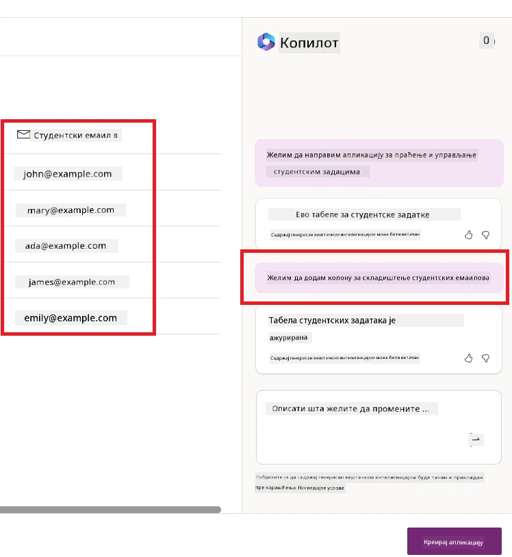

1. AI Copilot ће генерисати ново поље и затим можете прилагодити поље својим потребама.

1. Када завршите са табелом, кликните на дугме **Create app** да бисте креирали апликацију.

1. AI Copilot ће генерисати одзивну Canvas апликацију на основу вашег описа. Затим можете прилагодити апликацију према вашим потребама.

1. За просветне раднике који желе да шаљу имејлове студентима, можете користити Copilot да додате нови екран у апликацију. На пример, можете користити следећи упит да додате нови екран у апликацију: **_Желим да додам екран за слање имејлова студентима_**. Кликните на дугме **Send** да пошаљете упит AI Copilotu.

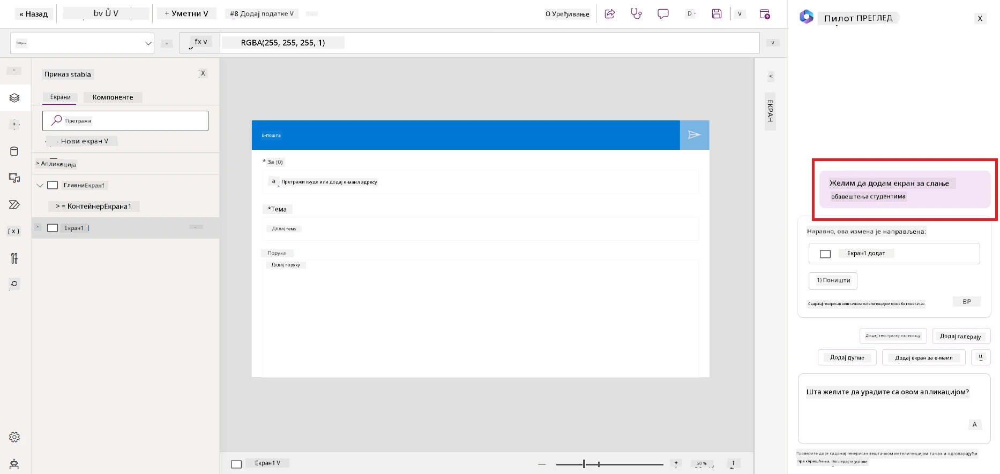

1. AI Copilot ће генерисати нови екран и затим можете прилагодити екран према вашим потребама.

1. Када завршите са апликацијом, кликните на дугме **Save** да бисте сачували апликацију.

1. Да бисте поделили апликацију са наставницима, кликните на дугме **Share**, а затим поново кликните на дугме **Share**. Затим можете поделити апликацију са наставницима тако што ћете унети њихове имејл адресе.

> **Ваш домаћи задатак**: Апликација коју сте управо направили је добар почетак али може бити побољшана. Помоћу функције имејл прослеђивања, наставници могу ручно да шаљу имејлове студентима тако што морају да укуцају њихове имејлове. Можете ли да користите Copilot да направите аутоматизацију која ће омогућити наставницима да аутоматски шаљу имејлове студентима када предају своје задатке? Ваш савет је да уз прави упит можете користити Copilot у Power Automate за ову сврху.

### Креирање табеле информација о фактурама за нашу стартап компанију

Финансијски тим наше стартап компаније има проблем са праћењем фактура. Користили су табелу да прате фактуре, али је постало тешко управљати тим како се број фактура повећава. Затражили су од вас да направите табелу која ће им помоћи да чувају, прате и управљају информацијама о примљеним фактурама. Табела ће се користити за изградњу аутоматизације која ће издвајати све информације о фактурама и чувати их у табели. Табела треба такође да омогући финансијском тиму да види које фактуре су платили, а које нису.

Power Platform се ослања на унутрашњу платформу података под називом Dataverse која вам омогућава да чувате податке за ваше апликације и решења. Dataverse пружа ниско-код платформу за чување података ваше апликације. То је у потпуности управљана услуга која безбедно чува податке у Microsoft Cloud и налази се у оквиру вашег Power Platform окружења. Има уграђене могућности управљања подацима, као што су класификација података, праћење порекла података, фина контрола приступа и више. Можете сазнати више [о Dataverse овде](https://learn.microsoft.com/power-apps/maker/data-platform/data-platform-intro?WT.mc_id=academic-109639-somelezediko).

Зашто бисмо користили Dataverse за нашу стартап компанију? Стандардне и прилагођене табеле у Dataverse пружају безбедну и облачно засновану опцију складиштења за ваше податке. Табеле вам омогућавају да чувате различите типове података, слично као што бисте користили више радних листова у једној Excel радној свесци. Можете користити табеле за чување података специфичних за вашу организацију или пословне потребе. Неке од бенефиција које ће наша стартап компанија добити коришћењем Dataverse укључују али нису ограничене на:

- **Лако за управљање**: И метаподаци и подаци се чувају у облаку, тако да не морате бринути о детаљима како се складиште или управљају. Можете се фокусирати на изградњу својих апликација и решења.

- **Безбедно**: Dataverse пружа безбедну и облачно засновану опцију складиштења за ваше податке. Можете контролисати ко има приступ подацима у вашим табелама и како могу да им приступе користећи безбедност засновану на улогама.

- **Богати метаподаци**: Типови података и везе се користе директно у Power Apps

- **Логика и валидација**: Можете користити пословна правила, израчуната поља и правила валидације да примените пословну логику и одржите тачност података.

Сада када знате шта је Dataverse и зашто га треба користити, хајде да видимо како можете користити Copilot да креирате табелу у Dataverse која ће испунити захтеве нашег финансијског тима.

> **Напомена** : Користићете ову табелу у следећем одељку да бисте развили аутоматизацију која ће издвојити све информације из фактура и чувати их у табели.

Да бисте креирали табелу у Dataverse користећи Copilot, следите доленаведене кораке:

1. Идите на почетни екран [Power Apps](https://make.powerapps.com?WT.mc_id=academic-105485-koreyst).

2. У левом навигационом менију изаберите **Tables**, а затим кликните на **Describe the new Table**.

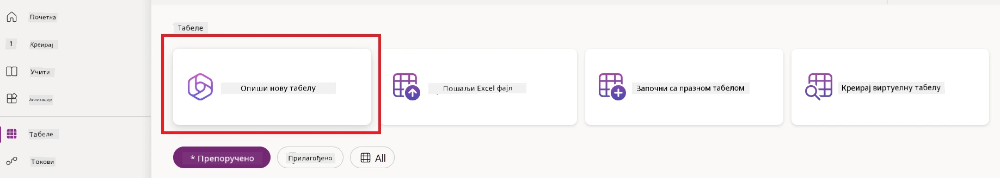

1. На екрану **Describe the new Table**, користите текстуално поље да опишете табелу коју желите да креирате. На пример, **_Желим да креирам табелу за чување информација о фактурама_**. Кликните на дугме **Send** да пошаљете упит AI Copilot-у.

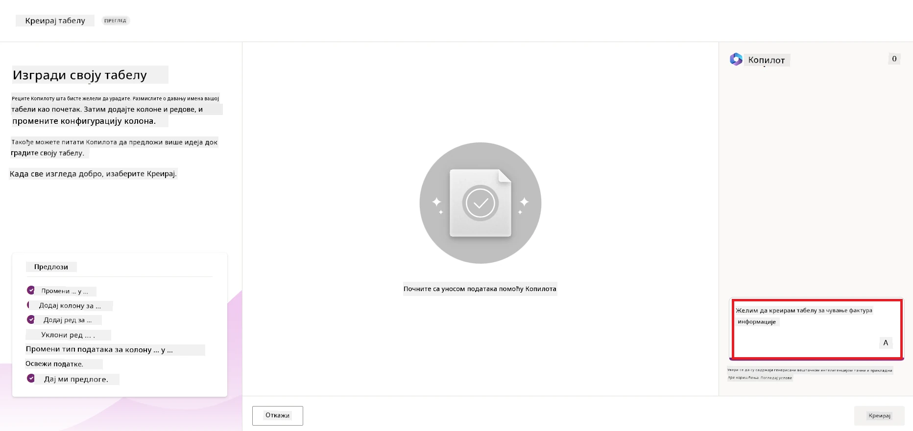

1. AI Copilot ће предложити Dataverse табелу са пољима која су вам потребна да бисте чували податке које желите да пратите, као и неке примерке података. Затим можете прилагодити табелу према вашим потребама користећи Copilot асистента кроз разговорне кораке.

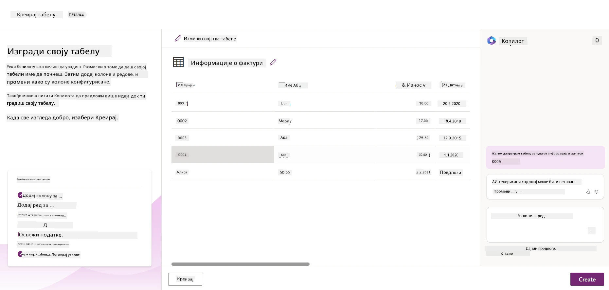

1. Финансијски тим жели да пошаље имејл добављачу да га обавести о тренутном статусу њихове фактуре. Можете користити Copilot да додате ново поље у табелу за чување имејла добављача. На пример, можете користити следећи упит да додате ново поље у табелу: **_Желим да додам колону за чување имејла добављача_**. Кликните на дугме **Send** да пошаљете упит AI Copilot-у.

1. AI Copilot ће генерисати ново поље и затим га можете прилагодити по својој потреби.

1. Када завршите са табелом, кликните на дугме **Create** да бисте креирали табелу.

## AI модели у Power Platform са AI Builder

AI Builder је могућност ниског кода заснована на вештачкој интелигенцији доступна у Power Platform која вам омогућава да користите AI моделе како бисте аутоматизовали процесе и предвидели резултате. Помоћу AI Builder-а можете унети AI у своје апликације и токове који се повезују са вашим подацима у Dataverse-у или у разним облачним изворима података, као што су SharePoint, OneDrive или Azure.

## Унапред изграђени AI модели у односу на прилагођене AI моделе

AI Builder пружа два типа AI модела: унапред изграђене AI моделе и прилагођене AI моделе. Унапред изграђени AI модели су спремни за коришћење, обучени од стране Microsoft-а и доступни у Power Platform. Ови модели вам помажу да додате интелигенцију у своје апликације и токове без потребе да прикупљате податке и затим правите, обучавате и објављујете своје моделе. Можете користити ове моделе да аутоматизујете процесе и предвидите резултате.

Неки од унапред изграђених AI модела доступних у Power Platform укључују:

- **Издвајање кључних фраза**: Овај модел издваја кључне фразе из текста.
- **Препознавање језика**: Овај модел препознаје језик текста.
- **Анализа сентимента**: Овај модел детектује позитиван, негативан, неутралан или мешовити сентимент у тексту.
- **Читање визит карти**: Овај модел извлачи информације из визит карти.
- **Препознавање текста**: Овај модел извлачи текст из слика.
- **Откривање предмета**: Овај модел детектује и извлачи предмете са слика.
- **Обрада докумената**: Овај модел извлачи информације из образаца.
- **Обрада фактура**: Овај модел извлачи информације из фактура.

Са прилагођеним AI моделима можете унети свој модел у AI Builder тако да функционише као било који прилагођени AI Builder модел, омогућавајући вам да обучите модел користећи своје податке. Можете користити ове моделе за аутоматизацију процеса и предвиђање резултата у Power Apps-у и Power Automate-у. Када користите свој модел, примењују се ограничења. Прочитајте више о тим [ограничењима](https://learn.microsoft.com/ai-builder/byo-model#limitations?WT.mc_id=academic-105485-koreyst).

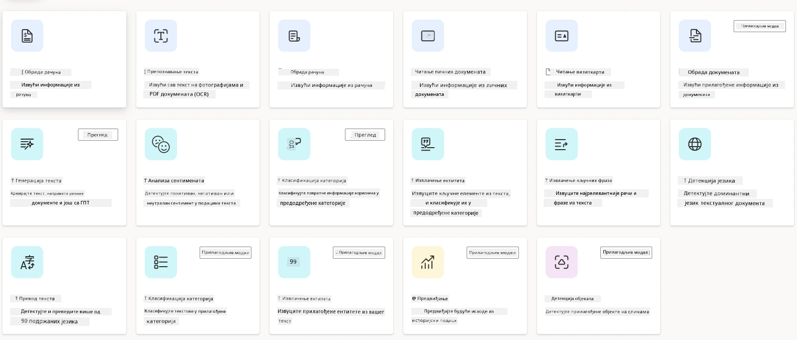

## Задатак #2 - Креирање тока за обраду фактура за нашу стартап компанију

Финансијски тим има проблем са обрадом фактура. Користили су табелу да прате фактуре, али је постало тешко управљати тим како се број фактура повећава. Затражили су од вас да направите ток рада који ће им помоћи да обрађују фактуре користећи AI. Ток рада треба да им омогући да издвајају информације из фактура и чувају те информације у Dataverse табели. Ток рада треба такође да им омогући да пошаљу имејл финансијском тиму са издвојеним информацијама.

Сада када знате шта је AI Builder и зашто га треба користити, хајде да видимо како можете користити AI модел за обраду фактура у AI Builder-у, који смо раније покрили, да креирате ток рада који ће помоћи финансијском тиму да обрађује фактуре.

Да бисте креирали ток рада који ће помоћи финансијском тиму да обрађује фактуре користећи AI модел за обраду фактура у AI Builder-у, следите следеће кораке:

1. Идите на почетни екран [Power Automate](https://make.powerautomate.com?WT.mc_id=academic-105485-koreyst).

2. Користите текстуално поље на почетном екрану да опишете ток рада који желите да креирате. На пример, **_Обрадуј фактуру када стигне у мој мејл бокс_**. Кликните на дугме **Send** да пошаљете упит AI Copilotu.

   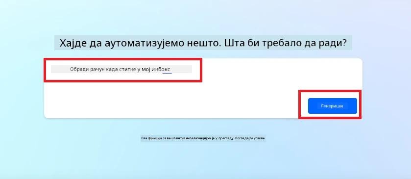

3. AI Copilot ће предложити акције које треба извршити да бисте аутоматизовали жељени задатак. Можете кликнути на дугме **Next** да прођете кроз следеће кораке.

4. У следећем кораку, Power Automate ће вас затражити да подесите везе неопходне за ток. Када завршите, кликните на дугме **Create flow** да бисте креирали ток.

5. AI Copilot ће генерисати ток и затим га можете прилагодити према вашим потребама.

6. Ажурирајте тригер тока и подесите **Folder** на фасциклу где ће фактуре бити сачуване. На пример, можете подесити фасциклу на **Inbox**. Кликните на **Show advanced options** и подесите **Only with Attachments** на **Yes**. Ово ће осигурати да ток буде покренут само када се у фасцикли прими имејл са прилогом.

7. Уклоните следеће акције из тока: **HTML to text**, **Compose**, **Compose 2**, **Compose 3** и **Compose 4** јер их нећете користити.

8. Уклоните акцију **Condition** из тока јер је нећете користити. Требало би да изгледа као на следећем снимку екрана:

   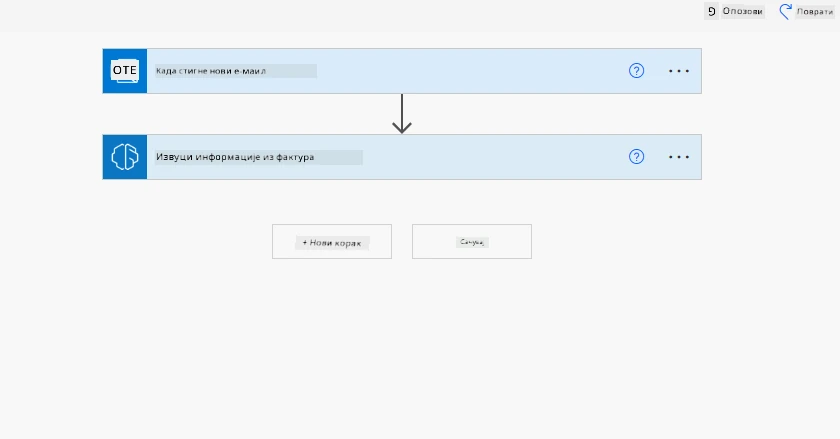

9. Кликните на дугме **Add an action** и потражите **Dataverse**. Изаберите акцију **Add a new row**.

10. На акцији **Extract Information from invoices**, ажурирајте **Invoice File** да указује на **Attachment Content** из имејла. Ово ће осигурати да ток издваја информације из прилога фактуре.

11. Изаберите **Table** коју сте раније направили. На пример, можете изабрати табелу **Invoice Information**. Изаберите динамички садржај из претходне акције да попуните следећа поља:

    - ID
    - Amount
    - Date
    - Name
    - Status - Подесите **Status** на **Pending**.
    - Supplier Email - Користите динамички садржај **From** из тригера **When a new email arrives**.

    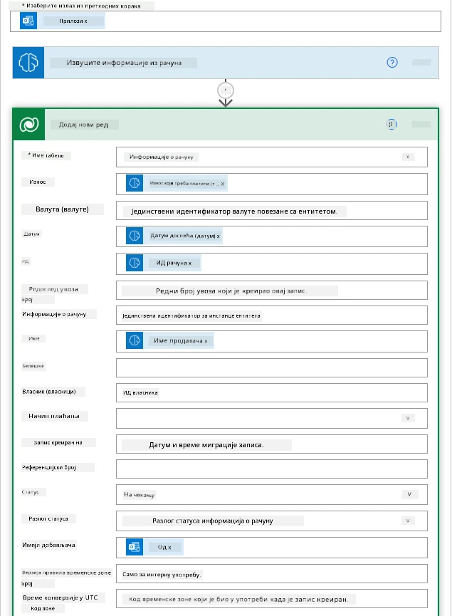

12. Када завршите са током, кликните на дугме **Save** да бисте сачували ток. Затим можете тестирати ток слањем имејла са фактуром у фасциклу коју сте навели у тригеру.

> **Ваш домаћи задатак**: Ток који сте управо направили је добар почетак, сада морате размислити како да направите аутоматизацију која ће омогућити нашем финансијском тиму да пошаље имејл добављачу како би га обавестили о тренутном статусу њихове фактуре. Ваш савет: ток мора да се покрене када се статус фактуре промени.

## Користите AI модел за генерисање текста у Power Automate

AI модел Create Text with GPT у AI Builder-у омогућава вам генерисање текста на основу упита, а покреће га Microsoft Azure OpenAI услуга. Уз ову могућност можете интегрисати GPT (Generative Pre-Trained Transformer) технологију у своје апликације и токове да бисте изградили разне аутоматизоване токове и информативне апликације.

GPT модели пролазе кроз опсежну обуку на огромним количинама података, што им омогућава да производе текст који веома подсећа на људски језик када добију упит. Када су интегрисани са аутоматизацијом радних токова, AI модели као GPT могу се искористити за поједностављење и аутоматизацију широког спектра задатака.

На пример, можете креирати токове који аутоматски генеришу текст за различите сврхе, као што су: нацрти имејлова, описи производа и још много тога. Такође, модел можете користити за генерисање текста за разне апликације, као што су чат ботови и апликације за корисничку службу које омогућавају агентима корисничке службе да одговоре ефективно и ефикасно на упите корисника.

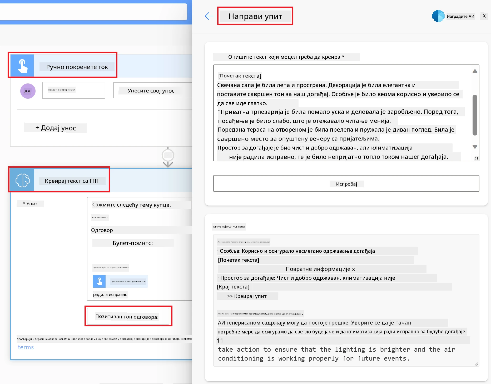

Да бисте научили како да користите овај АИ модел у Power Automate-у, прођите кроз модул [Додајте интелигенцију уз AI Builder и GPT](https://learn.microsoft.com/training/modules/ai-builder-text-generation/?WT.mc_id=academic-109639-somelezediko).

## Одличан посао! Наставите са учењем

Након завршетка овог часа, погледајте нашу [Колекцију за учење генеративне АИ](https://aka.ms/genai-collection?WT.mc_id=academic-105485-koreyst) да бисте наставили да унапређујете своје знање о генеративној АИ!

Желите да прилагодите и извучете више из Copilot-а? Истражите [Awesome Copilot](https://github.com/github/awesome-copilot?WT.mc_id=academic-105485-koreyst) — колекцију инструкција, агената, вештина и конфигурација које доприноси заједница, како бисте максимално искористили GitHub Copilot.

Пребаците се на Час 11 где ћемо видети како да [интегришете генеративну АИ са позивима функција](../11-integrating-with-function-calling/README.md?WT.mc_id=academic-105485-koreyst)!

---

<!-- CO-OP TRANSLATOR DISCLAIMER START -->
**Изјава о одрицању одговорности**:
Овај документ је преведен коришћењем услуге за аутоматски превод [Co-op Translator](https://github.com/Azure/co-op-translator). Иако тежимо тачности, имајте у виду да аутоматски преводи могу садржати грешке или нетачности. Оригинални документ на његовом изворном језику треба сматрати ауторитативним извором. За критичне информације препоручује се професионални људски превод. Нисмо одговорни за било каква неспоразума или погрешна тумачења која произилазе из коришћења овог превода.
<!-- CO-OP TRANSLATOR DISCLAIMER END -->