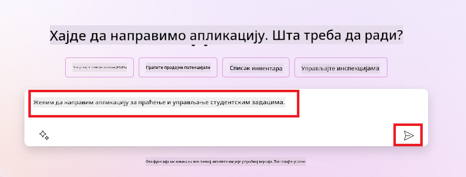
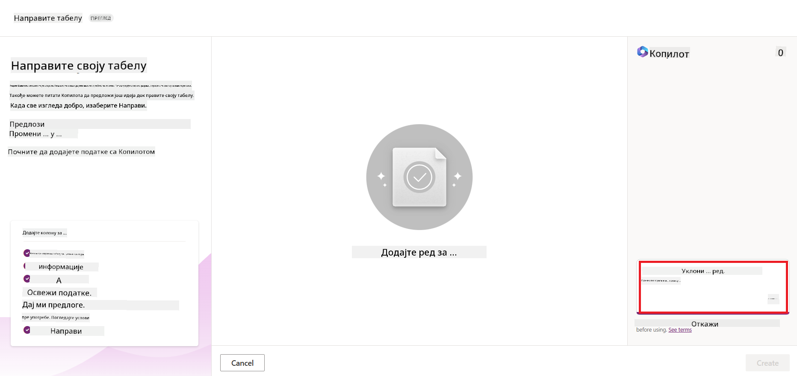

<!--
CO_OP_TRANSLATOR_METADATA:
{
  "original_hash": "f5ff3b6204a695a117d6f452403c95f7",
  "translation_date": "2025-07-09T14:15:16+00:00",
  "source_file": "10-building-low-code-ai-applications/README.md",
  "language_code": "sr"
}
-->
# Израда Low Code AI апликација

> _(Кликните на слику изнад да бисте погледали видео о овој лекцији)_

## Увод

Сада када смо научили како да правимо апликације за генерисање слика, хајде да причамо о low code приступу. Генеративна вештачка интелигенција може се користити у разним областима, укључујући и low code, али шта је low code и како можемо да додамо AI у то?

Прављење апликација и решења постало је једноставније како за традиционалне програмере, тако и за оне који нису програмери, захваљујући Low Code Development Platformama. Ове платформе омогућавају да се апликације и решења праве уз мало или без икаквог кода. То се постиже пружањем визуелног окружења за развој у коме можете превлачити и испуштати компоненте да бисте направили апликације и решења. Ово омогућава бржу израду апликација и решења уз мање ресурса. У овој лекцији ћемо детаљно проучити како користити Low Code и како побољшати low code развој уз помоћ AI користећи Power Platform.

Power Platform пружа организацијама могућност да оснаже своје тимове да сами праве решења кроз интуитивно low-code или no-code окружење. Ово окружење поједностављује процес израде решења. Уз Power Platform, решења се могу направити за дане или недеље, уместо за месеце или године. Power Platform се састоји од пет кључних производа: Power Apps, Power Automate, Power BI, Power Pages и Copilot Studio.

Ова лекција обухвата:

- Увод у Generative AI у Power Platform
- Увод у Copilot и како га користити
- Коришћење Generative AI за прављење апликација и токова у Power Platform
- Разумевање AI модела у Power Platform уз AI Builder

## Циљеви учења

До краја ове лекције моћи ћете да:

- Разумете како Copilot функционише у Power Platform.

- Направите апликацију за праћење студентских задатака за наш образовни стартап.

- Направите ток за обраду фактура који користи AI за извлачење информација из фактура.

- Примените најбоље праксе приликом коришћења Create Text са GPT AI моделом.

Алатке и технологије које ћете користити у овој лекцији су:

- **Power Apps**, за апликацију Student Assignment Tracker, која пружа low-code окружење за развој апликација за праћење, управљање и интеракцију са подацима.

- **Dataverse**, за чување података апликације Student Assignment Tracker, где Dataverse пружа low-code платформу за чување података апликације.

- **Power Automate**, за ток обраде фактура, где ћете имати low-code окружење за развој радних токова за аутоматизацију процеса обраде фактура.

- **AI Builder**, за AI модел обраде фактура, где ћете користити унапред направљене AI моделе за обраду фактура за наш стартап.

## Generative AI у Power Platform

Унапређење low-code развоја и апликација уз генеративни AI је један од главних фокуса Power Platform. Циљ је омогућити свима да праве апликације, сајтове, контролне табле и аутоматизују процесе помоћу AI, _без потребе за стручним знањем из области науке о подацима_. Овај циљ се постиже интеграцијом генеративног AI у low-code развојно искуство у Power Platform кроз Copilot и AI Builder.

### Како ово функционише?

Copilot је AI асистент који вам омогућава да правите Power Platform решења тако што описујете своје захтеве у низу разговорних корака користећи природни језик. На пример, можете упутити свог AI асистента да каже која поља ће ваша апликација користити, и он ће направити и апликацију и основни модел података, или можете одредити како да подесите ток у Power Automate.

Можете користити Copilot функције као опцију у вашим апликацијама да омогућите корисницима да открију увиде кроз разговорне интеракције.

AI Builder је low-code AI могућност доступна у Power Platform која вам омогућава да користите AI моделе за аутоматизацију процеса и предвиђање резултата. Уз AI Builder можете донети AI у ваше апликације и токове који се повезују са подацима у Dataverse или у разним облачним изворима података, као што су SharePoint, OneDrive или Azure.

Copilot је доступан у свим Power Platform производима: Power Apps, Power Automate, Power BI, Power Pages и Power Virtual Agents. AI Builder је доступан у Power Apps и Power Automate. У овој лекцији ћемо се фокусирати на коришћење Copilot и AI Builder у Power Apps и Power Automate за израду решења за наш образовни стартап.

### Copilot у Power Apps

Као део Power Platform, Power Apps пружа low-code окружење за развој апликација за праћење, управљање и интеракцију са подацима. То је скуп услуга за развој апликација са скалабилном платформом података и могућношћу повезивања са облачним сервисима и локалним изворима података. Power Apps вам омогућава да правите апликације које раде у прегледачима, на таблетима и телефонима, и које можете делити са колегама. Power Apps олакшава корисницима улазак у развој апликација једноставним интерфејсом, тако да сваки пословни корисник или професионални програмер може направити прилагођене апликације. Искуство развоја апликација је такође унапређено генеративним AI кроз Copilot.

Copilot AI асистент у Power Apps омогућава вам да опишете какву апликацију желите и које информације треба да прати, прикупља или приказује. Copilot затим генерише одзивну Canvas апликацију на основу вашег описа. Након тога можете прилагодити апликацију према својим потребама. AI Copilot такође генерише и предлаже Dataverse табелу са пољима која су вам потребна за чување података које желите да пратите, као и неке примерке података. У овој лекцији ћемо касније погледати шта је Dataverse и како га користити у Power Apps. Табелу можете прилагодити својим потребама користећи AI Copilot асистента кроз разговорне кораке. Ова функција је лако доступна са почетног екрана Power Apps.

### Copilot у Power Automate

Као део Power Platform, Power Automate омогућава корисницима да креирају аутоматизоване радне токове између апликација и сервиса. Помоћу њега се аутоматизују понављајући пословни процеси као што су комуникација, прикупљање података и одобрења одлука. Једноставан интерфејс омогућава корисницима свих нивоа техничке стручности (од почетника до искусних програмера) да аутоматизују радне задатке. Искуство развоја радних токова је такође унапређено генеративним AI кроз Copilot.

Copilot AI асистент у Power Automate омогућава вам да опишете какву врсту тока желите и које акције треба да изврши. Copilot затим генерише ток на основу вашег описа. Након тога можете прилагодити ток према својим потребама. AI Copilot такође генерише и предлаже акције које су вам потребне да бисте аутоматизовали задатак. У овој лекцији ћемо касније погледати шта су токови и како их користити у Power Automate. Акције можете прилагодити својим потребама користећи AI Copilot асистента кроз разговорне кораке. Ова функција је лако доступна са почетног екрана Power Automate.

## Задатак: Управљање студентским задацима и фактурама за наш стартап, користећи Copilot

Наш стартап пружа онлајн курсеве студентима. Стартап је брзо растао и сада има проблема да прати потражњу за својим курсевима. Запослили су вас као Power Platform програмера да им помогнете да направе low code решење које ће им помоћи да управљају студентским задацима и фактурама. Њихово решење треба да омогући праћење и управљање студентским задацима кроз апликацију и аутоматизацију процеса обраде фактура кроз радни ток. Тражено је да користите Generative AI за развој решења.

Када почнете да користите Copilot, можете користити [Power Platform Copilot Prompt Library](https://github.com/pnp/powerplatform-prompts?WT.mc_id=academic-109639-somelezediko) да бисте започели са упутствима. Ова библиотека садржи листу упита које можете користити за прављење апликација и токова уз Copilot. Такође можете користити упите из библиотеке да бисте добили идеју како да опишете своје захтеве Copilotu.

### Направите апликацију за праћење студентских задатака за наш стартап

Наставници у нашем стартапу имају проблема да прате студентске задатке. Користили су табелу за праћење задатака, али то је постало тешко управљати како се број студената повећавао. Затражили су од вас да направите апликацију која ће им помоћи да прате и управљају студентским задацима. Апликација треба да омогући додавање нових задатака, преглед задатака, ажурирање и брисање задатака. Такође треба да омогући наставницима и студентима да виде задатке који су оцењени и оне који нису.

Апликацију ћете направити користећи Copilot у Power Apps пратећи следеће кораке:

1. Идите на почетни екран [Power Apps](https://make.powerapps.com?WT.mc_id=academic-105485-koreyst).

1. Користите текстуално поље на почетном екрану да опишете апликацију коју желите да направите. На пример, **_Желим да направим апликацију за праћење и управљање студентским задацима_**. Кликните на дугме **Send** да пошаљете упит AI Copilotu.

1. AI Copilot ће предложити Dataverse табелу са пољима која су вам потребна за чување података које желите да пратите, као и неке примерке података. Табелу можете прилагодити својим потребама користећи AI Copilot асистента кроз разговорне кораке.

   > **Важно**: Dataverse је основна платформа података за Power Platform. То је low-code платформа за чување података апликације. Потпуно је управљана услуга која безбедно чува податке у Microsoft облаку и обезбеђена је у вашем Power Platform окружењу. Има уграђене могућности управљања подацима, као што су класификација података, праћење порекла података, прецизна контрола приступа и још много тога. Више о Dataverse-у можете сазнати [овде](https://docs.microsoft.com/powerapps/maker/data-platform/data-platform-intro?WT.mc_id=academic-109639-somelezediko).

   

1. Наставници желе да шаљу е-поруке студентима који су предали задатке како би их обавештавали о напретку. Можете користити Copilot да додате ново поље у табелу за чување студентске е-поште. На пример, можете користити следећи упит да додате нову колону: **_Желим да додам колону за чување студентске е-поште_**. Кликните на дугме **Send** да пошаљете упит AI Copilotu.

1. AI Copilot ће генерисати ново поље које затим можете прилагодити својим потребама.

1. Када завршите са табелом, кликните на дугме **Create app** да бисте креирали апликацију.

1. AI Copilot ће генерисати одзивну Canvas апликацију на основу вашег описа. Након тога можете прилагодити апликацију својим потребама.

1. Да би наставници могли да шаљу е-поруке студентима, можете користити Copilot да додате нови екран у апликацију. На пример, можете користити следећи упит: **_Желим да додам екран за слање е-порука студентима_**. Кликните на дугме **Send** да пошаљете упит AI Copilotu.

1. AI Copilot ће генерисати нови екран који затим можете прилагодити својим потребама.

1. Када завршите са апликацијом, кликните на дугме **Save** да сачувате апликацију.

1. Да бисте поделили апликацију са наставницима, кликните на дугме **Share**, а затим поново на **Share**. Апликацију можете поделити уношењем њихових е-адреса.

> **Ваш домаћи задатак**: Апликација коју сте управо направили је добар почетак, али може се унапредити. Са функцијом слања е-порука, наставници могу само ручно да шаљу поруке студентима тако што уносе њихове е-адресе. Можете ли користити Copilot да направите аутоматизацију која ће омогућити наставницима да аутоматски шаљу е-поруке студентима када предају задатке? Савет је да уз прави упит можете користити Copilot у Power Automate за ову аутоматизацију.

### Направите табелу са информацијама о фактурама за наш стартап

Финансијски тим нашег стартапа има проблема да прати фактуре. Користили су табелу за праћење фактура, али је то постало тешко управљати како се број фактура повећавао. Затражили су од вас да направите табелу која ће им помоћи да чувају, прате и управљају информацијама о фактурама које су примили. Табела треба да се користи за аутоматизацију која ће извући све информације из фактура и сачувати их у табели. Табела такође треба да омогући финансијском тиму да види фактуре које су плаћене и оне које нису.

Power Platform има основну платформу података која се зове Dataverse и која вам омогућава да чувате податке за ваше апликације и решења. Dataverse пружа low-code платформу за чување података апликације. Потпуно је управљана услуга која безбедно чува податке у Microsoft облаку и обезбеђена је у вашем Power Platform окружењу. Има уграђене могућности управљања подацима, као што су класификација података, праћење порекла података, прецизна контрола приступа и још много тога. Више о Dataverse-у можете сазнати [овде](https://docs.microsoft.com/powerapps/maker/data-platform/data-platform-intro?WT.mc_id=academic-109639-somelezediko).

Зашто бисмо
- **Лако за управљање**: И метаподаци и подаци се чувају у облаку, тако да не морате да бринете о детаљима како се чувају или управљају. Можете се фокусирати на прављење ваших апликација и решења.

- **Безбедно**: Dataverse пружа безбедну и облачну опцију за чување ваших података. Можете контролисати ко има приступ подацима у вашим табелама и како им приступају користећи безбедност засновану на улогама.

- **Богати метаподаци**: Типови података и везе се користе директно у Power Apps

- **Логика и валидација**: Можете користити пословна правила, израчуната поља и правила валидације да бисте спровели пословну логику и одржали тачност података.

Сада када знате шта је Dataverse и зашто га треба користити, хајде да видимо како можете користити Copilot да креирате табелу у Dataverse која ће испунити захтеве нашег финансијског тима.

> **Note** : Ову табелу ћете користити у следећем делу да бисте направили аутоматизацију која ће извући све информације о фактурама и сачувати их у табели.

Да бисте креирали табелу у Dataverse користећи Copilot, пратите следеће кораке:

1. Идите на почетни екран [Power Apps](https://make.powerapps.com?WT.mc_id=academic-105485-koreyst).

2. У левом навигационом менију изаберите **Tables**, а затим кликните на **Describe the new Table**.

3. На екрану **Describe the new Table** користите текстуално поље да опишете табелу коју желите да креирате. На пример, **_Желим да креирам табелу за чување информација о фактурама_**. Кликните на дугме **Send** да пошаљете упит AI Copilotu.

4. AI Copilot ће предложити Dataverse табелу са пољима која су вам потребна за чување података које желите да пратите, као и неке примерке података. Затим можете прилагодити табелу према вашим потребама користећи функцију AI Copilot асистента кроз разговорне кораке.

5. Финансијски тим жели да пошаље имејл добављачу како би га обавестио о тренутном статусу њихове фактуре. Можете користити Copilot да додате ново поље у табелу за чување имејл адресе добављача. На пример, можете користити следећи упит да додате нову колону у табелу: **_Желим да додам колону за чување имејл адресе добављача_**. Кликните на дугме **Send** да пошаљете упит AI Copilotu.

6. AI Copilot ће генерисати ново поље, а затим можете прилагодити поље према вашим потребама.

7. Када завршите са табелом, кликните на дугме **Create** да бисте креирали табелу.

## AI модели у Power Platform уз AI Builder

AI Builder је ниско-кодна AI могућност доступна у Power Platform која вам омогућава да користите AI моделе за аутоматизацију процеса и предвиђање резултата. Уз AI Builder можете унети AI у ваше апликације и токове који се повезују са вашим подацима у Dataverse или у разним облачним изворима података, као што су SharePoint, OneDrive или Azure.

## Унапред направљени AI модели у односу на прилагођене AI моделе

AI Builder пружа два типа AI модела: унапред направљене AI моделе и прилагођене AI моделе. Унапред направљени AI модели су спремни за коришћење, обучени од стране Microsoft-а и доступни у Power Platform. Они вам помажу да додате интелигенцију вашим апликацијама и токовима без потребе да прикупљате податке, а затим градите, обучавате и објављујете своје моделе. Ове моделе можете користити за аутоматизацију процеса и предвиђање резултата.

Неке од унапред направљених AI модела доступних у Power Platform укључују:

- **Key Phrase Extraction**: Овај модел извлачи кључне фразе из текста.
- **Language Detection**: Овај модел препознаје језик текста.
- **Sentiment Analysis**: Овај модел препознаје позитиван, негативан, неутралан или мешовит сентимент у тексту.
- **Business Card Reader**: Овај модел извлачи информације са визит картица.
- **Text Recognition**: Овај модел извлачи текст из слика.
- **Object Detection**: Овај модел препознаје и извлачи објекте из слика.
- **Document processing**: Овај модел извлачи информације из формулара.
- **Invoice Processing**: Овај модел извлачи информације из фактура.

Са прилагођеним AI моделима можете унети свој модел у AI Builder тако да функционише као било који прилагођени AI модел, омогућавајући вам да обучавате модел користећи своје податке. Ове моделе можете користити за аутоматизацију процеса и предвиђање резултата у Power Apps и Power Automate. При коришћењу сопственог модела постоје одређена ограничења. Више о тим [ограничењима](https://learn.microsoft.com/ai-builder/byo-model#limitations?WT.mc_id=academic-105485-koreyst) прочитајте на линку.

## Задатак #2 - Направите ток за обраду фактура за наш стартап

Финансијски тим има проблема са обрадом фактура. Користили су табелу за праћење фактура, али је то постало тешко за управљање како се број фактура повећавао. Затражили су од вас да направите ток који ће им помоћи у обради фактура користећи AI. Ток треба да омогући извлачење информација из фактура и чување тих информација у Dataverse табели. Ток такође треба да омогући слање имејла финансијском тиму са извађеним информацијама.

Сада када знате шта је AI Builder и зашто га треба користити, хајде да видимо како можете користити Invoice Processing AI модел у AI Builder-у, који смо раније поменули, да направите ток који ће помоћи финансијском тиму у обради фактура.

Да бисте направили ток који ће помоћи финансијском тиму у обради фактура користећи Invoice Processing AI модел у AI Builder-у, пратите следеће кораке:

1. Идите на почетни екран [Power Automate](https://make.powerautomate.com?WT.mc_id=academic-105485-koreyst).

2. Користите текстуално поље на почетном екрану да опишете ток који желите да направите. На пример, **_Обрадити фактуру када стигне у мој имејл_**. Кликните на дугме **Send** да пошаљете упит AI Copilotu.

   

3. AI Copilot ће предложити акције које треба да извршите да бисте аутоматизовали задатак. Можете кликнути на дугме **Next** да прођете кроз следеће кораке.

4. У следећем кораку, Power Automate ће вас упутити да подесите потребне везе за ток. Када завршите, кликните на дугме **Create flow** да бисте креирали ток.

5. AI Copilot ће генерисати ток, а затим можете прилагодити ток према вашим потребама.

6. Ажурирајте тригер тока и подесите **Folder** на фасциклу у којој ће се чувати фактуре. На пример, можете подесити фасциклу на **Inbox**. Кликните на **Show advanced options** и подесите **Only with Attachments** на **Yes**. Ово ће осигурати да ток ради само када у фасциклу стигне имејл са прилогом.

7. Уклоните следеће акције из тока: **HTML to text**, **Compose**, **Compose 2**, **Compose 3** и **Compose 4** јер их нећете користити.

8. Уклоните акцију **Condition** из тока јер је нећете користити. Требало би да изгледа као на следећем снимку екрана:

   

9. Кликните на дугме **Add an action** и претражите **Dataverse**. Изаберите акцију **Add a new row**.

10. У акцији **Extract Information from invoices** ажурирајте **Invoice File** да показује на **Attachment Content** из имејла. Ово ће осигурати да ток извлачи информације из прилога фактуре.

11. Изаберите табелу коју сте раније креирали. На пример, можете изабрати табелу **Invoice Information**. Изаберите динамички садржај из претходне акције да попуните следећа поља:

    - ID
    - Amount
    - Date
    - Name
    - Status - Подесите **Status** на **Pending**.
    - Supplier Email - Користите динамички садржај **From** из тригера **When a new email arrives**.

    

12. Када завршите са током, кликните на дугме **Save** да сачувате ток. Затим можете тестирати ток слањем имејла са фактуром у фасциклу коју сте навели у тригеру.

> **Ваш домаћи задатак**: Ток који сте управо направили је добар почетак, сада треба да размислите како да направите аутоматизацију која ће омогућити нашем финансијском тиму да пошаље имејл добављачу и обавести га о тренутном статусу њихове фактуре. Ваш савет: ток мора да се покрене када се статус фактуре промени.

## Користите AI модел за генерисање текста у Power Automate

Create Text with GPT AI модел у AI Builder-у омогућава вам да генеришете текст на основу упита и покреће га Microsoft Azure OpenAI Service. Уз ову могућност, можете укључити GPT (Generative Pre-Trained Transformer) технологију у ваше апликације и токове да бисте направили разне аутоматизоване токове и корисне апликације.

GPT модели пролазе кроз обимну обуку на великом броју података, што им омогућава да генеришу текст који веома подсећа на људски језик када добију упит. Када се интегришу са аутоматизацијом токова, AI модели попут GPT-а могу се користити за поједностављење и аутоматизацију широког спектра задатака.

На пример, можете направити токове који аутоматски генеришу текст за разне намене, као што су: нацрти имејлова, описи производа и још много тога. Такође можете користити модел за генерисање текста у разним апликацијама, као што су четботови и апликације за корисничку подршку које омогућавају агентима да ефикасно и брзо одговарају на упите корисника.

Да бисте научили како да користите овај AI модел у Power Automate, прођите кроз модул [Add intelligence with AI Builder and GPT](https://learn.microsoft.com/training/modules/ai-builder-text-generation/?WT.mc_id=academic-109639-somelezediko).

## Одличан посао! Наставите са учењем

Након што завршите ову лекцију, погледајте нашу [Generative AI Learning collection](https://aka.ms/genai-collection?WT.mc_id=academic-105485-koreyst) да наставите да унапређујете своје знање о генеративној вештачкој интелигенцији!

Прелазите на Лекцију 11 где ћемо погледати како да [интегришете генеративну AI са Function Calling](../11-integrating-with-function-calling/README.md?WT.mc_id=academic-105485-koreyst)!

**Одрицање од одговорности**:  
Овај документ је преведен коришћењем AI сервиса за превођење [Co-op Translator](https://github.com/Azure/co-op-translator). Иако се трудимо да превод буде тачан, молимо вас да имате у виду да аутоматски преводи могу садржати грешке или нетачности. Оригинални документ на његовом изворном језику треба сматрати ауторитетним извором. За критичне информације препоручује се професионални људски превод. Нисмо одговорни за било каква неспоразума или погрешна тумачења настала коришћењем овог превода.