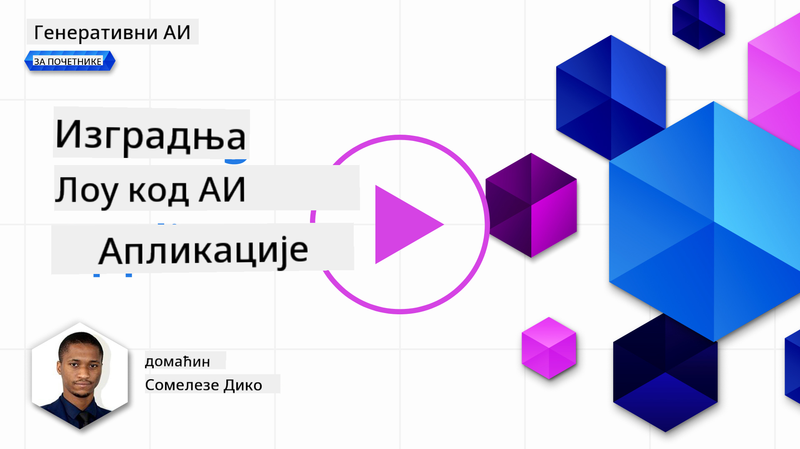
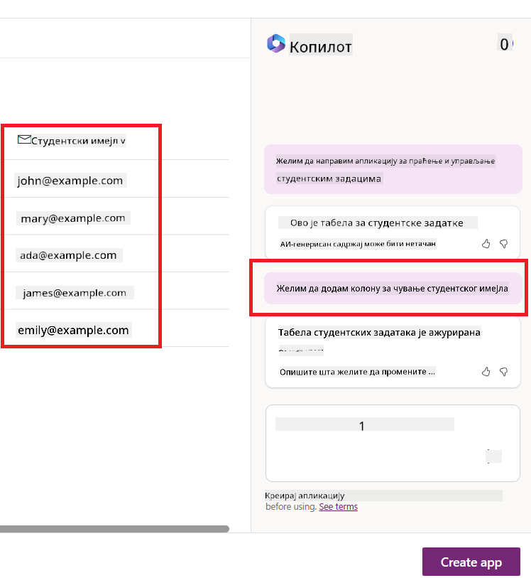
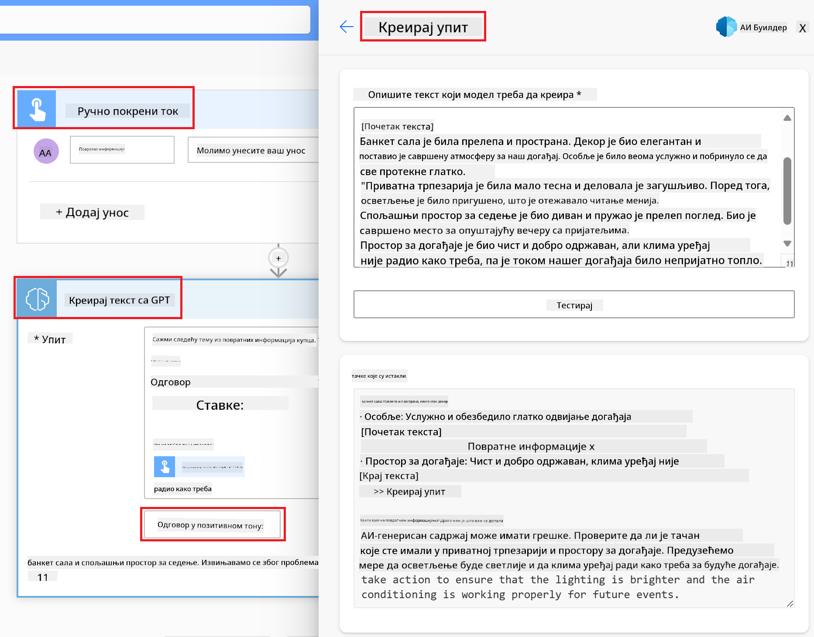

<!--
CO_OP_TRANSLATOR_METADATA:
{
  "original_hash": "846ac8e3b7dcfb697d3309fec05f0fea",
  "translation_date": "2025-10-18T01:21:01+00:00",
  "source_file": "10-building-low-code-ai-applications/README.md",
  "language_code": "sr"
}
-->
# Изградња апликација са вештачком интелигенцијом уз мало кода

> _(Кликните на слику изнад да бисте погледали видео лекцију)_

## Увод

Сада када смо научили како да направимо апликације за генерисање слика, хајде да разговарамо о развоју апликација уз мало кода. Генеративна вештачка интелигенција може се користити у различитим областима, укључујући и развој апликација уз мало кода, али шта је то заправо и како можемо додати вештачку интелигенцију у овај процес?

Изградња апликација и решења постала је лакша за традиционалне програмере и оне који то нису, захваљујући платформама за развој апликација уз мало кода. Ове платформе омогућавају креирање апликација и решења уз минимално или никакво програмирање. Ово се постиже пружањем визуелног окружења за развој које омогућава корисницима да превлаче и испуштају компоненте како би изградили апликације и решења. Ово омогућава бржу изградњу апликација и решења уз мање ресурса. У овој лекцији ћемо детаљно истражити како користити платформе за развој уз мало кода и како побољшати овај процес уз помоћ вештачке интелигенције користећи Power Platform.

Power Platform пружа организацијама могућност да оснаже своје тимове да сами креирају решења кроз интуитивно окружење за развој уз мало или без кода. Ово окружење поједностављује процес изградње решења. Уз Power Platform, решења се могу изградити за неколико дана или недеља, уместо месеци или година. Power Platform се састоји од пет кључних производа: Power Apps, Power Automate, Power BI, Power Pages и Copilot Studio.

Ова лекција обухвата:

- Увод у генеративну вештачку интелигенцију у Power Platform-у
- Увод у Copilot и како га користити
- Коришћење генеративне вештачке интелигенције за изградњу апликација и токова у Power Platform-у
- Разумевање AI модела у Power Platform-у уз AI Builder

## Циљеви учења

На крају ове лекције, бићете у могућности да:

- Разумете како Copilot функционише у Power Platform-у.

- Изградите апликацију за праћење задатака студената за нашу образовну стартап компанију.

- Направите ток за обраду фактура који користи вештачку интелигенцију за извлачење информација из фактура.

- Примените најбоље праксе приликом коришћења модела Create Text with GPT AI.

Алатке и технологије које ћете користити у овој лекцији су:

- **Power Apps**, за апликацију за праћење задатака студената, која пружа окружење за развој уз мало кода за изградњу апликација за праћење, управљање и интеракцију са подацима.

- **Dataverse**, за чување података за апликацију за праћење задатака студената, где Dataverse пружа платформу за чување података уз мало кода.

- **Power Automate**, за ток обраде фактура, где ћете имати окружење за развој уз мало кода за изградњу токова који аутоматизују процес обраде фактура.

- **AI Builder**, за AI модел обраде фактура, где ћете користити унапред изграђене AI моделе за обраду фактура за наш стартап.

## Генеративна вештачка интелигенција у Power Platform-у

Побољшање развоја и примене апликација уз мало кода помоћу генеративне вештачке интелигенције је кључна област фокуса за Power Platform. Циљ је омогућити свима да граде апликације, сајтове, контролне табле и аутоматизују процесе уз помоћ вештачке интелигенције, _без потребе за експертизом у области науке о подацима_. Овај циљ се постиже интеграцијом генеративне вештачке интелигенције у искуство развоја уз мало кода у Power Platform-у у облику Copilot-а и AI Builder-а.

### Како ово функционише?

Copilot је асистент са вештачком интелигенцијом који вам омогућава да изградите решења у Power Platform-у описујући своје захтеве кроз серију конверзацијских корака користећи природни језик. На пример, можете упутити свом AI асистенту да наведете која поља ће ваша апликација користити, и он ће креирати и апликацију и основни модел података, или можете специфицирати како да подесите ток у Power Automate-у.

Функционалности које покреће Copilot могу се користити као функција на екранима ваше апликације како би се омогућило корисницима да открију увиде кроз конверзацијске интеракције.

AI Builder је могућност вештачке интелигенције уз мало кода доступна у Power Platform-у која вам омогућава да користите AI моделе за аутоматизацију процеса и предвиђање исхода. Уз AI Builder можете додати вештачку интелигенцију својим апликацијама и токовима који се повезују са вашим подацима у Dataverse-у или у различитим облачним изворима података, као што су SharePoint, OneDrive или Azure.

Copilot је доступан у свим производима Power Platform-а: Power Apps, Power Automate, Power BI, Power Pages и Power Virtual Agents. AI Builder је доступан у Power Apps и Power Automate. У овој лекцији, фокусираћемо се на то како користити Copilot и AI Builder у Power Apps и Power Automate за изградњу решења за наш образовни стартап.

### Copilot у Power Apps

Као део Power Platform-а, Power Apps пружа окружење за развој уз мало кода за изградњу апликација за праћење, управљање и интеракцију са подацима. То је скуп услуга за развој апликација са скалабилном платформом за податке и могућношћу повезивања са облачним услугама и локалним подацима. Power Apps омогућава изградњу апликација које раде на претраживачима, таблетима и телефонима, и могу се делити са колегама. Искуство развоја апликација је такође побољшано генеративном вештачком интелигенцијом кроз Copilot.

Функција Copilot AI асистента у Power Apps омогућава вам да опишете какву апликацију желите и које информације желите да ваша апликација прати, прикупља или приказује. Copilot затим генерише одговарајућу Canvas апликацију на основу вашег описа. Након тога можете прилагодити апликацију својим потребама. AI Copilot такође генерише и предлаже Dataverse табелу са пољима која су вам потребна за чување података које желите да пратите, као и неке узорке података. Погледаћемо шта је Dataverse и како га можете користити у Power Apps-у касније у овој лекцији. Табелу можете прилагодити својим потребама користећи функцију AI Copilot асистента кроз конверзацијске кораке. Ова функција је доступна директно са почетног екрана Power Apps-а.

### Copilot у Power Automate

Као део Power Platform-а, Power Automate омогућава корисницима да креирају аутоматизоване токове између апликација и услуга. Помаже у аутоматизацији понављајућих пословних процеса као што су комуникација, прикупљање података и одобравање одлука. Његов једноставан интерфејс омогућава корисницима свих техничких нивоа (од почетника до искусних програмера) да аутоматизују радне задатке. Искуство развоја токова је такође побољшано генеративном вештачком интелигенцијом кроз Copilot.

Функција Copilot AI асистента у Power Automate омогућава вам да опишете какав ток вам је потребан и које радње желите да ваш ток изврши. Copilot затим генерише ток на основу вашег описа. Након тога можете прилагодити ток својим потребама. AI Copilot такође генерише и предлаже радње које су вам потребне за извршење задатка који желите да аутоматизујете. Погледаћемо шта су токови и како их можете користити у Power Automate-у касније у овој лекцији. Радње можете прилагодити својим потребама користећи функцију AI Copilot асистента кроз конверзацијске кораке. Ова функција је доступна директно са почетног екрана Power Automate-а.

## Задатак: Управљање задацима студената и фактурама за наш стартап уз помоћ Copilot-а

Наш стартап пружа онлајн курсеве студентима. Стартап је брзо растао и сада се бори да одговори на потражњу за својим курсевима. Стартап вас је ангажовао као Power Platform програмера да им помогнете да направе решење уз мало кода које ће им помоћи да управљају задацима студената и фактурама. Решење би требало да им омогући да прате и управљају задацима студената кроз апликацију и аутоматизују процес обраде фактура кроз ток. Од вас је затражено да користите генеративну вештачку интелигенцију за развој решења.

Када почињете са коришћењем Copilot-а, можете користити [Power Platform Copilot Prompt Library](https://github.com/pnp/powerplatform-prompts?WT.mc_id=academic-109639-somelezediko) за почетак рада са упутствима. Ова библиотека садржи листу упутстава која можете користити за изградњу апликација и токова уз помоћ Copilot-а. Такође можете користити упутства из библиотеке да бисте добили идеју како да опишете своје захтеве Copilot-у.

### Изградња апликације за праћење задатака студената за наш стартап

Едукатори у нашем стартапу имају потешкоћа у праћењу задатака студената. Користили су табелу за праћење задатака, али то је постало тешко за управљање како се број студената повећавао. Замолили су вас да направите апликацију која ће им помоћи да прате и управљају задацима студената. Апликација би требало да им омогући да додају нове задатке, прегледају задатке, ажурирају задатке и бришу задатке. Апликација би такође требало да омогући едукаторима и студентима да прегледају задатке који су оцењени и оне који нису.

Апликацију ћете изградити користећи Copilot у Power Apps-у пратећи следеће кораке:

1. Идите на [Power Apps](https://make.powerapps.com?WT.mc_id=academic-105485-koreyst) почетни екран.

1. Користите текстуално поље на почетном екрану да опишете апликацију коју желите да направите. На пример, **_Желим да направим апликацију за праћење и управљање задацима студената_**. Кликните на дугме **Send** да пошаљете упутство AI Copilot-у.

1. AI Copilot ће предложити Dataverse табелу са пољима која су вам потребна за чување података које желите да пратите, као и неке узорке података. Табелу можете прилагодити својим потребама користећи функцију AI Copilot асистента кроз конверзацијске кораке.

   > **Важно**: Dataverse је основна платформа за податке у Power Platform-у. То је платформа за податке уз мало кода за чување података апликације. То је у потпуности управљана услуга која безбедно чува податке у Microsoft Cloud-у и обезбеђује се у оквиру вашег Power Platform окружења. Долази са уграђеним могућностима управљања подацима, као што су класификација података, порекло података, фино подешена контрола приступа и још много тога. Више о Dataverse-у можете сазнати [овде](https://docs.microsoft.com/powerapps/maker/data-platform/data-platform-intro?WT.mc_id=academic-109639-somelezediko).

   

1. Едукатори желе да шаљу имејлове студентима који су предали своје задатке како би их обавестили о напретку њихових задатака. Можете користити Copilot да додате ново поље у табелу за чување имејл адресе студента. На пример, можете користити следеће упутство да додате ново поље у табелу: **_Желим да додам колону за чување имејл адресе студента_**. Кликните на дугме **Send** да пошаљете упутство AI Copilot-у.

1. AI Copilot ће генерисати ново поље, а затим можете прилагодити поље својим потребама.

1. Када завршите са табелом, кликните на дугме **Create app** да бисте креирали апликацију.

1. AI Copilot ће генерисати одговарајућу Canvas апликацију на основу вашег описа. Након тога можете прилагодити апликацију својим потребама.

1. Да би едукатори могли да шаљу имејлове студентима, можете користити Copilot да додате нови екран у апликацију. На пример, можете користити следеће упутство да додате нови екран у апликацију: **_Желим да додам екран за слање имејлова студентима_**. Кликните на дугме **Send** да пошаљете упутство AI Copilot-у.

1. AI Copilot ће генерисати нови екран, а затим можете прилагодити екран својим потребама.

1. Када завршите са апликацијом, кликните на дугме **Save** да бисте сачували апликацију.

1. Да бисте поделили апликацију са едукаторима, кликните на дугме **Share**, а затим поново кликните на дугме **Share**. Након тога можете поделити апликацију са едукаторима уношењем њихових имејл адреса.

> **Ваш домаћи задатак**: Апликација коју сте управо направили је добар почетак, али може се побољшати. Са функцијом слања имејлова, едукатори могу слати имејлове студентима само ручно, уносећи њихове имејл адресе. Можете ли користити Copilot да изградите аутоматизацију која ће омогућити едукаторима да аутоматски шаљу имејлове студентима када предају своје задатке? Ваш
Зашто би требало да користимо Dataverse за наш стартап? Стандардне и прилагођене табеле у оквиру Dataverse-а пружају сигурну и облачну опцију за складиштење ваших података. Табеле вам омогућавају да складиштите различите типове података, слично као што бисте користили више радних листова у једном Excel документу. Можете користити табеле за складиштење података који су специфични за потребе ваше организације или пословања. Неке од предности које наш стартап може добити коришћењем Dataverse-а укључују, али нису ограничене на:

- **Лако за управљање**: И метаподаци и подаци се чувају у облаку, тако да не морате да бринете о детаљима како се они чувају или управљају. Можете се фокусирати на развој ваших апликација и решења.

- **Сигурно**: Dataverse пружа сигурну и облачну опцију за складиштење ваших података. Можете контролисати ко има приступ подацима у вашим табелама и како могу приступити подацима користећи безбедност засновану на улогама.

- **Богати метаподаци**: Типови података и односи се директно користе у Power Apps-у.

- **Логика и валидација**: Можете користити пословна правила, израчуната поља и правила валидације за спровођење пословне логике и одржавање тачности података.

Сада када знате шта је Dataverse и зашто би требало да га користите, хајде да погледамо како можете користити Copilot за креирање табеле у Dataverse-у која ће задовољити захтеве нашег финансијског тима.

> **Note**: Ову табелу ћете користити у следећем одељку за креирање аутоматизације која ће извући све информације о фактурама и складиштити их у табели.

Да бисте креирали табелу у Dataverse-у користећи Copilot, следите кораке испод:

1. Идите на [Power Apps](https://make.powerapps.com?WT.mc_id=academic-105485-koreyst) почетну страницу.

2. На левој навигационој траци, изаберите **Tables** и затим кликните на **Describe the new Table**.

3. На екрану **Describe the new Table**, користите текстуално поље да опишете табелу коју желите да креирате. На пример, **_Желим да креирам табелу за складиштење информација о фактурама_**. Кликните на дугме **Send** да бисте послали упит AI Copilot-у.

4. AI Copilot ће предложити Dataverse табелу са пољима која су вам потребна за складиштење података које желите да пратите и неке примерке података. Затим можете прилагодити табелу својим потребама користећи AI Copilot асистента кроз конверзацијске кораке.

5. Финансијски тим жели да пошаље е-пошту добављачу како би га обавестио о тренутном статусу његове фактуре. Можете користити Copilot да додате ново поље у табелу за складиштење е-поште добављача. На пример, можете користити следећи упит да додате ново поље у табелу: **_Желим да додам колону за складиштење е-поште добављача_**. Кликните на дугме **Send** да бисте послали упит AI Copilot-у.

6. AI Copilot ће генерисати ново поље, а затим можете прилагодити то поље својим потребама.

7. Када завршите са табелом, кликните на дугме **Create** да бисте креирали табелу.

## AI модели у Power Platform-у са AI Builder-ом

AI Builder је могућност AI-а са ниским кодом доступна у Power Platform-у која вам омогућава да користите AI моделе за аутоматизацију процеса и предвиђање исхода. Са AI Builder-ом можете увести AI у ваше апликације и токове који се повезују са вашим подацима у Dataverse-у или у различитим облачним изворима података, као што су SharePoint, OneDrive или Azure.

## Унапред припремљени AI модели vs Прилагођени AI модели

AI Builder пружа две врсте AI модела: унапред припремљене AI моделе и прилагођене AI моделе. Унапред припремљени AI модели су спремни за употребу и обучени од стране Microsoft-а, доступни у Power Platform-у. Они вам помажу да додате интелигенцију вашим апликацијама и токовима без потребе да прикупљате податке и затим градите, обучавате и објављујете сопствене моделе. Можете користити ове моделе за аутоматизацију процеса и предвиђање исхода.

Неки од унапред припремљених AI модела доступних у Power Platform-у укључују:

- **Извлачење кључних фраза**: Овај модел извлачи кључне фразе из текста.
- **Детекција језика**: Овај модел детектује језик текста.
- **Анализа сентимента**: Овај модел детектује позитиван, негативан, неутралан или мешовит сентимент у тексту.
- **Читач визиткарти**: Овај модел извлачи информације са визиткарти.
- **Препознавање текста**: Овај модел извлачи текст из слика.
- **Детекција објеката**: Овај модел детектује и извлачи објекте са слика.
- **Обрада докумената**: Овај модел извлачи информације из формулара.
- **Обрада фактура**: Овај модел извлачи информације из фактура.

Са прилагођеним AI моделима можете увести сопствени модел у AI Builder тако да функционише као било који прилагођени AI Builder модел, омогућавајући вам да обучите модел користећи сопствене податке. Можете користити ове моделе за аутоматизацију процеса и предвиђање исхода у Power Apps-у и Power Automate-у. Када користите сопствени модел, постоје ограничења која се примењују. Прочитајте више о овим [ограничењима](https://learn.microsoft.com/ai-builder/byo-model#limitations?WT.mc_id=academic-105485-koreyst).

## Задатак #2 - Изградите ток за обраду фактура за наш стартап

Финансијски тим се бори са обрадом фактура. Користили су табелу за праћење фактура, али то је постало тешко управљати како се број фактура повећавао. Замолили су вас да изградите ток рада који ће им помоћи да обрађују фактуре користећи AI. Ток рада треба да им омогући да извлаче информације из фактура и складиште те информације у Dataverse табелу. Ток рада треба да им омогући и да пошаљу е-пошту финансијском тиму са извученим информацијама.

Сада када знате шта је AI Builder и зашто би требало да га користите, хајде да погледамо како можете користити AI модел за обраду фактура у AI Builder-у, који смо раније покрили, за изградњу тока рада који ће помоћи финансијском тиму да обрађује фактуре.

Да бисте изградили ток рада који ће помоћи финансијском тиму да обрађује фактуре користећи AI модел за обраду фактура у AI Builder-у, следите кораке испод:

1. Идите на [Power Automate](https://make.powerautomate.com?WT.mc_id=academic-105485-koreyst) почетну страницу.

2. Користите текстуално поље на почетној страници да опишете ток рада који желите да изградите. На пример, **_Обради фактуру када стигне у мој поштански сандучић_**. Кликните на дугме **Send** да бисте послали упит AI Copilot-у.

   

3. AI Copilot ће предложити радње које су вам потребне за извршење задатка који желите да аутоматизујете. Можете кликнути на дугме **Next** да бисте прешли на следеће кораке.

4. У следећем кораку, Power Automate ће вас упутити да подесите везе потребне за ток. Када завршите, кликните на дугме **Create flow** да бисте креирали ток.

5. AI Copilot ће генерисати ток, а затим можете прилагодити ток својим потребама.

6. Ажурирајте окидач тока и подесите **Folder** на фасциклу у којој ће се чувати фактуре. На пример, можете поставити фасциклу на **Inbox**. Кликните на **Show advanced options** и подесите **Only with Attachments** на **Yes**. Ово ће осигурати да се ток покреће само када е-пошта са прилогом стигне у фасциклу.

7. Уклоните следеће радње из тока: **HTML to text**, **Compose**, **Compose 2**, **Compose 3** и **Compose 4** јер их нећете користити.

8. Уклоните радњу **Condition** из тока јер је нећете користити. Требало би да изгледа као на следећем снимку екрана:

   

9. Кликните на дугме **Add an action** и потражите **Dataverse**. Изаберите радњу **Add a new row**.

10. На радњи **Extract Information from invoices**, ажурирајте **Invoice File** да указује на **Attachment Content** из е-поште. Ово ће осигурати да ток извлачи информације из прилога фактуре.

11. Изаберите **Table** коју сте раније креирали. На пример, можете изабрати табелу **Invoice Information**. Изаберите динамички садржај из претходне радње да попуните следећа поља:

    - ID
    - Amount
    - Date
    - Name
    - Status - Подесите **Status** на **Pending**.
    - Supplier Email - Користите **From** динамички садржај из окидача **When a new email arrives**.

    

12. Када завршите са током, кликните на дугме **Save** да бисте сачували ток. Затим можете тестирати ток слањем е-поште са фактуром у фасциклу коју сте навели у окидачу.

> **Ваш домаћи задатак**: Ток који сте управо изградили је добар почетак, сада треба да размислите како можете изградити аутоматизацију која ће омогућити нашем финансијском тиму да пошаље е-пошту добављачу како би га обавестио о тренутном статусу његове фактуре. Ваш наговештај: ток мора да се покрене када се статус фактуре промени.

## Користите AI модел за генерисање текста у Power Automate-у

AI модел Create Text with GPT у AI Builder-у омогућава вам да генеришете текст на основу упита и покреће га Microsoft Azure OpenAI Service. Са овом могућношћу, можете укључити GPT (Generative Pre-Trained Transformer) технологију у ваше апликације и токове како бисте изградили разне аутоматизоване токове и информативне апликације.

GPT модели пролазе кроз обимну обуку на огромним количинама података, омогућавајући им да производе текст који веома подсећа на људски језик када им се пружи упит. Када се интегришу са аутоматизацијом токова рада, AI модели као што је GPT могу се искористити за поједностављење и аутоматизацију широког спектра задатака.

На пример, можете изградити токове за аутоматско генерисање текста за различите намене, као што су: нацрти е-поште, описи производа и још много тога. Такође можете користити модел за генерисање текста за различите апликације, као што су чет-ботови и апликације за корисничку подршку које омогућавају агентима за корисничку подршку да ефикасно и ефективно одговарају на упите корисника.

Да бисте научили како да користите овај AI модел у Power Automate-у, прођите кроз модул [Add intelligence with AI Builder and GPT](https://learn.microsoft.com/training/modules/ai-builder-text-generation/?WT.mc_id=academic-109639-somelezediko).

## Одличан рад! Наставите са учењем

Након што завршите ову лекцију, погледајте нашу [Generative AI Learning collection](https://aka.ms/genai-collection?WT.mc_id=academic-105485-koreyst) како бисте наставили да унапређујете своје знање о генеративној вештачкој интелигенцији!

Прелазите на лекцију 11 где ћемо погледати како да [интегришете генеративну вештачку интелигенцију са позивом функција](../11-integrating-with-function-calling/README.md?WT.mc_id=academic-105485-koreyst)!

---

**Одрицање од одговорности**:  
Овај документ је преведен коришћењем услуге за превођење помоћу вештачке интелигенције [Co-op Translator](https://github.com/Azure/co-op-translator). Иако настојимо да обезбедимо тачност, молимо вас да имате у виду да аутоматски преводи могу садржати грешке или нетачности. Оригинални документ на његовом изворном језику треба сматрати ауторитативним извором. За критичне информације препоручује се професионални превод од стране људи. Не преузимамо одговорност за било каква погрешна тумачења или неспоразуме који могу настати услед коришћења овог превода.