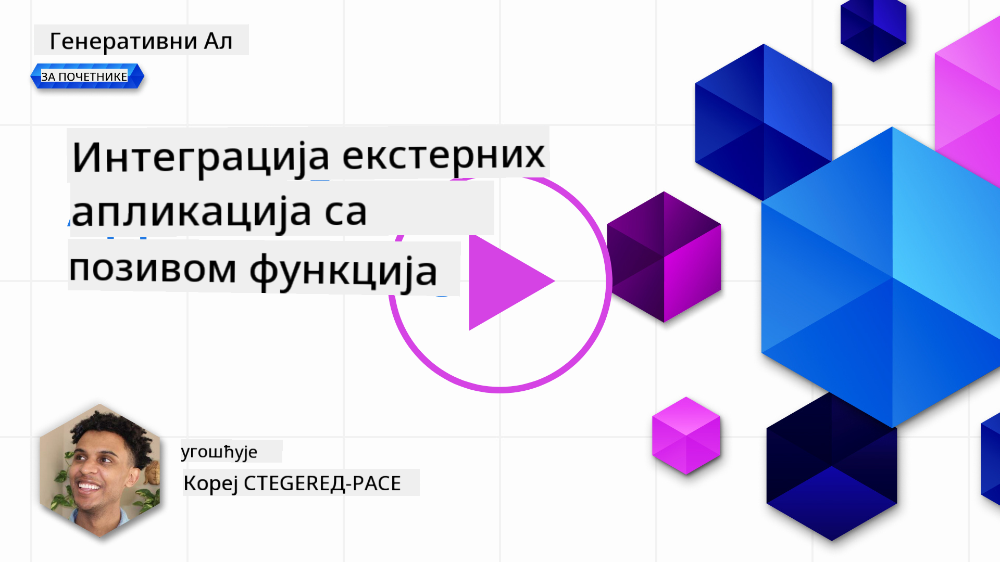
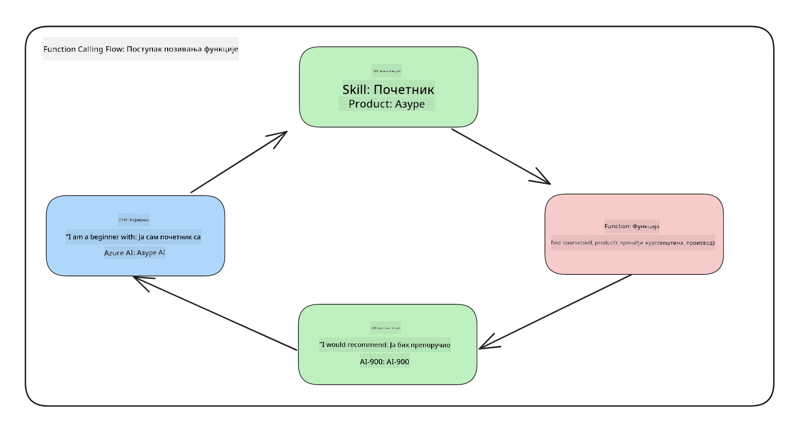
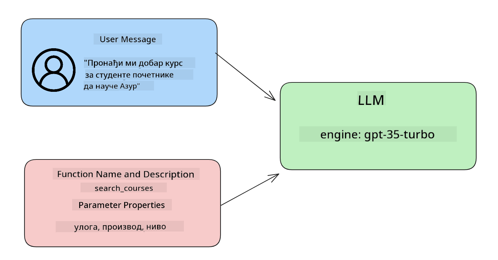

<!--
CO_OP_TRANSLATOR_METADATA:
{
  "original_hash": "77a48a201447be19aa7560706d6f93a0",
  "translation_date": "2025-07-09T14:44:20+00:00",
  "source_file": "11-integrating-with-function-calling/README.md",
  "language_code": "sr"
}
-->
# Интеграција са позивом функција

[](https://aka.ms/gen-ai-lesson11-gh?WT.mc_id=academic-105485-koreyst)

До сада сте научили доста у претходним лекцијама. Међутим, можемо још више да унапредимо. Једна од ствари којима можемо приступити је како да добијемо конзистентнији формат одговора како би било лакше радити са одговором у даљем току. Такође, можда ћемо желети да додамо податке из других извора како бисмо додатно обогатили нашу апликацију.

Проблеми поменути горе су управо оно чему овај поглавље тежи да одговори.

## Увод

Ова лекција ће обухватити:

- Објашњење шта је позив функције и њене примене.
- Креирање позива функције користећи Azure OpenAI.
- Како интегрисати позив функције у апликацију.

## Циљеви учења

До краја ове лекције, моћи ћете да:

- Објасните сврху коришћења позива функција.
- Подесите Function Call користећи Azure OpenAI сервис.
- Дизајнирате ефикасне позиве функција за случај употребе ваше апликације.

## Сценарио: Унапређење нашег ћаскача помоћу функција

За ову лекцију желимо да направимо функцију за наш едукативни стартап која омогућава корисницима да користе ћаскача за проналажење техничких курсева. Препоручићемо курсеве који одговарају њиховом нивоу знања, тренутној улози и технологији која их интересује.

За реализацију овог сценарија користићемо комбинацију:

- `Azure OpenAI` за креирање искуства ћаскања за корисника.
- `Microsoft Learn Catalog API` да помогнемо корисницима да пронађу курсеве на основу њихових захтева.
- `Function Calling` да узмемо кориснички упит и пошаљемо га функцији која ће направити API захтев.

Да почнемо, погледајмо зашто бисмо уопште желели да користимо позив функција:

## Зашто Function Calling

Пре позива функција, одговори из LLM-а су били неструктурирани и неконзистентни. Програмери су морали да пишу сложен код за валидацију како би могли да обраде сваки могући облик одговора. Корисници нису могли добити одговоре као што је „Какво је тренутно време у Стокхолму?“. То је зато што су модели били ограничени подацима на којима су тренирани.

Function Calling је функција Azure OpenAI сервиса која превазилази следећа ограничења:

- **Конзистентан формат одговора**. Ако можемо боље контролисати формат одговора, лакше ћемо интегрисати одговор у друге системе.
- **Спољни подаци**. Могућност коришћења података из других извора апликације у контексту ћаскања.

## Илустрација проблема кроз сценарио

> Препоручујемо да користите [укључени notebook](../../../11-integrating-with-function-calling/python/aoai-assignment.ipynb) ако желите да покренете доле наведени сценарио. Такође можете само пратити текст док покушавамо да илуструјемо проблем који функције могу помоћи да се реши.

Погледајмо пример који илуструје проблем формата одговора:

Рецимо да желимо да направимо базу података о студентима како бисмо им могли предложити прави курс. Испод имамо два описа студената која су веома слична по подацима које садрже.

1. Креирајте везу са нашим Azure OpenAI ресурсом:

   ```python
   import os
   import json
   from openai import AzureOpenAI
   from dotenv import load_dotenv
   load_dotenv()

   client = AzureOpenAI(
   api_key=os.environ['AZURE_OPENAI_API_KEY'],  # this is also the default, it can be omitted
   api_version = "2023-07-01-preview"
   )

   deployment=os.environ['AZURE_OPENAI_DEPLOYMENT']
   ```

   Испод је Python код за конфигурисање наше везе са Azure OpenAI где подешавамо `api_type`, `api_base`, `api_version` и `api_key`.

1. Креирање два описа студената користећи променљиве `student_1_description` и `student_2_description`.

   ```python
   student_1_description="Emily Johnson is a sophomore majoring in computer science at Duke University. She has a 3.7 GPA. Emily is an active member of the university's Chess Club and Debate Team. She hopes to pursue a career in software engineering after graduating."

   student_2_description = "Michael Lee is a sophomore majoring in computer science at Stanford University. He has a 3.8 GPA. Michael is known for his programming skills and is an active member of the university's Robotics Club. He hopes to pursue a career in artificial intelligence after finishing his studies."
   ```

   Желимо да пошаљемо горе наведене описе студената LLM-у да би парсирао податке. Ови подаци се касније могу користити у нашој апликацији и слати на API или чувати у бази података.

1. Креирајмо два идентична упита у којима упућујемо LLM шта нас занима:

   ```python
   prompt1 = f'''
   Please extract the following information from the given text and return it as a JSON object:

   name
   major
   school
   grades
   club

   This is the body of text to extract the information from:
   {student_1_description}
   '''

   prompt2 = f'''
   Please extract the following information from the given text and return it as a JSON object:

   name
   major
   school
   grades
   club

   This is the body of text to extract the information from:
   {student_2_description}
   '''
   ```

   Горњи упити упућују LLM да извуче информације и врати одговор у JSON формату.

1. Након подешавања упита и везе са Azure OpenAI, сада ћемо послати упите LLM-у користећи `openai.ChatCompletion`. Смештамо упит у променљиву `messages` и додељујемо улогу `user`. Ово имитира поруку коју корисник шаље ћаскачу.

   ```python
   # response from prompt one
   openai_response1 = client.chat.completions.create(
   model=deployment,
   messages = [{'role': 'user', 'content': prompt1}]
   )
   openai_response1.choices[0].message.content

   # response from prompt two
   openai_response2 = client.chat.completions.create(
   model=deployment,
   messages = [{'role': 'user', 'content': prompt2}]
   )
   openai_response2.choices[0].message.content
   ```

Сада можемо послати оба захтева LLM-у и испитати одговор који добијемо тако што ћемо га пронаћи овако: `openai_response1['choices'][0]['message']['content']`.

1. На крају, можемо конвертовати одговор у JSON формат позивом `json.loads`:

   ```python
   # Loading the response as a JSON object
   json_response1 = json.loads(openai_response1.choices[0].message.content)
   json_response1
   ```

   Одговор 1:

   ```json
   {
     "name": "Emily Johnson",
     "major": "computer science",
     "school": "Duke University",
     "grades": "3.7",
     "club": "Chess Club"
   }
   ```

   Одговор 2:

   ```json
   {
     "name": "Michael Lee",
     "major": "computer science",
     "school": "Stanford University",
     "grades": "3.8 GPA",
     "club": "Robotics Club"
   }
   ```

   Иако су упити исти и описи слични, видимо да су вредности својства `Grades` форматиране различито, јер понекад добијамо формат као што је `3.7` или `3.7 GPA`, на пример.

   Овај резултат је зато што LLM узима неструктуриране податке у облику написаног упита и враћа такође неструктуриране податке. Потребан нам је структурирани формат како бисмо знали шта да очекујемо када чувамо или користимо ове податке.

Па како онда решавамо проблем форматирања? Коришћењем позива функција можемо бити сигурни да добијамо структуриране податке назад. Када користимо позив функција, LLM заправо не позива или извршава било какве функције. Уместо тога, креирамо структуру коју LLM треба да прати у својим одговорима. Затим користимо те структуриране одговоре да знамо коју функцију да покренемо у нашим апликацијама.



Затим можемо узети оно што је враћено из функције и послати то назад LLM-у. LLM ће онда одговорити природним језиком како би одговорио на кориснички упит.

## Случајеви употребе позива функција

Постоји много различитих случајева где позиви функција могу побољшати вашу апликацију, као што су:

- **Позив спољних алата**. Ћаскачи су одлични у пружању одговора на питања корисника. Коришћењем позива функција, ћаскачи могу користити поруке корисника да обаве одређене задатке. На пример, студент може замолити ћаскача да „Пошаље имејл мом предавачу да ми треба више помоћи око овог предмета“. Ово може направити позив функције `send_email(to: string, body: string)`.

- **Креирање API или упита бази података**. Корисници могу пронаћи информације користећи природни језик који се претвара у форматирани упит или API захтев. Пример овога може бити наставник који пита „Који студенти су завршили последњи задатак“ што може позвати функцију `get_completed(student_name: string, assignment: int, current_status: string)`.

- **Креирање структурираних података**. Корисници могу узети блок текста или CSV и користити LLM да извуче важне информације из њега. На пример, студент може претворити Wikipedia чланак о мировним споразумима у AI флашкарте. Ово се може урадити коришћењем функције `get_important_facts(agreement_name: string, date_signed: string, parties_involved: list)`.

## Креирање вашег првог позива функције

Процес креирања позива функције укључује 3 главна корака:

1. **Позивање** Chat Completions API са списком ваших функција и поруком корисника.
2. **Читање** одговора модела да би се извршила акција, тј. извршио позив функције или API позив.
3. **Прављење** још једног позива Chat Completions API-ју са одговором из ваше функције како бисте користили те информације за креирање одговора кориснику.



### Корак 1 - креирање порука

Први корак је креирање поруке корисника. Ово може бити динамички додељено узимањем вредности из текстуалног уноса или можете овде доделити вредност. Ако је ово ваш први пут да радите са Chat Completions API-јем, потребно је да дефинишемо `role` и `content` поруке.

`role` може бити `system` (креирање правила), `assistant` (модел) или `user` (крајњи корисник). За позив функција доделићемо ову улогу као `user` и пример питања.

```python
messages= [ {"role": "user", "content": "Find me a good course for a beginner student to learn Azure."} ]
```

Додељивањем различитих улога, јасно је LLM-у да ли нешто говори систем или корисник, што помаже у изградњи историје разговора на којој LLM може да се ослони.

### Корак 2 - креирање функција

Затим ћемо дефинисати функцију и параметре те функције. Користићемо само једну функцију овде која се зове `search_courses`, али можете креирати више функција.

> **Важно** : Функције су укључене у системску поруку LLM-у и урачунате су у укупан број доступних токена.

Испод креирамо функције као низ ставки. Свака ставка је функција и има својства `name`, `description` и `parameters`:

```python
functions = [
   {
      "name":"search_courses",
      "description":"Retrieves courses from the search index based on the parameters provided",
      "parameters":{
         "type":"object",
         "properties":{
            "role":{
               "type":"string",
               "description":"The role of the learner (i.e. developer, data scientist, student, etc.)"
            },
            "product":{
               "type":"string",
               "description":"The product that the lesson is covering (i.e. Azure, Power BI, etc.)"
            },
            "level":{
               "type":"string",
               "description":"The level of experience the learner has prior to taking the course (i.e. beginner, intermediate, advanced)"
            }
         },
         "required":[
            "role"
         ]
      }
   }
]
```

Хајде да детаљније опишемо сваки пример функције:

- `name` - Име функције коју желимо да позовемо.
- `description` - Опис како функција ради. Важно је да буде прецизан и јасан.
- `parameters` - Листа вредности и формата које желите да модел произведе у свом одговору. Низ параметара се састоји од ставки које имају следећа својства:
  1.  `type` - Тип података у којем ће својства бити сачувана.
  1.  `properties` - Листа специфичних вредности које ће модел користити у свом одговору
      1. `name` - Кључ је име својства које ће модел користити у форматираном одговору, на пример, `product`.
      1. `type` - Тип података тог својства, на пример, `string`.
      1. `description` - Опис специфичног својства.

Постоји и опционално својство `required` - обавезно својство за извршење позива функције.

### Корак 3 - Извршење позива функције

Након дефинисања функције, сада је потребно да је укључимо у позив Chat Completion API-ја. То радимо додавањем `functions` у захтев. У овом случају `functions=functions`.

Постоји и опција да се подеси `function_call` на `auto`. То значи да ћемо дозволити LLM-у да одлучи коју функцију треба позвати на основу поруке корисника, уместо да ми то додељујемо.

Ево кода где позивамо `ChatCompletion.create`, обратите пажњу како подешавамо `functions=functions` и `function_call="auto"` и тиме дајемо LLM-у могућност да сам изабере када ће позвати функције које му пружамо:

```python
response = client.chat.completions.create(model=deployment,
                                        messages=messages,
                                        functions=functions,
                                        function_call="auto")

print(response.choices[0].message)
```

Одговор који сада добијамо изгледа овако:

```json
{
  "role": "assistant",
  "function_call": {
    "name": "search_courses",
    "arguments": "{\n  \"role\": \"student\",\n  \"product\": \"Azure\",\n  \"level\": \"beginner\"\n}"
  }
}
```

Овде можемо видети како је функција `search_courses` позвана и са којим аргументима, који су наведени у својству `arguments` у JSON одговору.

Закључак је да је LLM успео да пронађе податке који одговарају аргументима функције јер их је извлачио из вредности додељене параметру `messages` у позиву за chat completion. Испод је подсетник вредности `messages`:

```python
messages= [ {"role": "user", "content": "Find me a good course for a beginner student to learn Azure."} ]
```

Као што видите, `student`, `Azure` и `beginner` су издвојени из `messages` и постављени као улаз у функцију. Коришћење функција на овај начин је одличан начин да се извуче информација из упита, али и да се обезбеди структура LLM-у и омогући поновна употреба функционалности.

Следеће, треба да видимо како ово можемо користити у нашој апликацији.

## Интеграција позива функција у апликацију

Након што смо тестирали форматирани одговор из LLM-а, сада можемо то интегрисати у апликацију.

### Управљање током

Да бисмо ово интегрисали у нашу апликацију, предузећемо следеће кораке:

1. Прво, направимо позив OpenAI сервисима и сачувамо поруку у променљиву `response_message`.

   ```python
   response_message = response.choices[0].message
   ```

1. Сада ћемо дефинисати функцију која ће позвати Microsoft Learn API да добије листу курсева:

   ```python
   import requests

   def search_courses(role, product, level):
     url = "https://learn.microsoft.com/api/catalog/"
     params = {
        "role": role,
        "product": product,
        "level": level
     }
     response = requests.get(url, params=params)
     modules = response.json()["modules"]
     results = []
     for module in modules[:5]:
        title = module["title"]
        url = module["url"]
        results.append({"title": title, "url": url})
     return str(results)
   ```

   Обратите пажњу како сада креирамо стварну Python функцију која се мапира на имена функција представљених у променљивој `functions`. Такође правимо стварне спољне API позиве да бисмо добили потребне податке. У овом случају, позивамо Microsoft Learn API да претражимо тренинг модуле.

Добро, направили смо променљиву `functions` и одговарајућу Python функцију, како да кажемо LLM-у како да их повежемо да би наша Python функција била позвана?

1. Да бисмо проверили да ли треба да позовемо Python функцију, морамо погледати одговор LLM-а и видети да ли је `function_call` део одговора и позвати назначену функцију. Ево како можете направити ову проверу:

   ```python
   # Check if the model wants to call a function
   if response_message.function_call.name:
    print("Recommended Function call:")
    print(response_message.function_call.name)
    print()

    # Call the function.
    function_name = response_message.function_call.name

    available_functions = {
            "search_courses": search_courses,
    }
    function_to_call = available_functions[function_name]

    function_args = json.loads(response_message.function_call.arguments)
    function_response = function_to_call(**function_args)

    print("Output of function call:")
    print(function_response)
    print(type(function_response))


    # Add the assistant response and function response to the messages
    messages.append( # adding assistant response to messages
        {
            "role": response_message.role,
            "function_call": {
                "name": function_name,
                "arguments": response_message.function_call.arguments,
            },
            "content": None
        }
    )
    messages.append( # adding function response to messages
        {
            "role": "function",
            "name": function_name,
            "content":function_response,
        }
    )
   ```

   Ове три линије обезбеђују да издвојимо име функције, аргументе и извршимо позив:

   ```python
   function_to_call = available_functions[function_name]

   function_args = json.loads(response_message.function_call.arguments)
   function_response = function_to_call(**function_args)
   ```

   Испод је излаз из покретања нашег кода:

   **Излаз**

   ```Recommended Function call:
   {
     "name": "search_courses",
     "arguments": "{\n  \"role\": \"student\",\n  \"product\": \"Azure\",\n  \"level\": \"beginner\"\n}"
   }

   Output of function call:
   [{'title': 'Describe concepts of cryptography', 'url': 'https://learn.microsoft.com/training/modules/describe-concepts-of-cryptography/?
   WT.mc_id=api_CatalogApi'}, {'title': 'Introduction to audio classification with TensorFlow', 'url': 'https://learn.microsoft.com/en-
   us/training/modules/intro-audio-classification-tensorflow/?WT.mc_id=api_CatalogApi'}, {'title': 'Design a Performant Data Model in Azure SQL
   Database with Azure Data Studio', 'url': 'https://learn.microsoft.com/training/modules/design-a-data-model-with-ads/?
   WT.mc_id=api_CatalogApi'}, {'title': 'Getting started with the Microsoft Cloud Adoption Framework for Azure', 'url':
   'https://learn.microsoft.com/training/modules/cloud-adoption-framework-getting-started/?WT.mc_id=api_CatalogApi'}, {'title': 'Set up the
   Rust development environment', 'url': 'https://learn.microsoft.com/training/modules/rust-set-up-environment/?WT.mc_id=api_CatalogApi'}]
   <class 'str'>
   ```

1. Сада ћемо послати ажурирану поруку, `messages` LLM-у како бисмо добили одговор природним језиком уместо API JSON форматираног одговора.

   ```python
   print("Messages in next request:")
   print(messages)
   print()

   second_response = client.chat.completions.create(
      messages=messages,
      model=deployment,
      function_call="auto",
      functions=functions,
      temperature=0
         )  # get a new response from GPT where it can see the function response


   print(second_response.choices[0].message)
   ```

   **Излаз**

   ```python
   {
     "role": "assistant",
     "content": "I found some good courses for beginner students to learn Azure:\n\n1. [Describe concepts of cryptography] (https://learn.microsoft.com/training/modules/describe-concepts-of-cryptography/?WT.mc_id=api_CatalogApi)\n2. [Introduction to audio classification with TensorFlow](https://learn.microsoft.com/training/modules/intro-audio-classification-tensorflow/?WT.mc_id=api_CatalogApi)\n3. [Design a Performant Data Model in Azure SQL Database with Azure Data Studio](https://learn.microsoft.com/training/modules/design-a-data-model-with-ads/?WT.mc_id=api_CatalogApi)\n4. [Getting started with the Microsoft Cloud Adoption Framework for Azure](https://learn.microsoft.com/training/modules/cloud-adoption-framework-getting-started/?WT.mc_id=api_CatalogApi)\n5. [Set up the Rust development environment](https://learn.microsoft.com/training/modules/rust-set-up-environment/?WT.mc_id=api_CatalogApi)\n\nYou can click on the links to access the courses."
   }

   ```

## Задатак

Да бисте наставили учење Azure OpenAI Function Calling-а, можете направити:

- Више параметара функције који могу помоћи корисницима да пронађу више курсева.
- Креирати још један позив функције који узима више информација од корисника, као што је њихов матерњи језик.
- Креирати обраду грешака када позив функције и/или API позив не врати одговарајуће курсеве.
## Одличан посао! Наставите путовање

Након завршетка ове лекције, погледајте нашу [Generative AI Learning колекцију](https://aka.ms/genai-collection?WT.mc_id=academic-105485-koreyst) да бисте наставили да унапређујете своје знање о генеративној вештачкој интелигенцији!

Прелазите на Лекцију 12, где ћемо погледати како да [дизајнирамо UX за AI апликације](../12-designing-ux-for-ai-applications/README.md?WT.mc_id=academic-105485-koreyst)!

**Одрицање од одговорности**:  
Овај документ је преведен коришћењем AI преводилачке услуге [Co-op Translator](https://github.com/Azure/co-op-translator). Иако се трудимо да превод буде тачан, молимо вас да имате у виду да аутоматски преводи могу садржати грешке или нетачности. Оригинални документ на његовом изворном језику треба сматрати ауторитетним извором. За критичне информације препоручује се професионални људски превод. Нисмо одговорни за било каква неспоразума или погрешна тумачења која произилазе из коришћења овог превода.