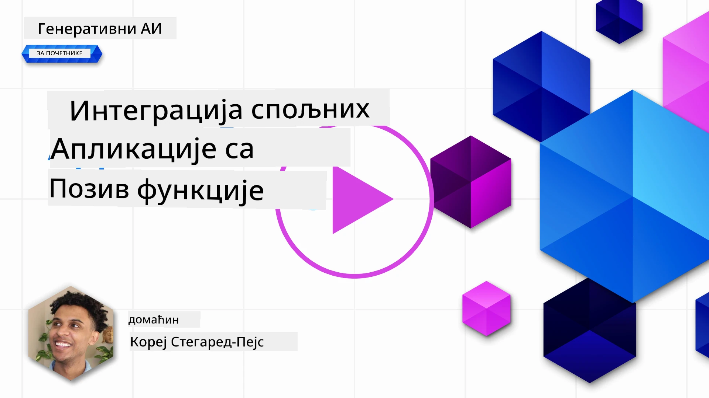
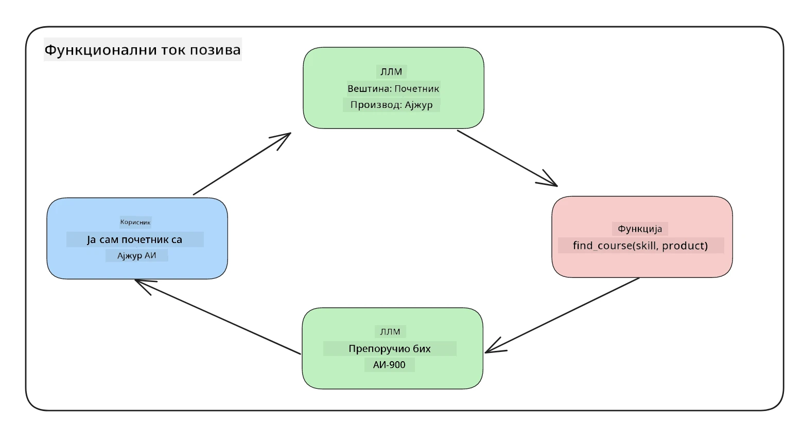
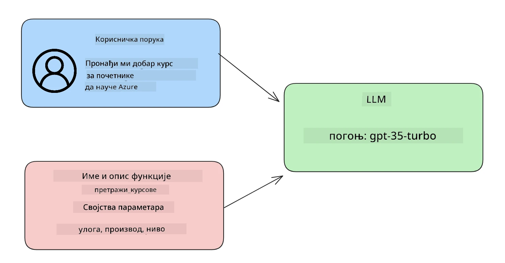

# Интеграција са позивима функција

[](https://youtu.be/DgUdCLX8qYQ?si=f1ouQU5HQx6F8Gl2)

До сада сте научили доста у претходним лекцијама. Међутим, можемо још више унапредити. Неки од проблема које можемо решити су како да добијемо конзистентан формат одговора како би било лакше радити са одговором у даљем поступку. Такође, можда желимо да додамо податке из других извора како бисмо још више обогатили нашу апликацију.

Горенаведени проблеми су оно што овај одељак жели да реши.

## Увод

Ова лекција ће обухватити:

- Објашњење шта је позивање функција и за шта се користи.
- Креирање позива функције користећи Azure OpenAI.
- Како интегрисати позив функције у апликацију.

## Циљеви учења

До краја ове лекције бићете у могућности да:

- Објасните сврху коришћења позива функција.
- Поставите позив функције користећи Azure OpenAI сервис.
- Дизајнирате ефикасне позиве функција за ваш случај употребе апликације.

## Сценарио: Унапређење нашег чат-бота функцијама

За ову лекцију желимо да изградимо функцију за наш образовни стартап која омогућава корисницима да користе чат-бот за проналажење техничких курсева. Препоручујемо курсеве који одговарају њиховом нивоу вештина, тренутној улози и заинтересованој технологији.

За реализацију овог сценарија користићемо комбинацију:

- `Azure OpenAI` за креирање искуства ћаскања за корисника.
- `Microsoft Learn Catalog API` за помоћ корисницима да пронађу курсеве на основу захтева.
- `Function Calling` за преузимање корисничког упита и слање функцији која прави API захтев.

Да почнемо, погледајмо зашто бисмо уопште хтели да користимо позив функција:

## Зашто позив функција

Пре позива функција, одговори из LLM (великог језичког модела) су били структурално неуређени и недоследни. Развојни програмери су морали да пишу сложен код за валидацију да би могли да обраде сваки могући одговор. Корисници нису могли да добију одговоре попут "Какво је тренутно време у Стокхолму?". То је зато што су модели били ограничени на време када су подаци били обучени.

Позив функција је функција Azure OpenAI сервиса која решава следећа ограничења:

- **Конзистентан формат одговора**. Ако можемо боље контролисати формат одговора, лакше ћемо интегрисати одговор у друге системе у даљем току.
- **Спољни подаци**. Могућност коришћења података из других извора апликације у контексту ћаскања.

## Приказивање проблема кроз сценарио

> Препоручујемо да користите [укључени нотебоок](./python/aoai-assignment.ipynb?WT.mc_id=academic-105485-koreyst) ако желите да покренете доле наведени сценарио. Можете и само читати да бисмо илустровали проблем где функције могу помоћи у решавању.

Погледајмо пример који илуструје проблем формата одговора:

Рецимо да желимо да направимо базу података о студентима како бисмо им могли предложити прави курс. Испод имамо два описа студената која су веома слична у подацима које садрже.

1. Направите конекцију са нашим Azure OpenAI ресурсом:

   ```python
   import os
   import json
   from openai import OpenAI
   from dotenv import load_dotenv
   load_dotenv()

   # Одговори API се сервирају са Azure OpenAI (Microsoft Foundry) v1
   # крајње тачке, тако да усмеравамо OpenAI клијента на <your-endpoint>/openai/v1/.
   endpoint = os.environ['AZURE_OPENAI_ENDPOINT']
   client = OpenAI(
   api_key=os.environ['AZURE_OPENAI_API_KEY'],
   base_url=f"{endpoint.rstrip('/')}/openai/v1/",
   )

   deployment=os.environ['AZURE_OPENAI_DEPLOYMENT']
   ```

   Испод је Python код за подешавање наше конекције са Azure OpenAI. Пошто користимо v1 крајњу тачку, потребно је само поставити `api_key` и `base_url` (није потребан `api_version`).

1. Креирање два описа студената користећи променљиве `student_1_description` и `student_2_description`.

   ```python
   student_1_description="Emily Johnson is a sophomore majoring in computer science at Duke University. She has a 3.7 GPA. Emily is an active member of the university's Chess Club and Debate Team. She hopes to pursue a career in software engineering after graduating."

   student_2_description = "Michael Lee is a sophomore majoring in computer science at Stanford University. He has a 3.8 GPA. Michael is known for his programming skills and is an active member of the university's Robotics Club. He hopes to pursue a career in artificial intelligence after finishing his studies."
   ```

   Желимо да пошаљемо горе наведене описе студената LLM-у да анализира податке. Ови подаци се касније могу користити у апликацији и слати API-ју или чувати у бази података.

1. Хајде да направимо два идентична промпта у којима упућујемо LLM шта нас занима:

   ```python
   prompt1 = f'''
   Please extract the following information from the given text and return it as a JSON object:

   name
   major
   school
   grades
   club

   This is the body of text to extract the information from:
   {student_1_description}
   '''

   prompt2 = f'''
   Please extract the following information from the given text and return it as a JSON object:

   name
   major
   school
   grades
   club

   This is the body of text to extract the information from:
   {student_2_description}
   '''
   ```

   Горе наведени промптови упућују LLM да извуче информације и врати одговор у JSON формату.

1. Након подешавања промптова и конекције са Azure OpenAI, сада ћемо послати промптове LLM-у користећи `client.responses.create`. Смештамо промпт у `input` променљиву и додељујемо улогу `user`. Ово симулира поруку корисника уписану у чат-бот.

   ```python
   # одговор на упит један
   openai_response1 = client.responses.create(
   model=deployment,
   input = [{'role': 'user', 'content': prompt1}],
   store=False,
   )
   openai_response1.output_text

   # одговор на упит два
   openai_response2 = client.responses.create(
   model=deployment,
   input = [{'role': 'user', 'content': prompt2}],
   store=False,
   )
   openai_response2.output_text
   ```

Сада можемо послати оба захтева LLM-у и испитати добијени одговор тако што га пронађемо као `openai_response1.output_text`.

1. На крају, можемо конвертовати одговор у JSON формат позивом `json.loads`:

   ```python
   # Учитавање одговора као JSON објекта
   json_response1 = json.loads(openai_response1.output_text)
   json_response1
   ```

   Одговор 1:

   ```json
   {
     "name": "Emily Johnson",
     "major": "computer science",
     "school": "Duke University",
     "grades": "3.7",
     "club": "Chess Club"
   }
   ```

   Одговор 2:

   ```json
   {
     "name": "Michael Lee",
     "major": "computer science",
     "school": "Stanford University",
     "grades": "3.8 GPA",
     "club": "Robotics Club"
   }
   ```

   Иако су промптови исти и описи слични, видимо да су вредности `Grades` поља форматиране различито, на пример, понекад добијамо формат `3.7` или `3.7 GPA`.

   Овај резултат је зато што LLM узима неструктуриране податке у облику написаног промпта и враћа такође неструктуриране податке. Потребан нам је структуриран формат да бисмо знали шта да очекујемо приликом чувања или коришћења ових података.

Како онда решити проблем форматирања? Коришћењем позива функција можемо осигурати да добијемо структуриран податак назад. Када користимо позив функција, LLM заправо не позива или извршава функције. Уместо тога, ми креирамо структуру коју LLM треба да следи у својим одговорима. Затим користимо те структуриранe одговоре да знамо коју функцију да позовемо у нашим апликацијама.



Затим можемо узети оно што добијемо из функције и послати назад LLM-у. LLM ће онда одговорити природним језиком како би одговорио на кориснички упит.

## Случајеви употребе позива функција

Постоји много различитих случајева када позиви функција могу побољшати вашу апликацију, као што су:

- **Позивање спољних алата**. Чат-ботови су одлични у пружању одговора на питања корисника. Коришћењем позива функција, чат-ботови могу користити поруке корисника да обаве одређене задатке. На пример, студент може замолити чат-бота да "Пошаље имејл мом инструктору да ми је потребна додатна помоћ са овим предметом". То може покренути позив функције `send_email(to: string, body: string)`

- **Креирање API или упита бази података**. Корисници могу пронаћи информације користећи природни језик који се конвертује у форматирани упит или API захтев. На пример, наставник може питати "Који студенти су завршили последњи задатак" што може позвати функцију `get_completed(student_name: string, assignment: int, current_status: string)`

- **Креирање структурираног податка**. Корисници могу узети блок текста или CSV и користити LLM да извуку важне информације. На пример, студент може претворити Википедијину страницу о мировним споразумима како би креирао AI флашкартe. Ово се може урадити коришћењем функције `get_important_facts(agreement_name: string, date_signed: string, parties_involved: list)`

## Креирање првог позива функције

Процес креирања позива функције обухвата 3 главна корака:

1. **Позивање** Responses API са списком ваших функција (алата) и поруком корисника.
2. **Читање** одговора модела да би се предузела акција, тј. извршио позив функције или API позив.
3. **Прављење** другог позива Responses API са одговором ваше функције како бисте користили те информације да направите одговор кориснику.



### Корак 1 - креирање порука

Први корак је креирање корисничке поруке. Ово може бити динамички додељено узимањем вредности из текстуалног уноса или можете овде доделити вредност. Ако је ово први пут да радите са Responses API-јем, потребно је дефинисати `role` и `content` поруке.

`role` може бити или `system` (креирање правила), `assistant` (модел) или `user` (крајњи корисник). За позив функција, доделићемо ову као `user` и поставити пример питања.

```python
messages= [ {"role": "user", "content": "Find me a good course for a beginner student to learn Azure."} ]
```

Додељивањем различитих улога, јасно је моделу да ли нешто говори систем или корисник, што помаже у стварању историје конверзације на коју модел може да се надовезује.

### Корак 2 - креирање функција

Затим ћемо дефинисати функцију и параметре те функције. Користићемо само једну функцију овде која се зове `search_courses`, али можете направити више функција.

> **Важно** : Функције су укључене у системску поруку ка LLM-у и биће укључене у број доступних токена који имате.

Испод креирамо функције као низ ставки. Свака ставка је алат у flat Responses API формату, са својствима `type`, `name`, `description` и `parameters`:

```python
functions = [
   {
      "type":"function",
      "name":"search_courses",
      "description":"Retrieves courses from the search index based on the parameters provided",
      "parameters":{
         "type":"object",
         "properties":{
            "role":{
               "type":"string",
               "description":"The role of the learner (i.e. developer, data scientist, student, etc.)"
            },
            "product":{
               "type":"string",
               "description":"The product that the lesson is covering (i.e. Azure, Power BI, etc.)"
            },
            "level":{
               "type":"string",
               "description":"The level of experience the learner has prior to taking the course (i.e. beginner, intermediate, advanced)"
            }
         },
         "required":[
            "role"
         ]
      }
   }
]
```

Хајде да детаљније опишемо сваки пример функције:

- `name` - Име функције коју желимо да позовемо.
- `description` - Опис како функција ради. Важно је бити специфичан и јасан.
- `parameters` - Листа вредности и формата које желите да модел произведе у свом одговору. Низ параметара се састоји од ставки које имају следећа својства:
  1.  `type` - Тип података у којем ће својства бити сачувана.
  1.  `properties` - Листа конкретних вредности које модел користи у одговору
      1. `name` - Кључ је име својства које ће модел користити у форматираном одговору, например `product`.
      1. `type` - Тип података тог својства, нпр. `string`.
      1. `description` - Опис конкретног својства.

Постоји и опционално својство `required` - обавезно својство за завршетак позива функције.

### Корак 3 - Извршавање позива функције

Након дефинисања функције, сада је треба укључити у позив Responses API-ју. То радимо додавањем `tools` у захтев. У овом случају `tools=functions`.

Постоји такође опција да се подеси `tool_choice` на `auto`. То значи да ћемо пустити LLM да одлучи коју функцију треба позвати на основу поруке корисника, уместо да ми то додељујемо.

Испод је код у којем зовемо `client.responses.create`, обратите пажњу како постављамо `tools=functions` и `tool_choice="auto"`, тиме дајемо LLM-у могућност да одлучи када да позове функције које му достављамо:

```python
response = client.responses.create(model=deployment,
                                        input=messages,
                                        tools=functions,
                                        tool_choice="auto",
                                        store=False)

print(response.output)
```

Одговор који сад долази садржи ставку `function_call` у `response.output` која изгледа овако:

```json
{
  "type": "function_call",
  "name": "search_courses",
  "call_id": "call_abc123",
  "arguments": "{\n  \"role\": \"student\",\n  \"product\": \"Azure\",\n  \"level\": \"beginner\"\n}"
}
```

Овде можемо видети како је функција `search_courses` позвана и са којим аргументима, наведено у својству `arguments` у JSON одговору.

Закључак је да је LLM успео да пронађе податке који одговарају аргументима функције јер их је извлачио из вредности прослеђене `input` параметру у позиву Responses API-ја. Испод је подсетник вредности `messages`:

```python
messages= [ {"role": "user", "content": "Find me a good course for a beginner student to learn Azure."} ]
```

Као што видите, `student`, `Azure` и `beginner` су издвојени из `messages` и постављени као улаз за функцију. Коришћење функција на овај начин је одличан начин да се извуче информација из промпта, а такође и да се пружи структура LLM-у и имају поновно коришћење функционалности.

Следеће, потребно је видети како ово можемо користити у нашој апликацији.

## Интеграција позива функција у апликацију

Након што тестирамо форматирани одговор из LLM-а, сада то можемо интегрисати у апликацију.

### Управљање током

Да интегришемо ово у нашу апликацију, предузећемо следеће кораке:

1. Прво, направимо позив OpenAI сервисима и извучемо ставке позива функције из одговора `output`.

   ```python
   response_items = response.output
   tool_calls = [item for item in response_items if item.type == "function_call"]
   ```

1. Сада ћемо дефинисати функцију која ће позвати Microsoft Learn API да добије листу курсева:

   ```python
   import requests

   def search_courses(role, product, level):
     url = "https://learn.microsoft.com/api/catalog/"
     params = {
        "role": role,
        "product": product,
        "level": level
     }
     response = requests.get(url, params=params)
     modules = response.json()["modules"]
     results = []
     for module in modules[:5]:
        title = module["title"]
        url = module["url"]
        results.append({"title": title, "url": url})
     return str(results)
   ```

   Обратите пажњу како сада креирамо стварну Python функцију која се мапира са именима функција дефинисаним у променљивој `functions`. Такође извршавамо праве API позиве да бисмо преузели потребне податке. У овом случају идемо према Microsoft Learn API-ју да тражимо тренинг модуле.

У реду, направили смо променљиву `functions` и одговарајућу Python функцију, како да кажемо LLM-у како да их упари тако да се наша Python функција позове?

1. Да бисмо видели да ли треба позвати Python функцију, морамо погледати одговор LLM-а и проверити да ли садржи ставку `function_call` и позвати назначену функцију. Ево како можете направити ову проверу:

   ```python
   # Провери да ли модел жели да позове функцију
   if tool_calls:
    for tool_call in tool_calls:
     print("Recommended Function call:")
     print(tool_call.name)
     print()

     # Позови функцију.
     function_name = tool_call.name

     available_functions = {
             "search_courses": search_courses,
     }
     function_to_call = available_functions[function_name]

     function_args = json.loads(tool_call.arguments)
     function_response = function_to_call(**function_args)

     print("Output of function call:")
     print(function_response)
     print(type(function_response))

     # Додај позив функције и њен резултат назад у разговор.
     # елемент function_call модела мора бити додат пре његовог излаза.
     messages.append(tool_call)  # елемент function_call асистента
     messages.append( # резултат функције
         {
             "type": "function_call_output",
             "call_id": tool_call.call_id,
             "output": function_response,
         }
     )
   ```

   Ове три линије обезбеђују да издвојимо име функције, аргументе и извршимо позив:

   ```python
   function_to_call = available_functions[function_name]

   function_args = json.loads(tool_call.arguments)
   function_response = function_to_call(**function_args)
   ```

   Испод је излаз из извршавања нашег кода:

   **Излаз**

   ```Recommended Function call:
   {
     "name": "search_courses",
     "arguments": "{\n  \"role\": \"student\",\n  \"product\": \"Azure\",\n  \"level\": \"beginner\"\n}"
   }

   Output of function call:
   [{'title': 'Describe concepts of cryptography', 'url': 'https://learn.microsoft.com/training/modules/describe-concepts-of-cryptography/?
   WT.mc_id=api_CatalogApi'}, {'title': 'Introduction to audio classification with TensorFlow', 'url': 'https://learn.microsoft.com/en-
   us/training/modules/intro-audio-classification-tensorflow/?WT.mc_id=api_CatalogApi'}, {'title': 'Design a Performant Data Model in Azure SQL
   Database with Azure Data Studio', 'url': 'https://learn.microsoft.com/training/modules/design-a-data-model-with-ads/?
   WT.mc_id=api_CatalogApi'}, {'title': 'Getting started with the Microsoft Cloud Adoption Framework for Azure', 'url':
   'https://learn.microsoft.com/training/modules/cloud-adoption-framework-getting-started/?WT.mc_id=api_CatalogApi'}, {'title': 'Set up the
   Rust development environment', 'url': 'https://learn.microsoft.com/training/modules/rust-set-up-environment/?WT.mc_id=api_CatalogApi'}]
   <class 'str'>
   ```

1. Сада ћемо послати ажурирану поруку, `messages` LLM-у како бисмо добили одговор на природном језику уместо API JSON форматираног одговора.

   ```python
   print("Messages in next request:")
   print(messages)
   print()

   second_response = client.responses.create(
      input=messages,
      model=deployment,
      tool_choice="auto",
      tools=functions,
      temperature=0,
      store=False,
         )  # добити нови одговор од модела где може видети одговор функције


   print(second_response.output_text)
   ```

   **Излаз**

   ```text
   I found some good courses for beginner students to learn Azure:

   1. [Describe concepts of cryptography](https://learn.microsoft.com/training/modules/describe-concepts-of-cryptography/?WT.mc_id=api_CatalogApi)
   2. [Introduction to audio classification with TensorFlow](https://learn.microsoft.com/training/modules/intro-audio-classification-tensorflow/?WT.mc_id=api_CatalogApi)
   3. [Design a Performant Data Model in Azure SQL Database with Azure Data Studio](https://learn.microsoft.com/training/modules/design-a-data-model-with-ads/?WT.mc_id=api_CatalogApi)
   4. [Getting started with the Microsoft Cloud Adoption Framework for Azure](https://learn.microsoft.com/training/modules/cloud-adoption-framework-getting-started/?WT.mc_id=api_CatalogApi)
   5. [Set up the Rust development environment](https://learn.microsoft.com/training/modules/rust-set-up-environment/?WT.mc_id=api_CatalogApi)

   You can click on the links to access the courses.
   ```

## Задатак

Да бисте наставили учење Azure OpenAI Function Calling, можете направити:

- Више параметара функције који могу помоћи полазницима да пронађу више курсева.

- Направите још један позив функцији који узима више информација од ученика, као што је њихов матерњи језик
- Направите руковање грешкама за случај када позив функције и/или API позив не врати никакве одговарајуће курсеве

Савет: Пратите страницу [Learn API reference documentation](https://learn.microsoft.com/training/support/catalog-api-developer-reference?WT.mc_id=academic-105485-koreyst) да бисте видели како и где су ови подаци доступни.

## Одличан посао! Наставите путовање

Након што завршите овај час, погледајте нашу [Generative AI Learning collection](https://aka.ms/genai-collection?WT.mc_id=academic-105485-koreyst) колекцију да бисте наставили да унапређујете своје знање о Генеративној вештачкој интелигенцији!

Пређите на Час 12, где ћемо погледати како да [дизајнирамо кориснички интерфејс за AI апликације](../12-designing-ux-for-ai-applications/README.md?WT.mc_id=academic-105485-koreyst)!

---

<!-- CO-OP TRANSLATOR DISCLAIMER START -->
**Изјава о одрицању одговорности**:
Овај документ је преведен коришћењем услуге за аутоматски превод [Co-op Translator](https://github.com/Azure/co-op-translator). Иако тежимо тачности, имајте у виду да аутоматски преводи могу садржати грешке или нетачности. Оригинални документ на његовом изворном језику треба сматрати ауторитативним извором. За критичне информације препоручује се професионални људски превод. Нисмо одговорни за било каква неспоразума или погрешна тумачења која произилазе из коришћења овог превода.
<!-- CO-OP TRANSLATOR DISCLAIMER END -->