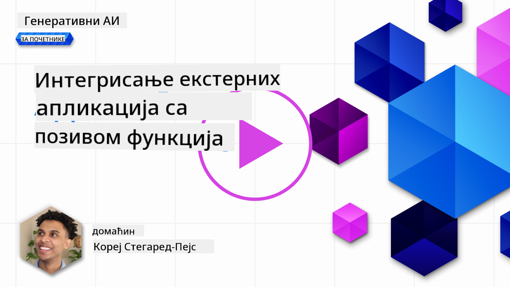
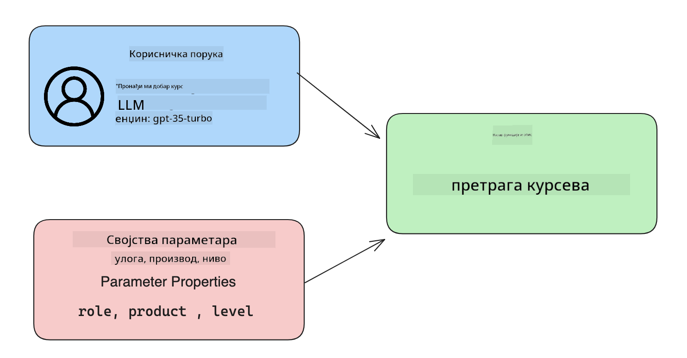

<!--
CO_OP_TRANSLATOR_METADATA:
{
  "original_hash": "f6f84f9ef2d066cd25850cab93580a50",
  "translation_date": "2025-10-18T01:17:43+00:00",
  "source_file": "11-integrating-with-function-calling/README.md",
  "language_code": "sr"
}
-->
# Интеграција са позивом функција

[](https://youtu.be/DgUdCLX8qYQ?si=f1ouQU5HQx6F8Gl2)

До сада сте научили доста тога у претходним лекцијама. Међутим, можемо још више унапредити. Неке ствари које можемо решити су како добити конзистентнији формат одговора како би било лакше радити са одговором у даљем процесу. Такође, можда ћемо желети да додамо податке из других извора како бисмо додатно обогатили нашу апликацију.

Горе поменути проблеми су оно што овај поглавље има за циљ да реши.

## Увод

Ова лекција ће обухватити:

- Објашњење шта је позив функција и његова примена.
- Креирање позива функције користећи Azure OpenAI.
- Како интегрисати позив функције у апликацију.

## Циљеви учења

На крају ове лекције, моћи ћете:

- Објаснити сврху коришћења позива функција.
- Поставити позив функције користећи Azure OpenAI Service.
- Дизајнирати ефикасне позиве функција за потребе ваше апликације.

## Сценарио: Унапређење нашег четбота помоћу функција

За ову лекцију, желимо да изградимо функцију за наш стартап у области образовања која омогућава корисницима да користе четбот за проналажење техничких курсева. Препоручићемо курсеве који одговарају њиховом нивоу вештина, тренутној улози и интересовању за технологију.

Да бисмо завршили овај сценарио, користићемо комбинацију:

- `Azure OpenAI` за креирање чет искуства за корисника.
- `Microsoft Learn Catalog API` за помоћ корисницима у проналажењу курсева на основу њихових захтева.
- `Function Calling` за узимање корисничког упита и слање истог функцији ради прављења API захтева.

Да бисмо започели, погледајмо зашто бисмо уопште желели да користимо позив функција:

## Зашто позив функција

Пре позива функција, одговори од LLM-а били су неструктурирани и неконзистентни. Програмери су морали да пишу сложен код за валидацију како би били сигурни да могу да обраде сваку варијацију одговора. Корисници нису могли да добију одговоре попут "Какво је тренутно време у Стокхолму?". То је зато што су модели били ограничени на време када су подаци били обучени.

Позив функција је функција Azure OpenAI Service која превазилази следеће ограничења:

- **Конзистентан формат одговора**. Ако можемо боље контролисати формат одговора, можемо лакше интегрисати одговор у даљи систем.
- **Екстерни подаци**. Могућност коришћења података из других извора апликације у контексту чета.

## Илустрација проблема кроз сценарио

> Препоручујемо вам да користите [укључени нотебоок](./python/aoai-assignment.ipynb?WT.mc_id=academic-105485-koreyst) ако желите да покренете доле наведени сценарио. Такође можете само читати даље док покушавамо да илуструјемо проблем где функције могу помоћи у његовом решавању.

Погледајмо пример који илуструје проблем формата одговора:

Рецимо да желимо да креирамо базу података о студентима како бисмо им предложили прави курс. Испод имамо два описа студената који су веома слични у подацима које садрже.

1. Креирајте везу са нашим Azure OpenAI ресурсом:

   ```python
   import os
   import json
   from openai import AzureOpenAI
   from dotenv import load_dotenv
   load_dotenv()

   client = AzureOpenAI(
   api_key=os.environ['AZURE_OPENAI_API_KEY'],  # this is also the default, it can be omitted
   api_version = "2023-07-01-preview"
   )

   deployment=os.environ['AZURE_OPENAI_DEPLOYMENT']
   ```

   Испод је Python код за конфигурисање наше везе са Azure OpenAI где постављамо `api_type`, `api_base`, `api_version` и `api_key`.

1. Креирање два описа студената користећи променљиве `student_1_description` и `student_2_description`.

   ```python
   student_1_description="Emily Johnson is a sophomore majoring in computer science at Duke University. She has a 3.7 GPA. Emily is an active member of the university's Chess Club and Debate Team. She hopes to pursue a career in software engineering after graduating."

   student_2_description = "Michael Lee is a sophomore majoring in computer science at Stanford University. He has a 3.8 GPA. Michael is known for his programming skills and is an active member of the university's Robotics Club. He hopes to pursue a career in artificial intelligence after finishing his studies."
   ```

   Желимо да пошаљемо горе наведене описе студената LLM-у ради парсирања података. Ови подаци касније могу бити коришћени у нашој апликацији и бити послати API-ју или сачувани у бази података.

1. Креирајмо два идентична упита у којима упућујемо LLM на информације које нас занимају:

   ```python
   prompt1 = f'''
   Please extract the following information from the given text and return it as a JSON object:

   name
   major
   school
   grades
   club

   This is the body of text to extract the information from:
   {student_1_description}
   '''

   prompt2 = f'''
   Please extract the following information from the given text and return it as a JSON object:

   name
   major
   school
   grades
   club

   This is the body of text to extract the information from:
   {student_2_description}
   '''
   ```

   Горе наведени упити упућују LLM да извуче информације и врати одговор у JSON формату.

1. Након постављања упита и везе са Azure OpenAI, сада ћемо послати упите LLM-у користећи `openai.ChatCompletion`. Чувамо упит у променљивој `messages` и додељујемо улогу `user`. Ово је да имитирамо поруку од корисника написану четботу.

   ```python
   # response from prompt one
   openai_response1 = client.chat.completions.create(
   model=deployment,
   messages = [{'role': 'user', 'content': prompt1}]
   )
   openai_response1.choices[0].message.content

   # response from prompt two
   openai_response2 = client.chat.completions.create(
   model=deployment,
   messages = [{'role': 'user', 'content': prompt2}]
   )
   openai_response2.choices[0].message.content
   ```

Сада можемо послати оба захтева LLM-у и испитати одговор који добијамо тако што ћемо га пронаћи овако `openai_response1['choices'][0]['message']['content']`.

1. На крају, можемо конвертовати одговор у JSON формат позивањем `json.loads`:

   ```python
   # Loading the response as a JSON object
   json_response1 = json.loads(openai_response1.choices[0].message.content)
   json_response1
   ```

   Одговор 1:

   ```json
   {
     "name": "Emily Johnson",
     "major": "computer science",
     "school": "Duke University",
     "grades": "3.7",
     "club": "Chess Club"
   }
   ```

   Одговор 2:

   ```json
   {
     "name": "Michael Lee",
     "major": "computer science",
     "school": "Stanford University",
     "grades": "3.8 GPA",
     "club": "Robotics Club"
   }
   ```

   Иако су упити исти и описи слични, видимо да су вредности својства `Grades` форматиране различито, јер понекад добијамо формат `3.7` или `3.7 GPA`, на пример.

   Овај резултат је зато што LLM узима неструктуриране податке у облику написаног упита и враћа такође неструктуриране податке. Потребно нам је да имамо структуриран формат како бисмо знали шта да очекујемо приликом чувања или коришћења ових података.

Па како онда решити проблем форматирања? Коришћењем позива функција можемо осигурати да добијемо структуиране податке назад. Када користимо позив функција, LLM заправо не позива или извршава било какве функције. Уместо тога, креирамо структуру коју LLM треба да прати за своје одговоре. Затим користимо те структуиране одговоре да знамо коју функцију да покренемо у нашим апликацијама.


Затим можемо узети оно што је враћено из функције и послати то назад LLM-у. LLM ће затим одговорити користећи природни језик како би одговорио на кориснички упит.

## Примери употребе позива функција

Постоји много различитих примера употребе где позив функција може побољшати вашу апликацију, као што су:

- **Позивање екстерних алата**. Четботови су одлични у пружању одговора на питања корисника. Коришћењем позива функција, четботови могу користити поруке од корисника за обављање одређених задатака. На пример, студент може затражити од четбота да "Пошаље имејл мом инструктору да ми је потребна додатна помоћ са овом темом". Ово може направити позив функције `send_email(to: string, body: string)`.

- **Креирање API или упита за базу података**. Корисници могу пронаћи информације користећи природни језик који се конвертује у форматирани упит или API захтев. Пример овога може бити наставник који пита "Који су студенти завршили последњи задатак", што би могло позвати функцију `get_completed(student_name: string, assignment: int, current_status: string)`.

- **Креирање структуираних података**. Корисници могу узети блок текста или CSV и користити LLM за извлачење важних информација из њега. На пример, студент може конвертовати чланак са Википедије о мировним споразумима како би креирао AI картице за учење. Ово се може урадити коришћењем функције `get_important_facts(agreement_name: string, date_signed: string, parties_involved: list)`.

## Креирање вашег првог позива функције

Процес креирања позива функције укључује 3 главна корака:

1. **Позивање** Chat Completions API са списком ваших функција и корисничком поруком.
2. **Читање** одговора модела ради извршења акције, тј. извршења функције или API позива.
3. **Прављење** још једног позива Chat Completions API са одговором из ваше функције како би се та информација искористила за креирање одговора кориснику.



### Корак 1 - креирање порука

Први корак је креирање корисничке поруке. Ово може бити динамички додељено узимањем вредности текстуалног уноса или можете овде доделити вредност. Ако је ово ваш први пут да радите са Chat Completions API, потребно је да дефинишете `role` и `content` поруке.

`role` може бити `system` (креирање правила), `assistant` (модел) или `user` (крајњи корисник). За позив функција, доделићемо ово као `user` и пример питања.

```python
messages= [ {"role": "user", "content": "Find me a good course for a beginner student to learn Azure."} ]
```

Додељивањем различитих улога, јасно је LLM-у да ли систем нешто говори или корисник, што помаже у изградњи историје разговора на којој LLM може да се заснива.

### Корак 2 - креирање функција

Затим ћемо дефинисати функцију и параметре те функције. Користићемо само једну функцију овде названу `search_courses`, али можете креирати више функција.

> **Важно**: Функције су укључене у системску поруку за LLM и биће укључене у количину доступних токена које имате на располагању.

Испод креирамо функције као низ ставки. Свака ставка је функција и има својства `name`, `description` и `parameters`:

```python
functions = [
   {
      "name":"search_courses",
      "description":"Retrieves courses from the search index based on the parameters provided",
      "parameters":{
         "type":"object",
         "properties":{
            "role":{
               "type":"string",
               "description":"The role of the learner (i.e. developer, data scientist, student, etc.)"
            },
            "product":{
               "type":"string",
               "description":"The product that the lesson is covering (i.e. Azure, Power BI, etc.)"
            },
            "level":{
               "type":"string",
               "description":"The level of experience the learner has prior to taking the course (i.e. beginner, intermediate, advanced)"
            }
         },
         "required":[
            "role"
         ]
      }
   }
]
```

Хајде да детаљније опишемо сваку инстанцу функције:

- `name` - Назив функције коју желимо да буде позвана.
- `description` - Ово је опис како функција ради. Овде је важно бити специфичан и јасан.
- `parameters` - Списак вредности и формата које желимо да модел произведе у свом одговору. Низ параметара се састоји од ставки где ставке имају следећа својства:
  1.  `type` - Тип података у којем ће својства бити сачувана.
  1.  `properties` - Списак специфичних вредности које ће модел користити за свој одговор.
      1. `name` - Кључ је назив својства које ће модел користити у свом форматираном одговору, на пример, `product`.
      1. `type` - Тип података овог својства, на пример, `string`.
      1. `description` - Опис специфичног својства.

Постоји и опционално својство `required` - неопходно својство за завршетак позива функције.

### Корак 3 - Извршење позива функције

Након дефинисања функције, сада треба да је укључимо у позив Chat Completion API-ја. То радимо додавањем `functions` у захтев. У овом случају `functions=functions`.

Постоји и опција да се постави `function_call` на `auto`. То значи да ћемо дозволити LLM-у да одлучи коју функцију треба позвати на основу корисничке поруке, уместо да је сами додељујемо.

Ево кода испод где позивамо `ChatCompletion.create`, обратите пажњу како постављамо `functions=functions` и `function_call="auto"` и тиме дајемо LLM-у избор када да позове функције које му пружамо:

```python
response = client.chat.completions.create(model=deployment,
                                        messages=messages,
                                        functions=functions,
                                        function_call="auto")

print(response.choices[0].message)
```

Одговор који сада стиже изгледа овако:

```json
{
  "role": "assistant",
  "function_call": {
    "name": "search_courses",
    "arguments": "{\n  \"role\": \"student\",\n  \"product\": \"Azure\",\n  \"level\": \"beginner\"\n}"
  }
}
```

Овде можемо видети како је функција `search_courses` позвана и са којим аргументима, као што је наведено у својству `arguments` у JSON одговору.

Закључак је да је LLM успео да пронађе податке који одговарају аргументима функције, јер их је извукао из вредности пружене параметру `messages` у позиву за завршетак чета. Испод је подсетник на вредност `messages`:

```python
messages= [ {"role": "user", "content": "Find me a good course for a beginner student to learn Azure."} ]
```

Као што видите, `student`, `Azure` и `beginner` су извучени из `messages` и постављени као улаз функцији. Коришћење функција на овај начин је одличан начин за извлачење информација из упита, али и за пружање структуре LLM-у и имање поновљиве функционалности.

Следеће, треба да видимо како можемо ово користити у нашој апликацији.

## Интеграција позива функција у апликацију

Након што смо тестирали форматирани одговор од LLM-а, сада можемо интегрисати ово у нашу апликацију.

### Управљање током

Да бисмо интегрисали ово у нашу апликацију, хајде да предузмемо следеће кораке:

1. Прво, хајде да направимо позив OpenAI услугама и сачувамо поруку у променљивој названој `response_message`.

   ```python
   response_message = response.choices[0].message
   ```

1. Сада ћемо дефинисати функцију која ће позвати Microsoft Learn API да добије списак курсева:

   ```python
   import requests

   def search_courses(role, product, level):
     url = "https://learn.microsoft.com/api/catalog/"
     params = {
        "role": role,
        "product": product,
        "level": level
     }
     response = requests.get(url, params=params)
     modules = response.json()["modules"]
     results = []
     for module in modules[:5]:
        title = module["title"]
        url = module["url"]
        results.append({"title": title, "url": url})
     return str(results)
   ```

   Обратите пажњу како сада креирамо стварну Python функцију која се мапира на називе функција уведене у променљивој `functions`. Такође правимо стварне екстерне API позиве да бисмо добили податке који су нам потребни. У овом случају, идемо на Microsoft Learn API да тражимо модуле за обуку.

Ок, креирали смо променљиву `functions` и одговарајућу Python функцију, како кажемо LLM-у како да их мапира тако да наша Python функција буде позвана?

1. Да бисмо видели да ли треба да позовемо Python функцију, треба да погледамо у одговор LLM-а и видимо да ли је `function_call` део њега и позовемо назначену функцију. Ево како можете направити поменуту проверу испод:

   ```python
   # Check if the model wants to call a function
   if response_message.function_call.name:
    print("Recommended Function call:")
    print(response_message.function_call.name)
    print()

    # Call the function.
    function_name = response_message.function_call.name

    available_functions = {
            "search_courses": search_courses,
    }
    function_to_call = available_functions[function_name]

    function_args = json.loads(response_message.function_call.arguments)
    function_response = function_to_call(**function_args)

    print("Output of function call:")
    print(function_response)
    print(type(function_response))


    # Add the assistant response and function response to the messages
    messages.append( # adding assistant response to messages
        {
            "role": response_message.role,
            "function_call": {
                "name": function_name,
                "arguments": response_message.function_call.arguments,
            },
            "content": None
        }
    )
    messages.append( # adding function response to messages
        {
            "role": "function",
            "name": function_name,
            "content":function_response,
        }
    )
   ```

   Ове три линије осигуравају да извучемо назив функције, аргументе и направимо позив:

   ```python
   function_to_call = available_functions[function_name]

   function_args = json.loads(response_message.function_call.arguments)
   function_response = function_to_call(**function_args)
   ```

   Испод је излаз из покретања нашег кода:

   **Излаз**

   ```Recommended Function call:
   {
     "name": "search_courses",
     "arguments": "{\n  \"role\": \"student\",\n  \"product\": \"Azure\",\n  \"level\": \"beginner\"\n}"
   }

   Output of function call:
   [{'title': 'Describe concepts of cryptography', 'url': 'https://learn.microsoft.com/training/modules/describe-concepts-of-cryptography/?
   WT.mc_id=api_CatalogApi'}, {'title': 'Introduction to audio classification with TensorFlow', 'url': 'https://learn.microsoft.com/en-
   us/training/modules/intro-audio-classification-tensorflow/?WT.mc_id=api_CatalogApi'}, {'title': 'Design a Performant Data Model in Azure SQL
   Database with Azure Data Studio', 'url': 'https://learn.microsoft.com/training/modules/design-a-data-model-with-ads/?
   WT.mc_id=api_CatalogApi'}, {'title': 'Getting started with the Microsoft Cloud Adoption Framework for Azure', 'url':
   'https://learn.microsoft.com/training/modules/cloud-adoption-framework-getting-started/?WT.mc_id=api_CatalogApi'}, {'title': 'Set up the
   Rust development environment', 'url': 'https://learn.microsoft.com/training/modules/rust-set-up-environment/?WT.mc_id=api_CatalogApi'}]
   <class 'str'>
   ```

1. Сада ћемо послати ажурирану поруку, `messages`, LLM-у како бисмо добили одговор на природном језику уместо API JSON форматираног одговора.

   ```python
   print("Messages in next request:")
   print(messages)
   print()

   second_response = client.chat.completions.create(
      messages=messages,
      model=deployment,
      function_call="auto",
      functions=functions,
      temperature=0
         )  # get a new response from GPT where it can see the function response


   print(second_response.choices[0].message)
   ```

   **Излаз**

   ```python
   {
     "role": "assistant",
     "content": "I found some good courses for beginner students to learn Azure:\n\n1. [Describe concepts of cryptography] (https://learn.microsoft.com/training/modules/describe-concepts-of-cryptography/?WT.mc_id=api_CatalogApi)\n2. [Introduction to audio classification with TensorFlow](https://learn.microsoft.com/training/modules/intro-audio-classification-tensorflow/?WT.mc_id=api_CatalogApi)\n3. [Design a Performant Data Model in Azure SQL Database with Azure Data Studio](https://learn.microsoft.com/training/modules/design-a-data-model-with-ads/?WT.mc_id=api_CatalogApi)\n4. [Getting started with the Microsoft Cloud Adoption Framework for Azure](https://learn.microsoft.com/training/modules/cloud-adoption-framework-getting-started/?WT.mc_id=api_CatalogApi)\n5. [Set up the Rust development environment](https://learn.microsoft.com/training/modules/rust-set-up-environment/?WT.mc_id=api_CatalogApi)\n\nYou can click on the links to access the courses."
   }

   ```

## Задатак

Да бисте наставили са учењем Azure OpenAI Function Calling-а, можете изградити:

- Више параметара функције који могу помоћи ученицима да пронађу више курсева.
- Креирајте још један позив функције који узима више информација од ученика, као што је њихов матерњи језик.
- Направите обраду грешака када позив функције и/или API позив не врати одговарајуће курсеве

Савет: Пратите страницу [Learn API референтна документација](https://learn.microsoft.com/training/support/catalog-api-developer-reference?WT.mc_id=academic-105485-koreyst) да бисте видели како и где су доступни ови подаци.

## Одличан рад! Наставите путовање

Након завршетка ове лекције, погледајте нашу [колекцију за учење о генеративној вештачкој интелигенцији](https://aka.ms/genai-collection?WT.mc_id=academic-105485-koreyst) да наставите са унапређивањем знања о генеративној вештачкој интелигенцији!

Прелазимо на лекцију 12, где ћемо погледати како [дизајнирати UX за AI апликације](../12-designing-ux-for-ai-applications/README.md?WT.mc_id=academic-105485-koreyst)!

---

**Одрицање од одговорности**:  
Овај документ је преведен помоћу услуге за превођење вештачке интелигенције [Co-op Translator](https://github.com/Azure/co-op-translator). Иако настојимо да обезбедимо тачност, молимо вас да имате у виду да аутоматски преводи могу садржати грешке или нетачности. Оригинални документ на његовом изворном језику треба сматрати меродавним извором. За критичне информације препоручује се професионални превод од стране људи. Не преузимамо одговорност за било каква погрешна тумачења или неспоразуме који могу произаћи из коришћења овог превода.