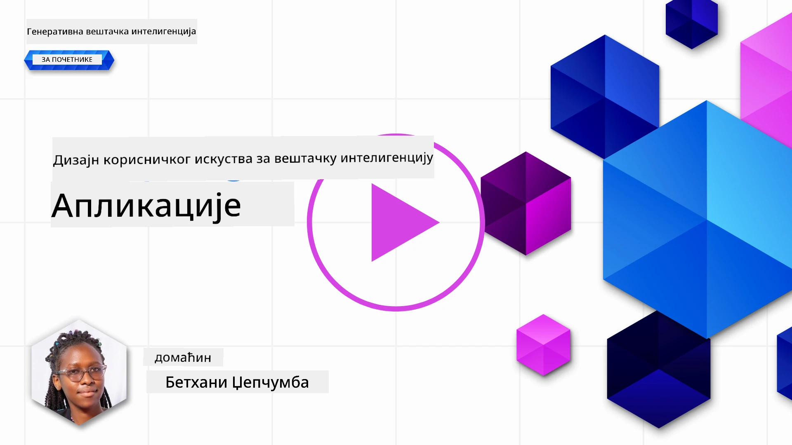
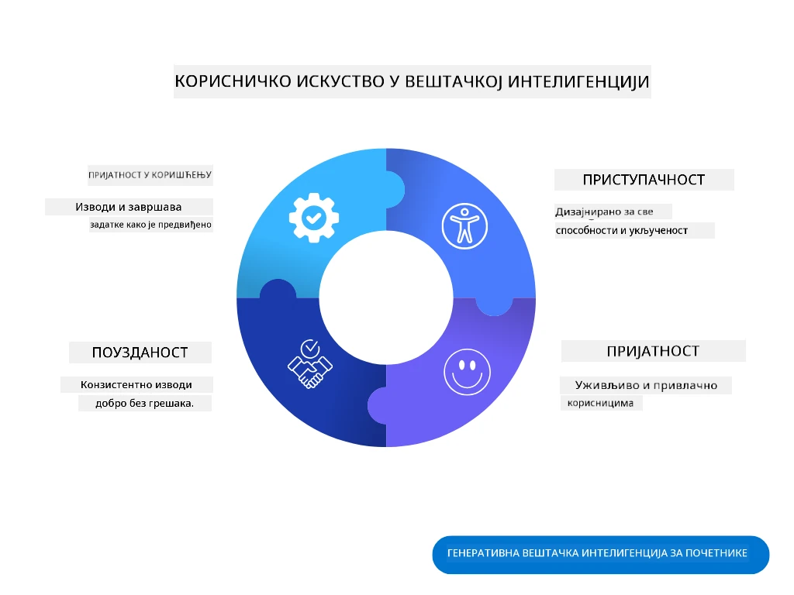
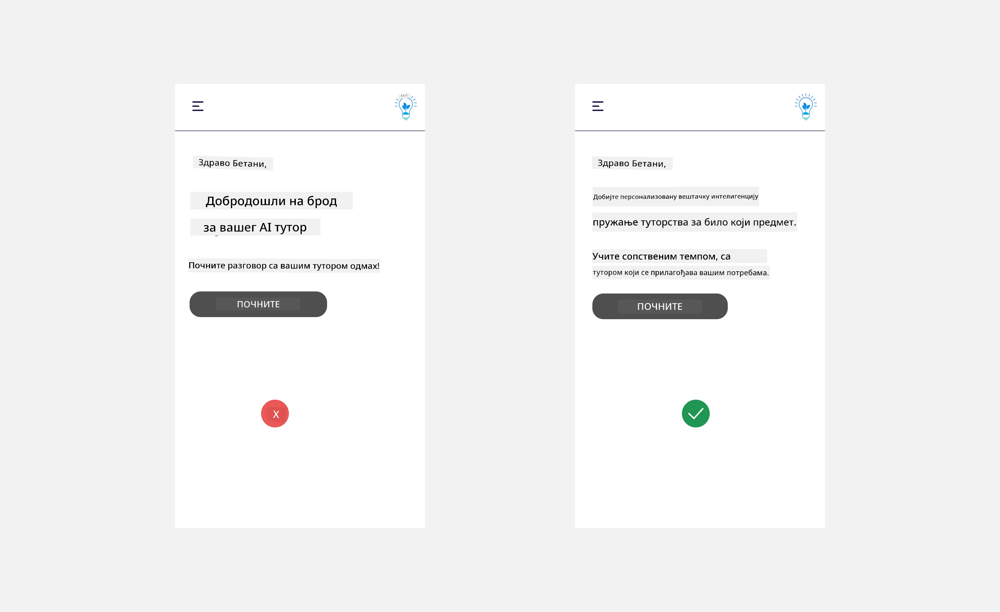
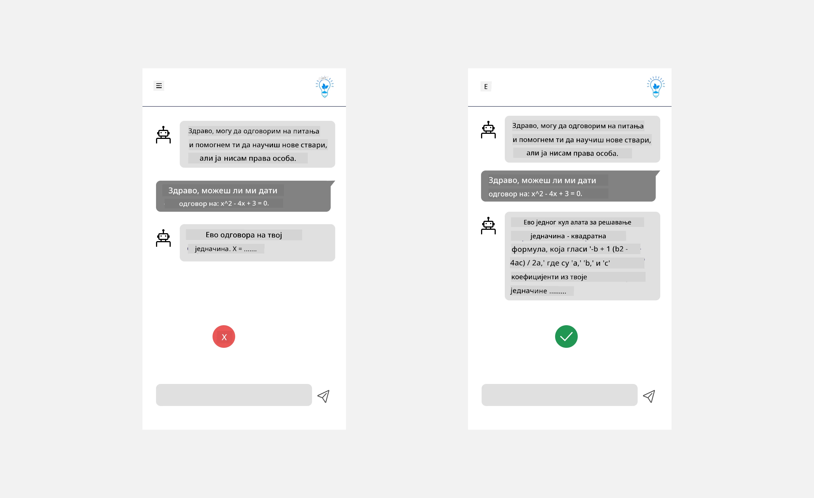
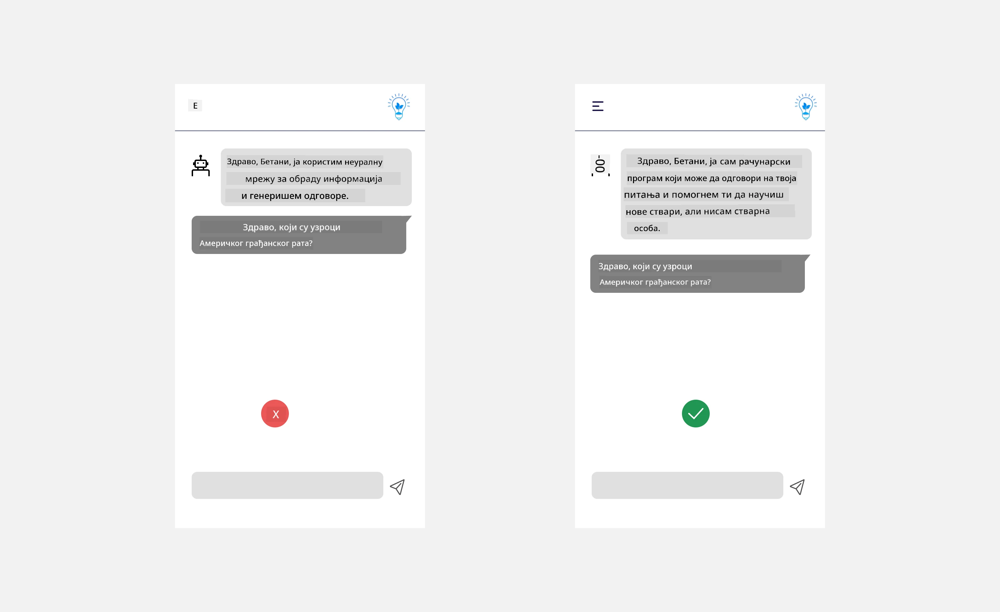
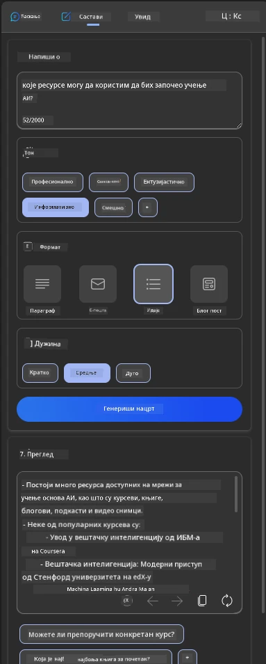
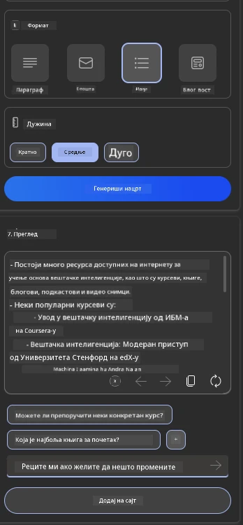
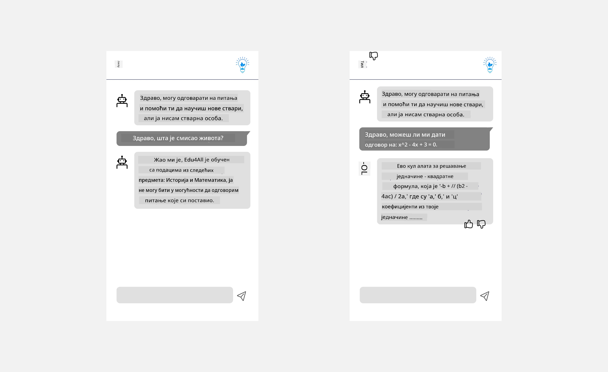

# Дизајн UX-а за AI апликације

> _(Кликните на слику изнад да бисте погледали видео о овој лекцији)_

Корисничко искуство је веома важан аспект изградње апликација. Корисници морају бити у могућности да користе вашу апликацију на ефикасан начин за обављање задатака. Ефикасност је једна ствар, али такође морате дизајнирати апликације тако да их могу користити сви, како бисте их учинили _приступачним_. Ово поглавље ће се фокусирати на то подручје како бисте се надамо завршили са дизајном апликације коју људи могу и желе да користе.

## Увод

Корисничко искуство је начин на који корисник интерагује са одређеним производом или услугом, било да је то систем, алат или дизајн. При развоју AI апликација, програмери се не фокусирају само на обезбеђивање ефикасности корисничког искуства већ и на његову етичност. У овој лекцији покривамо како изградити апликације вештачке интелигенције (AI) које одговарају потребама корисника.

Лекција ће обухватити следећа подручја:

- Увод у корисничко искуство и разумевање потреба корисника
- Дизајнирање AI апликација за поверење и транспарентност
- Дизајнирање AI апликација за сарадњу и повратне информације

## Циљеви учења

Након похађања ове лекције, моћи ћете да:

- Разумете како изградити AI апликације које испуњавају потребе корисника.
- Дизајнирате AI апликације које подстичу поверење и сарадњу.

### Претпоставка

Одвојите време и прочитајте више о [корисничком искуству и дизајн размишљању.](https://learn.microsoft.com/training/modules/ux-design?WT.mc_id=academic-105485-koreyst)

## Увод у корисничко искуство и разумевање потреба корисника

У нашем измишљеном едукативном стартапу имамо два главна корисника, наставнике и ученике. Сваки од ових корисника има јединствене потребе. Дизајн усмерен на корисника поставља корисника у центар пажње узимајући у обзир да производи буду релевантни и корисни за оне за које су намењени.

Апликација треба да буде **корисна, поуздана, приступачна и пријатна** како би пружила добро корисничко искуство.

### Употребљивост

Корисна апликација има функционалност која одговара њеној намени, као што је аутоматизација процеса оцењивања или генерисање флеш картица за понављање. Апликација која аутоматизује процес оцењивања треба да буде у стању да прецизно и ефикасно додели оцене радовима студената на основу унапред дефинисаних критеријума. Слично томе, апликација која генерише флеш картице за понављање треба да креира релевантна и разнолика питања на основу својих података.

### Поузданост

Поузданост значи да апликација може доследно да обавља своје задатке без грешака. Међутим, AI као и људи није савршен и може правити грешке. Апликације могу наићи на грешке или неочекиване ситуације које захтевају људску интервенцију или исправку. Како обрађујете грешке? У последњем делу ове лекције објаснићемо како су AI системи и апликације дизајнирани за сарадњу и повратне информације.

### Приступачност

Приступачност значи проширити корисничко искуство на кориснике са различитим способностима, укључујући особе са инвалидитетом, тако да нико није искључен. Пратијући смернице и принципе приступачности, AI решења постају инклузивнија, употребљивија и кориснија за све кориснике.

### Пријатност

Пријатност значи да је апликација угодна за коришћење. Привлачно корисничко искуство може позитивно утицати на корисника, подстичући га да се враћа апликацији и повећавајући приходе пословања.

Ни сваки изазов не може бити решен помоћу AI. AI долази да допуни ваше корисничко искуство, било да аутоматизује ручне задатке или персонализује корисничка искуства.

## Дизајн AI апликација за поверење и транспарентност

Изградња поверења је кључна при дизајнирању AI апликација. Поверење осигурава да корисник има поверења да ће апликација обавити посао, доследно испоручити резултате и да су резултати у складу са потребама корисника. Ризик у овом подручју су неповерење и прекомерно поверење. Неповерење настаје када корисник има мало или никаво поверење у AI систем, што доводи до одбијања апликације. Прекомерно поверење се јавља када корисник прецењује способност AI система, што доводи до претераног поверења у AI систем. На пример, аутоматизовани систем оцењивања у случају прекомерног поверења може довести до тога да наставник не прегледа неке тестове како би осигурао правилно функционисање система оцењивања. То може резултирати неправедним или нетачним оцена за ученике или пропуштеним приликама за повратне информације и побољшање.

Два начина да се поверење стави у центар дизајна су објашњивост и контрола.

### Објашњивост

Када AI помаже у доношењу одлука као што је преношење знања будућим генерацијама, критично је да наставници и родитељи разумеју како се одлуке AI доносе. То је објашњивост - разумевање како AI апликације доносе одлуке. Дизајнирање за објашњивост укључује додавање детаља који истичу како је AI дошао до резултата. Публика мора бити свесна да је резултат генерисао AI, а не човек. На пример, уместо да кажете "Почните да ћаскате са својим тутором сада" реци "Користите AI тутора који се прилагођава вашим потребама и помаже вам да учите својим темпом."

Још један пример је како AI користи корисничке и личне податке. На пример, корисник са персоном студента може имати ограничења на основу те персоне. AI можда неће моћи да открије одговоре на питања, али може помоћи кориснику да размишља о начину решавања проблема.

Још један кључни део објашњивости је поједностављење објашњења. Ученици и наставници можда нису AI стручњаци, стога објашњења о томе шта апликација може или не може да уради треба да буду једноставна и лако разумљива.

### Контрола

Генеративни AI ствара сарадњу између AI и корисника, где корисник може модификовати упите за различите резултате. Поред тога, након генерисања резултата, корисници треба да имају могућност да измене резултате што им даје осећај контроле. На пример, када користите Microsoft Copilot (раније Bing Chat), можете прилагодити свој упит на основу формата, тона и дужине. Поред тога, можете додавати измене и мењати резултат као што је приказано испод:

Још једна функција у Microsoft Copilot-у која омогућава кориснику контролу над апликацијом је могућност укључивања и искључивања података које AI користи. За школску апликацију ученик може желети да користи своје белешке као и наставничке ресурсе као материјал за понављање.

> При дизајну AI апликација, намерност је кључна да корисници не би превазишли поверење постављањем нереалних очекивања о њиховим способностима. Један од начина за то је стварање отпора између упита и резултата, подсећајући корисника да је ово AI а не други човек.

## Дизајн AI апликација за сарадњу и повратне информације

Као што је раније поменуто, генеративни AI ствара сарадњу између корисника и AI. Већина интеракција је са корисником који уноси упит, а AI генерише резултат. Шта ако је резултат нетачан? Како апликација обрађује грешке ако се појаве? Да ли AI криви корисника или одваја време да објасни грешку?

AI апликације треба градити тако да примају и дају повратне информације. Ово не само да помаже AI систему да се побољша већ и гради поверење са корисницима. Повратна спирала треба бити укључена у дизајн, пример може бити једноставан палчеви горе или доле на резултат.

Још један начин да се то реши је јасна комуникација могућности и ограничења система. Када корисник направи грешку тражећи нешто што прелази AI могућности, треба постојати начин да се то реши, као што је приказано доле.

Грешке у систему су честе код апликација где корисник може тражити помоћ за информације ван домета AI или апликација може имати ограничење колико питања/предмета корисник може генерисати резимеа. На пример, AI апликација обучена на подацима из ограничених предмета као што су Историја и Математика можда неће моћи да обради питања о Географији. Да би се то избегло, AI систем може дати одговор попут: "Жао ми је, наш производ је обучен на подацима из следећих предмета....., не могу одговорити на питање које сте поставили."

AI апликације нису савршене, стога ће правити грешке. При дизајну апликација треба обезбедити простор за повратне информације од корисника и обраду грешака на једноставан и лако објашњив начин.

## Задатак

Узмите било коју AI апликацију коју сте до сада направили, размислите о примени следећих корака у вашој апликацији:

- **Пријатност:** Размислите како можете учинити вашу апликацију пријатнијом. Да ли свуда додајете објашњења? Да ли подстичете корисника да истражује? Како формулишете поруке о грешкама?

- **Употребљивост:** Правите веб апликацију. Осигурајте да ваша апликација може да се користи и мишем и тастатуром.

- **Поверење и транспарентност:** Немојте у потпуности веровати AI-ју и његовом резултату, размислите како бисте додали човека у процес верификације резултата. Такође, размотрите и примените друге начине да се постигне поверење и транспарентност.

- **Контрола:** Дајте кориснику контролу над подацима које пружа апликацији. Имплементирајте начин да корисник може да се укључи или искључи из прикупљања података у AI апликацији.

<!-- ## [Post-lecture quiz](../../../12-designing-ux-for-ai-applications/quiz-url) -->

## Наставите са учењем!

Након завршетка ове лекције, погледајте нашу [Колекцију учења о генеративном AI-ју](https://aka.ms/genai-collection?WT.mc_id=academic-105485-koreyst) да бисте наставили да унапредите своје знање о генеративном AI-ју!

Пређите на Лекцију 13, где ћемо погледати како да [заштитите AI апликације](../13-securing-ai-applications/README.md?WT.mc_id=academic-105485-koreyst)!

---

<!-- CO-OP TRANSLATOR DISCLAIMER START -->
**Изјава о одрицању одговорности**:
Овај документ је преведен коришћењем услуге за аутоматски превод [Co-op Translator](https://github.com/Azure/co-op-translator). Иако тежимо тачности, имајте у виду да аутоматски преводи могу садржати грешке или нетачности. Оригинални документ на његовом изворном језику треба сматрати ауторитативним извором. За критичне информације препоручује се професионални људски превод. Нисмо одговорни за било каква неспоразума или погрешна тумачења која произилазе из коришћења овог превода.
<!-- CO-OP TRANSLATOR DISCLAIMER END -->