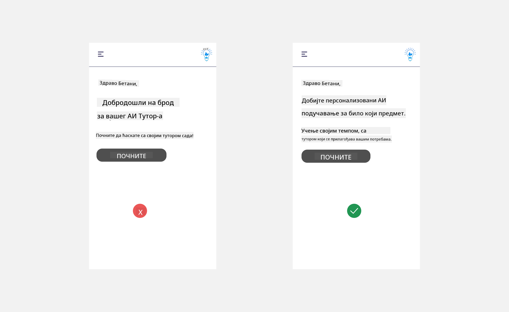
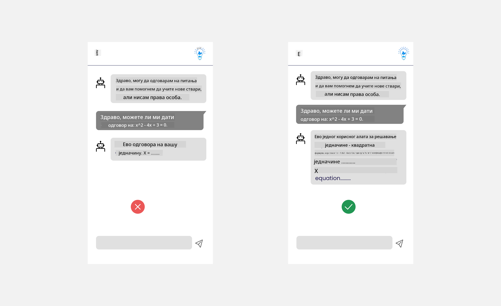

<!--
CO_OP_TRANSLATOR_METADATA:
{
  "original_hash": "ec385b41ee50579025d50cc03bfb3a25",
  "translation_date": "2025-07-09T15:05:32+00:00",
  "source_file": "12-designing-ux-for-ai-applications/README.md",
  "language_code": "sr"
}
-->
# Дизајн корисничког искуства за AI апликације

> _(Кликните на слику изнад да бисте погледали видео о овој лекцији)_

Корисничко искуство је веома важан аспект у изградњи апликација. Корисници морају моћи да користе вашу апликацију на ефикасан начин да би обавили задатке. Ефикасност је једна ствар, али такође треба да дизајнирате апликације тако да их сви могу користити, односно да буду _приступачне_. Ово поглавље ће се фокусирати на то како бисте на крају дизајнирали апликацију коју људи могу и желе да користе.

## Увод

Корисничко искуство је начин на који корисник комуницира и користи одређени производ или услугу, било да је то систем, алат или дизајн. При развоју AI апликација, програмери се не фокусирају само на то да корисничко искуство буде ефикасно, већ и етичко. У овој лекцији ћемо обрадити како изградити апликације вештачке интелигенције (AI) које одговарају потребама корисника.

Лекција ће обухватити следеће области:

- Увод у корисничко искуство и разумевање потреба корисника  
- Дизајн AI апликација за поверење и транспарентност  
- Дизајн AI апликација за сарадњу и повратне информације  

## Циљеви учења

Након ове лекције, моћи ћете да:

- Разумете како изградити AI апликације које задовољавају потребе корисника.  
- Дизајнирате AI апликације које подстичу поверење и сарадњу.  

### Претходно знање

Одвојите време и прочитајте више о [корисничком искуству и дизајн размишљању.](https://learn.microsoft.com/training/modules/ux-design?WT.mc_id=academic-105485-koreyst)

## Увод у корисничко искуство и разумевање потреба корисника

У нашем измишљеном стартапу за образовање, имамо два главна корисника: наставнике и ученике. Сваки од њих има јединствене потребе. Дизајн усмерен на корисника ставља корисника у центар пажње, осигуравајући да производи буду релевантни и корисни за оне за које су намењени.

Апликација треба да буде **корисна, поуздана, приступачна и пријатна** како би пружила добро корисничко искуство.

### Употребљивост

Корисна апликација има функционалност која одговара њеној намени, као што је аутоматизација процеса оцењивања или генерисање флашкарти за учење. Апликација која аутоматизује оцењивање треба да буде у стању да прецизно и ефикасно додели оцене на основу унапред дефинисаних критеријума. Слично томе, апликација која генерише флашкарте за учење треба да креира релевантна и разнолика питања на основу својих података.

### Поузданост

Поуздана апликација може доследно и без грешака обављати свој задатак. Међутим, AI, као и људи, није савршен и може правити грешке. Апликације могу наићи на грешке или неочекиване ситуације које захтевају људску интервенцију или исправку. Како се носити са грешкама? У последњем делу ове лекције обрадимо како су AI системи и апликације дизајнирани за сарадњу и повратне информације.

### Приступачност

Приступачност значи проширити корисничко искуство на кориснике са различитим способностима, укључујући и особе са инвалидитетом, како нико не би био искључен. Пратећи смернице и принципе приступачности, AI решења постају инклузивнија, употребљивија и кориснија за све кориснике.

### Пријатност

Пријатна апликација је она коју је задовољство користити. Привлачно корисничко искуство може позитивно утицати на корисника, подстичући га да се враћа апликацији и повећавајући приходе.

Неки изазови се не могу решити AI-јем. AI долази као подршка вашем корисничком искуству, било да аутоматизује ручне задатке или персонализује корисничко искуство.

## Дизајн AI апликација за поверење и транспарентност

Изградња поверења је кључна приликом дизајнирања AI апликација. Поверење осигурава да корисник има поверења да ће апликација обавити посао, доследно испоручивати резултате и да су ти резултати оно што корисник треба. Ризици у овој области су неповерење и претерано поверење. Неповерење се јавља када корисник има мало или нимало поверења у AI систем, што доводи до одбијања апликације. Претерано поверење се јавља када корисник прецењује могућности AI система, што доводи до претераног ослањања на њега. На пример, у случају претераног поверења, аутоматизовани систем оцењивања може довести до тога да наставник не прегледа неке радове како би проверио исправност система. То може резултирати неправедним или нетачним оценама за ученике или пропуштеним приликама за повратне информације и унапређење.

Два начина да се поверење стави у центар дизајна су објашњивост и контрола.

### Објашњивост

Када AI помаже у доношењу одлука, као што је преношење знања будућим генерацијама, важно је да наставници и родитељи разумеју како се одлуке доносе. То је објашњивост – разумевање начина на који AI апликације доносе одлуке. Дизајн за објашњивост укључује додавање примера шта AI апликација може да уради. На пример, уместо „Почните са AI наставником“, систем може користити: „Сажмите своје белешке за лакше учење помоћу AI.“

Још један пример је како AI користи корисничке и личне податке. На пример, корисник са улогом ученика може имати ограничења у складу са својом улогом. AI можда неће моћи да открије одговоре на питања, али може помоћи кориснику да размисли о томе како да реши проблем.

Још један важан део објашњивости је поједностављење објашњења. Ученици и наставници можда нису AI стручњаци, па објашњења о томе шта апликација може или не може да уради треба да буду једноставна и лако разумљива.

### Контрола

Генеративни AI ствара сарадњу између AI и корисника, где корисник може мењати упите ради различитих резултата. Поред тога, након што се резултат генерише, корисници треба да могу да га мењају, што им даје осећај контроле. На пример, када користите Bing, можете прилагодити упит по формату, тону и дужини. Такође, можете додавати измене и мењати резултат као што је приказано испод:

Још једна функција у Bing-у која омогућава кориснику контролу над апликацијом је могућност да се укључи или искључи коришћење података које AI користи. За школску апликацију, ученик може желети да користи своје белешке као и наставничке ресурсе као материјал за учење.

> При дизајнирању AI апликација, намерност је кључна како би се спречило претерано поверење и постављање нереалних очекивања о могућностима. Један од начина је увођење отпора између упита и резултата, подсећајући корисника да је ово AI, а не други човек.

## Дизајн AI апликација за сарадњу и повратне информације

Као што је раније поменуто, генеративни AI ствара сарадњу између корисника и AI. Већина интеракција подразумева да корисник уноси упит, а AI генерише резултат. Шта ако је резултат нетачан? Како апликација поступа у случају грешака? Да ли AI криви корисника или објашњава грешку?

AI апликације треба да буду дизајниране тако да примају и дају повратне информације. Ово не само да помаже AI систему да се побољша, већ и гради поверење са корисницима. У дизајн треба укључити повратну спрегу, на пример једноставан палчеве горе или доле за резултат.

Још један начин да се ово реши је јасна комуникација о могућностима и ограничењима система. Када корисник направи грешку тражећи нешто изван могућности AI, треба постојати начин да се то обради, као што је приказано испод.

Грешке у систему су честе у апликацијама где корисник може тражити помоћ изван домена AI или апликација има ограничење колико питања/предмета корисник може да генерише сажетке. На пример, AI апликација обучена на подацима из ограничених предмета, као што су Историја и Математика, можда неће моћи да одговори на питања из Географије. Да би се то избегло, AI систем може дати одговор као: „Жао нам је, наш производ је обучен на подацима из следећих предмета..., не могу да одговорим на питање које сте поставили.“

AI апликације нису савршене, па ће правити грешке. При дизајнирању апликација треба обезбедити простор за повратне информације корисника и руковање грешкама на једноставан и лако разумљив начин.

## Задатак

Узмите било коју AI апликацију коју сте до сада направили и размислите о имплементацији следећих корака у вашој апликацији:

- **Пријатност:** Размислите како да вашу апликацију учините пријатнијом. Да ли свуда додајете објашњења? Да ли подстичете корисника да истражује? Како формулишете поруке о грешкама?

- **Употребљивост:** Ако правите веб апликацију, уверите се да је навигација могућа и мишем и тастатуром.

- **Поверење и транспарентност:** Немојте потпуно веровати AI-ју и његовим резултатима, размислите како бисте укључили човека у процес да провери резултате. Такође, размислите и примените друге начине за постизање поверења и транспарентности.

- **Контрола:** Дајте кориснику контролу над подацима које пружа апликацији. Имплементирајте начин да корисник може да се укључи или искључи из прикупљања података у AI апликацији.

## Наставите са учењем!

Након завршетка ове лекције, погледајте нашу [колекцију за учење о генеративном AI-ју](https://aka.ms/genai-collection?WT.mc_id=academic-105485-koreyst) и наставите да унапређујете своје знање о генеративном AI-ју!

Прелазите на Лекцију 13, где ћемо погледати како [заштитити AI апликације](../13-securing-ai-applications/README.md?WT.mc_id=academic-105485-koreyst)!

**Одрицање од одговорности**:  
Овај документ је преведен коришћењем AI услуге за превођење [Co-op Translator](https://github.com/Azure/co-op-translator). Иако се трудимо да превод буде тачан, молимо вас да имате у виду да аутоматски преводи могу садржати грешке или нетачности. Оригинални документ на његовом изворном језику треба сматрати ауторитетним извором. За критичне информације препоручује се професионални људски превод. Нисмо одговорни за било каква неспоразума или погрешна тумачења која произилазе из коришћења овог превода.