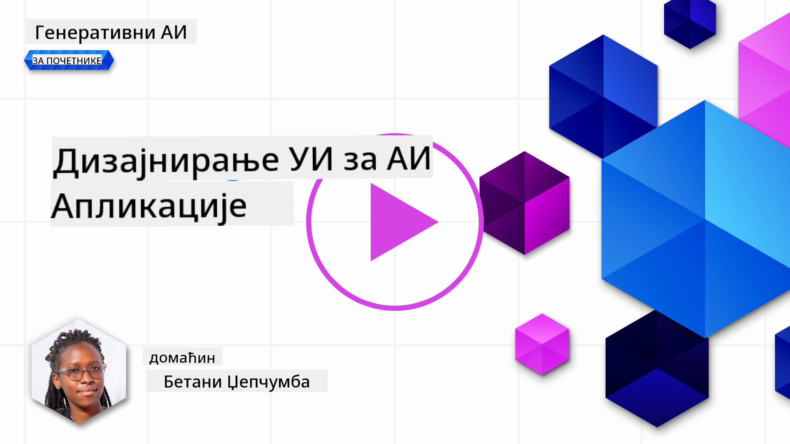

<!--
CO_OP_TRANSLATOR_METADATA:
{
  "original_hash": "747668e4c53d067369f06e9ec2e6313e",
  "translation_date": "2025-08-26T19:37:37+00:00",
  "source_file": "12-designing-ux-for-ai-applications/README.md",
  "language_code": "sr"
}
-->
# Дизајнирање корисничког искуства за AI апликације

> _(Кликните на слику изнад да бисте погледали видео овог часа)_

Корисничко искуство је веома важан аспект при изради апликација. Корисници морају да могу да користе вашу апликацију на ефикасан начин како би обавили задатке. Бити ефикасан је једна ствар, али такође је важно да дизајнирате апликације тако да могу да их користе сви, односно да буду _приступачне_. Ово поглавље ће се фокусирати на ту област како бисте на крају дизајнирали апликацију коју људи могу и желе да користе.

## Увод

Корисничко искуство је начин на који корисник комуницира и користи одређени производ или услугу, било да је у питању систем, алат или дизајн. Када развијате AI апликације, програмери не размишљају само о томе да корисничко искуство буде ефикасно, већ и етичко. У овом часу ћемо обрадити како да направите апликације вештачке интелигенције (AI) које одговарају на потребе корисника.

Час ће обухватити следеће области:

- Увод у корисничко искуство и разумевање потреба корисника
- Дизајнирање AI апликација за поверење и транспарентност
- Дизајнирање AI апликација за сарадњу и повратне информације

## Циљеви учења

Након овог часа, моћи ћете да:

- Разумете како да направите AI апликације које одговарају на потребе корисника.
- Дизајнирате AI апликације које подстичу поверење и сарадњу.

### Предуслов

Одвојите мало времена и прочитајте више о [корисничком искуству и дизајн размишљању.](https://learn.microsoft.com/training/modules/ux-design?WT.mc_id=academic-105485-koreyst)

## Увод у корисничко искуство и разумевање потреба корисника

У нашој измишљеној едукативној стартап компанији, имамо два главна корисника, наставнике и ученике. Сваки од ова два корисника има јединствене потребе. Дизајн усмерен на корисника даје приоритет кориснику, осигуравајући да су производи релевантни и корисни за оне којима су намењени.

Апликација треба да буде **корисна, поуздана, приступачна и пријатна** како би пружила добро корисничко искуство.

### Употребљивост

Бити користан значи да апликација има функционалности које одговарају њеној намени, као што је аутоматизација процеса оцењивања или генерисање флеш картица за понављање градива. Апликација која аутоматизује процес оцењивања треба да може тачно и ефикасно да додели поене ученицима на основу унапред дефинисаних критеријума. Слично томе, апликација која генерише флеш картице за понављање треба да може да креира релевантна и разноврсна питања на основу својих података.

### Поузданост

Бити поуздан значи да апликација може доследно и без грешака да обавља свој задатак. Међутим, AI као и људи није савршен и може да прави грешке. Апликације могу наићи на грешке или неочекиване ситуације које захтевају људску интервенцију или исправку. Како решавате грешке? У последњем делу овог часа, обрадићемо како се AI системи и апликације дизајнирају за сарадњу и повратне информације.

### Приступачност

Бити приступачан значи проширити корисничко искуство на кориснике са различитим способностима, укључујући и оне са инвалидитетом, како нико не би био изостављен. Пратећи смернице и принципе приступачности, AI решења постају инклузивнија, употребљивија и кориснија за све кориснике.

### Пријатност

Бити пријатан значи да је апликација задовољство користити. Привлачно корисничко искуство може позитивно утицати на корисника, подстаћи га да се врати апликацији и повећати приход компаније.

Ни сваки изазов не може да се реши AI-јем. AI је ту да унапреди корисничко искуство, било аутоматизацијом ручних задатака или персонализацијом искуства корисника.

## Дизајнирање AI апликација за поверење и транспарентност

Изградња поверења је кључна при дизајнирању AI апликација. Поверење осигурава да је корисник сигуран да ће апликација обавити посао, доследно испоручити резултате и да су ти резултати оно што кориснику треба. Ризик у овој области је неповерење и претерано поверење. Неповерење се јавља када корисник има мало или нимало поверења у AI систем, што доводи до тога да корисник одбије вашу апликацију. Претерано поверење се јавља када корисник прецењује могућности AI система, што доводи до тога да превише верује AI-ју. На пример, аутоматизовани систем за оцењивање у случају претераног поверења може довести до тога да наставник не провери неке радове како би се уверио да систем добро ради. Ово може резултирати неправедним или нетачним оценама за ученике, или пропуштеним приликама за повратне информације и унапређење.

Два начина да се осигура да је поверење у центру дизајна су објашњивост и контрола.

### Објашњивост

Када AI помаже у доношењу одлука као што је преношење знања будућим генерацијама, веома је важно да наставници и родитељи разумеју како AI доноси одлуке. То је објашњивост – разумевање како AI апликације доносе одлуке. Дизајнирање за објашњивост подразумева додавање детаља који истичу како је AI дошао до одређеног резултата. Публика мора бити свесна да је резултат генерисао AI, а не човек. На пример, уместо да пише "Почните да ћаскате са својим тутором сада", боље је рећи "Користите AI тутор који се прилагођава вашим потребама и помаже вам да учите својим темпом."

Још један пример је како AI користи корисничке и личне податке. На пример, корисник са улогом ученика може имати ограничења на основу свог профила. AI можда неће моћи да открије одговоре на питања, али може да помогне кориснику да размисли како да реши проблем.

Још један важан део објашњивости је поједностављење објашњења. Ученици и наставници можда нису стручњаци за AI, зато објашњења шта апликација може или не може да уради треба да буду једноставна и лако разумљива.

### Контрола

Генеративни AI ствара сарадњу између AI-ја и корисника, где, на пример, корисник може да мења упите за различите резултате. Поред тога, када се резултат генерише, корисници треба да могу да га измене, што им даје осећај контроле. На пример, када користите Bing, можете прилагодити свој упит по формату, тону и дужини. Такође, можете додати измене у свој резултат и прилагодити га као што је приказано испод:

Још једна функција у Bing-у која омогућава кориснику да има контролу над апликацијом је могућност да изабере да ли ће дозволити или не дозволити коришћење својих података од стране AI-ја. За школску апликацију, ученик можда жели да користи своје белешке као и наставникове ресурсе као материјал за понављање.

> Када дизајнирате AI апликације, намерност је кључна како би се осигурало да корисници не стекну претерано поверење и не поставе нереална очекивања о могућностима AI-ја. Један од начина је да се направи "трвење" између упита и резултата. Подсетите корисника да је у питању AI, а не други човек.

## Дизајнирање AI апликација за сарадњу и повратне информације

Као што је раније поменуто, генеративни AI ствара сарадњу између корисника и AI-ја. Већина интеракција се своди на то да корисник уноси упит, а AI генерише резултат. Шта ако је резултат нетачан? Како апликација поступа у случају грешке? Да ли AI криви корисника или одваја време да објасни грешку?

AI апликације треба да буду направљене тако да могу да примају и дају повратне информације. Ово не само да помаже AI систему да се унапређује, већ и гради поверење са корисницима. Петља повратних информација треба да буде укључена у дизајн, на пример, једноставно "палац горе" или "палац доле" на резултат.

Још један начин да се ово реши је да се јасно комуницирају могућности и ограничења система. Када корисник направи грешку тражећи нешто што је изван могућности AI-ја, треба да постоји начин да се то реши, као што је приказано испод.

Системске грешке су честе код апликација где кориснику можда треба помоћ са информацијама које су ван домета AI-ја или апликација има ограничење у броју питања/предмета за које корисник може да добије сажетке. На пример, AI апликација обучена на подацима из ограниченог броја предмета, рецимо историје и математике, можда неће моћи да одговори на питања из географије. Да би се ово ублажило, AI систем може да одговори: "Жао нам је, наш производ је обучен на подацима из следећих предмета....., не могу да одговорим на питање које сте поставили."

AI апликације нису савршене, стога ће сигурно правити грешке. Када дизајнирате своје апликације, треба да обезбедите простор за повратне информације од корисника и руковање грешкама на једноставан и лако објашњив начин.

## Задатак

Погледајте било коју AI апликацију коју сте до сада направили и размислите о примени следећих корака у вашој апликацији:

- **Пријатност:** Размислите како можете да учините вашу апликацију пријатнијом. Да ли додајете објашњења свуда? Да ли подстичете корисника да истражује? Како формулишете поруке о грешкама?

- **Употребљивост:** Ако правите веб апликацију, уверите се да се може користити и мишем и тастатуром.

- **Поверење и транспарентност:** Немојте у потпуности веровати AI-ју и његовим резултатима, размислите како бисте укључили човека у процес да провери резултат. Такође, размислите и примените друге начине за постизање поверења и транспарентности.

- **Контрола:** Дајте кориснику контролу над подацима које даје апликацији. Омогућите начин да корисник може да се укључи или искључи из прикупљања података у AI апликацији.

## Наставите са учењем!

Након што завршите овај час, погледајте нашу [Generative AI Learning колекцију](https://aka.ms/genai-collection?WT.mc_id=academic-105485-koreyst) да наставите са унапређивањем знања о генеративној вештачкој интелигенцији!

Пређите на лекцију 13, где ћемо видети како [заштитити AI апликације](../13-securing-ai-applications/README.md?WT.mc_id=academic-105485-koreyst)!

---

**Одрицање од одговорности**:  
Овај документ је преведен коришћењем AI услуге за превођење [Co-op Translator](https://github.com/Azure/co-op-translator). Иако настојимо да обезбедимо тачност, имајте у виду да аутоматски преводи могу садржати грешке или нетачности. Оригинални документ на изворном језику треба сматрати меродавним извором. За критичне информације препоручује се професионални људски превод. Не сносимо одговорност за било каква неспоразума или погрешна тумачења настала коришћењем овог превода.