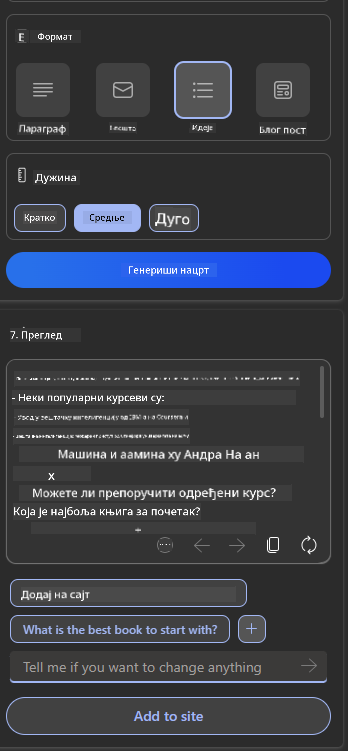

<!--
CO_OP_TRANSLATOR_METADATA:
{
  "original_hash": "78bbeed50fd4dc9fdee931f5daf98cb3",
  "translation_date": "2025-10-18T01:16:51+00:00",
  "source_file": "12-designing-ux-for-ai-applications/README.md",
  "language_code": "sr"
}
-->
# Дизајнирање корисничког искуства за AI апликације

> _(Кликните на слику изнад да бисте погледали видео лекцију)_

Корисничко искуство је веома важан аспект изградње апликација. Корисници треба да могу ефикасно да користе вашу апликацију за обављање задатака. Бити ефикасан је једна ствар, али такође треба да дизајнирате апликације тако да их сви могу користити, чинећи их _приступачним_. Ово поглавље ће се фокусирати на ову област како бисте на крају дизајнирали апликацију коју људи могу и желе да користе.

## Увод

Корисничко искуство је начин на који корисник интерагује са и користи одређени производ или услугу, било да је у питању систем, алат или дизајн. Приликом развоја AI апликација, програмери се не фокусирају само на то да корисничко искуство буде ефикасно, већ и етичко. У овој лекцији покривамо како изградити апликације засноване на вештачкој интелигенцији (AI) које одговарају потребама корисника.

Лекција ће покрити следеће области:

- Увод у корисничко искуство и разумевање потреба корисника
- Дизајнирање AI апликација за поверење и транспарентност
- Дизајнирање AI апликација за сарадњу и повратне информације

## Циљеви учења

Након ове лекције, моћи ћете:

- Разумети како изградити AI апликације које задовољавају потребе корисника.
- Дизајнирати AI апликације које промовишу поверење и сарадњу.

### Предуслов

Одвојите време и прочитајте више о [корисничком искуству и дизајнерском размишљању.](https://learn.microsoft.com/training/modules/ux-design?WT.mc_id=academic-105485-koreyst)

## Увод у корисничко искуство и разумевање потреба корисника

У нашем измишљеном стартапу за образовање, имамо два примарна корисника, наставнике и ученике. Сваки од ова два корисника има јединствене потребе. Дизајн усмерен на корисника приоритетно ставља корисника, осигуравајући да су производи релевантни и корисни за оне за које су намењени.

Апликација треба да буде **корисна, поуздана, приступачна и пријатна** како би пружила добро корисничко искуство.

### Употребљивост

Бити користан значи да апликација има функционалност која одговара њеној намени, као што је аутоматизација процеса оцењивања или генерисање картица за учење. Апликација која аутоматизује процес оцењивања треба да буде у стању да тачно и ефикасно додели оцене радовима ученика на основу унапред дефинисаних критеријума. Слично томе, апликација која генерише картице за учење треба да буде у стању да креира релевантна и разноврсна питања на основу својих података.

### Поузданост

Бити поуздан значи да апликација може доследно и без грешака обављати свој задатак. Међутим, AI, као и људи, није савршен и може бити склон грешкама. Апликације могу наићи на грешке или неочекиване ситуације које захтевају људску интервенцију или корекцију. Како се носите са грешкама? У последњем делу ове лекције, покрићемо како се AI системи и апликације дизајнирају за сарадњу и повратне информације.

### Приступачност

Бити приступачан значи проширити корисничко искуство на кориснике са различитим способностима, укључујући оне са инвалидитетом, осигуравајући да нико није изостављен. Пратећи смернице и принципе приступачности, AI решења постају инклузивнија, употребљивија и кориснија за све кориснике.

### Пријатност

Бити пријатан значи да је апликација уживање за коришћење. Привлачно корисничко искуство може имати позитиван утицај на корисника, подстичући га да се врати апликацији и повећа пословни приход.

Не може се сваки изазов решити AI-јем. AI долази да допуни ваше корисничко искуство, било да је у питању аутоматизација ручних задатака или персонализација корисничког искуства.

## Дизајнирање AI апликација за поверење и транспарентност

Изградња поверења је кључна приликом дизајнирања AI апликација. Поверење осигурава да је корисник уверен да ће апликација обавити посао, доследно испоручити резултате и да су резултати оно што кориснику треба. Ризик у овој области је неповерење и претерано поверење. Неповерење се јавља када корисник има мало или нимало поверења у AI систем, што доводи до тога да корисник одбије вашу апликацију. Претерано поверење се јавља када корисник прецени способност AI система, што доводи до тога да корисници превише верују AI систему. На пример, аутоматизовани систем оцењивања у случају претераног поверења може довести до тога да наставник не провери неке радове како би се уверио да систем оцењивања добро функционише. То би могло резултирати неправедним или нетачним оценама за ученике или пропуштеним приликама за повратне информације и побољшање.

Два начина да се осигура да је поверење у центру дизајна су објашњивост и контрола.

### Објашњивост

Када AI помаже у доношењу одлука, као што је преношење знања будућим генерацијама, кључно је да наставници и родитељи разумеју како се доносе одлуке AI-ја. То је објашњивост - разумевање како AI апликације доносе одлуке. Дизајнирање за објашњивост укључује додавање детаља који истичу како је AI дошао до одређеног резултата. Публика мора бити свесна да је резултат генерисан од стране AI, а не човека. На пример, уместо да кажете "Почните да разговарате са својим тутором сада", реците "Користите AI тутор који се прилагођава вашим потребама и помаже вам да учите својим темпом."

Још један пример је како AI користи корисничке и личне податке. На пример, корисник са персоном ученика може имати ограничења заснована на његовој персони. AI можда неће моћи да открије одговоре на питања, али може помоћи кориснику да размисли о томе како може да реши проблем.

Још један кључни део објашњивости је поједностављење објашњења. Ученици и наставници можда нису AI стручњаци, стога објашњења о томе шта апликација може или не може да уради треба да буду поједностављена и лако разумљива.

### Контрола

Генеративни AI ствара сарадњу између AI и корисника, где, на пример, корисник може модификовати упите за различите резултате. Поред тога, када се генерише резултат, корисници треба да могу да модификују резултате, дајући им осећај контроле. На пример, када користите Bing, можете прилагодити свој упит на основу формата, тона и дужине. Поред тога, можете додати измене свом резултату и модификовати га, као што је приказано испод:

Још једна функција у Bing-у која омогућава кориснику да има контролу над апликацијом је могућност да се укључи или искључи из података које AI користи. За школску апликацију, ученик можда жели да користи своје белешке као и наставникове ресурсе као материјал за учење.

> Приликом дизајнирања AI апликација, намерност је кључна у осигуравању да корисници не претерано верују, постављајући нереална очекивања о њеним способностима. Један од начина да се то постигне је стварање трења између упита и резултата. Подсећање корисника да је ово AI, а не други човек.

## Дизајнирање AI апликација за сарадњу и повратне информације

Као што је раније поменуто, генеративни AI ствара сарадњу између корисника и AI. Већина интеракција се одвија тако што корисник уноси упит, а AI генерише резултат. Шта ако је резултат нетачан? Како апликација решава грешке ако се догоде? Да ли AI криви корисника или одваја време да објасни грешку?

AI апликације треба да буду изграђене тако да примају и дају повратне информације. Ово не само да помаже AI систему да се побољша, већ и гради поверење са корисницима. Петља повратних информација треба да буде укључена у дизајн, пример може бити једноставан палчеви горе или доле на резултату.

Још један начин да се ово реши је јасно комуницирање могућности и ограничења система. Када корисник направи грешку тражећи нешто изван могућности AI, треба да постоји начин да се то реши, као што је приказано испод.

Системске грешке су уобичајене код апликација где корисник можда треба помоћ са информацијама ван домета AI или апликација може имати ограничење у броју питања/предмета за које корисник може генерисати резимее. На пример, AI апликација обучена са подацима о ограниченим предметима, на пример, историји и математици, можда неће моћи да обради питања о географији. Да би се ово ублажило, AI систем може дати одговор као: "Жао нам је, наш производ је обучен са подацима о следећим предметима....., не могу да одговорим на питање које сте поставили."

AI апликације нису савршене, стога су склоне грешкама. Када дизајнирате своје апликације, треба да осигурате да направите простор за повратне информације од корисника и решавање грешака на начин који је једноставан и лако разумљив.

## Задатак

Узмите било коју AI апликацију коју сте до сада направили и размислите о имплементацији следећих корака у вашој апликацији:

- **Пријатност:** Размислите како можете учинити вашу апликацију пријатнијом. Да ли додајете објашњења свуда? Да ли подстичете корисника да истражује? Како формулишете поруке о грешкама?

- **Употребљивост:** Изградња веб апликације. Уверите се да је ваша апликација навигабилна и мишем и тастатуром.

- **Поверење и транспарентност:** Немојте потпуно веровати AI-ју и његовим резултатима, размислите како бисте додали човека у процес да провери резултате. Такође, размислите и имплементирајте друге начине за постизање поверења и транспарентности.

- **Контрола:** Дајте кориснику контролу над подацима које пружа апликацији. Имплементирајте начин на који корисник може да се укључи или искључи из прикупљања података у AI апликацији.

<!-- ## [Квиз након предавања](../../../12-designing-ux-for-ai-applications/quiz-url) -->

## Наставите са учењем!

Након завршетка ове лекције, погледајте нашу [колекцију за учење о генеративном AI](https://aka.ms/genai-collection?WT.mc_id=academic-105485-koreyst) да наставите са унапређењем знања о генеративном AI!

Прелазите на лекцију 13, где ћемо погледати како [обезбедити AI апликације](../13-securing-ai-applications/README.md?WT.mc_id=academic-105485-koreyst)!

---

**Одрицање од одговорности**:  
Овај документ је преведен коришћењем услуге за превођење помоћу вештачке интелигенције [Co-op Translator](https://github.com/Azure/co-op-translator). Иако се трудимо да обезбедимо тачност, молимо вас да имате у виду да аутоматски преводи могу садржати грешке или нетачности. Оригинални документ на његовом изворном језику треба сматрати ауторитативним извором. За критичне информације препоручује се професионални превод од стране људског преводиоца. Не преузимамо одговорност за било каква погрешна тумачења или неспоразуме који могу настати услед коришћења овог превода.