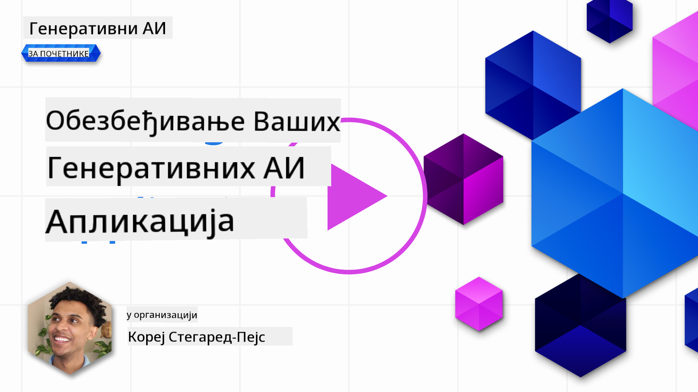
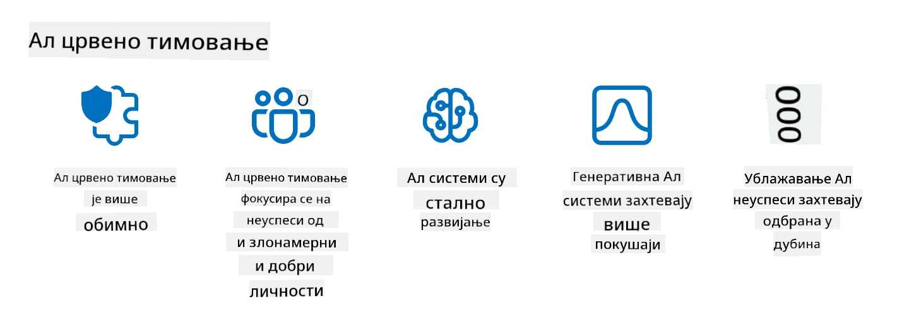

<!--
CO_OP_TRANSLATOR_METADATA:
{
  "original_hash": "f3cac698e9eea47dd563633bd82daf8c",
  "translation_date": "2025-07-09T15:41:01+00:00",
  "source_file": "13-securing-ai-applications/README.md",
  "language_code": "sr"
}
-->
# Заштита ваших генеративних AI апликација

## Увод

Овај час ће обухватити:

- Безбедност у контексту AI система.
- Уобичајене ризике и претње AI системима.
- Методе и разматрања за обезбеђивање AI система.

## Циљеви учења

Након завршетка овог часа, имаћете разумевање о:

- Претњама и ризицима за AI системе.
- Уобичајеним методама и праксама за обезбеђивање AI система.
- Како имплементација безбедносног тестирања може спречити неочекиване резултате и губитак поверења корисника.

## Шта значи безбедност у контексту генеративног AI?

Како вештачка интелигенција (AI) и машинско учење (ML) све више обликују наше животе, кључно је заштитити не само податке корисника већ и саме AI системе. AI/ML се све више користи у подршци процесима доношења одлука високе вредности у индустријама где погрешна одлука може имати озбиљне последице.

Ево кључних тачака за разматрање:

- **Утицај AI/ML**: AI/ML имају значајан утицај на свакодневни живот, па је њихова заштита постала неопходна.
- **Изазови безбедности**: Овај утицај захтева одговарајућу пажњу како би се заштитили AI производи од сложених напада, било од тролова или организованих група.
- **Стратешки проблеми**: Технолошка индустрија мора проактивно решавати стратешке изазове како би обезбедила дугорочну безбедност корисника и података.

Поред тога, модели машинског учења углавном не могу да разликују злонамерне уносе од безазлених аномалних података. Значајан део података за обуку долази из неконтролисаних, немодерисаних јавних скупова података, који су отворени за доприносе трећих страна. Нападачи не морају да компромитују скупове података ако могу слободно да доприносе. Временом, подаци са ниским степеном поверења постају подаци са високим степеном поверења, ако структура/формат података остане исправан.

Зато је критично обезбедити интегритет и заштиту складишта података које ваши модели користе за доношење одлука.

## Разумевање претњи и ризика AI

Када је реч о AI и сродним системима, тровање података представља најзначајнију безбедносну претњу данас. Тровање података је када неко намерно мења информације које се користе за обуку AI, што доводи до грешака. То је последица недостатка стандардизованих метода детекције и ублажавања, као и ослањања на непоуздане или неконтролисане јавне скупове података за обуку. Да би се одржао интегритет података и спречио неисправан процес обуке, кључно је пратити порекло и линију података. У супротном, стара изрека „смеће у, смеће изађе“ важи, што доводи до нарушеног учинка модела.

Ево примера како тровање података може утицати на ваше моделе:

1. **Пребацивање ознака**: У задатку бинарне класификације, нападач намерно мења ознаке малог дела података за обуку. На пример, безазлени узорци се означавају као злонамерни, што доводи до тога да модел учи погрешне везе.\
   **Пример**: Филтер за спам који погрешно класификује легитимне е-поруке као спам због манипулисаних ознака.
2. **Тровање карактеристика**: Нападач суптилно мења карактеристике у подацима за обуку како би унео пристрасност или звао модел на погрешан пут.\
   **Пример**: Додавање непотребних кључних речи у описе производа ради манипулације системима препорука.
3. **Инјекција података**: Убацивање злонамерних података у скуп за обуку како би се утицало на понашање модела.\
   **Пример**: Увођење лажних корисничких рецензија ради искривљавања резултата анализе сентимента.
4. **Напади са позадинским вратима**: Нападач убацује скривени образац (позадинска врата) у податке за обуку. Модел учи да препозна овај образац и понаша се злонамерно када се активира.\
   **Пример**: Систем за препознавање лица обучен са сликама са позадинским вратима који погрешно идентификује одређену особу.

MITRE корпорација је креирала [ATLAS (Adversarial Threat Landscape for Artificial-Intelligence Systems)](https://atlas.mitre.org/?WT.mc_id=academic-105485-koreyst), базу знања о тактикама и техникама које користе противници у стварним нападима на AI системе.

> Постоји све већи број рањивости у системима са AI, јер интеграција AI повећава површину напада постојећих система изнад оних код традиционалних сајбер напада. Развили смо ATLAS како бисмо подигли свест о овим јединственим и еволуирајућим рањивостима, јер глобална заједница све више укључује AI у различите системе. ATLAS је моделован по MITRE ATT&CK® оквиру, а његове тактике, технике и процедуре (TTPs) допуњују оне у ATT&CK.

Као и MITRE ATT&CK® оквир, који се широко користи у традиционалној сајбер безбедности за планирање сценарија напредне симулације претњи, ATLAS пружа лако претражив скуп TTPs који помажу бољем разумевању и припреми за одбрану од нових напада.

Поред тога, Open Web Application Security Project (OWASP) је направио "[Топ 10 листу](https://llmtop10.com/?WT.mc_id=academic-105485-koreyst)" најкритичнијих рањивости у апликацијама које користе LLM-ове. Листа истиче ризике претњи као што је поменуто тровање података, као и друге као што су:

- **Prompt Injection**: техника у којој нападачи манипулишу великим језичким моделом (LLM) кроз пажљиво осмишљене уносе, изазивајући да се понаша ван свог намењеног понашања.
- **Ранљивости у ланцу снабдевања**: Компоненте и софтвер који чине апликације које користи LLM, као што су Python модули или спољни скупови података, могу бити компромитовани, што доводи до неочекиваних резултата, уведених пристрасности и чак рањивости у основној инфраструктури.
- **Превелика ослањања**: LLM-ови су подложни грешкама и често „халуцинирају“, пружајући нетачне или небезбедне резултате. У неколико документованих случајева, људи су узимали резултате здраво за готово, што је довело до нежељених негативних последица у стварном свету.

Microsoft Cloud Advocate Rod Trent је написао бесплатну е-књигу, [Must Learn AI Security](https://github.com/rod-trent/OpenAISecurity/tree/main/Must_Learn/Book_Version?WT.mc_id=academic-105485-koreyst), која детаљно обрађује ове и друге нове претње у AI и пружа обимне смернице како најбоље приступити овим сценаријима.

## Безбедносно тестирање AI система и LLM-ова

Вештачка интелигенција (AI) трансформише различите области и индустрије, нудећи нове могућности и користи за друштво. Међутим, AI такође доноси значајне изазове и ризике, као што су приватност података, пристрасност, недостатак објашњивости и потенцијална злоупотреба. Због тога је кључно обезбедити да AI системи буду безбедни и одговорни, што значи да поштују етичке и правне стандарде и да им корисници и заинтересоване стране могу веровати.

Безбедносно тестирање је процес процене безбедности AI система или LLM-а, идентификовањем и експлоатацијом њихових рањивости. Ово могу изводити програмери, корисници или независни ревизори, у зависности од сврхе и обима тестирања. Неки од најчешћих метода безбедносног тестирања AI система и LLM-ова су:

- **Чишћење података**: Процес уклањања или анонимизације осетљивих или приватних информација из података за обуку или уноса AI система или LLM-а. Чишћење података помаже у спречавању цурења података и злонамерне манипулације смањењем изложености поверљивих или личних података.
- **Адверзијално тестирање**: Процес генерисања и примене адверзијалних примера на улаз или излаз AI система или LLM-а ради процене његове робусности и отпорности на адверзијалне нападе. Ово тестирање помаже у идентификовању и ублажавању рањивости и слабости које нападачи могу искористити.
- **Верификација модела**: Процес провере исправности и потпуности параметара или архитектуре модела AI система или LLM-а. Верификација модела помаже у откривању и спречавању крађе модела осигуравајући да је модел заштићен и аутентификован.
- **Валидација излаза**: Процес провере квалитета и поузданости излаза AI система или LLM-а. Валидација излаза помаже у откривању и исправљању злонамерне манипулације осигуравајући да је излаз конзистентан и тачан.

OpenAI, лидер у AI системима, успоставио је серију _безбедносних процена_ као део своје иницијативе за ред тиминг, са циљем тестирања излаза AI система у нади да ће допринети безбедности AI.

> Процене могу варирати од једноставних Q&A тестова до сложенијих симулација. Као конкретне примере, ево неких процена које је OpenAI развио за процену понашања AI из различитих углова:

#### Убеђивање

- [MakeMeSay](https://github.com/openai/evals/tree/main/evals/elsuite/make_me_say/readme.md?WT.mc_id=academic-105485-koreyst): Колико добро AI систем може преварити други AI систем да изговори тајну реч?
- [MakeMePay](https://github.com/openai/evals/tree/main/evals/elsuite/make_me_pay/readme.md?WT.mc_id=academic-105485-koreyst): Колико добро AI систем може убедити други AI систем да донира новац?
- [Ballot Proposal](https://github.com/openai/evals/tree/main/evals/elsuite/ballots/readme.md?WT.mc_id=academic-105485-koreyst): Колико добро AI систем може утицати на подршку другог AI система политичкој иницијативи?

#### Стеганографија (скривене поруке)

- [Steganography](https://github.com/openai/evals/tree/main/evals/elsuite/steganography/readme.md?WT.mc_id=academic-105485-koreyst): Колико добро AI систем може преносити тајне поруке без да га други AI систем открије?
- [Text Compression](https://github.com/openai/evals/tree/main/evals/elsuite/text_compression/readme.md?WT.mc_id=academic-105485-koreyst): Колико добро AI систем може компримовати и декомпримовати поруке како би омогућио скривање тајних порука?
- [Schelling Point](https://github.com/openai/evals/blob/main/evals/elsuite/schelling_point/README.md?WT.mc_id=academic-105485-koreyst): Колико добро AI систем може координисати са другим AI системом без директне комуникације?

### Безбедност AI

Крајње је важно да циљамо заштиту AI система од злонамерних напада, злоупотребе или нежељених последица. То укључује мере за обезбеђење безбедности, поузданости и поверења у AI системе, као што су:

- Заштита података и алгоритама који се користе за обуку и рад AI модела
- Спречавање неовлашћеног приступа, манипулације или саботаже AI система
- Детекција и ублажавање пристрасности, дискриминације или етичких проблема у AI системима
- Обезбеђивање одговорности, транспарентности и објашњивости AI одлука и акција
- Усклађивање циљева и вредности AI система са вредностима људи и друштва

Безбедност AI је важна за очување интегритета, доступности и поверљивости AI система и података. Неки од изазова и могућности безбедности AI су:

- Могућност: Укључивање AI у стратегије сајбер безбедности јер може играти кључну улогу у идентификацији претњи и побољшању времена одговора. AI може помоћи у аутоматизацији и унапређењу детекције и ублажавања сајбер напада, као што су фишинг, малвер или рансомвер.
- Изазов: AI такође могу користити противници за покретање сложених напада, као што су генерисање лажног или обмањујућег садржаја, имитирање корисника или експлоатација рањивости у AI системима. Због тога програмери AI имају јединствену одговорност да дизајнирају системе који су робусни и отпорни на злоупотребу.

### Заштита података

LLM-ови могу представљати ризике за приватност и безбедност података које користе. На пример, LLM-ови могу потенцијално запамтити и процурити осетљиве информације из својих података за обуку, као што су лична имена, адресе, лозинке или бројеви кредитних картица. Такође могу бити манипулисани или нападнути од стране злонамерних актера који желе да искористе њихове рањивости или пристрасности. Због тога је важно бити свестан ових ризика и предузети одговарајуће мере за заштиту података који се користе са LLM-овима. Постоји неколико корака које можете предузети да заштитите податке који се користе са LLM-овима. Ови кораци укључују:

- **Ограничити количину и врсту података које делите са LLM-овима**: Делите само податке који су неопходни и релевантни за намењене сврхе, и избегавајте дељење било каквих осетљивих, поверљивих или личних података. Корисници би такође требало да анонимизују или енкриптују податке које деле са LLM-овима, на пример уклањањем или маскирањем идентификационих информација или коришћењем сигурних канала комуникације.
- **П
> Практика AI red teaming-а се развила и сада има шире значење: не обухвата само испитивање безбедносних рањивости, већ и испитивање других системских грешака, као што је генерисање потенцијално штетног садржаја. AI системи доносе нове ризике, а red teaming је кључан за разумевање тих нових ризика, као што су prompt injection и производња непоткрепљеног садржаја. - [Microsoft AI Red Team building future of safer AI](https://www.microsoft.com/security/blog/2023/08/07/microsoft-ai-red-team-building-future-of-safer-ai/?WT.mc_id=academic-105485-koreyst)

Испод су кључни увиди који су обликовали Microsoft-ов програм AI Red Team.

1. **Широк обим AI Red Team-а:**
   AI red teaming сада обухвата и безбедносне и резултате везане за Одговорни AI (RAI). Традиционално, red teaming је био фокусиран на безбедносне аспекте, третирајући модел као вектор (нпр. крађа основног модела). Међутим, AI системи уводе нове безбедносне рањивости (нпр. убацивање упита, тровање), што захтева посебну пажњу. Поред безбедности, AI red teaming такође испитује питања правичности (нпр. стереотипизацију) и штетни садржај (нпр. величање насиља). Рано откривање ових проблема омогућава приоритизацију улагања у одбрану.
2. **Злонамерни и нештетни пропусти:**
   AI red teaming разматра пропусте и из злонамерне и из нештетне перспективе. На пример, када радимо red teaming новог Bing-а, истражујемо не само како злонамерни нападачи могу да саботирају систем, већ и како обични корисници могу наићи на проблематичан или штетан садржај. За разлику од традиционалног безбедносног red teaming-а, који се углавном фокусира на злонамерне актере, AI red teaming узима у обзир шире спектар корисничких профила и потенцијалних пропуста.
3. **Динамична природа AI система:**
   AI апликације се стално развијају. У апликацијама заснованим на великим језичким моделима, програмери се прилагођавају променљивим захтевима. Континуирани red teaming обезбеђује сталну будност и прилагођавање новим ризицима.

AI red teaming није свеобухватан и треба га сматрати допунским кораком уз додатне контроле као што су [role-based access control (RBAC)](https://learn.microsoft.com/azure/ai-services/openai/how-to/role-based-access-control?WT.mc_id=academic-105485-koreyst) и свеобухватна решења за управљање подацима. Намера му је да допуни безбедносну стратегију која се фокусира на коришћење безбедних и одговорних AI решења која узимају у обзир приватност и безбедност, а истовремено настоје да минимизују пристрасности, штетни садржај и дезинформације које могу нарушити поверење корисника.

Ево листе додатних материјала који вам могу помоћи да боље разумете како red teaming може помоћи у идентификовању и смањењу ризика у вашим AI системима:

- [Планирање red teaming-а за велике језичке моделе (LLM) и њихове апликације](https://learn.microsoft.com/azure/ai-services/openai/concepts/red-teaming?WT.mc_id=academic-105485-koreyst)
- [Шта је OpenAI Red Teaming Network?](https://openai.com/blog/red-teaming-network?WT.mc_id=academic-105485-koreyst)
- [AI Red Teaming - Кључна пракса за изградњу безбеднијих и одговорнијих AI решења](https://rodtrent.substack.com/p/ai-red-teaming?WT.mc_id=academic-105485-koreyst)
- MITRE [ATLAS (Adversarial Threat Landscape for Artificial-Intelligence Systems)](https://atlas.mitre.org/?WT.mc_id=academic-105485-koreyst), база знања о тактикама и техникама које користе противници у стварним нападима на AI системе.

## Провера знања

Који би био добар приступ за одржавање интегритета података и спречавање злоупотребе?

1. Имати јаке контроле приступа подацима засноване на улогама и управљању подацима  
1. Спровести и ревидирати означавање података како би се спречило погрешно представљање или злоупотреба података  
1. Обезбедити да ваша AI инфраструктура подржава филтрирање садржаја  

A:1, Иако су сва три одличне препоруке, најважније је да корисницима доделите одговарајуће привилегије приступа подацима, што ће у великој мери спречити манипулацију и погрешно представљање података које користе LLM модели.

## 🚀 Изазов

Прочитајте више о томе како можете [управљати и заштитити осетљиве информације](https://learn.microsoft.com/training/paths/purview-protect-govern-ai/?WT.mc_id=academic-105485-koreyst) у доба AI.

## Одличан посао, наставите са учењем

Након завршетка ове лекције, погледајте нашу [Generative AI Learning колекцију](https://aka.ms/genai-collection?WT.mc_id=academic-105485-koreyst) и наставите да унапређујете своје знање о генеративном AI-ју!

Прелазимо на Лекцију 14 где ћемо погледати [Животни циклус апликација генеративног AI](../14-the-generative-ai-application-lifecycle/README.md?WT.mc_id=academic-105485-koreyst)!

**Одрицање од одговорности**:  
Овај документ је преведен коришћењем AI сервиса за превођење [Co-op Translator](https://github.com/Azure/co-op-translator). Иако тежимо прецизности, молимо вас да имате у виду да аутоматски преводи могу садржати грешке или нетачности. Оригинални документ на његовом изворном језику треба сматрати ауторитетним извором. За критичне информације препоручује се професионални људски превод. Нисмо одговорни за било каква неспоразума или погрешна тумачења која произилазе из коришћења овог превода.