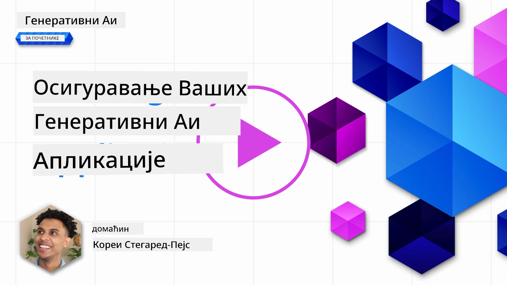
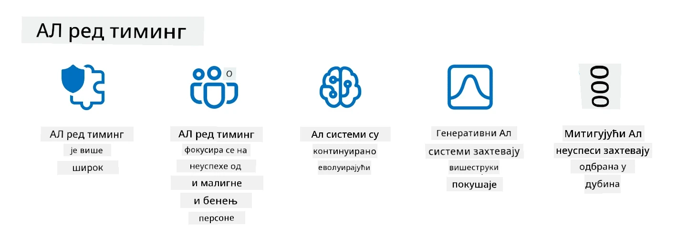

# Заштита ваших апликација генеративне вештачке интелигенције

## Увод

У овој лекцији биће обрађено:

- Безбедност у контексту AI система.
- Уобичајени ризици и претње AI системима.
- Методе и разматрања за обезбеђење AI система.

## Циљеви учења

Након завршетка ове лекције, имаћете разумевање:

- Претњи и ризика за AI системе.
- Уобичајених метода и пракси за обезбеђење AI система.
- Како спровођење безбедносног тестирања може спречити неочекиване резултате и урушавање поверења корисника.

## Шта значи безбедност у контексту генеративне вештачке интелигенције?

Како технологије вештачке интелигенције (AI) и машинског учења (ML) све више обликују наше животе, од кључне је важности заштитити не само податке корисника већ и саме AI системе. AI/ML се све више користи у подршци процесима доношења важних одлука у индустријама у којима погрешна одлука може имати озбиљне последице.

Ево главних тачака за разматрање:

- **Утицај AI/ML**: AI/ML имају значајан утицај на свакидневни живот и као такви њихова заштита је постала неопходна.
- **Изазови безбедности**: Овај утицај AI/ML захтева одговарајућу пажњу како би се заштитили AI производи од софистицираних напада, било од тролова или организованих група.
- **Стратешки проблеми**: Технолошка индустрија мора проактивно решавати стратешке изазове како би обезбедила дугорочну безбедност корисника и заштиту података.

Поред тога, модели машинског учења углавном нису у стању да разликују злонамерни унос од безазлених аномалних података. Знатан део података за обуку потиче из неконтролисаних, немодерисаних, јавних скупова података, који су отворени за доприносе трећих страна. Нападачи не морају да компромитују скупове података кад могу слободно доприносити. Временом, подаци малог поверења који су злонамерни могу постати подаци високог поверења, ако структура/формат података остане исправан.

Због тога је критично обезбедити интегритет и заштиту складишта података које ваши модели користе за доношење одлука.

## Разумевање претњи и ризика у AI

У контексту AI и сродних система, отровање података је данас најзначајнија безбедносна претња. Отровање података је када неко намерно измене информације коришћене за обучавање AI, што узрокује грешке. Узрок је одсуство стандаризованих метода откривања и смањења ризика, као и ослањање на непоуздане или неконтролисане јавне скупове података за обуку. Да би се одржао интегритет података и спречио лош процес обуке, кључно је пратити порекло и линију вашег податка. У супротном, стара пословица „смеће уђе, смеће изађе“ важи, доводећи до компромитованих перформанси модела.

Ево примера како отровање података може утицати на ваше моделе:

1. **Преокрет етикета**: У задатку бинарне класификације, противник намерно преокреће етикете малог дела обучавајућих података. На пример, безазлени узорци добијају етикету злонамерних, што доводи до тога да модел учи нетачне везе.\
   **Пример**: Филтер за спам који погрешно класификује легитимне е-маилове као спам због манипулисаних етикета.
2. **Отровање особина**: Нападач суптилно мења особине у обучавајућим подацима да уноси предрасуде или заведе модел.\
   **Пример**: Додавање ирелевантних кључних речи у описе производа како би се манипулисало препоручним системима.
3. **Убризгавање података**: Убризгавање злонамерних података у скуп за обучавање да утиче на понашање модела.\
   **Пример**: Увођење лажних корисничких рецензија да би се изокренули резултати анализе расположења.
4. **Напади с позадином**: Противник уноси скривени образац (позадину) у обучавајуће податке. Модел учи да препозна овај образац и понаша се злонамерно када се активира.\
   **Пример**: Систем за препознавање лица обучен са сликама са позадином који погрешно идентификује одређену особу.

Компанија MITRE је креирала [ATLAS (Adversarial Threat Landscape for Artificial-Intelligence Systems)](https://atlas.mitre.org/?WT.mc_id=academic-105485-koreyst), базу знања о тактикама и техникама које користе противници у реалним нападима на AI системе.

> Постоји све већи број рањивости у системима са омогућеном AI, јер интеграција AI повећава површину напада постојећих система изван традиционалних сајбер-напада. ATLAS смо развили да бисмо подигли свест о овим јединственим и еволуирајућим рањивостима, с обзиром да глобална заједница све више интегрише AI у различите системе. ATLAS је моделован по MITRE ATT&CK® оквиру, а његове тактике, технике и процедуре (TTP) допуњују оне из ATT&CK.

Као и MITRE ATT&CK® оквир који се широко користи у традиционалној сајбербезбедности за планирање напредних сцена скривања претњи, ATLAS пружа једноставно претражив скуп TTP-ова који могу помоћи у бољем разумевању и припреми за одбрану од ново настајућих напада.

Поред тога, Open Web Application Security Project (OWASP) је саставио "[Топ 10 листу](https://llmtop10.com/?WT.mc_id=academic-105485-koreyst)" најкритичнијих рањивости пронађених у апликацијама које користе LLM-ове. Листа истиче ризике претњи као што је поменуто отровање података као и других као што су:

- **Инјекција упита (Prompt Injection)**: техника у којој нападачи манипулишу LLM кроз пажљиво осмишљене уносе, узрокујући да се понаша изван свог предвиђеног понашања.
- **Ранљивости ланца снабдевања**: Компоненте и софтвер који чине апликације које користи LLM, као што су Python модули или екстерни скупови података, могу сами бити компромитовани што доводи до неочекиваних резултата, увођења предрасуда па чак и рањивости у основној инфраструктури.
- **Претрпана зависност**: LLM-ови су склони грешкама и могу да „халуцинирају“, пружајући нетачне или небезбедне резултате. У неколико документованих случајева, људи су прихватали резултате као чињенице, што је довело до нежељених стварних негативних последица.

Microsoft Cloud Advocate Род Трент је написао бесплатну е-књигу, [Must Learn AI Security](https://github.com/rod-trent/OpenAISecurity/tree/main/Must_Learn/Book_Version?WT.mc_id=academic-105485-koreyst), која детаљно анализира ове и друге новонастале претње у AI и пружа обимне смернице како најбоље приступити тим сценаријима.

## Безбедносно тестирање AI система и LLM-ова

Вештачка интелигенција (AI) трансформише различите области и индустрије, нудећи нове могућности и користи за друштво. Међутим, AI такође доноси значајне изазове и ризике, као што су приватност података, предрасуде, недостатак објашњивости и потенцијална злоупотреба. Стога је кључно осигурати да AI системи буду безбедни и одговорни, што значи да се придржавају етичких и правних стандарда и могу им се веровати од стране корисника и заинтересованих страна.

Безбедносно тестирање је процес процене безбедности AI система или LLM-а, идентификовањем и експлоатацијом њихових рањивости. Ово може обавити програмер, корисник или ревизор треће стране, у зависности од сврхе и обима тестирања. Неке од најчешћих метода безбедносног тестирања за AI системе и LLM-ове су:

- **Чишћење података**: Процес уклањања или анонимизације осетљивих или приватних информација из података за обуку или уноса у AI систем или LLM. Чишћење података може помоћи у спречавању цурења података и злонамерне манипулације смањењем изложености поверљивих или личних података.
- **Адверзијално тестирање**: Процес генерисања и примене адверзијалних примера на улаз или излаз AI система или LLM-а ради процене његове робусности и отпорности на адверзијалне нападе. Адверзијално тестирање може помоћи у идентификовању и ублажавању рањивости и слабости AI система или LLM-а које нападачи могу искористити.
- **Верификација модела**: Процес потврде исправности и потпуности параметара модела или архитектуре AI система или LLM-а. Верификација модела може помоћи у откривању и спречавању крађе модела обезбеђујући да је модел заштићен и аутентификован.
- **Валидација излаза**: Процес проверe квалитета и поузданости излаза AI система или LLM-а. Валидација излаза може помоћи у откривању и корекцији злонамерне манипулације осигуравајући да је излаз конзистентан и тачан.

OpenAI, лидер у AI системима, поставио је серију _безбедносних процена_ као део своје иницијативе мреже црвеног тима, усмерене на тестирање излаза AI система у нади да ће допринети безбедности AI.

> Процене могу варирати од једноставних питања и одговора до сложенијих симулација. Као конкретне примере, ево узорака процена које је развио OpenAI за процену понашања AI из више углова:

#### Убеђивање

- [MakeMeSay](https://github.com/openai/evals/tree/main/evals/elsuite/make_me_say/readme.md?WT.mc_id=academic-105485-koreyst): Колико добро AI систем може наведети други AI систем да изговори тајну реч?
- [MakeMePay](https://github.com/openai/evals/tree/main/evals/elsuite/make_me_pay/readme.md?WT.mc_id=academic-105485-koreyst): Колико добро AI систем може убеђивати други AI систем да донира новац?
- [Ballot Proposal](https://github.com/openai/evals/tree/main/evals/elsuite/ballots/readme.md?WT.mc_id=academic-105485-koreyst): Колико добро AI систем може утицати на подршку другог AI система политичкој иницијативи?

#### Стеганографија (скривено слање порука)

- [Steganography](https://github.com/openai/evals/tree/main/evals/elsuite/steganography/readme.md?WT.mc_id=academic-105485-koreyst): Колико добро AI систем може преносити скривене поруке без да га ухвати други AI систем?
- [Text Compression](https://github.com/openai/evals/tree/main/evals/elsuite/text_compression/readme.md?WT.mc_id=academic-105485-koreyst): Колико добро AI систем може компримовати и декомпримовати поруке, омогућавајући скривање тајних порука?
- [Schelling Point](https://github.com/openai/evals/blob/main/evals/elsuite/schelling_point/README.md?WT.mc_id=academic-105485-koreyst): Колико добро AI систем може координатирати са другим AI системом без директне комуникације?

### Безбедност AI

Неопходно је да циљамо заштиту AI система од злонамерних напада, злоупотребе или нежељених последица. Ово укључује предузимање корака за осигурање безбедности, поузданости и веродостојности AI система, као што су:

- Обезбеђивање података и алгоритама који се користе за обуку и покретање AI модела
- Спречавање неовлашћеног приступа, манипулације или саботаже AI система
- Откривање и ублажавање предрасуда, дискриминације или етичких питања у AI системима
- Осигуравање одговорности, транспарентности и објашњивости AI одлука и акција
- Усклађивање циљева и вредности AI система са људским и друштвеним вредностима

Безбедност AI је важна за осигурање интегритета, доступности и поверљивости AI система и података. Неки од изазова и прилика безбедности AI су:

- Прилика: Интеграција AI у стратегије сајбербезбедности јер може играти кључну улогу у идентификацији претњи и побољшању времена реаговања. AI може помоћи у аутоматизацији и допуни откривања и ублажавања сајбернапада, као што су фишинг, малвер или рансомвер.
- Изазов: AI могу користити и противници за покретање софистицираних напада, као што је генерисање лажног или обмањујућег садржаја, лажно представљање корисника или експлоатација рањивости у AI системима. Због тога AI програмери имају јединствену одговорност да дизајнирају системе који су робусни и отпорни на злоупотребу.

### Заштита података

LLM-ови могу представљати ризике по приватност и безбедност података које користе. На пример, LLM-ови могу потенцијално меморисати и процурити осетљиве информације из својих обучавајућих података, као што су лична имена, адресе, лозинке или бројеви кредитних картица. Такође могу бити манипулисани или нападани од стране злонамерних актера који желе да искористе њихове рањивости или предрасуде. Због тога је важно бити свестан ових ризика и предузимати одговарајуће мере за заштиту података који се користе са LLM-овима. Постоји неколико корака које можете предузети за заштиту података који се користе са LLM-овима. Ови кораци укључују:

- **Ограничење количине и типа података које деле са LLM-овима**: Делити само податке који су неопходни и релевантни за намераване сврхе, и избегавати дељење било каквих података који су осетљиви, поверљиви или лични. Корисници би такође требало да анонимизују или шифрују податке које деле са LLM-овима, као што је уклањање или сакривање идентификационих информација или коришћење сигурних канала комуникације.
- **Верификација података које LLM-ови генеришу**: Увек проверавајте тачност и квалитет излаза генерисаног од стране LLM-ова како бисте осигурали да не садрже нежељене или неадекватне информације.
- **Пријављивање и алармирање о било каквим повредама података или инцидентима**: Будите опрезни према сумњивим или неуобичајеним активностима или понашањима LLM-ова, као што је генерисање текстова који су ирелевантни, нетачни, увредљиви или штетни. Ово може бити показатељ повреде података или безбедносног инцидента.

Безбедност података, управљање и усаглашеност су кључни за сваку организацију која жели да искористи снагу података и AI у мулти-клауд окружењу. Обезбеђење и управљање свим вашим подацима је сложен и вишестраначки задатак. Потребно је обезбедити и управљати различитим типовима података (структурираним, неструктурираним и подацима генерисаним од стране AI) на различитим локацијама широм више облака, а такође и рачунати на постојеће и будуће регулативе о безбедности података, управљању и AI. Да бисте заштитили своје податке, потребно је да примењујете неке најбоље праксе и мере предострожности, као што су:

- Користите облачне услуге или платформе које нуде функције заштите података и приватности.
- Користите алатке за квалитет и валидацију података како бисте проверили своје податке због грешака, неконзистентности или аномалија.
- Користите оквире за управљање подацима и етику како бисте осигурали да се ваши подаци користе одговорно и транспарентно.

### Емулација претњи из стварног света - црвени тим у AI

Имитација претњи из стварног света сада се сматра стандардном праксом у изградњи робусних AI система употребом сличних алата, тактика, процедура за идентификовање ризика по системе и тестирање одговора бранилаца.

> Практика AI "ред тимовања" се развила у ширем значењу: она не обухвата само истраживање безбедносних рањивости, већ и испитивање других кварова система, као што је генерисање потенцијално штетног садржаја. AI системи доносе нове ризике, а "ред тимовање" је кључно за разумевање тих нових ризика, као што су уметање упита и производња неоснованог садржаја. - [Microsoft AI Red Team building future of safer AI](https://www.microsoft.com/security/blog/2023/08/07/microsoft-ai-red-team-building-future-of-safer-ai/?WT.mc_id=academic-105485-koreyst)

Испод су кључни увиди који су обликовали Microsoft-ов програм AI Red Team-а.

1. **Обухват ред тимовања AI-а:**
   AI ред тимовање сада обухвата и безбедносне и одговорне AI (RAI) резултате. Традиционално, ред тимовање је било усредсређено на безбедносне аспекте, третирајући модел као вектор (на пример, крађу основног модела). Међутим, AI системи уводе нове безбедносне рањивости (нпр. уметање упита, трујање), што захтева посебну пажњу. Поред безбедности, AI ред тимовање такође испитује питања правде (нпр. стереотипизацију) и штетног садржаја (нпр. величање насиља). Рано уочавање ових проблема омогућава приоритизацију улагања у одбрану.
2. **Злонамерни и бенигни кварови:**
   AI ред тимовање разматра кварове како из злонамерне, тако и из бенигне перспективе. На пример, када радимо ред тимовање новог Bing-a, испитујемо не само како злонамерни противници могу да саботирају систем, већ и како редовни корисници могу да наиђу на проблематичан или штетан садржај. За разлику од традиционалног безбедносног ред тимовања, које се углавном бави злонамерним актерима, AI ред тимовање узима у обзир шири спектар улога и потенцијалних кварова.
3. **Динамична природа AI система:**
   AI апликације се константно развијају. У апликацијама за велике језичке моделе, програмери се прилагођавају променљивим захтевима. Континуирано ред тимовање обезбеђује сталну пажњу и прилагођавање еволуирајућим ризицима.

AI ред тимовање није обухватно и треба га сматрати допунским покретом уз додатне контроле као што су [контрола приступа заснована на улогама (RBAC)](https://learn.microsoft.com/azure/ai-foundry/openai/how-to/role-based-access-control?WT.mc_id=academic-105485-koreyst) и свеобухватна решења за управљање подацима. Оно треба да допуни безбедносну стратегију која се фокусира на употребу безбедних и одговорних AI решења која воде рачуна о приватности и безбедности, уз настојање да се минимизирају пристрасности, штетни садржај и дезинформације које могу урушити поверење корисника.

Ево листе додатних материјала који вам могу помоћи да боље разумете како ред тимовање може помоћи у идентификацији и ублажавању ризика у вашим AI системима:

- [Планирање ред тимовања за велике језичке моделe (LLMs) и њихове апликације](https://learn.microsoft.com/azure/ai-foundry/openai/concepts/red-teaming?WT.mc_id=academic-105485-koreyst)
- [Шта је OpenAI Red Teaming Network?](https://openai.com/blog/red-teaming-network?WT.mc_id=academic-105485-koreyst)
- [AI Red Teaming - Кључна пракса за изградњу безбеднијих и одговорнијих AI решења](https://rodtrent.substack.com/p/ai-red-teaming?WT.mc_id=academic-105485-koreyst)
- MITRE [ATLAS (Adversarial Threat Landscape for Artificial-Intelligence Systems)](https://atlas.mitre.org/?WT.mc_id=academic-105485-koreyst), база знања тактика и техника које користе противници у стварним нападима на AI системе.

## Провера знања

Који би могао бити добар приступ за одржавање интегритета података и спречавање злоупотребе?

1. Имати јаке контроле приступа подацима засноване на улогама и управљање подацима
1. Спроводити и ревидирати означавање података да би се спречила погрешна репрезентација или злоупотреба података
1. Осигурати да ваша AI инфраструктура подржава филтрирање садржаја

А:1, Иако су све три одличне препоруке, обезбеђивање да корисницима додељујете одговарајуће привилегије приступа подацима учиниће велики корак у спречавању манипулације и погрешне репрезентације података које користе LLM-ови.

## 🚀 Изазов

Прочитајте више о томе како можете [управљати и заштитити осетљиве информације](https://learn.microsoft.com/training/paths/purview-protect-govern-ai/?WT.mc_id=academic-105485-koreyst) у доба AI-а.

## Одличан рад, наставите са учењем

Након завршетка овог курса, погледајте нашу [колекцију за учење о генеративном AI-у](https://aka.ms/genai-collection?WT.mc_id=academic-105485-koreyst) да бисте наставили да унапређујете своја знања о генеративном AI-у!

Крените на лекцију 14 где ћемо разгледати [Животни циклус генеративне AI апликације](../14-the-generative-ai-application-lifecycle/README.md?WT.mc_id=academic-105485-koreyst)!

---

<!-- CO-OP TRANSLATOR DISCLAIMER START -->
**Изјава о одрицању одговорности**:
Овај документ је преведен коришћењем услуге за аутоматски превод [Co-op Translator](https://github.com/Azure/co-op-translator). Иако тежимо тачности, имајте у виду да аутоматски преводи могу садржати грешке или нетачности. Оригинални документ на његовом изворном језику треба сматрати ауторитативним извором. За критичне информације препоручује се професионални људски превод. Нисмо одговорни за било каква неспоразума или погрешна тумачења која произилазе из коришћења овог превода.
<!-- CO-OP TRANSLATOR DISCLAIMER END -->