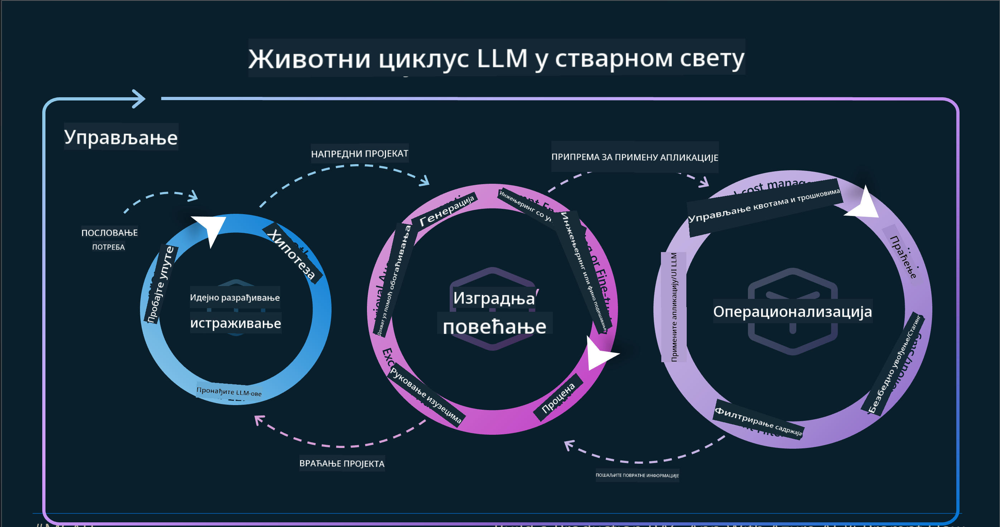
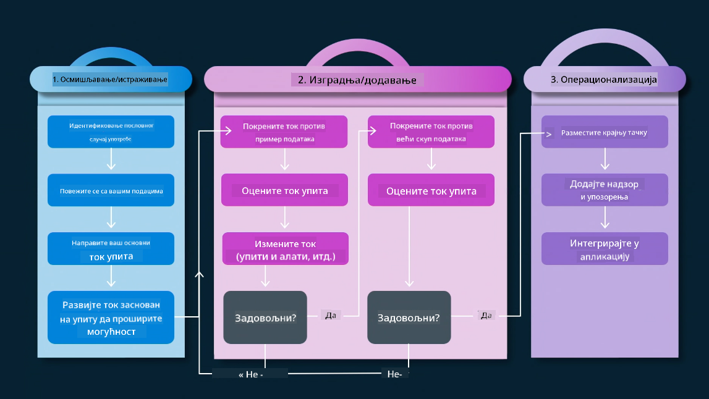
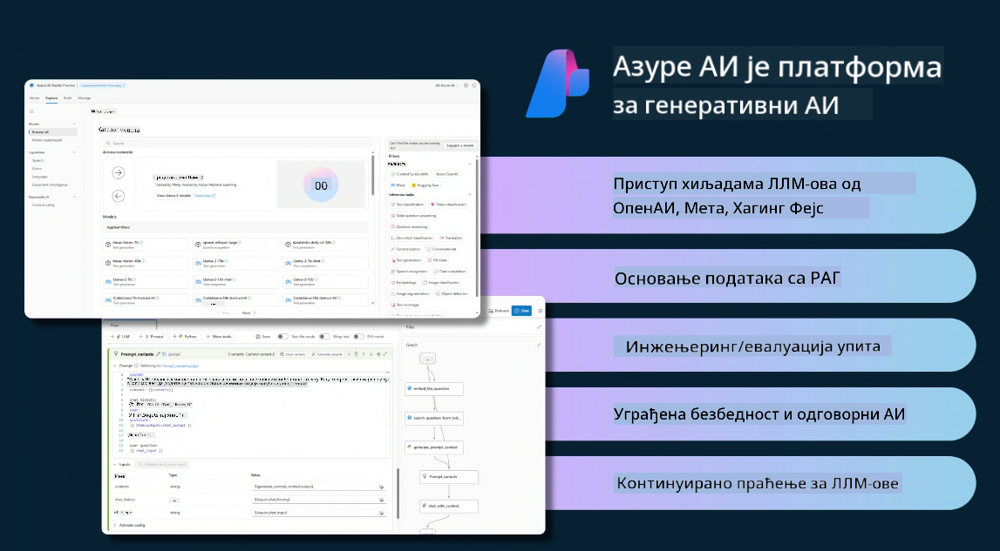
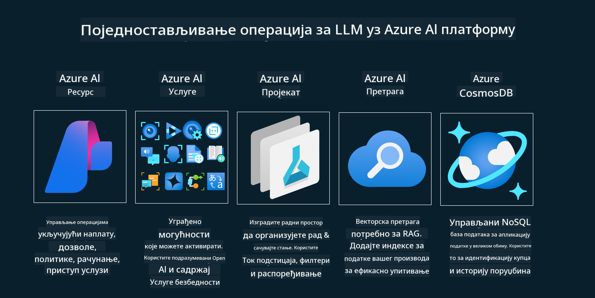
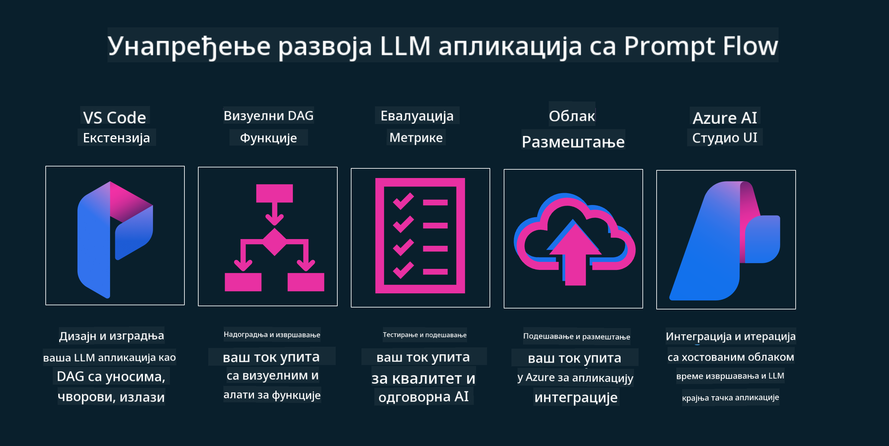

<!--
CO_OP_TRANSLATOR_METADATA:
{
  "original_hash": "27a5347a5022d5ef0a72ab029b03526a",
  "translation_date": "2025-07-09T15:59:15+00:00",
  "source_file": "14-the-generative-ai-application-lifecycle/README.md",
  "language_code": "sr"
}
-->

# Животни циклус апликација генеративне вештачке интелигенције

Важно питање за све AI апликације је релевантност AI функција, јер је AI брзо развијајућа област. Да бисте осигурали да ваша апликација остане релевантна, поуздана и робусна, потребно је да је континуирано пратите, процењујете и унапређујете. Управо ту долази до изражаја животни циклус генеративне AI.

Животни циклус генеративне AI је оквир који вас води кроз фазе развоја, имплементације и одржавања генеративне AI апликације. Помоћи ће вам да дефинишете своје циљеве, измерите перформансе, идентификујете изазове и спроведете решења. Такође вам помаже да усагласите апликацију са етичким и правним стандардима ваше области и заинтересованих страна. Пратећи животни циклус генеративне AI, можете осигурати да ваша апликација увек пружа вредност и задовољава кориснике.

## Увод

У овом поглављу ћете:

- Разумети парадигму промене од MLOps ка LLMOps
- Животни циклус LLM
- Алати за животни циклус
- Метрике и процена животног циклуса

## Разумети парадигму промене од MLOps ка LLMOps

LLM-ови су нови алат у арсеналу вештачке интелигенције, изузетно су моћни у задацима анализе и генерисања за апликације, али ова снага има одређене последице на то како поједностављујемо AI и класичне задатке машинског учења.

Због тога нам је потребна нова парадигма која ће омогућити динамичну адаптацију овог алата уз исправне подстицаје. Можемо старије AI апликације категорисати као „ML апликације“, а новије као „GenAI апликације“ или једноставно „AI апликације“, што одражава доминантне технологије и технике у то време. Ово мења наш приступ на више начина, погледајте следећу поређење.

Приметите да у LLMOps више фокуса стављамо на развојне програмере апликација, користећи интеграције као кључну тачку, користећи „Моделе као услугу“ и размишљајући о следећим метрикама.

- Квалитет: Квалитет одговора
- Штета: Одговорна AI
- Искреност: Основаност одговора (Има ли смисла? Да ли је тачно?)
- Трошак: Буџет решења
- Латенција: Просечно време одговора по токену

## Животни циклус LLM

Прво, да бисмо разумели животни циклус и измене, погледајмо следећу инфографику.

Као што можете приметити, ово се разликује од уобичајених животних циклуса у MLOps. LLM-ови имају много нових захтева, као што су Prompting, различите технике за побољшање квалитета (Fine-Tuning, RAG, Meta-Prompts), другачија процена и одговорност у оквиру одговорне AI, и на крају, нове метрике процене (Квалитет, Штета, Искреност, Трошак и Латенција).

На пример, погледајте како идејно приступамо проблему. Користећи prompt engineering да експериментишемо са различитим LLM-овима како бисмо истражили могућности и тестирали да ли њихова хипотеза може бити тачна.

Имајте на уму да ово није линеарно, већ интегрисани циклуси, итеративни и са општим циклусом.

Како бисмо могли истражити те кораке? Хајде да детаљније погледамо како можемо изградити животни циклус.

Ово може изгледати помало компликовано, па се прво фокусирајмо на три велика корака.

1. Идеја/Истраживање: Истраживање, овде можемо истраживати у складу са пословним потребама. Прототиповање, креирање [PromptFlow](https://microsoft.github.io/promptflow/index.html?WT.mc_id=academic-105485-koreyst) и тестирање да ли је довољно ефикасан за нашу хипотезу.
1. Изградња/Побољшање: Имплементација, сада почињемо да процењујемо веће скупове података и примењујемо технике као што су Fine-tuning и RAG да проверимо робусност нашег решења. Ако не успе, поновна имплементација, додавање нових корака у наш ток или реструктурирање података може помоћи. Након тестирања нашег тока и скале, ако ради и проверава наше метрике, спремно је за следећи корак.
1. Операционализација: Интеграција, сада додајемо системе за праћење и аларме у наш систем, имплементацију и интеграцију апликације.

Затим имамо општи циклус управљања, фокусиран на безбедност, усаглашеност и управљање.

Честитамо, сада имате своју AI апликацију спремну за рад и употребу. За практично искуство, погледајте [Contoso Chat Demo.](https://nitya.github.io/contoso-chat/?WT.mc_id=academic-105485-koreys)

Сада, које алате можемо користити?

## Алати за животни циклус

За алате, Microsoft пружа [Azure AI Platform](https://azure.microsoft.com/solutions/ai/?WT.mc_id=academic-105485-koreys) и [PromptFlow](https://microsoft.github.io/promptflow/index.html?WT.mc_id=academic-105485-koreyst) који олакшавају и чине ваш циклус једноставним за имплементацију и спремним за употребу.

[Azure AI Platform](https://azure.microsoft.com/solutions/ai/?WT.mc_id=academic-105485-koreys) вам омогућава коришћење [AI Studio](https://ai.azure.com/?WT.mc_id=academic-105485-koreys). AI Studio је веб портал који вам омогућава да истражујете моделе, примере и алате. Управљате ресурсима, развијате UI токове и користите SDK/CLI опције за развој заснован на коду.

Azure AI вам омогућава коришћење више ресурса за управљање операцијама, услугама, пројектима, претрагом вектора и базама података.

Конструишите, од Proof-of-Concept (POC) до апликација великог обима са PromptFlow:

- Дизајнирајте и градите апликације из VS Code-а, са визуелним и функционалним алатима
- Тестирајте и фино подешавајте апликације за квалитетну AI, једноставно.
- Користите Azure AI Studio за интеграцију и итерацију са облаком, пуш и деплој за брзу интеграцију.

## Одлично! Наставите са учењем!

Сјајно, сада сазнајте више о томе како структурирамо апликацију да бисте користили ове концепте са [Contoso Chat App](https://nitya.github.io/contoso-chat/?WT.mc_id=academic-105485-koreyst), да бисте видели како Cloud Advocacy примењује те концепте у демонстрацијама. За више садржаја, погледајте нашу [Ignite breakout сесију!](https://www.youtube.com/watch?v=DdOylyrTOWg)

Сада, погледајте Лекцију 15, да бисте разумели како [Retrieval Augmented Generation и Vector Databases](../15-rag-and-vector-databases/README.md?WT.mc_id=academic-105485-koreyst) утичу на генеративну AI и како направити занимљивије апликације!

**Одрицање од одговорности**:  
Овај документ је преведен коришћењем AI услуге за превођење [Co-op Translator](https://github.com/Azure/co-op-translator). Иако се трудимо да превод буде тачан, молимо вас да имате у виду да аутоматски преводи могу садржати грешке или нетачности. Оригинални документ на његовом изворном језику треба сматрати ауторитетним извором. За критичне информације препоручује се професионални људски превод. Нисмо одговорни за било каква неспоразума или погрешна тумачења која произилазе из коришћења овог превода.