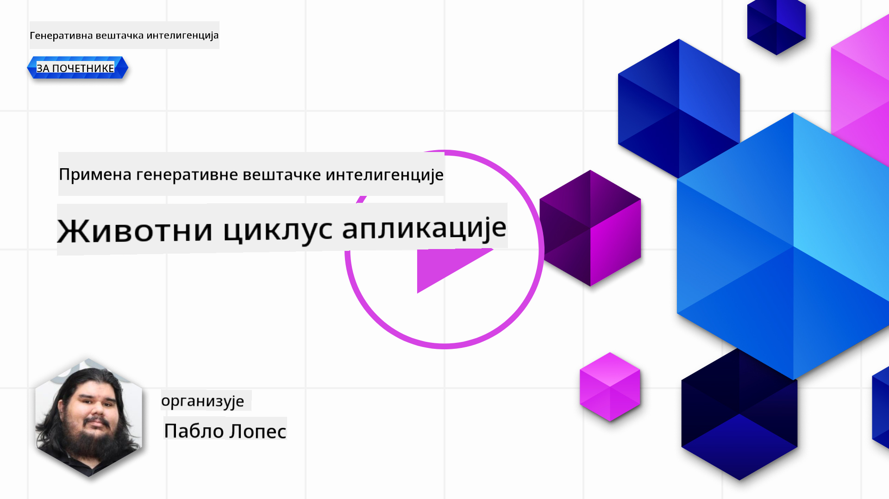
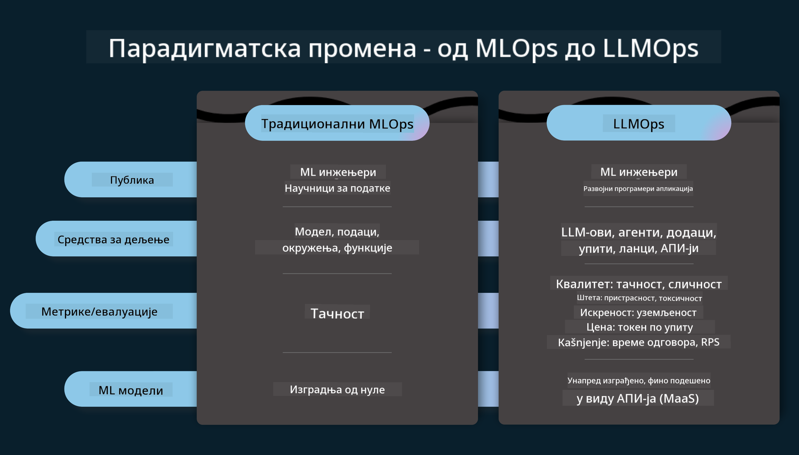
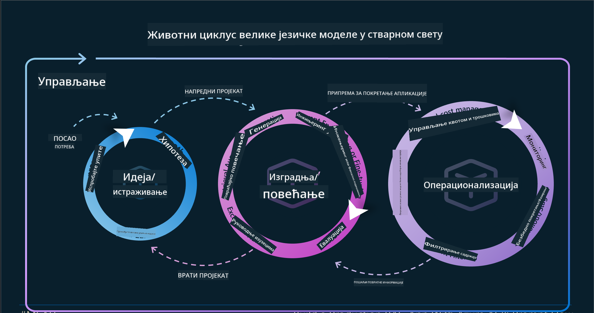
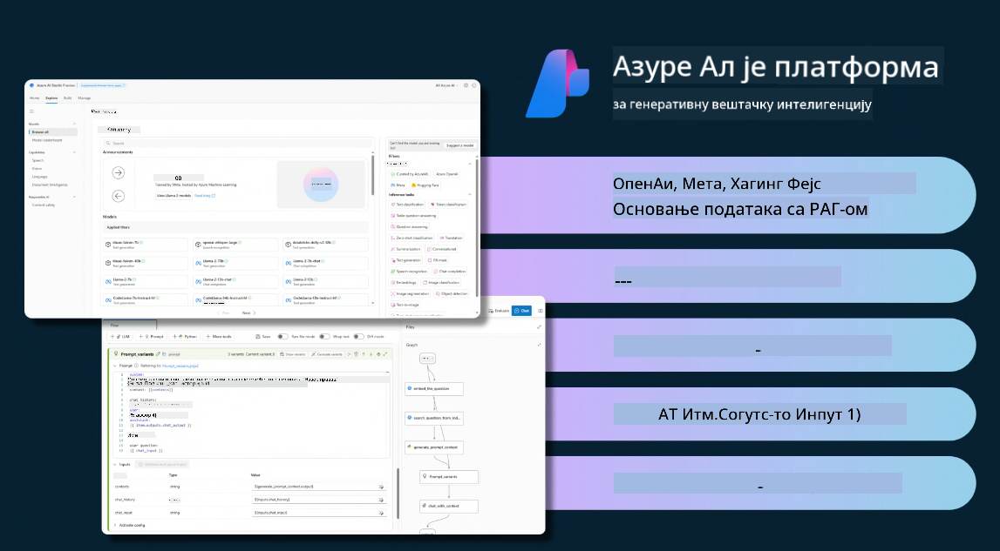
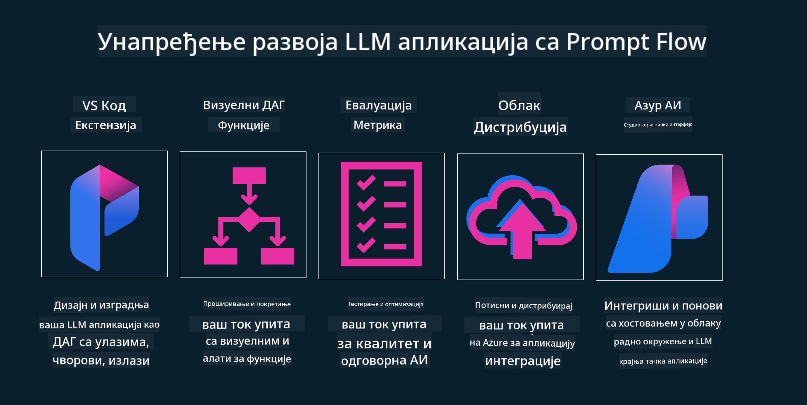

<!--
CO_OP_TRANSLATOR_METADATA:
{
  "original_hash": "27a5347a5022d5ef0a72ab029b03526a",
  "translation_date": "2025-05-20T00:57:07+00:00",
  "source_file": "14-the-generative-ai-application-lifecycle/README.md",
  "language_code": "sr"
}
-->

# Životni ciklus aplikacija generativne AI

Važno pitanje za sve AI aplikacije je relevantnost AI funkcija, jer je AI oblast koja se brzo razvija. Da bi vaša aplikacija ostala relevantna, pouzdana i robusna, potrebno je da je kontinuirano pratite, ocenjujete i unapređujete. Tu dolazi životni ciklus generativne AI.

Životni ciklus generativne AI je okvir koji vas vodi kroz faze razvoja, implementacije i održavanja generativne AI aplikacije. Pomaže vam da definišete ciljeve, merite performanse, identifikujete izazove i implementirate rešenja. Takođe vam pomaže da uskladite vašu aplikaciju sa etičkim i pravnim standardima vašeg domena i vaših zainteresovanih strana. Prateći životni ciklus generativne AI, možete osigurati da vaša aplikacija uvek donosi vrednost i zadovoljava vaše korisnike.

## Uvod

U ovom poglavlju ćete:

- Razumeti promena paradigme sa MLOps na LLMOps
- Životni ciklus LLM-a
- Alati za životni ciklus
- Metrifikacija i evaluacija životnog ciklusa

## Razumeti promena paradigme sa MLOps na LLMOps

LLM-ovi su novi alat u arsenalu veštačke inteligencije, izuzetno su moćni u zadacima analize i generacije za aplikacije, međutim, ova moć ima neke posledice u tome kako pojednostavljujemo AI i klasične zadatke mašinskog učenja.

Sa ovim, potrebna nam je nova paradigma da prilagodimo ovaj alat u dinamičnom okruženju, sa pravim podsticajima. Možemo kategorisati starije AI aplikacije kao "ML aplikacije", a novije AI aplikacije kao "GenAI aplikacije" ili jednostavno "AI aplikacije", odražavajući mainstream tehnologiju i tehnike korišćene u to vreme. Ovo menja našu naraciju na više načina, pogledajte sledeće poređenje.

Primetite da u LLMOps-u, više smo fokusirani na razvoj aplikacija, koristeći integracije kao ključnu tačku, koristeći "Modeli-kao-usluga" i razmišljajući o sledećim tačkama za metrike.

- Kvalitet: Kvalitet odgovora
- Šteta: Odgovorna AI
- Iskrenost: Utemeljenost odgovora (Da li ima smisla? Da li je tačno?)
- Trošak: Budžet rešenja
- Kašnjenje: Prosečno vreme za odgovor tokena

## Životni ciklus LLM-a

Prvo, da bismo razumeli životni ciklus i modifikacije, hajde da zabeležimo sledeću infografiku.

Kao što možete primetiti, ovo je drugačije od uobičajenih životnih ciklusa iz MLOps-a. LLM-ovi imaju mnogo novih zahteva, kao što su Prompting, različite tehnike za poboljšanje kvaliteta (Fine-Tuning, RAG, Meta-Prompts), različite procene i odgovornost sa odgovornom AI, na kraju, nove evaluacione metrike (Kvalitet, Šteta, Iskrenost, Trošak i Kašnjenje).

Na primer, pogledajte kako mi idejemo. Koristeći inženjering prompta da eksperimentišemo sa raznim LLM-ovima kako bismo istražili mogućnosti da testiramo da li bi njihova hipoteza mogla biti tačna.

Primetite da ovo nije linearno, već integrisani ciklusi, iterativni i sa sveobuhvatnim ciklusom.

Kako bismo mogli istražiti te korake? Hajde da uđemo u detalje kako bismo mogli izgraditi životni ciklus.

Ovo može izgledati pomalo komplikovano, hajde da se fokusiramo na tri velike korake prvo.

1. Ideiranje/Istraživanje: Istraživanje, ovde možemo istraživati prema našim poslovnim potrebama. Prototipiranje, kreiranje [PromptFlow](https://microsoft.github.io/promptflow/index.html?WT.mc_id=academic-105485-koreyst) i testiranje da li je dovoljno efikasan za našu hipotezu.
2. Izgradnja/Povećanje: Implementacija, sada počinjemo da ocenjujemo za veće skupove podataka, implementiramo tehnike, kao što su Fine-tuning i RAG, da proverimo robusnost našeg rešenja. Ako nije, ponovno implementiranje, dodavanje novih koraka u našem toku ili restrukturiranje podataka, može pomoći. Nakon testiranja našeg toka i naše skale, ako radi i proverimo naše metrike, spreman je za sledeći korak.
3. Operacionalizacija: Integracija, sada dodavanje sistema za praćenje i upozorenja u naš sistem, implementacija i integracija aplikacije u našu aplikaciju.

Zatim, imamo sveobuhvatan ciklus upravljanja, fokusirajući se na sigurnost, usklađenost i upravljanje.

Čestitamo, sada imate svoju AI aplikaciju spremnu za rad i operativnu. Za praktično iskustvo, pogledajte [Contoso Chat Demo.](https://nitya.github.io/contoso-chat/?WT.mc_id=academic-105485-koreys)

Sada, koje alate možemo koristiti?

## Alati za životni ciklus

Za alate, Microsoft pruža [Azure AI Platform](https://azure.microsoft.com/solutions/ai/?WT.mc_id=academic-105485-koreys) i [PromptFlow](https://microsoft.github.io/promptflow/index.html?WT.mc_id=academic-105485-koreyst) da olakša i učini vaš ciklus jednostavnim za implementaciju i spremnim za rad.

[Azure AI Platform](https://azure.microsoft.com/solutions/ai/?WT.mc_id=academic-105485-koreys), omogućava vam da koristite [AI Studio](https://ai.azure.com/?WT.mc_id=academic-105485-koreys). AI Studio je web portal koji vam omogućava da istražujete modele, uzorke i alate. Upravljanje vašim resursima, razvoj UI tokova i SDK/CLI opcije za razvoj baziran na kodu.

Azure AI, omogućava vam da koristite više resursa, da upravljate vašim operacijama, uslugama, projektima, potrebama za pretragom vektora i bazama podataka.

Kreirajte, od Proof-of-Concept(POC) do aplikacija velikog obima sa PromptFlow:

- Dizajnirajte i izgradite aplikacije iz VS Code, sa vizuelnim i funkcionalnim alatima
- Testirajte i fino podešavajte vaše aplikacije za kvalitetnu AI, sa lakoćom.
- Koristite Azure AI Studio za integraciju i iteraciju sa cloud-om, push i implementaciju za brzu integraciju.

## Sjajno! Nastavite sa učenjem!

Izvanredno, sada saznajte više o tome kako strukturiramo aplikaciju da koristi koncepte sa [Contoso Chat App](https://nitya.github.io/contoso-chat/?WT.mc_id=academic-105485-koreyst), da proverite kako Cloud Advocacy dodaje te koncepte u demonstracije. Za više sadržaja, pogledajte naš [Ignite breakout session!
](https://www.youtube.com/watch?v=DdOylyrTOWg)

Sada, pogledajte Lekciju 15, da razumete kako [Povećana generacija pretrage i vektorske baze podataka](../15-rag-and-vector-databases/README.md?WT.mc_id=academic-105485-koreyst) utiču na generativnu AI i kako napraviti angažovanije aplikacije!

**Одрицање од одговорности**:  
Овај документ је преведен коришћењем услуге превођења помоћу вештачке интелигенције [Co-op Translator](https://github.com/Azure/co-op-translator). Иако се трудимо да обезбедимо тачност, молимо вас да будете свесни да аутоматски преводи могу садржати грешке или нетачности. Оригинални документ на свом изворном језику треба сматрати ауторитативним извором. За критичне информације, препоручује се професионални људски превод. Нисмо одговорни за било каква неспоразумевања или погрешна тумачења настала коришћењем овог превода.