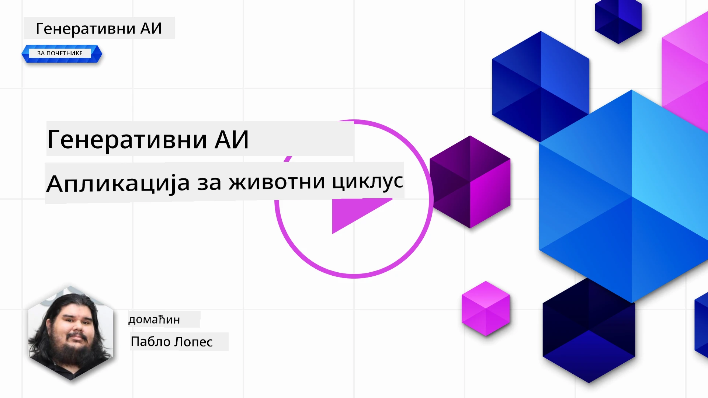
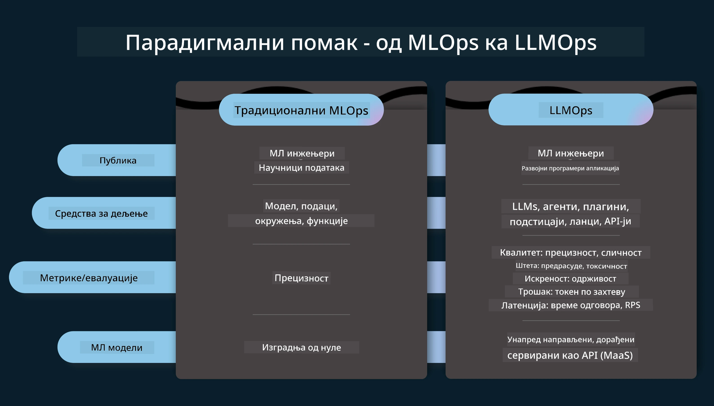
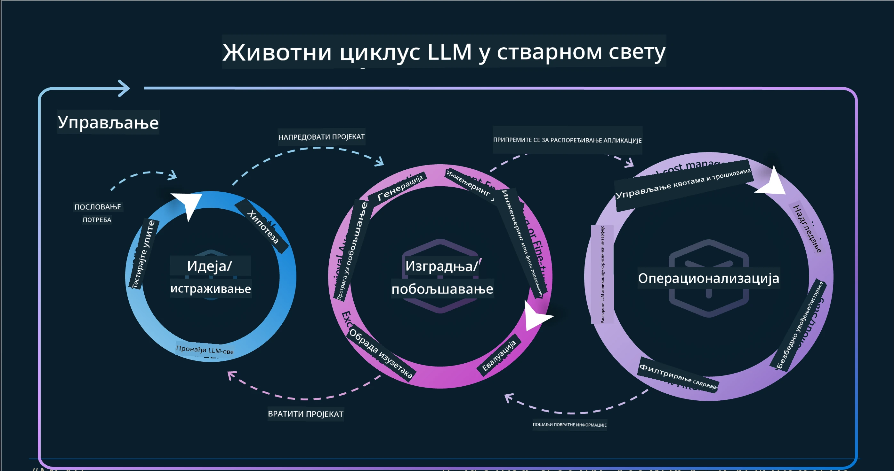
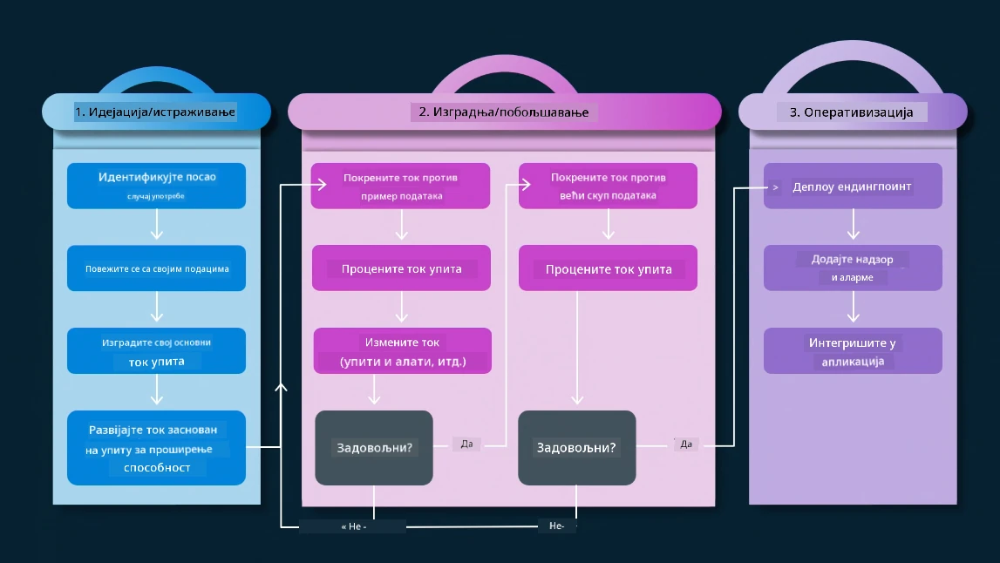
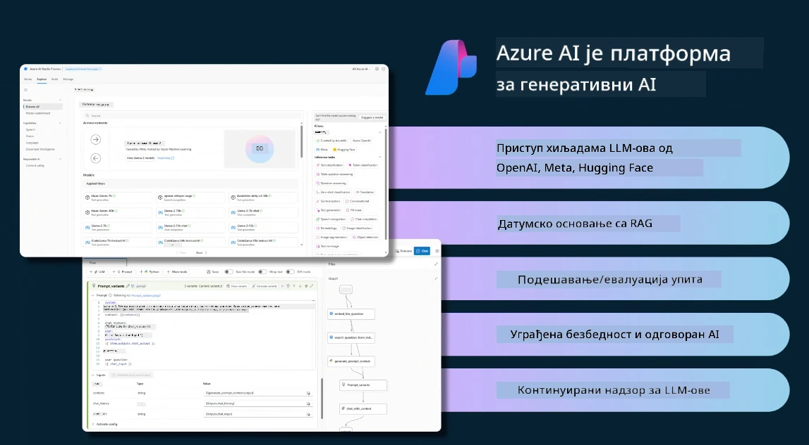
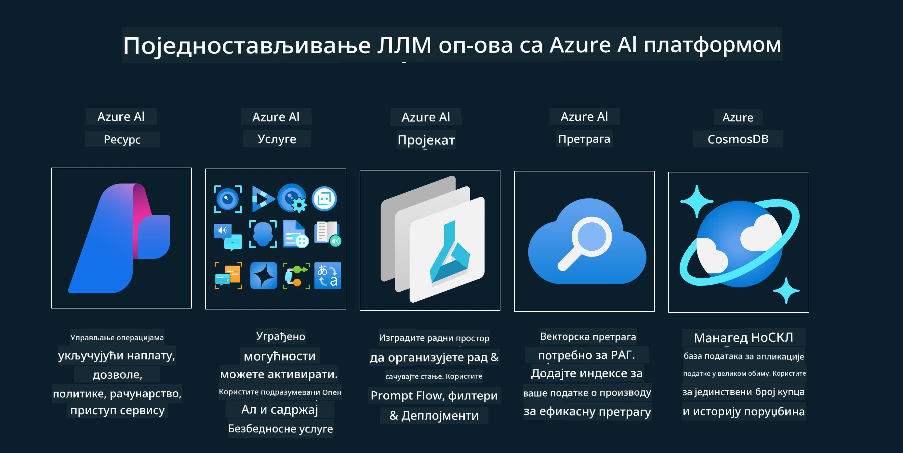
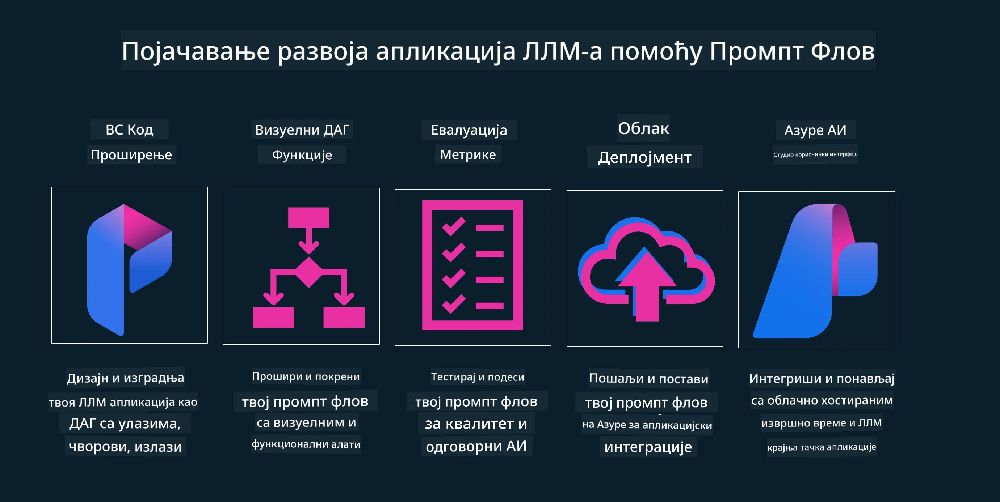

# Животни циклус генеративних AI апликација

Важан питање за све AI апликације је релевантност AI функција, јер је AI брзо развијајућа област; да бисте осигурали да ваша апликација остане релевантна, поуздана и робусна, морате је континуирано пратити, процењивати и унапређивати. Управо ту долази животни циклус генеративног AI.

Животни циклус генеративног AI је оквир који вас води кроз фазе развоја, имплементације и одржавања генеративне AI апликације. Он вам помаже да дефинишете своје циљеве, мерите своје перформансе, идентификујете своје изазове и спроводите решења. Такође вам помаже да ускладите своју апликацију са етичким и правним стандардима ваше области и ваших заинтересованих страна. Пратећи животни циклус генеративног AI, можете осигурати да ваша апликација увек пружа вредност и задовољава ваше кориснике.

## Увод

У овом поглављу ћете:

- Разумети парадигмални помак од MLOps ка LLMOps
- Животни циклус LLM
- Алати за животни циклус
- Метрификацију и процену животног циклуса

## Разумети парадигмални помак од MLOps ка LLMOps

LLM-ови су нови алат у арсеналу вештачке интелигенције, невероватно снажни у задацима анализе и генерисања за апликације, међутим та снага има неке последице по начин како поједностављујемо задатке AI и класичног машинског учења.

С тим, потребна нам је нова парадигма да прилагодимо овај алат динамично, са исправним подстицајима. Можемо класификовати старије AI апликације као „ML апликације“, а новије AI апликације као „GenAI апликације“ или једноставно „AI апликације“, одражавајући водећу технологију и технике тог времена. Ово мења нашу наративу на више начина, погледајте следећу упоредбу.

Приметите да се у LLMOps више фокусирамо на развојне програмере апликација, користећи интеграције као кључну тачку, користећи „Моделе као услугу“ и размишљајући о следећим тачкама метрика.

- Квалитет: Квалитет одговора
- Штета: Одговорни AI
- Искреност: Основаност одговора (Има ли смисла? Да ли је тачан?)
- Трошкови: Буџет решења
- Заостајање: Просечно време за одговор токена

## Животни циклус LLM

Прво, да бисмо разумели животни циклус и измене, погледајмо следећу инфографику.

Као што можете приметити, ово је другачије од уобичајених животних циклуса из MLOps. LLM има много нових захтева, као што су подстицање (Prompting), различите технике за побољшање квалитета (фино подешавање, RAG, мета-подстицаји), различите процене и одговорности уз одговорни AI, и на крају нове метрике процене (квалитет, штета, искреност, трошкови и заостајање).

На пример, погледајте како осмишљавамо. Користећи инженеринг упита (prompt engineering) да експериментишемо са различитим LLM моделима у циљу испитивања да ли би њихова хипотеза могла бити исправна.

Имајте на уму да ово није линеарно, већ интегрисане петље, итеративне и са општем цикличном структуром.

Како бисмо истражили те кораке? Хајде да детаљније разгледамо како можемо изградити животни циклус.

Ово можда изгледа мало компликовано, најпре се фокусирамо на три велика корака.

1. Осмишљавање/Истраживање: Истраживање, овде можемо истраживати према потребама нашег пословања. Прототиповање, креирање [PromptFlow](https://microsoft.github.io/promptflow/index.html?WT.mc_id=academic-105485-koreyst) и тестирање да ли је довољно ефикасан за нашу хипотезу.
1. Изградња/Побољшање: Имплементација, сада почињемо да процењујемо веће скупове података, примењујемо технике као што су фино подешавање и RAG да проверимо робусност нашег решења. Ако није, поновна имплементација, додавање нових корака у наш ток или реструктурирање података може помоћи. Након тестирања нашег тока и скале, ако ради и меримо метрике, спремни смо за следећи корак.
1. Операционализација: Интеграција, сада додајемо системе за праћење и аларме у наш систем, имплементацију и интеграцију апликације.

Затим, имамо општи циклус управљања, са фокусом на безбедност, усаглашеност и управљање.

Честитамо, сада имате своју AI апликацију спремну за рад и употребу. За практично искуство, погледајте [Contoso чат демонстрацију](https://nitya.github.io/contoso-chat/?WT.mc_id=academic-105485-koreyst).

А сада, које алате можемо користити?

## Алати за животни циклус

За алате, Microsoft пружа [Azure AI платформу](https://azure.microsoft.com/solutions/ai/?WT.mc_id=academic-105485-koreyst) и [PromptFlow](https://microsoft.github.io/promptflow/index.html?WT.mc_id=academic-105485-koreyst) који олакшавају и чине ваш циклус једноставним за примену и спремањем за употребу.

[Azure AI платформа](https://azure.microsoft.com/solutions/ai/?WT.mc_id=academic-105485-koreyst) вам омогућава коришћење [AI Studio](https://ai.azure.com/?WT.mc_id=academic-105485-koreyst). AI Studio је веб портал који вам омогућава да истражујете моделе, примере и алате. Управљате својим ресурсима, UI развојним токовима и опцијама SDK/CLI за развој са фокусом на код.

Azure AI вам омогућава да користите више ресурса за управљање вашим операцијама, услугама, пројектима, претрагом вектора и потребама база података.

Конструишите, од доказа концепта (POC) до великих апликација са PromptFlow:

- Дизајнирајте и градите апликације из VS Code-а, користећи визуелне и функционалне алате
- Тестирајте и фино подешавајте ваше апликације за квалитетан AI, лако.
- Користите Azure AI Studio за интеграцију и итерацију са облаком, пуш и деплои за брзу интеграцију.

## Одлично! Наставите своје учење!

Сјајно, сада сазнајте више о томе како структуирамо апликацију да бисте користили концепте уз [Contoso чат апликацију](https://nitya.github.io/contoso-chat/?WT.mc_id=academic-105485-koreyst), да бисте видели како Cloud Advocacy додаје те концепте у демонстрацијама. За више садржаја, погледајте нашу [Ignite сесију!](https://www.youtube.com/watch?v=DdOylyrTOWg)

Сада, проверите Лекцију 15 да бисте разумели како [Retrieval Augmented Generation и векторске базе података](../15-rag-and-vector-databases/README.md?WT.mc_id=academic-105485-koreyst) утичу на генеративни AI и како направити занимљивије апликације!

---

<!-- CO-OP TRANSLATOR DISCLAIMER START -->
**Изјава о одрицању одговорности**:  
Овај документ је преведен коришћењем AI сервиса за превођење [Co-op Translator](https://github.com/Azure/co-op-translator). Иако настојимо да превод буде тачан, молимо имајте у виду да аутоматски преводи могу садржати грешке или нетачности. Оригинални документ на свом изворном језику треба сматрати прецизним и званичним извором. За критичне информације препоруучујемо професионални превод од стране стручног човека. Нисмо одговорни за било каква неспоразума или погрешна тумачења настала коришћењем овог превода.
<!-- CO-OP TRANSLATOR DISCLAIMER END -->