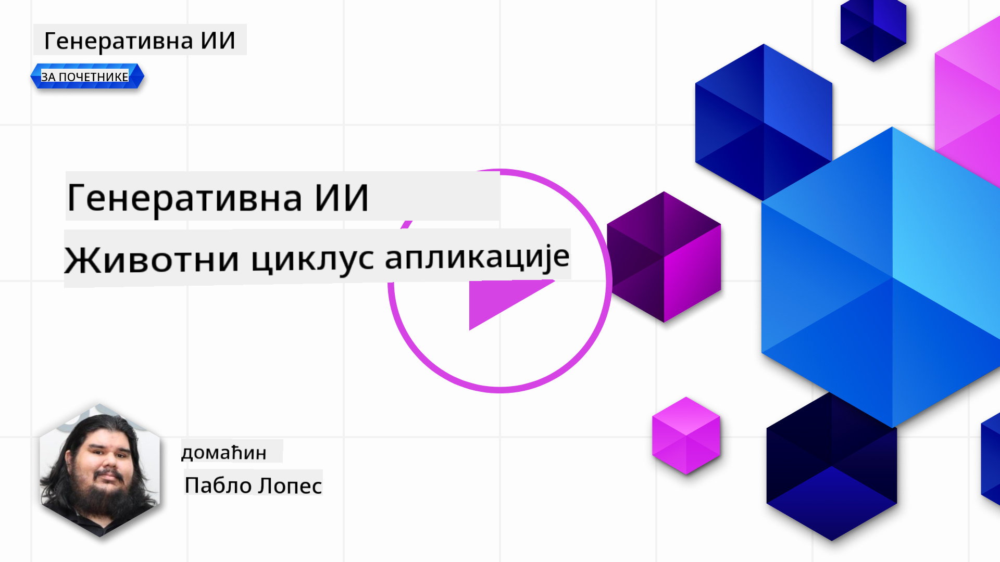
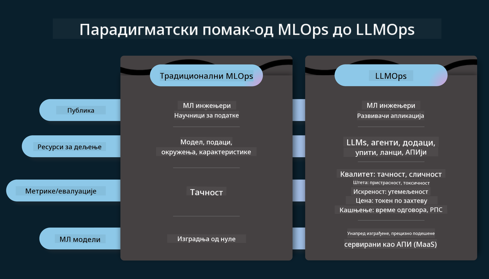
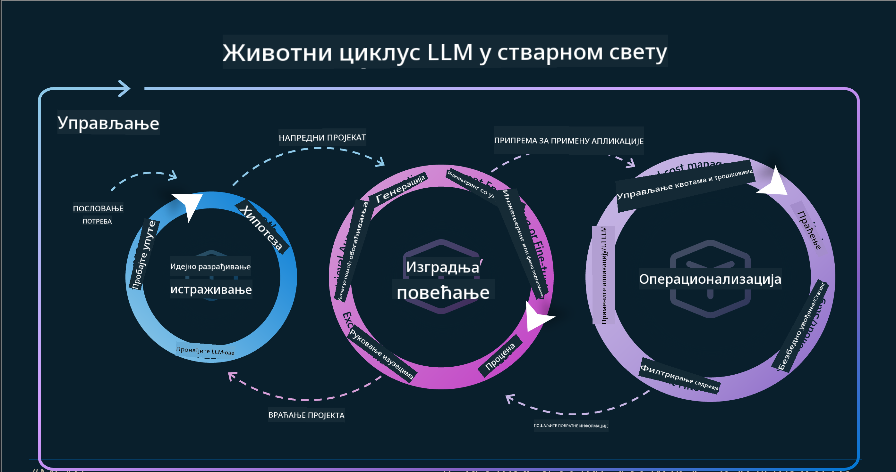
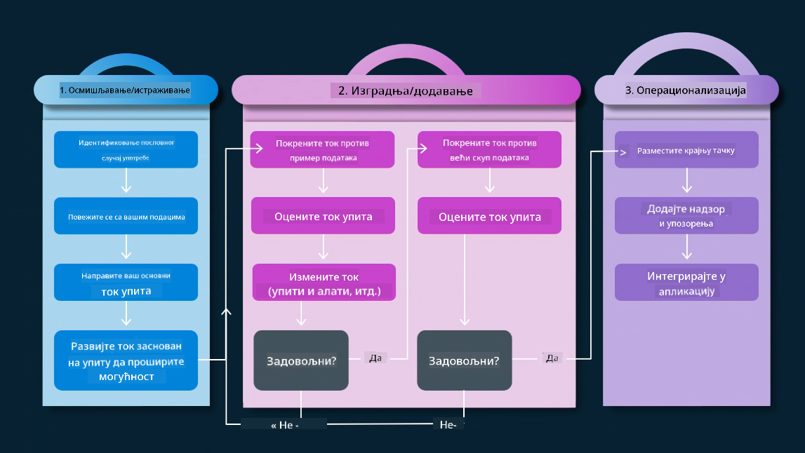
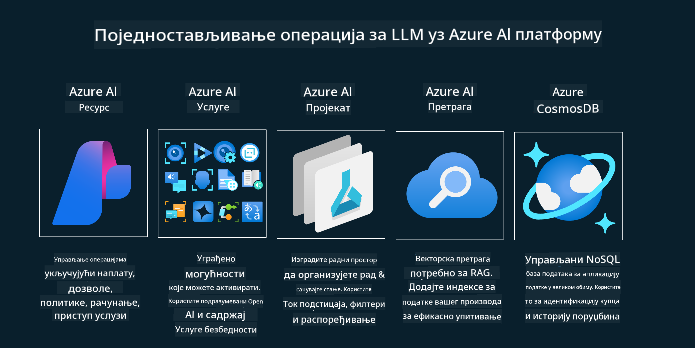
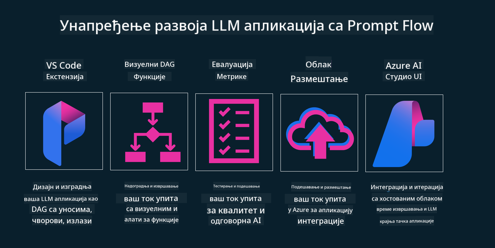

<!--
CO_OP_TRANSLATOR_METADATA:
{
  "original_hash": "27a5347a5022d5ef0a72ab029b03526a",
  "translation_date": "2025-06-25T22:11:32+00:00",
  "source_file": "14-the-generative-ai-application-lifecycle/README.md",
  "language_code": "sr"
}
-->

# Животни циклус генеративних AI апликација

Важно питање за све AI апликације је релевантност AI функција, јер је AI поље које се брзо развија. Да би ваша апликација остала релевантна, поуздана и робусна, потребно је да је континуирано пратите, процењујете и унапређујете. Ту долази до изражаја животни циклус генеративног AI.

Животни циклус генеративног AI је оквир који вас води кроз фазе развоја, примене и одржавања генеративне AI апликације. Помаже вам да дефинишете своје циљеве, измерите свој учинак, идентификујете своје изазове и примените своја решења. Такође вам помаже да своју апликацију ускладите са етичким и правним стандардима ваше области и ваших заинтересованих страна. Пратећи животни циклус генеративног AI, можете осигурати да ваша апликација увек пружа вредност и задовољава ваше кориснике.

## Увод

У овом поглављу ћете:

- Разумети промену парадигме са MLOps на LLMOps
- Животни циклус LLM
- Алатке за животни циклус
- Метрификација и евалуација животног циклуса

## Разумети промену парадигме са MLOps на LLMOps

LLM-ови су нови алат у арсеналу вештачке интелигенције, невероватно су моћни у задацима анализе и генерисања за апликације, међутим, ова моћ има неке последице на начин на који убрзавамо AI и задатке класичног машинског учења.

Са тим, потребна нам је нова парадигма да прилагодимо овај алат у динамици, са исправним подстицајима. Можемо категоризовати старије AI апликације као "ML апликације", а новије AI апликације као "GenAI апликације" или само "AI апликације", што одражава главну технологију и технике коришћене у то време. Ово мења наш наратив на више начина, погледајте следеће поређење.

Приметите да се у LLMOps више фокусирамо на развојне програмере апликација, користећи интеграције као кључну тачку, користећи "Моделе као услугу" и размишљајући о следећим тачкама за метрике.

- Квалитет: Квалитет одговора
- Штета: Одговорна AI
- Искреност: Утемелјеност одговора (Има ли смисла? Да ли је тачно?)
- Цена: Буџет решења
- Кашњење: Просечно време за одговор у токенима

## Животни циклус LLM

Прво, да бисмо разумели животни циклус и измене, приметимо следећу инфографику.

Као што можете приметити, ово се разликује од уобичајених животних циклуса из MLOps. LLM-ови имају много нових захтева, као што су Prompting, различите технике за побољшање квалитета (Fine-Tuning, RAG, Meta-Prompts), различита процена и одговорност са одговорном AI, на крају, нове метрике евалуације (Квалитет, Штета, Искреност, Цена и Кашњење).

На пример, погледајте како размишљамо. Користећи инжењеринг промпта да експериментишемо са различитим LLM-овима како бисмо истражили могућности да тестирамо да ли би њихова хипотеза могла бити тачна.

Приметите да ово није линеарно, већ интегрисани кругови, итеративни и са свеобухватним циклусом.

Како бисмо могли да истражимо те кораке? Уђимо у детаље како бисмо могли изградити животни циклус.

Ово може изгледати мало компликовано, фокусирајмо се на три велика корака прво.

1. Идеја/Истраживање: Истраживање, овде можемо истражити према нашим пословним потребама. Прототипирање, креирање [PromptFlow](https://microsoft.github.io/promptflow/index.html?WT.mc_id=academic-105485-koreyst) и тестирање да ли је довољно ефикасно за нашу хипотезу.
1. Изградња/Повећање: Имплементација, сада почињемо да процењујемо веће скупове података, имплементирамо технике као што су Fine-tuning и RAG, да проверимо робусност нашег решења. Ако није, поновна имплементација, додавање нових корака у наш ток или реструктурирање података, могло би помоћи. Након тестирања нашег тока и наше скале, ако ради и проверавамо наше метрике, спремно је за следећи корак.
1. Операционализација: Интеграција, сада додајемо системе за праћење и упозорења у наш систем, примену и интеграцију апликација у нашу апликацију.

Затим имамо свеобухватни циклус управљања, фокусирајући се на безбедност, усклађеност и управљање.

Честитамо, сада имате своју AI апликацију спремну за рад и оперативну. За практично искуство, погледајте [Contoso Chat Demo.](https://nitya.github.io/contoso-chat/?WT.mc_id=academic-105485-koreys)

Сада, које алате бисмо могли користити?

## Алатке за животни циклус

За алатке, Microsoft пружа [Azure AI Platform](https://azure.microsoft.com/solutions/ai/?WT.mc_id=academic-105485-koreys) и [PromptFlow](https://microsoft.github.io/promptflow/index.html?WT.mc_id=academic-105485-koreyst) како би олакшали и учинили ваш циклус лако применљивим и спремним за рад.

[Azure AI Platform](https://azure.microsoft.com/solutions/ai/?WT.mc_id=academic-105485-koreys) вам омогућава да користите [AI Studio](https://ai.azure.com/?WT.mc_id=academic-105485-koreys). AI Studio је веб портал који вам омогућава да истражујете моделе, узорке и алате. Управљање вашим ресурсима, UI развојним токовима и SDK/CLI опцијама за развој са првим кодом.

Azure AI вам омогућава да користите више ресурса за управљање вашим операцијама, услугама, пројектима, векторским претрагама и потребама база података.

Конструишите, од Proof-of-Concept(POC) до великих апликација са PromptFlow:

- Дизајнирајте и изградите апликације из VS Code, са визуелним и функционалним алатима
- Тестирајте и фино подесите своје апликације за квалитетан AI, са лакоћом.
- Користите Azure AI Studio за интеграцију и итерацију са облаком, Push и Deploy за брзу интеграцију.

## Одлично! Наставите са учењем!

Невероватно, сада сазнајте више о томе како структурирамо апликацију да користимо концепте са [Contoso Chat App](https://nitya.github.io/contoso-chat/?WT.mc_id=academic-105485-koreys), да проверимо како Cloud Advocacy додаје те концепте у демонстрације. За више садржаја, погледајте нашу [Ignite breakout сесију!
](https://www.youtube.com/watch?v=DdOylyrTOWg)

Сада, проверите Лекцију 15, да бисте разумели како [Retrieval Augmented Generation и векторске базе података](../15-rag-and-vector-databases/README.md?WT.mc_id=academic-105485-koreyst) утичу на генеративни AI и како направити занимљивије апликације!

**Одрицање од одговорности**:  
Овај документ је преведен коришћењем услуге за превођење вештачке интелигенције [Co-op Translator](https://github.com/Azure/co-op-translator). Иако тежимо тачности, молимо вас да будете свесни да аутоматизовани преводи могу садржати грешке или нетачности. Оригинални документ на свом изворном језику треба сматрати ауторитативним извором. За критичне информације, препоручује се професионални превод од стране људи. Не сносимо одговорност за било каква неспоразума или погрешна тумачења настала коришћењем овог превода.