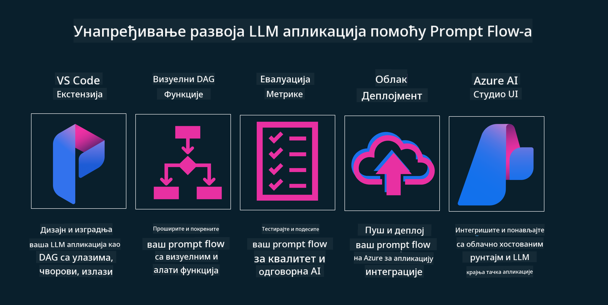

<!--
CO_OP_TRANSLATOR_METADATA:
{
  "original_hash": "b9d32511b27373a1b21b5789d4fda057",
  "translation_date": "2025-10-18T01:22:25+00:00",
  "source_file": "14-the-generative-ai-application-lifecycle/README.md",
  "language_code": "sr"
}
-->

# Животни циклус апликација заснованих на генеративној вештачкој интелигенцији

Једно од важних питања за све апликације засноване на вештачкој интелигенцији је релевантност њених функција, јер је вештачка интелигенција област која се брзо развија. Да би ваша апликација остала релевантна, поуздана и робусна, потребно је да је континуирано пратите, процењујете и унапређујете. Овде на сцену ступа животни циклус генеративне вештачке интелигенције.

Животни циклус генеративне вештачке интелигенције је оквир који вас води кроз фазе развоја, примене и одржавања апликације засноване на генеративној вештачкој интелигенцији. Помаже вам да дефинишете своје циљеве, мерите перформансе, идентификујете изазове и имплементирате решења. Такође вам помаже да ускладите своју апликацију са етичким и правним стандардима вашег домена и ваших заинтересованих страна. Пратећи животни циклус генеративне вештачке интелигенције, можете осигурати да ваша апликација увек пружа вредност и задовољава кориснике.

## Увод

У овом поглављу ћете:

- Разумети прелаз са MLOps на LLMOps
- Животни циклус LLM-а
- Алатке за животни циклус
- Метрификација и евалуација животног циклуса

## Разумевање прелаза са MLOps на LLMOps

LLM-ови су нови алат у арсеналу вештачке интелигенције, изузетно моћни у задацима анализе и генерисања за апликације. Међутим, ова моћ има одређене последице на начин на који оптимизујемо задатке вештачке интелигенције и класичног машинског учења.

С тим у вези, потребан нам је нови парадигма да бисмо прилагодили овај алат на динамичан начин, уз одговарајуће подстицаје. Можемо категорисати старије апликације засноване на вештачкој интелигенцији као "ML апликације", а новије као "GenAI апликације" или једноставно "AI апликације", што одражава главне технологије и технике које се користе у одређеном времену. Овај прелаз мења наш приступ на више начина, погледајте следећу поређење.

Приметите да се у LLMOps више фокусирамо на програмере апликација, користећи интеграције као кључну тачку, користећи "Моделе као услугу" и разматрајући следеће тачке за метрике:

- Квалитет: Квалитет одговора
- Штета: Одговорна вештачка интелигенција
- Искреност: Утемељеност одговора (Да ли има смисла? Да ли је тачно?)
- Трошкови: Буџет решења
- Кашњење: Просечно време за одговор токена

## Животни циклус LLM-а

Прво, да бисмо разумели животни циклус и његове модификације, погледајмо следећу инфографику.

Као што можете приметити, ово се разликује од уобичајених животних циклуса из MLOps-а. LLM-ови имају много нових захтева, као што су подешавање упита, различите технике за побољшање квалитета (Fine-Tuning, RAG, Meta-Prompts), различите процене и одговорност са одговорном вештачком интелигенцијом, и на крају, нове метрике евалуације (Квалитет, Штета, Искреност, Трошкови и Кашњење).

На пример, погледајте како осмишљавамо идеје. Користимо инжењеринг упита да експериментишемо са различитим LLM-овима како бисмо истражили могућности и тестирали да ли њихова хипотеза може бити тачна.

Приметите да ово није линеарно, већ интегрисани циклуси, итеративни и са свеобухватним циклусом.

Како можемо истражити те кораке? Хајде да детаљније погледамо како можемо изградити животни циклус.

Ово може изгледати мало компликовано, хајде да се фокусирамо на три велика корака.

1. Осмишљавање/Истраживање: Истраживање, овде можемо истраживати у складу са потребама нашег пословања. Прототипирање, креирање [PromptFlow](https://microsoft.github.io/promptflow/index.html?WT.mc_id=academic-105485-koreyst) и тестирање да ли је довољно ефикасно за нашу хипотезу.
1. Изградња/Унапређење: Имплементација, сада почињемо да процењујемо веће скупове података, имплементирамо технике као што су Fine-tuning и RAG, да проверимо робусност нашег решења. Ако није довољно добро, поново га имплементирамо, додајемо нове кораке у наш ток или реструктурирамо податке, што може помоћи. Након тестирања нашег тока и скале, ако ради и ако су метрике задовољавајуће, спремно је за следећи корак.
1. Оперативно коришћење: Интеграција, сада додајемо системе за праћење и упозорења нашем систему, примену и интеграцију апликације у нашу апликацију.

Затим, имамо свеобухватни циклус управљања, фокусирајући се на безбедност, усклађеност и управљање.

Честитамо, сада је ваша AI апликација спремна за употребу и оперативна. За практично искуство, погледајте [Contoso Chat Demo.](https://nitya.github.io/contoso-chat/?WT.mc_id=academic-105485-koreys)

Сада, које алатке можемо користити?

## Алатке за животни циклус

За алатке, Microsoft пружа [Azure AI Platform](https://azure.microsoft.com/solutions/ai/?WT.mc_id=academic-105485-koreys) и [PromptFlow](https://microsoft.github.io/promptflow/index.html?WT.mc_id=academic-105485-koreyst) како би олакшао и учинио ваш циклус лако применљивим и спремним за употребу.

[Azure AI Platform](https://azure.microsoft.com/solutions/ai/?WT.mc_id=academic-105485-koreys) вам омогућава да користите [AI Studio](https://ai.azure.com/?WT.mc_id=academic-105485-koreys). AI Studio је веб портал који вам омогућава да истражујете моделе, примере и алатке. Управљање вашим ресурсима, развој корисничког интерфејса и опције за развој заснован на коду преко SDK/CLI.

Azure AI вам омогућава да користите више ресурса за управљање вашим операцијама, услугама, пројектима, претрагом вектора и потребама база података.

Конструишите, од Proof-of-Concept (POC) до апликација великог обима уз PromptFlow:

- Дизајнирајте и изградите апликације из VS Code-а, уз визуелне и функционалне алатке
- Тестирајте и фино подесите своје апликације за квалитетну вештачку интелигенцију, лако и ефикасно.
- Користите Azure AI Studio за интеграцију и итерацију са облаком, брзо примените и интегришите.

## Одлично! Наставите са учењем!

Сјајно, сада научите више о томе како структурирамо апликацију да користи концепте уз [Contoso Chat App](https://nitya.github.io/contoso-chat/?WT.mc_id=academic-105485-koreyst), како бисте видели како Cloud Advocacy додаје те концепте у демонстрације. За више садржаја, погледајте нашу [Ignite breakout сесију!
](https://www.youtube.com/watch?v=DdOylyrTOWg)

Сада, погледајте лекцију 15, да бисте разумели како [Retrieval Augmented Generation и Векторске базе података](../15-rag-and-vector-databases/README.md?WT.mc_id=academic-105485-koreyst) утичу на генеративну вештачку интелигенцију и како да направите ангажујуће апликације!

---

**Одрицање од одговорности**:  
Овај документ је преведен помоћу услуге за превођење уз помоћ вештачке интелигенције [Co-op Translator](https://github.com/Azure/co-op-translator). Иако настојимо да обезбедимо тачност, молимо вас да имате у виду да аутоматски преводи могу садржати грешке или нетачности. Оригинални документ на његовом изворном језику треба сматрати меродавним извором. За критичне информације препоручује се професионални превод од стране људи. Не преузимамо одговорност за било каква погрешна тумачења или неспоразуме који могу настати услед коришћења овог превода.