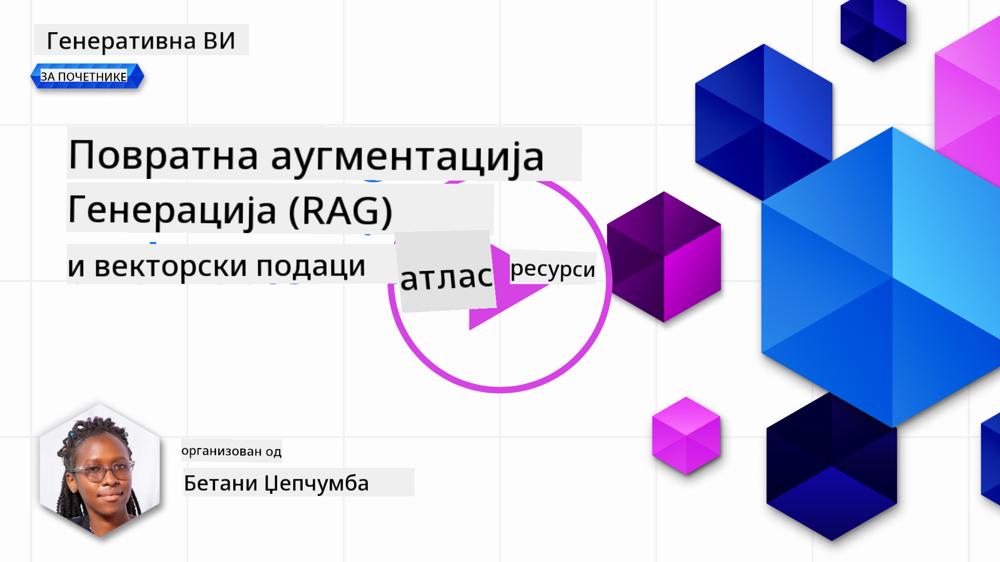
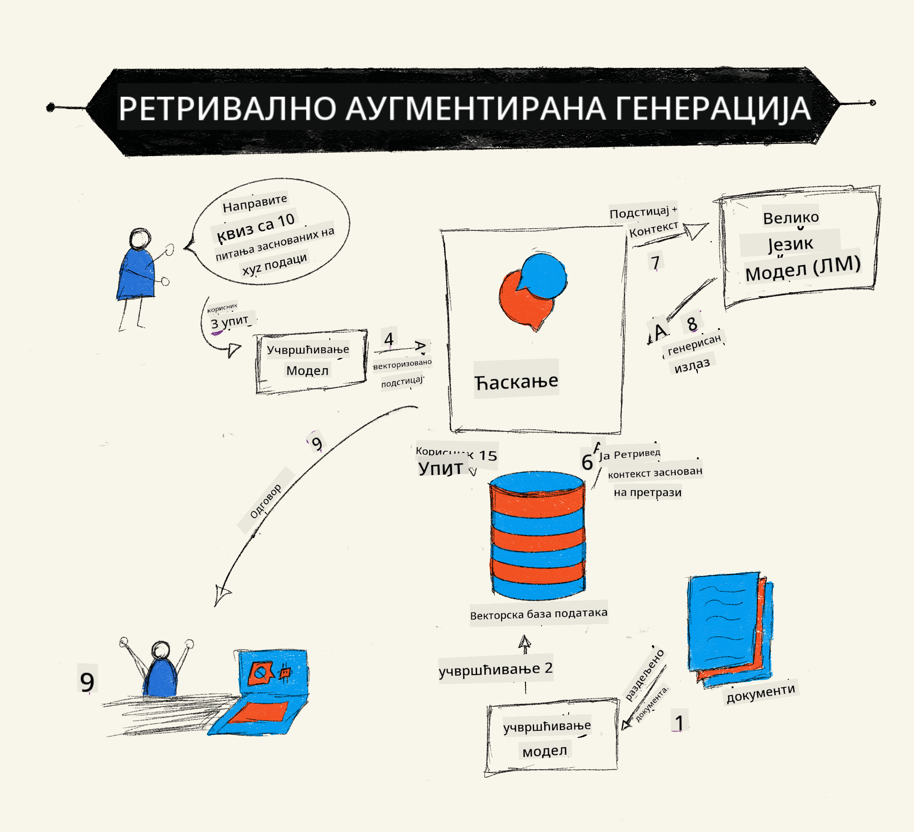
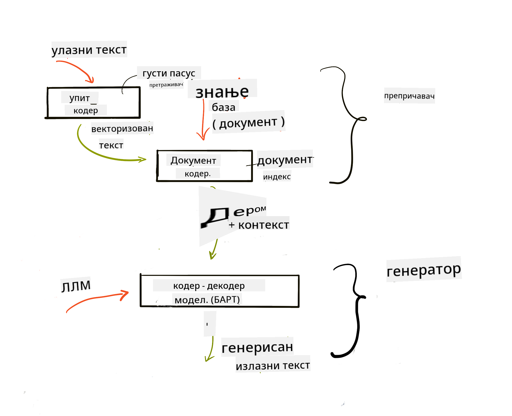
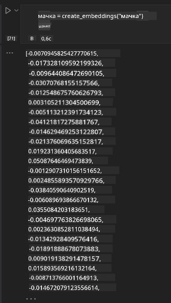

<!--
CO_OP_TRANSLATOR_METADATA:
{
  "original_hash": "e2861bbca91c0567ef32bc77fe054f9e",
  "translation_date": "2025-07-09T16:21:02+00:00",
  "source_file": "15-rag-and-vector-databases/README.md",
  "language_code": "sr"
}
-->
# Retrieval Augmented Generation (RAG) и векторске базе података

[](https://aka.ms/gen-ai-lesson15-gh?WT.mc_id=academic-105485-koreyst)

У лекцији о претраживачким апликацијама, укратко смо научили како да интегришемо своје податке у Large Language Models (LLMs). У овој лекцији ћемо детаљније обрадити концепт ослањања на своје податке у LLM апликацији, механизме процеса и методе за чување података, укључујући и embeddings и текст.

> **Видео ускоро**

## Увод

У овој лекцији ћемо обрадити следеће:

- Увод у RAG, шта је и зашто се користи у вештачкој интелигенцији (AI).

- Разумевање шта су векторске базе података и како направити једну за нашу апликацију.

- Практичан пример како интегрисати RAG у апликацију.

## Циљеви учења

Након завршетка ове лекције, моћи ћете да:

- Објасните значај RAG у претраживању и обради података.

- Подесите RAG апликацију и ослоните своје податке на LLM.

- Ефикасно интегришете RAG и векторске базе података у LLM апликације.

## Наш сценарио: унапређење наших LLM-ова сопственим подацима

За ову лекцију желимо да додамо своје белешке у образовни стартап, што омогућава чатботу да добије више информација о различитим предметима. Користећи белешке које имамо, ученици ће моћи боље да уче и разумеју различите теме, што ће им олакшати припрему за испите. За креирање нашег сценарија користићемо:

- `Azure OpenAI:` LLM који ћемо користити за креирање нашег чатбота

- `AI for beginners' lesson on Neural Networks:` ово ће бити подаци на којима ослањамо наш LLM

- `Azure AI Search` и `Azure Cosmos DB:` векторска база података за чување наших података и креирање претраживачког индекса

Корисници ће моћи да креирају квизове за вежбу из својих белешки, флаш картице за понављање и да их сажму у концизне прегледе. Да бисмо почели, погледајмо шта је RAG и како функционише:

## Retrieval Augmented Generation (RAG)

Чатбот покретан LLM-ом обрађује корисничке упите како би генерисао одговоре. Дизајниран је да буде интерактиван и да комуницира са корисницима о широком спектру тема. Међутим, његови одговори су ограничени на контекст који му је дат и основне податке на којима је трениран. На пример, GPT-4 има cutoff знања у септембру 2021, што значи да нема знање о догађајима након тог периода. Поред тога, подаци који се користе за тренирање LLM-ова не укључују поверљиве информације као што су личне белешке или упутства за производ компаније.

### Како RAG (Retrieval Augmented Generation) функционише



Претпоставимо да желите да поставите чатбот који прави квизове из ваших белешки, потребна вам је веза са базом знања. Ту RAG долази као решење. RAG функционише на следећи начин:

- **База знања:** Пре него што се приступи подацима, документи се морају унети и претходно обрадити, обично разбијањем великих докумената на мање делове, претварањем у текстуалне embeddings и чувањем у бази података.

- **Кориснички упит:** корисник поставља питање

- **Претрага:** Када корисник постави питање, embedding модел проналази релевантне информације из базе знања како би обезбедио додатни контекст који ће бити укључен у упит.

- **Побољшана генерација:** LLM унапређује свој одговор на основу пронађених података. Ово омогућава да одговор није заснован само на претходно тренираним подацима, већ и на релевантним информацијама из додатног контекста. Пронађени подаци се користе за побољшање одговора LLM-а. Затим LLM враћа одговор на корисничко питање.



Архитектура RAG-а се имплементира коришћењем трансформера који се састоје из два дела: енкодера и декодера. На пример, када корисник постави питање, улазни текст се „енкодира“ у векторе који хватају значење речи, а ти вектори се „декодирају“ у наш индекс докумената и генеришу нови текст на основу корисничког упита. LLM користи модел енкодер-декодер за генерисање излаза.

Постоје два приступа при имплементацији RAG-а према предложеном раду: [Retrieval-Augmented Generation for Knowledge intensive NLP Tasks](https://arxiv.org/pdf/2005.11401.pdf?WT.mc_id=academic-105485-koreyst):

- **_RAG-Sequence_** користи пронађене документе да предвиди најбољи могући одговор на кориснички упит

- **RAG-Token** користи документе за генерисање следећег токена, а затим их користи за одговор на кориснички упит

### Зашто користити RAG?

- **Богатство информација:** обезбеђује да текстуални одговори буду ажурни и релевантни. На тај начин побољшава перформансе на задацима специфичним за одређену област приступањем интерној бази знања.

- Смањује измишљање користећи **проверљиве податке** из базе знања како би пружио контекст корисничким упитима.

- **Економичан је** јер је јефтинији у односу на фино подешавање LLM-а.

## Креирање базе знања

Наша апликација се базира на личним подацима, односно лекцији о неуронским мрежама из курикулума AI For Beginners.

### Векторске базе података

Векторска база података, за разлику од традиционалних база, је специјализована база дизајнирана за чување, управљање и претрагу уграђених вектора. Чува нумеричке представке докумената. Разбијање података на нумеричке embeddings олакшава нашем AI систему да разуме и обради податке.

Чувамо своје embeddings у векторским базама јер LLM има ограничење броја токена које може примити као улаз. Пошто не можете проследити целокупне embeddings LLM-у, морамо их разложити на делове, а када корисник постави питање, враћају се embeddings који највише одговарају питању заједно са упитом. Разлагање такође смањује трошкове у броју токена који се прослеђују LLM-у.

Неке популарне векторске базе података укључују Azure Cosmos DB, Clarifyai, Pinecone, Chromadb, ScaNN, Qdrant и DeepLake. Можете креирати Azure Cosmos DB модел користећи Azure CLI са следећом командом:

```bash
az login
az group create -n <resource-group-name> -l <location>
az cosmosdb create -n <cosmos-db-name> -r <resource-group-name>
az cosmosdb list-keys -n <cosmos-db-name> -g <resource-group-name>
```

### Од текста до embeddings

Пре него што сачувамо податке, морамо их претворити у векторске embeddings пре него што буду сачувани у бази. Ако радите са великим документима или дугим текстовима, можете их разложити на делове у складу са упитима које очекујете. Разлагање може бити на нивоу реченице или пасуса. Пошто разлагање извлачи значења из речи око њих, можете додати и други контекст делу, на пример, додавањем наслова документа или укључивањем текста пре или после дела. Податке можете разложити на следећи начин:

```python
def split_text(text, max_length, min_length):
    words = text.split()
    chunks = []
    current_chunk = []

    for word in words:
        current_chunk.append(word)
        if len(' '.join(current_chunk)) < max_length and len(' '.join(current_chunk)) > min_length:
            chunks.append(' '.join(current_chunk))
            current_chunk = []

    # If the last chunk didn't reach the minimum length, add it anyway
    if current_chunk:
        chunks.append(' '.join(current_chunk))

    return chunks
```

Када су делови направљени, можемо уградити текст користећи различите embedding моделе. Неки модели које можете користити укључују: word2vec, ada-002 од OpenAI, Azure Computer Vision и многе друге. Избор модела зависи од језика који користите, типа садржаја који се кодира (текст/слике/аудио), величине улаза који може да кодира и дужине излаза embeddings.

Пример уграђеног текста коришћењем OpenAI модела `text-embedding-ada-002` је:


## Претрага и векторска претрага

Када корисник постави питање, retriever га претвара у вектор користећи query encoder, затим претражује наш индекс докумената за релевантне векторе у документу који су повезани са улазом. Када се то заврши, претвара и улазни вектор и векторе докумената у текст и прослеђује их LLM-у.

### Претрага

Претрага се дешава када систем покушава брзо да пронађе документе из индекса који задовољавају критеријуме претраге. Циљ retriever-а је да добије документе који ће се користити за пружање контекста и ослањање LLM-а на ваше податке.

Постоји неколико начина за претрагу у нашој бази података, као што су:

- **Претрага по кључним речима** - користи се за претрагу текста

- **Семантичка претрага** - користи семантичко значење речи

- **Векторска претрага** - претвара документе из текста у векторске представке користећи embedding моделе. Претрага се врши упитом за документе чије су векторске представке најближе корисничком питању.

- **Хибридна** - комбинација претраге по кључним речима и векторске претраге.

Изазов у претрази настаје када у бази нема сличног одговора на упит, систем ће онда вратити најбоље информације које може пронаћи, али можете користити тактике као што су подешавање максималне удаљености за релевантност или коришћење хибридне претраге која комбинује и кључне речи и векторску претрагу. У овој лекцији користићемо хибридну претрагу, комбинацију векторске и претраге по кључним речима. Чуваћемо податке у dataframe-у са колонама које садрже делове текста као и embeddings.

### Векторска сличност

Retriever ће претраживати базу знања за embeddings који су блиски један другом, најближи сусед, јер су то текстови који су слични. У сценарију када корисник постави упит, он се прво уграђује, а затим упоређује са сличним embeddings. Уобичајена мера која се користи за одређивање сличности између вектора је cosine similarity, која се заснива на углу између два вектора.

Сличност можемо мерити и другим методама као што су Euclidean distance, која представља праву линију између крајева вектора, и dot product, која мери збир производа одговарајућих елемената два вектора.

### Индекс претраге

При претрази, потребно је направити индекс претраге за нашу базу знања пре него што започнемо претрагу. Индекс чува наше embeddings и може брзо да врати најсличније делове чак и у великој бази. Индекс можемо креирати локално користећи:

```python
from sklearn.neighbors import NearestNeighbors

embeddings = flattened_df['embeddings'].to_list()

# Create the search index
nbrs = NearestNeighbors(n_neighbors=5, algorithm='ball_tree').fit(embeddings)

# To query the index, you can use the kneighbors method
distances, indices = nbrs.kneighbors(embeddings)
```

### Поновно рангирање

Када упитате базу, можда ћете морати да сортирате резултате по релевантности. Реренкинг LLM користи машинско учење да побољша релевантност резултата претраге тако што их поређа од најрелевантнијих. Користећи Azure AI Search, поновно рангирање се аутоматски обавља помоћу семантичког rerankera. Пример како reranking ради користећи најближе суседе:

```python
# Find the most similar documents
distances, indices = nbrs.kneighbors([query_vector])

index = []
# Print the most similar documents
for i in range(3):
    index = indices[0][i]
    for index in indices[0]:
        print(flattened_df['chunks'].iloc[index])
        print(flattened_df['path'].iloc[index])
        print(flattened_df['distances'].iloc[index])
    else:
        print(f"Index {index} not found in DataFrame")
```

## Све заједно

Последњи корак је додавање нашег LLM-а у целину како бисмо добили одговоре који су ослоњени на наше податке. Имплементирамо га на следећи начин:

```python
user_input = "what is a perceptron?"

def chatbot(user_input):
    # Convert the question to a query vector
    query_vector = create_embeddings(user_input)

    # Find the most similar documents
    distances, indices = nbrs.kneighbors([query_vector])

    # add documents to query  to provide context
    history = []
    for index in indices[0]:
        history.append(flattened_df['chunks'].iloc[index])

    # combine the history and the user input
    history.append(user_input)

    # create a message object
    messages=[
        {"role": "system", "content": "You are an AI assistant that helps with AI questions."},
        {"role": "user", "content": history[-1]}
    ]

    # use chat completion to generate a response
    response = openai.chat.completions.create(
        model="gpt-4",
        temperature=0.7,
        max_tokens=800,
        messages=messages
    )

    return response.choices[0].message

chatbot(user_input)
```

## Процена наше апликације

### Метрике процене

- Квалитет одговора, осигуравајући да звуче природно, течно и људски

- Ослањање на податке: процена да ли одговор долази из достављених докумената

- Релевантност: процена да ли одговор одговара и повезан је са постављеним питањем

- Течност - да ли одговор има граматички смисла

## Примери употребе RAG-а и векторских база података

Постоји много различитих примена где позиви функција могу побољшати вашу апликацију, као што су:

- Питања и одговори: ослањање података компаније на чат који запослени могу користити за постављање питања.

- Системи препорука: где можете направити систем који упоређује најсличније вредности, нпр. филмове, ресторане и многе друге.

- Чатбот услуге: можете чувати историју разговора и персонализовати конверзацију на основу корисничких података.

- Претрага слика заснована на векторским embeddings, корисно за препознавање слика и детекцију аномалија.

## Резиме

Обрадили смо основне области RAG-а, од додавања наших података у апликацију, корисничког упита до излаза. За поједностављење креирања RAG-а, можете користити оквире као што су Semantic Kernel, Langchain или Autogen.

## Задатак

Да бисте наставили учење Retrieval Augmented Generation (RAG), можете направити:

- Направите front-end апликације користећи оквир по вашем избору

- Користите оквир, било LangChain или Semantic Kernel, и поново направите своју апликацију.

Честитамо на завршетку лекције 👏.

## Учење овде не престаје, наставите путовање

Након завршетка ове лекције, погледајте нашу [Generative AI Learning collection](https://aka.ms/genai-collection?WT.mc_id=academic-105485-koreyst) и наставите да унапређујете своје знање о генеративној вештачкој интелигенцији!

**Одрицање од одговорности**:  
Овај документ је преведен коришћењем AI услуге за превођење [Co-op Translator](https://github.com/Azure/co-op-translator). Иако се трудимо да превод буде тачан, молимо вас да имате у виду да аутоматски преводи могу садржати грешке или нетачности. Оригинални документ на његовом изворном језику треба сматрати ауторитетним извором. За критичне информације препоручује се професионални људски превод. Нисмо одговорни за било каква неспоразума или погрешна тумачења која произилазе из коришћења овог превода.