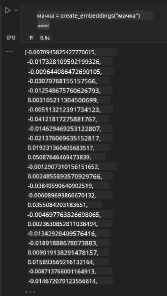

<!--
CO_OP_TRANSLATOR_METADATA:
{
  "original_hash": "e2861bbca91c0567ef32bc77fe054f9e",
  "translation_date": "2025-06-25T22:47:18+00:00",
  "source_file": "15-rag-and-vector-databases/README.md",
  "language_code": "sr"
}
-->
# Генерација уз помоћ претраживања (RAG) и векторске базе података

[](https://aka.ms/gen-ai-lesson15-gh?WT.mc_id=academic-105485-koreyst)

У лекцији о апликацијама за претрагу, укратко смо научили како да интегришемо сопствене податке у моделе великог језика (LLMs). У овој лекцији, детаљније ћемо се упознати са концептима интеграције ваших података у LLM апликацију, механизмима процеса и методама за складиштење података, укључујући уградње и текст.

> **Видео ускоро долази**

## Увод

У овој лекцији обрадићемо следеће:

- Увод у RAG, шта је то и зашто се користи у вештачкој интелигенцији (AI).

- Разумевање шта су векторске базе података и креирање једне за нашу апликацију.

- Практичан пример како интегрисати RAG у апликацију.

## Циљеви учења

Након завршетка ове лекције, бићете у могућности да:

- Објасните значај RAG у преузимању и обради података.

- Подесите RAG апликацију и интегришете ваше податке у LLM

- Ефективно интегришете RAG и векторске базе података у LLM апликације.

## Наш сценарио: побољшање наших LLMs са сопственим подацима

За ову лекцију, желимо да додамо сопствене белешке у едукативни стартуп, што омогућава четботу да добије више информација о различитим темама. Коришћењем бележака које имамо, ученици ће моћи боље да уче и разумеју различите теме, чиме ће им бити лакше да се припреме за испите. Да бисмо креирали наш сценарио, користићемо:

- `Azure OpenAI:` LLM који ћемо користити за креирање нашег четбота

- `AI for beginners' lesson on Neural Networks`: ово ће бити подаци на којима ћемо засновати наш LLM

- `Azure AI Search` и `Azure Cosmos DB:` векторска база података за складиштење наших података и креирање индекса за претрагу

Корисници ће моћи да креирају вежбе квизова из својих бележака, картице за ревизију и да их сумирају у концизне прегледе. Да бисмо започели, погледајмо шта је RAG и како функционише:

## Генерација уз помоћ претраживања (RAG)

Четбот који покреће LLM обрађује упите корисника да би генерисао одговоре. Дизајниран је да буде интерактиван и да се ангажује са корисницима на широком спектру тема. Међутим, његови одговори су ограничени на контекст који је обезбеђен и основне податке за обуку. На пример, знање GPT-4 је ограничено до септембра 2021, што значи да му недостаје знање о догађајима који су се десили након овог периода. Поред тога, подаци коришћени за обуку LLMs искључују поверљиве информације као што су личне белешке или приручник за производ компаније.

### Како функционишу RAGs (Генерација уз помоћ претраживања)


Претпоставимо да желите да поставите четбот који креира квизове из ваших бележака, биће вам потребна веза са базом знања. Овде RAG долази у помоћ. RAGs функционишу на следећи начин:

- **База знања:** Пре преузимања, ови документи морају бити унети и претходно обрађени, обично раздвајањем великих докумената на мање делове, претварањем у текстуалне уградње и складиштењем у базу података.

- **Упит корисника:** корисник поставља питање

- **Преузимање:** Када корисник постави питање, модел уградње преузима релевантне информације из наше базе знања како би пружио више контекста који ће бити укључен у упит.

- **Проширена генерација:** LLM побољшава свој одговор на основу преузетих података. То омогућава да одговор буде не само заснован на унапред обученим подацима већ и на релевантним информацијама из додатог контекста. Преузети подаци се користе за проширење одговора LLM-а. LLM затим враћа одговор на питање корисника.


Архитектура за RAGs се имплементира коришћењем трансформатора који се састоје од два дела: енкодера и декодера. На пример, када корисник постави питање, улазни текст се 'кодира' у векторе који хватају значење речи, а вектори се 'декодирају' у индекс нашег документа и генеришу нови текст на основу упита корисника. LLM користи и модел енкодера и декодера за генерисање излаза.

Два приступа приликом имплементације RAG према предложеном раду: [Генерација уз помоћ претраживања за задатке обраде природног језика који захтевају знање](https://arxiv.org/pdf/2005.11401.pdf?WT.mc_id=academic-105485-koreyst) су:

- **_RAG-Секвенца_** користећи преузете документе за предвиђање најбољег могућег одговора на упит корисника

- **RAG-Токен** користећи документе за генерисање следећег токена, а затим их преузимање за одговор на упит корисника

### Зашто бисте користили RAGs? 

- **Богатство информација:** обезбеђује да су текстуални одговори ажурирани и актуелни. Према томе, побољшава перформансе на задацима специфичним за домен приступом интерној бази знања.

- Смањује фабрикацију коришћењем **проверљивих података** у бази знања за пружање контекста упитима корисника.

- **Исплативост** јер су економичнији у поређењу са фино подешавањем LLM-а

## Креирање базе знања

Наша апликација је заснована на нашим личним подацима, тј. лекцији о неуронским мрежама у курикулуму AI за почетнике.

### Векторске базе података

Векторска база података, за разлику од традиционалних база података, је специјализована база података дизајнирана за складиштење, управљање и претрагу уграђених вектора. Она складишти нумеричке представе докумената. Раздвајање података на нумеричке уградње олакшава нашем AI систему разумевање и обраду података.

Уграђујемо наше уградње у векторске базе података јер LLMs имају ограничење броја токена које прихватају као улаз. Како не можете пренети целокупне уградње у LLM, мораћемо да их раздвојимо на делове и када корисник постави питање, уградње које су најсличније питању ће бити враћене заједно са упитом. Раздвајање такође смањује трошкове на броју токена који се преносе кроз LLM.

Неки популарни векторски базе података укључују Azure Cosmos DB, Clarifyai, Pinecone, Chromadb, ScaNN, Qdrant и DeepLake. Можете креирати модел Azure Cosmos DB користећи Azure CLI са следећом командом:

```bash
az login
az group create -n <resource-group-name> -l <location>
az cosmosdb create -n <cosmos-db-name> -r <resource-group-name>
az cosmosdb list-keys -n <cosmos-db-name> -g <resource-group-name>
```

### Од текста до уградње

Пре него што складиштимо наше податке, мораћемо да их претворимо у векторске уградње пре него што их складиштимо у базу података. Ако радите са великим документима или дугим текстовима, можете их раздвојити на основу упита које очекујете. Раздвајање се може урадити на нивоу реченице или на нивоу параграфа. Како раздвајање изводи значења из речи око њих, можете додати неки други контекст делу, на пример, додавањем наслова документа или укључивањем неког текста пре или после дела. Можете раздвојити податке на следећи начин:

```python
def split_text(text, max_length, min_length):
    words = text.split()
    chunks = []
    current_chunk = []

    for word in words:
        current_chunk.append(word)
        if len(' '.join(current_chunk)) < max_length and len(' '.join(current_chunk)) > min_length:
            chunks.append(' '.join(current_chunk))
            current_chunk = []

    # If the last chunk didn't reach the minimum length, add it anyway
    if current_chunk:
        chunks.append(' '.join(current_chunk))

    return chunks
```

Када их раздвојимо, можемо уградити наш текст користећи различите моделе уградње. Неки модели које можете користити укључују: word2vec, ada-002 од OpenAI, Azure Computer Vision и многе друге. Избор модела зависиће од језика које користите, типа садржаја који се кодира (текст/слике/аудио), величине улаза који може кодирати и дужине излаза уградње.

Пример уграђеног текста користећи OpenAI-јев `text-embedding-ada-002` модел је:


## Преузимање и векторска претрага

Када корисник постави питање, преузимач га претвара у вектор користећи кодер упита, затим претражује наш индекс претраге докумената за релевантне векторе у документу који су повезани са улазом. Када је завршено, претвара и улазни вектор и векторе докумената у текст и преноси их кроз LLM.

### Преузимање

Преузимање се дешава када систем покушава брзо пронаћи документе из индекса који задовољавају критеријуме претраге. Циљ преузимача је да добије документе који ће се користити за пружање контекста и заснивање LLM-а на вашим подацима.

Постоји неколико начина за извођење претраге унутар наше базе података, као што су:

- **Претрага по кључним речима** - користи се за текстуалне претраге

- **Семантичка претрага** - користи семантичко значење речи

- **Векторска претрага** - претвара документе из текста у векторске представе користећи моделе уградње. Преузимање ће се вршити упитом докумената чије су векторске представе најближе питању корисника.

- **Хибридна** - комбинација претраге по кључним речима и векторске претраге.

Изазов са преузимањем настаје када у бази података нема сличног одговора на упит, систем ће тада вратити најбоље информације које могу добити, међутим, можете користити тактике као што је постављање максималне удаљености за релевантност или коришћење хибридне претраге која комбинује и кључне речи и векторску претрагу. У овој лекцији користићемо хибридну претрагу, комбинацију и векторске и претраге по кључним речима. Складиштићемо наше податке у датафраму са колонама које садрже делове као и уградње.

### Векторска сличност

Преузимач ће претражити базу знања за уградње које су близу једна другој, најближи сусед, јер су то текстови који су слични. У сценарију када корисник постави упит, он се прво уграђује, а затим упоређује са сличним уградњама. Уобичајена мера која се користи за проналажење сличности различитих вектора је косинусна сличност која се заснива на углу између два вектора.

Можемо мерити сличност користећи друге алтернативе које можемо користити, као што је Евклидска удаљеност која је права линија између крајњих тачака вектора и скаларни производ који мери збир производа одговарајућих елемената два вектора.

### Индекс претраге

Када вршимо преузимање, мораћемо да изградимо индекс претраге за нашу базу знања пре него што извршимо претрагу. Индекс ће складиштити наше уградње и може брзо пронаћи најсличније делове чак и у великој бази података. Можемо креирати наш индекс локално користећи:

```python
from sklearn.neighbors import NearestNeighbors

embeddings = flattened_df['embeddings'].to_list()

# Create the search index
nbrs = NearestNeighbors(n_neighbors=5, algorithm='ball_tree').fit(embeddings)

# To query the index, you can use the kneighbors method
distances, indices = nbrs.kneighbors(embeddings)
```

### Поновно рангирање

Када упитате базу података, можда ћете морати да сортирате резултате од најрелевантнијих. LLM за поновно рангирање користи машинско учење за побољшање релевантности резултата претраге тако што их поређа од најрелевантнијих. Користећи Azure AI претрагу, поновно рангирање се аутоматски врши за вас користећи семантичко поновно рангирање. Пример како поновно рангирање функционише користећи најближе суседе:

```python
# Find the most similar documents
distances, indices = nbrs.kneighbors([query_vector])

index = []
# Print the most similar documents
for i in range(3):
    index = indices[0][i]
    for index in indices[0]:
        print(flattened_df['chunks'].iloc[index])
        print(flattened_df['path'].iloc[index])
        print(flattened_df['distances'].iloc[index])
    else:
        print(f"Index {index} not found in DataFrame")
```

## Спајање свега заједно

Последњи корак је додавање нашег LLM-а у мешавину да бисмо могли да добијемо одговоре који су засновани на нашим подацима. Можемо га имплементирати на следећи начин:

```python
user_input = "what is a perceptron?"

def chatbot(user_input):
    # Convert the question to a query vector
    query_vector = create_embeddings(user_input)

    # Find the most similar documents
    distances, indices = nbrs.kneighbors([query_vector])

    # add documents to query  to provide context
    history = []
    for index in indices[0]:
        history.append(flattened_df['chunks'].iloc[index])

    # combine the history and the user input
    history.append(user_input)

    # create a message object
    messages=[
        {"role": "system", "content": "You are an AI assistant that helps with AI questions."},
        {"role": "user", "content": history[-1]}
    ]

    # use chat completion to generate a response
    response = openai.chat.completions.create(
        model="gpt-4",
        temperature=0.7,
        max_tokens=800,
        messages=messages
    )

    return response.choices[0].message

chatbot(user_input)
```

## Евалуација наше апликације

### Метрички критеријуми евалуације

- Квалитет одговора, обезбеђивање да звучи природно, течно и људски

- Заснованост података: евалуација да ли је одговор потекао из достављених докумената

- Релевантност: евалуација да ли одговор одговара и повезан је са постављеним питањем

- Течност - да ли одговор има смисла граматички

## Корисни случајеви за коришћење RAG (Генерација уз помоћ претраживања) и векторских база података

Постоји много различитих случајева употребе где функције позива могу побољшати вашу апликацију, као што су:

- Питање и одговарање: заснивање података ваше компаније на чету који могу користити запослени за постављање питања.

- Системи препорука: где можете креирати систем који одговара најсличнијим вредностима нпр. филмови, ресторани и још много тога.

- Услуге четбота: можете складиштити историју чата и персонализовати разговор на основу података корисника.

- Претрага слика на основу векторских уградњи, корисна при препознавању слика и детекцији аномалија.

## Резиме

Обрадили смо основне области RAG од додавања наших података у апликацију, упита корисника и излаза. Да бисте поједноставили креирање RAG, можете користити оквире као што су Semanti Kernel, Langchain или Autogen.

## Задатак

Да бисте наставили учење о Генерацији уз помоћ претраживања (RAG) можете изградити:

- Изградите предњи део апликације користећи оквир по вашем избору

- Искористите оквир, било LangChain или Semantic Kernel, и поново креирајте вашу апликацију.

Честитамо на завршетку лекције 👏.

## Учење се не завршава овде, наставите путовање

Н

**Одрицање од одговорности**:  
Овај документ је преведен коришћењем AI услуге превођења [Co-op Translator](https://github.com/Azure/co-op-translator). Иако тежимо тачности, молимо вас да будете свесни да аутоматизовани преводи могу садржати грешке или нетачности. Оригинални документ на његовом изворном језику треба сматрати меродавним извором. За критичне информације, препоручује се професионални људски превод. Не сносимо одговорност за било каква неспоразума или погрешна тумачења која произилазе из употребе овог превода.