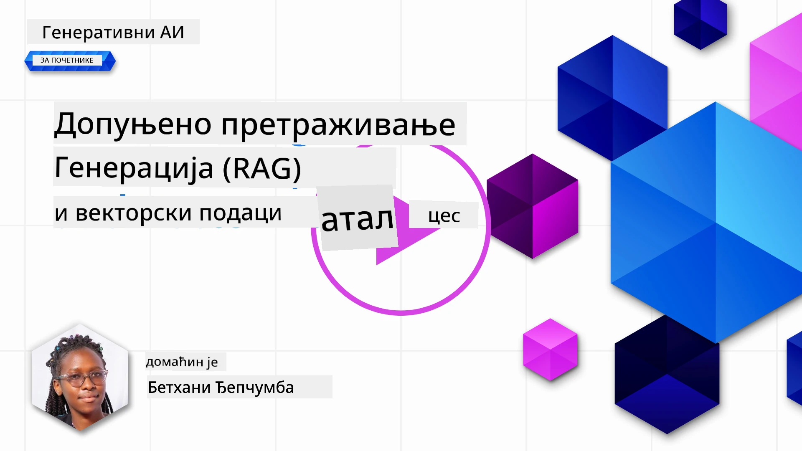
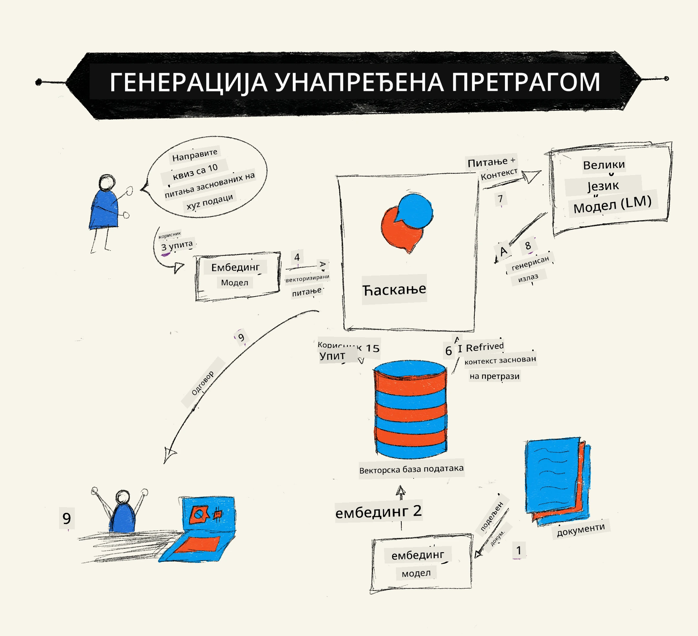
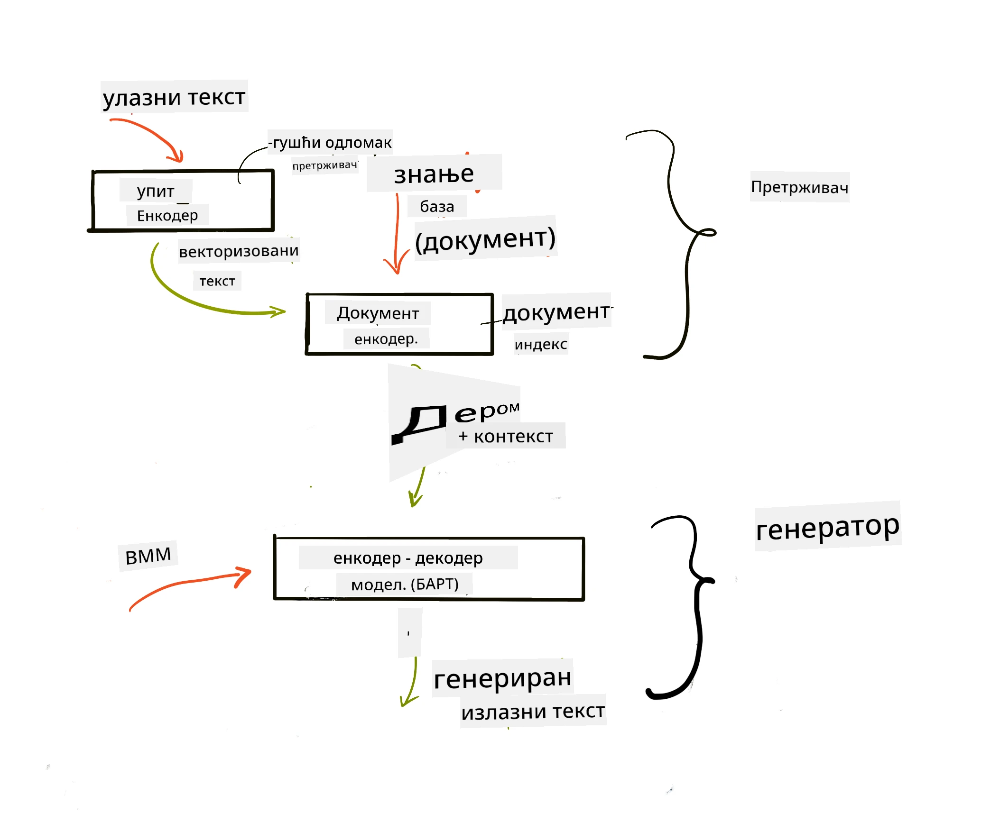
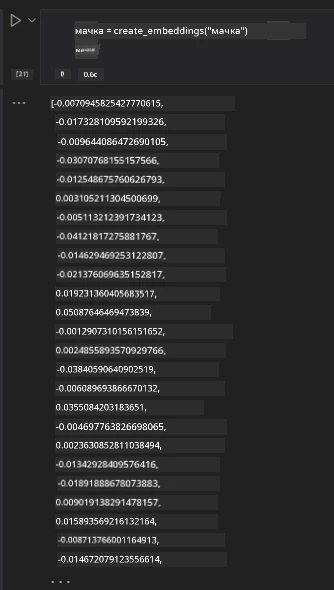

# Генерација проширена претрагом (RAG) и векторске базе података

[](https://youtu.be/4l8zhHUBeyI?si=BmvDmL1fnHtgQYkL)

У лекцији о апликацијама претраге укратко смо научили како интегрисати своје податке у велике језичке моделе (LLM). У овој лекцији ћемо детаљније разгледати концепте повезивања ваших података у апликацији на LLM, механизме процеса и методе за чување података, укључујући и уграђене векторе и текст.

> **Видео ускоро**

## Увод

У овој лекцији покрићемо следеће теме:

- Увод у RAG, шта је и зашто се користи у вештачкој интелигенцији.

- Разумевање шта су векторске базе података и како направити једну за нашу апликацију.

- Практичан пример како интегрисати RAG у апликацију.

## Циљеви учења

Након завршетка ове лекције, моћи ћете да:

- Објасните значај RAG у проналажењу и обрађивању података.

- Поставите RAG апликацију и повежете своје податке са LLM

- Ефикасно интегришете RAG и векторске базе података у LLM апликацијама.

## Наш сценарио: унапређење наших LLM-ова са сопственим подацима

За ову лекцију желимо да додамо сопствене белешке у образовни стартап, што омогућава чатботу да добије више информација о различитим предметима. Користећи белешке које поседујемо, ученици ће моћи боље да уче и разумеју различите теме, што олакшава припрему за испите. За креирање сценарија користићемо:

- `Azure OpenAI:` LLM који ћемо користити за креирање нашег чатбота

- `Лекција AI за почетнике о неуралним мрежама`: ово ће бити подаци на којима ћемо основати наш LLM

- `Azure AI Search` и `Azure Cosmos DB:` векторска база података за чување наших података и креирање претраживачког индекса

Корисници ће моћи да креирају вежбове из својих белешки, флаш картице за поновљене провере и сумирају их у концизне прегледе. Да почнемо, погледајмо шта је RAG и како функционише:

## Генерација проширена претрагом (RAG)

Чатбот покретан LLM обрађује корисничке упите да би генерисао одговоре. Дизајниран је да буде интерактиван и да пружа комуникацију са корисницима о широком спектру тема. Међутим, његови одговори су ограничени на контекст који је дат и основне податке на којима је обучен. На пример, GPT-4 сечење знања је септембар 2021, што значи да нема знање о догађајима који су се десили након тог периода. Поред тога, подаци који се користе за обучавање LLM не укључују поверљиве информације као што су личне белешке или приручник компаније.

### Како раде RAG (Генерација проширена претрагом)



Рецимо да желите да снимите чатбот који прави квизове из ваших бележака, тада ће вам требати повезаност са базом знања. Ту RAG долази као решење. RAG функционише на следећи начин:

- **База знања:** Пре претраге, ови документи морају бити унети и претходно обрађени, обично разбијањем великих докумената на мање делове, претварањем у угађене векторе текста и чувањем у базу података.

- **Кориснички упит:** корисник поставља питање

- **Претрада:** Када корисник постави питање, модел за уграђивање проналази релевантне информације из наше базе знања како би обезбедио додатни контекст који ће бити укључен у упит.

- **Проширена генерација:** LLM унапређује свој одговор на основу добијених података. Омогућава да генерисани одговор не буде заснован само на претходно обученим подацима већ и на релевантним информацијама из додатног контекста. Подаци добијени претрагом користе се за проширивање одговора LLM-а. Затим LLM враћа одговор на питање корисника.



Архитектура RAG се имплементира помоћу трансформера који се састоји из два дела: енкодера и декодера. На пример, када корисник постави питање, улазни текст се 'кодира' у векторе који хватају значење речи, а затим се вектори 'декодирају' у наш индекс документа и генеришу нови текст на основу корисничког упита. LLM користи модел енкодер-декодер за генерисање излаза.

Постоје два приступа за имплементацију RAG-а према предлошку рада: [Retrieval-Augmented Generation for Knowledge intensive NLP Tasks](https://arxiv.org/pdf/2005.11401.pdf?WT.mc_id=academic-105485-koreyst):

- **_RAG-Sequence_** користећи пронађене документе за предвиђање најбољег могућег одговора на кориснички упит

- **RAG-Token** користећи документе за генерисање следећег тока, а затим их користећи за одговор корисничком упиту

### Зашто користити RAG? 

- **Богатство информација:** осигурава да су текстуални одговори свежи и актуелни. Тако побољшава рад на задацима специфичним за одређене домене приступањем интерној бази знања.

- Смањује измишљање користећи **проверљиве податке** из базе знања како би обезбедио контекст за корисничке упите.

- **Економичан** јер је јефтинији у односу на детаљно подешавање LLM-а.

## Креирање базе знања

Наша апликација је заснована на нашим личним подацима, тј. лекцији о неуралним мрежама из курикулума AI за почетнике.

### Векторске базе података

Векторска база података, за разлику од традиционалних база, је специјализована база дизајнирана за чување, управљање и претрагу уграђених вектора. Чува нумеричке представке докумената. Разлагање података у нумеричке векторе олакшава нашем AI систему разумевање и обраду података.

Своје уграђене векторе чувамо у векторским базама јер LLM има ограничење броја токена које прихвата као улаз. Пошто не можете проследити целокупне уграђене векторе LLM-у, потребно их је разбити у делове, и када корисник постави питање, најсличнији уграђени вектори се враћају заједно са упитом. Разлагање такође смањује трошкове броја токена прослеђених LLM-у.

Неке популарне векторске базе укључују Azure Cosmos DB, Clarifyai, Pinecone, Chromadb, ScaNN, Qdrant и DeepLake. Можете креирати Azure Cosmos DB модел користећи Azure CLI са следећом командом:

```bash
az login
az group create -n <resource-group-name> -l <location>
az cosmosdb create -n <cosmos-db-name> -r <resource-group-name>
az cosmosdb list-keys -n <cosmos-db-name> -g <resource-group-name>
```

### Од текста до уграђених вектора

Пре него што сачувамо наше податке, морамо их претворити у векторе пре него што их буде могуће чувати у бази података. Ако радите са великим документима или дугачким текстовима, можете их разложити у делове на основу упита које очекујете. Разлагање може бити на нивоу реченице или пасуса. Пошто разлагање изводи значења из реченица око себе, можете додати још контекста делу, на пример додавањем наслова документа или укључивањем текста пре или после дела. Можете разложити податке на следећи начин:

```python
def split_text(text, max_length, min_length):
    words = text.split()
    chunks = []
    current_chunk = []

    for word in words:
        current_chunk.append(word)
        if len(' '.join(current_chunk)) < max_length and len(' '.join(current_chunk)) > min_length:
            chunks.append(' '.join(current_chunk))
            current_chunk = []

    # Ако последњи део није достигао минималну дужину, ипак га додајте
    if current_chunk:
        chunks.append(' '.join(current_chunk))

    return chunks
```

Када се разложи, можемо уградити свој текст користећи различите моделе за уграђивање. Неки модели које можете користити су: word2vec, ada-002 од OpenAI, Azure Computer Vision и многи други. Избор модела зависиће од језика који користите, типа садржаја који енкодујете (текст/слике/аудио), величине уноса који може да енкодује и дужине излаза уграђеног вектора.

Пример уграђеног текста коришћењем OpenAI `text-embedding-ada-002` модела је:


## Претрага и векторска претрага

Када корисник постави питање, претраживач га претвара у вектор користећи енкодер упита, а затим претражује наш индекс докумената за релевантне векторе у документу које су повезане са улазом. Када заврши, претвара и улазни и документе у текст и прослеђује их LLM-у.

### Претрага

Претрага се дешава када систем покушава брзо пронаћи документе из индекса који задовољавају критеријуме претраге. Циљ претраживача је да добије документе који ће се користити за пружање контекста и повезивање LLM-а са вашим подацима.

Постоји неколико начина за претрагу у нашој бази, као што су:

- **Претраживање кључних речи** - користи се за текстуалне претраге

- **Векторска претрага** - претвара документе из текста у векторске представке користећи моделе уграђивања, што омогућава **семантичку претрагу** користећи значење речи. Претрага ће се обављати претрагом докумената чије су векторске представке најближе корисничком питању.

- **Хибридна** - комбинација претраге по кључним речима и векторске претраге.

Изазов у претрази настаје када нема сличног одговора на упит у бази, систем ће вратити најбоље доступне информације. Међутим, можете користити тактике попут постављања максималне удаљености за релевантност или користити хибридну претрагу која комбинује обе врсте. У овој лекцији користићемо хибридну претрагу, комбинацију векторске и претраге по кључним речима. Чуваћемо податке у оквиру DataFrame-а са колонама које садрже делове као и уграђене векторе.

### Векторска сличност

Претраживач ће претраживати базу знања за уграђене векторе који су међусобно блиски, најближи сусед, јер су текстови слични. У сценарију када корисник постави упит, он се прво уграђује, а затим се упоређује са сличним уграђеним векторима. Честа мера која се користи за утврђивање сличности између вектора је косинусна сличност која се базира на углу између два вектора.

Можемо мерити сличност и другим алтернативама, као што су Евклидска удаљеност која је директна линија између крајњих тачака вектора и скаларни производ који мери збир производа одговарајућих елемената два вектора.

### Индекс претраге

При вршењу претраге морамо изградити индекс претраге за базу знања пре него што обавимо претрагу. Индекс чува наше уграђене векторе и може брзо да врати најсличније делове чак и у великој бази. Можемо креирати индекс локално користећи:

```python
from sklearn.neighbors import NearestNeighbors

embeddings = flattened_df['embeddings'].to_list()

# Креирајте индекс претраге
nbrs = NearestNeighbors(n_neighbors=5, algorithm='ball_tree').fit(embeddings)

# За упит индексa можете користити metodu kneighbors
distances, indices = nbrs.kneighbors(embeddings)
```

### Прераспоређивање ранга

Када упитате базу, можда ћете морати да сортирате резултате од најрелевантнијих према осталима. Реранкинг LLM користи машинско учење да побољша релевантност резултата претраге наређујући их по важности. У Azure AI Search прераспоређивање ранга се аутоматски обавља помоћу семантичког прераспоређивача. Пример како прераспоређивање функционише коришћењем најближих суседа:

```python
# Пронађите најсличније документе
distances, indices = nbrs.kneighbors([query_vector])

index = []
# Штампајте најсличније документе
for i in range(3):
    index = indices[0][i]
    for index in indices[0]:
        print(flattened_df['chunks'].iloc[index])
        print(flattened_df['path'].iloc[index])
        print(flattened_df['distances'].iloc[index])
    else:
        print(f"Index {index} not found in DataFrame")
```

## Све повезати заједно

Последњи корак је увођење нашег LLM-а да бисмо могли добијати одговоре засноване на нашим подацима. Можемо га имплементирати како следи:

```python
user_input = "what is a perceptron?"

def chatbot(user_input):
    # Претвори питање у вектор упита
    query_vector = create_embeddings(user_input)

    # Пронађи најсличније документе
    distances, indices = nbrs.kneighbors([query_vector])

    # додај документе упиту како би пружио контекст
    history = []
    for index in indices[0]:
        history.append(flattened_df['chunks'].iloc[index])

    # комбинуј историју и унос корисника
    history.append(user_input)

    # креирај објекат поруке
    messages=[
        {"role": "system", "content": "You are an AI assistant that helps with AI questions."},
        {"role": "user", "content": "\n\n".join(history) }
    ]

    # користи Responses API за генерисање одговора
    response = client.responses.create(
        model="gpt-4o-mini",
        temperature=0.7,
        max_output_tokens=800,
        input=messages,
        store=False,
    )

    return response.output_text

chatbot(user_input)
```

## Евалуација наше апликације

### Метрике евалуације

- Квалитет достављених одговора, осигуравајући да звуче природно, течносно и људски

- Повезаност података: процена да ли је одговор базиран на достављеним документима

- Релевантност: оценити да ли одговор одговара и има везу са постављеним питањем

- Течност - да ли одговор има граматички смисао

## Примери примене RAG и векторских база података

Постоји много различитих примена где позиви функција могу побољшати вашу апликацију, као што су:

- Питања и одговори: повезивање података ваше компаније са чатом који запослени могу користити за постављање питања.

- Системи препорука: где можете креирати систем који проналази најсличније вредности, нпр. филмове, ресторане и још много тога.

- Чатбот услуге: можете сачувати историју разговора и персонализовати конверзацију на основу корисничких података.

- Претрага слика заснована на векторским уграђеним векторима, корисна код препознавања слика и детекције аномалија.

## Резиме

Покрили смо основне области RAG, од додавања података у апликацију, корисничког упита до излаза. За поједностављење креирања RAG-а, можете користити оквире као што су Semantic Kernel, Langchain или Autogen.

## Задатак

Да бисте наставили учење о генерацији проширеној претрагом (RAG), можете направити:

- Креирајте фронтенд за апликацију користећи оквир по вашем избору

- Искористите оквир, било LangChain или Semantic Kernel, и поново направите вашу апликацију.

Честитамо на завршетку лекције 👏.

## Учење не престаје овде, наставите путовање

Након завршетка ове лекције, погледајте нашу [колекцију учења о генеративној вештачкој интелигенцији](https://aka.ms/genai-collection?WT.mc_id=academic-105485-koreyst) да бисте наставили да унапређујете своје знање о генеративној вештачкој интелигенцији!

---

<!-- CO-OP TRANSLATOR DISCLAIMER START -->
**Изјава о одрицању одговорности**:
Овај документ је преведен коришћењем услуге за аутоматски превод [Co-op Translator](https://github.com/Azure/co-op-translator). Иако тежимо тачности, имајте у виду да аутоматски преводи могу садржати грешке или нетачности. Оригинални документ на његовом изворном језику треба сматрати ауторитативним извором. За критичне информације препоручује се професионални људски превод. Нисмо одговорни за било каква неспоразума или погрешна тумачења која произилазе из коришћења овог превода.
<!-- CO-OP TRANSLATOR DISCLAIMER END -->