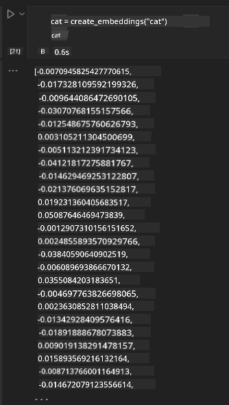

<!--
CO_OP_TRANSLATOR_METADATA:
{
  "original_hash": "b4b0266fbadbba7ded891b6485adc66d",
  "translation_date": "2025-10-18T01:19:52+00:00",
  "source_file": "15-rag-and-vector-databases/README.md",
  "language_code": "sr"
}
-->
# Генерисање уз помоћ претраживања (RAG) и векторске базе података

[](https://youtu.be/4l8zhHUBeyI?si=BmvDmL1fnHtgQYkL)

У лекцији о апликацијама за претраживање, укратко смо научили како да интегришемо сопствене податке у моделе великог језика (LLMs). У овој лекцији ћемо се детаљније позабавити концептима укључивања ваших података у апликацију засновану на LLM-у, механизмима процеса и методама за складиштење података, укључујући уграђене векторе и текст.

> **Видео ускоро**

## Увод

У овој лекцији обрадићемо следеће:

- Увод у RAG, шта је то и зашто се користи у вештачкој интелигенцији (AI).

- Разумевање шта су векторске базе података и креирање једне за нашу апликацију.

- Практичан пример како интегрисати RAG у апликацију.

## Циљеви учења

Након завршетка ове лекције, моћи ћете:

- Објаснити значај RAG-а у претраживању и обради података.

- Поставити RAG апликацију и укључити своје податке у LLM.

- Ефикасно интегрисати RAG и векторске базе података у LLM апликације.

## Наш сценарио: побољшање LLM-а сопственим подацима

У овој лекцији желимо да додамо сопствене белешке у стартап за образовање, што ће омогућити чет-боту да добије више информација о различитим темама. Користећи белешке које имамо, ученици ће моћи боље да уче и разумеју различите теме, што ће им олакшати припрему за испите. Да бисмо креирали наш сценарио, користићемо:

- `Azure OpenAI:` LLM који ћемо користити за креирање нашег чет-бота

- `Лекција за почетнике у AI о неуронским мрежама:` ово ће бити подаци на којима ћемо засновати наш LLM

- `Azure AI Search` и `Azure Cosmos DB:` векторска база података за складиштење наших података и креирање индекса за претрагу

Корисници ће моћи да креирају квизове за вежбање из својих белешки, картице за ревизију и да их сажму у концизне прегледе. Да бисмо започели, погледајмо шта је RAG и како функционише:

## Генерисање уз помоћ претраживања (RAG)

Чет-бот заснован на LLM-у обрађује упите корисника како би генерисао одговоре. Дизајниран је да буде интерактиван и да комуницира са корисницима о широком спектру тема. Међутим, његови одговори су ограничени на контекст који му је пружен и основне податке на којима је обучен. На пример, знање GPT-4 модела је ограничено на септембар 2021. године, што значи да му недостају информације о догађајима који су се догодили након тог периода. Поред тога, подаци који се користе за обуку LLM-а искључују поверљиве информације као што су личне белешке или приручник за производе компаније.

### Како функционишу RAG-ови (Генерисање уз помоћ претраживања)


Претпоставимо да желите да поставите чет-бот који креира квизове из ваших белешки, биће вам потребна веза са базом знања. Овде RAG долази у помоћ. RAG-ови функционишу на следећи начин:

- **База знања:** Пре претраживања, ови документи морају бити унети и претходно обрађени, обично се велики документи деле на мање делове, претварају у текстуалне уграђене векторе и складиште у базу података.

- **Кориснички упит:** корисник поставља питање.

- **Претраживање:** Када корисник постави питање, модел за уграђивање претражује релевантне информације из наше базе знања како би пружио више контекста који ће бити укључен у упит.

- **Генерисање уз помоћ претраживања:** LLM побољшава свој одговор на основу пронађених података. Омогућава да генерисани одговор буде заснован не само на унапред обученим подацима, већ и на релевантним информацијама из додатог контекста. Пронађени подаци се користе за побољшање одговора LLM-а. LLM затим враћа одговор на питање корисника.


Архитектура RAG-а се имплементира коришћењем трансформера који се састоје из два дела: енкодера и декодера. На пример, када корисник постави питање, улазни текст се 'кодира' у векторе који садрже значење речи, а вектори се 'декодирају' у наш индекс докумената и генеришу нови текст на основу корисничког упита. LLM користи модел енкодера-декодера за генерисање излаза.

Два приступа за имплементацију RAG-а, према предложеном раду: [Генерисање уз помоћ претраживања за NLP (обрада природног језика) задатке који захтевају знање](https://arxiv.org/pdf/2005.11401.pdf?WT.mc_id=academic-105485-koreyst) су:

- **_RAG-Sequence_** коришћење пронађених докумената за предвиђање најбољег могућег одговора на кориснички упит.

- **RAG-Token** коришћење докумената за генерисање следећег токена, а затим њихово претраживање ради одговора на кориснички упит.

### Зашто користити RAG-ове? 

- **Богатство информација:** обезбеђује да текстуални одговори буду ажурни и актуелни. Стога побољшава перформансе на задацима специфичним за одређене области приступајући интерној бази знања.

- Смањује фабрикацију користећи **проверљиве податке** из базе знања како би пружио контекст корисничким упитима.

- **Исплатив је** јер је економичнији у поређењу са фино подешавањем LLM-а.

## Креирање базе знања

Наша апликација је заснована на нашим личним подацима, тј. лекцији о неуронским мрежама из курикулума AI For Beginners.

### Векторске базе података

Векторска база података, за разлику од традиционалних база података, је специјализована база података дизајнирана за складиштење, управљање и претраживање уграђених вектора. Она складишти нумеричке репрезентације докумената. Разбијање података на нумеричке уграђене векторе олакшава нашем AI систему разумевање и обраду података.

Уграђене векторе складиштимо у векторске базе података јер LLM-ови имају ограничење у броју токена које прихватају као улаз. Пошто не можете проследити целокупне уграђене векторе LLM-у, мораћемо да их поделимо на делове, а када корисник постави питање, уграђени вектори који су најсличнији питању биће враћени заједно са упитом. Дељење такође смањује трошкове на броју токена који се прослеђују кроз LLM.

Неки популарни векторске базе података укључују Azure Cosmos DB, Clarifyai, Pinecone, Chromadb, ScaNN, Qdrant и DeepLake. Можете креирати Azure Cosmos DB модел користећи Azure CLI са следећом командом:

```bash
az login
az group create -n <resource-group-name> -l <location>
az cosmosdb create -n <cosmos-db-name> -r <resource-group-name>
az cosmosdb list-keys -n <cosmos-db-name> -g <resource-group-name>
```

### Од текста до уграђених вектора

Пре него што складиштимо наше податке, мораћемо да их претворимо у векторске уграђене векторе пре него што их складиштимо у базу података. Ако радите са великим документима или дугим текстовима, можете их поделити на делове на основу упита које очекујете. Дељење се може обавити на нивоу реченице или на нивоу пасуса. Како дељење извлачи значења из речи око њих, можете додати неки други контекст делу, на пример, додавањем наслова документа или укључивањем неког текста пре или после дела. Можете поделити податке на следећи начин:

```python
def split_text(text, max_length, min_length):
    words = text.split()
    chunks = []
    current_chunk = []

    for word in words:
        current_chunk.append(word)
        if len(' '.join(current_chunk)) < max_length and len(' '.join(current_chunk)) > min_length:
            chunks.append(' '.join(current_chunk))
            current_chunk = []

    # If the last chunk didn't reach the minimum length, add it anyway
    if current_chunk:
        chunks.append(' '.join(current_chunk))

    return chunks
```

Када поделите, можете уградити свој текст користећи различите моделе за уграђивање. Неки модели које можете користити укључују: word2vec, ada-002 од OpenAI, Azure Computer Vision и многе друге. Избор модела који ћете користити зависиће од језика који користите, типа садржаја који се кодира (текст/слике/аудио), величине улаза који може да кодира и дужине излазног уграђеног вектора.

Пример уграђеног текста користећи OpenAI-ов модел `text-embedding-ada-002` је:


## Претраживање и векторска претрага

Када корисник постави питање, претраживач га трансформише у вектор користећи енкодер упита, затим претражује кроз наш индекс докумената за релевантне векторе у документу који су повезани са улазом. Када заврши, претвара и улазни вектор и векторе докумената у текст и прослеђује их кроз LLM.

### Претраживање

Претраживање се дешава када систем покушава брзо да пронађе документе из индекса који задовољавају критеријуме претраге. Циљ претраживача је да пронађе документе који ће се користити за пружање контекста и укључивање LLM-а у ваше податке.

Постоји неколико начина за претраживање у нашој бази података као што су:

- **Претраживање кључних речи** - користи се за текстуалне претраге.

- **Семантичка претрага** - користи семантичко значење речи.

- **Векторска претрага** - претвара документе из текста у векторске репрезентације користећи моделе за уграђивање. Претраживање се врши упитом докумената чије су векторске репрезентације најближе корисничком питању.

- **Хибридна претрага** - комбинација претраге кључних речи и векторске претраге.

Изазов са претраживањем настаје када у бази података нема сличног одговора на упит, систем ће тада вратити најбоље информације које може да пронађе, међутим, можете користити тактике као што је постављање максималне удаљености за релевантност или коришћење хибридне претраге која комбинује претрагу кључних речи и векторску претрагу. У овој лекцији ћемо користити хибридну претрагу, комбинацију векторске и претраге кључних речи. Складиштићемо наше податке у dataframe са колонама које садрже делове текста као и уграђене векторе.

### Векторска сличност

Претраживач ће претраживати кроз базу знања за уграђене векторе који су блиски једни другима, најближи суседи, јер су то текстови који су слични. У случају да корисник постави упит, он се прво уграђује, а затим се упоређује са сличним уграђеним векторима. Уобичајена мера која се користи за утврђивање колико су различити вектори слични је косинусна сличност која се заснива на углу између два вектора.

Можемо мерити сличност користећи и друге алтернативе као што су Евклидово растојање, које представља праву линију између крајњих тачака вектора, и скаларни производ који мери збир производа одговарајућих елемената два вектора.

### Индекс претраге

Када вршимо претраживање, мораћемо да изградимо индекс претраге за нашу базу знања пре него што извршимо претрагу. Индекс ће складиштити наше уграђене векторе и моћи ће брзо да пронађе најсличније делове чак и у великој бази података. Можемо креирати наш индекс локално користећи:

```python
from sklearn.neighbors import NearestNeighbors

embeddings = flattened_df['embeddings'].to_list()

# Create the search index
nbrs = NearestNeighbors(n_neighbors=5, algorithm='ball_tree').fit(embeddings)

# To query the index, you can use the kneighbors method
distances, indices = nbrs.kneighbors(embeddings)
```

### Поновно рангирање

Када упитате базу података, можда ћете морати да сортирате резултате од најрелевантнијих. LLM за поновно рангирање користи машинско учење за побољшање релевантности резултата претраге тако што их ређа од најрелевантнијих. Користећи Azure AI Search, поновно рангирање се аутоматски обавља за вас користећи семантички поновни ранкер. Пример како поновно рангирање функционише користећи најближе суседе:

```python
# Find the most similar documents
distances, indices = nbrs.kneighbors([query_vector])

index = []
# Print the most similar documents
for i in range(3):
    index = indices[0][i]
    for index in indices[0]:
        print(flattened_df['chunks'].iloc[index])
        print(flattened_df['path'].iloc[index])
        print(flattened_df['distances'].iloc[index])
    else:
        print(f"Index {index} not found in DataFrame")
```

## Повезивање свега

Последњи корак је додавање нашег LLM-а у процес како бисмо могли да добијемо одговоре који су засновани на нашим подацима. Можемо га имплементирати на следећи начин:

```python
user_input = "what is a perceptron?"

def chatbot(user_input):
    # Convert the question to a query vector
    query_vector = create_embeddings(user_input)

    # Find the most similar documents
    distances, indices = nbrs.kneighbors([query_vector])

    # add documents to query  to provide context
    history = []
    for index in indices[0]:
        history.append(flattened_df['chunks'].iloc[index])

    # combine the history and the user input
    history.append(user_input)

    # create a message object
    messages=[
        {"role": "system", "content": "You are an AI assistant that helps with AI questions."},
        {"role": "user", "content": history[-1]}
    ]

    # use chat completion to generate a response
    response = openai.chat.completions.create(
        model="gpt-4",
        temperature=0.7,
        max_tokens=800,
        messages=messages
    )

    return response.choices[0].message

chatbot(user_input)
```

## Евалуација наше апликације

### Метрике евалуације

- Квалитет пружених одговора, осигуравајући да звуче природно, течно и људски.

- Заснованост података: процена да ли је одговор дошао из достављених докумената.

- Релевантност: процена да ли одговор одговара и повезан је са постављеним питањем.

- Течност - да ли одговор граматички има смисла.

## Примена RAG-а (Генерисање уз помоћ претраживања) и векторских база података

Постоји много различитих примена где функције позива могу побољшати вашу апликацију, као што су:

- Питања и одговори: заснивање података ваше компаније на чету који запослени могу користити за постављање питања.

- Системи препорука: где можете креирати систем који упоређује најсличније вредности, нпр. филмове, ресторане и још много тога.

- Услуге чет-бота: можете складиштити историју четова и персонализовати разговор на основу корисничких података.

- Претраживање слика засновано на уграђеним векторима, корисно када радите на препознавању слика и откривању аномалија.

## Резиме

Обрадили смо основне области RAG-а од додавања наших података у апликацију, корисничког упита и излаза. Да бисте поједноставили креирање RAG-а, можете користити оквире као што су Semantic Kernel, Langchain или Autogen.

## Задатак

Да настав

---

**Одрицање од одговорности**:  
Овај документ је преведен коришћењем услуге за превођење помоћу вештачке интелигенције [Co-op Translator](https://github.com/Azure/co-op-translator). Иако настојимо да обезбедимо тачност, молимо вас да имате у виду да аутоматски преводи могу садржати грешке или нетачности. Оригинални документ на његовом изворном језику треба сматрати меродавним извором. За критичне информације препоручује се професионални превод од стране људског преводиоца. Не преузимамо одговорност за било каква погрешна тумачења или неспоразуме који могу настати услед коришћења овог превода.