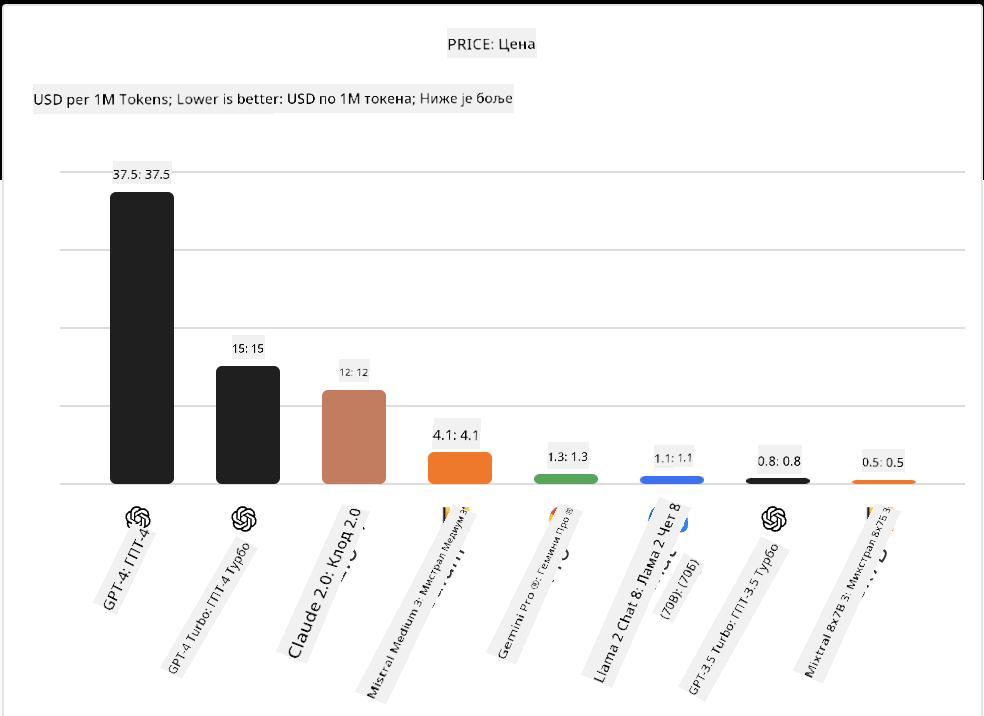
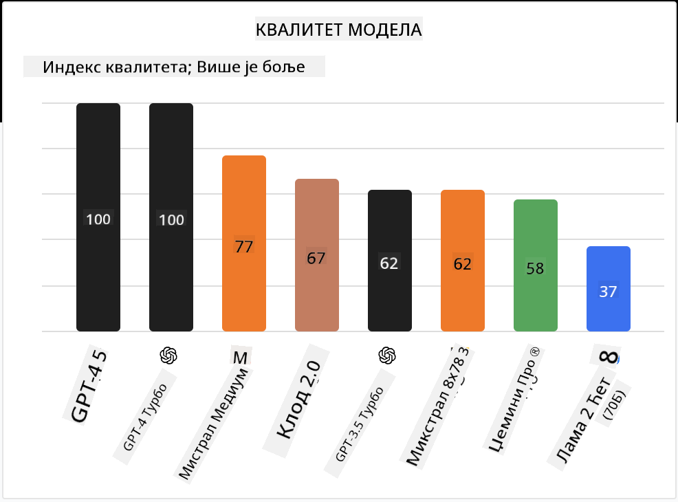

<!--
CO_OP_TRANSLATOR_METADATA:
{
  "original_hash": "0bba96e53ab841d99db731892a51fab8",
  "translation_date": "2025-07-09T17:15:32+00:00",
  "source_file": "16-open-source-models/README.md",
  "language_code": "sr"
}
-->

## Увод

Свет отворених LLM модела је узбудљив и стално се развија. Ова лекција има за циљ да пружи детаљан преглед отворених модела. Ако тражите информације о томе како се власнички модели упоређују са отвореним моделима, идите на лекцију ["Истраживање и упоређивање различитих LLM модела"](../02-exploring-and-comparing-different-llms/README.md?WT.mc_id=academic-105485-koreyst). Ова лекција ће такође обрадити тему фино подешавања, али детаљније објашњење можете пронаћи у лекцији ["Фино подешавање LLM модела"](../18-fine-tuning/README.md?WT.mc_id=academic-105485-koreyst).

## Циљеви учења

- Разумети отворене моделе
- Разумети предности рада са отвореним моделима
- Истражити отворене моделе доступне на Hugging Face и Azure AI Studio

## Шта су отворени модели?

Отворени софтвер има кључну улогу у развоју технологије у разним областима. Open Source Initiative (OSI) је дефинисао [10 критеријума за софтвер](https://web.archive.org/web/20241126001143/https://opensource.org/osd?WT.mc_id=academic-105485-koreyst) који се сматра отвореним. Изворни код мора бити јавно доступан под лиценцом коју одобри OSI.

Иако развој LLM модела има сличности са развојем софтвера, процес није потпуно исти. Ово је изазвало много дискусија у заједници о дефиницији отвореног кода у контексту LLM модела. Да би модел био у складу са традиционалном дефиницијом отвореног кода, следеће информације треба да буду јавно доступне:

- Скуп података коришћен за тренирање модела.
- Потпуни тежински параметри модела као део тренинга.
- Код за евалуацију.
- Код за фино подешавање.
- Потпуни тежински параметри и метрике тренинга.

Тренутно постоји само неколико модела који испуњавају ове критеријуме. [OLMo модел који је креирао Allen Institute for Artificial Intelligence (AllenAI)](https://huggingface.co/allenai/OLMo-7B?WT.mc_id=academic-105485-koreyst) је један од њих.

У овој лекцији ћемо моделе убудуће називати „отворени модели“, јер можда не испуњавају све наведене критеријуме у тренутку писања.

## Предности отворених модела

**Висока прилагодљивост** – Пошто се отворени модели објављују са детаљним информацијама о тренингу, истраживачи и програмери могу мењати унутрашње делове модела. Ово омогућава креирање веома специјализованих модела који су фино подешени за одређени задатак или област. Неки примери су генерисање кода, математичке операције и биологија.

**Цена** – Цена по токену за коришћење и имплементацију ових модела је нижа него код власничких модела. При изради апликација заснованих на генеративној вештачкој интелигенцији, важно је размотрити однос перформанси и цене у вашем конкретном случају.

  
Извор: Artificial Analysis

**Флексибилност** – Рад са отвореним моделима омогућава флексибилност у коришћењу различитих модела или њиховом комбиновaњу. Пример за то су [HuggingChat асистенти](https://huggingface.co/chat?WT.mc_id=academic-105485-koreyst) где корисник може директно у корисничком интерфејсу изабрати модел који жели да користи:

## Истраживање различитих отворених модела

### Llama 2

[LLama2](https://huggingface.co/meta-llama?WT.mc_id=academic-105485-koreyst), који је развио Meta, је отворени модел оптимизован за апликације засноване на ћаскању. То је због његове методе фино подешавања која укључује велики број дијалога и људских повратних информација. Овим приступом модел даје резултате који су више у складу са људским очекивањима, што побољшава корисничко искуство.

Неки примери фино подешених верзија Llama модела су [Japanese Llama](https://huggingface.co/elyza/ELYZA-japanese-Llama-2-7b?WT.mc_id=academic-105485-koreyst), који је специјализован за јапански језик, и [Llama Pro](https://huggingface.co/TencentARC/LLaMA-Pro-8B?WT.mc_id=academic-105485-koreyst), који је унапређена верзија основног модела.

### Mistral

[Mistral](https://huggingface.co/mistralai?WT.mc_id=academic-105485-koreyst) је отворени модел са снажним фокусом на високе перформансе и ефикасност. Користи приступ Mixture-of-Experts који комбинује групу специјализованих експертских модела у један систем, где се у зависности од улаза бирају одређени модели за коришћење. Ово чини израчунавање ефикаснијим јер модели обрађују само оне улазе за које су специјализовани.

Неки примери фино подешених верзија Mistral модела су [BioMistral](https://huggingface.co/BioMistral/BioMistral-7B?text=Mon+nom+est+Thomas+et+mon+principal?WT.mc_id=academic-105485-koreyst), који је фокусиран на медицинску област, и [OpenMath Mistral](https://huggingface.co/nvidia/OpenMath-Mistral-7B-v0.1-hf?WT.mc_id=academic-105485-koreyst), који изводи математичке прорачуне.

### Falcon

[Falcon](https://huggingface.co/tiiuae?WT.mc_id=academic-105485-koreyst) је LLM који је креирао Technology Innovation Institute (**TII**). Falcon-40B је трениран на 40 милијарди параметара и показује боље перформансе од GPT-3 уз мање трошкове рачунања. То је могуће захваљујући коришћењу FlashAttention алгоритма и multiquery attention механизму који смањују захтеве за меморијом током извођења. Са скраћеним временом извођења, Falcon-40B је погодан за апликације засноване на ћаскању.

Неки примери фино подешених верзија Falcon модела су [OpenAssistant](https://huggingface.co/OpenAssistant/falcon-40b-sft-top1-560?WT.mc_id=academic-105485-koreyst), асистент базиран на отвореним моделима, и [GPT4ALL](https://huggingface.co/nomic-ai/gpt4all-falcon?WT.mc_id=academic-105485-koreyst), који пружа боље перформансе од основног модела.

## Како изабрати

Не постоји један прави одговор за избор отвореног модела. Добар почетак је коришћење функције филтрирања по задатку у Azure AI Studio-у. Ово ће вам помоћи да разумете за које типове задатака је модел трениран. Hugging Face такође одржава LLM табелу лидера која приказује најбоље моделе по одређеним метрикама.

Када желите да упоредите LLM моделе различитих типова, [Artificial Analysis](https://artificialanalysis.ai/?WT.mc_id=academic-105485-koreyst) је још један одличан извор:

  
Извор: Artificial Analysis

Ако радите на специфичном случају употребе, претраживање фино подешених верзија које су фокусиране на исту област може бити ефикасно. Испробавање више отворених модела да бисте видели како се понашају у складу са вашим и очекивањима корисника је такође добра пракса.

## Следећи кораци

Најбоља ствар код отворених модела је што можете брзо почети да радите са њима. Погледајте [Azure AI Studio Model Catalog](https://ai.azure.com?WT.mc_id=academic-105485-koreyst), који садржи посебну Hugging Face колекцију са моделима које смо овде поменули.

## Учење овде не престаје, наставите путовање

Након завршетка ове лекције, погледајте нашу [Generative AI Learning колекцију](https://aka.ms/genai-collection?WT.mc_id=academic-105485-koreyst) и наставите да унапређујете своје знање о генеративној вештачкој интелигенцији!

**Одрицање од одговорности**:  
Овај документ је преведен коришћењем AI услуге за превођење [Co-op Translator](https://github.com/Azure/co-op-translator). Иако се трудимо да превод буде тачан, молимо вас да имате у виду да аутоматски преводи могу садржати грешке или нетачности. Оригинални документ на његовом изворном језику треба сматрати ауторитетним извором. За критичне информације препоручује се професионални људски превод. Нисмо одговорни за било каква неспоразума или погрешна тумачења која произилазе из коришћења овог превода.