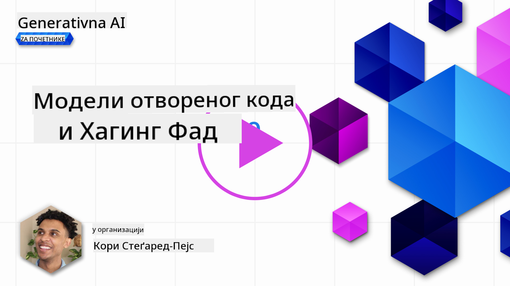
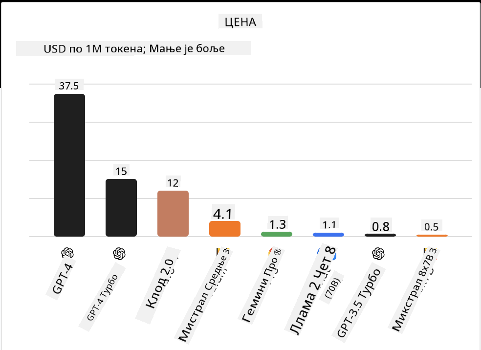
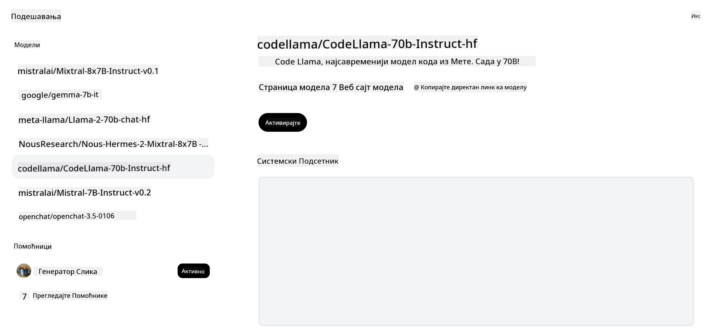

<!--
CO_OP_TRANSLATOR_METADATA:
{
  "original_hash": "0bba96e53ab841d99db731892a51fab8",
  "translation_date": "2025-05-20T07:04:40+00:00",
  "source_file": "16-open-source-models/README.md",
  "language_code": "sr"
}
-->

## Uvod

Svet otvorenih LLM-ova je uzbudljiv i stalno se razvija. Ova lekcija ima za cilj da pruži detaljan uvid u modele otvorenog koda. Ako tražite informacije o tome kako se vlasnički modeli upoređuju sa modelima otvorenog koda, idite na lekciju ["Istraživanje i upoređivanje različitih LLM-ova"](../02-exploring-and-comparing-different-llms/README.md?WT.mc_id=academic-105485-koreyst). Ova lekcija će takođe pokriti temu fino podešavanja, ali detaljnije objašnjenje može se pronaći u lekciji ["Fino podešavanje LLM-ova"](../18-fine-tuning/README.md?WT.mc_id=academic-105485-koreyst).

## Ciljevi učenja

- Steknite razumevanje modela otvorenog koda
- Razumevanje prednosti rada sa modelima otvorenog koda
- Istraživanje dostupnih otvorenih modela na Hugging Face-u i Azure AI Studiju

## Šta su modeli otvorenog koda?

Softver otvorenog koda je odigrao ključnu ulogu u razvoju tehnologije u različitim oblastima. Inicijativa za otvoreni kod (OSI) je definisala [10 kriterijuma za softver](https://web.archive.org/web/20241126001143/https://opensource.org/osd?WT.mc_id=academic-105485-koreyst) da bi se klasifikovao kao otvoreni kod. Izvorni kod mora biti otvoreno deljen pod licencom koju je odobrila OSI.

Iako razvoj LLM-ova ima slične elemente kao razvoj softvera, proces nije potpuno isti. To je izazvalo mnogo diskusija u zajednici o definiciji otvorenog koda u kontekstu LLM-ova. Da bi model bio usklađen sa tradicionalnom definicijom otvorenog koda, sledeće informacije bi trebalo da budu javno dostupne:

- Skupovi podataka korišćeni za obuku modela.
- Puna težina modela kao deo obuke.
- Kod za evaluaciju.
- Kod za fino podešavanje.
- Puna težina modela i metričke vrednosti obuke.

Trenutno postoji samo nekoliko modela koji ispunjavaju ove kriterijume. [OLMo model koji je kreirao Allen Institute for Artificial Intelligence (AllenAI)](https://huggingface.co/allenai/OLMo-7B?WT.mc_id=academic-105485-koreyst) je jedan koji se uklapa u ovu kategoriju.

Za ovu lekciju, referisaćemo se na modele kao "otvoreni modeli" jer možda ne ispunjavaju gore navedene kriterijume u vreme pisanja.

## Prednosti otvorenih modela

**Visoko prilagodljiv** - Pošto su otvoreni modeli objavljeni sa detaljnim informacijama o obuci, istraživači i programeri mogu modifikovati unutrašnjost modela. To omogućava kreiranje visoko specijalizovanih modela koji su fino podešeni za određeni zadatak ili oblast istraživanja. Neki primeri toga su generisanje koda, matematičke operacije i biologija.

**Trošak** - Trošak po tokenu za korišćenje i implementaciju ovih modela je niži nego kod vlasničkih modela. Kada gradite aplikacije generativne AI, treba obratiti pažnju na performanse u odnosu na cenu kada radite sa ovim modelima za vaš slučaj upotrebe.

Izvor: Artificial Analysis

**Fleksibilnost** - Rad sa otvorenim modelima omogućava vam fleksibilnost u smislu korišćenja različitih modela ili njihovog kombinovanja. Primer toga je [HuggingChat Assistants](https://huggingface.co/chat?WT.mc_id=academic-105485-koreyst) gde korisnik može direktno u korisničkom interfejsu izabrati model koji se koristi:

## Istraživanje različitih otvorenih modela

### Llama 2

[LLama2](https://huggingface.co/meta-llama?WT.mc_id=academic-105485-koreyst), razvijen od strane Meta, je otvoreni model koji je optimizovan za aplikacije zasnovane na čatu. To je zbog njegove metode fino podešavanja, koja je uključivala veliku količinu dijaloga i povratne informacije od ljudi. Sa ovom metodom, model proizvodi više rezultata koji su usklađeni sa očekivanjima ljudi, što pruža bolje korisničko iskustvo.

Neki primeri fino podešenih verzija Llama uključuju [Japanese Llama](https://huggingface.co/elyza/ELYZA-japanese-Llama-2-7b?WT.mc_id=academic-105485-koreyst), koji se specijalizuje za japanski i [Llama Pro](https://huggingface.co/TencentARC/LLaMA-Pro-8B?WT.mc_id=academic-105485-koreyst), koji je poboljšana verzija osnovnog modela.

### Mistral

[Mistral](https://huggingface.co/mistralai?WT.mc_id=academic-105485-koreyst) je otvoreni model sa jakim fokusom na visoke performanse i efikasnost. Koristi pristup Mešavine eksperata koji kombinuje grupu specijalizovanih ekspertskih modela u jedan sistem gde se, u zavisnosti od ulaza, biraju određeni modeli koji će se koristiti. To čini računanje efikasnijim jer modeli obrađuju samo ulaze u kojima su specijalizovani.

Neki primeri fino podešenih verzija Mistral uključuju [BioMistral](https://huggingface.co/BioMistral/BioMistral-7B?text=Mon+nom+est+Thomas+et+mon+principal?WT.mc_id=academic-105485-koreyst), koji je fokusiran na medicinsku oblast i [OpenMath Mistral](https://huggingface.co/nvidia/OpenMath-Mistral-7B-v0.1-hf?WT.mc_id=academic-105485-koreyst), koji obavlja matematičke proračune.

### Falcon

[Falcon](https://huggingface.co/tiiuae?WT.mc_id=academic-105485-koreyst) je LLM kreiran od strane Instituta za tehnološke inovacije (**TII**). Falcon-40B je treniran na 40 milijardi parametara, što se pokazalo da performira bolje od GPT-3 sa manjim budžetom za računanje. To je zbog korišćenja FlashAttention algoritma i multiquery pažnje koja omogućava smanjenje zahteva za memorijom u vreme inferencije. Sa smanjenim vremenom inferencije, Falcon-40B je pogodan za aplikacije za čat.

Neki primeri fino podešenih verzija Falcon-a su [OpenAssistant](https://huggingface.co/OpenAssistant/falcon-40b-sft-top1-560?WT.mc_id=academic-105485-koreyst), asistent izgrađen na otvorenim modelima i [GPT4ALL](https://huggingface.co/nomic-ai/gpt4all-falcon?WT.mc_id=academic-105485-koreyst), koji pruža bolje performanse od osnovnog modela.

## Kako izabrati

Ne postoji jedan odgovor za izbor otvorenog modela. Dobar početak je korišćenje funkcije filtriranja po zadatku u Azure AI Studiju. To će vam pomoći da razumete za koje vrste zadataka je model treniran. Hugging Face takođe održava LLM Leaderboard koji vam pokazuje najbolje performansne modele na osnovu određenih metrika.

Kada želite da uporedite LLM-ove između različitih tipova, [Artificial Analysis](https://artificialanalysis.ai/?WT.mc_id=academic-105485-koreyst) je još jedan odličan resurs:

Izvor: Artifical Analysis

Ako radite na specifičnom slučaju upotrebe, pretraga fino podešenih verzija koje su fokusirane na istu oblast može biti efikasna. Eksperimentisanje sa više otvorenih modela da biste videli kako performiraju prema vašim i očekivanjima vaših korisnika je još jedna dobra praksa.

## Sledeći koraci

Najbolji deo kod otvorenih modela je što možete brzo početi da radite sa njima. Pogledajte [Azure AI Studio Model Catalog](https://ai.azure.com?WT.mc_id=academic-105485-koreyst), koji sadrži specifičnu kolekciju Hugging Face modela koje smo ovde diskutovali.

## Učenje se ne zaustavlja ovde, nastavite putovanje

Nakon završetka ove lekcije, pogledajte našu [Generative AI Learning collection](https://aka.ms/genai-collection?WT.mc_id=academic-105485-koreyst) da nastavite sa unapređivanjem svog znanja o Generativnoj AI!

**Одрицање од одговорности**:  
Овај документ је преведен користећи услугу за превођење путем вештачке интелигенције [Co-op Translator](https://github.com/Azure/co-op-translator). Иако се трудимо да обезбедимо тачност, молимо вас да будете свесни да аутоматизовани преводи могу садржати грешке или нетачности. Оригинални документ на његовом изворном језику треба сматрати меродавним извором. За критичне информације, препоручује се професионални превод од стране људи. Не сносимо одговорност за било каква погрешна тумачења или неспоразуме који могу настати услед коришћења овог превода.