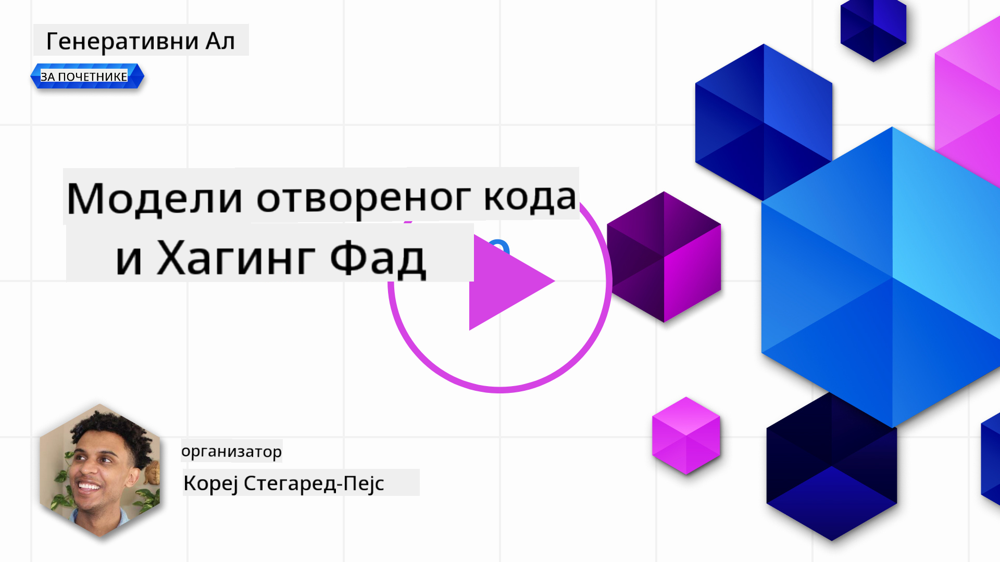
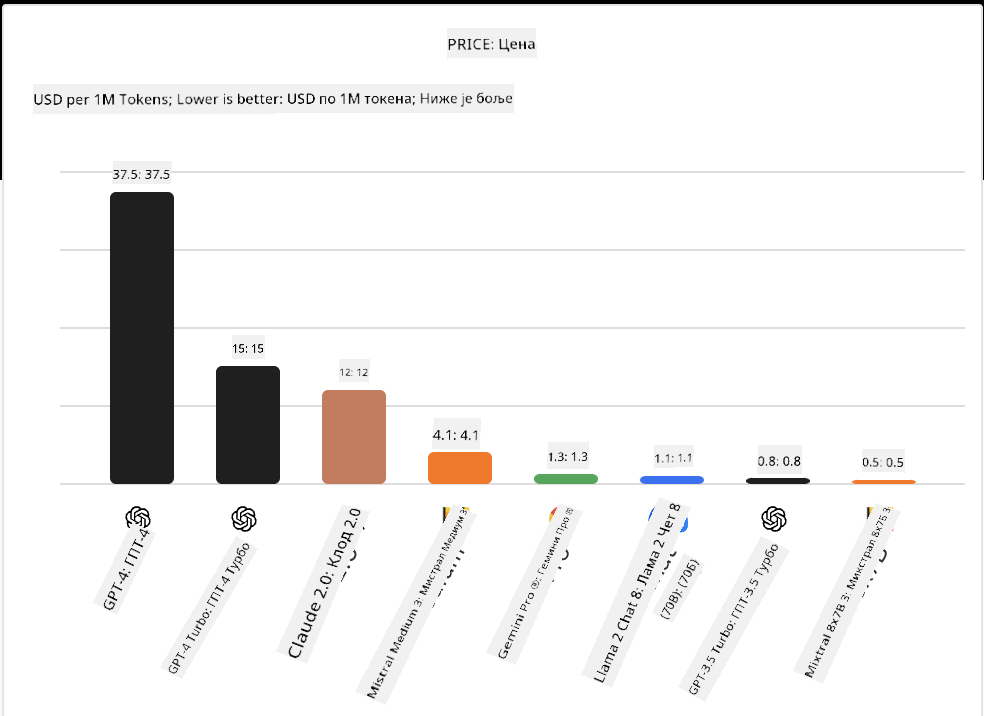
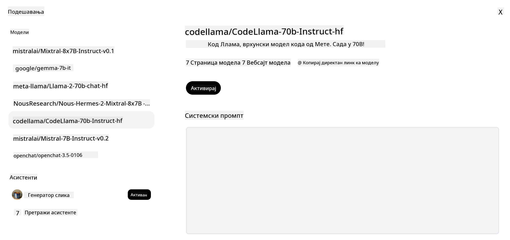
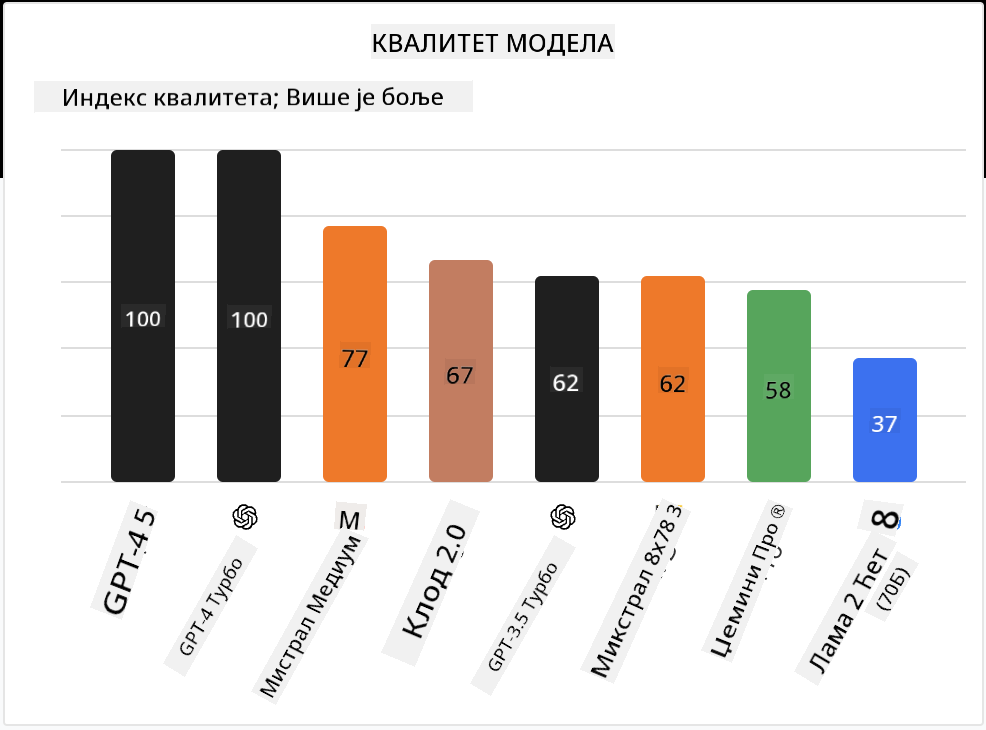

<!--
CO_OP_TRANSLATOR_METADATA:
{
  "original_hash": "0bba96e53ab841d99db731892a51fab8",
  "translation_date": "2025-06-26T00:04:36+00:00",
  "source_file": "16-open-source-models/README.md",
  "language_code": "sr"
}
-->

## Увод

Свет отворених LLM-ова је узбудљив и стално се развија. Ова лекција има за циљ да пружи детаљан поглед на моделе отвореног кода. Ако тражите информације о томе како се власнички модели упоређују са моделима отвореног кода, идите на лекцију ["Истраживање и поређење различитих LLM-ова"](../02-exploring-and-comparing-different-llms/README.md?WT.mc_id=academic-105485-koreyst). Ова лекција ће такође обрадити тему фино подешавања, али детаљније објашњење можете наћи у лекцији ["Фино подешавање LLM-ова"](../18-fine-tuning/README.md?WT.mc_id=academic-105485-koreyst).

## Циљеви учења

- Стећи разумевање модела отвореног кода
- Разумети предности рада са моделима отвореног кода
- Истражити доступне отворене моделе на Hugging Face и Azure AI студију

## Шта су модели отвореног кода?

Софтвер отвореног кода играо је кључну улогу у развоју технологије у различитим областима. Open Source Initiative (OSI) је дефинисао [10 критеријума за софтвер](https://web.archive.org/web/20241126001143/https://opensource.org/osd?WT.mc_id=academic-105485-koreyst) који се класификује као отворен. Изворни код мора бити отворено подељен под лиценцом коју је одобрио OSI.

Иако развој LLM-ова има сличне елементе као развој софтвера, процес није баш исти. Ово је донело много дискусија у заједници о дефиницији отвореног кода у контексту LLM-ова. Да би модел био усклађен са традиционалном дефиницијом отвореног кода, следеће информације би требало да буду јавно доступне:

- Скуп података коришћен за обуку модела.
- Пуне тежине модела као део обуке.
- Код за евалуацију.
- Код за фино подешавање.
- Пуне тежине модела и метрике обуке.

Тренутно постоји само неколико модела који испуњавају овај критеријум. [OLMo модел креиран од стране Allen Institute for Artificial Intelligence (AllenAI)](https://huggingface.co/allenai/OLMo-7B?WT.mc_id=academic-105485-koreyst) је један који се уклапа у ову категорију.

За ову лекцију, моделе ћемо називати "отворени модели" у будућности, јер можда неће испуњавати горе наведене критеријуме у време писања.

## Предности отворених модела

**Високо прилагодљиви** - Пошто су отворени модели објављени са детаљним информацијама о обуци, истраживачи и програмери могу да модификују унутрашњост модела. Ово омогућава креирање високо специјализованих модела који су фино подешени за одређени задатак или област студија. Неки примери овога су генерисање кода, математичке операције и биологија.

**Трошак** - Цена по токену за коришћење и примену ових модела је нижа него код власничких модела. Када градите апликације за генеративну вештачку интелигенцију, треба размотрити перформансе у односу на цену када радите са овим моделима на вашем случају употребе.

  
Извор: Вештачка анализа

**Флексибилност** - Рад са отвореним моделима омогућава вам да будете флексибилни у погледу коришћења различитих модела или њиховог комбиновања. Пример овога су [HuggingChat Асистенти](https://huggingface.co/chat?WT.mc_id=academic-105485-koreyst) где корисник може директно у корисничком интерфејсу изабрати модел који се користи:

## Истраживање различитих отворених модела

### Llama 2

[LLama2](https://huggingface.co/meta-llama?WT.mc_id=academic-105485-koreyst), развијен од стране Meta је отворен модел оптимизован за апликације засноване на чету. Ово је захваљујући његовом методу фино подешавања, који је укључивао велику количину дијалога и људских повратних информација. Са овим методом, модел производи више резултата који су у складу са очекивањима људи, што пружа боље корисничко искуство.

Неки примери фино подешаних верзија Llama укључују [Japanese Llama](https://huggingface.co/elyza/ELYZA-japanese-Llama-2-7b?WT.mc_id=academic-105485-koreyst), који је специјализован за јапански и [Llama Pro](https://huggingface.co/TencentARC/LLaMA-Pro-8B?WT.mc_id=academic-105485-koreyst), који је унапређена верзија основног модела.

### Mistral

[Mistral](https://huggingface.co/mistralai?WT.mc_id=academic-105485-koreyst) је отворен модел са снажним фокусом на високе перформансе и ефикасност. Користи приступ Mixture-of-Experts који комбинује групу специјализованих експертских модела у један систем где се у зависности од улаза, одређени модели бирају за коришћење. Ово чини рачунање ефикаснијим јер модели обрађују само улазе у којима су специјализовани.

Неки примери фино подешаних верзија Mistral укључују [BioMistral](https://huggingface.co/BioMistral/BioMistral-7B?text=Mon+nom+est+Thomas+et+mon+principal?WT.mc_id=academic-105485-koreyst), који је фокусиран на медицинску област и [OpenMath Mistral](https://huggingface.co/nvidia/OpenMath-Mistral-7B-v0.1-hf?WT.mc_id=academic-105485-koreyst), који изводи математичке прорачуне.

### Falcon

[Falcon](https://huggingface.co/tiiuae?WT.mc_id=academic-105485-koreyst) је LLM креиран од стране Института за технолошке иновације (**TII**). Falcon-40B је обучен на 40 милијарди параметара и показао је боље перформансе од GPT-3 са мањим буџетом за рачунање. Ово је захваљујући коришћењу алгоритма FlashAttention и мултикуери пажње који му омогућавају да смањи захтеве за меморијом у време инференције. Са овим смањеним временом инференције, Falcon-40B је погодан за чет апликације.

Неки примери фино подешаних верзија Falcon су [OpenAssistant](https://huggingface.co/OpenAssistant/falcon-40b-sft-top1-560?WT.mc_id=academic-105485-koreyst), асистент изграђен на отвореним моделима и [GPT4ALL](https://huggingface.co/nomic-ai/gpt4all-falcon?WT.mc_id=academic-105485-koreyst), који пружа веће перформансе од основног модела.

## Како изабрати

Не постоји један одговор за избор отвореног модела. Добро место за почетак је коришћење Azure AI Studio-ове функције филтрирања по задатку. Ово ће вам помоћи да разумете за које врсте задатака је модел обучен. Hugging Face такође одржава LLM табелу лидера која вам показује најбоље моделе на основу одређених метрика.

Када желите да упоредите LLM-ове различитих типова, [Вештачка анализа](https://artificialanalysis.ai/?WT.mc_id=academic-105485-koreyst) је још један одличан ресурс:

  
Извор: Вештачка анализа

Ако радите на одређеном случају употребе, тражење фино подешаних верзија које су фокусиране на исту област може бити ефикасно. Експериментисање са више отворених модела да видите како се понашају у складу са вашим и очекивањима ваших корисника је још једна добра пракса.

## Следећи кораци

Најбољи део о отвореним моделима је да можете брзо почети да радите са њима. Погледајте [Azure AI Studio Каталог модела](https://ai.azure.com?WT.mc_id=academic-105485-koreyst), који садржи специфичну колекцију Hugging Face са овим моделима о којима смо разговарали овде.

## Учење се не завршава овде, наставите путовање

Након завршетка ове лекције, погледајте нашу [колекцију учења о генеративној вештачкој интелигенцији](https://aka.ms/genai-collection?WT.mc_id=academic-105485-koreyst) да наставите са унапређивањем свог знања о генеративној вештачкој интелигенцији!

**Одрицање од одговорности**:  
Овај документ је преведен користећи услугу за превођење вештачке интелигенције [Co-op Translator](https://github.com/Azure/co-op-translator). Иако се трудимо да будемо прецизни, молимо вас да будете свесни да аутоматизовани преводи могу садржати грешке или нетачности. Оригинални документ на његовом изворном језику треба сматрати ауторитативним извором. За критичне информације, препоручује се професионални превод од стране људи. Нисмо одговорни за било каква погрешна тумачења или неспоразуме који произилазе из коришћења овог превода.