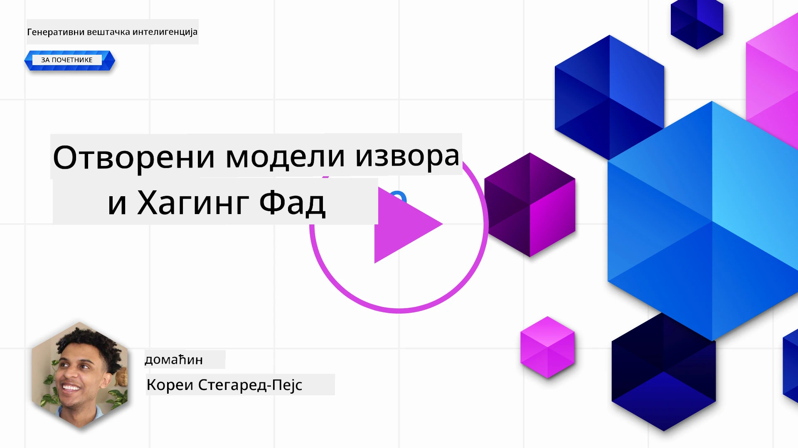
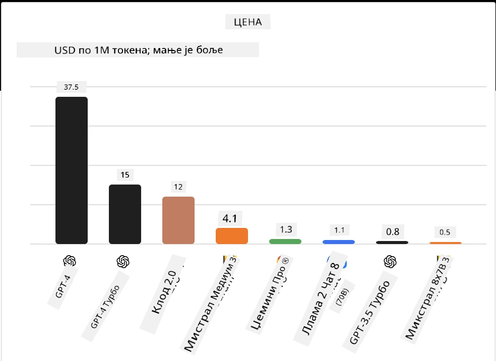
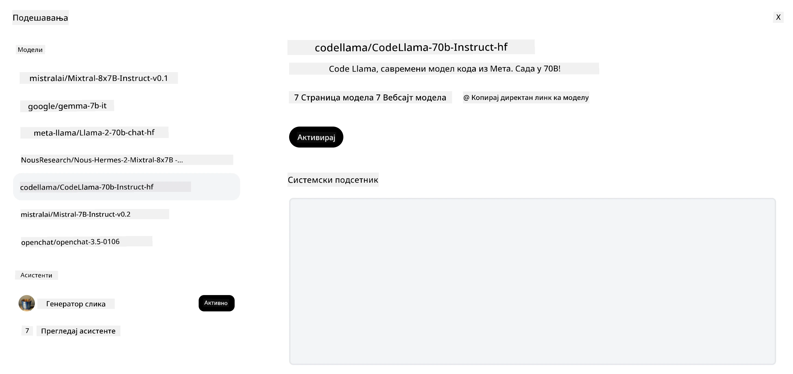

## Увод

Свет отворених LLM модела је узбудљив и стално се мења. Ова лекција има за циљ да пружи детаљан преглед отворених модела. Ако тражите информације о томе како се власнички модели упоређују са отвореним моделима, погледајте [лекцију „Истраживање и упоређивање различитих LLM“](../02-exploring-and-comparing-different-llms/README.md?WT.mc_id=academic-105485-koreyst). Ова лекција ће такође обрадити тему фајн-тунинга, али детаљније објашњење може се наћи у [лекцији „Фајн-тунинг LLM“](../18-fine-tuning/README.md?WT.mc_id=academic-105485-koreyst).

## Циљеви учења

- Стекните разумевање о отвореним моделима
- Разумевање предности рада са отвореним моделима
- Истраживање отворених модела доступних на Hugging Face и Microsoft Foundry каталогу модела

## Шта су отворени модели?

Отворени софтвер је одиграо кључну улогу у развоју технологије у различитим областима. Open Source Initiative (OSI) је дефинисао [10 критеријума за софтвер](https://web.archive.org/web/20241126001143/https://opensource.org/osd?WT.mc_id=academic-105485-koreyst) да буде класификован као отворен. Изворни код мора бити јавно доступан под лиценцом коју одобри OSI.

Иако развој LLM има сличне елементе као развој софтвера, процес није сасвим исти. Ово је изазвало много дискусија у заједници о дефиницији отвореног софтвера у контексту LLM модела. Да би модел био у складу са традиционалном дефиницијом отвореног кода, следеће информације морају бити јавно доступне:

- Скупови података коришћени за тренирање модела.
- Потпуни тежински параметри модела као део тренинга.
- Код за процену.
- Код за фајн-тунинг.
- Потпуни тежински параметри модела и метрике тренинга.

Тренутно постоји само неколико модела који испуњавају ове критеријуме. [OLMo модел креиран од стране Allen Institute for Artificial Intelligence (AllenAI)](https://huggingface.co/allenai/OLMo-7B?WT.mc_id=academic-105485-koreyst) је један од њих.

За ову лекцију ћемо убудуће користити појам „отворени модели“, јер можда не испуњавају све горе наведене критеријуме у тренутку писања.

## Предности отворених модела

**Висока прилагодљивост** - Пошто се отворени модели објављују са детаљним информацијама о тренингу, истраживачи и програмери могу модификовати унутрашње делове модела. Ово омогућава креирање високо специјализованих модела који су подешени за одређен задатак или област. Неки примери укључују генерисање кода, математичке операције и биологију.

**Трошак** - Трошак по току за коришћење и примену ових модела је нижи него код власничких модела. Када градите генеративне AI апликације, требало би да размотрите однос перформанси и цене када радите са овим моделима за ваш случај коришћења.

Извор: Artificial Analysis

**Флексибилност** - Рад са отвореним моделима вам омогућава флексибилност у смислу коришћења различитих модела или њиховог комбиновaња. Један пример за то су [HuggingChat асистенти](https://huggingface.co/chat?WT.mc_id=academic-105485-koreyst) где корисник може директно из корисничког интерфејса изабрати модел који се користи:

## Истраживање различитих отворених модела

### Llama 2

[LLama2](https://huggingface.co/meta-llama?WT.mc_id=academic-105485-koreyst), који је развио Meta, је отворени модел оптимизован за апликације засноване на ћаскању. То је резултат методе фајн-тунинга која је укључивала велики број дијалога и људских повратних информација. Овом методом, модел производи резултате који су више усклађени са очекивањима људи, што пружа боље корисничко искуство.

Неки примери фајн-тунираних верзија Llama укључују [Japanese Llama](https://huggingface.co/elyza/ELYZA-japanese-Llama-2-7b?WT.mc_id=academic-105485-koreyst), који је специјализован за јапански језик и [Llama Pro](https://huggingface.co/TencentARC/LLaMA-Pro-8B?WT.mc_id=academic-105485-koreyst), који је побољшана верзија основног модела.

### Mistral

[Mistral](https://huggingface.co/mistralai?WT.mc_id=academic-105485-koreyst) је отворени модел са снажним фокусом на високе перформансе и ефикасност. Користи приступ Mixture-of-Experts који комбинује групу специјализованих експертских модела у један систем, где у зависности од уноса, одређени модели се бирају за коришћење. Ово чини израчунавање ефикаснијим јер се модели баве само уносима за које су специјализовани.

Неки примери фајн-тунираних верзија Mistral укључују [BioMistral](https://huggingface.co/BioMistral/BioMistral-7B?text=Mon+nom+est+Thomas+et+mon+principal?WT.mc_id=academic-105485-koreyst), који је усмерен на медицинску област, и [OpenMath Mistral](https://huggingface.co/nvidia/OpenMath-Mistral-7B-v0.1-hf?WT.mc_id=academic-105485-koreyst), који изводи математичке прорачуне.

### Falcon

[Falcon](https://huggingface.co/tiiuae?WT.mc_id=academic-105485-koreyst) је LLM који је креирао Technology Innovation Institute (**TII**). Falcon-40B је трениран на 40 милијарди параметара и показало се да има боље перформансе од GPT-3 уз мање рачунарских ресурса. То је захваљујући употреби FlashAttention алгоритма и multiquery attention, који смањује захтеве за меморијом у време извођења. Са овим скраћеним временом извођења, Falcon-40B је погодан за апликације ћаскања.

Неки примери фајн-тунираних верзија Falcon укључују [OpenAssistant](https://huggingface.co/OpenAssistant/falcon-40b-sft-top1-560?WT.mc_id=academic-105485-koreyst), асистента изграђеног на отвореним моделима, и [GPT4ALL](https://huggingface.co/nomic-ai/gpt4all-falcon?WT.mc_id=academic-105485-koreyst), који даје боље перформансе од основног модела.

## Како одабрати

Нема једноставног одговора за избор отвореног модела. Добро место за почетак је коришћење Microsoft Foundry каталога модела и његове функције филтрирања по задатку. Ово ће вам помоћи да разумете за какве задатке је модел обучен. Hugging Face такође одржава LLM табелу која приказује најбоље перформансе модела на основу одређених метрика.

Када желите да упоредите LLM по различитим типовима, [Artificial Analysis](https://artificialanalysis.ai/?WT.mc_id=academic-105485-koreyst) је још један сјајан ресурс:

Извор: Artificial Analysis

Ако радите на конкретном случају коришћења, тражење фајн-тунираних верзија које су фокусиране на исту област може бити ефикасно. Испробавање више отворених модела да бисте видели како раде у складу са вашим и очекивањима ваших корисника је још добра пракса.

## Следећи кораци

Најбоља ствар код отворених модела је што можете брзо почети да их користите. Погледајте [Microsoft Foundry каталог модела](https://ai.azure.com?WT.mc_id=academic-105485-koreyst), који има посебну колекцију Hugging Face модела о којима смо овде говорили.

## Учење не престаје овде, наставите путовање

Након завршетка ове лекције, погледајте нашу [Генеративну AI колекцију за учење](https://aka.ms/genai-collection?WT.mc_id=academic-105485-koreyst) да наставите са унапређивањем свог знања о генеративном AI!

---

<!-- CO-OP TRANSLATOR DISCLAIMER START -->
**Изјава о одрицању одговорности**:
Овај документ је преведен коришћењем услуге за аутоматски превод [Co-op Translator](https://github.com/Azure/co-op-translator). Иако тежимо тачности, имајте у виду да аутоматски преводи могу садржати грешке или нетачности. Оригинални документ на његовом изворном језику треба сматрати ауторитативним извором. За критичне информације препоручује се професионални људски превод. Нисмо одговорни за било каква неспоразума или погрешна тумачења која произилазе из коришћења овог превода.
<!-- CO-OP TRANSLATOR DISCLAIMER END -->