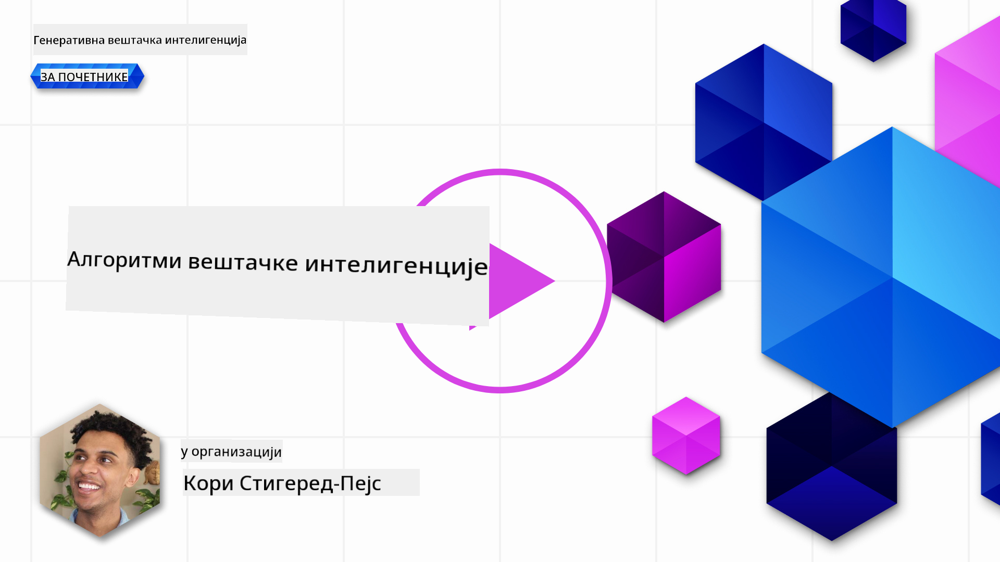
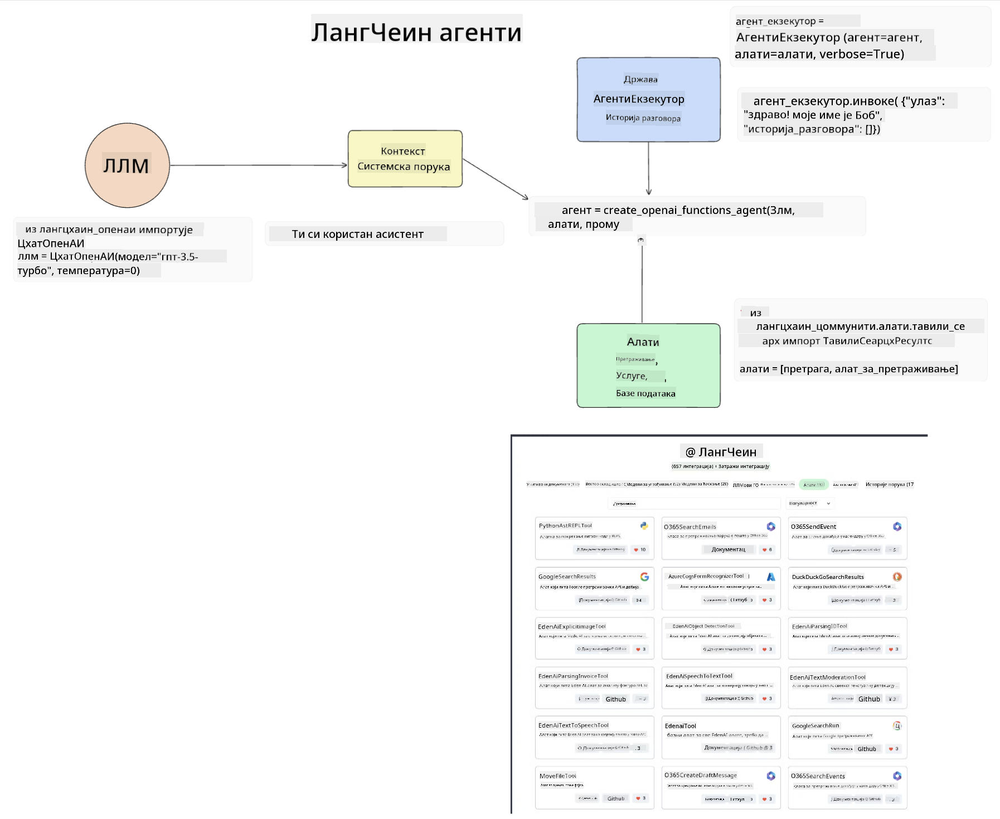
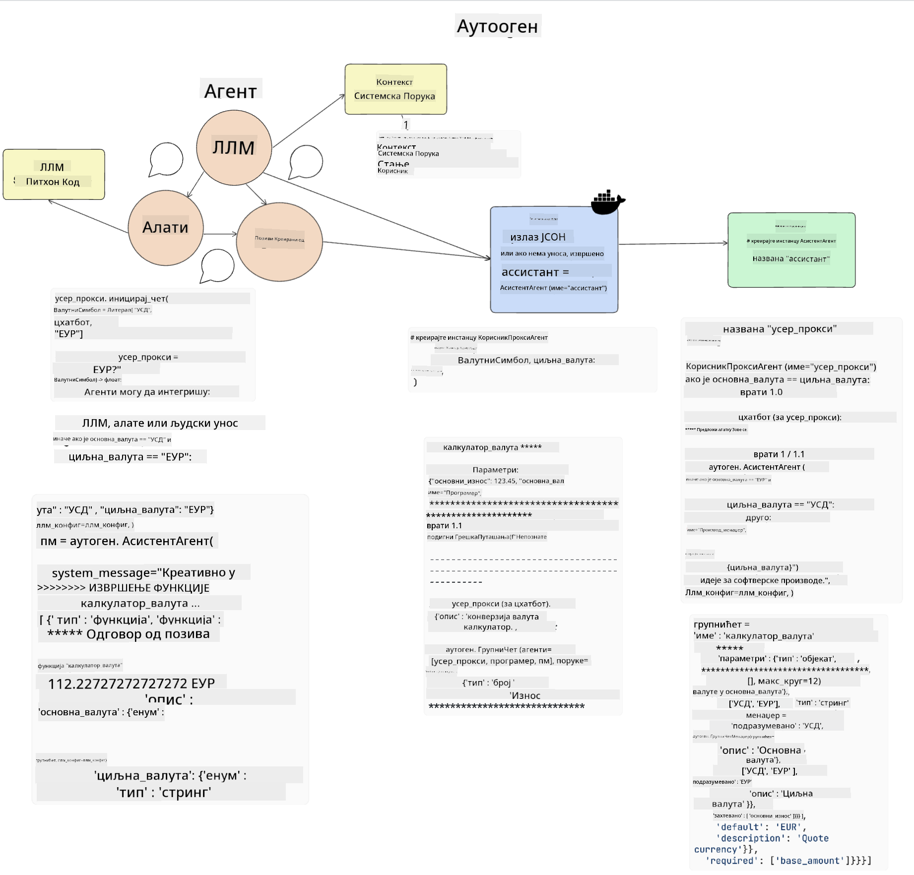
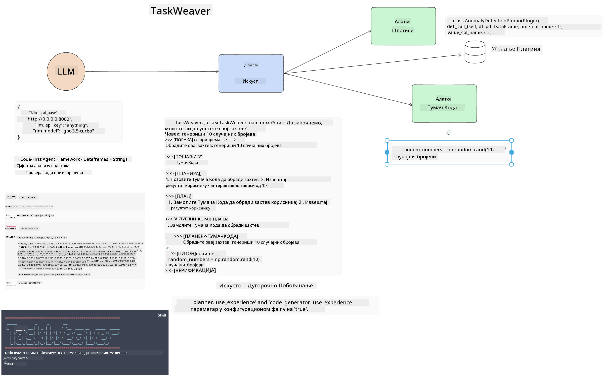
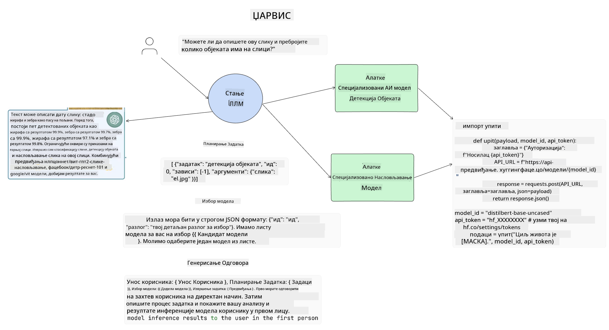

<!--
CO_OP_TRANSLATOR_METADATA:
{
  "original_hash": "11f03c81f190d9cbafd0f977dcbede6c",
  "translation_date": "2025-05-20T07:32:31+00:00",
  "source_file": "17-ai-agents/README.md",
  "language_code": "sr"
}
-->
[](https://aka.ms/gen-ai-lesson17-gh?WT.mc_id=academic-105485-koreyst)

## Uvod

AI agenti predstavljaju uzbudljiv razvoj u oblasti Generativne AI, omogućavajući Velikim Jezičkim Modelima (LLMs) da evoluiraju iz asistenata u agente sposobne za preduzimanje akcija. Okviri za AI agente omogućavaju programerima da kreiraju aplikacije koje daju LLM-ovima pristup alatima i upravljanju stanjem. Ovi okviri takođe poboljšavaju vidljivost, omogućavajući korisnicima i programerima da prate akcije koje LLM-ovi planiraju, čime se poboljšava upravljanje iskustvom.

Lekcija će pokriti sledeće oblasti:

- Razumevanje šta je AI agent - Šta tačno predstavlja AI agent?
- Istraživanje četiri različita okvira za AI agente - Šta ih čini jedinstvenim?
- Primena ovih AI agenata na različite slučajeve korišćenja - Kada treba koristiti AI agente?

## Ciljevi učenja

Nakon što završite ovu lekciju, bićete u mogućnosti da:

- Objasnite šta su AI agenti i kako se mogu koristiti.
- Razumete razlike između nekih od popularnih okvira za AI agente i kako se razlikuju.
- Razumete kako AI agenti funkcionišu kako biste mogli da gradite aplikacije sa njima.

## Šta su AI agenti?

AI agenti su veoma uzbudljivo polje u svetu Generativne AI. Sa ovim uzbuđenjem ponekad dolazi i konfuzija u vezi sa terminima i njihovom primenom. Da bismo stvari učinili jednostavnim i uključili većinu alata koji se odnose na AI agente, koristićemo ovu definiciju:

AI agenti omogućavaju Velikim Jezičkim Modelima (LLMs) da izvršavaju zadatke dajući im pristup **stanju** i **alatima**.


Definišimo ove pojmove:

**Veliki Jezički Modeli** - Ovo su modeli na koje se pozivamo tokom ovog kursa, kao što su GPT-3.5, GPT-4, Llama-2, itd.

**Stanje** - Ovo se odnosi na kontekst u kojem LLM radi. LLM koristi kontekst svojih prošlih akcija i trenutni kontekst, vodeći se pri donošenju odluka za naredne akcije. Okviri za AI agente omogućavaju programerima da lakše održavaju ovaj kontekst.

**Alati** - Da bi završio zadatak koji je korisnik zatražio i koji je LLM isplanirao, LLM-u je potreban pristup alatima. Neki primeri alata mogu biti baza podataka, API, spoljašnja aplikacija ili čak drugi LLM!

Nadamo se da će vam ove definicije pružiti dobru osnovu dok istražujemo kako se oni implementiraju. Hajde da istražimo nekoliko različitih okvira za AI agente:

## LangChain agenti

[LangChain agenti](https://python.langchain.com/docs/how_to/#agents?WT.mc_id=academic-105485-koreyst) su implementacija definicija koje smo gore naveli.

Za upravljanje **stanjem**, koristi ugrađenu funkciju zvanu `AgentExecutor`. Ovo prihvata definisane `agent` i `tools` koje su mu dostupne.

`Agent Executor` takođe skladišti istoriju razgovora kako bi pružio kontekst razgovora.



LangChain nudi [katalog alata](https://integrations.langchain.com/tools?WT.mc_id=academic-105485-koreyst) koji se mogu uvesti u vašu aplikaciju u kojoj LLM može dobiti pristup. Ovi alati su napravljeni od strane zajednice i LangChain tima.

Možete zatim definisati ove alate i proslediti ih `Agent Executor`.

Vidljivost je još jedan važan aspekt kada govorimo o AI agentima. Važno je da programeri aplikacija razumeju koji alat LLM koristi i zašto. Zbog toga je tim u LangChain-u razvio LangSmith.

## AutoGen

Sledeći okvir za AI agente o kojem ćemo diskutovati je [AutoGen](https://microsoft.github.io/autogen/?WT.mc_id=academic-105485-koreyst). Glavni fokus AutoGen-a su razgovori. Agenti su i **razgovorni** i **prilagodljivi**.

**Razgovorni -** LLM-ovi mogu započeti i nastaviti razgovor sa drugim LLM-om kako bi završili zadatak. Ovo se postiže kreiranjem `AssistantAgents` i davanjem specifične sistemske poruke.

```python

autogen.AssistantAgent( name="Coder", llm_config=llm_config, ) pm = autogen.AssistantAgent( name="Product_manager", system_message="Creative in software product ideas.", llm_config=llm_config, )

```

**Prilagodljivi** - Agenti se mogu definisati ne samo kao LLM-ovi već i kao korisnik ili alat. Kao programer, možete definisati `UserProxyAgent` koji je odgovoran za interakciju sa korisnikom radi povratne informacije u završavanju zadatka. Ova povratna informacija može ili nastaviti izvršavanje zadatka ili ga zaustaviti.

```python
user_proxy = UserProxyAgent(name="user_proxy")
```

### Stanje i alati

Da bi promenio i upravljao stanjem, pomoćni agent generiše Python kod za završetak zadatka.

Evo primera procesa:



#### LLM definisan sa sistemskom porukom

```python
system_message="For weather related tasks, only use the functions you have been provided with. Reply TERMINATE when the task is done."
```

Ova sistemska poruka usmerava ovaj specifični LLM ka funkcijama koje su relevantne za njegov zadatak. Zapamtite, sa AutoGen-om možete imati više definisanih pomoćnih agenata sa različitim sistemskim porukama.

#### Razgovor inicira korisnik

```python
user_proxy.initiate_chat( chatbot, message="I am planning a trip to NYC next week, can you help me pick out what to wear? ", )

```

Ova poruka od user_proxy (ljudskog korisnika) pokreće proces agenta da istraži moguće funkcije koje bi trebalo da izvrši.

#### Funkcija se izvršava

```bash
chatbot (to user_proxy):

***** Suggested tool Call: get_weather ***** Arguments: {"location":"New York City, NY","time_periond:"7","temperature_unit":"Celsius"} ******************************************************** --------------------------------------------------------------------------------

>>>>>>>> EXECUTING FUNCTION get_weather... user_proxy (to chatbot): ***** Response from calling function "get_weather" ***** 112.22727272727272 EUR ****************************************************************

```

Kada se početni razgovor obradi, agent će poslati predloženi alat za pozivanje. U ovom slučaju, to je funkcija nazvana `get_weather`. Depending on your configuration, this function can be automatically executed and read by the Agent or can be executed based on user input.

You can find a list of [AutoGen code samples](https://microsoft.github.io/autogen/docs/Examples/?WT.mc_id=academic-105485-koreyst) to further explore how to get started building.

## Taskweaver

The next agent framework we will explore is [Taskweaver](https://microsoft.github.io/TaskWeaver/?WT.mc_id=academic-105485-koreyst). It is known as a "code-first" agent because instead of working strictly with `strings` , it can work with DataFrames in Python. This becomes extremely useful for data analysis and generation tasks. This can be things like creating graphs and charts or generating random numbers.

### State and Tools

To manage the state of the conversation, TaskWeaver uses the concept of a `Planner`. The `Planner` is a LLM that takes the request from the users and maps out the tasks that need to be completed to fulfill this request.

To complete the tasks the `Planner` is exposed to the collection of tools called `Plugins`. Ovo mogu biti Python klase ili opšti interpreter koda. Ovi dodaci su sačuvani kao embeddings kako bi LLM mogao bolje da pretražuje za ispravnim dodatkom.



Evo primera dodatka za rukovanje detekcijom anomalija:

```python
class AnomalyDetectionPlugin(Plugin): def __call__(self, df: pd.DataFrame, time_col_name: str, value_col_name: str):
```

Kod se proverava pre izvršenja. Druga karakteristika za upravljanje kontekstom u Taskweaver-u je `experience`. Experience allows for the context of a conversation to be stored over to the long term in a YAML file. This can be configured so that the LLM improves over time on certain tasks given that it is exposed to prior conversations.

## JARVIS

The last agent framework we will explore is [JARVIS](https://github.com/microsoft/JARVIS?tab=readme-ov-file?WT.mc_id=academic-105485-koreyst). What makes JARVIS unique is that it uses an LLM to manage the `state` razgovora i `tools` su drugi AI modeli. Svaki od AI modela su specijalizovani modeli koji obavljaju određene zadatke kao što su detekcija objekata, transkripcija ili opisivanje slika.



LLM, kao model opšte namene, prima zahtev od korisnika i identifikuje specifičan zadatak i sve argumente/podatke koji su potrebni za završetak zadatka.

```python
[{"task": "object-detection", "id": 0, "dep": [-1], "args": {"image": "e1.jpg" }}]
```

LLM zatim formatira zahtev na način koji specijalizovani AI model može interpretirati, kao što je JSON. Kada AI model vrati svoju predikciju na osnovu zadatka, LLM prima odgovor.

Ako je potrebno više modela za završetak zadatka, takođe će interpretirati odgovore tih modela pre nego što ih spoji kako bi generisao odgovor korisniku.

Primer ispod pokazuje kako bi to funkcionisalo kada korisnik zahteva opis i broj objekata na slici:

## Zadatak

Da biste nastavili sa učenjem o AI agentima, možete izgraditi sa AutoGen:

- Aplikaciju koja simulira poslovni sastanak sa različitim odeljenjima u startapu za obrazovanje.
- Kreirajte sistemske poruke koje vode LLM-ove u razumevanju različitih persona i prioriteta, i omogućavaju korisniku da predstavi novu ideju proizvoda.
- LLM bi zatim trebao generisati dodatna pitanja iz svakog odeljenja kako bi usavršio i poboljšao ideju proizvoda.

## Učenje ne prestaje ovde, nastavite putovanje

Nakon što završite ovu lekciju, pogledajte našu [kolekciju za učenje Generativne AI](https://aka.ms/genai-collection?WT.mc_id=academic-105485-koreyst) kako biste nastavili da unapređujete svoje znanje o Generativnoj AI!

**Одрицање од одговорности**:  
Овај документ је преведен користећи AI услугу за превођење [Co-op Translator](https://github.com/Azure/co-op-translator). Иако се трудимо да обезбедимо тачност, молимо вас да будете свесни да аутоматизовани преводи могу садржати грешке или нетачности. Оригинални документ на његовом изворном језику треба сматрати меродавним извором. За критичне информације препоручује се професионални превод од стране људи. Нисмо одговорни за било каква погрешна разумевања или погрешна тумачења која произилазе из употребе овог превода.