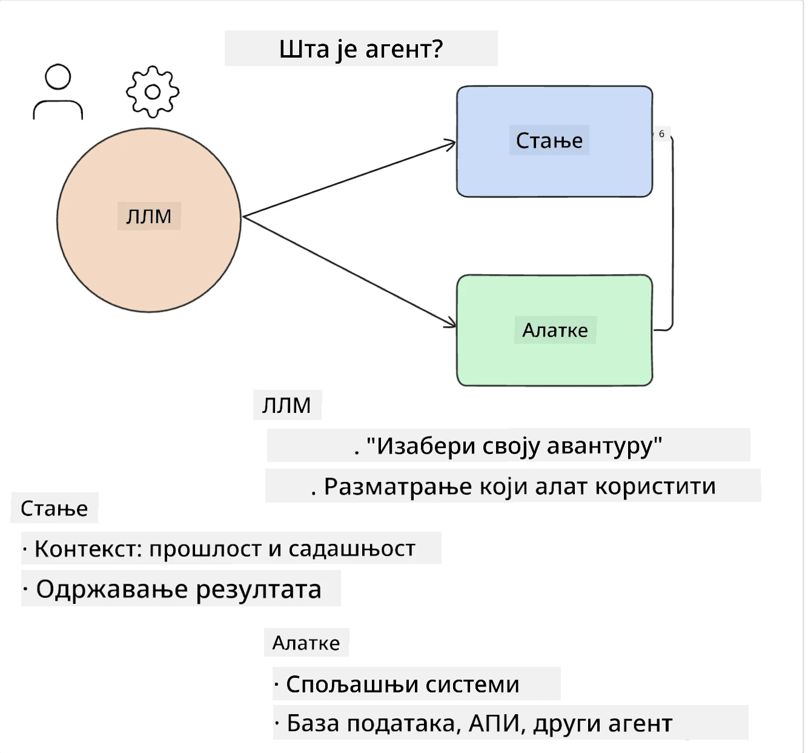
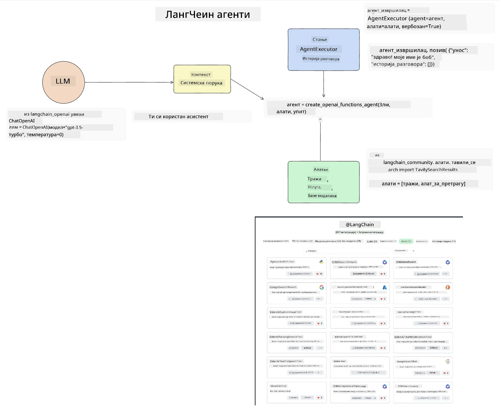
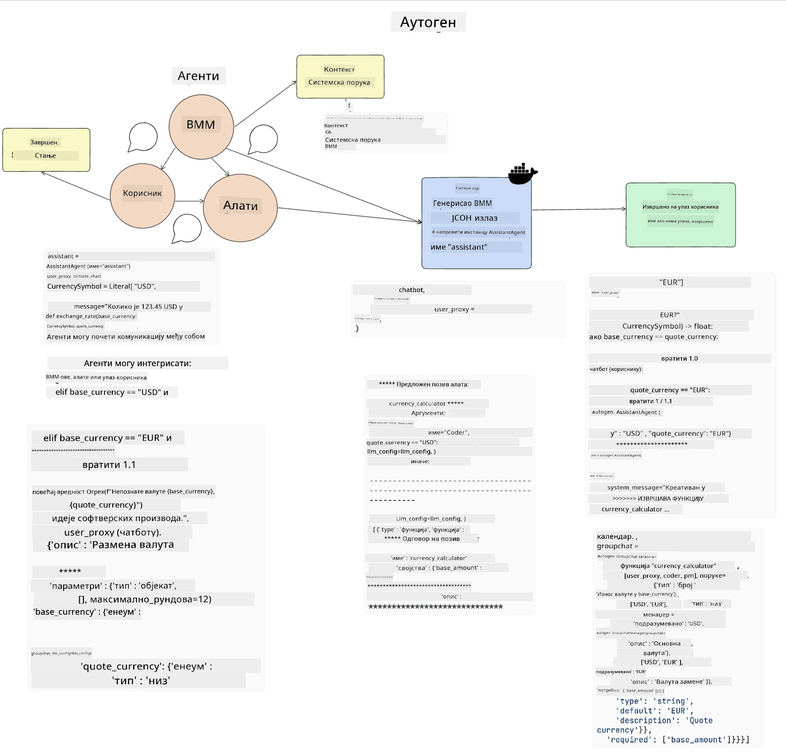
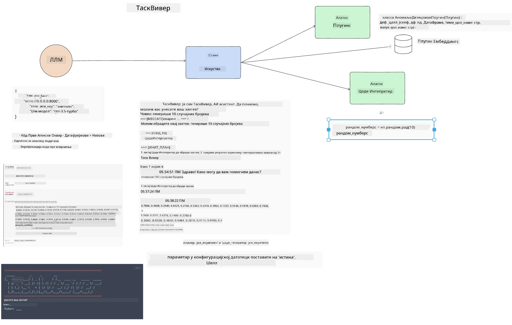
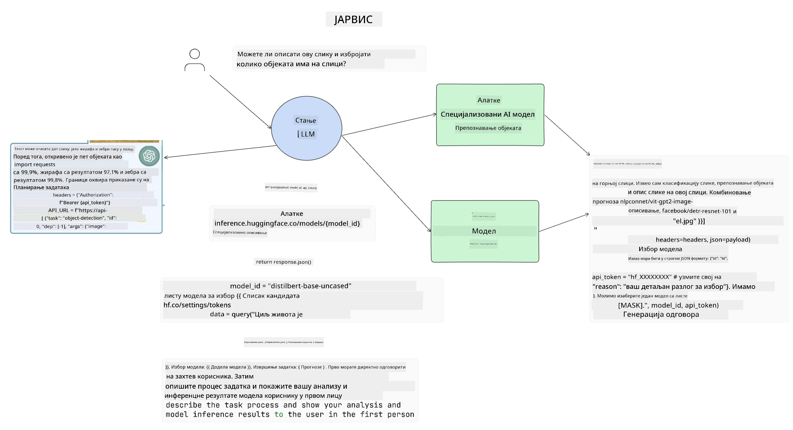

[](https://youtu.be/yAXVW-lUINc?si=bOtW9nL6jc3XJgOM)

## Увод

AI агенти представљају узбудљив развој у Генеративној вештачкој интелигенцији, омогућавајући Великим језичким моделима (LLM-овима) да еволуирају од асистената у агенте способне за предузимање акција. Фрејмворкови AI агената омогућавају програмерима да креирају апликације које дају LLM-овима приступ алаткама и управљању стањем. Ови фрејмворкови такође побољшавају видљивост, омогућавајући корисницима и програмерима да прате акције које LLM-ови планирају, чиме се унапређује управљање искуством.

У лекцији ће бити обрађене следеће области:

- Разумевање шта је AI агент - Шта тачно значи AI агент?
- Истраживање четири различита AI агент фрејмворка - Шта их чини јединственим?
- Примена ових AI агената у различитим случајевима употребе - Када треба користити AI агенте?

## Циљеви учења

Након ове лекције, бићете у стању да:

- Објасните шта су AI агенти и како се могу користити.
- Разумете разлике између неких популарних AI агент фрејмворка и како се разликују.
- Разумете како AI агенти функционишу како бисте могли да правите апликације са њима.

## Шта су AI агенти?

AI агенти су веома занимљиво поље у свету Генеративне вештачке интелигенције. Са тим узбуђењем понекад долази и конфузија термина и њихове примене. Да бисмо ствари учинили једноставним и укључивим за већину алата који се односе на AI агенте, користићемо ову дефиницију:

AI агенти омогућавају Великим језичким моделима (LLM-овима) да извршавају задатке тако што им дају приступ **стању** и **алаткама**.



Хајде да дефинишемо ове појмове:

**Велики језички модели** - То су модели који се спомињу током овог курса као што су GPT-3.5, GPT-4, Llama-2 и други.

**Стање** - Ово се односи на контекст у којем LLM ради. LLM користи контекст својих претходних акција и тренутни контекст који усмерава његово доношење одлука за следеће акције. AI агент фрејмворкови програмерима олакшавају одржавање овог контекста.

**Алатке** - Да би завршио задатак који је корисник тражио и који је LLM испланирао, LLM треба приступ алаткама. Неки примери алатки могу бити база података, API, спољна апликација или чак други LLM!

Ове дефиниције ће вам, надамо се, пружити добру основу док будемо гледали како се имплементирају. Истражимо неколико различитих AI агент фрејмворка:

## LangChain агенти

[LangChain агенти](https://python.langchain.com/docs/how_to/#agents?WT.mc_id=academic-105485-koreyst) представљају имплементацију горе наведених дефиниција.

За управљање **стањем** користи уграђену функцију која се зове `AgentExecutor`. Овај прихвата дефинисаног `agent-а` и `tools` које су му доступне.

`AgentExecutor` такође чува историју ћаскања како би обезбедио контекст разговора.



LangChain нуди [каталог алатки](https://integrations.langchain.com/tools?WT.mc_id=academic-105485-koreyst) које можете увезти у своју апликацију и којима LLM може приступити. Ове алатке прави заједница и тим LangChain-а.

Затим можете дефинисати те алатке и проследити их `AgentExecutor`-у.

Видљивост је још један важан аспект када причамо о AI агентима. Важно је програмерима апликација да разумеју коју алатку LLM користи и зашто. Због тога је тим LangChain-а развио LangSmith.

## AutoGen

Следећи AI агент фрејмворк о коме ћемо причати је [AutoGen](https://microsoft.github.io/autogen/?WT.mc_id=academic-105485-koreyst). Главни фокус AutoGen-а су разговори. Агенти су и **разговорљиви** и **прилагодљиви**.

**Разговорљиви -** LLM-ови могу започети и наставити разговор са другим LLM-ом како би завршили задатак. Ово се постиже креирањем `AssistantAgents` и давањем одређене системске поруке.

```python

autogen.AssistantAgent( name="Coder", llm_config=llm_config, ) pm = autogen.AssistantAgent( name="Product_manager", system_message="Creative in software product ideas.", llm_config=llm_config, )

```

**Прилагодљиви** - Агенти могу бити дефинисани не само као LLM-ови већ и као корисник или алатка. Као програмер, можете дефинисати `UserProxyAgent` који је одговоран за интеракцију са корисником ради повратних информација у обављању задатка. Ове повратне информације могу наставити извршење задатка или га зауставити.

```python
user_proxy = UserProxyAgent(name="user_proxy")
```

### Стање и алатке

За промену и управљање стањем, помоћни агент генерише Python код за завршетак задатка.

Ево примера процеса:



#### LLM дефинисан системском поруком

```python
system_message="For weather related tasks, only use the functions you have been provided with. Reply TERMINATE when the task is done."
```

Ова системска порука усмерава овај конкретан LLM који су му релевантне функције за задатак. Запамтите, са AutoGen-ом можете имати више дефинисаних AssistantAgents са различитим системским порукама.

#### Разговор иницира корисник

```python
user_proxy.initiate_chat( chatbot, message="I am planning a trip to NYC next week, can you help me pick out what to wear? ", )

```

Ова порука од user_proxy (човек) ће покренути процес агента да истражи могуће функције које треба да изврши.

#### Функција се извршава

```bash
chatbot (to user_proxy):

***** Suggested tool Call: get_weather ***** Arguments: {"location":"New York City, NY","time_periond:"7","temperature_unit":"Celsius"} ******************************************************** --------------------------------------------------------------------------------

>>>>>>>> EXECUTING FUNCTION get_weather... user_proxy (to chatbot): ***** Response from calling function "get_weather" ***** 112.22727272727272 EUR ****************************************************************

```

Када се иницијални разговор обради, агент ће послати предлог алатке коју треба позвати. У овом случају, то је функција под називом `get_weather`. У зависности од ваше конфигурације, ова функција може бити аутоматски извршена и прочитана од стране агента или се може извршити на основу уноса корисника.

Можете пронаћи листу [AutoGen примера кода](https://microsoft.github.io/autogen/docs/Examples/?WT.mc_id=academic-105485-koreyst) да даље истражите како почети са изградњом.

## Taskweaver

Следећи агент фрејмворк који ћемо истражити је [Taskweaver](https://microsoft.github.io/TaskWeaver/?WT.mc_id=academic-105485-koreyst). Познат је као "прво-код" агент јер, уместо да ради строго са `strings`, може радити са DataFrame-овима у Python-у. Ово постаје изузетно корисно за анализу података и задатке генерисања. То могу бити ствари као што су креирање графикона и дијаграма или генерисање насумичних бројева.

### Стање и алатке

За управљање стањем разговора, TaskWeaver користи концепт `Planner`-а. `Planner` је LLM који преузима захтев од корисника и планира задатке који треба да се заврше да би се захтев испунио.

Да би завршио задатке, `Planner` има приступ колекцији алатки званих `Plugins`. То могу бити Python класе или општи интерпретер кода. Ови додаци се чувају као embeddings како би LLM боље тражио одговарајући додатак.



Ево примера плагина за детекцију аномалија:

```python
class AnomalyDetectionPlugin(Plugin): def __call__(self, df: pd.DataFrame, time_col_name: str, value_col_name: str):
```

Код се верификује пре извршења. Још једна функција за управљање контекстом у Taskweaver-у је `experience`. Experience омогућава да се контекст разговора чува дугорочно у YAML фајлу. Ово се може конфигурисати тако да се LLM током времена побољшава на одређеним задацима захваљујући претходним разговорима.

## JARVIS

Последњи агент фрејмворк који ћемо истражити је [JARVIS](https://github.com/microsoft/JARVIS?tab=readme-ov-file&WT.mc_id=academic-105485-koreyst). Једна од јединствених особина JARVIS-а је да користи LLM за управљање `стањем` разговора, а `алатке` су други AI модели. Сваки од AI модела је специјализован модел који обавља одређене задатке као што су детекција објеката, транскрипција или описивање слика.



LLM, као модел опште намене, прима захтев од корисника и идентификује конкретан задатак и било које аргументе/подаци потребне за завршетак тог задатка.

```python
[{"task": "object-detection", "id": 0, "dep": [-1], "args": {"image": "e1.jpg" }}]
```

Затим LLM форматира захтев на начин који специјализовани AI модел може интерпретирати, као што је JSON. Када AI модел врати своју прогнозу засновану на задатку, LLM прима одговор.

Ако је потребно више модела за завршетак задатка, LLM ће такође протумачити одговоре тих модела пре него што их комбинује како би генерисао одговор кориснику.

Пример испод показује како би ово функционисало када корисник тражи опис и број објеката на слици:

## Задатак

Да бисте наставили учење о AI агенатима, можете направити помоћу AutoGen-а:

- Апликацију која симулира пословни састанак различитих одељења у образовном стартапу.
- Креирајте системске поруке које воде LLM-ове у разумевању различитих персонума и приоритета, и омогућите кориснику да представи идеју новог производа.
- Затим LLM треба да генерише питања за наставак од сваког одељења како би се унапредила презентација и сама идеја производа.

## Учење овде не престаје, наставите путовање

Након што завршите ову лекцију, погледајте нашу [колекцију за учење Генеративне AI](https://aka.ms/genai-collection?WT.mc_id=academic-105485-koreyst) да бисте наставили да унапређујете своје знање из Генеративне AI!

---

<!-- CO-OP TRANSLATOR DISCLAIMER START -->
**Изјава о одрицању одговорности**:
Овај документ је преведен коришћењем АИ услуге за превођење [Co-op Translator](https://github.com/Azure/co-op-translator). Иако тежимо прецизности, молимо да имате у виду да аутоматски преводи могу садржати грешке или нетачности. Оригинални документ на његовом изворном језику треба сматрати ауторитетним извором. За критичне информације препоручује се професионални људски превод. Нисмо одговорни за било каква неспоразума или погрешне тумачења која произилазе из коришћења овог превода.
<!-- CO-OP TRANSLATOR DISCLAIMER END -->