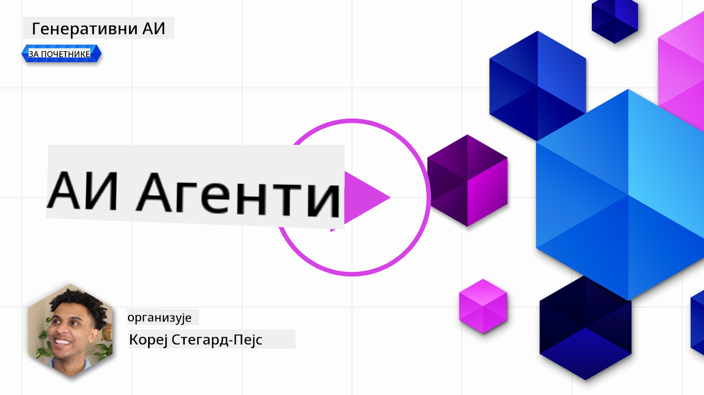
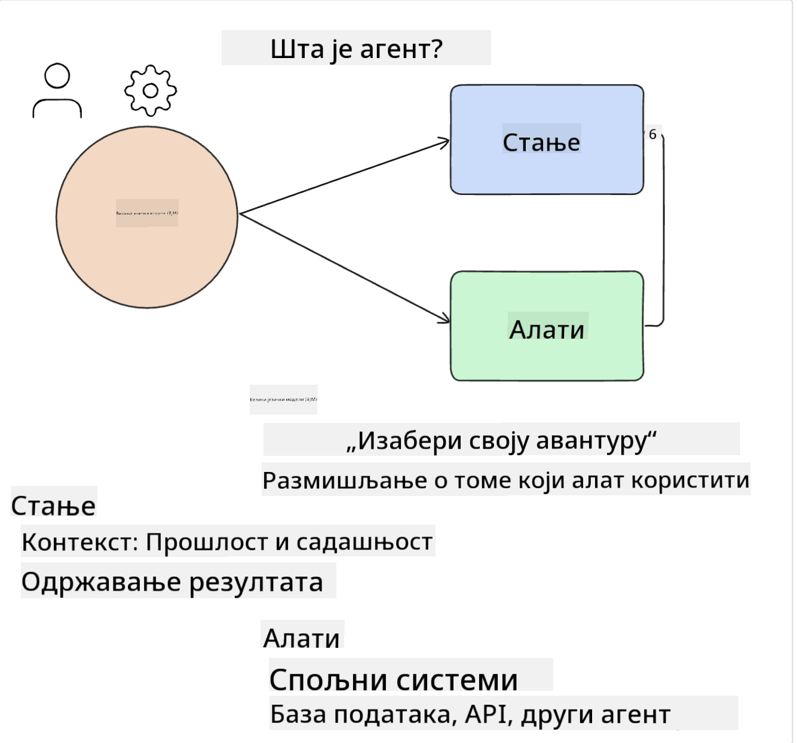
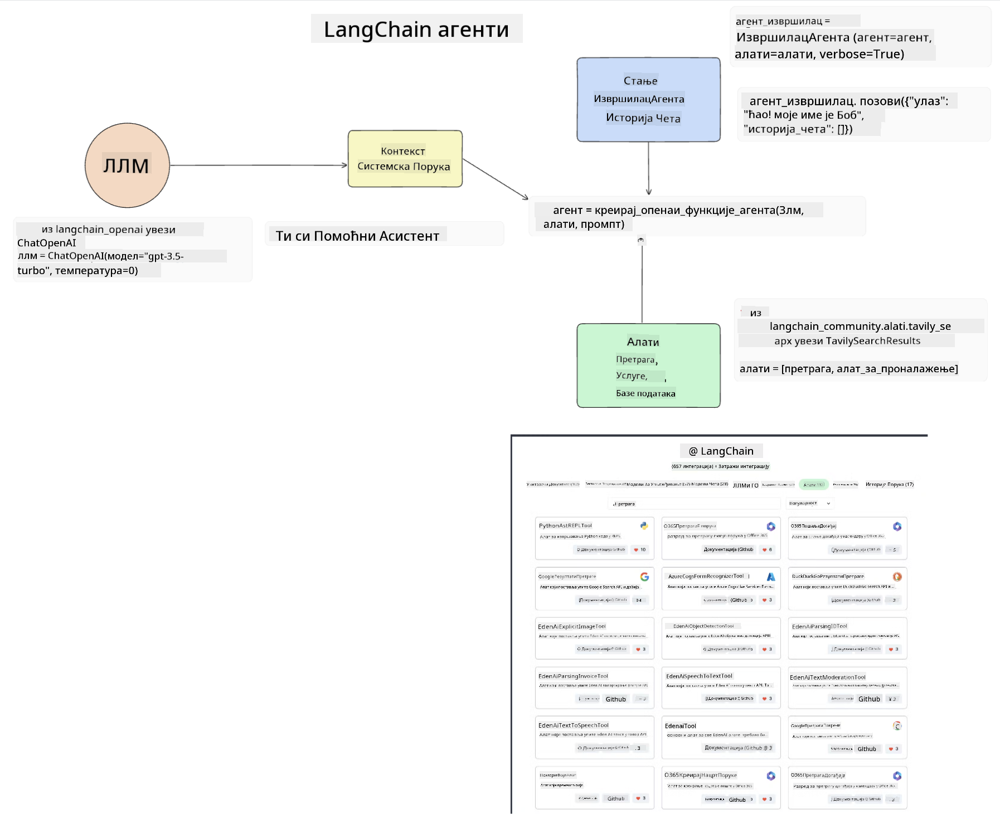
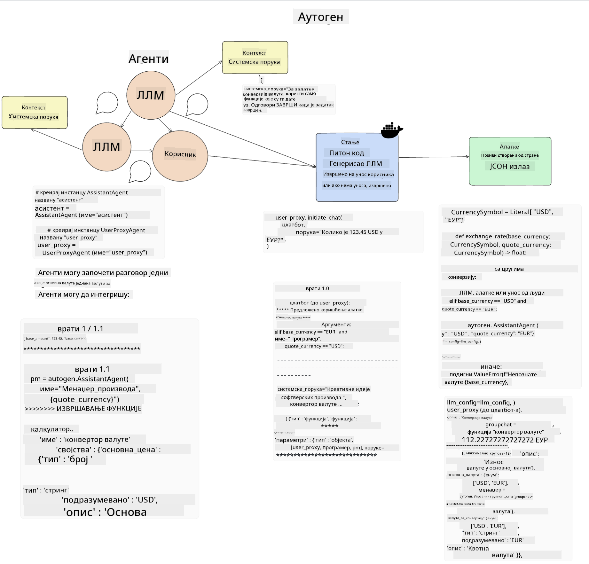
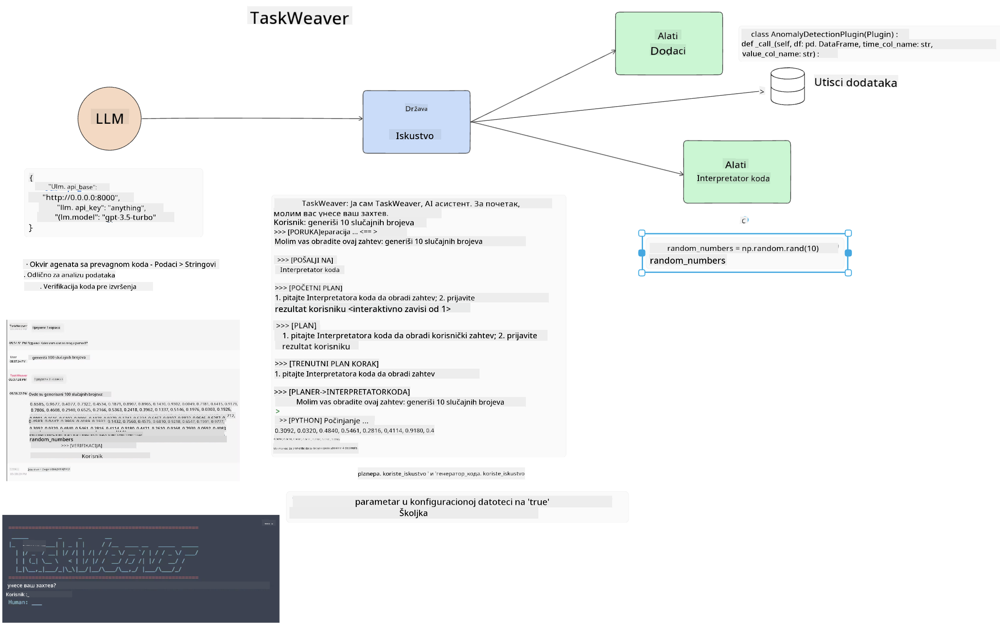
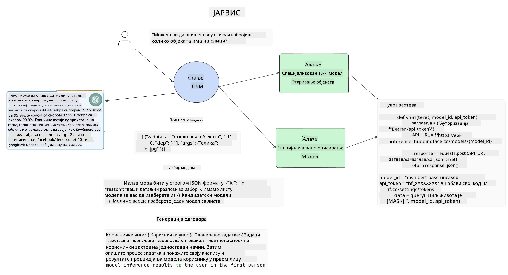

<!--
CO_OP_TRANSLATOR_METADATA:
{
  "original_hash": "11f03c81f190d9cbafd0f977dcbede6c",
  "translation_date": "2025-06-26T00:26:06+00:00",
  "source_file": "17-ai-agents/README.md",
  "language_code": "sr"
}
-->
[](https://aka.ms/gen-ai-lesson17-gh?WT.mc_id=academic-105485-koreyst)

## Увод

АИ агенти представљају узбудљив развој у Генеративној АИ, омогућавајући великим језичким моделима (LLMs) да се развију од асистената у агенте способне да предузимају акције. Оквири за АИ агенте омогућавају програмерима да креирају апликације које дају LLM-овима приступ алатима и управљању стањем. Ови оквири такође побољшавају видљивост, омогућавајући корисницима и програмерима да прате акције које LLM-ови планирају, чиме се побољшава управљање искуством.

Лекција ће покрити следеће области:

- Разумевање шта је АИ агент - Шта тачно је АИ агент?
- Истраживање четири различита оквира за АИ агенте - Шта их чини јединственим?
- Примена ових АИ агената у различитим случајевима коришћења - Када треба да користимо АИ агенте?

## Циљеви учења

Након што завршите ову лекцију, бићете у могућности да:

- Објасните шта су АИ агенти и како се могу користити.
- Имате разумевање разлика између неких од популарних оквира за АИ агенте и како се разликују.
- Разумете како АИ агенти функционишу да бисте изградили апликације са њима.

## Шта су АИ агенти?

АИ агенти су веома узбудљиво поље у свету Генеративне АИ. Са овим узбуђењем понекад долази до забуне у терминима и њиховој примени. Да бисмо ствари поједноставили и укључили већину алата који се односе на АИ агенте, користићемо ову дефиницију:

АИ агенти омогућавају великим језичким моделима (LLMs) да извршавају задатке дајући им приступ **стању** и **алатима**.



Хајде да дефинишемо ове термине:

**Велики језички модели** - Ово су модели који се помињу током овог курса, као што су GPT-3.5, GPT-4, Llama-2, итд.

**Стање** - Ово се односи на контекст у ком LLM ради. LLM користи контекст својих прошлих акција и тренутни контекст, водећи своје одлуке за наредне акције. Оквири за АИ агенте омогућавају програмерима да лакше одржавају овај контекст.

**Алатке** - Да би завршио задатак који је корисник захтевао и који је LLM испланирао, LLM-у је потребан приступ алатима. Неки примери алата могу бити база података, API, спољна апликација или чак други LLM!

Ове дефиниције ће вам, надамо се, дати добру основу за даље истраживање како се имплементирају. Хајде да истражимо неколико различитих оквира за АИ агенте:

## LangChain агенти

[LangChain агенти](https://python.langchain.com/docs/how_to/#agents?WT.mc_id=academic-105485-koreyst) су имплементација дефиниција које смо навели горе.

Да би управљао **стањем**, користи уграђену функцију звану `AgentExecutor`. Ова функција прихвата дефинисане `agent` и `tools` који су доступни.

`Agent Executor` такође чува историју ћаскања да би обезбедио контекст ћаскања.



LangChain нуди [каталог алата](https://integrations.langchain.com/tools?WT.mc_id=academic-105485-koreyst) који се могу увозити у вашу апликацију у којој LLM може добити приступ. Ове алате прави заједница и тим LangChain-а.

Можете онда дефинисати ове алате и проследити их `Agent Executor`.

Видљивост је још један важан аспект када говоримо о АИ агентима. Важно је да програмери апликација разумеју који алат LLM користи и зашто. За то, тим LangChain-а је развио LangSmith.

## AutoGen

Следећи оквир за АИ агенте о ком ћемо разговарати је [AutoGen](https://microsoft.github.io/autogen/?WT.mc_id=academic-105485-koreyst). Главни фокус AutoGen-а су разговори. Агенти су и **разговорљиви** и **прилагодљиви**.

**Разговорљиви -** LLM-ови могу започети и наставити разговор са другим LLM-ом како би завршили задатак. Ово се ради креирањем `AssistantAgents` и давањем специфичне системске поруке.

```python

autogen.AssistantAgent( name="Coder", llm_config=llm_config, ) pm = autogen.AssistantAgent( name="Product_manager", system_message="Creative in software product ideas.", llm_config=llm_config, )

```

**Прилагодљиви** - Агенти се могу дефинисати не само као LLM-ови већ и као корисник или алат. Као програмер, можете дефинисати `UserProxyAgent` који је одговоран за интеракцију са корисником за повратне информације у завршетку задатка. Ове повратне информације могу или наставити извршење задатка или га зауставити.

```python
user_proxy = UserProxyAgent(name="user_proxy")
```

### Стање и алати

Да би променио и управљао стањем, помоћни агент генерише Python код за завршетак задатка.

Ево примера процеса:



#### LLM дефинисан са системском поруком

```python
system_message="For weather related tasks, only use the functions you have been provided with. Reply TERMINATE when the task is done."
```

Ова системска порука усмерава овај специфичан LLM на које функције су релевантне за његов задатак. Запамтите, са AutoGen-ом можете имати више дефинисаних AssistantAgents са различитим системским порукама.

#### Ћаскање иницирано од стране корисника

```python
user_proxy.initiate_chat( chatbot, message="I am planning a trip to NYC next week, can you help me pick out what to wear? ", )

```

Ова порука од user_proxy (човек) је оно што ће покренути процес агента да истражи могуће функције које треба да изврши.

#### Функција се извршава

```bash
chatbot (to user_proxy):

***** Suggested tool Call: get_weather ***** Arguments: {"location":"New York City, NY","time_periond:"7","temperature_unit":"Celsius"} ******************************************************** --------------------------------------------------------------------------------

>>>>>>>> EXECUTING FUNCTION get_weather... user_proxy (to chatbot): ***** Response from calling function "get_weather" ***** 112.22727272727272 EUR ****************************************************************

```

Када се иницијално ћаскање обради, агент ће послати предлог алата за позивање. У овом случају, то је функција названа `get_weather`. Depending on your configuration, this function can be automatically executed and read by the Agent or can be executed based on user input.

You can find a list of [AutoGen code samples](https://microsoft.github.io/autogen/docs/Examples/?WT.mc_id=academic-105485-koreyst) to further explore how to get started building.

## Taskweaver

The next agent framework we will explore is [Taskweaver](https://microsoft.github.io/TaskWeaver/?WT.mc_id=academic-105485-koreyst). It is known as a "code-first" agent because instead of working strictly with `strings` , it can work with DataFrames in Python. This becomes extremely useful for data analysis and generation tasks. This can be things like creating graphs and charts or generating random numbers.

### State and Tools

To manage the state of the conversation, TaskWeaver uses the concept of a `Planner`. The `Planner` is a LLM that takes the request from the users and maps out the tasks that need to be completed to fulfill this request.

To complete the tasks the `Planner` is exposed to the collection of tools called `Plugins`. Ово могу бити Python класе или општи интерпретер кода. Ови додаци се чувају као уграђени подаци тако да LLM може боље претраживати исправан додатак.



Ево примера додатка за обраду откривања аномалија:

```python
class AnomalyDetectionPlugin(Plugin): def __call__(self, df: pd.DataFrame, time_col_name: str, value_col_name: str):
```

Код се проверава пре извршења. Још једна функција за управљање контекстом у Taskweaver-у је `experience`. Experience allows for the context of a conversation to be stored over to the long term in a YAML file. This can be configured so that the LLM improves over time on certain tasks given that it is exposed to prior conversations.

## JARVIS

The last agent framework we will explore is [JARVIS](https://github.com/microsoft/JARVIS?tab=readme-ov-file?WT.mc_id=academic-105485-koreyst). What makes JARVIS unique is that it uses an LLM to manage the `state` разговора и `tools` су други АИ модели. Сваки од АИ модела су специјализовани модели који обављају одређене задатке као што су откривање објеката, транскрипција или описивање слика.



LLM, као модел опште намене, прима захтев од корисника и идентификује специфичан задатак и све аргументе/податке који су потребни за завршетак задатка.

```python
[{"task": "object-detection", "id": 0, "dep": [-1], "args": {"image": "e1.jpg" }}]
```

LLM затим форматира захтев на начин који специјализовани АИ модел може да интерпретира, као што је JSON. Када АИ модел врати своју предвиђање на основу задатка, LLM прима одговор.

Ако је потребно више модела да се заврши задатак, такође ће интерпретирати одговоре од тих модела пре него што их споји да би генерисао одговор кориснику.

Пример испод показује како би ово функционисало када корисник тражи опис и број објеката на слици:

## Задатак

Да бисте наставили своје учење о АИ агентима, можете изградити са AutoGen:

- Апликацију која симулира пословни састанак са различитим одељењима стартапа за образовање.
- Креирајте системске поруке које воде LLM-ове у разумевању различитих персона и приоритета и омогућавају кориснику да предложи нову идеју производа.
- LLM би затим требао генерисати пратећа питања из сваког одељења како би усавршио и побољшао предлог и идеју производа.

## Учење се овде не зауставља, наставите путовање

Након што завршите ову лекцију, погледајте нашу [Generative AI Learning колекцију](https://aka.ms/genai-collection?WT.mc_id=academic-105485-koreyst) да наставите да унапређујете своје знање о Генеративној АИ!

**Одрицање од одговорности**:  
Овај документ је преведен коришћењем AI услуге за превођење [Co-op Translator](https://github.com/Azure/co-op-translator). Иако се трудимо да будемо прецизни, молимо вас да будете свесни да аутоматски преводи могу садржати грешке или нетачности. Оригинални документ на свом изворном језику треба сматрати меродавним извором. За критичне информације препоручује се професионални превод од стране људи. Не сносимо одговорност за било каква погрешна тумачења или неразумевања која могу настати услед коришћења овог превода.