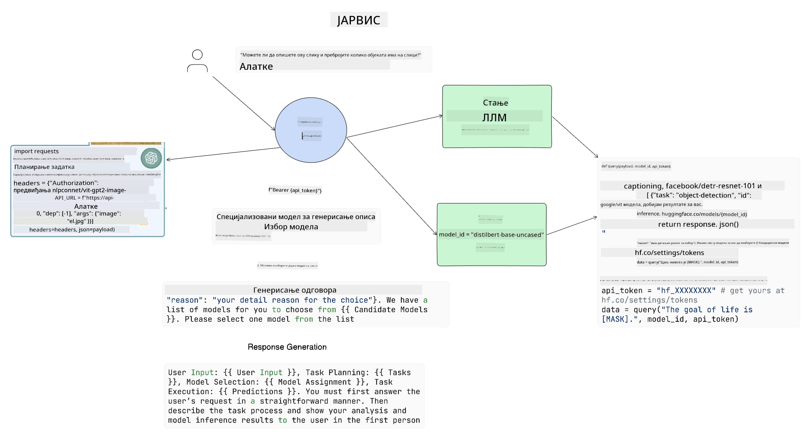

<!--
CO_OP_TRANSLATOR_METADATA:
{
  "original_hash": "8e8d1f6a63da606af7176a87ff8e92b6",
  "translation_date": "2025-10-18T01:27:34+00:00",
  "source_file": "17-ai-agents/README.md",
  "language_code": "sr"
}
-->
[](https://youtu.be/yAXVW-lUINc?si=bOtW9nL6jc3XJgOM)

## Увод

АИ агенти представљају узбудљив развој у области генеративне вештачке интелигенције, омогућавајући великим језичким моделима (LLMs) да се развију од асистената до агената способних за предузимање акција. Оквири за АИ агенте омогућавају програмерима да креирају апликације које пружају LLM-овима приступ алатима и управљање стањем. Ови оквири такође побољшавају видљивост, омогућавајући корисницима и програмерима да прате акције које LLM-ови планирају, чиме се унапређује управљање искуством.

Ова лекција ће обухватити следеће области:

- Разумевање шта је АИ агент - Шта је тачно АИ агент?
- Истраживање четири различита оквира за АИ агенте - Шта их чини јединственим?
- Примена ових АИ агената у различитим случајевима употребе - Када треба користити АИ агенте?

## Циљеви учења

Након ове лекције, моћи ћете:

- Објаснити шта су АИ агенти и како се могу користити.
- Разумети разлике између неких популарних оквира за АИ агенте и како се они разликују.
- Разумети како АИ агенти функционишу како бисте могли да изградите апликације са њима.

## Шта су АИ агенти?

АИ агенти су веома узбудљиво поље у свету генеративне вештачке интелигенције. Уз ову узбудљивост понекад долази и конфузија око термина и њихове примене. Да бисмо ствари учинили једноставним и укључили већину алата који се односе на АИ агенте, користићемо следећу дефиницију:

АИ агенти омогућавају великим језичким моделима (LLMs) да обављају задатке пружајући им приступ **стању** и **алатима**.


Хајде да дефинишемо ове термине:

**Велики језички модели** - Ово су модели који се помињу током овог курса, као што су GPT-3.5, GPT-4, Llama-2, итд.

**Стање** - Ово се односи на контекст у којем LLM ради. LLM користи контекст својих претходних акција и тренутни контекст, водећи своје одлуке за наредне акције. Оквири за АИ агенте омогућавају програмерима да лакше одржавају овај контекст.

**Алатке** - Да би завршио задатак који је корисник затражио и који је LLM испланирао, LLM-у је потребан приступ алатима. Неки примери алата могу бити база података, API, спољна апликација или чак други LLM!

Ове дефиниције ће вам, надамо се, пружити добру основу за даљи рад док истражујемо како се они имплементирају. Хајде да истражимо неколико различитих оквира за АИ агенте:

## LangChain агенти

[LangChain агенти](https://python.langchain.com/docs/how_to/#agents?WT.mc_id=academic-105485-koreyst) представљају имплементацију дефиниција које смо горе навели.

Да би управљао **стањем**, користи уграђену функцију названу `AgentExecutor`. Ова функција прихвата дефинисаног `агента` и доступне `алате`.

`AgentExecutor` такође чува историју разговора како би обезбедио контекст разговора.


LangChain нуди [каталог алата](https://integrations.langchain.com/tools?WT.mc_id=academic-105485-koreyst) који се могу увозити у вашу апликацију и којима LLM може приступити. Ове алате креира заједница и тим LangChain-а.

Затим можете дефинисати ове алате и проследити их `AgentExecutor`.

Видљивост је још један важан аспект када говоримо о АИ агентима. Важно је да програмери апликација разумеју који алат LLM користи и зашто. За то је тим LangChain-а развио LangSmith.

## AutoGen

Следећи оквир за АИ агенте који ћемо размотрити је [AutoGen](https://microsoft.github.io/autogen/?WT.mc_id=academic-105485-koreyst). Главни фокус AutoGen-а су разговори. Агенти су истовремено **разговорљиви** и **прилагодљиви**.

**Разговорљиви -** LLM-ови могу започети и наставити разговор са другим LLM-ом како би завршили задатак. Ово се ради креирањем `AssistantAgents` и давањем специфичне системске поруке.

```python

autogen.AssistantAgent( name="Coder", llm_config=llm_config, ) pm = autogen.AssistantAgent( name="Product_manager", system_message="Creative in software product ideas.", llm_config=llm_config, )

```

**Прилагодљиви** - Агенти могу бити дефинисани не само као LLM-ови, већ и као корисник или алат. Као програмер, можете дефинисати `UserProxyAgent` који је одговоран за интеракцију са корисником ради повратних информација у завршетку задатка. Ова повратна информација може или наставити извршење задатка или га зауставити.

```python
user_proxy = UserProxyAgent(name="user_proxy")
```

### Стање и алати

Да би променио и управљао стањем, помоћни агент генерише Python код за завршетак задатка.

Ево примера процеса:


#### LLM дефинисан са системском поруком

```python
system_message="For weather related tasks, only use the functions you have been provided with. Reply TERMINATE when the task is done."
```

Ова системска порука усмерава овај специфични LLM ка функцијама које су релевантне за његов задатак. Запамтите, са AutoGen-ом можете имати више дефинисаних AssistantAgents са различитим системским порукама.

#### Разговор иницира корисник

```python
user_proxy.initiate_chat( chatbot, message="I am planning a trip to NYC next week, can you help me pick out what to wear? ", )

```

Ова порука од user_proxy (Човек) је оно што ће започети процес агента да истражи могуће функције које треба да изврши.

#### Функција се извршава

```bash
chatbot (to user_proxy):

***** Suggested tool Call: get_weather ***** Arguments: {"location":"New York City, NY","time_periond:"7","temperature_unit":"Celsius"} ******************************************************** --------------------------------------------------------------------------------

>>>>>>>> EXECUTING FUNCTION get_weather... user_proxy (to chatbot): ***** Response from calling function "get_weather" ***** 112.22727272727272 EUR ****************************************************************

```

Када се иницијални разговор обради, агент ће предложити алат који треба позвати. У овом случају, то је функција названа `get_weather`. У зависности од ваше конфигурације, ова функција може бити аутоматски извршена и прочитана од стране агента или може бити извршена на основу уноса корисника.

Можете пронаћи листу [AutoGen примера кода](https://microsoft.github.io/autogen/docs/Examples/?WT.mc_id=academic-105485-koreyst) за даље истраживање како започети изградњу.

## Taskweaver

Следећи оквир агента који ћемо истражити је [Taskweaver](https://microsoft.github.io/TaskWeaver/?WT.mc_id=academic-105485-koreyst). Познат је као агент "прво код" јер уместо да ради искључиво са `стринговима`, може радити са DataFrames у Python-у. Ово постаје изузетно корисно за задатке анализе и генерисања података. То могу бити ствари као што су креирање графикона и дијаграма или генерисање случајних бројева.

### Стање и алати

Да би управљао стањем разговора, TaskWeaver користи концепт `Planner`. `Planner` је LLM који узима захтев од корисника и мапира задатке који треба да се заврше како би се испунио тај захтев.

Да би завршио задатке, `Planner` је изложен колекцији алата названих `Plugins`. Ово могу бити Python класе или општи интерпретатор кода. Ови додаци се чувају као уграђени елементи како би LLM могао боље да претражује прави додатак.


Ево примера додатка за откривање аномалија:

```python
class AnomalyDetectionPlugin(Plugin): def __call__(self, df: pd.DataFrame, time_col_name: str, value_col_name: str):
```

Код се проверава пре извршења. Још једна функција за управљање контекстом у TaskWeaver-у је `искуство`. Искуство омогућава да се контекст разговора чува дугорочно у YAML датотеци. Ово се може конфигурисати тако да LLM временом побољшава одређене задатке с обзиром на то да је изложен претходним разговорима.

## JARVIS

Последњи оквир агента који ћемо истражити је [JARVIS](https://github.com/microsoft/JARVIS?tab=readme-ov-file?WT.mc_id=academic-105485-koreyst). Оно што JARVIS чини јединственим је то што користи LLM за управљање `стањем` разговора, а `алати` су други АИ модели. Сваки од АИ модела су специјализовани модели који обављају одређене задатке као што су детекција објеката, транскрипција или описивање слика.



LLM, као модел опште намене, прима захтев од корисника и идентификује специфичан задатак и било које аргументе/податке који су потребни за завршетак задатка.

```python
[{"task": "object-detection", "id": 0, "dep": [-1], "args": {"image": "e1.jpg" }}]
```

LLM затим форматира захтев на начин који специјализовани АИ модел може да интерпретира, као што је JSON. Када АИ модел врати своју предикцију на основу задатка, LLM прима одговор.

Ако је потребно више модела за завршетак задатка, он ће такође интерпретирати одговоре тих модела пре него што их обједини како би генерисао одговор кориснику.

Пример испод показује како би ово функционисало када корисник захтева опис и број објеката на слици:

## Задатак

Да наставите са учењем о АИ агентима, можете изградити са AutoGen:

- Апликацију која симулира пословни састанак са различитим одељењима стартапа у области образовања.
- Креирајте системске поруке које воде LLM-ове у разумевању различитих личности и приоритета, и омогућите кориснику да представи нову идеју за производ.
- LLM би затим требало да генерише додатна питања од сваког одељења како би усавршио и побољшао идеју за производ.

## Учење се овде не завршава, наставите своје путовање

Након завршетка ове лекције, погледајте нашу [колекцију за учење о генеративној вештачкој интелигенцији](https://aka.ms/genai-collection?WT.mc_id=academic-105485-koreyst) како бисте наставили да унапређујете своје знање о генеративној вештачкој интелигенцији!

---

**Одрицање од одговорности**:  
Овај документ је преведен коришћењем услуге за превођење помоћу вештачке интелигенције [Co-op Translator](https://github.com/Azure/co-op-translator). Иако настојимо да обезбедимо тачност, молимо вас да имате у виду да аутоматски преводи могу садржати грешке или нетачности. Оригинални документ на његовом изворном језику треба сматрати ауторитативним извором. За критичне информације препоручује се професионални превод од стране људи. Не преузимамо одговорност за било каква погрешна тумачења или неспоразуме који могу настати услед коришћења овог превода.