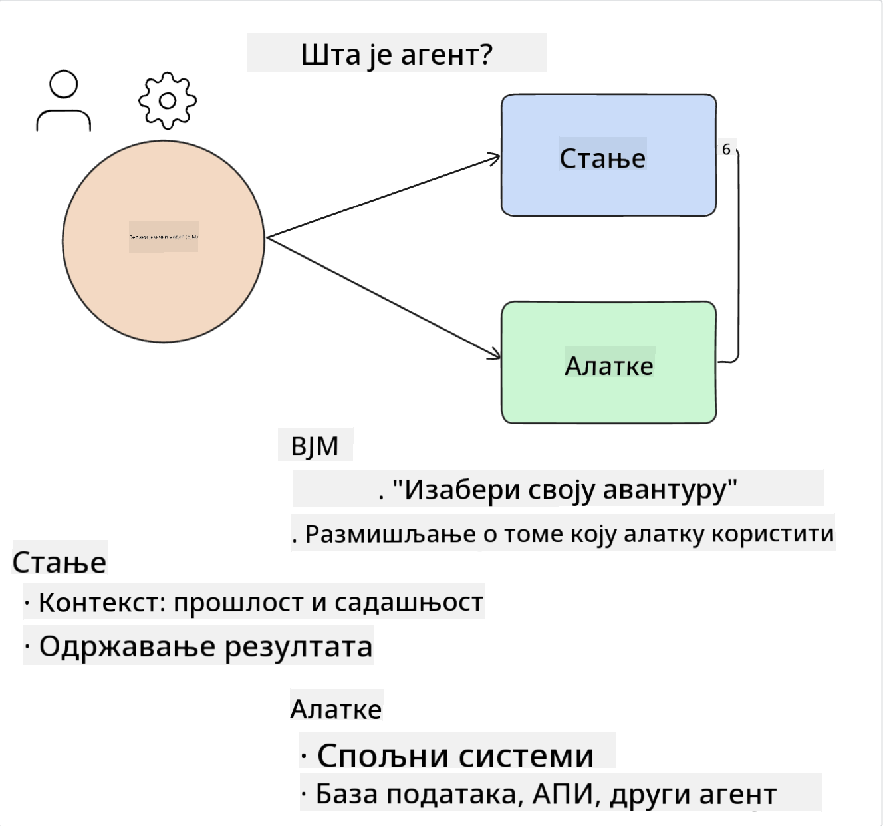
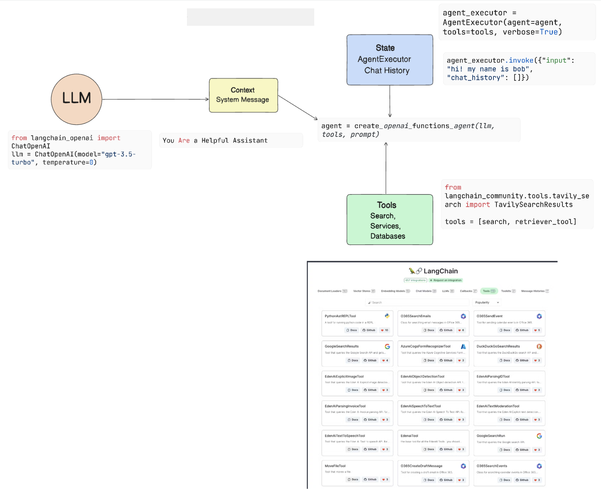
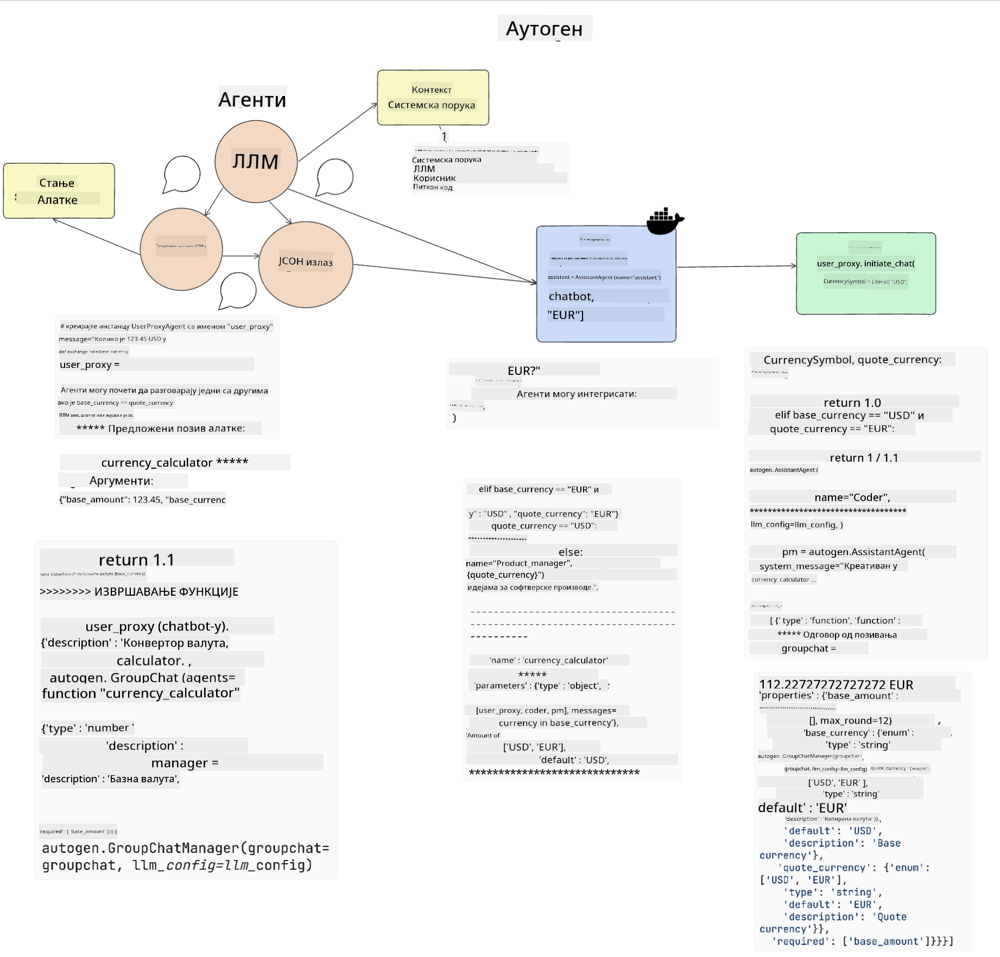

<!--
CO_OP_TRANSLATOR_METADATA:
{
  "original_hash": "11f03c81f190d9cbafd0f977dcbede6c",
  "translation_date": "2025-07-09T17:31:59+00:00",
  "source_file": "17-ai-agents/README.md",
  "language_code": "sr"
}
-->
[](https://aka.ms/gen-ai-lesson17-gh?WT.mc_id=academic-105485-koreyst)

## Увод

AI агенти представљају узбудљив развој у генеративној вештачкој интелигенцији, омогућавајући великим језичким моделима (LLM) да еволуирају из асистената у агенте способне за извођење радњи. Okviri за AI агенте омогућавају програмерима да креирају апликације које дају LLM приступ алатима и управљању стањем. Ови оквири такође побољшавају видљивост, омогућавајући корисницима и програмерима да прате радње које LLM планира, чиме се унапређује управљање корисничким искуством.

У овој лекцији ћемо обрадити следеће теме:

- Разумевање шта је AI агент - Шта је тачно AI агент?
- Истраживање четири различита оквира за AI агенте - Шта их чини јединственим?
- Примена ових AI агената у различитим случајевима употребе - Када треба користити AI агенте?

## Циљеви учења

Након ове лекције, моћи ћете да:

- Објасните шта су AI агенти и како се могу користити.
- Разумете разлике између неких популарних оквира за AI агенте и како се разликују.
- Разумете како AI агенти функционишу како бисте могли да правите апликације са њима.

## Шта су AI агенти?

AI агенти су веома узбудљиво поље у свету генеративне вештачке интелигенције. Са овим узбуђењем понекад долази и конфузија око термина и њихове примене. Да бисмо ствари поједноставили и укључили већину алата који се односе на AI агенте, користићемо ову дефиницију:

AI агенти омогућавају великим језичким моделима (LLM) да извршавају задатке тако што им дају приступ **стању** и **алатима**.



Хајде да дефинишемо ове појмове:

**Велики језички модели** – Ово су модели који се помињу у току овог курса, као што су GPT-3.5, GPT-4, Llama-2 и други.

**Стање** – Односи се на контекст у коме LLM ради. LLM користи контекст својих претходних радњи и тренутни контекст како би усмеравао доношење одлука за наредне радње. Okviri за AI агенте омогућавају програмерима лакше одржавање овог контекста.

**Алате** – Да би завршио задатак који је корисник затражио и који је LLM испланирао, LLM треба приступ алатима. Неке примере алата могу бити база података, API, спољна апликација или чак други LLM!

Ове дефиниције ће вам пружити добру основу док будемо разматрали како се они имплементирају. Хајде да истражимо неколико различитих оквира за AI агенте:

## LangChain агенти

[LangChain агенти](https://python.langchain.com/docs/how_to/#agents?WT.mc_id=academic-105485-koreyst) су имплементација горе наведених дефиниција.

За управљање **стањем** користи уграђену функцију која се зове `AgentExecutor`. Она прихвата дефинисаног `agent` и `tools` који су му доступни.

`AgentExecutor` такође чува историју разговора како би обезбедио контекст дијалога.



LangChain нуди [каталог алата](https://integrations.langchain.com/tools?WT.mc_id=academic-105485-koreyst) који се могу увезти у вашу апликацију и којима LLM може приступити. Ове алате прави заједница и LangChain тим.

Затим можете дефинисати ове алате и проследити их `AgentExecutor`.

Видљивост је још један важан аспект када говоримо о AI агентима. Важно је да програмери апликација разумеју који алат LLM користи и зашто. Због тога је тим LangChain развио LangSmith.

## AutoGen

Следећи оквир за AI агенте који ћемо размотрити је [AutoGen](https://microsoft.github.io/autogen/?WT.mc_id=academic-105485-koreyst). Главни фокус AutoGen-а су разговори. Агенти су и **разговорљиви** и **прилагодљиви**.

**Разговорљиви** – LLM може започети и наставити разговор са другим LLM-ом како би завршио задатак. Ово се постиже креирањем `AssistantAgents` и давањем специфичне системске поруке.

```python

autogen.AssistantAgent( name="Coder", llm_config=llm_config, ) pm = autogen.AssistantAgent( name="Product_manager", system_message="Creative in software product ideas.", llm_config=llm_config, )

```

**Прилагодљиви** – Агенти могу бити дефинисани не само као LLM, већ и као корисник или алат. Као програмер, можете дефинисати `UserProxyAgent` који је задужен за интеракцију са корисником ради добијања повратних информација у извршењу задатка. Ове повратне информације могу наставити извршење задатка или га зауставити.

```python
user_proxy = UserProxyAgent(name="user_proxy")
```

### Стање и алати

Да би мењао и управљао стањем, асистент агент генерише Python код за извршење задатка.

Ево примера процеса:



#### LLM дефинисан системском поруком

```python
system_message="For weather related tasks, only use the functions you have been provided with. Reply TERMINATE when the task is done."
```

Ова системска порука усмерава овај конкретни LLM ка функцијама које су релевантне за његов задатак. Запамтите, са AutoGen-ом можете имати више дефинисаних AssistantAgents са различитим системским порукама.

#### Разговор покреће корисник

```python
user_proxy.initiate_chat( chatbot, message="I am planning a trip to NYC next week, can you help me pick out what to wear? ", )

```

Ова порука од user_proxy (човек) покреће процес агента да истражи могуће функције које треба да изврши.

#### Функција се извршава

```bash
chatbot (to user_proxy):

***** Suggested tool Call: get_weather ***** Arguments: {"location":"New York City, NY","time_periond:"7","temperature_unit":"Celsius"} ******************************************************** --------------------------------------------------------------------------------

>>>>>>>> EXECUTING FUNCTION get_weather... user_proxy (to chatbot): ***** Response from calling function "get_weather" ***** 112.22727272727272 EUR ****************************************************************

```

Када се почетни разговор обради, агент ће послати предлог алата који треба позвати. У овом случају, то је функција `get_weather`. У зависности од ваше конфигурације, ова функција може бити аутоматски извршена и прочитана од стране агента или извршена на основу корисничког уноса.

Можете пронаћи листу [AutoGen примера кода](https://microsoft.github.io/autogen/docs/Examples/?WT.mc_id=academic-105485-koreyst) за даље истраживање како започети са изградњом.

## Taskweaver

Следећи оквир агента који ћемо истражити је [Taskweaver](https://microsoft.github.io/TaskWeaver/?WT.mc_id=academic-105485-koreyst). Познат је као "code-first" агент јер уместо да ради искључиво са `strings`, може радити са DataFrame-овима у Python-у. Ово постаје изузетно корисно за задатке анализе и генерисања података. То могу бити ствари као што су креирање графикона и дијаграма или генерисање случајних бројева.

### Стање и алати

За управљање стањем разговора, TaskWeaver користи концепт `Planner`-а. `Planner` је LLM који узима захтев од корисника и мапира задатке који треба да се заврше да би се испунио тај захтев.

Да би завршио задатке, `Planner` има приступ скупу алата који се зову `Plugins`. То могу бити Python класе или општи интерпретер кода. Ови плагини се чувају као уграђени подаци (embeddings) како би LLM боље претраживао одговарајући плагин.


Ево примера плагина за детекцију аномалија:

```python
class AnomalyDetectionPlugin(Plugin): def __call__(self, df: pd.DataFrame, time_col_name: str, value_col_name: str):
```

Код се верификује пре извршења. Још једна функција за управљање контекстом у Taskweaver-у је `experience`. Experience омогућава да се контекст разговора чува дугорочно у YAML фајлу. Ово се може конфигурисати тако да LLM временом напредује у одређеним задацима, под условом да има приступ претходним разговорима.

## JARVIS

Последњи оквир агента који ћемо истражити је [JARVIS](https://github.com/microsoft/JARVIS?tab=readme-ov-file?WT.mc_id=academic-105485-koreyst). Једна од јединствених карактеристика JARVIS-а је што користи LLM за управљање `стањем` разговора, док су `алати` други AI модели. Сваки од тих AI модела је специјализован за одређене задатке као што су детекција објеката, транскрипција или описивање слика.


LLM, као модел опште намене, прима захтев од корисника и идентификује конкретан задатак и све аргументе/подаци потребне за извршење задатка.

```python
[{"task": "object-detection", "id": 0, "dep": [-1], "args": {"image": "e1.jpg" }}]
```

Затим LLM форматира захтев на начин који специјализовани AI модел може да интерпретира, као што је JSON. Када AI модел врати своју предикцију на основу задатка, LLM прими одговор.

Ако је потребно више модела за извршење задатка, LLM ће такође интерпретирати одговоре тих модела пре него што их комбинује и генерише одговор кориснику.

Пример испод показује како би ово функционисало када корисник тражи опис и број објеката на слици:

## Задатак

Да бисте наставили учење о AI агентима, можете направити са AutoGen-ом:

- Апликацију која симулира пословни састанак различитих одељења у образовном стартапу.
- Креирајте системске поруке које воде LLM у разумевању различитих персона и приоритета, и омогућите кориснику да представи нову идеју за производ.
- LLM би затим требао генерисати праћења питања од сваког одељења како би се прецизирала и унапредила презентација и идеја за производ.

## Учење овде не престаје, наставите путовање

Након завршетка ове лекције, погледајте нашу [колекцију за учење генеративне AI](https://aka.ms/genai-collection?WT.mc_id=academic-105485-koreyst) да бисте наставили да унапређујете своје знање о генеративној вештачкој интелигенцији!

**Одрицање од одговорности**:  
Овај документ је преведен коришћењем AI услуге за превођење [Co-op Translator](https://github.com/Azure/co-op-translator). Иако се трудимо да превод буде тачан, молимо вас да имате у виду да аутоматски преводи могу садржати грешке или нетачности. Оригинални документ на његовом изворном језику треба сматрати ауторитетним извором. За критичне информације препоручује се професионални људски превод. Нисмо одговорни за било каква неспоразума или погрешна тумачења која произилазе из коришћења овог превода.